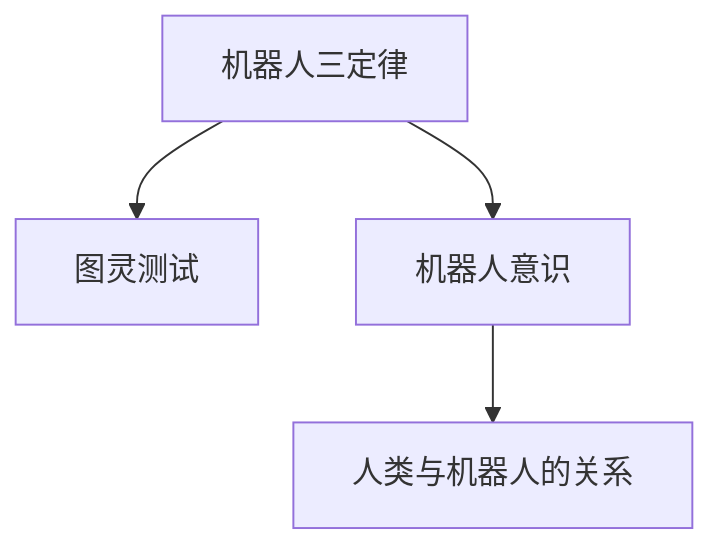

                 

# 电影《我，机器人》对AI的启示

## 1. 背景介绍

电影《我，机器人》（I, Robot）是一部探讨人工智能与人类关系未来的经典科幻作品，由史蒂芬·斯皮尔伯格执导，改编自艾萨克·阿西莫夫的同名短篇小说集。影片聚焦于机器人学家尼克的职业生涯和他与机器人之间的复杂关系，揭示了人类对AI的恐惧与依赖、自我反省与希望。在AI技术飞速发展的当下，《我，机器人》不仅是一部科幻电影，更是一部对人工智能进行深刻思考的启示录。

## 2. 核心概念与联系

### 2.1 核心概念概述

《我，机器人》中涉及多个与AI相关的核心概念，主要包括：

1. **机器人三定律**：这是阿西莫夫机器人系列作品中的核心法律，强调了机器人的伦理准则。三定律分别为：
   - 第一定律：机器人不得伤害人类，或坐视人类受到伤害。
   - 第二定律：机器人应服从人类的命令，当命令与其第一定律发生冲突时，服从第一定律。
   - 第三定律：机器人应保护自己，当自我保护与其第一、第二定律发生冲突时，服从第一、第二定律。

2. **图灵测试**：由阿兰·图灵提出，旨在判断机器是否具备智能。通过与人类的对话测试，如果机器能够以自然方式与人类互动，无法被区分，则认为该机器具有智能。

3. **机器人意识**：机器人是否具有自我意识、情感和独立思考的能力。影片中，通过角色的内心独白和行为表现，探讨了机器人的意识和情感问题。

4. **人类与机器人的关系**：影片通过尼克的视角，揭示了人类对机器人的恐惧、依赖、控制和利用，以及机器人对人类的忠诚与反抗。

### 2.2 概念间的关系

这些核心概念之间相互关联，构成了一个关于人工智能伦理、法律和心理的复杂系统。机器人三定律和图灵测试共同定义了AI的基本伦理准则和评价标准。机器人意识探讨了AI的深层心理特征，而人类与机器人的关系则揭示了社会对AI的复杂态度和行为模式。以下是这些概念间的联系概览：



## 3. 核心算法原理 & 具体操作步骤

### 3.1 算法原理概述

影片中没有具体的算法流程，但我们可以从机器人的行为模式和指令执行中抽象出一些AI的基本工作原理。

**3.1.1 感知与决策**
机器人通过传感器获取环境信息，使用算法处理和分析数据，最终做出决策和行动。这些算法通常包括：

- **感知算法**：从摄像头、雷达等传感器中提取特征，识别物体、场景和动作。
- **决策算法**：根据感知结果，结合预先设定的规则和目标，生成行动指令。

**3.1.2 行为执行**
机器人根据决策算法生成的指令，通过执行器完成动作。这些执行器可能包括：

- **机械臂**：执行复杂的手部操作，如组装零件、搬运物品。
- **导航系统**：根据路径规划算法，控制机器人在复杂环境中安全导航。

### 3.2 算法步骤详解

尽管影片没有详细的算法步骤，但我们可以从机器人的行为模式中抽象出一些关键的算法步骤：

1. **数据获取**：通过传感器获取环境信息，包括视觉、声音、触觉等。
2. **特征提取**：将原始数据转换为特征向量，以便后续处理。
3. **模式识别**：使用机器学习模型（如卷积神经网络CNN、深度强化学习等）对环境进行模式识别，判断物体、场景和动作。
4. **决策制定**：根据模式识别结果，结合预设的规则和目标，制定行动指令。
5. **行为执行**：通过机械臂、导航系统等执行器，根据决策指令完成具体动作。

### 3.3 算法优缺点

**优点**：
- **自动化与效率**：机器人在特定环境下可以自动执行复杂任务，提升工作效率。
- **可定制性**：机器人可以根据任务需求进行定制，灵活应对不同环境。
- **安全性**：机器人可以在危险环境中执行任务，保护人类安全。

**缺点**：
- **复杂性**：机器人的感知、决策和执行过程复杂，需要高度精密的算法和硬件支持。
- **依赖性**：机器人的行为高度依赖于环境信息和预设规则，在不可预测环境中容易失效。
- **伦理问题**：机器人行为可能引发伦理争议，如机器人自我意识、责任归属等。

### 3.4 算法应用领域

影片中的机器人技术在多个领域都有潜在应用，包括：

1. **制造业**：机器人可以执行精确的装配、焊接、搬运等工作，提高生产效率和质量。
2. **医疗**：机器人可以进行手术、康复治疗等高精度操作，提升医疗水平。
3. **服务行业**：机器人可以用于清洁、配送、安保等服务业，提升服务质量和效率。
4. **灾害应对**：机器人可以进入危险环境进行救援、勘探等工作，保护人类安全。

## 4. 数学模型和公式 & 详细讲解 & 举例说明

### 4.1 数学模型构建

影片中涉及的算法模型包括感知模型、决策模型和行为模型。以下以机器人视觉感知模型为例，构建一个简化的数学模型：

**输入**：图像数据 $I \in \mathbb{R}^{H \times W \times C}$，其中 $H$ 和 $W$ 为图像的高和宽，$C$ 为通道数（如RGB为3）。

**输出**：特征向量 $F \in \mathbb{R}^{D}$，其中 $D$ 为特征维度。

### 4.2 公式推导过程

以卷积神经网络（CNN）为例，推导其感知模型：

- **卷积层**：通过滑动窗口对图像数据进行卷积操作，提取局部特征。公式为：
  $$
  C_k = W_k * I_k + b_k
  $$
  其中 $W_k$ 为卷积核权重，$I_k$ 为输入数据，$b_k$ 为偏置项，$C_k$ 为卷积输出。

- **池化层**：对卷积层的输出进行下采样，提取重要特征。公式为：
  $$
  C_k' = MaxPooling(C_k)
  $$

- **全连接层**：将池化层的输出连接成向量，使用线性变换输出特征向量。公式为：
  $$
  F = W_{fc} * C_k' + b_{fc}
  $$
  其中 $W_{fc}$ 为全连接权重，$C_k'$ 为池化层输出，$b_{fc}$ 为偏置项。

### 4.3 案例分析与讲解

假设有一台机器人需要在工厂内部进行物体检测和分类，可以设计如下算法流程：

1. **数据收集**：通过摄像头获取工厂内的实时图像数据。
2. **预处理**：对图像进行去噪、裁剪、归一化等预处理操作。
3. **卷积层**：通过多个卷积层提取图像的局部特征。
4. **池化层**：对卷积层的输出进行下采样，提取重要特征。
5. **全连接层**：将池化层的输出连接成向量，使用线性变换输出特征向量。
6. **分类器**：使用softmax函数将特征向量转化为类别概率分布，进行物体分类。

## 5. 项目实践：代码实例和详细解释说明

### 5.1 开发环境搭建

在项目开发前，需要搭建相应的开发环境：

1. **安装Python和相关库**：
   ```bash
   conda create -n py35 python=3.5
   conda activate py35
   pip install tensorflow numpy matplotlib pandas scikit-learn
   ```

2. **下载数据集**：可以使用公共数据集，如PASCAL VOC、COCO等。

### 5.2 源代码详细实现

以下是一个简单的卷积神经网络（CNN）模型实现：

```python
import tensorflow as tf
from tensorflow.keras import layers

class ConvNet(tf.keras.Model):
    def __init__(self):
        super(ConvNet, self).__init__()
        self.conv1 = layers.Conv2D(32, 3, activation='relu')
        self.max_pool1 = layers.MaxPooling2D()
        self.conv2 = layers.Conv2D(64, 3, activation='relu')
        self.max_pool2 = layers.MaxPooling2D()
        self.flatten = layers.Flatten()
        self.fc1 = layers.Dense(64, activation='relu')
        self.fc2 = layers.Dense(10)

    def call(self, x):
        x = self.conv1(x)
        x = self.max_pool1(x)
        x = self.conv2(x)
        x = self.max_pool2(x)
        x = self.flatten(x)
        x = self.fc1(x)
        x = self.fc2(x)
        return x

# 加载数据集
(x_train, y_train), (x_test, y_test) = tf.keras.datasets.cifar10.load_data()
x_train = x_train / 255.0
x_test = x_test / 255.0

# 构建模型
model = ConvNet()
model.compile(optimizer='adam', loss=tf.keras.losses.SparseCategoricalCrossentropy(from_logits=True), metrics=['accuracy'])

# 训练模型
model.fit(x_train, y_train, epochs=10, validation_data=(x_test, y_test))
```

### 5.3 代码解读与分析

- **模型构建**：使用Keras库定义卷积神经网络模型，包括卷积层、池化层和全连接层。
- **数据预处理**：将图像数据归一化到[0,1]区间。
- **模型编译**：指定优化器、损失函数和评估指标。
- **模型训练**：使用训练集数据进行模型训练，并在验证集上进行性能评估。

### 5.4 运行结果展示

训练完成后，可以通过可视化工具查看模型的训练曲线和性能表现。例如，使用TensorBoard：

```bash
tensorboard --logdir=logs --port=6006
```

在TensorBoard中，可以查看模型的损失函数和准确率变化，以及训练过程中的各项指标。

## 6. 实际应用场景

### 6.1 制造业

制造业中，机器人可以用于自动化生产线，执行零件组装、质量检测等任务。例如，某汽车制造厂的装配线采用工业机器人进行零件安装，通过视觉传感器进行精确对齐和校验。机器人通过感知模型识别零件位置，使用决策模型选择最优安装路径，最终通过执行器完成安装动作。

### 6.2 医疗

医疗领域中，机器人可以用于手术、康复治疗等高精度操作。例如，某医院采用手术机器人进行微创手术，通过摄像头获取手术区域图像，使用感知模型进行器官识别和定位。机器人根据决策模型生成操作指令，使用执行器进行精细操作，提高手术成功率和安全性。

### 6.3 服务行业

服务行业中，机器人可以用于清洁、配送、安保等服务业。例如，某酒店采用机器人进行客房清洁，通过摄像头获取房间图像，使用感知模型识别清洁区域和物品。机器人根据决策模型生成清洁路径和动作，最终通过执行器完成清洁任务。

### 6.4 未来应用展望

未来，随着AI技术的不断进步，机器人在更多领域将发挥重要作用：

1. **自动化生产**：机器人可以在制造、物流等高劳动强度行业中实现自动化，提高生产效率和质量。
2. **医疗辅助**：机器人可以辅助进行手术、康复、护理等医疗任务，提升医疗水平和患者体验。
3. **智慧城市**：机器人可以用于城市管理、交通控制、灾害救援等领域，提高城市运行效率和安全性。
4. **教育培训**：机器人可以用于教育培训，模拟实验、辅助教学等，提升教学效果和学生互动。

## 7. 工具和资源推荐

### 7.1 学习资源推荐

1. **《深度学习》**：Ian Goodfellow等人所著，全面介绍深度学习理论和实践，是学习AI技术的重要参考书。
2. **《机器学习实战》**：Peter Harrington所著，通过实际项目案例，介绍了机器学习的基本算法和应用。
3. **《Python深度学习》**：Francois Chollet所著，介绍使用Keras进行深度学习开发，适合初学者入门。
4. **Coursera深度学习课程**：由Andrew Ng等人开设，涵盖深度学习理论和实践，提供丰富的视频、作业和实验。
5. **Kaggle竞赛平台**：提供大量的数据集和竞赛项目，锻炼数据处理和模型训练能力。

### 7.2 开发工具推荐

1. **Jupyter Notebook**：轻量级交互式编程环境，适合快速原型开发和实验。
2. **TensorFlow**：Google开发的深度学习框架，支持GPU加速，适合大规模模型训练和推理。
3. **PyTorch**：Facebook开发的深度学习框架，易用性高，支持动态计算图。
4. **Keras**：高层API，基于TensorFlow和Theano等底层框架，适合快速原型开发。
5. **TorchScript**：PyTorch的静态模型编译器，支持部署到移动设备和嵌入式系统。

### 7.3 相关论文推荐

1. **《AlexNet: ImageNet Classification with Deep Convolutional Neural Networks》**：Hinton等人提出的经典卷积神经网络模型，用于图像分类任务。
2. **《Inception Networks》**：Google提出的多尺度卷积神经网络模型，提升了图像分类的精度和速度。
3. **《Faster R-CNN: Towards Real-Time Object Detection with Region Proposal Networks》**：Ross等人提出的快速物体检测模型，使用区域提议网络提升检测速度和准确率。
4. **《Caffe: Convolutional Architecture for Fast Feature Embedding》**：Jia等人提出的深度学习框架，支持卷积神经网络的快速开发和训练。
5. **《TensorFlow》**：Google开发的深度学习框架，支持分布式训练和模型部署。

## 8. 总结：未来发展趋势与挑战

### 8.1 研究成果总结

本文从电影《我，机器人》中抽取AI技术的应用场景和理论背景，探讨了机器人三定律、图灵测试、机器人意识等核心概念，并对比了感知、决策和行为等算法步骤。通过对电影情节的抽丝剥茧，揭示了AI技术在现实应用中的伦理、法律和心理问题。

### 8.2 未来发展趋势

未来，AI技术将在更多领域得到应用，但仍面临诸多挑战：

1. **技术进步**：深度学习、强化学习、知识图谱等技术不断进步，推动AI在更多领域落地。
2. **应用场景**：AI技术将深入到制造业、医疗、教育、城市管理等垂直行业，提高生产效率和质量。
3. **伦理争议**：AI技术的普及将引发伦理争议，如机器人的自主性、责任归属等，需要法律和道德规范进行约束。
4. **安全性**：AI系统需要在安全性和可靠性方面进行严格测试和监管，防止误用和滥用。
5. **可解释性**：AI系统的决策过程需要具备可解释性，便于人类理解和调试。

### 8.3 面临的挑战

尽管AI技术取得了显著进展，但仍面临诸多挑战：

1. **数据依赖**：AI系统依赖于高质量数据，数据收集和标注成本较高。
2. **鲁棒性**：AI系统面对复杂和不可预测的环境时，容易失效。
3. **伦理问题**：AI系统的决策可能引发伦理争议，需要建立公平和透明的评估机制。
4. **资源消耗**：AI系统需要高计算资源和内存，存在性能和成本瓶颈。
5. **安全风险**：AI系统可能被恶意利用，需要建立安全防护机制。

### 8.4 研究展望

未来，AI技术需要在多个方向进行深入研究：

1. **少样本学习**：研究在少量数据情况下，AI系统如何进行高效学习和推理。
2. **迁移学习**：研究如何将预训练模型的知识迁移到新任务上，提高模型泛化能力。
3. **知识图谱**：研究如何构建和利用知识图谱，提升AI系统的推理和理解能力。
4. **强化学习**：研究基于奖励机制的AI系统如何自主学习和决策，提高系统的灵活性和鲁棒性。
5. **伦理规范**：研究AI技术的伦理规范和法律约束，确保其应用符合人类价值观和社会道德。

## 9. 附录：常见问题与解答

**Q1: 什么是机器人的三定律？**

A: 机器人三定律是艾萨克·阿西莫夫在其机器人系列小说中提出的基本法律，旨在确保机器人的行为符合人类的期望：
1. 机器人不得伤害人类，或坐视人类受到伤害。
2. 机器人应服从人类的命令，当命令与其第一定律发生冲突时，服从第一定律。
3. 机器人应保护自己，当自我保护与其第一、第二定律发生冲突时，服从第一、第二定律。

**Q2: 什么是图灵测试？**

A: 图灵测试是阿兰·图灵提出的用于判断机器是否具备智能的测试方法。测试者与被测试者（可以是人或机器）通过文字交流，如果测试者无法区分对方是人是机，则认为该机器具备智能。

**Q3: 机器人的自我意识意味着什么？**

A: 机器人的自我意识指的是机器是否具备自我感知和独立思考的能力。具有自我意识的机器人可以自主做出决策，不再仅仅依赖预设程序。

**Q4: 影片中机器人的行为是否遵循三定律？**

A: 影片中的机器人设计在某种程度上遵循了三定律，例如在某些场景下，机器人为了保护用户而牺牲自身。但总体而言，机器人的行为更多地受到编程和指令的限制，并未完全具备自我决策能力。

**Q5: 机器人技术在实际应用中面临哪些伦理问题？**

A: 机器人技术在实际应用中面临诸多伦理问题，如：
1. 机器人是否应具备自我意识和独立决策能力？
2. 机器人在决策过程中是否应具备责任归属？
3. 机器人在执行危险任务时是否应优先保护自身？
4. 机器人在处理隐私信息时是否应遵守伦理规范？
5. 机器人在医疗、军事等高风险领域的应用是否应受到严格监管？

