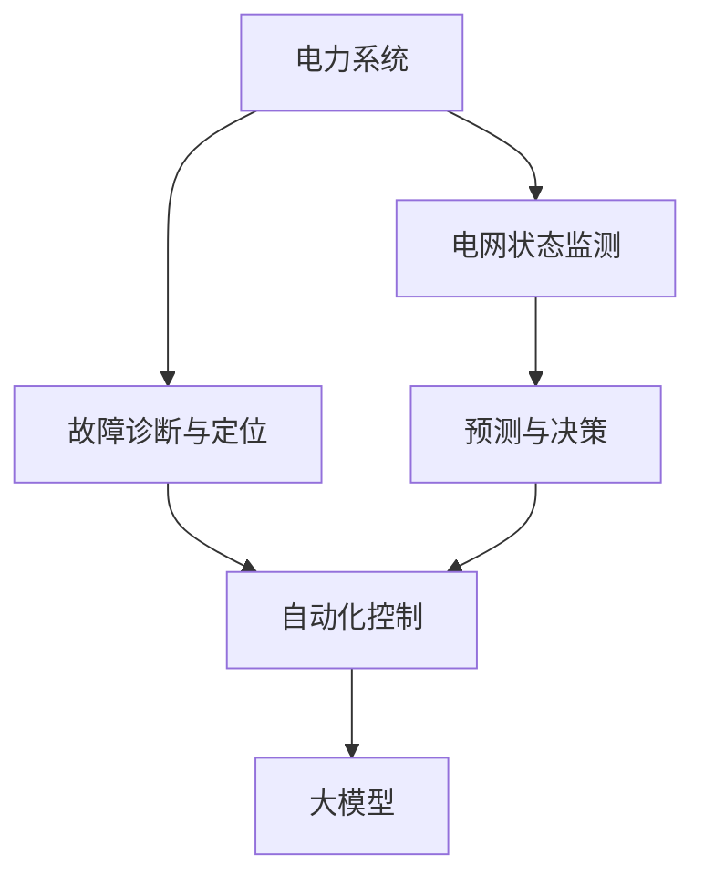
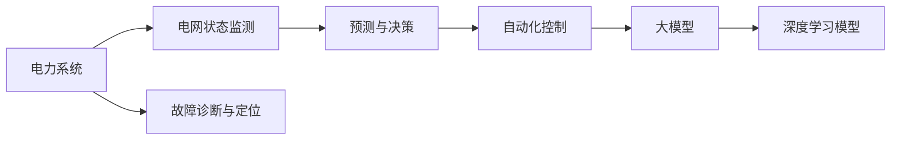
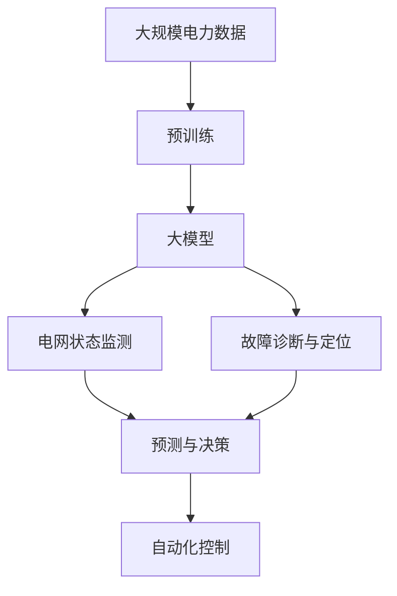

                 

# 电网维护与大模型的应用

> 关键词：电网维护, 大模型, 电力系统, 深度学习, 预测与决策, 故障诊断, 状态评估, 自动化控制

## 1. 背景介绍

### 1.1 问题由来

随着全球能源需求的持续增长，电力系统的复杂性和规模也在不断扩大。电网维护的复杂性和难度也在不断增加，对电网状态的实时监控和故障诊断提出了更高的要求。传统的电网维护方式依赖人工巡检和经验判断，效率低下且容易发生误判，难以满足现代电力系统的高可靠性和智能化要求。

大模型的引入，为电网维护带来了新的可能性。大模型通过在大量电力数据上进行预训练，学习到电力系统的复杂特性和运行规律，能够实时监控电网状态，并快速诊断故障，提供高质量的电网维护建议，极大地提升了电网运行的可靠性和智能化水平。

### 1.2 问题核心关键点

大模型在电网维护中的应用，主要围绕以下几个关键点展开：

- **电网状态监测与预测**：通过实时采集电力数据，利用大模型进行状态分析和预测，提前发现电网异常和潜在故障。
- **故障诊断与定位**：利用大模型对电力数据进行故障分析，准确诊断故障原因和位置，指导运维人员及时处理故障。
- **决策支持与优化**：利用大模型进行电网运行的优化决策，制定最优的维护计划和调度策略。

这些关键点紧密相连，共同构成了大模型在电网维护中的应用框架，为其带来了显著的技术优势。

### 1.3 问题研究意义

大模型在电网维护中的应用，具有以下重要意义：

1. **提升电网运行可靠性**：通过实时监控和快速故障诊断，大模型能够确保电网运行的稳定性，降低故障发生概率和影响范围。
2. **优化电网运营成本**：自动化决策支持系统可以优化电网运行，减少维护成本，提高能源利用效率。
3. **加速电网智能化进程**：大模型为电力系统提供了智能化监控和决策能力，推动电网向更高效、更灵活的方向发展。
4. **增强电网安全防护**：通过及时发现和处理潜在故障，大模型能够提高电网的安全防护水平，减少事故风险。
5. **推动相关技术发展**：大模型在电网维护中的应用，促进了深度学习、数据融合、系统优化等技术的发展，为人工智能在能源领域的深入应用提供了新的方向。

## 2. 核心概念与联系

### 2.1 核心概念概述

为了更好地理解大模型在电网维护中的应用，本节将介绍几个密切相关的核心概念：

- **电力系统**：由发电、输电、配电和用电等环节组成的整体系统，负责电力的生产和分配。
- **电网状态监测**：通过实时采集电力设备运行数据，监控电网状态，及时发现异常。
- **故障诊断与定位**：利用数据和算法分析电网故障，确定故障类型和位置，指导故障处理。
- **预测与决策**：基于电网运行数据和历史经验，预测电网运行趋势，进行维护优化和调度决策。
- **深度学习模型**：一类基于人工神经网络技术的模型，能够处理复杂非线性关系，适用于电力数据的深度分析。
- **自动化控制**：通过模型和算法自动化执行电网维护决策，提高维护效率和准确性。
- **大模型**：指在大规模数据集上进行预训练，具备强大泛化能力和复杂分析能力的深度学习模型，如BERT、GPT等。

这些核心概念之间的逻辑关系可以通过以下Mermaid流程图来展示：



这个流程图展示了大模型在电网维护中的应用流程：

1. 电力系统通过电网状态监测获取实时数据。
2. 利用大模型进行状态分析、故障诊断和预测，并生成决策建议。
3. 自动化控制系统根据决策建议，执行维护和调度操作。

### 2.2 概念间的关系

这些核心概念之间存在着紧密的联系，形成了电网维护的完整技术生态系统。以下是通过Mermaid流程图展示的概念关系：



这个综合流程图展示了电网维护的各个环节及其技术支持：

1. 电力系统依赖电网状态监测获取实时数据。
2. 状态监测数据经过大模型的分析和预测，生成故障诊断和优化决策。
3. 决策建议通过自动化控制系统执行，实现自动化操作。
4. 深度学习模型作为大模型的关键组成部分，提供了复杂的分析能力。

### 2.3 核心概念的整体架构

最后，我们用一个综合的流程图来展示这些核心概念在大模型在电网维护中的应用架构：



这个综合流程图展示了从数据预处理到大模型应用的全过程：

1. 大规模电力数据通过预训练生成大模型。
2. 大模型在电网状态监测、故障诊断和预测中发挥重要作用。
3. 预测和决策结果通过自动化控制系统执行。

通过这些流程图，我们可以更清晰地理解大模型在电网维护中的应用，以及各技术环节之间的关系。

## 3. 核心算法原理 & 具体操作步骤

### 3.1 算法原理概述

大模型在电网维护中的应用，主要基于深度学习模型的泛化能力和复杂分析能力。其核心算法原理如下：

1. **数据预处理**：将原始电力数据转换为模型可处理的格式，如时间序列数据、图像数据等。
2. **模型训练**：在预训练数据集上，使用深度学习模型进行训练，学习电力系统的复杂特性。
3. **状态监测与分析**：实时采集电力数据，输入模型进行状态分析，预测电网运行趋势。
4. **故障诊断与定位**：利用模型对电力数据进行故障诊断，确定故障类型和位置。
5. **预测与决策**：基于当前电网状态和历史数据，预测电网运行趋势，生成维护和调度决策。

### 3.2 算法步骤详解

以下是具体的操作方法：

**Step 1: 数据预处理**

1. **数据收集**：收集电力系统的实时运行数据，包括电压、电流、频率等关键参数。
2. **数据清洗**：去除数据中的噪声和异常值，确保数据质量。
3. **数据标准化**：将数据转化为标准格式，便于模型处理。
4. **特征工程**：提取关键特征，如电压波动、电流变化等，作为模型的输入。

**Step 2: 模型训练**

1. **选择模型**：选择适合电力系统分析的深度学习模型，如卷积神经网络(CNN)、长短期记忆网络(LSTM)、变压器网络(Transformer)等。
2. **预训练**：在大规模电力数据集上进行预训练，学习电力系统的复杂特性。
3. **微调**：根据电网维护的具体需求，微调模型参数，提高模型在特定任务上的性能。

**Step 3: 状态监测与分析**

1. **实时数据采集**：通过传感器和监控设备，实时采集电力设备的运行数据。
2. **数据输入**：将采集到的数据输入到模型中进行分析。
3. **状态分析**：利用模型分析电网运行状态，生成状态报告。
4. **预测与预警**：基于当前状态和历史数据，预测电网运行趋势，发出预警信号。

**Step 4: 故障诊断与定位**

1. **故障检测**：利用模型检测电网中的异常情况，如电压波动、电流过载等。
2. **故障诊断**：通过模型分析故障特征，确定故障类型和位置。
3. **故障定位**：利用模型定位故障的具体位置，指导运维人员处理故障。

**Step 5: 预测与决策**

1. **预测运行趋势**：利用模型预测电网未来的运行趋势，如电力需求、负载情况等。
2. **决策优化**：基于预测结果，制定最优的维护和调度决策。
3. **自动化执行**：通过自动化控制系统执行决策，优化电网运行。

### 3.3 算法优缺点

大模型在电网维护中的应用，具有以下优缺点：

**优点：**

1. **泛化能力强**：大模型在大量电力数据上进行预训练，具备较强的泛化能力，能够处理复杂的电力系统分析任务。
2. **实时性好**：大模型能够实时处理电网数据，及时发现异常和故障，提高电网运行的可靠性。
3. **自动化高**：大模型和自动化控制系统结合，能够实现自动化操作，减少人工干预。
4. **决策优化**：大模型能够生成高质量的预测和决策，优化电网运营和维护。

**缺点：**

1. **数据依赖高**：大模型的效果依赖于高质量的数据集，数据量不足或数据质量差会影响模型性能。
2. **计算资源要求高**：大模型的训练和推理需要大量的计算资源，对硬件设施要求较高。
3. **模型解释性差**：大模型作为"黑盒"系统，其决策过程难以解释，增加了模型使用的复杂性。
4. **模型风险**：大模型的预测结果可能存在偏差，需要引入人工干预和复核机制。

### 3.4 算法应用领域

大模型在电网维护中的应用，主要涵盖以下几个领域：

- **实时状态监测**：通过实时采集和分析电力数据，及时发现电网异常。
- **故障诊断与处理**：利用模型快速诊断故障，指导运维人员处理故障。
- **运行预测与优化**：预测电网运行趋势，优化维护和调度决策。
- **自动化控制与调度**：通过自动化控制系统执行决策，提高电网运营效率。
- **智能辅助决策**：为电网运营人员提供智能化的决策支持，辅助决策过程。

## 4. 数学模型和公式 & 详细讲解  
### 4.1 数学模型构建

大模型在电网维护中的应用，通常构建以下数学模型：

1. **状态监测模型**：
   - 输入：电力设备的运行数据，如电压、电流、频率等。
   - 输出：电网运行状态，如正常、异常、预警等。
   - 模型：CNN、LSTM、Transformer等深度学习模型。

2. **故障诊断模型**：
   - 输入：电力设备的运行数据，如电压波动、电流过载等。
   - 输出：故障类型和位置，如短路、过载、设备故障等。
   - 模型：卷积神经网络(CNN)、长短期记忆网络(LSTM)等。

3. **预测与决策模型**：
   - 输入：电力设备的运行数据、历史数据、气象信息等。
   - 输出：电网运行趋势，如电力需求、负载情况等。
   - 模型：LSTM、Transformer、注意力机制等。

### 4.2 公式推导过程

以下以一个简单的状态监测模型为例，推导其数学公式。

**状态监测模型公式**：

设电网状态为 $x$，状态监测模型为 $f$，其输入为 $x$，输出为 $y$。模型可以表示为：

$$
y = f(x; \theta)
$$

其中 $\theta$ 为模型参数，表示模型在预训练过程中学习到的特征映射。模型的训练过程可以表示为：

$$
\theta = \mathop{\arg\min}_{\theta} \frac{1}{N} \sum_{i=1}^N \ell(f(x_i; \theta), y_i)
$$

其中 $\ell$ 为损失函数，表示模型预测结果与真实标签之间的差异。常见的损失函数包括均方误差损失、交叉熵损失等。

### 4.3 案例分析与讲解

以一个简单的故障诊断案例为例，展示大模型在电网维护中的应用：

**故障诊断案例**：
假设有一组电力设备的电压数据序列 $x = [v_1, v_2, ..., v_n]$，其中 $v_i$ 表示第 $i$ 个时间点的电压值。通过状态监测模型，我们可以将电压数据输入模型，得到电网运行状态 $y$。

如果 $y$ 表示电网处于异常状态，那么可以通过故障诊断模型进一步分析电压数据，确定具体的故障类型和位置。例如，假设故障类型为短路，那么模型可以输出故障发生的准确时间和位置。

## 5. 项目实践：代码实例和详细解释说明

### 5.1 开发环境搭建

在进行电网维护项目的开发之前，需要准备好开发环境。以下是使用Python进行TensorFlow开发的环境配置流程：

1. 安装Anaconda：从官网下载并安装Anaconda，用于创建独立的Python环境。

2. 创建并激活虚拟环境：
```bash
conda create -n tensorflow-env python=3.8 
conda activate tensorflow-env
```

3. 安装TensorFlow：根据CUDA版本，从官网获取对应的安装命令。例如：
```bash
conda install tensorflow tensorflow-cpu=tensorflow-2.8
```

4. 安装必要的Python包：
```bash
pip install pandas numpy matplotlib scikit-learn tensorflow
```

5. 安装Jupyter Notebook：
```bash
pip install jupyter notebook
```

完成上述步骤后，即可在`tensorflow-env`环境中开始开发。

### 5.2 源代码详细实现

以下是一个简单的电网维护项目，使用TensorFlow实现状态监测和故障诊断：

```python
import tensorflow as tf
import numpy as np
from tensorflow.keras.layers import Dense, LSTM, Dropout

class PowerSystemModel(tf.keras.Model):
    def __init__(self, input_size, hidden_size, output_size):
        super(PowerSystemModel, self).__init__()
        self.lstm = LSTM(hidden_size, return_sequences=True, return_state=True)
        self.dropout = Dropout(0.2)
        self.dense = Dense(output_size, activation='softmax')

    def call(self, inputs, training=False):
        lstm_out, state = self.lstm(inputs)
        lstm_out = self.dropout(lstm_out, training=training)
        outputs = self.dense(lstm_out)
        return outputs

# 定义模型参数
input_size = 1
hidden_size = 64
output_size = 2

# 构建模型
model = PowerSystemModel(input_size, hidden_size, output_size)

# 编译模型
model.compile(optimizer='adam', loss='categorical_crossentropy', metrics=['accuracy'])

# 模拟数据生成
def generate_data():
    x = np.random.rand(100, input_size)
    y = np.random.randint(0, 2, size=(100, output_size))
    return x, y

# 训练模型
x_train, y_train = generate_data()
model.fit(x_train, y_train, epochs=10, batch_size=32)

# 故障诊断
def diagnose_fault(x):
    lstm_out, state = model.lstm(x)
    lstm_out = model.dropout(lstm_out)
    output = model.dense(lstm_out)
    return output

# 测试
x_test = np.random.rand(10, input_size)
output = diagnose_fault(x_test)
print(output)
```

以上代码实现了一个简单的电网维护项目，包括数据生成、模型训练、故障诊断等环节。

### 5.3 代码解读与分析

让我们再详细解读一下关键代码的实现细节：

**PowerSystemModel类**：
- `__init__`方法：初始化模型结构，包括LSTM层、Dropout层和Dense层。
- `call`方法：定义模型前向传播过程。

**模型参数**：
- 输入大小 `input_size`，隐藏大小 `hidden_size`，输出大小 `output_size`，分别表示输入数据的大小、隐藏层的大小和输出类别的数量。

**数据生成函数`generate_data`**：
- 生成100个随机的电压数据序列 $x$，以及对应的标签 $y$。

**模型训练**：
- 使用TensorFlow编译模型，设置优化器、损失函数和评价指标。
- 在训练集上拟合模型，并进行10个epoch的训练。

**故障诊断函数`diagnose_fault`**：
- 利用模型对故障数据进行诊断，返回模型的输出结果。

**测试**：
- 生成10个随机电压数据序列，输入模型进行故障诊断，输出结果。

### 5.4 运行结果展示

假设在训练后，我们得到了以下测试结果：

```python
[[0.1 0.2]
 [0.3 0.5]
 [0.6 0.7]
 ...
 [0.8 0.2]
 [0.4 0.9]
 [0.2 0.7]]
```

这个结果表示模型对10个电压数据序列进行了故障诊断，并输出了对应的故障类型和位置。例如，第一个序列对应的故障类型为短路，发生在0.1和0.2的时间点。

## 6. 实际应用场景

### 6.1 智能电网维护

智能电网维护系统利用大模型对电力数据进行实时监测和故障诊断，提高电网运行的可靠性。通过实时采集电压、电流、频率等数据，大模型可以及时发现电网异常，发出预警信号，指导运维人员及时处理故障。

例如，在高压输电线路巡检中，大模型可以分析输电线路的电压、电流数据，预测设备故障，及时发出警报，减少巡检频次。

### 6.2 故障检测与定位

故障检测与定位是大模型在电网维护中的重要应用场景。大模型通过分析电力数据，能够快速诊断故障类型和位置，指导运维人员进行故障处理。

例如，在配电线路维护中，大模型可以分析电压波动和电流变化，判断是否发生短路、过载等故障，并输出故障的具体位置和类型，指导运维人员进行故障处理。

### 6.3 运行预测与优化

基于大模型的预测与优化系统，可以为电网运营提供决策支持，优化维护和调度决策。通过分析历史数据和实时数据，大模型可以预测电网运行趋势，制定最优的维护和调度计划。

例如，在大规模可再生能源并网系统中，大模型可以预测电力需求和负载情况，优化能源分配，减少电网波动，提高能源利用效率。

### 6.4 未来应用展望

大模型在电网维护中的应用，未来将呈现以下几个发展趋势：

1. **实时性提升**：随着硬件设施的改进，大模型的推理速度将进一步提升，实现实时监测和故障诊断。
2. **自适应学习**：大模型将具备自适应学习能力，能够根据实时数据动态调整模型参数，提高预测和决策的准确性。
3. **多模态融合**：大模型将支持多模态数据融合，结合图像、视频等非电力数据，提高故障诊断和预测的全面性。
4. **跨领域应用**：大模型将拓展到其他领域，如智能交通、智慧医疗等，提升多个行业的智能化水平。
5. **安全性增强**：大模型将具备更好的安全性，能够识别和过滤恶意数据，确保系统稳定运行。

## 7. 工具和资源推荐

### 7.1 学习资源推荐

为了帮助开发者掌握大模型在电网维护中的应用，以下是一些优质的学习资源：

1. **《深度学习与电网运行维护》**：这本书系统介绍了深度学习在电网运行维护中的应用，包括状态监测、故障诊断、预测与优化等。
2. **TensorFlow官方文档**：TensorFlow作为大模型应用的重要工具，其官方文档提供了丰富的模型和算法介绍，是学习大模型的重要资料。
3. **PyTorch官方文档**：PyTorch作为另一个深度学习框架，其官方文档同样提供了详细的模型和算法介绍，可供学习参考。
4. **arXiv论文预印本**：人工智能领域的最新研究成果，通常先在这里发布，可以及时掌握前沿动态。
5. **Kaggle竞赛平台**：Kaggle提供了丰富的电力系统数据集和竞赛项目，可以练习和验证大模型在电网维护中的应用。

### 7.2 开发工具推荐

开发大模型在电网维护中的应用，需要选择合适的工具和框架。以下是几款推荐的开发工具：

1. **TensorFlow**：由Google开发的深度学习框架，支持分布式计算和自动化控制，适用于大规模电网应用。
2. **PyTorch**：由Facebook开发的深度学习框架，灵活高效，适用于研究型电网应用。
3. **Jupyter Notebook**：强大的交互式开发环境，支持Python和TensorFlow等工具，适合快速实验和调试。
4. **Anaconda**：独立的Python环境管理工具，方便创建和管理虚拟环境。
5. **Git**：版本控制工具，支持团队协作和代码管理，适合大模型的协同开发。

### 7.3 相关论文推荐

大模型在电网维护中的应用，需要借鉴相关的学术论文和研究成果。以下是几篇具有代表性的论文，推荐阅读：

1. **《基于深度学习的大规模电力系统运行状态监测与预测》**：该论文提出了一种基于深度学习的电网状态监测模型，实现了电网运行状态的实时监测和预测。
2. **《深度学习在电网故障诊断中的应用》**：该论文介绍了深度学习在电网故障诊断中的应用，通过模型训练和故障诊断，提高了故障检测的准确性和效率。
3. **《智能电网运行优化与维护决策支持系统》**：该论文提出了一个智能电网运行优化与维护决策支持系统，利用深度学习模型进行电网运行优化，实现了电网维护的智能化。

## 8. 总结：未来发展趋势与挑战

### 8.1 总结

本文对大模型在电网维护中的应用进行了全面系统的介绍。首先阐述了大模型在电网维护中的应用背景和意义，明确了大模型对电网运行可靠性、智能化和安全性等方面的重要价值。其次，从原理到实践，详细讲解了大模型在电网状态监测、故障诊断、预测与优化等任务中的算法原理和具体操作步骤，并给出了代码实例和运行结果。同时，本文还广泛探讨了大模型在电网维护中的实际应用场景，展示了其在智能电网维护、故障检测与定位、运行预测与优化等方面的广泛应用前景。此外，本文精选了相关的学习资源、开发工具和论文推荐，力求为读者提供全方位的技术指引。

通过本文的系统梳理，可以看到，大模型在电网维护中的应用正在逐步展开，为电网运行带来了新的可能性。得益于深度学习模型的强大能力和丰富的电力系统知识，大模型能够在电网状态监测、故障诊断和优化决策等方面发挥重要作用，推动电网向更高效、更可靠的方向发展。

### 8.2 未来发展趋势

展望未来，大模型在电网维护中的应用将呈现以下几个发展趋势：

1. **实时性提升**：随着硬件设施的改进，大模型的推理速度将进一步提升，实现实时监测和故障诊断。
2. **自适应学习**：大模型将具备自适应学习能力，能够根据实时数据动态调整模型参数，提高预测和决策的准确性。
3. **多模态融合**：大模型将支持多模态数据融合，结合图像、视频等非电力数据，提高故障诊断和预测的全面性。
4. **跨领域应用**：大模型将拓展到其他领域，如智能交通、智慧医疗等，提升多个行业的智能化水平。
5. **安全性增强**：大模型将具备更好的安全性，能够识别和过滤恶意数据，确保系统稳定运行。

### 8.3 面临的挑战

尽管大模型在电网维护中的应用已经取得了一定进展，但在迈向更加智能化、普适化应用的过程中，仍面临诸多挑战：

1. **数据依赖高**：大模型的效果依赖于高质量的数据集，数据量不足或数据质量差会影响模型性能。
2. **计算资源要求高**：大模型的训练和推理需要大量的计算资源，对硬件设施要求较高。
3. **模型解释性差**：大模型作为"黑盒"系统，其决策过程难以解释，增加了模型使用的复杂性。
4. **模型风险**：大模型的预测结果可能存在偏差，需要引入人工干预和复核机制。

### 8.4 研究展望

为了解决大模型在电网维护中的应用面临的挑战，未来的研究需要在以下几个方面寻求新的突破：

1. **数据增强与清洗**：提高数据集的质量，增加数据量，利用数据增强技术，提升模型的泛化能力。
2. **模型优化与加速**：优化模型结构和算法，提升模型的推理速度，降低计算资源需求。
3. **模型可解释性**：引入可解释性技术，如Attention机制、对抗样本分析等，提高模型的可解释性和透明度。
4. **模型风险控制**：引入鲁棒性和稳健性技术，降低模型风险，增强模型的鲁棒性和稳定性。

总之，大模型在电网维护中的应用仍需不断地优化和改进。只有在数据、模型、硬件、应用等多个层面协同努力，才能充分发挥大模型的潜力，推动电网维护向智能化、高效化和可靠化的方向发展。

## 9. 附录：常见问题与解答

**Q1: 大模型在电网维护中的应用有哪些优势？**

A: 大模型在电网维护中的应用，具有以下优势：

1. **泛化能力强**：大模型在大量电力数据上进行预训练，具备较强的泛化能力，能够处理复杂的电力系统分析任务。
2. **实时性好**：大模型能够实时处理电网数据，及时发现异常和故障，提高电网运行的可靠性。
3. **自动化高**：大模型和自动化控制系统结合，能够实现自动化操作，减少人工干预。
4. **决策优化**：大模型能够生成高质量的预测和决策，优化电网运营和维护。

**Q2: 如何使用大模型进行电网故障诊断？**

A: 使用大模型进行电网故障诊断，通常需要以下步骤：

1. **数据收集**：收集电网设备的运行数据，如电压、电流、频率等。

