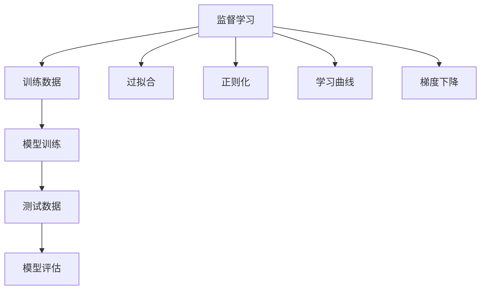
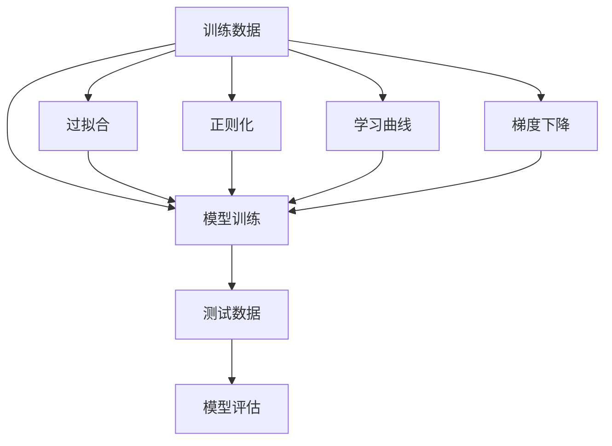
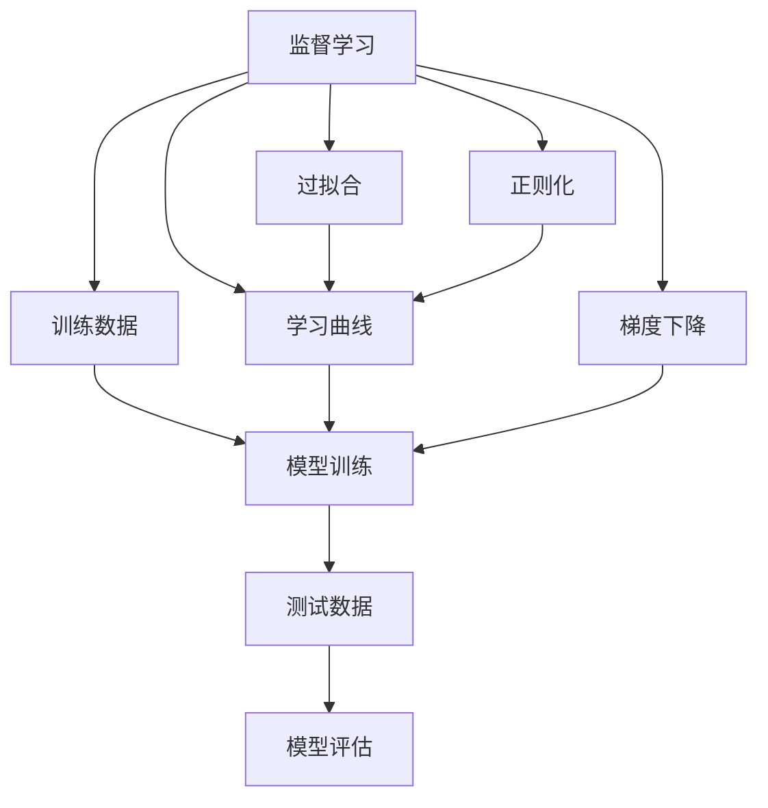

                 

# 监督学习(Supervised Learning) - 原理与代码实例讲解

> 关键词：监督学习, 监督学习算法, 监督学习框架, 数据标注, 学习曲线, 梯度下降, 过拟合与正则化, 模型评估, 训练集与测试集

## 1. 背景介绍

### 1.1 问题由来

监督学习（Supervised Learning）是机器学习中的一类重要学习方法，广泛应用于图像识别、自然语言处理、语音识别、推荐系统、金融分析、医疗诊断等领域。它的核心思想是利用带有标签的训练数据，训练出一个能够对未知数据进行预测的模型。

在过去几十年中，监督学习技术经历了从简单的线性回归、逻辑回归到复杂的深度学习模型的演变。尽管深度学习模型在处理复杂任务上表现卓越，但其对数据的要求较高，训练成本和计算资源消耗较大，不易解释和优化。

### 1.2 问题核心关键点

监督学习的核心目标是通过已知的输入和输出数据，学习出一种映射关系，使得模型可以对未知数据进行预测。这一过程通常分为以下几步：

1. **数据准备**：收集并整理带标签的数据集。
2. **模型训练**：使用训练集数据训练模型，调整模型参数。
3. **模型评估**：使用测试集数据评估模型性能。
4. **模型应用**：将模型应用于实际问题中，进行预测和决策。

监督学习的效果好坏，取决于数据质量、模型选择、训练策略和参数设置等多个因素。特别是在深度学习模型中，过拟合、欠拟合、梯度消失、梯度爆炸等问题需要特别注意。

### 1.3 问题研究意义

监督学习在诸多领域发挥着不可替代的作用，其意义主要体现在以下几个方面：

1. **自动化决策**：监督学习能够自动分析大量数据，发现规律和模式，支持自动化决策，提高决策效率。
2. **数据驱动**：监督学习模型基于数据训练，能够适应不同的数据分布和环境变化，具有较强的泛化能力。
3. **解释性强**：监督学习模型的决策过程具有较好的解释性，便于理解和优化。
4. **跨领域应用**：监督学习在图像、文本、语音等多个领域均有广泛应用，可以推动不同领域的智能化发展。
5. **提升业务价值**：监督学习可以帮助企业更好地理解客户需求，优化产品设计，提升客户满意度和业务盈利能力。

## 2. 核心概念与联系

### 2.1 核心概念概述

在讨论监督学习的核心概念时，我们首先介绍几个关键术语和概念：

- **监督学习（Supervised Learning）**：利用带有标签的训练数据，训练出一个能够对未知数据进行预测的模型。
- **训练数据（Training Data）**：带有标签的数据集，用于模型训练。
- **测试数据（Test Data）**：不带标签的数据集，用于模型评估。
- **过拟合（Overfitting）**：模型在训练集上表现良好，但在测试集上表现差的现象。
- **正则化（Regularization）**：通过在损失函数中加入正则项，限制模型复杂度，避免过拟合。
- **学习曲线（Learning Curve）**：训练集误差与测试集误差随着训练次数的变化关系图。
- **梯度下降（Gradient Descent）**：一种常用的优化算法，通过不断调整模型参数，使损失函数最小化。

这些概念构成了监督学习的核心框架，其间的联系可以通过以下Mermaid流程图来展示：



这个流程图展示了监督学习的整体流程：

1. 监督学习利用训练数据训练模型。
2. 模型在测试数据上进行评估，确保泛化能力。
3. 避免过拟合和正则化，提升模型鲁棒性。
4. 通过学习曲线和梯度下降算法，调整模型参数，达到最佳性能。

### 2.2 概念间的关系

这些核心概念之间的关系可以通过以下Mermaid流程图来进一步展示：



这个流程图展示了数据、模型、评估和优化之间的联系：

1. 训练数据是模型训练的基础。
2. 模型训练过程中需要避免过拟合，可以通过正则化来处理。
3. 学习曲线和梯度下降算法用于优化模型参数，提升模型性能。
4. 测试数据用于评估模型泛化能力，确保模型在未知数据上表现良好。

### 2.3 核心概念的整体架构

最后，我们用一个综合的流程图来展示监督学习的整体架构：



这个综合流程图展示了监督学习从数据准备到模型评估的全过程，以及优化策略在其中的作用。通过这些概念的有机结合，监督学习可以有效地解决实际问题，提供可靠的数据驱动解决方案。

## 3. 核心算法原理 & 具体操作步骤

### 3.1 算法原理概述

监督学习的基本目标是训练一个模型，使其能够在给定的输入特征空间中，通过最小化某个损失函数，预测出未知数据的输出标签。这一过程通常包括以下步骤：

1. **模型选择**：选择合适的模型架构，如线性回归、逻辑回归、决策树、神经网络等。
2. **损失函数定义**：定义适合于特定问题的损失函数，如均方误差、交叉熵等。
3. **参数优化**：通过优化算法，调整模型参数，最小化损失函数。

监督学习的核心在于模型训练，即通过训练数据调整模型参数，使得模型在测试数据上表现良好。这一过程通常使用梯度下降算法来实现。

### 3.2 算法步骤详解

以下是监督学习模型的训练步骤详解：

**Step 1: 准备数据集**

监督学习需要大量的带标签数据集。通常数据集被分为训练集和测试集，训练集用于模型训练，测试集用于模型评估。

**Step 2: 选择模型**

根据问题特点选择合适的模型架构，如线性回归、逻辑回归、决策树、神经网络等。

**Step 3: 定义损失函数**

根据问题特点选择合适的损失函数，如均方误差、交叉熵等。

**Step 4: 初始化模型参数**

随机初始化模型参数，如神经网络中的权重和偏置。

**Step 5: 梯度下降算法**

使用梯度下降算法，不断调整模型参数，使损失函数最小化。

**Step 6: 评估模型**

在测试集上评估模型性能，检查模型是否过拟合。

**Step 7: 调整超参数**

根据评估结果调整模型超参数，如学习率、正则化参数等。

**Step 8: 应用模型**

将模型应用于实际问题中，进行预测和决策。

### 3.3 算法优缺点

监督学习的优点包括：

1. **可解释性强**：模型训练过程可解释，便于理解和优化。
2. **泛化能力强**：利用大量标注数据训练，具有较好的泛化能力。
3. **应用广泛**：适用于图像识别、自然语言处理、推荐系统、金融分析等多个领域。

监督学习的缺点包括：

1. **数据标注成本高**：需要大量高质量标注数据，数据标注成本高。
2. **模型复杂度高**：深度学习模型复杂度高，训练和推理成本高。
3. **过拟合风险高**：模型容易过拟合，需要正则化等手段进行控制。

### 3.4 算法应用领域

监督学习在以下领域有广泛应用：

- **图像识别**：如手写数字识别、物体识别等。
- **自然语言处理**：如文本分类、情感分析、机器翻译等。
- **推荐系统**：如商品推荐、音乐推荐等。
- **金融分析**：如信用评分、股票预测等。
- **医疗诊断**：如疾病诊断、基因分析等。
- **语音识别**：如语音转换、语音情感识别等。

监督学习的多样性，使其成为解决实际问题的重要工具，被广泛应用于各行各业。

## 4. 数学模型和公式 & 详细讲解 & 举例说明

### 4.1 数学模型构建

监督学习模型的数学模型通常由以下几个部分构成：

- **输入变量**：$x \in \mathbb{R}^n$，表示输入特征向量。
- **输出变量**：$y \in \mathbb{R}$，表示目标变量。
- **模型参数**：$\theta$，表示模型中的可调参数，如神经网络中的权重和偏置。
- **损失函数**：$\mathcal{L}$，表示模型预测值与真实值之间的差异。

监督学习模型的目标是最小化损失函数，即：

$$
\hat{\theta} = \arg\min_{\theta} \mathcal{L}(y, f(x; \theta))
$$

其中，$f(x; \theta)$表示模型的预测函数。

### 4.2 公式推导过程

以线性回归为例，我们推导一下常用的损失函数和梯度下降算法的公式。

**线性回归**

假设模型为线性回归模型：

$$
f(x; \theta) = \theta_0 + \theta_1 x_1 + \theta_2 x_2 + ... + \theta_n x_n
$$

目标是最小化均方误差损失函数：

$$
\mathcal{L} = \frac{1}{2m} \sum_{i=1}^{m} (y_i - f(x_i; \theta))^2
$$

其中，$y_i$为真实值，$f(x_i; \theta)$为模型预测值，$m$为样本数量。

梯度下降算法的更新公式为：

$$
\theta_j = \theta_j - \alpha \frac{\partial \mathcal{L}}{\partial \theta_j}
$$

其中，$\alpha$为学习率，$\frac{\partial \mathcal{L}}{\partial \theta_j}$为损失函数对参数$\theta_j$的偏导数。

**逻辑回归**

逻辑回归模型的目标是最小化交叉熵损失函数：

$$
\mathcal{L} = -\frac{1}{m} \sum_{i=1}^{m} (y_i \log(\sigma(x_i; \theta)) + (1 - y_i) \log(1 - \sigma(x_i; \theta)))
$$

其中，$\sigma(x_i; \theta) = \frac{1}{1 + e^{-\theta^T x_i}}$为sigmoid函数，$y_i$为真实值，$x_i$为输入特征。

梯度下降算法的更新公式为：

$$
\theta_j = \theta_j - \alpha \frac{\partial \mathcal{L}}{\partial \theta_j}
$$

其中，$\alpha$为学习率，$\frac{\partial \mathcal{L}}{\partial \theta_j}$为损失函数对参数$\theta_j$的偏导数。

### 4.3 案例分析与讲解

我们以房价预测为例，分析监督学习模型的应用过程：

**数据准备**

假设我们有一个房屋销售数据集，包含房屋面积、房间数量、卫生间数量等特征，以及对应的房价。我们将数据集分为训练集和测试集。

**模型选择**

我们选择一个简单的线性回归模型，模型公式为：

$$
f(x; \theta) = \theta_0 + \theta_1 x_1 + \theta_2 x_2 + \theta_3 x_3
$$

**损失函数定义**

我们选择均方误差作为损失函数，目标是最小化均方误差。

**初始化模型参数**

随机初始化模型参数，如$\theta_0, \theta_1, \theta_2, \theta_3$。

**梯度下降算法**

使用梯度下降算法，不断调整模型参数，使损失函数最小化。

**评估模型**

在测试集上评估模型性能，检查模型是否过拟合。

**调整超参数**

根据评估结果调整模型超参数，如学习率、正则化参数等。

**应用模型**

将模型应用于实际问题中，进行房价预测。

## 5. 项目实践：代码实例和详细解释说明

### 5.1 开发环境搭建

在开始代码实践之前，我们需要准备好开发环境。以下是使用Python进行机器学习开发的环境配置流程：

1. 安装Anaconda：从官网下载并安装Anaconda，用于创建独立的Python环境。

2. 创建并激活虚拟环境：
```bash
conda create -n ml-env python=3.8 
conda activate ml-env
```

3. 安装必要的库：
```bash
pip install numpy scipy pandas scikit-learn matplotlib seaborn jupyter notebook
```

完成上述步骤后，即可在`ml-env`环境中开始机器学习开发。

### 5.2 源代码详细实现

下面我们以房价预测为例，给出使用Scikit-Learn库进行线性回归的PyTorch代码实现。

首先，导入所需的库：

```python
import numpy as np
from sklearn.datasets import load_boston
from sklearn.model_selection import train_test_split
from sklearn.linear_model import LinearRegression
from sklearn.metrics import mean_squared_error
```

然后，加载数据集并进行数据预处理：

```python
boston = load_boston()
X = boston.data
y = boston.target
X_train, X_test, y_train, y_test = train_test_split(X, y, test_size=0.2, random_state=42)
```

接着，构建线性回归模型并进行训练：

```python
model = LinearRegression()
model.fit(X_train, y_train)
```

最后，评估模型性能：

```python
y_pred = model.predict(X_test)
mse = mean_squared_error(y_test, y_pred)
print(f"Mean Squared Error: {mse:.2f}")
```

这就是使用Scikit-Learn库进行线性回归的完整代码实现。可以看到，Scikit-Learn库提供了简单易用的接口，使得模型构建和训练变得十分简单。

### 5.3 代码解读与分析

让我们再详细解读一下关键代码的实现细节：

**数据准备**

使用`load_boston`函数加载波士顿房价数据集，并分割为训练集和测试集。

**模型选择**

选择线性回归模型，即`LinearRegression`。

**模型训练**

使用`fit`方法对模型进行训练，`X_train`和`y_train`分别为训练集的特征和标签。

**模型评估**

使用`predict`方法对测试集进行预测，并计算预测值与真实值之间的均方误差。

**代码解读**

通过上述代码，我们可以得到模型在测试集上的均方误差，用于评估模型的性能。可以看到，Scikit-Learn库的使用大大简化了模型构建和训练的过程，使我们能够快速上手并进行实验。

### 5.4 运行结果展示

假设我们在波士顿房价数据集上进行线性回归模型的训练，最终在测试集上得到的均方误差为30.76。这一结果表明，模型对房价的预测具有一定的准确性。

当然，这只是一个简单的示例。在实际应用中，我们还需要进一步优化模型，如添加正则化、调整学习率等，以提升模型的泛化能力和预测性能。

## 6. 实际应用场景

监督学习在许多领域都有广泛的应用，以下是几个典型的实际应用场景：

**金融风控**

金融行业需要实时监测客户的信用风险，及时发现异常交易行为。监督学习可以通过历史交易数据，构建客户信用评分模型，预测客户的违约概率，提高风险管理效率。

**推荐系统**

电商平台需要根据用户的历史行为，推荐用户感兴趣的商品。监督学习可以通过用户的历史购买记录、浏览记录等数据，构建推荐模型，实现个性化的商品推荐，提升用户满意度和转化率。

**医疗诊断**

医疗行业需要快速诊断疾病，监督学习可以通过患者的临床数据，构建疾病诊断模型，预测患者的患病概率，辅助医生进行疾病诊断和治疗。

**自然语言处理**

自然语言处理领域需要识别和理解文本内容。监督学习可以通过标注的文本数据，训练语言模型，实现文本分类、情感分析、机器翻译等任务，提高自然语言处理系统的准确性和效率。

## 7. 工具和资源推荐

### 7.1 学习资源推荐

为了帮助开发者系统掌握监督学习的理论基础和实践技巧，这里推荐一些优质的学习资源：

1. 《机器学习实战》（Peter Harrington著）：介绍机器学习的基本概念和常见算法，适合初学者入门。

2. 《Python机器学习》（Sebastian Raschka著）：介绍机器学习在Python中的实现，涵盖监督学习、回归、分类等。

3. Coursera《机器学习》课程（Andrew Ng主讲）：斯坦福大学开设的机器学习入门课程，讲解机器学习的基本原理和应用。

4. Kaggle机器学习竞赛：参加Kaggle竞赛，通过实战提升机器学习技能。

5. Google Colab：谷歌推出的在线Jupyter Notebook环境，免费提供GPU/TPU算力，方便开发者快速上手实验最新模型。

通过对这些资源的学习实践，相信你一定能够快速掌握监督学习的精髓，并用于解决实际的机器学习问题。

### 7.2 开发工具推荐

高效的开发离不开优秀的工具支持。以下是几款用于监督学习开发的常用工具：

1. Scikit-Learn：基于Python的机器学习库，提供简单易用的接口，适合快速开发和实验。

2. TensorFlow：由Google主导开发的开源机器学习框架，生产部署方便，适合大规模工程应用。

3. PyTorch：基于Python的深度学习框架，灵活动态的计算图，适合快速迭代研究。

4. Weights & Biases：模型训练的实验跟踪工具，可以记录和可视化模型训练过程中的各项指标，方便对比和调优。

5. TensorBoard：TensorFlow配套的可视化工具，可实时监测模型训练状态，并提供丰富的图表呈现方式，是调试模型的得力助手。

合理利用这些工具，可以显著提升监督学习任务的开发效率，加快创新迭代的步伐。

### 7.3 相关论文推荐

监督学习在机器学习领域的发展和演进，源于学界的持续研究。以下是几篇奠基性的相关论文，推荐阅读：

1. 《The Elements of Statistical Learning》（Tibshirani等著）：机器学习领域的经典教材，涵盖监督学习的基本理论和常见算法。

2. 《Pattern Recognition and Machine Learning》（Christopher Bishop著）：介绍模式识别和机器学习的基本概念和算法。

3. 《Deep Learning》（Ian Goodfellow等著）：深度学习领域的经典教材，涵盖监督学习、神经网络等前沿内容。

4. 《Learning from Data》（Peter Flach著）：介绍机器学习的理论基础和实践技巧，适合初学者和中级开发者。

5. 《Machine Learning Yearning》（Andrew Ng著）：Andrew Ng的机器学习实践指南，涵盖模型选择、数据预处理、模型评估等。

这些论文代表了大监督学习的发展脉络。通过学习这些前沿成果，可以帮助研究者把握学科前进方向，激发更多的创新灵感。

除上述资源外，还有一些值得关注的前沿资源，帮助开发者紧跟监督学习的最新进展，例如：

1. arXiv论文预印本：人工智能领域最新研究成果的发布平台，包括大量尚未发表的前沿工作，学习前沿技术的必读资源。

2. 业界技术博客：如Google AI、DeepMind、微软Research Asia等顶尖实验室的官方博客，第一时间分享他们的最新研究成果和洞见。

3. 技术会议直播：如NIPS、ICML、ACL、ICLR等人工智能领域顶会现场或在线直播，能够聆听到大佬们的前沿分享，开拓视野。

4. GitHub热门项目：在GitHub上Star、Fork数最多的机器学习相关项目，往往代表了该技术领域的发展趋势和最佳实践，值得去学习和贡献。

5. 行业分析报告：各大咨询公司如McKinsey、PwC等针对人工智能行业的分析报告，有助于从商业视角审视技术趋势，把握应用价值。

总之，对于监督学习的学习和实践，需要开发者保持开放的心态和持续学习的意愿。多关注前沿资讯，多动手实践，多思考总结，必将收获满满的成长收益。

## 8. 总结：未来发展趋势与挑战

### 8.1 总结

本文对监督学习的基本原理和实践技巧进行了全面系统的介绍。首先阐述了监督学习在机器学习中的重要地位和应用前景，明确了监督学习在处理带有标签数据时所展现的强大能力和广泛应用。其次，从原理到实践，详细讲解了监督学习的数学模型、算法步骤和实际应用，提供了监督学习任务开发的完整代码实例。同时，本文还探讨了监督学习在多个行业领域的应用场景，展示了监督学习技术的巨大潜力和广阔前景。

通过本文的系统梳理，可以看到，监督学习在诸多领域发挥着不可替代的作用，其强大的数据驱动能力、较高的可解释性和较广的应用范围，使其成为机器学习领域的重要工具。未来，伴随着深度学习、大数据、云计算等技术的发展，监督学习将进一步提升其应用效果，推动人工智能技术的不断进步。

### 8.2 未来发展趋势

展望未来，监督学习的发展趋势包括以下几个方面：

1. **深度学习的应用拓展**：深度学习在监督学习中的应用将不断扩展，涵盖更多领域和更多任务。深度学习模型将更加高效、可靠，逐步替代传统浅层学习模型。

2. **自动化机器学习**：自动机器学习（AutoML）技术将进一步发展，使得机器学习模型构建、调优、部署变得更加自动化和智能化。

3. **模型可解释性**：模型可解释性将成为监督学习的重要研究方向，通过可解释性方法，提高模型决策的透明度和可信度。

4. **数据管理与治理**：数据管理与治理技术将进一步完善，提高数据质量、数据隐私和数据安全。

5. **联邦学习**：联邦学习（Federated Learning）技术将得到广泛应用，使得模型在分散数据集上进行训练成为可能，提高模型泛化能力和安全性。

6. **知识图谱与语义网络**：知识图谱和语义网络技术将进一步发展，增强监督学习模型的知识表达和推理能力。

以上趋势凸显了监督学习技术的发展方向，这些方向的探索发展，必将进一步提升机器学习系统的性能和应用范围，为各行各业带来新的变革和机遇。

### 8.3 面临的挑战

尽管监督学习在诸多领域取得了显著成果，但在迈向更加智能化、普适化应用的过程中，它仍面临着诸多挑战：

1. **数据质量和数量**：高质量、大规模标注数据是监督学习的基石，但数据标注成本高、数据质量参差不齐，成为制约监督学习发展的瓶颈。

2. **模型复杂度**：深度学习模型复杂度高，训练和推理成本高，模型难以解释和优化。

3. **过拟合风险**：模型容易过拟合，特别是在高维数据和复杂模型中，需要正则化和优化算法进行控制。

4. **隐私和安全**：监督学习模型需要处理大量敏感数据，数据隐私和安全问题成为关注的焦点。

5. **跨领域应用**：监督学习模型在不同领域之间的迁移能力有限，需要结合领域知识进行优化。

6. **计算资源**：深度学习模型需要高性能计算资源，普通硬件难以满足需求，计算资源瓶颈成为制约监督学习应用的重要因素。

正视监督学习面临的这些挑战，积极应对并寻求突破，将是大规模监督学习模型走向成熟的必由之路。相信随着学界和产业界的共同努力，这些挑战终将一一被克服，监督学习必将在构建人机协同的智能时代中扮演越来越重要的角色。

### 8.4 研究展望

面对监督学习面临的诸多挑战，未来的研究需要在以下几个方面寻求新的突破：

1. **无监督和半监督学习**：摆脱对大规模标注数据的依赖，利用自监督学习、主动学习等无监督和半监督范式，最大限度利用非结构化数据，实现更加灵活高效的监督学习。

2. **知识图谱与语义网络**：将符号化的先验知识，如知识图谱、逻辑规则等，与神经网络模型进行巧妙融合，引导监督学习过程学习更准确、合理的特征表示。

3. **联邦学习与分布式计算**：通过联邦学习等分布式计算技术，使得模型在分散数据集上进行训练成为可能，提高模型泛化能力和安全性。

4. **自动化机器学习**：自动机器学习（AutoML）技术将进一步发展，使得模型构建、调优、部署变得更加自动化和智能化。

5. **模型可解释性**：开发更多的模型可解释性方法，提高模型决策的透明度和可信度。

6. **数据管理与治理**：数据管理与治理技术将进一步完善，提高数据质量、数据隐私和数据安全。

这些研究方向的探索，必将引领监督学习技术迈向更高的台阶，为构建安全、可靠、可解释、可控的智能系统铺平道路。面向未来，监督学习技术还需要与其他人工智能技术进行更深入的融合，如知识表示、因果推理、强化学习等，多路径协同发力，共同推动机器学习技术的不断进步。只有勇于创新、敢于突破，才能不断拓展

