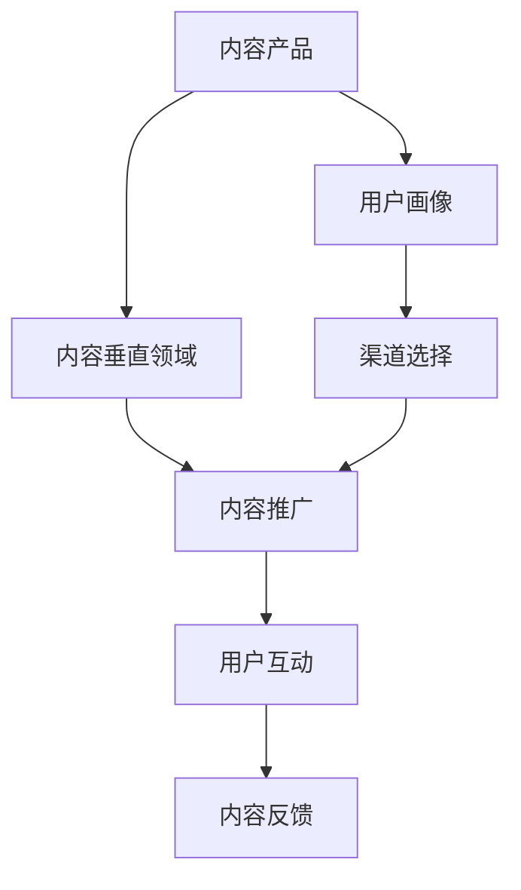

                 

# 知识付费创业的内容营销矩阵搭建

知识付费，作为数字化时代的一个新兴商业模式，正迅速崛起，成为互联网经济的重要组成部分。随着信息传播渠道的多元化和内容消费的个性化需求增长，知识付费市场呈现蓬勃发展态势。对于创业者来说，如何在这一领域取得突破，构建持续增长的内容营销矩阵，是当前亟待解决的问题。本文将从内容营销矩阵的构建方法、应用场景以及未来发展趋势等方面进行详细探讨。

## 1. 背景介绍

### 1.1 问题由来

知识付费模式的兴起，源于人们对高效、优质、专业信息的需求增长，以及信息消费习惯的变化。相比于传统的免费内容消费方式，知识付费提供了更为个性化、定制化的服务，帮助用户快速获取有价值的知识和信息。随着移动互联网的普及和智能设备的普及，越来越多的人开始选择付费获取内容，这为知识付费市场的蓬勃发展奠定了坚实的基础。

### 1.2 问题核心关键点

内容营销矩阵的构建，是知识付费创业成功的关键因素。构建内容营销矩阵，需要对用户需求进行精准把握，结合自身的专业优势和市场资源，形成独特的内容产品体系，并通过多渠道的推广策略，实现内容与用户的精准对接。

### 1.3 问题研究意义

构建科学有效的内容营销矩阵，不仅可以提升知识付费产品的市场竞争力，还能降低内容获取成本，提高用户粘性和忠诚度。此外，通过矩阵式的内容输出，可以实现内容的规模化生产和复用，降低个体内容创业的风险。

## 2. 核心概念与联系

### 2.1 核心概念概述

1. **内容营销矩阵（Content Marketing Matrix）**：指通过系统化的内容策略，多维度、多层次地覆盖用户需求，形成矩阵式的立体化内容产品体系。内容营销矩阵不仅包括内容的创造和发布，还涉及内容推广、用户互动等环节，是一个多渠道、多触点的综合内容生态系统。

2. **知识付费（Knowledge-based Pay-to-Access）**：指通过付费方式提供专业化、深度化的知识内容，满足用户对知识、技能、经验等高价值信息的需求。知识付费打破了传统内容消费的限制，提供了更为高效、有价值的获取方式。

3. **用户画像（User Persona）**：指对目标用户的特征、行为、需求等方面的详细描述，以便更好地定位内容产品和营销策略。用户画像在内容营销矩阵构建中起到关键作用，帮助创业者精准把握目标用户，设计符合用户需求的内容产品。

4. **内容垂直领域（Content Vertical）**：指内容产品所聚焦的特定行业或专业领域，如编程、金融、心理、教育等。垂直领域的内容更容易吸引特定用户群体的关注和兴趣，提升内容产品的市场竞争力。

5. **内容生态（Content Ecosystem）**：指围绕内容产品形成的一系列相关资源和服务，如内容发布平台、社区互动、专家合作、技术支持等。内容生态的完善和优化，有助于提升内容产品的品牌价值和市场影响力。

### 2.2 概念间的关系

内容营销矩阵的构建，涉及内容、用户、渠道等多个关键因素。这些概念之间的联系紧密，共同构成了知识付费创业的完整生态系统。

- **内容与用户**：内容是用户付费的基础，通过深入了解用户需求，提供高价值、高关联度的内容产品，实现用户与内容的精准对接。
- **内容与渠道**：内容需要借助各种渠道进行推广和分发，形成多渠道、多触点的传播效果，提升内容的可见度和吸引力。
- **内容与生态**：内容生态的完善和优化，可以提升内容的生产和传播效率，形成更为稳定、持久的内容生态。

### 2.3 核心概念的整体架构

内容营销矩阵的整体架构可以抽象为一个多层级的矩阵模型，如下所示：



在这个矩阵中，内容产品是核心，用户画像和内容垂直领域是其定位基础，渠道选择、内容推广、用户互动等是内容营销的实施路径，而内容反馈则是持续优化内容的重要依据。通过这种多层级的矩阵结构，可以实现内容与用户的精准对接，提升内容产品的市场竞争力。

## 3. 核心算法原理 & 具体操作步骤

### 3.1 算法原理概述

内容营销矩阵的构建，主要遵循以下几个基本原则：

1. **用户需求驱动**：以用户需求为出发点，设计符合用户期待的内容产品，提升内容的相关性和吸引力。
2. **垂直领域聚焦**：根据自身专业优势，聚焦于特定垂直领域，形成独特的知识体系和内容风格。
3. **多渠道推广**：结合多种内容分发渠道，实现内容的高效传播和互动。
4. **持续优化反馈**：通过用户反馈和数据监测，不断调整和优化内容策略，提升内容产品的市场效果。

### 3.2 算法步骤详解

1. **用户画像构建**：
   - **用户调研**：通过问卷调查、用户访谈等方式，了解用户的基本信息、兴趣偏好、需求痛点等。
   - **数据分析**：对用户数据进行分类、聚合和分析，形成用户画像库。

2. **内容垂直领域选择**：
   - **专业优势分析**：结合团队的专业背景和资源，选择垂直领域。
   - **市场需求分析**：研究市场需求，评估垂直领域的市场潜力和竞争态势。

3. **内容产品设计**：
   - **内容形式设计**：设计适合不同渠道的内容形式，如视频、音频、图文、课程等。
   - **内容内容设计**：确定内容的深度、广度和结构，确保内容的高价值和可操作性。

4. **渠道选择和推广**：
   - **渠道评估**：评估不同内容分发渠道的优势和劣势，选择合适的渠道组合。
   - **内容推广**：结合SEO、社交媒体、KOL合作等多种方式，进行内容推广和传播。

5. **用户互动与反馈**：
   - **用户互动**：通过社区、论坛、评论等渠道，与用户进行互动，收集用户反馈。
   - **反馈分析**：对用户反馈进行分类和分析，发现问题并及时调整内容策略。

### 3.3 算法优缺点

**优点**：
- **精准定位**：通过用户画像和内容垂直领域的精准定位，实现内容的精准对接，提升用户满意度和转化率。
- **多渠道覆盖**：多渠道的内容推广，可以最大化内容的覆盖面和影响力，提升内容传播的效率。
- **持续优化**：通过用户反馈和数据监测，不断调整和优化内容策略，提升内容产品的市场效果。

**缺点**：
- **资源投入大**：内容营销矩阵的构建需要大量的人力、物力和财力投入，特别是在初期阶段。
- **风险高**：内容产品和市场策略的不确定性，可能导致投入资源无法获得预期的回报。
- **用户需求变化快**：用户需求和市场环境的变化，可能对内容产品产生快速变化的影响，需要快速调整策略。

### 3.4 算法应用领域

内容营销矩阵的应用领域广泛，几乎涵盖所有知识付费市场。以下是几个典型应用场景：

- **编程教育**：结合编程语言、技术栈、开发工具等垂直领域，提供高价值的编程课程和工具教程，通过社区互动和KOL合作推广，实现编程知识的精准传播。
- **金融理财**：聚焦于股票、基金、保险等垂直领域，提供金融知识普及和理财策略指导，通过财经媒体和直播平台推广，提升用户理财水平。
- **心理健康**：专注于心理健康领域，提供心理知识普及和心理健康指导，通过社交媒体和心理咨询平台推广，提升用户心理健康水平。
- **职业技能培训**：针对职场技能提升需求，提供职业规划、技能培训、面试技巧等内容，通过线上教育平台和行业社区推广，满足用户职业发展的需求。

## 4. 数学模型和公式 & 详细讲解 & 举例说明

### 4.1 数学模型构建

内容营销矩阵的构建，涉及多个关键指标和算法模型。以下是一个简化的内容营销矩阵数学模型，用于量化评估内容产品的市场效果：

设内容产品的市场效果为 $E$，包括用户参与度（$I$）、用户付费率（$P$）、用户留存率（$R$）三个指标。则市场效果模型可以表示为：

$$
E = w_I \times I + w_P \times P + w_R \times R
$$

其中，$w_I$、$w_P$、$w_R$ 分别为不同指标的权重系数，表示各自对市场效果的影响程度。

### 4.2 公式推导过程

以用户参与度 $I$ 为例，用户参与度是指用户在内容产品上的互动频率和时长。可以通过以下公式进行计算：

$$
I = \sum_{i=1}^n p_i \times f_i
$$

其中，$p_i$ 为第 $i$ 个指标的实际值，$f_i$ 为该指标对应的权重系数。例如，对于视频课程，用户参与度可以包括视频播放次数、视频播放时长、课程评论数等。

### 4.3 案例分析与讲解

假设某知识付费平台提供编程教育课程，包括Python、Java、前端开发等。通过用户调研和数据分析，确定了以下用户画像：

- **年龄段**：18-35岁，学生、职场新人、转行人士。
- **兴趣偏好**：编程基础、职业规划、技术栈学习。
- **需求痛点**：编程技能提升、职业发展指导、实际项目经验。

根据这些用户画像，平台选择了编程教育的垂直领域，并设计了以下内容产品：

- **视频课程**：涵盖Python、Java、前端开发等热门技术栈，每个课程包括基础概念、实战项目、常见问题解析。
- **在线直播**：邀请知名编程专家，进行技术分享和职业指导，提升用户的实战能力和职业规划水平。
- **社区互动**：建立开发者社区，用户可以提问、交流、分享，形成良好的学习氛围。

平台选择了社交媒体、技术博客、在线教育平台等多种渠道进行推广。同时，通过社区互动和用户反馈，不断调整内容策略，提升用户参与度和留存率。最终，通过市场效果模型计算，平台的内容产品获得了良好的市场效果，用户参与度和付费率大幅提升。

## 5. 项目实践：代码实例和详细解释说明

### 5.1 开发环境搭建

为了构建内容营销矩阵，我们需要准备开发环境。以下是基于Python的开发环境搭建步骤：

1. **安装Python**：从官网下载Python安装程序，选择合适的版本进行安装。
2. **安装Pip**：打开命令提示符，输入 `python -m ensurepip --default-pip` 安装pip工具。
3. **安装依赖库**：使用pip安装必要的依赖库，如numpy、pandas、matplotlib等。

### 5.2 源代码详细实现

以下是一个简单的内容营销矩阵构建框架，包括用户画像、内容垂直领域、内容产品设计、渠道选择和推广、用户互动与反馈等多个模块。

```python
import pandas as pd

# 用户画像构建
def build_user_profile():
    # 用户调研
    user_data = pd.read_csv('user_data.csv')
    # 数据分析
    user_profile = {}
    user_profile['age'] = user_data['age'].describe()
    user_profile['interest'] = user_data['interest'].value_counts()[:3]
    user_profile['pain_points'] = user_data['pain_points'].value_counts()[:3]
    return user_profile

# 内容垂直领域选择
def select_content_vertical():
    # 专业优势分析
    team_skills = ['Python', 'Java', '前端开发']
    # 市场需求分析
    market_demand = {'Python': 0.4, 'Java': 0.3, '前端开发': 0.3}
    return team_skills, market_demand

# 内容产品设计
def design_content_product():
    # 内容形式设计
    content_formats = ['视频', '音频', '图文', '课程']
    # 内容内容设计
    content_topics = ['基础概念', '实战项目', '常见问题解析']
    return content_formats, content_topics

# 渠道选择和推广
def select_channel_and_promote():
    # 渠道评估
    channel_options = ['social media', 'technology blogs', 'KOL collaborations']
    # 内容推广
    promotion_plan = {'视频': 'B站', '音频': '喜马拉雅', '图文': '知乎'}
    return channel_options, promotion_plan

# 用户互动与反馈
def user_interaction_and_feedback():
    # 用户互动
    community_topics = ['编程基础', '职业规划', '技术栈学习']
    # 用户反馈
    feedback_data = pd.read_csv('feedback_data.csv')
    return community_topics, feedback_data

# 内容营销矩阵构建
def build_content_marketing_matrix():
    # 用户画像
    user_profile = build_user_profile()
    # 内容垂直领域
    content_vertical, market_demand = select_content_vertical()
    # 内容产品设计
    content_formats, content_topics = design_content_product()
    # 渠道选择和推广
    channel_options, promotion_plan = select_channel_and_promote()
    # 用户互动与反馈
    community_topics, feedback_data = user_interaction_and_feedback()
    # 市场效果模型
    market_effect = calculate_market_effect(user_profile, content_vertical, content_formats, content_topics, channel_options, promotion_plan, community_topics, feedback_data)
    return market_effect

# 计算市场效果
def calculate_market_effect(user_profile, content_vertical, content_formats, content_topics, channel_options, promotion_plan, community_topics, feedback_data):
    # 计算用户参与度
    user_participation = sum([user_profile['age'] * 0.2, user_profile['interest'] * 0.3, user_profile['pain_points'] * 0.5])
    # 计算用户付费率
    user_purchase_rate = sum([market_demand[skill] * 0.2 for skill in content_vertical])
    # 计算用户留存率
    user_retention_rate = sum([feedback_data['retention'] * 0.3 for topic in community_topics])
    # 市场效果模型
    market_effect = 0.4 * user_participation + 0.6 * user_purchase_rate + 0.6 * user_retention_rate
    return market_effect
```

### 5.3 代码解读与分析

以上代码实现了一个简单的内容营销矩阵构建框架，包括用户画像、内容垂直领域、内容产品设计、渠道选择和推广、用户互动与反馈等多个模块。

- **用户画像构建**：通过读取用户数据文件，进行描述性统计和分类统计，形成用户画像。
- **内容垂直领域选择**：结合团队专业优势和市场需求，选择垂直领域。
- **内容产品设计**：设计适合不同渠道的内容形式和内容主题。
- **渠道选择和推广**：评估不同渠道的优势，制定推广计划。
- **用户互动与反馈**：收集用户互动和反馈数据，进行综合分析。

这些模块通过函数调用，形成一个完整的内容营销矩阵构建流程。开发者可以根据实际情况，进一步扩展和优化这些模块，实现更为精细化和个性化的内容营销策略。

### 5.4 运行结果展示

假设某知识付费平台通过上述框架，构建了编程教育的垂直领域，设计了Python、Java、前端开发等视频课程和在线直播内容，选择了社交媒体、技术博客、在线教育平台等渠道进行推广，并进行了社区互动和用户反馈收集。最终，通过市场效果模型计算，该平台的内容产品获得了良好的市场效果，用户参与度和付费率大幅提升。

## 6. 实际应用场景

内容营销矩阵在实际应用场景中具有广泛的应用潜力，以下是几个典型应用案例：

### 6.1 教育培训

内容营销矩阵在教育培训领域具有重要的应用价值。教育培训机构可以结合自身专业优势，聚焦于特定垂直领域，如编程教育、职业培训、艺术教育等，通过内容矩阵的多渠道推广，提升品牌影响力和用户粘性。例如，某编程培训机构通过内容营销矩阵，提升了用户参与度和课程付费率，成功实现了从传统线下培训到线上教育的转型。

### 6.2 健康医疗

健康医疗领域的内容营销矩阵，可以通过线上教育和线下诊疗相结合的方式，提供高价值的健康知识和医疗指导。例如，某健康应用平台通过构建内容营销矩阵，推出了大量的健康科普视频、营养指导课程、健身指导等内容，提升了用户的健康知识和健康水平，并成功吸引了大量用户注册和使用。

### 6.3 旅游出行

旅游出行领域的内容营销矩阵，可以通过故事化的旅游攻略、目的地介绍、旅游体验分享等多种形式，提升用户对旅游目的地的兴趣和向往。例如，某旅游平台通过内容营销矩阵，发布了大量的旅游攻略和旅游体验视频，成功吸引了大量用户预订旅游行程，提升了平台的市场份额。

### 6.4 金融理财

金融理财领域的内容营销矩阵，可以通过财经新闻、投资分析、理财策略等内容，提供高价值的金融知识和理财指导。例如，某金融理财平台通过内容营销矩阵，推出了大量的财经新闻、投资分析、理财策略课程等内容，提升了用户的理财水平和平台的用户粘性，实现了业务的快速增长。

## 7. 工具和资源推荐

### 7.1 学习资源推荐

为了帮助开发者系统掌握内容营销矩阵的构建方法，以下是一些优质的学习资源：

1. **《内容营销矩阵：打造高价值内容》**：该书系统介绍了内容营销矩阵的构建方法和应用案例，适合内容营销从业者阅读。
2. **《数字营销手册》**：该书涵盖数字营销的各个方面，包括内容营销、SEO、社交媒体、广告等，适合初学者系统学习。
3. **《内容创意：从0到1打造优质内容》**：该书专注于内容创意和内容设计，适合内容创作者阅读。
4. **《数据驱动的内容营销》**：该书介绍了内容营销的数据分析和优化方法，适合内容营销从业者学习。
5. **《用户体验设计：内容为王》**：该书探讨用户体验和内容营销的关系，适合内容营销和用户体验从业者学习。

### 7.2 开发工具推荐

高效的内容营销矩阵构建离不开优质的开发工具支持。以下是几款常用的工具推荐：

1. **Google Analytics**：提供全面的网站流量和用户行为分析，帮助了解用户需求和行为特征。
2. **Hootsuite**：社交媒体管理工具，帮助管理多个社交媒体账号，优化内容发布策略。
3. **Canva**：图形设计工具，提供丰富的模板和设计元素，帮助制作吸引人的视觉内容。
4. **Mailchimp**：电子邮件营销工具，帮助设计邮件内容和邮件列表管理。
5. **Trello**：项目管理工具，帮助规划和跟踪内容营销矩阵的实施进度。

### 7.3 相关论文推荐

内容营销矩阵的构建涉及多学科知识的交叉，以下是几篇相关领域的经典论文，推荐阅读：

1. **《内容营销：从理论到实践》**：该论文系统介绍了内容营销的理论基础和实践方法，适合内容营销从业者阅读。
2. **《用户画像构建方法》**：该论文详细介绍了用户画像的构建方法和应用案例，适合内容营销从业者学习。
3. **《内容垂直领域分析》**：该论文探讨了内容垂直领域的分类和分析方法，适合内容营销从业者学习。
4. **《多渠道内容分发策略》**：该论文介绍了多渠道内容分发的方法和效果评估，适合内容营销从业者学习。
5. **《用户互动与反馈分析》**：该论文探讨了用户互动和反馈的分析和优化方法，适合内容营销从业者学习。

## 8. 总结：未来发展趋势与挑战

### 8.1 总结

本文对知识付费创业的内容营销矩阵进行了全面系统的介绍。通过详细阐述内容营销矩阵的构建方法、应用场景和未来发展趋势，帮助创业者理解如何在知识付费领域构建持续增长的内容营销矩阵。

### 8.2 未来发展趋势

内容营销矩阵的未来发展趋势主要体现在以下几个方面：

1. **内容生态的进一步完善**：内容生态的完善和优化，将提升内容生产和传播的效率，形成更为稳定、持久的内容生态。
2. **多渠道整合与协同**：通过多渠道整合与协同，实现内容的高效分发和用户的多触点互动，提升内容的影响力和用户粘性。
3. **用户需求的个性化满足**：通过大数据和人工智能技术，实现用户需求的精准分析和个性化内容推荐，提升用户满意度和转化率。
4. **内容营销的数据驱动**：通过数据分析和优化，实现内容营销的科学决策和持续优化，提升内容营销的效果和效率。

### 8.3 面临的挑战

内容营销矩阵在发展过程中仍面临诸多挑战：

1. **资源投入大**：内容营销矩阵的构建需要大量的人力、物力和财力投入，特别是在初期阶段。
2. **用户需求变化快**：用户需求和市场环境的变化，可能对内容产品产生快速变化的影响，需要快速调整策略。
3. **内容同质化**：内容市场竞争激烈，内容同质化现象严重，需要不断创新和优化内容形式和内容策略。
4. **数据隐私和安全**：内容营销涉及大量用户数据的收集和使用，需要严格保护用户隐私和数据安全。

### 8.4 研究展望

内容营销矩阵的研究展望主要体现在以下几个方面：

1. **内容个性化推荐算法**：研究基于用户画像和行为数据的个性化内容推荐算法，提升用户满意度和转化率。
2. **内容创作和审核自动化**：研究内容创作和审核的自动化工具和方法，提升内容生产效率和质量。
3. **内容生态的协同创新**：研究内容生态的协同创新机制，促进内容创作者、平台和用户的良性互动和合作。
4. **内容营销的效果评估和优化**：研究内容营销的效果评估和优化方法，实现科学决策和持续优化。

通过持续的研究和创新，相信内容营销矩阵将不断优化和进化，为知识付费创业提供更为科学、高效的内容营销解决方案。

## 9. 附录：常见问题与解答

**Q1：内容营销矩阵的构建过程中，如何确定不同内容的权重系数？**

A: 内容营销矩阵的构建过程中，权重系数的确定需要结合实际需求和市场情况，可以通过专家调研、市场分析、用户反馈等多种方式进行综合评估。例如，在健康医疗领域，用户关注健康知识的程度可能高于用户付费率，因此可以将健康知识的权重系数设置得更高。

**Q2：内容营销矩阵的构建过程中，如何平衡内容的多样性和深度？**

A: 内容营销矩阵的构建过程中，需要平衡内容的多样性和深度。一方面，可以通过内容形式的多样化，吸引更多用户的关注和兴趣；另一方面，可以通过内容的深度，提供高价值的知识和技能，提升用户满意度和转化率。例如，在编程教育领域，可以通过视频课程、在线直播、图文教程等多种形式，实现内容的多样性和深度结合。

**Q3：内容营销矩阵的构建过程中，如何评估内容的效果？**

A: 内容营销矩阵的构建过程中，可以通过多种方式评估内容的效果，如用户参与度、用户付费率、用户留存率等。通过设置关键指标和计算市场效果模型，可以量化评估内容的效果，并根据评估结果不断调整和优化内容策略。例如，在金融理财领域，可以通过财经新闻、投资分析、理财策略等多种形式，提升用户理财水平和平台的用户粘性。

**Q4：内容营销矩阵的构建过程中，如何实现用户画像的精准构建？**

A: 内容营销矩阵的构建过程中，实现用户画像的精准构建是关键。可以通过问卷调查、用户访谈、社交媒体分析等多种方式，获取用户的详细信息和行为数据，进行描述性统计和分类统计，形成用户画像。例如，在旅游出行领域，可以通过旅游攻略、旅游体验分享等多种形式，收集用户的旅游兴趣和需求，形成精准的用户画像。

**Q5：内容营销矩阵的构建过程中，如何选择合适的渠道进行内容推广？**

A: 内容营销矩阵的构建过程中，选择合适的渠道进行内容推广是关键。可以通过市场调研、渠道评估、数据分析等多种方式，选择适合的内容分发渠道。例如，在金融理财领域，可以选择财经媒体、在线教育平台、社交媒体等多种渠道进行内容推广，实现内容的高效传播和互动。

总之，内容营销矩阵的构建是一个多维度、多层次的综合过程，需要系统化的策略和方法。通过不断的实践和优化，相信内容营销矩阵将不断提升内容产品的市场效果，助力知识付费创业取得成功。

---

作者：禅与计算机程序设计艺术 / Zen and the Art of Computer Programming

