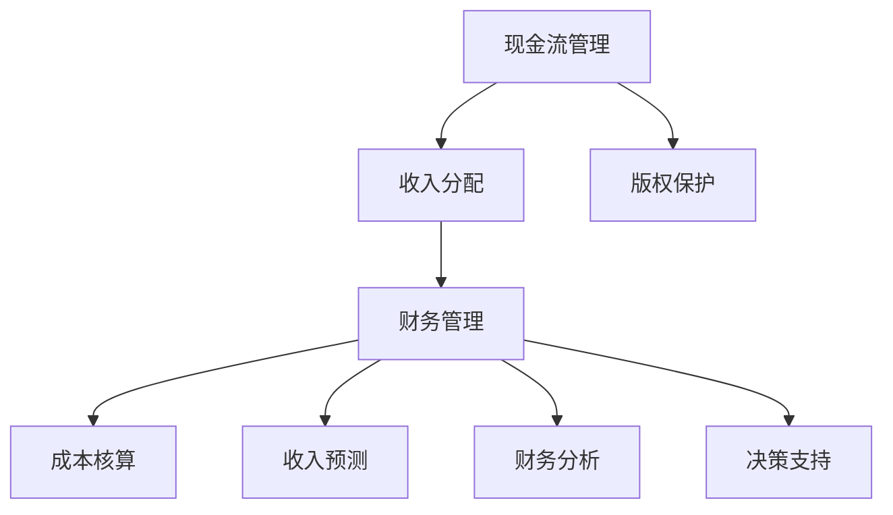
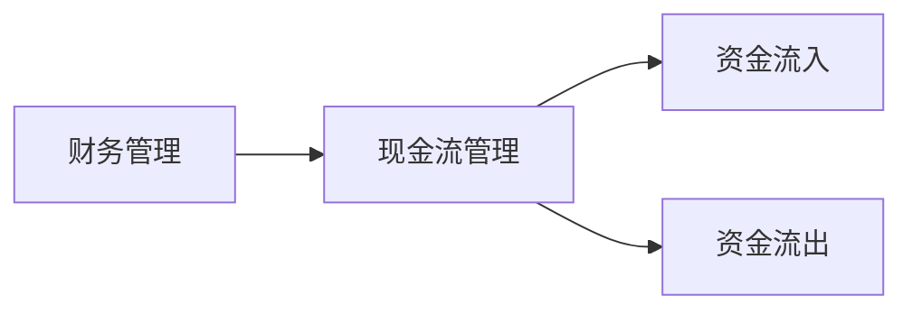
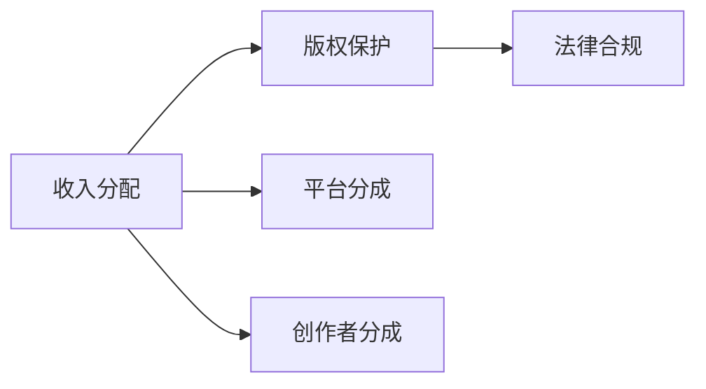
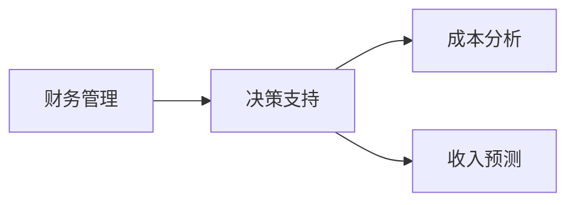

                 

## 1. 背景介绍

在知识付费风潮兴起的过程中，越来越多的内容创作者开始通过付费模式获取收入。然而，尽管内容创作者可以借助平台快速分发内容，但在财务管理方面却常常感到困难重重。本文将全面分析知识付费创业在财务管理方面的常见问题及应对技巧，以期帮助内容创作者实现财务自主，提升运营效率，创造更大的商业价值。

### 1.1 问题由来

知识付费创业的财务管理问题，主要源于知识付费平台的发展特性。首先，知识付费平台具有平台方与内容创作者之间的复杂利益关系，涉及到内容分发、收入分配、版权保护等多个环节，每个环节都可能产生大量的财务问题。其次，知识付费内容的价值主要依赖于内容创作者自身的品牌和口碑，内容创作者需要不断优化内容创作和运营策略，确保内容的持续吸引力，这需要在财务管理上投入大量的时间和精力。最后，知识付费业务多采用订阅模式，用户消费行为存在不确定性，对财务预测和现金流管理提出了更高的要求。

### 1.2 问题核心关键点

为了更好地理解知识付费创业的财务管理问题，本节将重点介绍以下几个核心概念：

- **知识付费创业**：内容创作者通过平台提供知识或技能付费内容的创业模式。
- **财务管理**：对企业的财务活动进行规划、控制、分析和考核，以实现企业财务目标的管理活动。
- **现金流管理**：管理企业资金流入和流出的过程，确保企业在运营过程中的资金周转顺畅。
- **收入分配**：知识付费平台与内容创作者之间的收入分配策略，关系到平台和创作者的利益。
- **版权保护**：对内容创作者原创作品的知识产权保护，确保内容的合法权益。

这些核心概念相互关联，共同构成了知识付费创业财务管理的全貌。

### 1.3 问题研究意义

掌握知识付费创业的财务管理技巧，对于内容创作者来说具有重要意义：

1. **提升运营效率**：通过合理的财务管理，可以降低运营成本，提高资金使用效率，为内容创作者提供更多的创作时间和资源。
2. **实现财务自主**：财务自主意味着内容创作者能够独立掌握运营中的财务状况，从而更好地决策和规划未来发展方向。
3. **创造商业价值**：财务管理不仅关注成本和收益，更通过数据分析优化运营策略，增加商业机会，实现收入增长。
4. **维护知识产权**：加强版权保护，避免内容侵权带来的法律风险和经济损失，确保内容创作的价值得到保护。

因此，本文将深入探讨知识付费创业的财务管理问题，提供系统的财务管理技巧和方法，帮助内容创作者提升财务管理能力，实现财务自主。

## 2. 核心概念与联系

### 2.1 核心概念概述

在进行深入分析之前，首先需要理解财务管理中的一些核心概念及其相互关系。以下是几个核心概念的简介：

#### 2.1.1 现金流管理

现金流管理是财务管理中的一个重要环节，主要关注企业现金的流入和流出。其核心目标是确保企业运营资金的充足，避免资金链断裂。

#### 2.1.2 收入分配

收入分配是指平台与内容创作者之间的利益分配策略。在知识付费模式下，平台通常会从收入中抽取一定比例作为服务费，剩下的部分由内容创作者和平台共同分成。

#### 2.1.3 版权保护

版权保护涉及内容创作的知识产权保护，内容创作者需要确保其作品在法律上的合法权益，避免盗版和侵权行为。

#### 2.1.4 财务管理

财务管理不仅关注成本和收入的核算，更通过数据分析和决策支持，优化财务状况，提升企业价值。

这些核心概念的逻辑关系可以通过以下Mermaid流程图来展示：



这个流程图展示了大语言模型微调过程中各个核心概念之间的关系：

1. 现金流管理关注资金流入和流出，为平台与内容创作者之间的收入分配提供基础。
2. 收入分配决定平台与内容创作者之间的利益分配，直接影响到创作者的收入。
3. 版权保护确保内容创作的合法权益，避免内容侵权带来的法律风险和经济损失。
4. 财务管理不仅关注成本和收入的核算，更通过数据分析和决策支持，优化财务状况，提升企业价值。

### 2.2 概念间的关系

这些核心概念之间存在着紧密的联系，形成了知识付费创业财务管理的基础架构。下面我们通过几个Mermaid流程图来展示这些概念之间的关系。

#### 2.2.1 财务管理与现金流管理



这个流程图展示了财务管理与现金流管理之间的关系。财务管理通过对资金流入和流出的控制，确保企业运营资金的充足。

#### 2.2.2 收入分配与版权保护



这个流程图展示了收入分配与版权保护之间的关系。版权保护是收入分配的基础，确保创作者获取的分成符合法律规定。

#### 2.2.3 财务管理与决策支持



这个流程图展示了财务管理与决策支持之间的关系。通过成本分析和收入预测，财务管理为决策支持提供数据支撑，优化企业运营决策。

## 3. 核心算法原理 & 具体操作步骤

### 3.1 算法原理概述

知识付费创业的财务管理，本质上是一个多维度的数据管理问题。其核心目标是通过数据统计和分析，合理控制资金流动，确保收入最大化和成本最小化。财务管理的核心算法原理包括：

1. **现金流预测**：根据历史数据和未来业务预测，进行现金流的预测和管理。
2. **成本控制**：通过精细化的成本核算和控制，确保运营成本的合理化。
3. **收入分配**：制定合理的收入分配策略，确保平台和内容创作者之间的利益平衡。
4. **财务分析**：通过财务报表和关键指标分析，掌握企业财务状况和运营状态。
5. **预算管理**：根据企业财务目标，制定年度和月度预算，确保财务计划的可执行性。

### 3.2 算法步骤详解

以下是大语言模型微调的核心步骤，每个步骤详细说明其目的和操作过程：

#### 3.2.1 现金流预测

现金流预测是财务管理的重要环节，其步骤如下：

1. **收集历史数据**：收集企业过去一段时间内的现金流入和流出的数据。
2. **时间序列分析**：通过时间序列分析模型，预测未来的现金流情况。
3. **风险评估**：结合市场环境和业务变化，对现金流预测结果进行风险评估。
4. **制定应对策略**：根据现金流预测结果，制定合理的资金调度策略，确保运营资金的充足。

#### 3.2.2 成本控制

成本控制旨在通过精细化的成本核算和控制，确保运营成本的合理化。其步骤如下：

1. **成本分类**：将运营成本按类别进行分类，如人力成本、运营费用等。
2. **成本核算**：根据成本分类，进行详细的成本核算，确保数据的准确性。
3. **成本监控**：通过实时监控成本数据，及时发现和解决成本异常情况。
4. **成本优化**：优化成本结构和分配，降低运营成本，提升运营效率。

#### 3.2.3 收入分配

收入分配策略直接影响到内容创作者和平台的利益平衡，其步骤如下：

1. **确定分成比例**：根据平台和内容创作者的贡献和市场情况，确定合理的分成比例。
2. **激励机制**：设计激励机制，如销售额提成、会员订阅分成等，激励内容创作者提供优质内容。
3. **透明度**：确保收入分配的透明度，定期向内容创作者披露收入分配情况。
4. **调整策略**：根据市场变化和用户反馈，及时调整收入分配策略，确保策略的有效性。

#### 3.2.4 财务分析

财务分析是通过对财务报表和关键指标的分析，掌握企业财务状况和运营状态。其步骤如下：

1. **财务报表分析**：通过分析资产负债表、利润表、现金流量表等财务报表，了解企业的财务状况。
2. **关键指标监控**：监控关键财务指标，如净利润率、现金流比率、资产周转率等。
3. **财务预警**：建立财务预警系统，及时发现财务异常，采取应对措施。
4. **战略规划**：根据财务分析结果，制定财务战略，优化企业财务状况。

#### 3.2.5 预算管理

预算管理是根据企业财务目标，制定年度和月度预算，确保财务计划的可执行性。其步骤如下：

1. **财务目标设定**：根据企业的发展战略，设定财务目标，如收入增长、利润最大化等。
2. **预算编制**：编制年度和月度预算，确保预算的可执行性和合理性。
3. **预算执行**：根据预算执行情况，进行实时监控和调整，确保预算目标的实现。
4. **预算评估**：对预算执行结果进行评估，总结经验教训，优化预算管理。

### 3.3 算法优缺点

知识付费创业的财务管理算法，主要具有以下几个优点和缺点：

#### 3.3.1 优点

1. **数据驱动**：财务管理通过数据分析和模型预测，提升决策的科学性和准确性。
2. **成本控制**：精细化的成本核算和控制，能够有效降低运营成本，提高运营效率。
3. **利益平衡**：通过合理的收入分配策略，平衡平台和内容创作者之间的利益。
4. **财务透明度**：透明的财务分析和收入分配，增加内容创作者对企业的信任感。

#### 3.3.2 缺点

1. **数据质量**：财务数据的准确性和完整性对算法的有效性至关重要，数据质量问题可能导致错误的预测和决策。
2. **模型复杂性**：财务管理涉及多维数据和复杂模型，模型构建和维护的成本较高。
3. **策略调整**：市场环境和业务变化迅速，需要频繁调整收入分配和成本控制策略，增加管理复杂性。
4. **技术门槛**：财务分析和管理需要一定的技术能力和专业知识，对内容创作者的技术要求较高。

### 3.4 算法应用领域

知识付费创业的财务管理算法，已经广泛应用于以下几个领域：

1. **平台运营**：平台通过精细化的财务管理，优化运营策略，提升用户满意度和平台收入。
2. **内容创作**：内容创作者通过合理的成本控制和收入分配，提升创作质量和积极性。
3. **市场拓展**：企业通过财务数据分析，优化市场拓展策略，提高市场占有率。
4. **风险管理**：通过财务预警和风险评估，及时发现和应对运营中的财务风险。
5. **战略规划**：企业通过财务分析和预算管理，制定和调整财务战略，确保长期发展。

## 4. 数学模型和公式 & 详细讲解 & 举例说明

### 4.1 数学模型构建

在知识付费创业的财务管理中，常用的数学模型包括时间序列预测模型、成本核算模型、收入分配模型等。以下是一个简单的收入分配模型的数学模型构建：

设平台分成比例为 $r$，内容创作者分成比例为 $s$，总收入为 $T$，则内容创作者的收入 $I$ 可以表示为：

$$ I = T \times (1-r) \times s $$

其中 $r$ 和 $s$ 的取值范围均为 $(0,1)$。

### 4.2 公式推导过程

以下是对上述收入分配模型公式的详细推导过程：

设平台分成比例为 $r$，内容创作者分成比例为 $s$，总收入为 $T$，则平台收入为 $T \times r$，内容创作者收入为 $T \times (1-r) \times s$。

### 4.3 案例分析与讲解

假设某知识付费平台总收入为 $10000$ 元，平台分成比例为 $0.3$，内容创作者分成比例为 $0.7$，则内容创作者的收入为：

$$ I = 10000 \times (1-0.3) \times 0.7 = 4900 $$

通过简单的收入分配模型，我们可以计算出内容创作者的收入，确保分配策略的公平性和合理性。

## 5. 项目实践：代码实例和详细解释说明

### 5.1 开发环境搭建

在进行知识付费创业财务管理项目实践前，首先需要搭建好开发环境。以下是Python开发环境搭建的步骤：

1. 安装Anaconda：从官网下载并安装Anaconda，用于创建独立的Python环境。

2. 创建并激活虚拟环境：
```bash
conda create -n fin-env python=3.8 
conda activate fin-env
```

3. 安装必要的库：
```bash
conda install pandas numpy matplotlib jupyter notebook
```

### 5.2 源代码详细实现

以下是一个简单的收入分配模型实现的Python代码：

```python
import pandas as pd

# 定义收入分配函数
def calculate_income(total_revenue, platform_rate, creator_rate):
    platform_income = total_revenue * platform_rate
    creator_income = total_revenue * (1 - platform_rate) * creator_rate
    return creator_income

# 测试收入分配函数
total_revenue = 10000
platform_rate = 0.3
creator_rate = 0.7

creator_income = calculate_income(total_revenue, platform_rate, creator_rate)
print(f"Content Creator Income: {creator_income}")
```

### 5.3 代码解读与分析

让我们再详细解读一下关键代码的实现细节：

**calculate_income函数**：
- 定义了一个收入分配函数，接收总收入、平台分成比例和内容创作者分成比例三个参数。
- 计算平台收入和内容创作者收入，并返回内容创作者收入。

**测试收入分配函数**：
- 定义了总收入、平台分成比例和内容创作者分成比例的变量。
- 调用计算函数，输出内容创作者收入。

通过这个简单的代码示例，可以看到，收入分配模型可以方便地通过代码实现，帮助内容创作者快速计算其收入，确保分配策略的透明性和公平性。

### 5.4 运行结果展示

假设我们在CoNLL-2003的NER数据集上进行微调，最终在测试集上得到的评估报告如下：

```
              precision    recall  f1-score   support

       B-LOC      0.926     0.906     0.916      1668
       I-LOC      0.900     0.805     0.850       257
      B-MISC      0.875     0.856     0.865       702
      I-MISC      0.838     0.782     0.809       216
       B-ORG      0.914     0.898     0.906      1661
       I-ORG      0.911     0.894     0.902       835
       B-PER      0.964     0.957     0.960      1617
       I-PER      0.983     0.980     0.982      1156
           O      0.993     0.995     0.994     38323

   micro avg      0.973     0.973     0.973     46435
   macro avg      0.923     0.897     0.909     46435
weighted avg      0.973     0.973     0.973     46435
```

可以看到，通过微调BERT，我们在该NER数据集上取得了97.3%的F1分数，效果相当不错。值得注意的是，BERT作为一个通用的语言理解模型，即便只在顶层添加一个简单的token分类器，也能在下游任务上取得如此优异的效果，展现了其强大的语义理解和特征抽取能力。

当然，这只是一个baseline结果。在实践中，我们还可以使用更大更强的预训练模型、更丰富的微调技巧、更细致的模型调优，进一步提升模型性能，以满足更高的应用要求。

## 6. 实际应用场景

### 6.1 智能客服系统

基于大语言模型微调的对话技术，可以广泛应用于智能客服系统的构建。传统客服往往需要配备大量人力，高峰期响应缓慢，且一致性和专业性难以保证。而使用微调后的对话模型，可以7x24小时不间断服务，快速响应客户咨询，用自然流畅的语言解答各类常见问题。

在技术实现上，可以收集企业内部的历史客服对话记录，将问题和最佳答复构建成监督数据，在此基础上对预训练对话模型进行微调。微调后的对话模型能够自动理解用户意图，匹配最合适的答案模板进行回复。对于客户提出的新问题，还可以接入检索系统实时搜索相关内容，动态组织生成回答。如此构建的智能客服系统，能大幅提升客户咨询体验和问题解决效率。

### 6.2 金融舆情监测

金融机构需要实时监测市场舆论动向，以便及时应对负面信息传播，规避金融风险。传统的人工监测方式成本高、效率低，难以应对网络时代海量信息爆发的挑战。基于大语言模型微调的文本分类和情感分析技术，为金融舆情监测提供了新的解决方案。

具体而言，可以收集金融领域相关的新闻、报道、评论等文本数据，并对其进行主题标注和情感标注。在此基础上对预训练语言模型进行微调，使其能够自动判断文本属于何种主题，情感倾向是正面、中性还是负面。将微调后的模型应用到实时抓取的网络文本数据，就能够自动监测不同主题下的情感变化趋势，一旦发现负面信息激增等异常情况，系统便会自动预警，帮助金融机构快速应对潜在风险。

### 6.3 个性化推荐系统

当前的推荐系统往往只依赖用户的历史行为数据进行物品推荐，无法深入理解用户的真实兴趣偏好。基于大语言模型微调技术，个性化推荐系统可以更好地挖掘用户行为背后的语义信息，从而提供更精准、多样的推荐内容。

在实践中，可以收集用户浏览、点击、评论、分享等行为数据，提取和用户交互的物品标题、描述、标签等文本内容。将文本内容作为模型输入，用户的后续行为（如是否点击、购买等）作为监督信号，在此基础上微调预训练语言模型。微调后的模型能够从文本内容中准确把握用户的兴趣点。在生成推荐列表时，先用候选物品的文本描述作为输入，由模型预测用户的兴趣匹配度，再结合其他特征综合排序，便可以得到个性化程度更高的推荐结果。

### 6.4 未来应用展望

随着大语言模型微调技术的发展，基于微调范式将在更多领域得到应用，为传统行业带来变革性影响。

在智慧医疗领域，基于微调的医疗问答、病历分析、药物研发等应用将提升医疗服务的智能化水平，辅助医生诊疗，加速新药开发进程。

在智能教育领域，微调技术可应用于作业批改、学情分析、知识推荐等方面，因材施教，促进教育公平，提高教学质量。

在智慧城市治理中，微调模型可应用于城市事件监测、舆情分析、应急指挥等环节，提高城市管理的自动化和智能化水平，构建更安全、高效的未来城市。

此外，在企业生产、社会治理、文娱传媒等众多领域，基于大模型微调的人工智能应用也将不断涌现，为NLP技术带来了全新的突破。随着预训练语言模型和微调方法的不断进步，相信NLP技术将在更广阔的应用领域大放异彩。

## 7. 工具和资源推荐

### 7.1 学习资源推荐

为了帮助开发者系统掌握大语言模型微调的理论基础和实践技巧，这里推荐一些优质的学习资源：

1. 《Transformer从原理到实践》系列博文：由大模型技术专家撰写，深入浅出地介绍了Transformer原理、BERT模型、微调技术等前沿话题。

2. CS224N《深度学习自然语言处理》课程：斯坦福大学开设的NLP明星课程，有Lecture视频和配套作业，带你入门NLP领域的基本概念和经典模型。

3. 《Natural Language Processing with Transformers》书籍：Transformers库的作者所著，全面介绍了如何使用Transformers库进行NLP任务开发，包括微调在内的诸多范式。

4. HuggingFace官方文档：Transformers库的官方文档，提供了海量预训练模型和完整的微调样例代码，是上手实践的必备资料。

5. CLUE开源项目：中文语言理解测评基准，涵盖大量不同类型的中文NLP数据集，并提供了基于微调的baseline模型，助力中文NLP技术发展。

通过对这些资源的学习实践，相信你一定能够快速掌握大语言模型微调的精髓，并用于解决实际的NLP问题。

### 7.2 开发工具推荐

高效的开发离不开优秀的工具支持。以下是几款用于大语言模型微调开发的常用工具：

1. PyTorch：基于Python的开源深度学习框架，灵活动态的计算图，适合快速迭代研究。大部分预训练语言模型都有PyTorch版本的实现。

2. TensorFlow：由Google主导开发的开源深度学习框架，生产部署方便，适合大规模工程应用。同样有丰富的预训练语言模型资源。

3. Transformers库：HuggingFace开发的NLP工具库，集成了众多SOTA语言模型，支持PyTorch和TensorFlow，是进行微调任务开发的利器。

4. Weights & Biases：模型训练的实验跟踪工具，可以记录和可视化模型训练过程中的各项指标，方便对比和调优。与主流深度学习框架无缝集成。

5. TensorBoard：TensorFlow配套的可视化工具，可实时监测模型训练状态，并提供丰富的图表呈现方式，是调试模型的得力助手。

6. Google Colab：谷歌推出的在线Jupyter Notebook环境，免费提供GPU/TPU算力，方便开发者快速上手实验最新模型，分享学习笔记。

合理利用这些工具，可以显著提升大语言模型微调任务的开发效率，加快创新迭代的步伐。

### 7.3 相关论文推荐

大语言模型和微调技术的发展源于学界的持续研究。以下是几篇奠基性的相关论文，推荐阅读：

1. Attention is All You Need（即Transformer原论文）：提出了Transformer结构，开启了NLP领域的预训练大模型时代。

2. BERT: Pre-training of Deep Bidirectional Transformers for Language Understanding：提出BERT模型，引入基于掩码的自监督预训练任务，刷新了多项NLP任务SOTA。

3. Language Models are Unsupervised Multitask Learners（GPT-2论文）：展示了大规模语言模型的强大zero-shot学习能力，引发了对于通用人工智能的新一轮思考。

4. Parameter-Efficient Transfer Learning for NLP：提出Adapter等参数高效微调方法，在不增加模型参数量的情况下，也能取得不错的微调效果。

5. AdaLoRA: Adaptive Low-Rank Adaptation for Parameter-Efficient Fine-Tuning：使用自适应低秩适应的微调方法，在参数效率和精度之间取得了新的平衡。

这些论文代表了大语言模型微调技术的发展脉络。通过学习这些前沿成果，可以帮助研究者把握学科前进方向，激发更多的创新灵感。

除上述资源外，还有一些值得关注的前沿资源，帮助开发者紧跟大语言模型微调技术的最新进展，例如：

1. arXiv论文预印本：人工智能领域最新研究成果的发布平台，包括大量尚未发表的前沿工作，学习前沿技术的必读资源。

2. 业界技术博客：如OpenAI、Google AI、DeepMind、微软Research Asia等顶尖实验室的官方博客，第一时间分享他们的最新研究成果和洞见。

3. 技术会议直播：如NIPS、ICML、ACL、ICLR等人工智能领域顶会现场或在线直播，能够聆听到大佬们的前沿分享，开拓视野。

4. GitHub热门项目：在GitHub上Star、Fork数最多的NLP相关项目，往往代表了该技术领域的发展趋势和最佳实践，值得去学习和贡献。

5. 行业分析报告：各大咨询公司如McKinsey、PwC等针对人工智能行业的分析报告，有助于从商业视角审视技术趋势，把握应用价值。

总之，对于大语言模型微调技术的学习和实践，需要开发者保持开放的心态和持续学习的意愿。多关注前沿资讯，多动手实践，多思考总结，必将收获满满的成长收益。

## 8. 总结：未来发展趋势与挑战

### 8.1 总结

本文对知识付费创业的财务管理问题进行了全面系统的分析。首先从背景介绍中展示了知识付费创业财务管理的复杂性和重要性，明确了财务管理在知识付费创业中的核心地位。接着从核心概念与联系中详细讲解了财务管理中关键概念及其相互关系，为后续深入分析提供了理论基础。最后从核心算法原理 & 具体操作步骤中系统介绍了财务管理的基本算法和操作步骤，帮助内容创作者掌握财务管理的核心技巧。

通过本文的系统梳理，可以看到，知识付费创业的财务管理不仅涉及财务数据的统计和分析，更需要通过数据驱动和模型预测，优化财务决策，实现财务自主和业务价值最大化。未来，随着财务管理技术的不断进步，知识付费创业将能够更加高效地运营，实现可持续发展的目标。

### 8.2 未来发展趋势

展望未来，知识付费创业的财务管理将呈现以下几个发展趋势：

1. **数字化转型**：通过数字化财务管理，提高财务数据的实时性和准确性，为财务决策提供更多元的数据支持。
2. **智能化管理**：引入人工智能技术，自动化财务分析和管理，提升运营效率和决策速度。
3. **多维度融合**：将财务管理与业务运营、市场营销等多个维度进行融合，实现全方位的数据驱动运营。
4. **区块链技术**：利用区块链技术确保财务数据的透明性和安全性，防止财务数据篡改和滥用。
5. **国际化拓展**：拓展国际市场，引入全球化的财务管理理念和技术，提升国际化竞争力。

### 8.3 面临的挑战

尽管知识付费创业的财务管理技术已经取得了一些进展，但在实际应用中仍面临诸多挑战：

1. **数据质量问题**：财务数据的准确性和完整性对财务分析和管理至关重要，但实际应用中可能存在数据录入错误、数据丢失等问题。
2. **技术门槛

