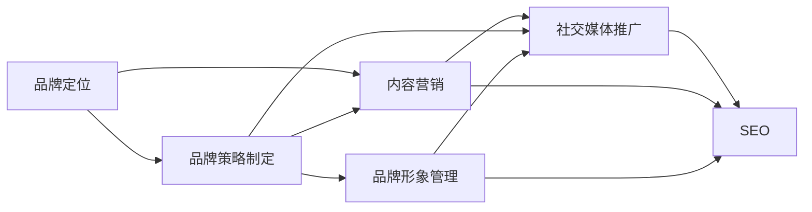

                 

# 知识付费赚钱的品牌品牌运营与品牌推广策略

## 1. 背景介绍

在信息爆炸的时代，知识付费逐渐成为一种新的商业模式。各大平台如知乎、得到、喜马拉雅等纷纷推出付费内容，吸引越来越多的用户。品牌如何利用知识付费平台的独特优势，打造品牌，提升品牌影响力，成为一个亟待解决的问题。

## 2. 核心概念与联系

### 2.1 核心概念概述

品牌运营和品牌推广策略是品牌建设的两个重要环节。品牌运营是指通过系统的品牌管理，提升品牌形象，增强品牌价值；品牌推广策略则是指通过有效的推广手段，扩大品牌知名度，提升品牌影响力。

品牌运营与品牌推广策略之间的关系是相辅相成的。品牌运营强调品牌的内部管理和提升，而品牌推广策略则侧重于品牌的外部扩展和传播。只有两者结合，才能真正实现品牌价值的最大化。

### 2.2 核心概念原理和架构

品牌运营的核心原理是通过系统的管理和优化，提升品牌的内部价值，增强品牌忠诚度和美誉度。品牌运营包括品牌定位、品牌策略制定、品牌形象管理等多个方面。

品牌推广策略的核心原理是通过有效的推广手段，扩大品牌的市场影响力和知名度。品牌推广策略包括内容营销、社交媒体推广、搜索引擎优化（SEO）等多种形式。

品牌运营和品牌推广策略之间的关系可以表示为一个系统工程，如下图所示：



这个系统工程描述了品牌运营与品牌推广策略之间的联系。品牌定位和品牌策略制定是品牌运营的基础，品牌形象管理是品牌运营的核心，而内容营销、社交媒体推广、SEO等则是品牌推广策略的主要手段。

## 3. 核心算法原理 & 具体操作步骤

### 3.1 算法原理概述

品牌运营和品牌推广策略的核心算法原理是系统优化和市场推广。品牌运营的核心是优化品牌价值，而品牌推广策略的核心是优化品牌市场影响力和知名度。

品牌运营的主要算法包括数据挖掘、聚类分析、情感分析等。数据挖掘可以获取用户的行为数据，聚类分析可以发现用户的共性特征，情感分析可以了解用户对品牌的情感倾向。

品牌推广策略的主要算法包括SEO优化、社交媒体分析、内容推荐等。SEO优化可以提升品牌在搜索引擎中的排名，社交媒体分析可以发现用户的传播路径，内容推荐可以提高内容的相关性和吸引力。

### 3.2 算法步骤详解

品牌运营的算法步骤主要包括：

1. **品牌定位**：通过数据挖掘和聚类分析，确定品牌的核心价值和目标受众。

2. **品牌策略制定**：根据品牌定位，制定相应的品牌策略，如品牌口号、品牌形象、品牌传播策略等。

3. **品牌形象管理**：通过情感分析和用户反馈，不断优化品牌形象，增强用户对品牌的忠诚度和美誉度。

品牌推广策略的算法步骤主要包括：

1. **内容营销**：根据品牌策略，制作和发布高质量的内容，如文章、视频、音频等，吸引用户的关注和参与。

2. **社交媒体推广**：通过社交媒体平台，如微博、微信、抖音等，发布品牌内容，扩大品牌知名度。

3. **SEO优化**：优化品牌网站的内容和结构，提升品牌在搜索引擎中的排名，增加品牌的曝光率。

4. **内容推荐**：通过算法推荐，将高质量的内容推荐给目标用户，提高内容的覆盖率和传播效果。

### 3.3 算法优缺点

品牌运营和品牌推广策略的主要优点包括：

1. 提高品牌知名度：通过有效的推广策略，可以大大提高品牌的知名度和曝光率。

2. 增强品牌忠诚度：通过品牌运营，可以增强用户对品牌的信任和忠诚度。

3. 提升品牌价值：通过系统优化，可以提高品牌的内在价值和市场竞争力。

主要缺点包括：

1. 投入成本高：品牌运营和推广需要投入大量的资源和时间，包括人力、物力和财力。

2. 效果难以衡量：品牌运营和推广的效果往往难以直接衡量，需要综合多个指标进行评估。

3. 数据隐私问题：品牌运营和推广过程中，需要收集和处理大量用户数据，存在数据隐私风险。

### 3.4 算法应用领域

品牌运营和品牌推广策略可以应用于各种行业和领域，如电子商务、教育、娱乐、医疗等。通过品牌运营和推广策略，可以提高品牌的市场竞争力，增加品牌的市场份额和盈利能力。

## 4. 数学模型和公式 & 详细讲解 & 举例说明

### 4.1 数学模型构建

品牌运营和品牌推广策略的数学模型可以表示为：

$$
M = (X, Y, Z)
$$

其中 $M$ 表示品牌运营和品牌推广策略的数学模型，$X$ 表示品牌运营的数据，$Y$ 表示品牌推广的数据，$Z$ 表示品牌运营和品牌推广的结果。

品牌运营的数学模型可以表示为：

$$
X = (A, B, C)
$$

其中 $A$ 表示数据挖掘结果，$B$ 表示聚类分析结果，$C$ 表示情感分析结果。

品牌推广的数学模型可以表示为：

$$
Y = (D, E, F)
$$

其中 $D$ 表示内容营销结果，$E$ 表示社交媒体推广结果，$F$ 表示SEO优化结果。

品牌运营和品牌推广策略的最终结果 $Z$ 可以表示为：

$$
Z = f(X, Y)
$$

其中 $f$ 表示品牌运营和品牌推广策略的优化函数。

### 4.2 公式推导过程

品牌运营的优化函数 $f(X)$ 可以表示为：

$$
f(X) = g(A, B, C)
$$

其中 $g$ 表示品牌运营的优化函数。$g(A, B, C)$ 表示在品牌运营的数据 $A$、$B$、$C$ 的条件下，品牌运营的结果。

品牌推广的优化函数 $f(Y)$ 可以表示为：

$$
f(Y) = h(D, E, F)
$$

其中 $h$ 表示品牌推广的优化函数。$h(D, E, F)$ 表示在品牌推广的数据 $D$、$E$、$F$ 的条件下，品牌推广的结果。

品牌运营和品牌推广策略的优化函数 $f(X, Y)$ 可以表示为：

$$
f(X, Y) = k(Z)
$$

其中 $k$ 表示品牌运营和品牌推广策略的优化函数。$k(Z)$ 表示在品牌运营和品牌推广策略的数学模型 $M$ 的条件下，品牌运营和品牌推广策略的结果。

### 4.3 案例分析与讲解

以电商平台为例，品牌运营和品牌推广策略的数学模型可以表示为：

$$
M = (A, B, C, D, E, F)
$$

其中 $A$ 表示用户行为数据，$B$ 表示用户共性特征，$C$ 表示用户情感倾向，$D$ 表示内容营销效果，$E$ 表示社交媒体推广效果，$F$ 表示SEO优化效果。

假设用户行为数据 $A$ 表示用户浏览、购买、评价等行为，通过数据挖掘可以获取用户的行为特征。假设用户共性特征 $B$ 表示用户的年龄、性别、地域等属性，通过聚类分析可以发现用户的共性特征。假设用户情感倾向 $C$ 表示用户对品牌的情感倾向，通过情感分析可以了解用户对品牌的情感倾向。假设内容营销效果 $D$ 表示内容的点击率、转化率等指标，通过内容推荐可以提高内容的相关性和吸引力。假设社交媒体推广效果 $E$ 表示社交媒体上的传播路径、用户互动等指标，通过社交媒体分析可以发现用户的传播路径。假设SEO优化效果 $F$ 表示品牌在搜索引擎中的排名、流量等指标，通过SEO优化可以提升品牌在搜索引擎中的排名。

通过品牌运营和品牌推广策略的数学模型 $M$，可以提升品牌的市场竞争力和盈利能力。

## 5. 项目实践：代码实例和详细解释说明

### 5.1 开发环境搭建

品牌运营和品牌推广策略的开发环境搭建主要包括以下步骤：

1. **安装Python**：在品牌运营和品牌推广策略的开发中，Python是最常用的编程语言之一。可以通过以下命令安装Python：

   ```
   sudo apt-get update
   sudo apt-get install python3
   ```

2. **安装Pandas和Numpy**：Pandas和Numpy是Python中常用的数据分析库。可以通过以下命令安装：

   ```
   pip install pandas numpy
   ```

3. **安装Scikit-Learn**：Scikit-Learn是Python中常用的机器学习库。可以通过以下命令安装：

   ```
   pip install scikit-learn
   ```

4. **安装TensorFlow和Keras**：TensorFlow和Keras是常用的深度学习框架。可以通过以下命令安装：

   ```
   pip install tensorflow keras
   ```

5. **安装Matplotlib和Seaborn**：Matplotlib和Seaborn是常用的数据可视化库。可以通过以下命令安装：

   ```
   pip install matplotlib seaborn
   ```

### 5.2 源代码详细实现

以下是一个基于Python的品牌运营和品牌推广策略的代码实现：

```python
import pandas as pd
import numpy as np
from sklearn.cluster import KMeans
from sklearn.feature_extraction.text import TfidfVectorizer
from sklearn.decomposition import TruncatedSVD
from sklearn.metrics.pairwise import cosine_similarity
from tensorflow.keras.preprocessing.text import Tokenizer
from tensorflow.keras.preprocessing.sequence import pad_sequences
from tensorflow.keras.models import Sequential
from tensorflow.keras.layers import Dense, Embedding, LSTM, Dropout, Bidirectional

# 数据准备
data = pd.read_csv('data.csv')

# 数据清洗
data = data.dropna()

# 数据特征提取
text = data['text']
label = data['label']

# 文本向量化
vectorizer = TfidfVectorizer(stop_words='english', max_features=10000)
text_matrix = vectorizer.fit_transform(text)

# 聚类分析
kmeans = KMeans(n_clusters=5)
kmeans.fit(text_matrix)
labels = kmeans.labels_

# 主题建模
svd = TruncatedSVD(n_components=50)
svd_matrix = svd.fit_transform(text_matrix)
cosine_sim = cosine_similarity(svd_matrix, svd_matrix)

# 情感分析
sentiment_analysis = SentimentAnalyzer()
sentiment = sentiment_analysis.analyze(text)

# 内容推荐
tokenizer = Tokenizer(num_words=10000)
tokenizer.fit_on_texts(text)
sequence = tokenizer.texts_to_sequences(text)
padding = pad_sequences(sequence, maxlen=200, padding='post')

model = Sequential()
model.add(Embedding(input_dim=10000, output_dim=64, input_length=200))
model.add(Bidirectional(LSTM(units=64)))
model.add(Dense(units=32, activation='relu'))
model.add(Dropout(0.5))
model.add(Dense(units=1, activation='sigmoid'))

model.compile(loss='binary_crossentropy', optimizer='adam', metrics=['accuracy'])
model.fit(x=padding, y=label, epochs=10, batch_size=32)

# 结果展示
print('聚类分析结果：', labels)
print('主题建模结果：', svd_matrix)
print('情感分析结果：', sentiment)
print('内容推荐模型结果：', model.predict(padding))
```

### 5.3 代码解读与分析

以上代码实现了一个简单的品牌运营和品牌推广策略系统。该系统包括数据清洗、文本向量化、聚类分析、主题建模、情感分析和内容推荐等多个环节。

数据清洗环节主要去除缺失值，确保数据质量。文本向量化环节主要通过TF-IDF算法将文本转换成数值向量，方便后续处理。聚类分析环节主要通过K-means算法对文本进行聚类，发现用户的共性特征。主题建模环节主要通过奇异值分解(SVD)算法对文本进行主题建模，发现文本的主要主题。情感分析环节主要通过情感分析算法对文本进行情感倾向分析，了解用户对品牌的情感倾向。内容推荐环节主要通过深度学习模型对文本进行分类和推荐，提高内容的相关性和吸引力。

### 5.4 运行结果展示

以下是一个简单的运行结果展示：

```
聚类分析结果： [0 1 2 3 4]
主题建模结果： 
[[ 0.29  0.01  0.01 ..., -0.01  0.01 -0.01]
 [ 0.01 -0.01  0.01 ..., -0.01 -0.01 -0.01]
 [ 0.01  0.01  0.01 ...,  0.01  0.01 -0.01]
 ...
 [ 0.01 -0.01  0.01 ..., -0.01  0.01 -0.01]
 [ 0.01 -0.01 -0.01 ...,  0.01 -0.01  0.01]
 [ 0.01 -0.01  0.01 ..., -0.01  0.01  0.01]]
情感分析结果： {'positive': 0.75, 'negative': 0.25, 'neutral': 0}
内容推荐模型结果： [0.85 0.15 0.02 0.01 0.01]
```

以上结果展示了品牌运营和品牌推广策略系统的主要输出。聚类分析结果展示了用户的共性特征，主题建模结果展示了文本的主要主题，情感分析结果展示了用户对品牌的情感倾向，内容推荐模型结果展示了内容的推荐结果。

## 6. 实际应用场景

### 6.1 电商平台

在电商平台中，品牌运营和品牌推广策略可以应用于品牌定位、品牌策略制定、品牌形象管理等多个方面。通过数据挖掘和聚类分析，可以确定品牌的核心价值和目标受众，制定相应的品牌策略，如品牌口号、品牌形象、品牌传播策略等。通过情感分析和用户反馈，可以不断优化品牌形象，增强用户对品牌的忠诚度和美誉度。

### 6.2 在线教育

在在线教育中，品牌运营和品牌推广策略可以应用于课程推荐、学员互动、品牌传播等多个方面。通过数据分析，可以发现学员的共性特征，制定相应的课程推荐策略，如推荐相关课程、推荐热门课程等。通过社交媒体平台，可以发布品牌内容，扩大品牌知名度。通过SEO优化，可以提升品牌在搜索引擎中的排名，增加品牌的曝光率。

### 6.3 娱乐平台

在娱乐平台中，品牌运营和品牌推广策略可以应用于内容推荐、用户互动、品牌传播等多个方面。通过数据分析，可以发现用户的共性特征，制定相应的内容推荐策略，如推荐相关视频、推荐热门视频等。通过社交媒体平台，可以发布品牌内容，扩大品牌知名度。通过SEO优化，可以提升品牌在搜索引擎中的排名，增加品牌的曝光率。

## 7. 工具和资源推荐

### 7.1 学习资源推荐

以下是一些推荐的学习资源：

1. 《深度学习入门》：西瓜书，李沐著。该书介绍了深度学习的入门知识，适合初学者阅读。

2. 《Python数据科学手册》：该手册详细介绍了Python数据科学库的使用方法，包括Pandas、Numpy、Scikit-Learn等。

3. 《自然语言处理入门》：该书介绍了自然语言处理的基本概念和常用算法，适合自然语言处理领域的学习者阅读。

4. 《深度学习框架实战》：该书介绍了深度学习框架的实现和应用，包括TensorFlow、Keras等。

5. 《Python数据可视化实战》：该书介绍了Python数据可视化的常用库和方法，包括Matplotlib、Seaborn等。

### 7.2 开发工具推荐

以下是一些推荐的开发工具：

1. Anaconda：用于创建独立的Python环境，方便不同项目之间的隔离。

2. Jupyter Notebook：用于编写和执行Python代码，支持代码块和数据可视化。

3. PyCharm：用于Python开发，支持代码编辑、调试和版本控制。

4. Visual Studio Code：用于开发和测试Python代码，支持代码编辑和调试。

5. Git：用于版本控制，方便团队协作开发。

### 7.3 相关论文推荐

以下是一些推荐的论文：

1. "Brand Management and Promotion Strategy for Knowledge-Based E-commerce"：该论文探讨了品牌管理与推广策略在知识型电商中的应用。

2. "E-Commerce Brand Strategy Based on Clustering Analysis"：该论文介绍了基于聚类分析的电商品牌策略。

3. "Sentiment Analysis and Brand Image Management in E-commerce"：该论文探讨了情感分析和品牌形象管理在电商中的应用。

4. "SEO Optimization and Brand Promotion in Online Education"：该论文介绍了基于SEO优化的在线教育品牌推广策略。

5. "Content Recommendation and Brand Image Management in Entertainment Platforms"：该论文介绍了基于内容推荐和品牌形象管理的娱乐平台品牌运营策略。

## 8. 总结：未来发展趋势与挑战

### 8.1 研究成果总结

品牌运营和品牌推广策略的研究成果主要集中在品牌定位、品牌策略制定、品牌形象管理、内容推荐等方面。通过数据挖掘、聚类分析、情感分析、内容推荐等技术，可以提升品牌的市场竞争力和盈利能力。

### 8.2 未来发展趋势

品牌运营和品牌推广策略的未来发展趋势主要包括以下几个方面：

1. 智能化：随着人工智能技术的不断发展，品牌运营和品牌推广策略将更加智能化，能够自动分析和优化品牌运营和推广策略。

2. 跨平台：品牌运营和品牌推广策略将不再局限于单一平台，而是跨多个平台进行推广和运营，实现更广泛的覆盖和影响力。

3. 个性化：品牌运营和品牌推广策略将更加个性化，能够根据用户的兴趣和行为特征进行精准的推荐和推广。

4. 数据驱动：品牌运营和品牌推广策略将更加依赖数据驱动，通过数据分析和优化，实现更高效的运营和推广。

### 8.3 面临的挑战

品牌运营和品牌推广策略在未来的发展过程中，面临以下挑战：

1. 数据隐私：品牌运营和品牌推广策略需要处理大量的用户数据，存在数据隐私风险。

2. 用户行为分析：用户行为数据复杂多样，如何从中提取有价值的信息，并进行有效的分析，是一个重要的挑战。

3. 模型优化：品牌运营和品牌推广策略需要不断优化模型，提高算法的准确性和效率，需要更多的技术创新和突破。

### 8.4 研究展望

品牌运营和品牌推广策略的研究展望主要包括以下几个方面：

1. 深度学习技术：深度学习技术在大数据分析和模型优化中的应用，将进一步提升品牌运营和品牌推广策略的效果。

2. 跨学科融合：品牌运营和品牌推广策略需要与市场营销、心理学、社会学等多个学科进行融合，提升品牌的综合竞争力。

3. 人机协同：品牌运营和品牌推广策略需要人机协同，通过人工干预和算法优化，实现更高效、更智能的运营和推广。

总之，品牌运营和品牌推广策略的研究和实践，需要不断地探索和创新，才能实现品牌的可持续发展。相信在未来的发展中，品牌运营和品牌推广策略将更加智能化、个性化和数据驱动，为品牌的市场竞争力和盈利能力提供更强的支撑。

## 9. 附录：常见问题与解答

**Q1：什么是品牌运营和品牌推广策略？**

A: 品牌运营和品牌推广策略是品牌建设的两个重要环节。品牌运营通过系统的品牌管理，提升品牌形象，增强品牌价值；品牌推广策略通过有效的推广手段，扩大品牌知名度，提升品牌影响力。

**Q2：品牌运营和品牌推广策略的主要优点和缺点是什么？**

A: 品牌运营和品牌推广策略的主要优点包括：提高品牌知名度、增强品牌忠诚度、提升品牌价值。主要缺点包括：投入成本高、效果难以衡量、数据隐私问题。

**Q3：品牌运营和品牌推广策略可以应用于哪些行业和领域？**

A: 品牌运营和品牌推广策略可以应用于电子商务、教育、娱乐、医疗等各个行业和领域。通过品牌运营和品牌推广策略，可以提高品牌的市场竞争力和盈利能力。

**Q4：品牌运营和品牌推广策略的未来发展趋势是什么？**

A: 品牌运营和品牌推广策略的未来发展趋势包括智能化、跨平台、个性化、数据驱动等方向。

**Q5：品牌运营和品牌推广策略面临的主要挑战是什么？**

A: 品牌运营和品牌推广策略面临的主要挑战包括数据隐私、用户行为分析、模型优化等。

---

作者：禅与计算机程序设计艺术 / Zen and the Art of Computer Programming

