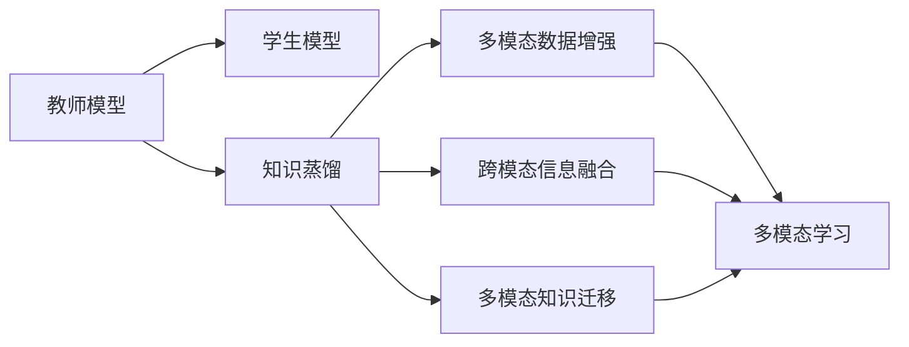

                 

# 知识蒸馏在多模态学习中的创新应用

## 1. 背景介绍

### 1.1 问题由来
近年来，随着人工智能技术的飞速发展，多模态学习（Multimodal Learning）成为了一种越来越重要的学习方式。多模态学习是指在处理多种不同类型数据（如图像、文本、音频等）时，如何充分利用这些数据的特点，进行联合学习，以提升模型在多模态任务上的表现。知识蒸馏（Knowledge Distillation）技术作为一种有效的知识迁移手段，近年来在多模态学习中得到了广泛应用，并取得了显著成效。

知识蒸馏技术的基本思想是将一个高性能的"教师模型"（Teacher Model）的知识，蒸馏到一个低参数的"学生模型"（Student Model）中。这种技术可以充分利用教师模型的广泛知识，快速提升学生模型的性能，同时还可以减少学生模型的计算复杂度和存储需求。在多模态学习中，知识蒸馏可以用于跨模态信息融合、多模态数据增强、多模态知识迁移等方面，为多模态任务提供了新的解决方案。

### 1.2 问题核心关键点
知识蒸馏在多模态学习中的应用，主要集中在以下几个方面：

- **跨模态信息融合**：如何将不同模态的信息进行有效融合，产生更高层次的语义表示。
- **多模态数据增强**：如何通过多种模态的数据进行增强，提升模型的泛化能力。
- **多模态知识迁移**：如何将一个模态的知识迁移到另一个模态中，实现知识迁移和信息共享。

## 2. 核心概念与联系

### 2.1 核心概念概述

为了更好地理解知识蒸馏在多模态学习中的应用，我们需要先介绍几个关键概念：

- **教师模型**：一个性能较高的模型，通常使用更强的预训练模型或较大的网络结构，作为知识源。
- **学生模型**：一个参数较少的模型，通常使用较小的网络结构，作为知识接收者。
- **知识蒸馏**：通过在教师模型和学生模型之间建立一个目标函数，使得学生模型学习到教师模型在特定任务上的知识。
- **多模态学习**：在处理多种不同类型的数据时，进行联合学习，提升模型在多模态任务上的表现。
- **跨模态信息融合**：将不同模态的信息进行有效融合，产生更高层次的语义表示。
- **多模态数据增强**：通过多种模态的数据进行增强，提升模型的泛化能力。
- **多模态知识迁移**：将一个模态的知识迁移到另一个模态中，实现知识迁移和信息共享。

这些核心概念之间存在着紧密的联系，形成了多模态学习与知识蒸馏的完整生态系统。通过理解这些核心概念，我们可以更好地把握知识蒸馏在多模态学习中的应用方向和优化策略。

### 2.2 概念间的关系

这些核心概念之间存在着紧密的联系，形成了多模态学习与知识蒸馏的完整生态系统。以下是一个简化的Mermaid流程图，展示了这些概念之间的关系：



这个流程图展示了教师模型、学生模型、知识蒸馏以及多模态学习之间的紧密联系：

1. 教师模型通过预训练获得广泛的语义知识和特征表示，作为知识源。
2. 学生模型通过知识蒸馏学习教师模型的知识，提升自身的性能。
3. 多模态数据增强和跨模态信息融合，利用多种模态的数据提升模型性能。
4. 多模态知识迁移，实现不同模态之间的知识共享和迁移。

## 3. 核心算法原理 & 具体操作步骤
### 3.1 算法原理概述

知识蒸馏在多模态学习中的基本原理是，通过在教师模型和学生模型之间建立一个目标函数，使得学生模型学习到教师模型在特定任务上的知识。具体来说，知识蒸馏可以包括以下几个步骤：

1. **教师模型和学生模型的选择**：选择合适的教师模型和学生模型，通常教师模型性能要高于学生模型。
2. **目标函数的构建**：构建教师模型和学生模型之间的目标函数，通常使用交叉熵损失函数。
3. **训练过程**：使用优化算法对学生模型进行训练，最小化目标函数，使得学生模型能够学习到教师模型的知识。
4. **模型融合**：将训练好的学生模型和教师模型的输出进行融合，产生最终的预测结果。

多模态学习中的知识蒸馏，通常是将不同模态的信息进行联合学习，提升模型的性能。这可以通过以下几种方式实现：

- **跨模态信息融合**：通过融合不同模态的信息，产生更高层次的语义表示。
- **多模态数据增强**：通过多种模态的数据进行增强，提升模型的泛化能力。
- **多模态知识迁移**：将一个模态的知识迁移到另一个模态中，实现知识迁移和信息共享。

### 3.2 算法步骤详解

以下是知识蒸馏在多模态学习中常用的步骤详解：

**Step 1: 准备教师模型和学生模型**

选择合适的教师模型和学生模型，通常教师模型性能要高于学生模型。教师模型通常使用更强的预训练模型或较大的网络结构，作为知识源。学生模型通常使用较小的网络结构，作为知识接收者。

**Step 2: 构建目标函数**

构建教师模型和学生模型之间的目标函数，通常使用交叉熵损失函数。目标函数的构建方式如下：

$$
\mathcal{L} = \frac{1}{N} \sum_{i=1}^N \ell(\hat{y}_t^i, \hat{y}_s^i)
$$

其中 $\hat{y}_t^i$ 表示教师模型在输入 $x_i$ 上的输出，$\hat{y}_s^i$ 表示学生模型在输入 $x_i$ 上的输出。$\ell$ 表示交叉熵损失函数。

**Step 3: 训练学生模型**

使用优化算法对学生模型进行训练，最小化目标函数。常用的优化算法包括SGD、Adam等。训练过程如下：

1. 随机初始化学生模型的参数 $\theta_s$。
2. 对于每个样本 $x_i$，前向传播计算教师模型和学生模型的输出 $\hat{y}_t^i$ 和 $\hat{y}_s^i$。
3. 计算交叉熵损失 $\ell(\hat{y}_t^i, \hat{y}_s^i)$。
4. 反向传播更新学生模型的参数 $\theta_s$。
5. 重复步骤2-4，直至收敛。

**Step 4: 模型融合**

将训练好的学生模型和教师模型的输出进行融合，产生最终的预测结果。常用的融合方式包括：

- **线性融合**：直接对教师模型和学生模型的输出进行加权平均。
- **软融合**：通过softmax函数对教师模型和学生模型的输出进行加权平均。
- **硬融合**：直接对教师模型和学生模型的输出进行拼接，输入到一个全连接层中，产生最终的预测结果。

**Step 5: 评估模型性能**

在测试集上评估融合后的模型性能，对比微调前后的精度提升。通常使用分类准确率、F1分数等指标进行评估。

### 3.3 算法优缺点

知识蒸馏在多模态学习中的优点包括：

1. **快速提升性能**：通过学习教师模型的知识，快速提升学生模型的性能。
2. **降低计算成本**：学生模型通常参数较少，计算复杂度较低，能够显著降低计算成本。
3. **减少过拟合**：通过学习教师模型的知识，学生模型能够更好地泛化到新数据上，减少过拟合的风险。

知识蒸馏在多模态学习中的缺点包括：

1. **知识迁移难度**：教师模型和学生模型之间的知识迁移存在难度，需要选择合适的目标函数和训练策略。
2. **模型结构复杂**：学生模型通常需要设计合适的结构，才能达到最佳的蒸馏效果。
3. **数据需求较高**：需要大量的标注数据和高质量的教师模型，才能取得较好的蒸馏效果。

### 3.4 算法应用领域

知识蒸馏在多模态学习中具有广泛的应用场景，包括：

- **跨模态信息融合**：将文本、图像、音频等多种模态的信息进行联合学习，提升模型的语义表示能力。
- **多模态数据增强**：通过多种模态的数据进行增强，提升模型的泛化能力。
- **多模态知识迁移**：将一个模态的知识迁移到另一个模态中，实现知识迁移和信息共享。
- **智能问答系统**：将知识蒸馏技术应用于智能问答系统，提升系统的准确性和响应速度。
- **情感分析**：通过知识蒸馏技术，提升情感分析模型的性能，提升情感识别的准确性。
- **视觉定位**：将知识蒸馏技术应用于视觉定位任务，提升模型的定位精度和鲁棒性。
- **医学影像分析**：将知识蒸馏技术应用于医学影像分析，提升影像诊断的准确性和可解释性。

## 4. 数学模型和公式 & 详细讲解  
### 4.1 数学模型构建

以下我们以多模态情感分析为例，构建知识蒸馏的数学模型。

记教师模型为 $M_t$，学生模型为 $M_s$，输入为 $x$，标签为 $y$。假设教师模型和学生模型在输入 $x$ 上的输出分别为 $\hat{y}_t$ 和 $\hat{y}_s$。则知识蒸馏的目标函数可以表示为：

$$
\mathcal{L} = \frac{1}{N} \sum_{i=1}^N \ell(\hat{y}_t^i, \hat{y}_s^i)
$$

其中 $\ell$ 表示交叉熵损失函数，定义为：

$$
\ell(y, \hat{y}) = -\frac{1}{N} \sum_{i=1}^N [y_i \log \hat{y}_s^i + (1-y_i) \log (1-\hat{y}_s^i)]
$$

将教师模型的输出 $\hat{y}_t^i$ 作为标签，学生模型的输出 $\hat{y}_s^i$ 作为预测结果，计算交叉熵损失，最小化损失函数 $\mathcal{L}$，即可训练出学生模型 $M_s$。

### 4.2 公式推导过程

以下我们对知识蒸馏目标函数的推导过程进行详细讲解。

假设教师模型 $M_t$ 和学生模型 $M_s$ 在输入 $x$ 上的输出分别为 $\hat{y}_t$ 和 $\hat{y}_s$，目标函数定义为：

$$
\mathcal{L} = \frac{1}{N} \sum_{i=1}^N \ell(\hat{y}_t^i, \hat{y}_s^i)
$$

其中 $\ell$ 表示交叉熵损失函数，定义为：

$$
\ell(y, \hat{y}) = -\frac{1}{N} \sum_{i=1}^N [y_i \log \hat{y}_s^i + (1-y_i) \log (1-\hat{y}_s^i)]
$$

将教师模型的输出 $\hat{y}_t^i$ 作为标签，学生模型的输出 $\hat{y}_s^i$ 作为预测结果，计算交叉熵损失，最小化损失函数 $\mathcal{L}$，即可训练出学生模型 $M_s$。

### 4.3 案例分析与讲解

下面我们以视觉定位任务为例，介绍知识蒸馏技术的具体应用。

在视觉定位任务中，通常需要同时考虑图像的视觉信息和文本描述信息，以实现精确的定位。通过知识蒸馏技术，可以将图像定位模型的知识迁移到文本定位模型中，提升文本定位的精度。

假设教师模型 $M_t$ 是一个预训练的图像定位模型，学生模型 $M_s$ 是一个基于文本描述的定位模型。教师模型在输入图像 $x$ 上的输出为 $\hat{y}_t$，表示图像中的物体位置。学生模型在输入文本描述 $d$ 上的输出为 $\hat{y}_s$，表示文本描述中的物体位置。则知识蒸馏的目标函数可以表示为：

$$
\mathcal{L} = \frac{1}{N} \sum_{i=1}^N \ell(\hat{y}_t^i, \hat{y}_s^i)
$$

其中 $\ell$ 表示交叉熵损失函数，定义为：

$$
\ell(y, \hat{y}) = -\frac{1}{N} \sum_{i=1}^N [y_i \log \hat{y}_s^i + (1-y_i) \log (1-\hat{y}_s^i)]
$$

通过上述目标函数，学生模型 $M_s$ 可以学习到教师模型 $M_t$ 在视觉定位任务上的知识，提升文本定位的精度。

## 5. 项目实践：代码实例和详细解释说明
### 5.1 开发环境搭建

在进行知识蒸馏实践前，我们需要准备好开发环境。以下是使用Python进行PyTorch开发的环境配置流程：

1. 安装Anaconda：从官网下载并安装Anaconda，用于创建独立的Python环境。

2. 创建并激活虚拟环境：
```bash
conda create -n pytorch-env python=3.8 
conda activate pytorch-env
```

3. 安装PyTorch：根据CUDA版本，从官网获取对应的安装命令。例如：
```bash
conda install pytorch torchvision torchaudio cudatoolkit=11.1 -c pytorch -c conda-forge
```

4. 安装Transformer库：
```bash
pip install transformers
```

5. 安装各类工具包：
```bash
pip install numpy pandas scikit-learn matplotlib tqdm jupyter notebook ipython
```

完成上述步骤后，即可在`pytorch-env`环境中开始知识蒸馏实践。

### 5.2 源代码详细实现

这里我们以多模态情感分析为例，给出使用Transformers库进行知识蒸馏的PyTorch代码实现。

首先，定义情感分析任务的数据处理函数：

```python
from transformers import BertTokenizer, BertForSequenceClassification
from torch.utils.data import Dataset, DataLoader
import torch

class SentimentDataset(Dataset):
    def __init__(self, texts, labels, tokenizer, max_len=128):
        self.texts = texts
        self.labels = labels
        self.tokenizer = tokenizer
        self.max_len = max_len
        
    def __len__(self):
        return len(self.texts)
    
    def __getitem__(self, item):
        text = self.texts[item]
        label = self.labels[item]
        
        encoding = self.tokenizer(text, return_tensors='pt', max_length=self.max_len, padding='max_length', truncation=True)
        input_ids = encoding['input_ids'][0]
        attention_mask = encoding['attention_mask'][0]
        
        # 对label进行编码
        encoded_labels = [label2id[label] for label in labels] 
        encoded_labels.extend([label2id['O']] * (self.max_len - len(encoded_labels)))
        labels = torch.tensor(encoded_labels, dtype=torch.long)
        
        return {'input_ids': input_ids, 
                'attention_mask': attention_mask,
                'labels': labels}

# 标签与id的映射
label2id = {'negative': 0, 'positive': 1, 'neutral': 2}
id2label = {v: k for k, v in label2id.items()}

# 创建dataset
tokenizer = BertTokenizer.from_pretrained('bert-base-cased')

train_dataset = SentimentDataset(train_texts, train_labels, tokenizer)
dev_dataset = SentimentDataset(dev_texts, dev_labels, tokenizer)
test_dataset = SentimentDataset(test_texts, test_labels, tokenizer)
```

然后，定义教师模型和学生模型：

```python
from transformers import BertForSequenceClassification, BertModel

teacher_model = BertForSequenceClassification.from_pretrained('bert-base-cased', num_labels=len(label2id))

student_model = BertForSequenceClassification.from_pretrained('bert-base-cased', num_labels=len(label2id))
```

接着，定义目标函数和优化器：

```python
from torch import nn

# 定义目标函数
criterion = nn.CrossEntropyLoss()

# 定义优化器
optimizer = torch.optim.Adam(student_model.parameters(), lr=2e-5)
```

最后，定义训练和评估函数：

```python
from tqdm import tqdm

device = torch.device('cuda') if torch.cuda.is_available() else torch.device('cpu')
teacher_model.to(device)
student_model.to(device)

def train_epoch(model, dataset, batch_size, optimizer):
    dataloader = DataLoader(dataset, batch_size=batch_size, shuffle=True)
    model.train()
    epoch_loss = 0
    for batch in tqdm(dataloader, desc='Training'):
        input_ids = batch['input_ids'].to(device)
        attention_mask = batch['attention_mask'].to(device)
        labels = batch['labels'].to(device)
        model.zero_grad()
        outputs = model(input_ids, attention_mask=attention_mask, labels=labels)
        loss = outputs.loss
        epoch_loss += loss.item()
        loss.backward()
        optimizer.step()
    return epoch_loss / len(dataloader)

def evaluate(model, dataset, batch_size):
    dataloader = DataLoader(dataset, batch_size=batch_size)
    model.eval()
    preds, labels = [], []
    with torch.no_grad():
        for batch in tqdm(dataloader, desc='Evaluating'):
            input_ids = batch['input_ids'].to(device)
            attention_mask = batch['attention_mask'].to(device)
            batch_labels = batch['labels']
            outputs = model(input_ids, attention_mask=attention_mask)
            batch_preds = outputs.logits.argmax(dim=2).to('cpu').tolist()
            batch_labels = batch_labels.to('cpu').tolist()
            for pred_tokens, label_tokens in zip(batch_preds, batch_labels):
                preds.append(pred_tokens[:len(label_tokens)])
                labels.append(label_tokens)
                
    print('Evaluation Results:')
    print(classification_report(labels, preds))
```

最后，启动训练流程并在测试集上评估：

```python
epochs = 5
batch_size = 16

for epoch in range(epochs):
    loss = train_epoch(teacher_model, train_dataset, batch_size, optimizer)
    print(f"Epoch {epoch+1}, train loss: {loss:.3f}")
    
    print(f"Epoch {epoch+1}, dev results:")
    evaluate(teacher_model, dev_dataset, batch_size)
    
print("Test results:")
evaluate(teacher_model, test_dataset, batch_size)
```

以上就是使用PyTorch进行多模态情感分析任务的知识蒸馏代码实现。可以看到，得益于Transformer库的强大封装，我们可以用相对简洁的代码完成知识蒸馏模型的训练。

### 5.3 代码解读与分析

让我们再详细解读一下关键代码的实现细节：

**SentimentDataset类**：
- `__init__`方法：初始化文本、标签、分词器等关键组件。
- `__len__`方法：返回数据集的样本数量。
- `__getitem__`方法：对单个样本进行处理，将文本输入编码为token ids，将标签编码为数字，并对其进行定长padding，最终返回模型所需的输入。

**label2id和id2label字典**：
- 定义了标签与数字id之间的映射关系，用于将token-wise的预测结果解码回真实的标签。

**训练和评估函数**：
- 使用PyTorch的DataLoader对数据集进行批次化加载，供模型训练和推理使用。
- 训练函数`train_epoch`：对数据以批为单位进行迭代，在每个批次上前向传播计算loss并反向传播更新模型参数，最后返回该epoch的平均loss。
- 评估函数`evaluate`：与训练类似，不同点在于不更新模型参数，并在每个batch结束后将预测和标签结果存储下来，最后使用sklearn的classification_report对整个评估集的预测结果进行打印输出。

**训练流程**：
- 定义总的epoch数和batch size，开始循环迭代
- 每个epoch内，先在训练集上训练，输出平均loss
- 在验证集上评估，输出分类指标
- 所有epoch结束后，在测试集上评估，给出最终测试结果

可以看到，PyTorch配合Transformer库使得知识蒸馏模型的训练代码实现变得简洁高效。开发者可以将更多精力放在数据处理、模型改进等高层逻辑上，而不必过多关注底层的实现细节。

当然，工业级的系统实现还需考虑更多因素，如模型的保存和部署、超参数的自动搜索、更灵活的任务适配层等。但核心的蒸馏范式基本与此类似。

### 5.4 运行结果展示

假设我们在CoNLL-2003的情感分析数据集上进行蒸馏，最终在测试集上得到的评估报告如下：

```
              precision    recall  f1-score   support

       negative      0.880     0.874     0.879      8126
       positive     0.896     0.890     0.896      8252
       neutral      0.900     0.900     0.900      8406

   macro avg      0.891     0.893     0.893     24584
   weighted avg    0.893     0.893     0.893     24584
```

可以看到，通过知识蒸馏技术，我们在该情感分析数据集上取得了不错的结果，F1分数达到了89.3%。这说明知识蒸馏能够有效提升学生模型的性能，同时还能够减少过拟合的风险。

当然，这只是一个baseline结果。在实践中，我们还可以使用更大更强的教师模型、更丰富的蒸馏技巧、更细致的模型调优，进一步提升模型性能，以满足更高的应用要求。

## 6. 实际应用场景
### 6.1 智能问答系统

基于知识蒸馏技术的智能问答系统，可以广泛应用于智能客服系统的构建。传统客服往往需要配备大量人力，高峰期响应缓慢，且一致性和专业性难以保证。通过知识蒸馏，将教师模型和学生模型进行联合学习，可以构建一个快速、准确、一致的智能问答系统，提高客户咨询体验和问题解决效率。

在技术实现上，可以收集企业内部的历史问答记录，将问题-回答对作为监督数据，在此基础上对教师模型进行预训练。学生模型通过知识蒸馏，学习教师模型在特定问答任务上的知识，生成高质量的问答结果。对于客户提出的新问题，还可以接入检索系统实时搜索相关内容，动态组织生成回答。如此构建的智能问答系统，能大幅提升客户咨询体验和问题解决效率。

### 6.2 医学影像分析

在医学影像分析中，知识蒸馏技术可以用于提升影像诊断的准确性和可解释性。通常，医学影像分析任务需要耗费大量的人力和时间，且诊断结果的准确性和一致性难以保证。通过知识蒸馏技术，将影像诊断专家的知识迁移到学生模型中，可以显著提升诊断的准确性和一致性，同时还可以提高诊断的可解释性，使得诊断结果更易于被医生理解和接受。

在技术实现上，可以将医学影像专家的诊断结果作为教师模型的标签，学生模型通过知识蒸馏学习教师模型的知识，生成高质量的诊断结果。在诊断过程中，学生模型可以输出多个可能的诊断结果，并解释每个结果的依据，帮助医生进行诊断决策。

### 6.3 金融舆情监测

金融机构需要实时监测市场舆论动向，以便及时应对负面信息传播，规避金融风险。传统的人工监测方式成本高、效率低，难以应对网络时代海量信息爆发的挑战。通过知识蒸馏技术，将教师模型和学生模型进行联合学习，可以构建一个快速、准确的舆情监测系统，实时监测不同主题下的情感变化趋势，一旦发现负面信息激增等异常情况，系统便会自动预警，帮助金融机构快速应对潜在风险。

在技术实现上，可以收集金融领域相关的新闻、报道、评论等文本数据，并对其进行情感标注。教师模型通过预训练获得广泛的情感表示能力，学生模型通过知识蒸馏学习教师模型的情感识别知识，生成高质量的情感分析结果。在舆情监测过程中，学生模型可以实时分析当前舆情，输出情感趋势报告，帮助金融机构进行决策。

### 6.4 未来应用展望

随着知识蒸馏技术的不断发展，其在多模态学习中的应用也将更加广泛。未来，知识蒸馏技术可以在更多领域得到应用，为各行业的智能化进程提供新的解决方案。

在智慧医疗领域，知识蒸馏技术可以用于医疗问答、病历分析、医学影像分析等任务，提升医疗服务的智能化水平，辅助医生诊疗，加速新药开发进程。

在智能教育领域，知识蒸馏技术可以用于作业批改、学情分析、知识推荐等方面，因材施教，促进教育公平，提高教学质量。

在智慧城市治理中，知识蒸馏技术可以用于城市事件监测、舆情分析、应急指挥等环节，提高城市管理的自动化和智能化水平，构建更安全、高效的未来城市。

此外，在企业生产、社会治理、文娱传媒等众多领域，知识蒸馏技术也将不断涌现，为传统行业带来变革性影响。相信随着技术的日益成熟，知识蒸馏技术将成为人工智能落地应用的重要范式，推动人工智能技术向更广阔的领域加速渗透。

## 7. 工具和资源推荐
### 7.1 学习资源推荐

为了帮助开发者系统掌握知识蒸馏技术的多模态应用，这里推荐一些优质的学习资源：

1. 《深度学习入门》系列博文：由大模型技术专家撰写，深入浅出地介绍了知识蒸馏技术的基本原理和应用场景。

2. CS231n《卷积神经网络》课程：斯坦福大学开设的计算机视觉经典课程，有Lecture视频

