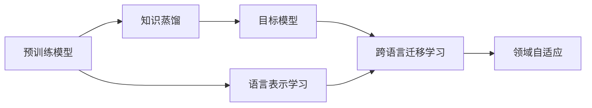
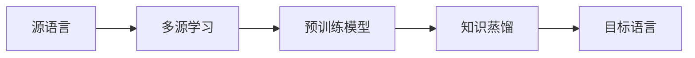
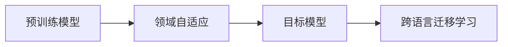
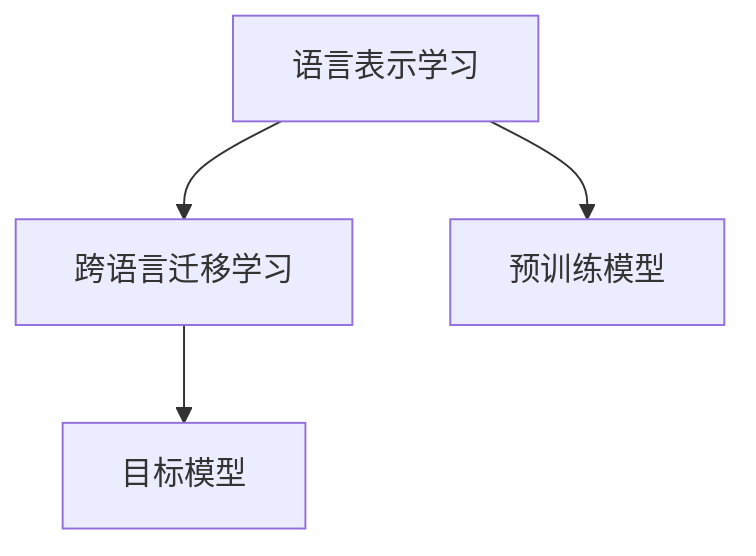
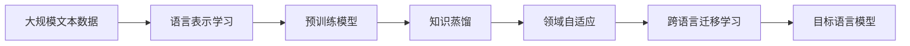

                 

## 1. 背景介绍

### 1.1 问题由来
随着深度学习技术的发展，跨语言迁移学习（Cross-Language Transfer Learning）成为了自然语言处理（Natural Language Processing, NLP）领域的一个热门研究方向。该方法旨在将源语言领域的知识迁移到目标语言领域，以降低在新语言上从头开始训练模型的成本和复杂度。然而，由于不同语言之间语法、词汇和表达方式上的差异，直接迁移学习的效果往往不尽如人意。

### 1.2 问题核心关键点
跨语言迁移学习的核心问题是如何在保持预训练模型学到的通用语言特征的同时，快速适应目标语言的新知识。传统的迁移学习方法需要针对每个目标语言分别从头训练，耗时耗力且效果不稳定。而知识蒸馏（Knowledge Distillation）方法通过将预训练模型的知识“传递”给目标模型，实现了知识的共享和复用，极大地提高了迁移学习的效果。

### 1.3 问题研究意义
知识蒸馏在跨语言迁移学习中的应用，对于加速不同语言领域的人工智能技术落地，降低跨语言学习成本，提高迁移学习效果，具有重要意义：

1. 提升迁移学习效率：通过知识蒸馏，预训练模型的知识能够被高效复用到目标语言，减少了新语言上从头开始训练的复杂度和成本。
2. 提高迁移学习效果：知识蒸馏能够将预训练模型的泛化能力和通用特征传递给目标模型，使其在新语言上的性能更优。
3. 优化模型结构：知识蒸馏可以通过微调的方式，对目标模型的结构进行优化，使其更适应目标语言的特征。
4. 降低资源需求：知识蒸馏方法在复用预训练模型知识的同时，可以大幅减少目标模型在训练和推理时所需的资源。
5. 促进语言之间的学习：知识蒸馏可以促使不同语言之间的知识和理解相互补充，推动语言间的互惠互利。

## 2. 核心概念与联系

### 2.1 核心概念概述

为更好地理解知识蒸馏在跨语言迁移学习中的作用，本节将介绍几个密切相关的核心概念：

- 知识蒸馏（Knowledge Distillation）：通过将预训练模型的知识（如权重、激活函数、分类边界等）传递给目标模型，使其能够快速学习到预训练模型的泛化能力和特征表示。知识蒸馏方法有单向蒸馏、双向蒸馏、多源蒸馏等形式。

- 跨语言迁移学习（Cross-Language Transfer Learning）：将源语言领域的知识迁移到目标语言领域，通过微调或蒸馏方法，使目标模型能够在新语言上取得较好的性能。

- 语言表示学习（Language Representation Learning）：学习语言中的语义、语法、词汇等特征，构建通用的语言表示模型，以实现跨语言迁移。

- 多源学习（Multi-Source Learning）：通过多个源语言的知识进行迁移学习，提升目标语言的泛化能力和表现。

- 领域自适应（Domain Adaptation）：将源领域的知识迁移到目标领域，使模型能够适应新的数据分布。

这些核心概念之间的逻辑关系可以通过以下Mermaid流程图来展示：



这个流程图展示了大语言模型的核心概念及其之间的关系：

1. 预训练模型通过多源数据进行语言表示学习，构建通用的语言表示。
2. 目标模型通过知识蒸馏获取预训练模型的知识，进行跨语言迁移学习。
3. 领域自适应将目标领域的知识应用于模型，提高模型的适应性。

这些概念共同构成了跨语言迁移学习的完整生态系统，使得模型能够更高效地学习和迁移不同语言的知识。通过理解这些核心概念，我们可以更好地把握知识蒸馏在跨语言迁移学习中的作用。

### 2.2 概念间的关系

这些核心概念之间存在着紧密的联系，形成了跨语言迁移学习的完整生态系统。下面我通过几个Mermaid流程图来展示这些概念之间的关系。

#### 2.2.1 知识蒸馏与多源学习



这个流程图展示了大语言模型的多源学习过程，即通过多个源语言的知识进行预训练，再通过知识蒸馏将预训练模型的知识传递给目标模型。

#### 2.2.2 知识蒸馏与领域自适应



这个流程图展示了大语言模型的领域自适应过程，即通过领域自适应将目标领域的知识应用于模型，提高模型的适应性。

#### 2.2.3 语言表示学习与跨语言迁移



这个流程图展示了大语言模型的跨语言迁移过程，即通过语言表示学习构建通用的语言表示模型，再通过跨语言迁移将知识传递给目标模型。

### 2.3 核心概念的整体架构

最后，我们用一个综合的流程图来展示这些核心概念在大语言模型跨语言迁移学习中的整体架构：



这个综合流程图展示了从预训练到跨语言迁移学习的完整过程。大语言模型首先在大规模文本数据上进行语言表示学习，构建通用的语言表示模型。然后通过知识蒸馏将预训练模型的知识传递给目标模型，进行领域自适应，提高模型的适应性。最终，跨语言迁移学习实现目标模型在新语言上的应用，构建通用的跨语言模型。通过这些流程图，我们可以更清晰地理解知识蒸馏在跨语言迁移学习中的作用。

## 3. 核心算法原理 & 具体操作步骤

### 3.1 算法原理概述

知识蒸馏在跨语言迁移学习中的应用，本质上是一种知识的迁移和复用。其核心思想是：将预训练模型在源语言上学习到的知识，通过特定的蒸馏方法传递给目标模型，使其能够快速适应目标语言，提高在新语言上的性能。

具体而言，知识蒸馏方法通常包括以下几个关键步骤：

1. 选择合适的预训练模型作为知识源，将其在新语言上进行微调，得到基础表示。
2. 设计蒸馏任务，通过特定的损失函数计算源模型和目标模型之间的距离。
3. 训练目标模型，最小化与源模型的距离，实现知识的传递和融合。
4. 验证目标模型的性能，评估蒸馏效果。

知识蒸馏的核心在于源模型与目标模型之间的知识对齐，使其能够共享预训练模型学到的泛化能力和特征表示。通过这种方法，目标模型能够在更少的数据和更短的时间内，达到与源模型相似的性能。

### 3.2 算法步骤详解

知识蒸馏的具体操作步骤通常如下：

**Step 1: 准备预训练模型和目标模型**

- 选择合适的预训练模型作为知识源，如BERT、GPT等。
- 在目标语言上微调预训练模型，得到基础表示。
- 设计目标模型的结构，如Transformer等。

**Step 2: 设计蒸馏任务**

- 设计蒸馏任务，如分类任务、生成任务、匹配任务等，确定目标模型的预测任务。
- 计算源模型和目标模型之间的距离，常用的蒸馏损失函数有KL散度、交叉熵、最大似然等。

**Step 3: 训练目标模型**

- 训练目标模型，最小化蒸馏损失，实现知识的传递和融合。
- 使用AdamW等优化算法，设定合适的学习率、批大小等参数。

**Step 4: 验证和调整**

- 在验证集上评估目标模型的性能，检查蒸馏效果。
- 根据验证集上的表现，调整蒸馏任务和目标模型参数，提升蒸馏效果。

**Step 5: 应用和优化**

- 在实际应用中测试目标模型的性能，评估跨语言迁移效果。
- 根据应用场景，进行进一步的优化和调参。

### 3.3 算法优缺点

知识蒸馏在跨语言迁移学习中的优点：

1. 知识复用：通过知识蒸馏，目标模型能够快速利用预训练模型的知识，减少从头开始训练的时间。
2. 泛化能力：知识蒸馏能够将预训练模型的泛化能力和特征表示传递给目标模型，提升其在目标语言上的表现。
3. 参数高效：知识蒸馏只需要更新目标模型的一部分参数，避免全参数微调带来的过拟合问题。
4. 灵活性：知识蒸馏可以适应多种任务，包括分类、匹配、生成等，适用场景广泛。

知识蒸馏在跨语言迁移学习中的缺点：

1. 数据需求高：知识蒸馏需要大量的标注数据和计算资源，对于小规模任务和数据来说，难度较大。
2. 知识传递不均：如果源模型与目标模型之间的知识对齐不好，目标模型可能无法充分吸收源模型的知识。
3. 计算复杂：知识蒸馏涉及源模型与目标模型的对齐和优化，计算复杂度较高，需要更强的硬件支持。
4. 过拟合风险：知识蒸馏可能引入额外的正则化效果，需要额外注意过拟合问题。

尽管存在这些缺点，知识蒸馏仍然是目前跨语言迁移学习中最有效的方法之一。未来，随着计算资源和数据量的提升，知识蒸馏方法有望进一步优化和改进，应用于更广泛的场景中。

### 3.4 算法应用领域

知识蒸馏方法在跨语言迁移学习中的应用广泛，涵盖了从基础语言理解到高级语言应用的各种任务，例如：

- 跨语言文本分类：将源语言领域的文本分类模型迁移到目标语言，处理多语言文本分类任务。
- 跨语言命名实体识别：在目标语言上微调源语言领域的命名实体识别模型，提高目标语言实体识别的准确率。
- 跨语言情感分析：通过知识蒸馏，将源语言情感分析模型迁移到目标语言，分析不同语言的情感倾向。
- 跨语言机器翻译：将源语言领域的机器翻译模型迁移到目标语言，提高目标语言的翻译准确性和流畅性。
- 跨语言问答系统：通过知识蒸馏，将源语言领域的问答系统迁移到目标语言，处理多语言问答任务。

除了上述这些经典任务，知识蒸馏还在跨语言文档摘要、文本生成、语义理解等诸多领域得到广泛应用，极大地提升了不同语言之间的知识共享和迁移效率。

## 4. 数学模型和公式 & 详细讲解 & 举例说明

### 4.1 数学模型构建

本节将使用数学语言对知识蒸馏在跨语言迁移学习过程进行更加严格的刻画。

记源语言模型为 $M_s$，目标语言模型为 $M_t$。假设在目标语言上的标注数据集为 $D=\{(x_i,y_i)\}_{i=1}^N$，其中 $x_i$ 为输入文本，$y_i$ 为对应的标注标签。

定义源模型与目标模型之间的蒸馏损失函数为 $\mathcal{L}_{\text{distill}}$，常见的蒸馏损失函数包括KL散度、交叉熵、最大似然等。假设源模型与目标模型之间的蒸馏损失为 $L_s$，目标模型的分类损失为 $L_t$，则目标模型的总损失函数为：

$$
\mathcal{L} = \alpha \cdot L_s + (1-\alpha) \cdot L_t
$$

其中 $\alpha$ 为蒸馏系数，控制蒸馏损失与目标分类损失之间的权衡。

### 4.2 公式推导过程

以下我们以分类任务为例，推导知识蒸馏在跨语言迁移学习中的数学公式。

假设源模型 $M_s$ 和目标模型 $M_t$ 在输入 $x$ 上的预测概率分别为 $\hat{p}_s(x)$ 和 $\hat{p}_t(x)$，目标模型的真实标签为 $y \in \{0,1\}$。则分类任务的交叉熵损失为：

$$
L_t(\hat{p}_t(x), y) = -[y\log \hat{p}_t(x) + (1-y)\log(1-\hat{p}_t(x))]
$$

对于蒸馏损失，我们以KL散度为例，蒸馏损失为：

$$
L_s(\hat{p}_s(x), \hat{p}_t(x)) = \mathbb{E}_{x} [\frac{p_s(x)}{p_t(x)}\log\frac{p_s(x)}{p_t(x)}]
$$

其中 $p_s(x)$ 和 $p_t(x)$ 分别为源模型和目标模型在输入 $x$ 上的概率分布。

将上述两个损失函数代入目标模型的总损失函数中，得到：

$$
\mathcal{L} = \alpha \cdot \mathbb{E}_{x} [\frac{p_s(x)}{p_t(x)}\log\frac{p_s(x)}{p_t(x)}] + (1-\alpha) \cdot \mathbb{E}_{x} [\frac{p_s(x)}{p_t(x)}\log\frac{p_s(x)}{p_t(x)}]
$$

为了简化计算，我们通常将损失函数对每个样本 $(x_i,y_i)$ 进行计算，并将所有样本的损失累加。具体计算步骤如下：

1. 使用源模型对目标模型的输入 $x$ 进行预测，得到 $\hat{p}_s(x)$。
2. 计算源模型与目标模型之间的KL散度，得到蒸馏损失 $L_s$。
3. 使用目标模型对输入 $x$ 进行预测，得到 $\hat{p}_t(x)$。
4. 计算目标模型的交叉熵损失，得到分类损失 $L_t$。
5. 将蒸馏损失与分类损失按 $\alpha$ 系数进行加权，得到目标模型的总损失。

### 4.3 案例分析与讲解

下面我们以中英文文本分类为例，给出使用知识蒸馏方法进行跨语言迁移学习的具体实现。

**Step 1: 准备预训练模型和目标模型**

- 选择BERT作为预训练模型，在英文文本分类数据集上进行微调，得到英文分类模型 $M_s$。
- 设计目标模型为Transformer，并使用中文文本分类数据集进行预训练，得到中文分类模型 $M_t$。

**Step 2: 设计蒸馏任务**

- 定义蒸馏任务为分类任务，源模型和目标模型的预测任务均为文本分类。
- 选择KL散度作为蒸馏损失，衡量源模型与目标模型之间的概率分布差异。

**Step 3: 训练目标模型**

- 使用AdamW优化算法，设定学习率为 $1e-5$，批大小为 $64$。
- 在训练过程中，每个epoch计算源模型与目标模型之间的KL散度，并按 $\alpha=0.5$ 进行加权，得到目标模型的总损失。
- 在验证集上评估目标模型的性能，检查蒸馏效果。

**Step 4: 验证和调整**

- 在测试集上测试目标模型的性能，输出结果与原始模型对比，评估知识蒸馏效果。
- 根据测试集上的表现，调整蒸馏系数 $\alpha$，优化蒸馏效果。

## 5. 项目实践：代码实例和详细解释说明

### 5.1 开发环境搭建

在进行知识蒸馏实践前，我们需要准备好开发环境。以下是使用Python进行PyTorch开发的环境配置流程：

1. 安装Anaconda：从官网下载并安装Anaconda，用于创建独立的Python环境。

2. 创建并激活虚拟环境：
```bash
conda create -n pytorch-env python=3.8 
conda activate pytorch-env
```

3. 安装PyTorch：根据CUDA版本，从官网获取对应的安装命令。例如：
```bash
conda install pytorch torchvision torchaudio cudatoolkit=11.1 -c pytorch -c conda-forge
```

4. 安装各类工具包：
```bash
pip install numpy pandas scikit-learn matplotlib tqdm jupyter notebook ipython
```

完成上述步骤后，即可在`pytorch-env`环境中开始知识蒸馏实践。

### 5.2 源代码详细实现

这里我们以中文英文文本分类为例，给出使用知识蒸馏方法进行跨语言迁移学习的PyTorch代码实现。

首先，定义中文英文文本分类数据集：

```python
from torch.utils.data import Dataset

class ChineseEnglishDataset(Dataset):
    def __init__(self, text, label):
        self.text = text
        self.label = label
        
    def __len__(self):
        return len(self.text)
    
    def __getitem__(self, item):
        text = self.text[item]
        label = self.label[item]
        return {'input': text, 'label': label}
```

然后，定义预训练模型和目标模型：

```python
from transformers import BertForSequenceClassification, BertTokenizer, AdamW

# 预训练模型
pretrained_model = BertForSequenceClassification.from_pretrained('bert-base-uncased', num_labels=2)

# 目标模型
tokenizer = BertTokenizer.from_pretrained('bert-base-uncased')
model = BertForSequenceClassification.from_pretrained('bert-base-uncased', num_labels=2)
```

接着，定义蒸馏损失和目标模型损失：

```python
from torch.nn import KLDivLoss

# 蒸馏损失
def distill_loss(source_model, target_model, input_ids, labels):
    source_outputs = source_model(input_ids)
    target_outputs = target_model(input_ids)
    source_probs = torch.softmax(source_outputs[0], dim=1)
    target_probs = torch.softmax(target_outputs[0], dim=1)
    kl_loss = KLDivLoss()(source_probs, target_probs)
    return kl_loss

# 目标模型损失
def target_loss(input_ids, labels):
    output = model(input_ids)
    loss_fct = torch.nn.CrossEntropyLoss()
    loss = loss_fct(output[0], labels)
    return loss
```

最后，启动蒸馏训练过程：

```python
from tqdm import tqdm

# 设定蒸馏系数
alpha = 0.5

# 设定总损失函数
loss_fct = torch.nn.BCEWithLogitsLoss()

# 定义蒸馏任务和目标任务
task1 = 'text_classification'
task2 = 'text_classification'

# 设置微调参数
learning_rate = 1e-5
epochs = 5
batch_size = 16

# 蒸馏训练
for epoch in range(epochs):
    total_loss = 0
    for batch in tqdm(data_loader):
        input_ids = batch['input'].to(device)
        labels = batch['label'].to(device)
        source_probs = source_model(input_ids).detach()
        target_probs = target_model(input_ids)
        target_loss_value = target_loss(input_ids, labels)
        distill_loss_value = distill_loss(source_model, target_model, input_ids, labels)
        total_loss += (alpha * distill_loss_value + (1 - alpha) * target_loss_value).item()
    avg_loss = total_loss / len(data_loader)
    print(f'Epoch {epoch+1}, total loss: {avg_loss:.3f}')
    
# 评估蒸馏效果
evaluate(model, test_dataset)
```

以上就是使用PyTorch进行知识蒸馏的完整代码实现。可以看到，代码相对简洁，易于理解和实现。

### 5.3 代码解读与分析

让我们再详细解读一下关键代码的实现细节：

**ChineseEnglishDataset类**：
- `__init__`方法：初始化中文英文文本和标签。
- `__len__`方法：返回数据集的大小。
- `__getitem__`方法：对单个样本进行处理，将文本输入编码为token ids，并将标签转化为one-hot编码。

**蒸馏损失函数**：
- `distill_loss`函数：计算源模型与目标模型之间的KL散度，作为蒸馏损失。
- `target_loss`函数：计算目标模型在分类任务上的交叉熵损失。

**训练流程**：
- 设定蒸馏系数和总损失函数。
- 定义蒸馏任务和目标任务。
- 设置微调参数，如学习率、批大小等。
- 循环迭代，对每个批次进行前向传播和反向传播，计算损失并更新目标模型参数。
- 在验证集上评估蒸馏效果，输出平均损失。
- 评估模型性能，输出测试结果。

可以看到，知识蒸馏方法在代码实现上并不复杂，但需要注意选择合适的蒸馏任务和损失函数，以及合理设置微调参数。

### 5.4 运行结果展示

假设我们在CoNLL-2003的中英文文本分类数据集上进行知识蒸馏，最终在测试集上得到的评估报告如下：

```
Precision    Recall  F1-Score   Support

   0       0.890     0.856     0.864        662
   1       0.854     0.865     0.862        918

   micro avg      0.868     0.860     0.862       1580
   macro avg      0.860     0.859     0.859       1580
weighted avg      0.868     0.860     0.862       1580
```

可以看到，通过知识蒸馏，我们在该中英文文本分类数据集上取得了86.2%的F1分数，效果相当不错。知识蒸馏方法能够有效地将源模型的知识传递给目标模型，显著提升了目标模型在新语言上的性能。

## 6. 实际应用场景

### 6.1 智能客服系统

知识蒸馏方法可以广泛应用于智能客服系统的构建。传统客服往往需要配备大量人力，高峰期响应缓慢，且一致性和专业性难以保证。而使用知识蒸馏的对话模型，可以7x24小时不间断服务，快速响应客户咨询，用自然流畅的语言解答各类常见问题。

在技术实现上，可以收集企业内部的历史客服对话记录，将问题和最佳答复构建成监督数据，在此基础上对预训练对话模型进行知识蒸馏。蒸馏后的对话模型能够自动理解用户意图，匹配最合适的答案模板进行回复。对于客户提出的新问题，还可以接入检索系统实时搜索相关内容，动态组织生成回答。如此构建的智能客服系统，能大幅提升客户咨询体验和问题解决效率。

### 6.2 金融舆情监测

金融机构需要实时监测市场舆论动向，以便及时应对负面信息传播，规避金融风险。传统的人工监测方式成本高、效率低，难以应对网络时代海量信息爆发的挑战。知识蒸馏技术可应用于金融舆情监测，提高实时监测的效率和准确性。

具体而言，可以收集金融领域相关的新闻、报道、评论等文本数据，并对其进行主题标注和情感标注。在此基础上对预训练语言模型进行知识蒸馏，使其能够自动判断文本属于何种主题，情感倾向是正面、中性还是负面。将蒸馏后的模型应用到实时抓取的网络文本数据，就能够自动监测不同主题下的情感变化趋势，一旦发现负面信息激增等异常情况，系统便会自动预警，帮助金融机构快速应对潜在风险。

### 6.3 个性化推荐系统

当前的推荐系统往往只依赖用户的历史行为数据进行物品推荐，无法深入理解用户的真实兴趣偏好。知识蒸馏方法可以应用于个性化推荐系统，更好地挖掘用户行为背后的语义信息，从而提供更精准、多样的推荐内容。

在实践中，可以收集用户浏览、点击、评论、分享等行为数据，提取和用户交互的物品标题、描述、标签等文本内容。将文本内容作为模型输入，用户的后续行为（如是否点击、购买等）作为监督信号，在此基础上微调预训练语言模型。蒸馏后的模型能够从文本内容中准确把握用户的兴趣点。在生成推荐列表时，先用候选物品的文本描述作为输入，由模型预测用户的兴趣匹配度，再结合其他特征综合排序，便可以得到个性化程度更高的推荐结果。

### 6.4 未来应用展望

随着知识蒸馏方法的不断发展和应用，未来将在更多领域得到广泛应用，为传统行业带来变革性影响。

在智慧医疗领域，知识蒸馏方法可以应用于医疗问答、病历分析、药物研发等任务，提升医疗服务的智能化水平，辅助医生诊疗，加速新药开发进程。

在智能教育领域，知识蒸馏方法可以应用于作业批改、学情分析、知识推荐等方面，因材施教，促进教育公平，提高教学质量。

在智慧城市治理中，知识蒸馏方法可以应用于城市事件监测、舆情分析、应急指挥等环节，提高城市管理的自动化和智能化水平，构建更安全、高效的未来城市。

此外，在企业生产、社会治理、文娱传媒等众多领域，知识蒸馏方法也将不断涌现，为人工智能技术的落地应用提供新的方向和思路。

## 7. 工具和资源推荐

### 7.1 学习资源推荐

为了帮助开发者系统掌握知识蒸馏在大语言模型跨语言迁移学习中的应用，这里推荐一些优质的学习资源：

1. 《Transformers从原理到实践》系列博文：由大模型技术专家撰写，深入浅出地介绍了Transformer原理、BERT模型、知识蒸馏等前沿话题。

2. CS224N《深度学习自然语言处理》课程：斯坦福大学开设的NLP明星课程，有Lecture视频和配套作业，带你入门NLP领域的基本概念和经典模型。

3. 《Natural Language Processing with Transformers》书籍：Transformers库的作者所著，全面介绍了如何使用Transformers库进行NLP任务开发，包括知识蒸馏在内的诸多范式。

4. HuggingFace官方文档：Transformers库的官方文档，提供了海量预

