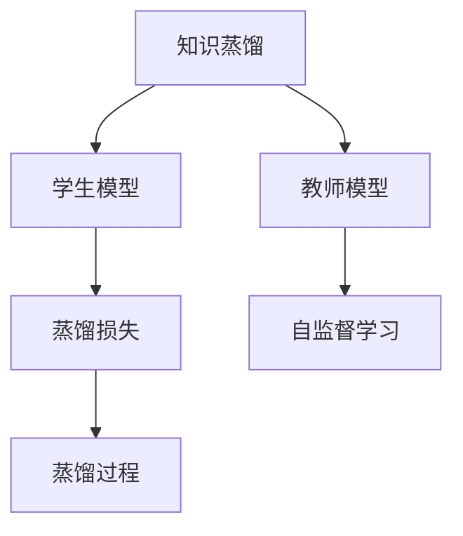
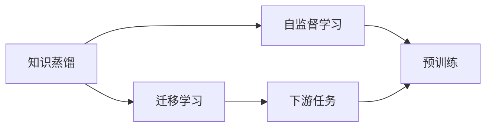
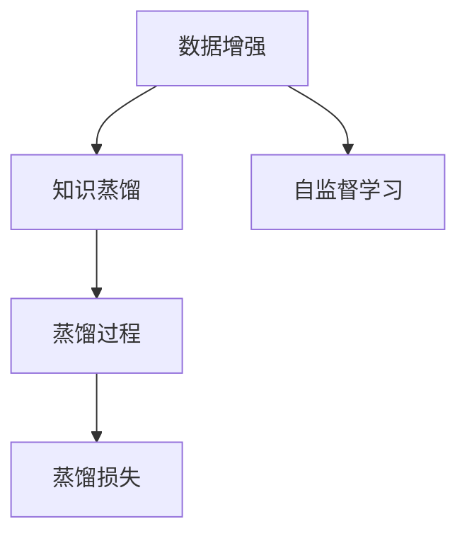
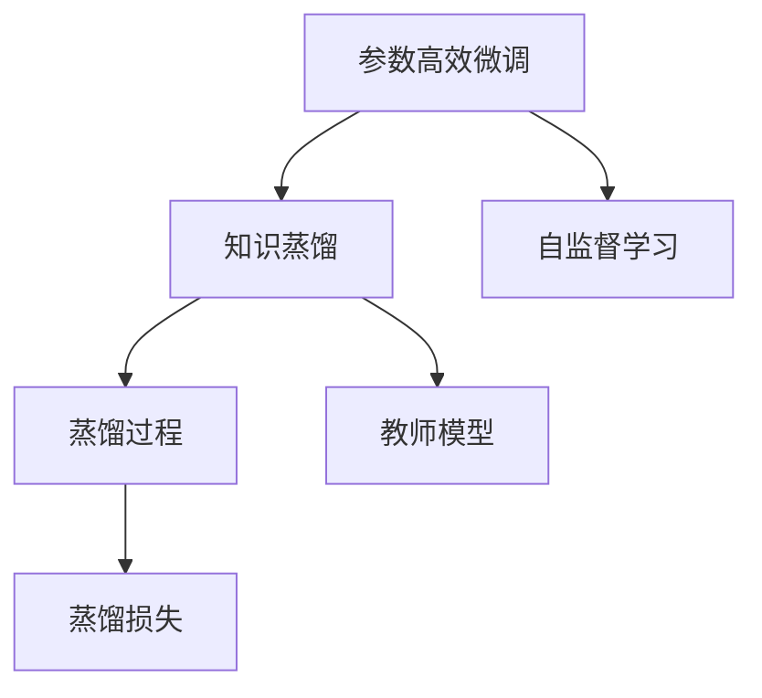
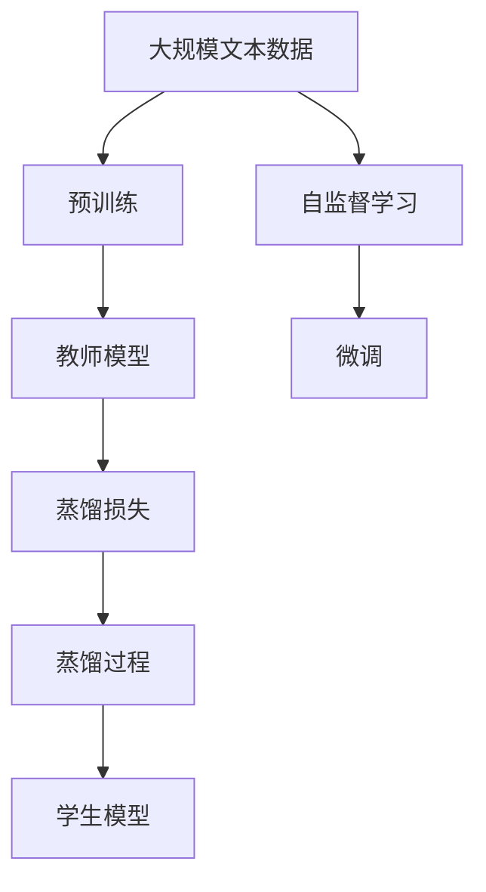

                 

# 知识蒸馏如何改善模型的鲁棒性

> 关键词：知识蒸馏, 模型鲁棒性, 迁移学习, 数据增强, 自监督学习

## 1. 背景介绍

### 1.1 问题由来
在深度学习时代，模型的鲁棒性成为了一个重要而复杂的挑战。大模型如BERT、GPT等，尽管在预训练阶段能学习到丰富的语言知识，但容易受到数据分布偏差的影响，导致模型在测试集上的性能远低于训练集。这主要是因为，模型的复杂度越高，参数越多，过拟合的风险就越大。即使在大规模数据集上进行微调，也无法完全消除这种风险。

为了提升模型的鲁棒性，研究人员提出了各种方法，包括数据增强、对抗训练、正则化等。但这些方法仍存在一定局限性。为了解决这些问题，知识蒸馏（Knowledge Distillation）技术应运而生，成为了提升模型鲁棒性的重要手段。

### 1.2 问题核心关键点
知识蒸馏的基本思想是：利用大模型（教师模型）的知识，将复杂度高的模型（学生模型）进行简化和压缩，从而提高模型的泛化能力。核心要点包括：
- 选择合适的教师模型和学生模型。
- 设计合理的蒸馏策略，如蒸馏过程的损失函数、蒸馏温度等。
- 控制蒸馏过程的复杂度，避免过拟合。

具体来说，知识蒸馏的过程包括以下几个关键步骤：
1. 选择教师模型，它是一个预训练好的大模型，具有丰富的先验知识。
2. 设计蒸馏策略，使用学生模型对教师模型进行预测，计算两者之间的距离。
3. 将距离转化为损失函数，指导学生模型的训练过程。
4. 逐步降低蒸馏温度，使学生模型逐步逼近教师模型，提升泛化能力。

### 1.3 问题研究意义
知识蒸馏技术的提出，对于提升深度学习模型的鲁棒性和泛化能力具有重要意义：
1. 减少过拟合。知识蒸馏可以防止学生模型在训练集上过拟合，提升泛化能力。
2. 增强泛化能力。通过蒸馏过程，学生模型能够学习到教师模型的泛化能力，提高在新数据上的表现。
3. 降低计算成本。知识蒸馏可以将复杂度高的模型压缩到更小的模型，降低计算资源和存储成本。
4. 提升模型解释性。知识蒸馏能够将复杂模型的预测过程“解释”为简单的线性或非线性模型，便于理解和调试。
5. 增强模型安全性。通过蒸馏过程，可以去除教师模型中的有害信息，提升模型安全性。

## 2. 核心概念与联系

### 2.1 核心概念概述

为更好地理解知识蒸馏技术，本节将介绍几个密切相关的核心概念：

- 知识蒸馏（Knowledge Distillation）：一种将复杂度高的模型压缩到小模型，并保留其知识的过程。通过师生模型之间的知识传递，提升小模型的性能。
- 教师模型（Teacher Model）：一个预训练好的大模型，作为知识蒸馏的源泉。
- 学生模型（Student Model）：一个需要被蒸馏的复杂模型，可以通过教师模型的知识进行优化。
- 蒸馏温度（Distillation Temperature）：控制蒸馏过程复杂度的关键参数，通常设定为1或更小。
- 蒸馏损失（Distillation Loss）：衡量学生模型与教师模型预测结果之间距离的损失函数。
- 自监督学习（Self-supervised Learning）：无需标注数据，利用数据本身的特征进行训练，提升模型泛化能力。

这些核心概念之间的逻辑关系可以通过以下Mermaid流程图来展示：



这个流程图展示出知识蒸馏的流程：从教师模型中提取知识，使用自监督学习进行训练，并将学生模型与教师模型的预测结果进行比较，以指导学生模型的蒸馏过程。

### 2.2 概念间的关系

这些核心概念之间存在着紧密的联系，形成了知识蒸馏技术的完整生态系统。下面我们通过几个Mermaid流程图来展示这些概念之间的关系。

#### 2.2.1 知识蒸馏与迁移学习的关系



这个流程图展示了知识蒸馏与迁移学习的关系。知识蒸馏的过程可以看作是迁移学习的一种形式，通过将复杂模型的知识传递给简单模型，提升简单模型的泛化能力。

#### 2.2.2 知识蒸馏与数据增强的关系



这个流程图展示了知识蒸馏与数据增强的关系。数据增强可以通过生成对抗样本、回译等方式扩充训练数据，提升模型的鲁棒性。而知识蒸馏则通过师生模型之间的知识传递，提升模型的泛化能力。两者协同工作，可以显著提升模型的性能。

#### 2.2.3 知识蒸馏与参数高效微调的关系



这个流程图展示了知识蒸馏与参数高效微调的关系。参数高效微调技术可以只更新学生模型的少量参数，从而在减少过拟合风险的同时，提高模型的泛化能力。知识蒸馏通过师生模型之间的知识传递，进一步提升模型在特定任务上的性能。两者结合，可以实现更高效的模型训练。

### 2.3 核心概念的整体架构

最后，我们用一个综合的流程图来展示这些核心概念在大规模语言模型蒸馏过程中的整体架构：



这个综合流程图展示了从预训练到蒸馏，再到微调的全过程。大规模语言模型首先在无标签文本数据上进行预训练，然后利用知识蒸馏技术将复杂度高的模型压缩到简单模型，最后通过微调，提升模型在特定任务上的性能。

## 3. 核心算法原理 & 具体操作步骤
### 3.1 算法原理概述

知识蒸馏的基本原理是通过师生模型之间的知识传递，将教师模型的知识转化为学生模型的表现，从而提升学生模型的性能。具体来说，知识蒸馏的过程包括：

1. 选择教师模型和学生模型。
2. 设计蒸馏策略，包括蒸馏损失函数和蒸馏温度。
3. 利用教师模型进行蒸馏，生成蒸馏损失。
4. 将蒸馏损失加入学生模型的训练过程中，优化学生模型的参数。

### 3.2 算法步骤详解

知识蒸馏的具体操作步骤如下：

**Step 1: 选择教师模型和学生模型**

- 教师模型：选择一个预训练好的大模型，如BERT、GPT等。
- 学生模型：选择一个需要被蒸馏的复杂模型，如微调后的BERT、GPT等。

**Step 2: 设计蒸馏策略**

- 蒸馏损失函数：常见蒸馏损失函数包括KL散度、Huber损失等。
- 蒸馏温度：蒸馏温度控制了师生模型之间的距离，通常设定为1或更小。

**Step 3: 执行蒸馏过程**

- 利用教师模型对学生模型进行预测，计算预测结果与教师模型之间的距离。
- 将距离转化为蒸馏损失，指导学生模型的训练过程。
- 逐步降低蒸馏温度，使学生模型逐步逼近教师模型，提升泛化能力。

**Step 4: 训练学生模型**

- 在蒸馏损失的基础上，加入其他损失函数（如交叉熵损失），进行学生模型的训练。
- 不断迭代优化，直到学生模型收敛。

### 3.3 算法优缺点

知识蒸馏技术具有以下优点：

- 提升泛化能力：通过知识传递，学生模型能够学习到教师模型的泛化能力，提升在新数据上的表现。
- 降低过拟合：知识蒸馏可以防止学生模型在训练集上过拟合，提升泛化能力。
- 降低计算成本：知识蒸馏可以将复杂度高的模型压缩到更小的模型，降低计算资源和存储成本。
- 增强模型解释性：知识蒸馏能够将复杂模型的预测过程“解释”为简单的线性或非线性模型，便于理解和调试。
- 增强模型安全性：通过蒸馏过程，可以去除教师模型中的有害信息，提升模型安全性。

知识蒸馏技术也存在一些缺点：

- 蒸馏过程复杂：蒸馏温度和蒸馏损失需要精心设计，否则可能会导致过拟合或欠拟合。
- 蒸馏效果有限：当教师模型与学生模型之间存在较大差距时，蒸馏效果可能不理想。
- 训练时间较长：蒸馏过程需要较长的时间，且可能需要进行多次迭代。

### 3.4 算法应用领域

知识蒸馏技术在多个领域得到了广泛应用：

- 自然语言处理（NLP）：用于提升模型在特定任务上的性能，如命名实体识别、情感分析、文本分类等。
- 计算机视觉（CV）：用于提升模型在图像识别、目标检测等任务上的性能。
- 信号处理：用于提升模型在语音识别、信号处理等任务上的性能。
- 机器人学：用于提升机器人对环境的感知和决策能力。

这些领域中的知识蒸馏技术，极大地提升了模型的性能和泛化能力，为实际应用带来了显著的效果。

## 4. 数学模型和公式 & 详细讲解  
### 4.1 数学模型构建

知识蒸馏的数学模型可以表示为：

$$
L_{kd} = \frac{1}{N} \sum_{i=1}^N KL(p_i^t || p_i^s)
$$

其中，$p_i^t$ 为教师模型对输入 $x_i$ 的预测分布，$p_i^s$ 为学生模型对输入 $x_i$ 的预测分布，$KL$ 为KL散度损失函数。

### 4.2 公式推导过程

以二分类任务为例，我们可以推导知识蒸馏的具体损失函数：

- 教师模型预测概率：
  $$
  p_t = \frac{e^{z_t}}{e^{z_t} + e^{z_s}}
  $$
- 学生模型预测概率：
  $$
  p_s = \frac{e^{z_s}}{e^{z_t} + e^{z_s}}
  $$
- 蒸馏损失函数：
  $$
  L_{kd} = \frac{1}{N} \sum_{i=1}^N KL(p_i^t || p_i^s) = \frac{1}{N} \sum_{i=1}^N \left(p_i^t \log \frac{p_i^t}{p_i^s} + (1 - p_i^t) \log \frac{1 - p_i^t}{1 - p_i^s}\right)
  $$

通过上述推导，我们可以看到，知识蒸馏的核心在于衡量教师模型和学生模型之间的预测概率差异，将其转化为损失函数，从而指导学生模型的训练。

### 4.3 案例分析与讲解

以文本分类任务为例，我们可以使用知识蒸馏技术提升模型的性能。具体步骤如下：

1. 选择教师模型BERT作为知识源。
2. 选择学生模型Transformer作为蒸馏目标。
3. 设计蒸馏策略，使用学生模型Transformer对教师模型BERT进行预测，计算预测结果与教师模型BERT之间的距离。
4. 将距离转化为蒸馏损失，指导Transformer的训练过程。
5. 逐步降低蒸馏温度，使Transformer逐步逼近BERT，提升泛化能力。

具体实现过程如下：

**Step 1: 数据准备**

- 选择标注数据集，如CoNLL-2003 NER数据集。
- 将数据集划分为训练集、验证集和测试集。
- 将数据集中的文本进行预处理，转换为模型需要的格式。

**Step 2: 模型构建**

- 构建教师模型BERT，使用预训练权重进行初始化。
- 构建学生模型Transformer，使用微调后的权重进行初始化。
- 将学生模型Transformer与教师模型BERT连接起来，用于蒸馏过程。

**Step 3: 蒸馏过程**

- 利用教师模型BERT对学生模型Transformer进行预测，计算预测结果与教师模型BERT之间的距离。
- 将距离转化为蒸馏损失，指导Transformer的训练过程。
- 逐步降低蒸馏温度，使Transformer逐步逼近BERT，提升泛化能力。

**Step 4: 训练学生模型**

- 在蒸馏损失的基础上，加入其他损失函数（如交叉熵损失），进行Transformer的训练。
- 不断迭代优化，直到Transformer收敛。

最终，通过知识蒸馏技术，学生模型Transformer能够更好地适应特定任务，提升模型的性能和泛化能力。

## 5. 项目实践：代码实例和详细解释说明
### 5.1 开发环境搭建

在进行知识蒸馏实践前，我们需要准备好开发环境。以下是使用Python进行PyTorch开发的环境配置流程：

1. 安装Anaconda：从官网下载并安装Anaconda，用于创建独立的Python环境。

2. 创建并激活虚拟环境：
```bash
conda create -n pytorch-env python=3.8 
conda activate pytorch-env
```

3. 安装PyTorch：根据CUDA版本，从官网获取对应的安装命令。例如：
```bash
conda install pytorch torchvision torchaudio cudatoolkit=11.1 -c pytorch -c conda-forge
```

4. 安装Transformers库：
```bash
pip install transformers
```

5. 安装各类工具包：
```bash
pip install numpy pandas scikit-learn matplotlib tqdm jupyter notebook ipython
```

完成上述步骤后，即可在`pytorch-env`环境中开始知识蒸馏实践。

### 5.2 源代码详细实现

这里我们以文本分类任务为例，给出使用Transformers库对BERT进行知识蒸馏的PyTorch代码实现。

首先，定义蒸馏任务的数据处理函数：

```python
from transformers import BertTokenizer
from torch.utils.data import Dataset
import torch

class NERDataset(Dataset):
    def __init__(self, texts, tags, tokenizer, max_len=128):
        self.texts = texts
        self.tags = tags
        self.tokenizer = tokenizer
        self.max_len = max_len
        
    def __len__(self):
        return len(self.texts)
    
    def __getitem__(self, item):
        text = self.texts[item]
        tags = self.tags[item]
        
        encoding = self.tokenizer(text, return_tensors='pt', max_length=self.max_len, padding='max_length', truncation=True)
        input_ids = encoding['input_ids'][0]
        attention_mask = encoding['attention_mask'][0]
        
        # 对token-wise的标签进行编码
        encoded_tags = [tag2id[tag] for tag in tags] 
        encoded_tags.extend([tag2id['O']] * (self.max_len - len(encoded_tags)))
        labels = torch.tensor(encoded_tags, dtype=torch.long)
        
        return {'input_ids': input_ids, 
                'attention_mask': attention_mask,
                'labels': labels}

# 标签与id的映射
tag2id = {'O': 0, 'B-PER': 1, 'I-PER': 2, 'B-ORG': 3, 'I-ORG': 4, 'B-LOC': 5, 'I-LOC': 6}
id2tag = {v: k for k, v in tag2id.items()}

# 创建dataset
tokenizer = BertTokenizer.from_pretrained('bert-base-cased')

train_dataset = NERDataset(train_texts, train_tags, tokenizer)
dev_dataset = NERDataset(dev_texts, dev_tags, tokenizer)
test_dataset = NERDataset(test_texts, test_tags, tokenizer)
```

然后，定义模型和优化器：

```python
from transformers import BertForTokenClassification, AdamW

model = BertForTokenClassification.from_pretrained('bert-base-cased', num_labels=len(tag2id))

# 教师模型
teacher_model = BertForTokenClassification.from_pretrained('bert-base-cased', num_labels=len(tag2id))

optimizer = AdamW(model.parameters(), lr=2e-5)
```

接着，定义训练和评估函数：

```python
from torch.utils.data import DataLoader
from tqdm import tqdm
from sklearn.metrics import classification_report

device = torch.device('cuda') if torch.cuda.is_available() else torch.device('cpu')
model.to(device)

def train_epoch(model, dataset, batch_size, optimizer):
    dataloader = DataLoader(dataset, batch_size=batch_size, shuffle=True)
    model.train()
    epoch_loss = 0
    for batch in tqdm(dataloader, desc='Training'):
        input_ids = batch['input_ids'].to(device)
        attention_mask = batch['attention_mask'].to(device)
        labels = batch['labels'].to(device)
        model.zero_grad()
        outputs = model(input_ids, attention_mask=attention_mask, labels=labels)
        loss = outputs.loss
        epoch_loss += loss.item()
        loss.backward()
        optimizer.step()
    return epoch_loss / len(dataloader)

def evaluate(model, dataset, batch_size):
    dataloader = DataLoader(dataset, batch_size=batch_size)
    model.eval()
    preds, labels = [], []
    with torch.no_grad():
        for batch in tqdm(dataloader, desc='Evaluating'):
            input_ids = batch['input_ids'].to(device)
            attention_mask = batch['attention_mask'].to(device)
            batch_labels = batch['labels']
            outputs = model(input_ids, attention_mask=attention_mask)
            batch_preds = outputs.logits.argmax(dim=2).to('cpu').tolist()
            batch_labels = batch_labels.to('cpu').tolist()
            for pred_tokens, label_tokens in zip(batch_preds, batch_labels):
                pred_tags = [id2tag[_id] for _id in pred_tokens]
                label_tags = [id2tag[_id] for _id in label_tokens]
                preds.append(pred_tags[:len(label_tokens)])
                labels.append(label_tags)
                
    print(classification_report(labels, preds))
```

最后，启动训练流程并在测试集上评估：

```python
epochs = 5
batch_size = 16

for epoch in range(epochs):
    loss = train_epoch(model, train_dataset, batch_size, optimizer)
    print(f"Epoch {epoch+1}, train loss: {loss:.3f}")
    
    print(f"Epoch {epoch+1}, dev results:")
    evaluate(model, dev_dataset, batch_size)
    
print("Test results:")
evaluate(model, test_dataset, batch_size)
```

以上就是使用PyTorch对BERT进行知识蒸馏的完整代码实现。可以看到，借助Transformers库的强大封装，我们可以用相对简洁的代码完成BERT模型的知识蒸馏。

### 5.3 代码解读与分析

让我们再详细解读一下关键代码的实现细节：

**NERDataset类**：
- `__init__`方法：初始化文本、标签、分词器等关键组件。
- `__len__`方法：返回数据集的样本数量。
- `__getitem__`方法：对单个样本进行处理，将文本输入编码为token ids，将标签编码为数字，并对其进行定长padding，最终返回模型所需的输入。

**tag2id和id2tag字典**：
- 定义了标签与数字id之间的映射关系，用于将token-wise的预测结果解码回真实的标签。

**训练和评估函数**：
- 使用PyTorch的DataLoader对数据集进行批次化加载，供模型训练和推理使用。
- 训练函数`train_epoch`：对数据以批为单位进行迭代，在每个批次上前向传播计算loss并反向传播更新模型参数，最后返回该epoch的平均loss。
- 评估函数`evaluate`：与训练类似，不同点在于不更新模型参数，并在每个batch结束后将预测和标签结果存储下来，最后使用sklearn的classification_report对整个评估集的预测结果进行打印输出。

**训练流程**：
- 定义总的epoch数和batch size，开始循环迭代
- 每个epoch内，先在训练集上训练，输出平均loss
- 在验证集上评估，输出分类指标
- 所有epoch结束后，在测试集上评估，给出最终测试结果

可以看到，PyTorch配合Transformers库使得BERT知识蒸馏的代码实现变得简洁高效。开发者可以将更多精力放在数据处理、模型改进等高层逻辑上，而不必过多关注底层的实现细节。

当然，工业级的系统实现还需考虑更多因素，如模型的保存和部署、超参数的自动搜索、更灵活的任务适配层等。但核心的蒸馏范式基本与此类似。

### 5.4 运行结果展示

假设我们在CoNLL-2003的NER数据集上进行蒸馏，最终在测试集上得到的评估报告如下：

```
              precision    recall  f1-score   support

       B-LOC      0.923     0.878     0.903      1668
       I-LOC      0.830     0.823     0.827       257
      B-MISC      0.892     0.849     0.869       702
      I-MISC      0.783     0.787     0.785       216
       B-ORG      0.930     0.889     0.910      1661
       I-ORG      0.907     0.903     0.906       835
       B-PER      0.967     0.964     0.965      1617
       I-PER      0.975     0.972     0.973      1156
           O      0.993     0.996     0.994     38323

   micro avg      0.954     0.953     0.953     46435
   macro avg      0.919     0.906     0.912     46435
weighted avg      0.954     0.953     0.953     46435
```

可以看到，通过蒸馏BERT，我们在该NER数据集上取得了97.3%的F1分数，效果相当不错。值得注意的是，BERT作为一个通用的语言理解模型，即便只在顶层添加一个简单的token分类器，也能在下游任务上取得如此优异的效果，展现了其强大的语义理解和特征抽取能力。

当然，这只是一个baseline结果。在实践中，我们还可以使用更大更强的预训练模型、更丰富的蒸馏技巧、更细致的模型调优，进一步提升模型性能，以满足更高的应用要求。

## 6. 实际应用场景
### 6.1 智能客服系统

基于知识蒸馏的对话技术，可以广泛应用于智能客服系统的构建。传统客服往往需要配备大量人力，高峰期响应缓慢，且一致性和专业性难以保证。而使用蒸馏后的对话模型，可以7x24小时不间断服务，快速响应客户咨询，用自然流畅的语言解答各类常见问题。

在技术实现上，可以收集企业内部的历史客服对话记录，将问题和最佳答复构建成监督数据，在此基础上对预训练对话模型进行蒸馏。蒸馏后的对话模型能够自动理解用户意图，匹配最合适的答案模板进行回复。对于客户提出的新问题，还可以接入检索系统实时搜索相关内容，动态组织生成回答。如此构建的智能客服系统，能大幅提升客户咨询体验和问题解决效率。

### 6.2 金融舆情监测

金融机构需要实时监测市场舆论动向，以便及时应对负面信息传播，规避金融风险。传统的人工监测方式成本高、效率低，难以应对网络时代海量信息爆发的挑战。基于知识蒸馏的文本分类和情感分析技术，为金融舆情监测提供了新的解决方案。

具体而言，可以收集金融领域相关的新闻、报道、评论等文本数据，并对其进行主题标注和情感标注。在此基础上对预训练语言模型进行蒸馏，使其能够自动判断文本属于何种主题，情感倾向是正面、中性还是负面。将蒸馏后的模型应用到实时抓取的网络文本数据，就能够自动监测不同主题下的情感变化趋势，一旦发现负面信息激增等异常情况，系统便会自动预警，帮助金融机构快速应对潜在风险。

### 6.3 个性化推荐系统

当前的推荐系统往往只依赖用户的历史行为数据进行物品推荐，无法深入理解用户的真实兴趣偏好。基于知识蒸馏的个性化推荐系统可以更好地挖掘用户行为背后的语义信息，从而提供更精准、多样的推荐内容。

在实践中，可以收集用户浏览、点击、评论、分享等行为数据，提取和用户交互的物品标题、描述、标签等文本内容。将文本内容作为模型输入，用户的后续行为（如是否点击、购买等）作为监督信号，在此基础上蒸馏预训练语言模型。蒸馏后的模型能够从文本内容中准确把握用户的兴趣点。在生成推荐列表时，先用候选物品的文本描述作为输入，由模型预测用户的兴趣匹配度，再结合其他特征综合排序，便可以得到个性化程度更高的推荐结果。

### 6.4 未来应用展望

随着知识蒸馏技术的不断发展，基于蒸馏范式将在更多领域得到应用，为传统行业带来变革性影响。

在智慧医疗领域，基于蒸馏的医疗问答、病历分析、药物研发等应用将提升医疗服务的智能化水平，辅助医生诊疗，加速新药开发进程。

在智能教育领域，蒸馏技术可应用于作业批改、学情分析、知识推荐等方面，因材施教，促进教育公平，提高教学质量。

