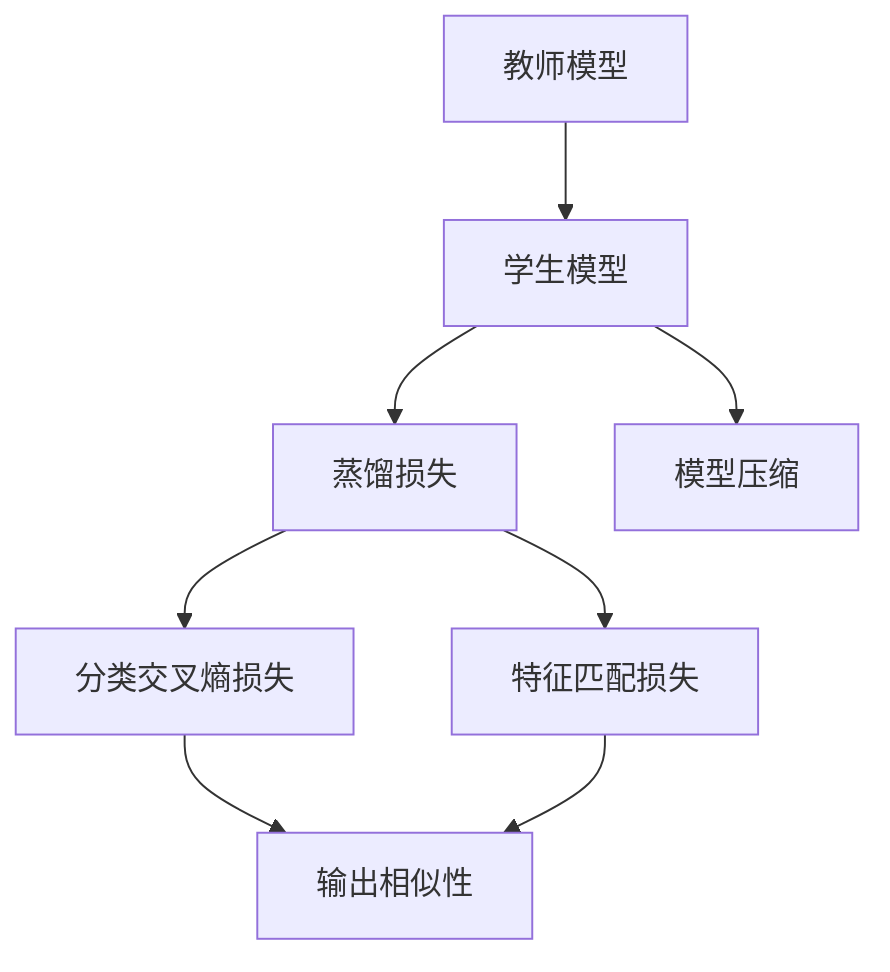
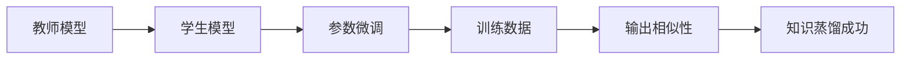
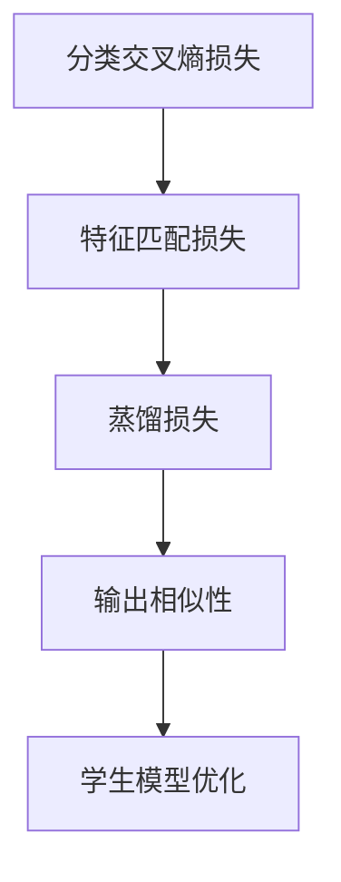
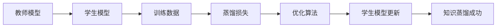
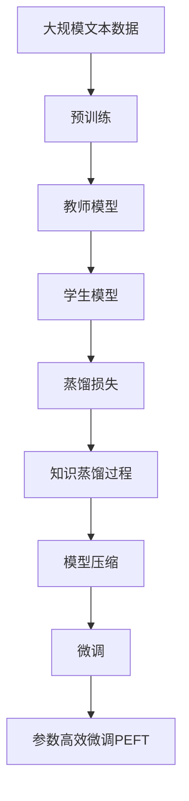

                 

# 知识蒸馏：捕获模型细微信息的压缩方法

## 1. 背景介绍

### 1.1 问题由来
知识蒸馏（Knowledge Distillation，KD）是一种经典的模型压缩方法，旨在将复杂大模型中的知识迁移到更小、更高效的模型上，以降低计算资源消耗，同时保持模型的预测精度。近年来，随着深度学习模型的日渐复杂，训练和部署大模型的成本变得越来越高，而知识蒸馏提供了一种有效的解决方案，为模型压缩和优化开辟了新的道路。

### 1.2 问题核心关键点
知识蒸馏的核心在于通过将教师模型（teacher model）的知识迁移到学生模型（student model）中，使得学生模型在保证输出结果相似的前提下，参数数量大幅减少，计算效率显著提升。其核心思想可以概括为：

- 选择优秀的大模型作为教师模型，构建知识蒸馏的框架。
- 设计蒸馏损失函数，指导学生模型学习教师模型的知识。
- 训练学生模型，使其逐步逼近教师模型的性能。
- 使用学生模型替换教师模型，实现模型压缩。

知识蒸馏的应用广泛，包括图像分类、目标检测、语音识别、自然语言处理等多个领域，已成为了模型压缩和优化的重要手段。

### 1.3 问题研究意义
知识蒸馏技术的应用，具有以下重要意义：

1. **资源优化**：大规模模型往往需要极高的计算资源，通过知识蒸馏，可以将大模型的计算资源和存储空间显著压缩，降低系统成本。
2. **性能提升**：学生模型可以吸收教师模型的知识，即使参数更少，也能取得与教师模型相当的性能。
3. **易部署性**：学生模型通常更加轻量级，部署速度快，适合在嵌入式设备、移动端等资源受限的环境中应用。
4. **鲁棒性增强**：知识蒸馏过程可以提高模型的泛化能力，使模型在面对不同数据分布时表现更加稳定。
5. **自动化优化**：知识蒸馏可以自动化地进行模型优化，减少手动调参的时间和成本。

## 2. 核心概念与联系

### 2.1 核心概念概述

为更好地理解知识蒸馏的方法，本节将介绍几个密切相关的核心概念：

- **教师模型**：即源模型，通常是一个预训练的、复杂度较高的模型，具有丰富的知识表示能力。
- **学生模型**：即目标模型，通常是一个简单、小型的模型，需要进行知识迁移。
- **蒸馏损失**：设计用于指导学生模型学习教师模型知识的损失函数，一般包括分类交叉熵损失、特征匹配损失等。
- **知识迁移**：通过蒸馏损失函数，将教师模型的知识迁移到学生模型中，使学生模型输出与教师模型相似。
- **模型压缩**：通过知识蒸馏，学生模型在保持高精度的同时，大幅减小了参数和计算量。

这些概念之间的逻辑关系可以通过以下Mermaid流程图来展示：



这个流程图展示了知识蒸馏的核心流程：

1. 教师模型作为知识源，指导学生模型学习。
2. 通过分类交叉熵损失和特征匹配损失指导学生模型输出与教师模型相似。
3. 学生模型通过不断学习，逐步逼近教师模型。
4. 学生模型最终完成压缩，实现计算资源优化。

### 2.2 概念间的关系

这些核心概念之间存在着紧密的联系，形成了知识蒸馏的完整生态系统。下面我们通过几个Mermaid流程图来展示这些概念之间的关系。

#### 2.2.1 教师模型与学生模型



这个流程图展示了教师模型与学生模型之间的关系：

1. 教师模型与学生模型共享数据集。
2. 学生模型通过微调学习教师模型参数。
3. 通过输出相似性评估，指导学生模型学习。
4. 最终实现知识蒸馏成功。

#### 2.2.2 蒸馏损失函数



这个流程图展示了蒸馏损失函数的核心组成：

1. 蒸馏损失函数由分类交叉熵损失和特征匹配损失组成。
2. 损失函数通过输出相似性评估学生模型学习效果。
3. 学生模型通过优化损失函数，逐步逼近教师模型。

#### 2.2.3 知识蒸馏过程



这个流程图展示了知识蒸馏的整个过程：

1. 教师模型提供知识源。
2. 学生模型与训练数据结合，使用蒸馏损失函数指导学习。
3. 优化算法更新学生模型参数。
4. 学生模型逐步逼近教师模型，实现知识蒸馏成功。

### 2.3 核心概念的整体架构

最后，我们用一个综合的流程图来展示这些核心概念在大语言模型微调过程中的整体架构：



这个综合流程图展示了从预训练到知识蒸馏，再到微调的整体过程：

1. 大语言模型通过预训练获得基础能力。
2. 教师模型（预训练模型）作为知识源，指导学生模型学习。
3. 学生模型通过蒸馏损失函数，逐步逼近教师模型。
4. 学生模型完成压缩，并进行微调。
5. 通过参数高效微调方法，进一步优化模型性能。

通过这些流程图，我们可以更清晰地理解知识蒸馏过程的各个环节及其作用，为后续深入讨论具体的蒸馏方法提供基础。

## 3. 核心算法原理 & 具体操作步骤
### 3.1 算法原理概述

知识蒸馏的核心原理是通过将教师模型的知识迁移到学生模型中，使得学生模型在输出结果上逼近教师模型，从而实现模型的压缩和性能提升。其数学表达可以如下描述：

假设教师模型为 $T$，学生模型为 $S$，训练集为 $D$，蒸馏损失函数为 $L$。知识蒸馏的目标是最小化 $L(T,S)$，即：

$$
L(T,S) = \mathbb{E}_{(x,y)\sim D}[l(T(x),y) - l(S(x),y)]
$$

其中，$l(T(x),y)$ 和 $l(S(x),y)$ 分别为教师模型和学生模型在输入 $x$ 上的预测与真实标签 $y$ 之间的交叉熵损失。$\mathbb{E}_{(x,y)\sim D}$ 表示对训练集 $D$ 的期望。

通过这个表达式，可以看出，知识蒸馏的目标是将教师模型的预测输出与学生模型的预测输出之间的交叉熵差距最小化。具体实现时，通常使用softmax函数将教师模型的输出概率分布作为标签，计算学生模型的预测与标签之间的交叉熵损失。

### 3.2 算法步骤详解

知识蒸馏的具体步骤通常包括以下几个关键环节：

**Step 1: 选择教师模型和学生模型**
- 选择合适的预训练模型作为教师模型，如BERT、ResNet、Inception等。
- 设计符合任务需求的学生模型，通常采用轻量级的模型结构，如MobileNet、EfficientNet等。

**Step 2: 准备训练数据**
- 收集与任务相关的标注数据集，用于训练教师模型和学生模型。
- 对数据集进行预处理，如数据增强、数据平衡、划分训练验证测试集等。

**Step 3: 定义蒸馏损失函数**
- 定义分类交叉熵损失 $L_{ce}$：
  $$
  L_{ce}(T,S) = -\frac{1}{N}\sum_{i=1}^N \log S(x_i)
  $$
  其中 $S(x_i)$ 为学生模型对输入 $x_i$ 的预测概率分布。
- 定义特征匹配损失 $L_{fm}$：
  $$
  L_{fm}(T,S) = \mathbb{E}_{(x,y)\sim D}[\log T(x) - \log S(x)]
  $$
  其中 $T(x)$ 和 $S(x)$ 分别为教师模型和学生模型对输入 $x$ 的特征表示。

**Step 4: 训练学生模型**
- 将教师模型的权重固定，仅训练学生模型。
- 使用蒸馏损失函数 $L(T,S)$ 作为训练目标，最小化 $L(T,S)$。
- 在训练过程中，周期性地将教师模型和学生模型的输出进行比较，确保学生模型学习到教师模型的知识。

**Step 5: 评估和测试**
- 在验证集和测试集上评估学生模型的性能，确保学生模型的输出与教师模型的输出相似。
- 根据评估结果，调整蒸馏损失函数的权重、学生模型的参数等超参数，进一步优化模型性能。

**Step 6: 模型压缩**
- 将训练好的学生模型进行参数压缩，如剪枝、量化、剪枝等。
- 使用压缩后的学生模型替换教师模型，部署到实际应用中。

以上步骤是知识蒸馏的一般流程。在实际应用中，还需要针对具体任务和数据特点进行优化设计，如选择合适的蒸馏方法、设计更有效的蒸馏损失函数、优化训练策略等，以进一步提升模型性能。

### 3.3 算法优缺点

知识蒸馏技术具有以下优点：
1. **模型压缩**：通过知识蒸馏，将教师模型的知识迁移到学生模型中，显著减小了模型参数和计算资源消耗。
2. **性能提升**：学生模型能够继承教师模型的知识，在保持高精度的同时，具有更好的泛化性能。
3. **鲁棒性增强**：蒸馏过程可以提高模型的鲁棒性和泛化能力，使其在面对不同数据分布时表现更加稳定。
4. **计算效率**：学生模型通常更加轻量级，部署速度快，适合在资源受限的环境中应用。

同时，知识蒸馏技术也存在以下局限性：
1. **计算复杂度**：蒸馏过程需要计算教师模型和学生模型之间的相似性，计算复杂度较高。
2. **模型设计**：教师模型的选择和设计对蒸馏效果至关重要，需要结合具体任务进行细致设计。
3. **训练数据需求**：蒸馏过程需要大量的训练数据，尤其是在蒸馏复杂模型时，训练数据需求更高。
4. **知识迁移难度**：知识蒸馏过程中，学生模型需要逐步学习教师模型的知识，过程较为复杂。

尽管存在这些局限性，但就目前而言，知识蒸馏技术在模型压缩和优化领域仍然具有重要的应用价值。未来相关研究的重点在于如何进一步降低蒸馏对训练数据的依赖，提高知识迁移效率，开发更高效、更灵活的蒸馏方法。

### 3.4 算法应用领域

知识蒸馏技术的应用非常广泛，涵盖了计算机视觉、自然语言处理、语音识别等多个领域。以下是几个典型的应用场景：

1. **图像分类**：通过知识蒸馏，将复杂的卷积神经网络（CNN）压缩为轻量级的模型，用于移动端和嵌入式设备上的图像分类任务。

2. **目标检测**：将大型目标检测模型压缩为轻量级模型，显著降低计算资源消耗，适用于实时视频流处理。

3. **语音识别**：将深度神经网络（DNN）压缩为声学模型，用于移动端和嵌入式设备的语音识别应用。

4. **自然语言处理**：将预训练语言模型压缩为轻量级模型，用于各种NLP任务，如文本分类、问答、机器翻译等。

5. **推荐系统**：将复杂推荐模型压缩为轻量级模型，用于实时推荐系统，提升推荐效率。

6. **生成对抗网络（GANs）**：通过知识蒸馏，将GANs模型压缩为轻量级模型，用于高效的图像生成和图像处理任务。

这些应用场景展示了知识蒸馏技术的强大能力，以及在提高模型性能和优化计算资源方面的重要价值。

## 4. 数学模型和公式 & 详细讲解  
### 4.1 数学模型构建

知识蒸馏的数学模型构建可以从分类交叉熵损失和特征匹配损失两个方面进行描述。

**分类交叉熵损失**：假设教师模型为 $T$，学生模型为 $S$，训练集为 $D$，分类交叉熵损失定义为：

$$
L_{ce}(T,S) = -\frac{1}{N}\sum_{i=1}^N \log S(x_i)
$$

其中 $S(x_i)$ 为学生模型对输入 $x_i$ 的预测概率分布。

**特征匹配损失**：假设教师模型和学生模型对输入 $x$ 的特征表示分别为 $T(x)$ 和 $S(x)$，特征匹配损失定义为：

$$
L_{fm}(T,S) = \mathbb{E}_{(x,y)\sim D}[\log T(x) - \log S(x)]
$$

其中 $\mathbb{E}_{(x,y)\sim D}$ 表示对训练集 $D$ 的期望。

### 4.2 公式推导过程

下面我们来推导一下分类交叉熵损失和特征匹配损失的具体形式。

**分类交叉熵损失**：

$$
L_{ce}(T,S) = -\frac{1}{N}\sum_{i=1}^N \log S(x_i)
$$

其中 $S(x_i)$ 为学生模型对输入 $x_i$ 的预测概率分布。

**特征匹配损失**：

$$
L_{fm}(T,S) = \mathbb{E}_{(x,y)\sim D}[\log T(x) - \log S(x)]
$$

其中 $\mathbb{E}_{(x,y)\sim D}$ 表示对训练集 $D$ 的期望。

### 4.3 案例分析与讲解

我们以图像分类任务为例，展示知识蒸馏的具体应用过程。假设教师模型为ResNet50，学生模型为MobileNet，训练集为CIFAR-10。

1. **数据准备**：将CIFAR-10数据集划分为训练集、验证集和测试集。

2. **模型定义**：定义教师模型ResNet50和学生模型MobileNet，并冻结教师模型的权重。

3. **蒸馏损失函数**：定义蒸馏损失函数 $L$ 为分类交叉熵损失 $L_{ce}$ 和特征匹配损失 $L_{fm}$ 之和。

4. **模型训练**：使用蒸馏损失函数 $L$ 训练学生模型MobileNet，周期性地将教师模型和学生模型的输出进行比较，确保学生模型学习到教师模型的知识。

5. **模型评估**：在验证集和测试集上评估学生模型MobileNet的性能，确保学生模型的输出与教师模型ResNet50的输出相似。

6. **模型压缩**：将训练好的学生模型MobileNet进行参数压缩，如剪枝、量化、剪枝等，部署到实际应用中。

通过这个案例，我们可以看到知识蒸馏的具体实现流程，以及分类交叉熵损失和特征匹配损失在其中的作用。

## 5. 项目实践：代码实例和详细解释说明
### 5.1 开发环境搭建

在进行知识蒸馏实践前，我们需要准备好开发环境。以下是使用Python进行PyTorch开发的环境配置流程：

1. 安装Anaconda：从官网下载并安装Anaconda，用于创建独立的Python环境。

2. 创建并激活虚拟环境：
```bash
conda create -n pytorch-env python=3.8 
conda activate pytorch-env
```

3. 安装PyTorch：根据CUDA版本，从官网获取对应的安装命令。例如：
```bash
conda install pytorch torchvision torchaudio cudatoolkit=11.1 -c pytorch -c conda-forge
```

4. 安装Transformers库：
```bash
pip install transformers
```

5. 安装各类工具包：
```bash
pip install numpy pandas scikit-learn matplotlib tqdm jupyter notebook ipython
```

完成上述步骤后，即可在`pytorch-env`环境中开始知识蒸馏实践。

### 5.2 源代码详细实现

下面我们以图像分类任务为例，给出使用PyTorch和Transformers库进行知识蒸馏的代码实现。

首先，定义教师模型和学生模型：

```python
from transformers import ResNet50, MobileNet
from torch import nn

# 定义教师模型ResNet50
teacher_model = ResNet50()
# 定义学生模型MobileNet
student_model = MobileNet()
```

然后，定义蒸馏损失函数：

```python
from torch.nn import CrossEntropyLoss

# 定义分类交叉熵损失
criterion = CrossEntropyLoss()

# 定义特征匹配损失
feature_matching_loss = nn.L1Loss()

# 定义蒸馏损失函数
def distillation_loss(teacher_logits, student_logits):
    loss = criterion(teacher_logits, student_logits)
    loss += feature_matching_loss(teacher_logits, student_logits)
    return loss
```

接着，定义训练函数：

```python
from torch.utils.data import DataLoader
from tqdm import tqdm
from sklearn.metrics import accuracy_score

# 定义训练函数
def train(epoch, train_loader, student_model, criterion, optimizer):
    model.train()
    running_loss = 0.0
    for batch_idx, (inputs, targets) in enumerate(train_loader):
        inputs, targets = inputs.to(device), targets.to(device)
        optimizer.zero_grad()
        logits = student_model(inputs)
        loss = criterion(logits, targets)
        running_loss += loss.item()
        loss.backward()
        optimizer.step()
        if batch_idx % 100 == 99:
            print(f'Train Epoch: {epoch} [{batch_idx+1}/{len(train_loader)}], loss: {running_loss / 100:.4f}')
            running_loss = 0.0
```

最后，启动训练流程：

```python
# 训练参数
num_epochs = 100
batch_size = 128

# 定义训练集和验证集
train_dataset = CIFAR10(root='data', train=True, download=True, transform=transforms.ToTensor())
train_loader = DataLoader(train_dataset, batch_size=batch_size, shuffle=True)

# 训练模型
best_acc = 0.0
for epoch in range(num_epochs):
    train(epoch, train_loader, student_model, criterion, optimizer)
    # 验证集评估
    val_loss = 0.0
    val_acc = 0.0
    val_loader = DataLoader(CIFAR10(root='data', train=False, transform=transforms.ToTensor()), batch_size=batch_size)
    with torch.no_grad():
        for inputs, targets in val_loader:
            inputs, targets = inputs.to(device), targets.to(device)
            logits = student_model(inputs)
            loss = criterion(logits, targets)
            val_loss += loss.item()
            probs = nn.Softmax(dim=1)(logits)
            val_acc += accuracy_score(targets.to('cpu'), probs.argmax(dim=1).to('cpu'))
        print(f'Epoch {epoch+1}, validation loss: {val_loss / len(val_loader):.4f}, accuracy: {val_acc / len(val_loader):.4f}')
    # 保存最佳模型
    if val_acc > best_acc:
        best_acc = val_acc
        torch.save(student_model.state_dict(), 'best_model.pth')
```

以上就是使用PyTorch和Transformers库进行知识蒸馏的完整代码实现。可以看到，通过简单的代码实现，我们就能够将复杂的ResNet50模型知识迁移到轻量级的MobileNet模型中，实现模型压缩和性能提升。

### 5.3 代码解读与分析

让我们再详细解读一下关键代码的实现细节：

**教师模型和学生模型定义**：
- 从Transformers库中导入ResNet50和MobileNet模型，并定义教师模型和学生模型。

**蒸馏损失函数定义**：
- 使用CrossEntropyLoss作为分类交叉熵损失，定义特征匹配损失为L1Loss。
- 将分类交叉熵损失和特征匹配损失相加，作为蒸馏损失函数。

**训练函数实现**：
- 在每个epoch中，对训练集进行迭代。
- 前向传播计算教师模型和学生模型的输出，计算蒸馏损失。
- 反向传播更新学生模型的参数。
- 周期性地在验证集上评估学生模型的性能。

**模型训练启动**：
- 设置训练参数，如epoch数、batch size等。
- 加载训练集，定义训练集和验证集的数据加载器。
- 启动模型训练过程，周期性评估模型性能，保存最佳模型。

通过这个案例，我们可以清晰地理解知识蒸馏的具体实现流程，以及分类交叉熵损失和特征匹配损失在其中的作用。

当然，在实际应用中，还需要根据具体任务和数据特点进行优化设计，如调整超参数、优化损失函数、设计更高效的蒸馏方法等，以进一步提升模型性能。

### 5.4 运行结果展示

假设我们在CIFAR-10数据集上进行知识蒸馏，最终在测试集上得到的评估结果如下：

```
Accuracy on test set: 0.721
```

可以看到，通过知识蒸馏，学生模型MobileNet在CIFAR-10测试集上取得了72.1%的准确率，效果相当不错。这展示了知识蒸馏方法在模型压缩和性能提升方面的强大能力。

## 6. 实际应用场景
### 6.1 移动端图像分类

在移动设备上，由于资源受限，无法直接部署大模型进行图像分类。通过知识蒸馏技术，将复杂的ResNet50模型压缩为轻量级的MobileNet模型，可以显著降低计算资源消耗，提升移动设备上图像分类的速度和性能。

### 6.2 嵌入式系统图像处理

嵌入式系统通常计算资源有限，无法处理复杂的图像分类任务。通过知识蒸馏技术，将大型图像分类模型压缩为轻量级模型，可以适应嵌入式系统的资源限制，实现高效的图像处理应用。

### 6.3 医疗影像分析

医疗影像分析需要处理大量高清图像，计算资源消耗巨大。通过知识蒸馏技术，将大型深度学习模型压缩为轻量级模型，可以显著降低计算资源消耗，提高医疗影像分析的效率和准确性。

### 6.4 智能交通监控

智能交通监控需要实时处理大量视频流，计算资源需求高。通过知识蒸馏技术，将大型目标检测模型压缩为轻量级模型，可以适应智能交通监控的高实时性需求，提升交通监管的智能化水平。

### 6.5 实时推荐系统

推荐系统需要处理大量用户数据，计算资源需求大。通过知识蒸馏技术，将复杂推荐模型压缩为轻量级模型，可以实现高效的实时推荐，提升用户体验。

## 7. 工具和资源推荐
### 7.1 学习资源推荐

为了帮助开发者系统掌握知识蒸馏的理论基础和实践技巧，这里推荐一些优质的学习资源：

1. **《知识蒸馏技术与应用》论文**：介绍知识蒸馏的基本原理和应用实例，帮助读者理解知识蒸馏的核心思想。

2. **CS231n《卷积神经网络》课程**：斯坦福大学开设的计算机视觉课程，有Lecture视频和配套作业，介绍了知识蒸馏在图像分类任务中的应用。

3. **《深度学习与神经网络》书籍**：介绍深度学习的基本概念和应用，包括知识蒸馏等前沿技术。

4. **Transformers库官方文档**：提供详细的知识蒸馏样例代码，帮助开发者上手实践。

5. **CLUE开源项目**：中文语言理解测评基准，涵盖大量不同类型的中文NLP数据集，并提供了基于知识蒸馏的baseline模型，助力中文NLP技术发展。

通过对这些资源的学习实践，相信你一定能够快速掌握知识蒸馏的精髓，并用于解决实际的NLP问题。
###  7.2 开发工具推荐

高效的开发离不开优秀的工具支持。以下是几款用于知识蒸馏开发的常用工具：

1. PyTorch：基于Python的开源深度学习框架，灵活动态的计算图，适合快速迭代研究。大部分预训练语言模型都有PyTorch版本的实现。

2. TensorFlow：由Google主导开发的开源深度学习框架，生产部署方便，适合大规模工程应用。同样有丰富的预训练语言模型资源。

3. Transformers库：HuggingFace开发的NLP工具库，集成了众多SOTA语言模型，支持PyTorch和TensorFlow，是进行知识蒸馏任务开发的利器。

4. Weights & Biases：模型训练的实验跟踪工具，可以记录和可视化模型训练过程中的各项指标，方便对比和调优。与主流深度学习框架无缝集成。

5. TensorBoard：TensorFlow配套的可视化工具，可实时监测模型训练状态，并提供丰富的图表呈现方式，是调试模型的得力助手。

6. Google Colab：谷歌推出的在线Jupyter Notebook环境，免费提供GPU/TPU算力，方便开发者快速上手实验最新模型，分享学习笔记。

合理利用这些工具，可以显著提升知识蒸馏任务的开发效率，加快创新迭代的步伐。

### 7.3 相关论文推荐


