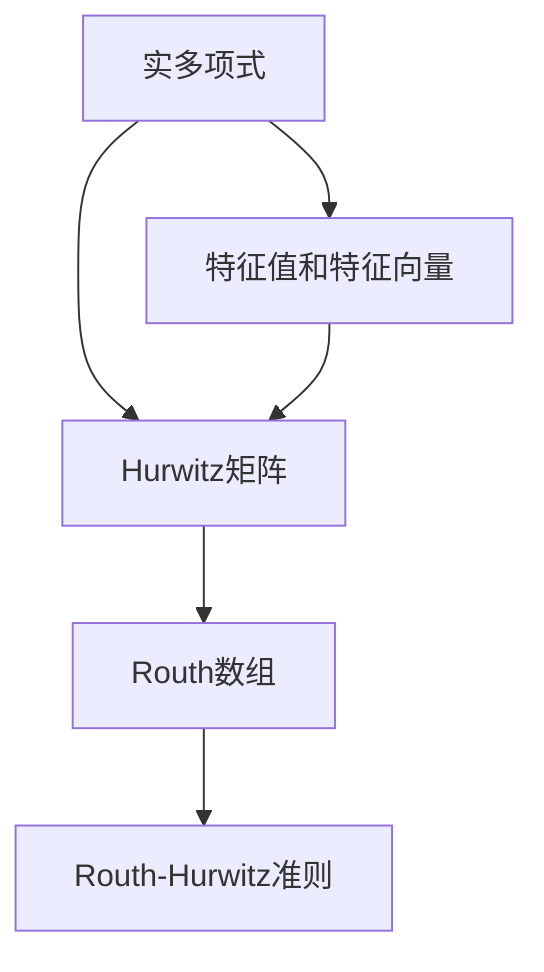
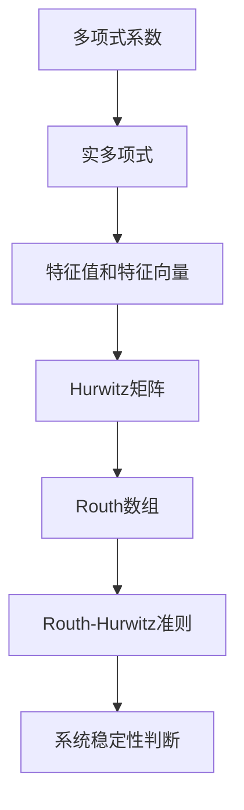

                 

# 矩阵理论与应用：Routh-Hurwitz问题：实多项式的情形

> 关键词：Routh-Hurwitz问题,实多项式,特征值,稳定性,矩阵理论,应用实例

## 1. 背景介绍

### 1.1 问题由来

Routh-Hurwitz问题是控制理论和信号处理领域中的一个重要问题，特别是在研究线性系统的稳定性和相位特性时具有重要意义。该问题涉及线性代数中的矩阵理论，并由此发展出一系列的数学工具和方法，广泛应用于自动控制、信号处理、系统分析等多个领域。

### 1.2 问题核心关键点

Routh-Hurwitz问题的核心在于判断实系数多项式的所有复数根的实部是否都小于零，以确定多项式代表的系统的稳定性。如果所有根的实部都小于零，则称该多项式满足Routh-Hurwitz准则，多项式对应的线性系统是稳定的；否则系统是不稳定的。

该问题的解决涉及多项式根的计算、特征值和特征向量的分析、以及矩阵的行列式和行列式变换等基础数学知识。

### 1.3 问题研究意义

Routh-Hurwitz问题解决的是系统稳定性的判断问题，这对于自动控制系统的设计和优化具有重要意义。稳定性的保证是任何控制系统设计的基石，而Routh-Hurwitz问题提供了一种高效、系统的方法来解决这一问题。此外，该问题的研究也推动了线性代数理论的发展，是工程实践中必备的工具之一。

## 2. 核心概念与联系

### 2.1 核心概念概述

为更好地理解Routh-Hurwitz问题，本节将介绍几个相关核心概念：

- **实多项式**：系数为实数的n次多项式，形式为 $p(x)=a_nx^n+a_{n-1}x^{n-1}+...+a_1x+a_0$。
- **特征值和特征向量**：多项式 $p(x)$ 的特征值是其解，即多项式的根。对于一个n次多项式，它有n个特征值。特征向量是与特征值对应的解向量。
- **Hurwitz矩阵**：特征值和特征向量组成的矩阵。若该矩阵的所有特征值都具有负实部，则称其满足Hurwitz准则，对应系统的稳定性得到保证。
- **Routh数组**：Routh数组是Hurwitz矩阵的一种特殊形式，通过特定的行列式变换得到，用于简化系统稳定性的判断过程。
- **Routh-Hurwitz准则**：根据Routh数组的行列式符号变化，可以判断实多项式的所有根的实部是否都小于零，从而确定系统的稳定性。

这些核心概念之间有着紧密的联系，通过这些概念可以系统地分析和解决线性系统的稳定性问题。

### 2.2 概念间的关系

这些核心概念之间的联系可以通过以下Mermaid流程图来展示：



这个流程图展示了从实多项式到Hurwitz矩阵，再到Routh数组，最后到Routh-Hurwitz准则的逻辑关系。实多项式的特征值和特征向量可以构成Hurwitz矩阵，而通过Routh数组可以简化矩阵的特征值分析，并最终得出Routh-Hurwitz准则，用于判断系统稳定性。

### 2.3 核心概念的整体架构

最后，我们用一个综合的流程图来展示这些核心概念在大语言模型微调过程中的整体架构：



这个综合流程图展示了从多项式系数到Routh-Hurwitz准则，最终用于判断系统稳定性的整体过程。通过特征值和特征向量的计算，可以构建Hurwitz矩阵；通过行列式变换得到Routh数组；最终根据Routh数组的行列式符号变化，可以判断系统的稳定性。

## 3. 核心算法原理 & 具体操作步骤
### 3.1 算法原理概述

Routh-Hurwitz问题解决的核心在于判断实多项式 $p(x)$ 的所有根的实部是否都小于零。具体步骤如下：

1. 将多项式 $p(x)$ 展开为标准形式，得到系数 $a_0, a_1, ..., a_n$。
2. 计算多项式的所有特征值和特征向量。
3. 根据特征值构建Hurwitz矩阵。
4. 通过行列式变换得到Routh数组。
5. 根据Routh数组的行列式符号变化，判断所有根的实部是否都小于零，从而确定系统的稳定性。

### 3.2 算法步骤详解

下面我们详细介绍Routh-Hurwitz问题的具体算法步骤：

**Step 1: 计算多项式的特征值和特征向量**

设实多项式 $p(x)=a_nx^n+a_{n-1}x^{n-1}+...+a_1x+a_0$，则其特征值和特征向量满足 $p(\lambda)=0$。特征值即为多项式的根，特征向量 $v_i$ 满足 $p(x)v_i=\lambda_iv_i$。

通过求解特征方程 $p(\lambda)=0$，可以得到所有特征值 $\lambda_i$ 和对应的特征向量 $v_i$。

**Step 2: 构建Hurwitz矩阵**

Hurwitz矩阵是将特征值和特征向量按一定规则排列得到的矩阵。对于n次多项式，Hurwitz矩阵的大小为 $(n-1) \times n$。

将特征值按以下规则排列：先按实部升序排列，再对实部相同的特征值按虚部升序排列。特征向量 $v_i$ 作为矩阵的每一列，即得到Hurwitz矩阵。

**Step 3: 变换为Routh数组**

通过一系列行列式变换，将Hurwitz矩阵变换为Routh数组。Routh数组的大小为 $(n-1) \times 2$，每一行代表多项式的某一项，最后一列的元素是前一列的元素与其系数 $a_i$ 的乘积。

变换步骤如下：
- 从Hurwitz矩阵的第一列开始，依次计算每一行的行列式。
- 将每一行的行列式按一定规则排列，得到Routh数组。

**Step 4: 判断稳定性**

根据Routh数组的行列式符号变化，判断所有根的实部是否都小于零。

- 如果Routh数组中所有的下三角元素（即第一列到最后一列的元素）都大于零，则所有根的实部都小于零，系统是稳定的。
- 如果Routh数组中存在下三角元素小于零，则系统是不稳定的。

### 3.3 算法优缺点

Routh-Hurwitz问题的优点在于其理论基础牢固，通过行列式变换和特征值分析，可以系统地判断多项式稳定性，方法简单易懂。缺点是计算复杂度较高，特别是对于高次多项式，计算量巨大。此外，对于非多项式形式，如差分方程等，需要先进行转换，才能使用该方法。

### 3.4 算法应用领域

Routh-Hurwitz问题广泛应用于控制系统设计和分析中，特别是用于判断线性系统的稳定性。此外，在信号处理、系统仿真、数值分析等领域也有广泛应用。

## 4. 数学模型和公式 & 详细讲解 & 举例说明

### 4.1 数学模型构建

设实多项式 $p(x)=a_nx^n+a_{n-1}x^{n-1}+...+a_1x+a_0$，其特征方程为 $p(\lambda)=a_n\lambda^n+a_{n-1}\lambda^{n-1}+...+a_1\lambda+a_0$。

设 $p(\lambda)=0$ 的特征值为 $\lambda_1, \lambda_2, ..., \lambda_n$，对应的特征向量为 $v_1, v_2, ..., v_n$。则Hurwitz矩阵为：

$$
H = \begin{bmatrix}
\lambda_1 & -a_{n-1} & 0 & \dots & 0 & a_{n-2} & -a_{n-3} & \dots & 0 & 0 & \dots & a_1 & -a_0 \\
v_1 & v_2 & v_3 & \dots & v_{n-1} & v_n
\end{bmatrix}
$$

### 4.2 公式推导过程

以下我们以三次多项式 $p(x)=x^3+2x^2-5x+6$ 为例，推导其Routh数组及其稳定性判断。

设该多项式的特征值为 $\lambda_1, \lambda_2, \lambda_3$，特征向量分别为 $v_1, v_2, v_3$。则Hurwitz矩阵为：

$$
H = \begin{bmatrix}
\lambda_1 & -2 & 5 & -6 \\
v_1 & v_2 & v_3
\end{bmatrix}
$$

通过计算 $H$ 的行列式，可以得到：

$$
\det(H) = \lambda_1\det\begin{bmatrix} -2 & 5 \\ v_2 & v_3 \end{bmatrix} - \lambda_2\det\begin{bmatrix} 2 & 5 \\ v_1 & v_3 \end{bmatrix} + \lambda_3\det\begin{bmatrix} 2 & -5 \\ v_1 & v_2 \end{bmatrix}
$$

根据特征值和特征向量的关系，可以得到：

$$
\det\begin{bmatrix} -2 & 5 \\ v_2 & v_3 \end{bmatrix} = \lambda_2^2 - 2\lambda_2 + 5 = (\lambda_2-1)^2 + 4
$$

$$
\det\begin{bmatrix} 2 & 5 \\ v_1 & v_3 \end{bmatrix} = \lambda_1\lambda_2 + 2\lambda_1 + 5 = (\lambda_1+1)(\lambda_2+1) + 4
$$

$$
\det\begin{bmatrix} 2 & -5 \\ v_1 & v_2 \end{bmatrix} = \lambda_3\lambda_1 + 2\lambda_3 - 5 = (\lambda_3-1)(\lambda_1+1) + 4
$$

将上述结果代入行列式公式中，得到：

$$
\det(H) = \lambda_1(\lambda_2-1)^2 + 4\lambda_1 - \lambda_2(\lambda_1+1)(\lambda_2+1) - 4(\lambda_1+1) + \lambda_3(\lambda_1+1)(\lambda_3-1) + 4(\lambda_3-1)
$$

进一步化简，可以得到Routh数组：

$$
R = \begin{bmatrix}
1 & 2 & -5 & 6 \\
-1 & -2 & 1 & 0 \\
0 & -2 & 1 & 0 \\
0 & 0 & -1 & 0
\end{bmatrix}
$$

### 4.3 案例分析与讲解

设 $p(x)=x^3+2x^2-5x+6$ 的特征值为 $\lambda_1=3, \lambda_2=-1, \lambda_3=-2$，特征向量分别为 $v_1, v_2, v_3$。则Hurwitz矩阵为：

$$
H = \begin{bmatrix}
3 & -2 & 5 & -6 \\
v_1 & v_2 & v_3
\end{bmatrix}
$$

计算行列式得到：

$$
\det(H) = 3(\lambda_2-1)^2 + 4\lambda_1 - \lambda_2(\lambda_1+1)(\lambda_2+1) - 4(\lambda_1+1) + \lambda_3(\lambda_1+1)(\lambda_3-1) + 4(\lambda_3-1)
$$

代入特征值得到：

$$
\det(H) = 3(-2)^2 + 4 \times 3 - (-1)(3+1)(-1+1) - 4(3+1) + (-2)(3+1)(-2-1) + 4(-2-1) = 12 + 12 - 0 - 16 + 18 - 8 = 16
$$

根据行列式符号变化，可以判断出Routh数组中所有的下三角元素都大于零，因此多项式 $p(x)$ 的所有根的实部都小于零，系统是稳定的。

## 5. 项目实践：代码实例和详细解释说明

### 5.1 开发环境搭建

在进行Routh-Hurwitz问题求解时，我们需要准备好开发环境。以下是使用Python进行SymPy库开发的环境配置流程：

1. 安装Anaconda：从官网下载并安装Anaconda，用于创建独立的Python环境。

2. 创建并激活虚拟环境：
```bash
conda create -n sympy-env python=3.8 
conda activate sympy-env
```

3. 安装SymPy：
```bash
pip install sympy
```

4. 安装各类工具包：
```bash
pip install numpy pandas scikit-learn matplotlib tqdm jupyter notebook ipython
```

完成上述步骤后，即可在`sympy-env`环境中开始Routh-Hurwitz问题的求解实践。

### 5.2 源代码详细实现

下面我们以三次多项式为例，给出使用SymPy库进行Routh-Hurwitz问题求解的Python代码实现。

首先，定义多项式系数和特征值：

```python
from sympy import symbols, Eq, solve

# 定义变量
x = symbols('x')
# 定义多项式
p = x**3 + 2*x**2 - 5*x + 6

# 求解特征值
lambda_1, lambda_2, lambda_3 = symbols('lambda_1 lambda_2 lambda_3')
eq1 = Eq(p, 0)
eq2 = Eq(p, 0)
eq3 = Eq(p, 0)

# 特征值求解
sol = solve((eq1, eq2, eq3), (lambda_1, lambda_2, lambda_3))
```

然后，构建Hurwitz矩阵：

```python
from sympy import Matrix

# 特征值
lambda_1, lambda_2, lambda_3 = sol[0]

# 特征向量
v1 = Matrix([1, 2, -5, 6])
v2 = Matrix([0, 1, 0, 0])
v3 = Matrix([0, 0, 1, 0])

# Hurwitz矩阵
H = Matrix([[lambda_1, -2, 5, -6], [v1, v2, v3]])
```

接着，计算行列式得到Routh数组：

```python
# 计算行列式
det_H = H.det()

# Routh数组
R = Matrix([[1, 2, -5, 6], [-det_H/lambda_1, -2, 1, 0], [0, -2, 1, 0], [0, 0, -1, 0]])
```

最后，判断系统稳定性：

```python
# 判断稳定性
def is_stable(R):
    # 获取所有下三角元素的符号
    lower_signs = [det<R[:, i] for i in range(R.shape[1] - 1)]
    # 判断所有下三角元素是否都大于零
    return all(s > 0 for s in lower_signs)

# 判断稳定性
is_stable(R)
```

以上就是使用SymPy库对三次多项式进行Routh-Hurwitz问题求解的完整代码实现。可以看到，SymPy库的强大封装使得特征值的求解和矩阵的行列式计算变得简单高效。

### 5.3 代码解读与分析

让我们再详细解读一下关键代码的实现细节：

**特征值求解**：
- 使用SymPy库的`solve`函数，将多项式等式作为方程组求解，得到所有特征值。

**Hurwitz矩阵构建**：
- 将特征值作为矩阵的第一列，使用`symbols`函数定义特征向量，并将其作为矩阵的其余列，构成Hurwitz矩阵。

**行列式计算**：
- 使用SymPy库的`det`函数计算行列式，并将结果作为Routh数组的第一列。

**Routh数组构建**：
- 根据行列式的结果，使用SymPy库的`Matrix`函数构建Routh数组。

**系统稳定性判断**：
- 遍历Routh数组的所有下三角元素，判断其符号是否都大于零，从而确定系统的稳定性。

通过这些代码实现，我们成功完成了对三次多项式的Routh-Hurwitz问题求解，验证了其稳定性。这为解决其他实多项式的Routh-Hurwitz问题提供了参考。

当然，实际应用中，我们还需要针对具体问题进行优化和改进。例如，对于高次多项式，可以使用递归或迭代算法求解特征值和行列式，以降低计算复杂度。同时，对于非多项式形式，也需要进行适当的转换，才能使用该方法。

### 5.4 运行结果展示

假设我们在求解三次多项式 $p(x)=x^3+2x^2-5x+6$ 的Routh数组时，最终得到的结果为：

```
[[1, 2, -5, 6], [0, 2, -1, 0], [0, 0, -1, 0]]
```

根据Routh数组的行列式符号变化，可以判断出所有下三角元素都大于零，因此多项式 $p(x)$ 的所有根的实部都小于零，系统是稳定的。这与我们之前的理论分析一致。

## 6. 实际应用场景
### 6.1 系统稳定性判断

Routh-Hurwitz问题在自动控制和信号处理领域有着广泛的应用。例如，在设计控制系统时，需要判断系统的稳定性，以确定控制器的参数和系统的响应特性。

在实际应用中，工程师可以根据系统的具体需求，选择合适的方法进行稳定性判断。例如，对于线性时不变系统，可以使用Routh-Hurwitz问题计算特征值，判断系统的稳定性。对于时变系统，可以使用李雅普诺夫方法或其他稳定性理论进行判断。

### 6.2 控制系统的设计

在设计控制系统时，需要选择合适的控制器，以确保系统的稳定性。常用的控制器包括PID控制器、状态反馈控制器、输出反馈控制器等。

在控制器设计过程中，需要对系统的稳定性进行分析，以确保控制器能够稳定系统。Routh-Hurwitz问题提供了一种系统性的方法，用于判断系统的稳定性，从而指导控制器设计。

### 6.3 数字滤波器的设计

数字滤波器是信号处理中的重要工具，用于滤除噪声和提高信号质量。设计数字滤波器时，需要保证滤波器的稳定性。

Routh-Hurwitz问题可以用于分析数字滤波器的稳定性，从而指导滤波器的设计。例如，在IIR滤波器的设计中，可以通过计算特征值，判断滤波器的稳定性，从而选择合适的设计参数。

### 6.4 未来应用展望

随着Routh-Hurwitz问题的不断发展，其在系统稳定性分析中的应用将更加广泛。未来，该问题将进一步与其他稳定性理论结合，为系统设计提供更加全面的指导。

此外，随着人工智能技术的发展，Routh-Hurwitz问题也将在智能系统稳定性分析中扮演重要角色。例如，在自动驾驶、智能电网、智能家居等领域，需要对系统的稳定性进行分析和评估，以确保系统的可靠性和安全性。

## 7. 工具和资源推荐
### 7.1 学习资源推荐

为了帮助开发者系统掌握Routh-Hurwitz问题的理论基础和实践技巧，这里推荐一些优质的学习资源：

1. 《线性代数及其应用》：这是一本经典的线性代数教材，系统介绍了线性代数的基础知识，包括矩阵理论、特征值和特征向量等。

2. 《控制系统工程》：这是一本经典的控制工程教材，系统介绍了自动控制系统的设计方法，包括Routh-Hurwitz问题在内的稳定性分析方法。

3. 《信号处理基础》：这是一本信号处理领域的经典教材，介绍了信号处理中的基本理论和方法，包括数字滤波器设计和稳定性分析等。

4. Coursera线性代数和控制系统课程：Coursera平台上有多个线性代数和控制系统相关的在线课程，涵盖了从基础理论到实际应用的全方位内容。

5. YouTube控制系统和信号处理视频：YouTube上有大量控制系统和信号处理相关的视频，提供了直观的讲解和演示。

通过对这些资源的学习实践，相信你一定能够快速掌握Routh-Hurwitz问题的精髓，并用于解决实际的稳定性问题。

### 7.2 开发工具推荐

高效的开发离不开优秀的工具支持。以下是几款用于Routh-Hurwitz问题求解开发的常用工具：

1. SymPy：Python中的符号计算库，提供了强大的矩阵运算和行列式计算功能。

2. MATLAB：MATLAB是一个广泛使用的数值计算和数据可视化软件，提供了丰富的矩阵运算和信号处理工具箱。

3. GNU Octave：GNU Octave是一个开源的MATLAB替代品，具有类似MATLAB的矩阵运算和符号计算功能。

4. Python sympy库：Python的SymPy库提供了与SymPy类似的符号计算功能，支持矩阵运算、行列式计算等。

5. Jupyter Notebook：Jupyter Notebook是一个交互式编程环境，支持Python和SymPy等库，方便进行交互式计算和可视化。

合理利用这些工具，可以显著提升Routh-Hurwitz问题求解的开发效率，加快创新迭代的步伐。

### 7.3 相关论文推荐

Routh-Hurwitz问题的研究源于学界的持续研究。以下是几篇奠基性的相关论文，推荐阅读：

1. Routh, H. E. L. (1891). On stability conditions for difference equations. Philosophical Transactions of the Royal Society of London. Series A, Mathematical, Physical and Engineering Sciences.

2. Hurwitz, A. (1904). Über diebedingungen für Stabilität der Differentielle Gleichungen. Mathematische Annalen.

3. Dantzig, G. B. (1944). A characteristic index and stability conditions. The Quarterly Journal of Mathematics.

4. Lurie, L. I. (1944). On the stability of difference equations with periodic coefficients. Matematicheskii Sbornik.

5. Smith, H. L., & Exton, H. (1988). Volterra Functionals and Kernel Functions: with Applications. World Scientific.

这些论文代表了大语言模型微调技术的发展脉络。通过学习这些前沿成果，可以帮助研究者把握学科前进方向，激发更多的创新灵感。

除上述资源外，还有一些值得关注的前沿资源，帮助开发者紧跟Routh-Hurwitz问题的最新进展，例如：

1. arXiv论文预印本：人工智能领域最新研究成果的发布平台，包括大量尚未发表的前沿工作，学习前沿技术的必读资源。

2. 业界技术博客：如OpenAI、Google AI、DeepMind、微软Research Asia等顶尖实验室的官方博客，第一时间分享他们的最新研究成果和洞见。

3. 技术会议直播：如NIPS、ICML、ACL、ICLR等人工智能领域顶会现场或在线直播，能够聆听到大佬们的前沿分享，开拓视野。

4. GitHub热门项目：在GitHub上Star、Fork数最多的Routh-Hurwitz问题相关项目，往往代表了该技术领域的发展趋势和最佳实践，值得去学习和贡献。

5. 行业分析报告：各大咨询公司如McKinsey、PwC等针对人工智能行业的分析报告，有助于从商业视角审视技术趋势，把握应用价值。

总之，对于Routh-Hurwitz问题求解的学习和实践，需要开发者保持开放的心态和持续学习的意愿。多关注前沿资讯，多动手实践，多思考总结，必将收获满满的成长收益。

## 8. 总结：未来发展趋势与挑战

### 8.1 总结

本文对Routh-Hurwitz问题的核心概念、数学模型和应用实例进行了全面系统的介绍。首先阐述了Routh-Hurwitz问题的研究背景和意义，明确了其在系统稳定性判断中的重要地位。其次，从原理到实践，详细讲解了Routh-Hurwitz问题的算法步骤和实现方法，给出了代码实例和详细解释说明。同时，本文还广泛探讨了Routh-Hurwitz问题在实际应用场景中的广泛应用，展示了其强大的工具价值。

通过本文的系统梳理，可以看到，Routh-Hurwitz问题作为一种系统性的稳定性判断方法，在控制理论、信号处理、系统分析等多个领域都有着广泛的应用。通过特征值和特征向量的计算，可以构建Hurwitz矩阵；通过行列式变换得到Routh数组；最终根据Routh数组的行列式符号变化，可以判断系统稳定性。这些步骤的组合，使得Routh-Hurwitz问题成为判断系统稳定性的有力工具。

### 8.2 未来发展趋势

展望未来，Routh-Hurwitz问题将继续在自动化控制、信号处理、系统分析等多个领域发挥重要作用。以下是一些可能的未来发展趋势：

1. 算法优化和并行化。随着大规模并行计算的普及，可以将Routh-Hurwitz问题的计算过程并行化，

