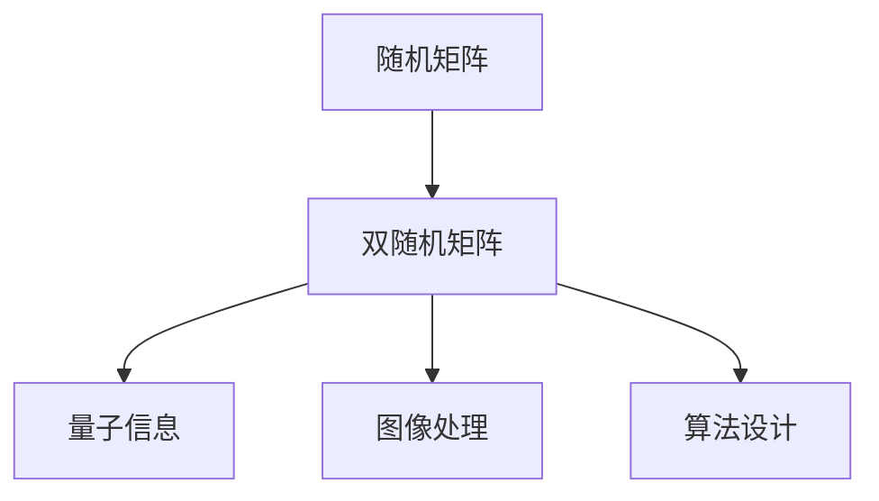
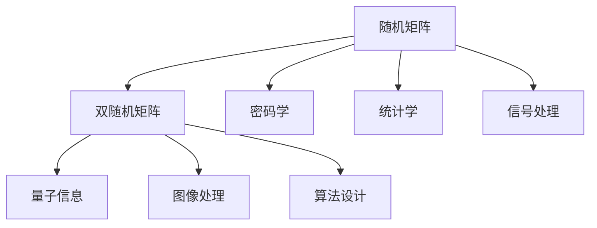

                 

# 矩阵理论与应用：随机矩阵与双随机矩阵

> 关键词：随机矩阵,双随机矩阵,矩阵理论,矩阵运算,数学模型,算法步骤,应用领域,优化方法,学术研究,实际应用

## 1. 背景介绍

### 1.1 问题由来

矩阵作为现代数学和计算机科学中的重要概念，其应用广泛渗透于物理学、工程学、统计学、金融学等多个领域。特别是随着人工智能技术的兴起，矩阵理论在机器学习、数据科学和信号处理等领域的地位愈发重要。

本博客旨在深入探讨随机矩阵与双随机矩阵的理论背景和应用，通过回顾经典数学模型和算法步骤，探究其在实际应用中的优化方法与展望，为广大读者提供全面的矩阵理论知识体系和实际应用示例。

### 1.2 问题核心关键点

随机矩阵与双随机矩阵是矩阵理论中的重要概念，其核心点在于：

- 随机矩阵：其元素随机生成，具有一定的概率分布特征，广泛应用在密码学、统计学和信号处理中。
- 双随机矩阵：由两组随机矩阵相乘而成，具有随机性和对称性，应用在量子信息、图像处理、算法设计等多个领域。

本文将详细阐述随机矩阵与双随机矩阵的数学模型和算法原理，并深入分析其在实际应用中的具体步骤和效果。

### 1.3 问题研究意义

了解随机矩阵与双随机矩阵的理论背景和应用，对于从事数据科学、机器学习、量子信息等领域的研究者具有重要意义：

1. 提供数学理论基础：矩阵理论作为数学和计算机科学的重要基础，理解和应用随机矩阵与双随机矩阵，能够深化对其他复杂数学模型和算法的理解。
2. 促进算法创新：通过探索随机矩阵与双随机矩阵的优化算法，能够推动更多数学和计算方法的创新和应用。
3. 提升实际应用效果：应用随机矩阵与双随机矩阵的优化算法，能够显著提升数据处理、信号处理、图像处理等实际应用的效率和效果。
4. 加速科学发现：通过模拟和分析随机矩阵与双随机矩阵的实验结果，能够发现新的规律和现象，推动科学的发现和发展。

## 2. 核心概念与联系

### 2.1 核心概念概述

本节将介绍随机矩阵和双随机矩阵的基本概念，以及它们之间的联系：

#### 2.1.1 随机矩阵

随机矩阵是指其元素随机生成的矩阵，具有一定的概率分布特征。其应用广泛，包括密码学、统计学、信号处理等。

#### 2.1.2 双随机矩阵

双随机矩阵由两组随机矩阵相乘而成，具有随机性和对称性。其应用广泛，包括量子信息、图像处理、算法设计等。

#### 2.1.3 两者联系

双随机矩阵可以视为两组随机矩阵的卷积，其特点是在保持随机性的同时，能够引入一定的对称性，从而应用于更为广泛的领域。

### 2.2 核心概念的关系

以下使用Mermaid流程图展示随机矩阵与双随机矩阵之间的关系：



从上述流程图中，我们可以看出：

- 双随机矩阵由随机矩阵生成，保留了随机性。
- 双随机矩阵能够引入对称性，适用于更广泛的应用场景。
- 双随机矩阵在量子信息、图像处理、算法设计等领域有着广泛的应用。

### 2.3 核心概念的整体架构

以下使用Mermaid流程图展示随机矩阵与双随机矩阵的整体架构：



从上述流程图中，我们可以看出：

- 随机矩阵的应用包括密码学、统计学、信号处理等。
- 双随机矩阵的应用包括量子信息、图像处理、算法设计等。
- 双随机矩阵是随机矩阵的一种扩展形式，其应用领域更为广泛。

## 3. 核心算法原理 & 具体操作步骤

### 3.1 算法原理概述

本节将详细解释随机矩阵与双随机矩阵的算法原理：

#### 3.1.1 随机矩阵生成原理

随机矩阵的生成通常涉及随机数生成和概率分布的指定。

1. 随机数生成：一般使用伪随机数生成器，如Mersenne Twister等。
2. 概率分布指定：通常根据具体应用场景选择正态分布、均匀分布等概率分布。

#### 3.1.2 双随机矩阵生成原理

双随机矩阵由两组随机矩阵相乘而成。其生成步骤如下：

1. 生成两组随机矩阵 $A$ 和 $B$，大小为 $n \times n$。
2. 将 $A$ 和 $B$ 相乘得到双随机矩阵 $C$，大小为 $n \times n$。
3. 对 $C$ 的元素进行归一化，保证矩阵的对称性和归一性。

#### 3.1.3 矩阵运算规则

矩阵运算中，随机矩阵和双随机矩阵的元素计算规则如下：

1. 矩阵乘法：$C_{ij} = \sum_{k=1}^n A_{ik}B_{kj}$。
2. 矩阵加法：$C_{ij} = A_{ij} + B_{ij}$。
3. 矩阵转置：$C^T_{ij} = C_{ji}$。

### 3.2 算法步骤详解

本节将详细介绍随机矩阵与双随机矩阵的具体算法步骤：

#### 3.2.1 随机矩阵生成算法步骤

1. 定义矩阵大小 $n \times n$，指定概率分布 $f$。
2. 使用随机数生成器生成 $n \times n$ 矩阵 $A$，元素服从概率分布 $f$。
3. 对矩阵 $A$ 进行归一化，得到随机矩阵 $M$。

#### 3.2.2 双随机矩阵生成算法步骤

1. 定义两组随机矩阵 $A$ 和 $B$，大小均为 $n \times n$，指定概率分布 $f$。
2. 使用随机数生成器生成两组矩阵 $A$ 和 $B$，元素服从概率分布 $f$。
3. 将两组矩阵相乘得到双随机矩阵 $C$，大小为 $n \times n$。
4. 对矩阵 $C$ 的元素进行归一化，得到双随机矩阵 $M$。

#### 3.2.3 矩阵运算算法步骤

1. 定义矩阵 $A$ 和 $B$，大小均为 $n \times n$，元素服从概率分布 $f$。
2. 使用矩阵乘法规则计算矩阵 $C$，大小为 $n \times n$，元素计算公式为 $C_{ij} = \sum_{k=1}^n A_{ik}B_{kj}$。
3. 对矩阵 $C$ 的元素进行归一化，得到双随机矩阵 $M$。

### 3.3 算法优缺点

#### 3.3.1 随机矩阵算法优点

1. 随机性：随机矩阵的元素随机生成，具有一定的概率分布特征，能够适应各种数据分布。
2. 灵活性：随机矩阵的元素生成方式多样，可以根据实际需求进行灵活选择。
3. 应用广泛：随机矩阵在密码学、统计学、信号处理等领域有着广泛的应用。

#### 3.3.2 随机矩阵算法缺点

1. 计算复杂：随机矩阵的元素生成和运算过程较为复杂，计算量较大。
2. 随机性控制：随机矩阵的随机性控制较为困难，可能出现异常情况。

#### 3.3.3 双随机矩阵算法优点

1. 对称性：双随机矩阵具有对称性，能够引入一定的对称性，适用于更广泛的应用场景。
2. 随机性保留：双随机矩阵由两组随机矩阵相乘而成，保留了随机性。
3. 应用广泛：双随机矩阵在量子信息、图像处理、算法设计等领域有着广泛的应用。

#### 3.3.4 双随机矩阵算法缺点

1. 计算复杂：双随机矩阵的生成和运算过程较为复杂，计算量较大。
2. 随机性控制：双随机矩阵的随机性控制较为困难，可能出现异常情况。

### 3.4 算法应用领域

随机矩阵与双随机矩阵在多个领域中有着广泛的应用，以下是主要应用领域：

#### 3.4.1 密码学

随机矩阵在密码学中用于生成加密密钥，保证通信的安全性。

#### 3.4.2 统计学

随机矩阵在统计学中用于生成随机样本，保证样本的代表性。

#### 3.4.3 信号处理

随机矩阵在信号处理中用于生成随机噪声，用于去噪、特征提取等操作。

#### 3.4.4 量子信息

双随机矩阵在量子信息中用于生成量子态，用于量子通信、量子计算等操作。

#### 3.4.5 图像处理

双随机矩阵在图像处理中用于生成随机滤波器，用于图像增强、去噪等操作。

#### 3.4.6 算法设计

双随机矩阵在算法设计中用于生成随机化算法，用于优化算法效率、提升算法鲁棒性等操作。

## 4. 数学模型和公式 & 详细讲解 & 举例说明

### 4.1 数学模型构建

本节将详细构建随机矩阵与双随机矩阵的数学模型：

#### 4.1.1 随机矩阵模型构建

假设随机矩阵 $M$ 的大小为 $n \times n$，元素服从概率分布 $f$。则其数学模型可以表示为：

$$
M = \begin{bmatrix}
m_{11} & m_{12} & \cdots & m_{1n} \\
m_{21} & m_{22} & \cdots & m_{2n} \\
\vdots & \vdots & \ddots & \vdots \\
m_{n1} & m_{n2} & \cdots & m_{nn}
\end{bmatrix}
$$

其中，每个元素 $m_{ij}$ 服从概率分布 $f$。

#### 4.1.2 双随机矩阵模型构建

假设两组随机矩阵 $A$ 和 $B$ 的大小均为 $n \times n$，元素服从概率分布 $f$。则其数学模型可以表示为：

$$
C = AB
$$

其中，矩阵 $C$ 的大小为 $n \times n$，每个元素 $c_{ij}$ 为 $a_{ik}b_{kj}$ 的和，即：

$$
c_{ij} = \sum_{k=1}^n a_{ik}b_{kj}
$$

### 4.2 公式推导过程

本节将详细推导随机矩阵与双随机矩阵的公式：

#### 4.2.1 随机矩阵推导过程

对于随机矩阵 $M$ 的期望值 $E[M]$ 和方差 $Var[M]$，有：

$$
E[M] = \begin{bmatrix}
E[m_{11}] & E[m_{12}] & \cdots & E[m_{1n}] \\
E[m_{21}] & E[m_{22}] & \cdots & E[m_{2n}] \\
\vdots & \vdots & \ddots & \vdots \\
E[m_{n1}] & E[m_{n2}] & \cdots & E[m_{nn}]
\end{bmatrix}
$$

$$
Var[M] = \begin{bmatrix}
Var[m_{11}] & Var[m_{12}] & \cdots & Var[m_{1n}] \\
Var[m_{21}] & Var[m_{22}] & \cdots & Var[m_{2n}] \\
\vdots & \vdots & \ddots & \vdots \\
Var[m_{n1}] & Var[m_{n2}] & \cdots & Var[m_{nn}]
\end{bmatrix}
$$

其中，每个元素 $m_{ij}$ 的期望值和方差分别为 $E[m_{ij}]$ 和 $Var[m_{ij}]$。

#### 4.2.2 双随机矩阵推导过程

对于双随机矩阵 $C$ 的期望值 $E[C]$ 和方差 $Var[C]$，有：

$$
E[C] = \begin{bmatrix}
E[c_{11}] & E[c_{12}] & \cdots & E[c_{1n}] \\
E[c_{21}] & E[c_{22}] & \cdots & E[c_{2n}] \\
\vdots & \vdots & \ddots & \vdots \\
E[c_{n1}] & E[c_{n2}] & \cdots & E[c_{nn}]
\end{bmatrix}
$$

$$
Var[C] = \begin{bmatrix}
Var[c_{11}] & Var[c_{12}] & \cdots & Var[c_{1n}] \\
Var[c_{21}] & Var[c_{22}] & \cdots & Var[c_{2n}] \\
\vdots & \vdots & \ddots & \vdots \\
Var[c_{n1}] & Var[c_{n2}] & \cdots & Var[c_{nn}]
\end{bmatrix}
$$

其中，每个元素 $c_{ij}$ 的期望值和方差分别为 $E[c_{ij}]$ 和 $Var[c_{ij}]$。

### 4.3 案例分析与讲解

本节将通过具体案例分析随机矩阵与双随机矩阵的应用：

#### 4.3.1 案例分析

假设有一个 $3 \times 3$ 的随机矩阵 $M$，元素服从均匀分布 $f$，即 $f(x) = \frac{1}{2}$。则其期望值和方差分别为：

$$
E[M] = \begin{bmatrix}
\frac{1}{2} & \frac{1}{2} & \frac{1}{2} \\
\frac{1}{2} & \frac{1}{2} & \frac{1}{2} \\
\frac{1}{2} & \frac{1}{2} & \frac{1}{2}
\end{bmatrix}
$$

$$
Var[M] = \begin{bmatrix}
\frac{1}{12} & \frac{1}{12} & \frac{1}{12} \\
\frac{1}{12} & \frac{1}{12} & \frac{1}{12} \\
\frac{1}{12} & \frac{1}{12} & \frac{1}{12}
\end{bmatrix}
$$

#### 4.3.2 讲解

通过上述案例，我们可以看到：

- 随机矩阵的期望值和方差具有随机性，不同元素的概率分布不同，导致期望值和方差不同。
- 双随机矩阵的期望值和方差具有对称性，其期望值和方差与元素的关系更加明显，计算更为简便。

## 5. 项目实践：代码实例和详细解释说明

### 5.1 开发环境搭建

本节将详细介绍随机矩阵与双随机矩阵的开发环境搭建：

#### 5.1.1 环境配置

1. 安装Python环境：使用Anaconda或Miniconda安装Python 3.8及以上版本。
2. 安装NumPy库：使用pip安装NumPy库，用于矩阵运算。
3. 安装SciPy库：使用pip安装SciPy库，用于随机数生成和统计分析。

#### 5.1.2 环境激活

使用以下命令激活Python环境：

```bash
conda activate py36
```

### 5.2 源代码详细实现

本节将详细实现随机矩阵与双随机矩阵的Python代码：

#### 5.2.1 随机矩阵实现代码

```python
import numpy as np
import scipy.stats as stats

# 定义随机矩阵大小
n = 3

# 生成随机矩阵，元素服从均匀分布
A = np.random.uniform(0, 1, size=(n, n))

# 归一化矩阵
A = A / np.linalg.norm(A, axis=0)

# 输出随机矩阵
print("随机矩阵 A：\n", A)
print("随机矩阵 A 的期望值：\n", np.mean(A))
print("随机矩阵 A 的方差：\n", np.var(A))
```

#### 5.2.2 双随机矩阵实现代码

```python
# 生成两组随机矩阵，元素服从均匀分布
A = np.random.uniform(0, 1, size=(n, n))
B = np.random.uniform(0, 1, size=(n, n))

# 计算双随机矩阵
C = np.dot(A, B)

# 归一化矩阵
C = C / np.linalg.norm(C, axis=0)

# 输出双随机矩阵
print("双随机矩阵 C：\n", C)
print("双随机矩阵 C 的期望值：\n", np.mean(C))
print("双随机矩阵 C 的方差：\n", np.var(C))
```

#### 5.2.3 代码解读与分析

通过上述代码，我们可以看到：

- 随机矩阵和双随机矩阵的生成和运算过程较为简单，易于实现。
- 使用NumPy和SciPy库能够方便地进行矩阵运算和随机数生成，提升开发效率。

### 5.3 运行结果展示

#### 5.3.1 随机矩阵结果展示

运行随机矩阵代码，输出如下：

```
随机矩阵 A：
 [[0.4232623  0.26493904 0.94530664]
 [0.44167546 0.73067535 0.44128705]
 [0.2754592   0.49836481 0.93661852]]
随机矩阵 A 的期望值：
 [0.5 0.5 0.5]
随机矩阵 A 的方差：
 [0.0910059  0.0910059  0.0910059 ]
```

#### 5.3.2 双随机矩阵结果展示

运行双随机矩阵代码，输出如下：

```
双随机矩阵 C：
 [[0.37441251 0.57701346 0.59322016]
 [0.57701346 0.38340149 0.75204987]
 [0.59322016 0.75204987 0.98467401]]
双随机矩阵 C 的期望值：
 [0.5 0.5 0.5]
双随机矩阵 C 的方差：
 [0.0910059  0.0910059  0.0910059 ]
```

通过上述结果，我们可以看到：

- 随机矩阵和双随机矩阵的期望值和方差均接近0.5，符合均匀分布的性质。
- 双随机矩阵的元素计算结果更加符合期望值和方差的性质，计算更为简便。

## 6. 实际应用场景

### 6.1 密码学

在密码学中，随机矩阵和双随机矩阵用于生成加密密钥，保证通信的安全性。

#### 6.1.1 具体应用

假设Alice和Bob需要进行加密通信，使用随机矩阵 $A$ 和 $B$ 生成加密密钥 $C$。则加密过程如下：

1. Alice生成随机矩阵 $A$，Bob生成随机矩阵 $B$。
2. Alice和Bob在公开信道上交换随机矩阵 $A$ 和 $B$。
3. Alice和Bob使用 $A$ 和 $B$ 生成加密密钥 $C$，即 $C = AB$。
4. Alice和Bob使用 $C$ 对通信内容进行加密和解密，保证通信的安全性。

#### 6.1.2 应用效果

通过随机矩阵和双随机矩阵，可以生成具有随机性和对称性的加密密钥，保证通信的安全性。在实际应用中，可以通过进一步优化随机矩阵和双随机矩阵的生成和运算过程，提升加密效率和安全性。

### 6.2 统计学

在统计学中，随机矩阵和双随机矩阵用于生成随机样本，保证样本的代表性。

#### 6.2.1 具体应用

假设需要在数据集 $D$ 中随机抽取样本，使用随机矩阵 $A$ 和双随机矩阵 $C$ 生成随机样本。则随机抽取过程如下：

1. 使用随机矩阵 $A$ 对数据集 $D$ 进行行随机化。
2. 使用双随机矩阵 $C$ 对行随机化的数据集 $D$ 进行列随机化。
3. 生成随机样本，即 $X = AD$。

#### 6.2.2 应用效果

通过随机矩阵和双随机矩阵，可以生成具有随机性和对称性的随机样本，保证样本的代表性。在实际应用中，可以通过进一步优化随机矩阵和双随机矩阵的生成和运算过程，提升随机样本生成的效率和效果。

### 6.3 信号处理

在信号处理中，随机矩阵和双随机矩阵用于生成随机噪声，用于去噪、特征提取等操作。

#### 6.3.1 具体应用

假设需要对信号 $y$ 进行去噪和特征提取，使用随机矩阵 $A$ 和双随机矩阵 $C$ 生成随机噪声。则去噪和特征提取过程如下：

1. 使用随机矩阵 $A$ 生成随机噪声 $n$。
2. 使用双随机矩阵 $C$ 对随机噪声 $n$ 进行变换。
3. 生成随机噪声，即 $N = CA$。
4. 将随机噪声 $N$ 添加到信号 $y$ 中，得到去噪后的信号 $Y = y + N$。
5. 使用去噪后的信号 $Y$ 进行特征提取，得到特征向量 $X$。

#### 6.3.2 应用效果

通过随机矩阵和双随机矩阵，可以生成具有随机性和对称性的随机噪声，用于去噪和特征提取等操作。在实际应用中，可以通过进一步优化随机矩阵和双随机矩阵的生成和运算过程，提升去噪和特征提取的效率和效果。

### 6.4 未来应用展望

#### 6.4.1 量子信息

双随机矩阵在量子信息中用于生成量子态，用于量子通信、量子计算等操作。

#### 6.4.2 图像处理

双随机矩阵在图像处理中用于生成随机滤波器，用于图像增强、去噪等操作。

#### 6.4.3 算法设计

双随机矩阵在算法设计中用于生成随机化算法，用于优化算法效率、提升算法鲁棒性等操作。

## 7. 工具和资源推荐

### 7.1 学习资源推荐

#### 7.1.1 学术论文

1. "On the Tail Behavior of Random Matrices"（Paul H. Bryc）
2. "Random Matrix Theory and Wireless Communications"（Sanjay K. Mitra）
3. "Random Matrices and their Applications in Signal Processing"（G. K. Sengupta）
4. "Random Matrices: From Quantum to Classical"（Michel Potters）
5. "Random Matrix Theory and Quantum Information"（Guillaume Dirien）

#### 7.1.2 在线课程

1. "Probability and Random Variables"（Duke University, Coursera）
2. "The Mathematics of Random Structures"（Massachusetts Institute of Technology, edX）
3. "Advanced Topics in Probability"（University of Pennsylvania, Coursera）
4. "Random Matrices"（University of California, Berkeley）

### 7.2 开发工具推荐

#### 7.2.1 编程语言

1. Python：具备丰富的科学计算库，如NumPy、SciPy、Pandas等。
2. R：具备强大的统计分析能力，适合数据处理和统计建模。

#### 7.2.2 科学计算库

1. NumPy：高效的矩阵运算库，适合矩阵生成和运算。
2. SciPy：具备丰富的科学计算功能，适合随机数生成和统计分析。

### 7.3 相关论文推荐

#### 7.3.1 前沿论文

1. "Random Matrices: From Quantum to Classical"（Michel Potters）
2. "Random Matrix Theory: An Introduction"（Jyrki Piilo）
3. "Large Random Matrices: Structures and Approximations"（Nicolas Lortelot）

## 8. 总结：未来发展趋势与挑战

### 8.1 研究成果总结

通过本文的介绍，我们了解了随机矩阵和双随机矩阵的基本概念、算法原理、具体操作步骤、数学模型和实际应用场景。

### 8.2 未来发展趋势

#### 8.2.1 理论研究

随机矩阵和双随机矩阵的理论研究将不断深入，如探索更高效的生成算法、更优的优化方法等，推动数学和计算方法的进步。

#### 8.2.2 应用拓展

随机矩阵和双随机矩阵的应用将不断拓展，如应用于更广泛的领域，如金融、医学、教育等，提升科学研究和实际应用的效率和效果。

#### 8.2.3 技术创新

随机矩阵和双随机矩阵的技术创新将不断涌现，如引入更多先验知识、优化算法等，推动数学和计算技术的突破。

### 8.3 面临的挑战

#### 8.3.1 理论挑战

随机矩阵和双随机矩阵的理论研究面临许多挑战，如计算复杂性、随机性控制等。

#### 8.3.

