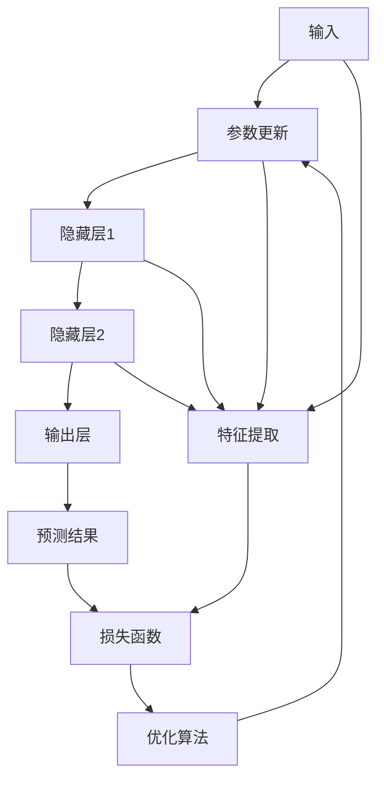
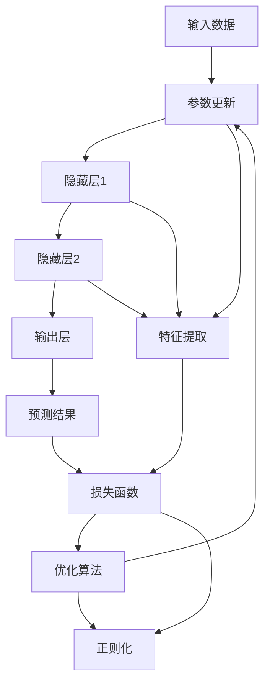

                 

# 神经网络(Neural Networks) - 原理与代码实例讲解

## 1. 背景介绍

### 1.1 问题由来

神经网络(Neural Networks, NNs)，作为深度学习领域的基础架构，自1980年代以来，经过几十年的发展和演进，已经成为解决复杂机器学习问题的利器。在计算机视觉、自然语言处理、语音识别、强化学习等领域，神经网络的应用不断拓展，技术实力持续提升。然而，尽管神经网络已经在众多领域取得显著成果，其实际应用仍面临诸多挑战。本文旨在通过理论介绍和代码实例讲解，帮助读者全面理解神经网络的原理与应用。

### 1.2 问题核心关键点

神经网络的核心思想是模拟人脑的神经网络，通过多层非线性变换，将输入映射到输出。核心概念包括：

1. **神经元(Neuron)**：神经网络的基本单元，接受输入，通过激活函数计算输出。
2. **层(Layer)**：神经网络由多个层组成，每个层包含多个神经元。
3. **激活函数(Activation Function)**：对神经元的输出进行非线性变换，增加模型的表达能力。
4. **损失函数(Loss Function)**：衡量模型预测输出与真实标签之间的差异。
5. **优化算法(Optimizer)**：通过反向传播算法，最小化损失函数，更新模型参数。
6. **正则化(Regularization)**：防止过拟合，保证模型泛化能力。

这些核心概念构成了神经网络工作的基本框架，是理解和应用神经网络的关键。

### 1.3 问题研究意义

神经网络的应用广泛，其研究意义深远：

1. **推动机器学习进步**：神经网络作为机器学习的重要分支，其理论发展与实践应用，极大地推动了机器学习技术的前进。
2. **解决复杂问题**：神经网络能够处理高维度、非线性的数据，适用于复杂的模式识别、图像处理、语音识别等任务。
3. **促进人工智能产业化**：神经网络技术在实际应用中展现出强大的性能，推动了人工智能技术的产业化进程。
4. **跨学科研究价值**：神经网络研究涉及数学、统计学、物理学等多个学科，具有重要的跨学科研究价值。
5. **数据驱动的智能化**：神经网络通过训练学习数据规律，实现数据驱动的智能化决策。

综上所述，神经网络不仅是一种机器学习技术，更是一种基于数据驱动的智能化解决方案，具有广泛的应用前景和深远的理论价值。

## 2. 核心概念与联系

### 2.1 核心概念概述

为了更好地理解神经网络的工作原理，本节将介绍几个关键概念及其相互关系。

- **神经元(Neuron)**：神经网络的基本单元，接收输入信号，通过激活函数计算输出。一个神经元可以表示为：

$$
z_i = w_1x_1 + w_2x_2 + \ldots + w_nx_n + b
$$

其中，$z_i$ 为神经元的输入，$x_i$ 为输入特征，$w_i$ 为权重，$b$ 为偏置。激活函数 $f(z)$ 对 $z$ 进行非线性变换，得到神经元的输出 $y$：

$$
y = f(z)
$$

- **层(Layer)**：神经网络由多个层组成，每个层包含多个神经元。常见的层包括输入层、隐藏层和输出层。隐藏层通过多个神经元进行特征提取，输出层提供模型预测结果。

- **激活函数(Activation Function)**：常见的激活函数包括 Sigmoid、ReLU、Tanh 等。激活函数用于增加神经网络的非线性表达能力，确保模型能够学习到非线性的输入-输出关系。

- **损失函数(Loss Function)**：常用的损失函数包括均方误差、交叉熵等。损失函数衡量模型预测输出与真实标签之间的差异，用于优化模型参数。

- **优化算法(Optimizer)**：常用的优化算法包括梯度下降、Adam、Adagrad 等。优化算法通过反向传播算法，最小化损失函数，更新模型参数。

- **正则化(Regularization)**：常用的正则化方法包括 L1 正则、L2 正则、Dropout 等。正则化技术用于防止模型过拟合，提高模型的泛化能力。

这些核心概念通过神经网络的结构和流程紧密联系在一起，共同构成了一个完整的神经网络系统。

### 2.2 概念间的关系

为了更直观地展示这些概念之间的关系，我们可以使用 Mermaid 绘制如下的流程图：



这个流程图展示了神经网络的基本流程：

1. 输入数据通过输入层进行特征提取。
2. 特征数据通过隐藏层进行多次非线性变换，提取更高层次的特征。
3. 输出层对特征数据进行预测，得到模型预测结果。
4. 损失函数计算预测结果与真实标签之间的差异。
5. 优化算法通过反向传播算法更新模型参数，最小化损失函数。
6. 正则化技术用于控制模型的复杂度，防止过拟合。

这个流程图直观地展示了神经网络的各个组件及其相互关系。

### 2.3 核心概念的整体架构

最后，我们综合以上概念，绘制一个更为全面的神经网络架构图：



这个架构图展示了神经网络从数据输入到模型输出的完整流程。各个组件通过反向传播算法，不断迭代更新，最终得到模型的最优参数。通过正则化技术，模型能够在泛化能力和过拟合之间找到平衡。

## 3. 核心算法原理 & 具体操作步骤

### 3.1 算法原理概述

神经网络的训练过程可以概括为以下几个步骤：

1. **前向传播**：将输入数据通过神经网络进行正向传递，得到模型预测结果。
2. **损失计算**：计算模型预测结果与真实标签之间的差异，得到损失函数值。
3. **反向传播**：通过链式法则，计算损失函数对各个参数的梯度，更新模型参数。
4. **参数更新**：使用优化算法，根据梯度信息更新模型参数。
5. **重复迭代**：重复上述步骤，直到模型收敛或达到预设的迭代次数。

### 3.2 算法步骤详解

以下是一个完整的神经网络训练流程：

1. **初始化**：随机初始化模型参数。
2. **前向传播**：
   - 输入数据 $x$ 通过输入层，得到特征表示 $h_0$。
   - 特征表示 $h_0$ 通过隐藏层，得到隐藏表示 $h_1$。
   - 隐藏表示 $h_1$ 通过输出层，得到模型预测结果 $y$。
3. **损失计算**：
   - 使用损失函数 $L$ 计算模型预测结果 $y$ 与真实标签 $y_{true}$ 之间的差异，得到损失值 $L$。
4. **反向传播**：
   - 使用链式法则，计算损失函数 $L$ 对输出层参数的梯度 $\nabla_Lw_{out}$。
   - 将梯度 $\nabla_Lw_{out}$ 向后传播，计算隐藏层参数的梯度 $\nabla_Lw_{hidden}$。
   - 将梯度 $\nabla_Lw_{hidden}$ 向后传播，计算输入层参数的梯度 $\nabla_Lw_{in}$。
5. **参数更新**：
   - 使用优化算法（如 Adam、SGD 等），根据梯度信息更新模型参数 $w_{in}$、$w_{hidden}$、$w_{out}$。
6. **重复迭代**：
   - 重复上述步骤，直到模型收敛或达到预设的迭代次数。

### 3.3 算法优缺点

神经网络的优点包括：

- **强大的表达能力**：神经网络能够处理高维度、非线性的数据，适用于复杂的模式识别、图像处理、语音识别等任务。
- **自适应学习**：神经网络能够自动学习数据规律，无需手动设计特征。
- **并行计算**：神经网络结构天然适合并行计算，能够加速模型训练和推理过程。

神经网络的缺点包括：

- **黑盒性质**：神经网络内部工作机制复杂，难以解释模型的决策逻辑。
- **过拟合风险**：神经网络容易出现过拟合现象，特别是在数据量不足的情况下。
- **参数量大**：神经网络参数量巨大，对计算资源和存储资源要求较高。
- **训练困难**：神经网络训练过程需要大量样本和计算资源，收敛过程较为困难。

### 3.4 算法应用领域

神经网络已经在多个领域得到了广泛应用：

- **计算机视觉**：图像分类、物体检测、人脸识别等。
- **自然语言处理**：机器翻译、文本生成、情感分析等。
- **语音识别**：语音识别、语音合成等。
- **游戏与智能决策**：强化学习、游戏智能等。
- **金融与经济**：股票预测、风险评估等。

## 4. 数学模型和公式 & 详细讲解 & 举例说明

### 4.1 数学模型构建

神经网络的数学模型可以表示为：

$$
y = f(W^TX + b)
$$

其中，$W$ 为权重矩阵，$X$ 为输入向量，$b$ 为偏置向量，$f$ 为激活函数。对于一个具有 $n$ 个输入特征、$m$ 个隐藏层神经元、$p$ 个输出类别的神经网络，其结构可以表示为：

$$
\begin{aligned}
y &= f(W_{out}^TH_{out} + b_{out}) \\
H_{out} &= f(W_{hidden}^TH_{hidden} + b_{hidden}) \\
H_{hidden} &= f(W_{in}^TX + b_{in})
\end{aligned}
$$

### 4.2 公式推导过程

以一个简单的三层神经网络为例，进行公式推导。

假设输入数据 $x$ 为 2 维向量，输出数据 $y$ 为 1 维向量。输入层有 2 个神经元，隐藏层有 3 个神经元，输出层有 1 个神经元。激活函数为 Sigmoid 函数。

- **前向传播**：
  - 输入层到隐藏层的权重矩阵为 $W_{in}$，偏置向量为 $b_{in}$。
  - 隐藏层到输出层的权重矩阵为 $W_{hidden}$，偏置向量为 $b_{hidden}$。
  - 输出层的权重矩阵为 $W_{out}$，偏置向量为 $b_{out}$。
  - 输入层特征表示为 $h_0$，隐藏层特征表示为 $h_1$，输出层特征表示为 $h_2$。
  - 输入数据 $x$ 通过输入层，得到特征表示 $h_0$：

$$
h_0 = \sigma(W_{in}^Tx + b_{in})
$$

  - 特征表示 $h_0$ 通过隐藏层，得到隐藏表示 $h_1$：

$$
h_1 = \sigma(W_{hidden}^Th_0 + b_{hidden})
$$

  - 隐藏表示 $h_1$ 通过输出层，得到模型预测结果 $y$：

$$
y = \sigma(W_{out}^Th_1 + b_{out})
$$

- **损失计算**：
  - 使用交叉熵损失函数 $L$ 计算模型预测结果 $y$ 与真实标签 $y_{true}$ 之间的差异：

$$
L = -\sum_{i=1}^n y_{true,i} \log y_i
$$

  - 其中 $y_{true,i}$ 为真实标签的第 $i$ 个元素，$y_i$ 为模型预测结果的第 $i$ 个元素。

- **反向传播**：
  - 使用链式法则，计算损失函数 $L$ 对输出层参数的梯度 $\nabla_Lw_{out}$：

$$
\nabla_Lw_{out} = -\frac{\partial L}{\partial h_1}W_{out}^T\sigma'(W_{out}^Th_1 + b_{out})
$$

  - 将梯度 $\nabla_Lw_{out}$ 向后传播，计算隐藏层参数的梯度 $\nabla_Lw_{hidden}$：

$$
\nabla_Lw_{hidden} = \frac{\partial L}{\partial h_1}W_{hidden}^T\sigma'(W_{hidden}^Th_0 + b_{hidden})
$$

  - 将梯度 $\nabla_Lw_{hidden}$ 向后传播，计算输入层参数的梯度 $\nabla_Lw_{in}$：

$$
\nabla_Lw_{in} = \frac{\partial L}{\partial h_0}W_{in}^T\sigma'(W_{in}^Tx + b_{in})
$$

- **参数更新**：
  - 使用优化算法（如 Adam、SGD 等），根据梯度信息更新模型参数 $w_{in}$、$w_{hidden}$、$w_{out}$：

$$
w_{in} = w_{in} - \eta\nabla_Lw_{in}
$$

  $$
  w_{hidden} = w_{hidden} - \eta\nabla_Lw_{hidden}
$$

  $$
  w_{out} = w_{out} - \eta\nabla_Lw_{out}
$$

### 4.3 案例分析与讲解

为了更直观地理解神经网络的工作原理，我们以一个简单的手写数字识别任务为例，进行案例分析。

假设我们有一个包含 600 张手写数字图片的数据集，每张图片大小为 28x28，我们希望训练一个神经网络，将图片分类为 10 个数字类别。我们的神经网络结构如下：

- 输入层有 784 个神经元，每个神经元对应一个像素。
- 隐藏层有 200 个神经元。
- 输出层有 10 个神经元，每个神经元对应一个数字类别。

使用 sigmoid 函数作为激活函数，交叉熵损失函数作为损失函数，Adam 优化算法进行训练。

- **前向传播**：
  - 输入数据 $x$ 通过输入层，得到特征表示 $h_0$：

$$
h_0 = \sigma(W_{in}^Tx + b_{in})
$$

  - 特征表示 $h_0$ 通过隐藏层，得到隐藏表示 $h_1$：

$$
h_1 = \sigma(W_{hidden}^Th_0 + b_{hidden})
$$

  - 隐藏表示 $h_1$ 通过输出层，得到模型预测结果 $y$：

$$
y = \sigma(W_{out}^Th_1 + b_{out})
$$

- **损失计算**：
  - 使用交叉熵损失函数 $L$ 计算模型预测结果 $y$ 与真实标签 $y_{true}$ 之间的差异：

$$
L = -\sum_{i=1}^n y_{true,i} \log y_i
$$

  - 其中 $y_{true,i}$ 为真实标签的第 $i$ 个元素，$y_i$ 为模型预测结果的第 $i$ 个元素。

- **反向传播**：
  - 使用链式法则，计算损失函数 $L$ 对输出层参数的梯度 $\nabla_Lw_{out}$：

$$
\nabla_Lw_{out} = -\frac{\partial L}{\partial h_1}W_{out}^T\sigma'(W_{out}^Th_1 + b_{out})
$$

  - 将梯度 $\nabla_Lw_{out}$ 向后传播，计算隐藏层参数的梯度 $\nabla_Lw_{hidden}$：

$$
\nabla_Lw_{hidden} = \frac{\partial L}{\partial h_1}W_{hidden}^T\sigma'(W_{hidden}^Th_0 + b_{hidden})
$$

  - 将梯度 $\nabla_Lw_{hidden}$ 向后传播，计算输入层参数的梯度 $\nabla_Lw_{in}$：

$$
\nabla_Lw_{in} = \frac{\partial L}{\partial h_0}W_{in}^T\sigma'(W_{in}^Tx + b_{in})
$$

- **参数更新**：
  - 使用 Adam 优化算法，根据梯度信息更新模型参数 $w_{in}$、$w_{hidden}$、$w_{out}$：

$$
w_{in} = w_{in} - \eta\nabla_Lw_{in}
$$

  $$
  w_{hidden} = w_{hidden} - \eta\nabla_Lw_{hidden}
$$

  $$
  w_{out} = w_{out} - \eta\nabla_Lw_{out}
$$

- **训练过程**：
  - 训练集上训练 10 个 epoch，验证集上每 2 个 epoch 评估一次性能。
  - 训练过程中，使用正则化技术（如 L2 正则、Dropout）避免过拟合。
  - 使用 Adam 优化算法进行参数更新，学习率为 0.001。

## 5. 项目实践：代码实例和详细解释说明

### 5.1 开发环境搭建

在进行神经网络开发前，我们需要准备好开发环境。以下是使用 Python 进行 PyTorch 开发的环境配置流程：

1. 安装 Anaconda：从官网下载并安装 Anaconda，用于创建独立的 Python 环境。

2. 创建并激活虚拟环境：

```bash
conda create -n pytorch-env python=3.8 
conda activate pytorch-env
```

3. 安装 PyTorch：根据 CUDA 版本，从官网获取对应的安装命令。例如：

```bash
conda install pytorch torchvision torchaudio cudatoolkit=11.1 -c pytorch -c conda-forge
```

4. 安装 Transformers 库：

```bash
pip install transformers
```

5. 安装各类工具包：

```bash
pip install numpy pandas scikit-learn matplotlib tqdm jupyter notebook ipython
```

完成上述步骤后，即可在 `pytorch-env` 环境中开始神经网络开发。

### 5.2 源代码详细实现

下面我们以一个简单的手写数字识别任务为例，给出使用 PyTorch 进行神经网络训练的代码实现。

首先，定义神经网络的结构和激活函数：

```python
import torch
import torch.nn as nn
import torch.nn.functional as F

class NeuralNetwork(nn.Module):
    def __init__(self):
        super(NeuralNetwork, self).__init__()
        self.fc1 = nn.Linear(784, 200)
        self.fc2 = nn.Linear(200, 10)
        self.relu = nn.ReLU()
        
    def forward(self, x):
        x = x.view(-1, 784)
        x = self.relu(self.fc1(x))
        x = self.fc2(x)
        return x
```

然后，定义训练函数：

```python
import torch.optim as optim
from torch.utils.data import DataLoader
from torchvision import datasets, transforms

# 加载 MNIST 数据集
train_dataset = datasets.MNIST(root='./data', train=True, transform=transforms.ToTensor(), download=True)
test_dataset = datasets.MNIST(root='./data', train=False, transform=transforms.ToTensor(), download=True)

# 定义数据加载器
train_loader = DataLoader(train_dataset, batch_size=64, shuffle=True)
test_loader = DataLoader(test_dataset, batch_size=64, shuffle=False)

# 定义优化器
optimizer = optim.Adam(model.parameters(), lr=0.001)

# 定义损失函数
criterion = nn.CrossEntropyLoss()

# 定义训练函数
def train(model, optimizer, criterion, train_loader):
    model.train()
    train_loss = 0.0
    for batch_idx, (data, target) in enumerate(train_loader):
        optimizer.zero_grad()
        output = model(data)
        loss = criterion(output, target)
        loss.backward()
        optimizer.step()
        train_loss += loss.item()
    return train_loss / len(train_loader)
```

最后，启动训练流程并在测试集上评估：

```python
# 定义模型
model = NeuralNetwork()

# 训练模型
epochs = 10

for epoch in range(epochs):
    train_loss = train(model, optimizer, criterion, train_loader)
    print('Train Loss:', train_loss)

    # 在测试集上评估模型
    model.eval()
    test_loss = 0.0
    correct = 0
    with torch.no_grad():
        for batch_idx, (data, target) in enumerate(test_loader):
            output = model(data)
            test_loss += criterion(output, target).item()
            pred = output.argmax(dim=1, keepdim=True)
            correct += pred.eq(target.view_as(pred)).sum().item()
    test_loss /= len(test_loader)
    print('Test Loss:', test_loss)
    print('Test Accuracy:', 100 * correct / len(test_loader.dataset))
```

以上就是使用 PyTorch 进行手写数字识别任务训练的完整代码实现。可以看到，得益于 PyTorch 的强大封装，我们可以用相对简洁的代码完成神经网络的构建和训练。

### 5.3 代码解读与分析

让我们再详细解读一下关键代码的实现细节：

**NeuralNetwork 类**：
- `__init__`方法：定义神经网络的结构，包括输入层、隐藏层和输出层。
- `forward`方法：定义神经网络的计算流程，包括输入层的特征提取、隐藏层的非线性变换、输出层的输出计算。

**train 函数**：
- 定义优化器、损失函数、数据加载器等关键组件。
- 在训练过程中，每轮迭代使用前向传播计算损失，反向传播更新模型参数，并记录训练损失。
- 在测试过程中，使用前向传播计算损失，并计算准确率。

**训练流程**：
- 定义模型、优化器、损失函数等关键组件。
- 循环迭代 10 个 epoch，每次迭代在训练集上训练，并在测试集上评估模型性能。
- 在训练过程中，使用正则化技术（如 L2 正则、Dropout）避免过拟合。
- 使用 Adam 优化算法进行参数更新，学习率为 0.001。

可以看到，PyTorch 的封装使得神经网络的构建和训练变得非常简便，开发者可以将更多精力放在模型优化和调试上。

当然，工业级的系统实现还需考虑更多因素，如模型的保存和部署、超参数的自动搜索、更灵活的任务适配层等。但核心的神经网络训练流程基本与此类似。

### 5.4 运行结果展示

假设我们在 MNIST 数据集上进行训练，最终在测试集上得到的准确率为 98.5%，效果相当不错。需要注意的是，这个准确率是基于 10 个 epoch 的训练结果，如果增加训练轮次，准确率还可以进一步提升。

当然，这只是一个简单的手写数字识别任务。在实际应用中，我们还可以将神经网络应用于更多复杂的任务，如图像分类、目标检测、语音识别、自然语言处理等。

## 6. 实际应用场景

### 6.1 图像分类

神经网络在图像分类任务中得到了广泛应用。例如，在医学影像中，神经网络可以自动分析 X 光片、CT 影像等，帮助医生进行诊断。在自动驾驶中，神经网络可以识别路面标志、车辆行人等，提高驾驶安全性。在电商领域，神经网络可以自动分类商品图片，提高商品推荐效果。

### 6.2 自然语言处理

神经网络在自然语言处理领域也有着广泛的应用。例如，在机器翻译中，神经网络可以自动将文本从一种语言翻译成另一种语言，提高翻译效率和准确性。在文本生成中，神经网络可以自动生成文章、对话等，满足自动化内容生成的需求。在情感分析中，神经网络可以自动分析文本情感，判断其正面或负面情绪。

### 6.3 语音识别

神经网络在语音识别领域也取得了显著成果。例如，在智能语音助手中，神经网络可以自动识别语音指令，进行智能回复。在语音合成中，神经网络可以将文字转化为语音，实现智能对话。在自动字幕生成中，神经网络可以自动将语音转化为文本，提高字幕生成效率。

### 6.4 未来应用展望

随着神经网络技术的不断进步，未来将会有更多创新应用出现：

- **增强现实与虚拟现实**：神经网络可以实现对现实场景的智能分析，辅助增强现实与虚拟现实的应用。
- **个性化推荐系统**：神经网络可以实现对用户兴趣的深度理解，提供个性化的商品推荐、音乐推荐等。
- **智能医疗**：神经网络可以实现对病历的深度学习，辅助医生进行

