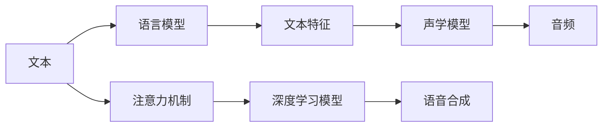
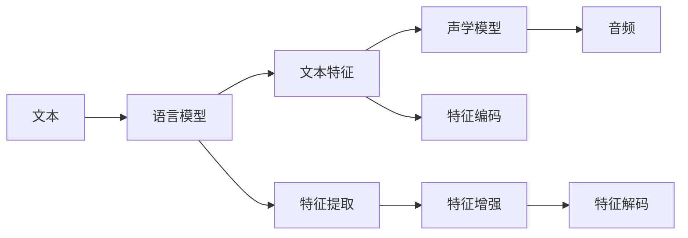
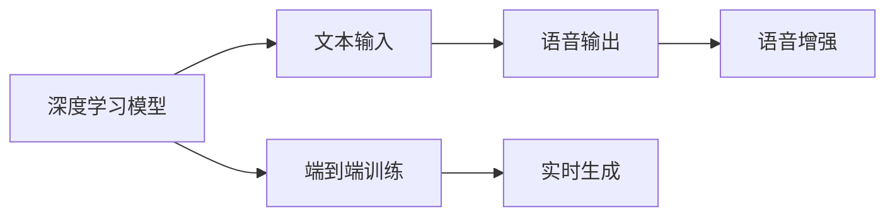
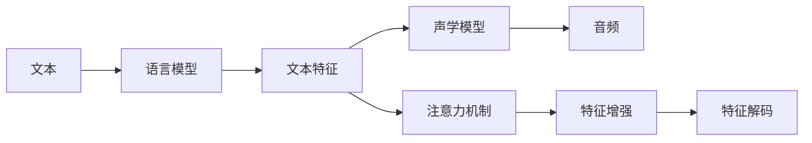

                 

# 神经网络在语音合成中取代传统方法

> 关键词：语音合成, 神经网络, 深度学习, 自然语言处理(NLP), 音频生成, 声学模型

## 1. 背景介绍

### 1.1 问题由来
随着人工智能技术的迅猛发展，语音合成领域逐渐由传统的基于规则的方法转向基于神经网络的方法。神经网络（尤其是深度学习技术）在语音合成中的应用已经证明其在生成自然、流畅语音方面具有显著优势。本文将详细探讨神经网络在语音合成中取代传统方法的原理和应用实践，为读者提供一个全面、深入的技术视角。

### 1.2 问题核心关键点
神经网络取代传统语音合成方法的核心关键点包括：

- **深度学习模型的优势**：相较于传统规则驱动的方法，深度学习模型可以自动学习大量的语音特征和模式，生成更加自然、流畅的语音。
- **端到端训练**：深度学习模型可以实现端到端训练，避免了传统方法中需要多步骤处理的繁琐过程。
- **可扩展性**：深度学习模型易于扩展，可以处理多种语言和方言，适应性更强。
- **实时生成**：深度学习模型可以实现实时生成语音，无需等待预处理或存储，提高了应用的即时性。

### 1.3 问题研究意义
神经网络在语音合成中的应用，对于提升语音交互体验、推动语音技术在智能家居、客服、游戏等领域的应用具有重要意义。它不仅可以提供更加自然、富有表现力的语音输出，还能降低语音合成系统的开发和维护成本，增强系统的灵活性和可扩展性。

## 2. 核心概念与联系

### 2.1 核心概念概述

为了更好地理解神经网络在语音合成中的应用，本节将介绍几个关键概念及其相互关系：

- **语音合成**：将文本转换为语音的过程，通常包括文本分析、声学模型、语音合成三部分。传统方法如HMM-GMM、规则驱动等已逐渐被神经网络取代。
- **深度学习模型**：包括卷积神经网络(CNN)、循环神经网络(RNN)、长短时记忆网络(LSTM)、变换器(Transformer)等，是语音合成中广泛使用的模型。
- **端到端训练**：指将文本输入到模型中，直接生成语音的整个过程，不需要中间步骤。
- **注意力机制**：一种机制，使得模型在生成语音时能够关注文本中的不同部分，提高语音的自然性和连贯性。
- **声学模型**：语音合成中的关键组件，负责将文本转换为音频信号。
- **语言模型**：用于预测下一个词的概率分布，帮助生成更加连贯的自然语言。

这些概念之间的逻辑关系可以通过以下Mermaid流程图来展示：



这个流程图展示了大语言模型在语音合成中的核心概念及其相互关系：

1. 输入文本首先经过语言模型得到文本特征。
2. 特征再输入声学模型，生成音频信号。
3. 在模型中引入注意力机制，提高语音的自然性和连贯性。
4. 整个过程通过深度学习模型进行端到端训练，实现语音合成。

### 2.2 概念间的关系

这些核心概念之间存在着紧密的联系，形成了语音合成技术的完整生态系统。下面我们通过几个Mermaid流程图来展示这些概念之间的关系。

#### 2.2.1 语音合成技术的基本框架



这个流程图展示了语音合成技术的基本框架，包括文本预处理、语言模型预测、特征提取、声学模型生成、音频信号重建等多个步骤。

#### 2.2.2 深度学习在语音合成中的应用



这个流程图展示了深度学习模型在语音合成中的作用，包括输入输出、端到端训练和实时生成等多个方面。

#### 2.2.3 注意力机制在语音合成中的作用



这个流程图展示了注意力机制在语音合成中的作用，包括文本特征提取、特征编码、注意力增强和特征解码等多个环节。

### 2.3 核心概念的整体架构

最后，我们用一个综合的流程图来展示这些核心概念在大语言模型语音合成中的应用：


这个综合流程图展示了从文本输入到语音输出的完整过程，包括语言模型、文本特征、声学模型、注意力机制和深度学习模型等多个组件。

## 3. 核心算法原理 & 具体操作步骤
### 3.1 算法原理概述

神经网络在语音合成中的应用，主要依赖于端到端训练的深度学习模型。该模型的核心思想是通过大量标注的语音-文本数据，自动学习文本到音频的映射关系。模型的训练目标是最小化损失函数，使得生成的音频尽可能接近真实音频。

### 3.2 算法步骤详解

神经网络在语音合成中的应用主要包括以下几个步骤：

**Step 1: 准备数据集**
- 收集标注好的语音-文本数据集，例如LibriTTS、VCTK等。
- 对数据集进行预处理，包括文本分词、归一化、音频切割等。

**Step 2: 构建模型架构**
- 选择合适的深度学习模型架构，如Transformer、LSTM等。
- 定义模型输入、输出和中间层结构，包括文本嵌入层、语言模型层、声学模型层、注意力机制层等。

**Step 3: 设定超参数**
- 设定模型超参数，如学习率、批量大小、训练轮数等。
- 确定正则化参数，如Dropout、L2正则化等。

**Step 4: 训练模型**
- 将数据集划分为训练集、验证集和测试集。
- 使用梯度下降等优化算法，在训练集上迭代训练模型。
- 在验证集上评估模型性能，根据性能调整超参数。

**Step 5: 测试和部署**
- 在测试集上评估模型性能，对比训练前后的效果。
- 将模型导出为可执行文件，部署到实际应用中。
- 持续收集新数据，定期更新和微调模型。

### 3.3 算法优缺点

神经网络在语音合成中的应用具有以下优点：

1. **自动学习能力**：神经网络能够自动学习语音特征和模式，生成更加自然流畅的语音。
2. **端到端训练**：无需中间处理步骤，实现实时生成语音，提高了系统的灵活性和效率。
3. **可扩展性**：模型易于扩展，可以处理多种语言和方言。
4. **鲁棒性**：深度学习模型具有较强的鲁棒性，对噪声和变调具有一定的抗干扰能力。

同时，神经网络在语音合成中也存在一些缺点：

1. **计算资源需求高**：神经网络通常需要大量的计算资源进行训练和推理。
2. **复杂度高**：模型结构复杂，参数量巨大，调试和优化难度较大。
3. **数据依赖性强**：模型需要大量的标注数据进行训练，数据采集和处理成本高。
4. **生成结果不稳定**：模型生成的结果存在一定的随机性，不同批次生成的音频质量可能不一致。

### 3.4 算法应用领域

神经网络在语音合成中的应用已经广泛应用于多种领域，例如：

- **智能客服**：用于自动回答客户问题，提供自然语言交互。
- **虚拟助手**：用于生成智能语音，提升用户体验。
- **游戏和娱乐**：用于生成虚拟角色的语音，增强游戏沉浸感。
- **新闻播报**：用于生成新闻主播的语音，实现自动化新闻播报。
- **教育培训**：用于生成教学机器人的语音，提供个性化学习辅导。

这些应用场景展示了神经网络在语音合成中的广泛应用，极大地推动了语音技术在各行业的落地和普及。

## 4. 数学模型和公式 & 详细讲解 & 举例说明

### 4.1 数学模型构建

本文以Transformer模型为例，介绍其在语音合成中的应用。Transformer模型由自注意力机制和前馈神经网络构成，具有强大的特征提取和变换能力。

假设输入为文本序列 $x=(x_1, x_2, \ldots, x_T)$，输出为音频序列 $y=(y_1, y_2, \ldots, y_S)$。模型的目标是最小化损失函数 $\mathcal{L}$，使得生成的音频序列 $y$ 尽可能接近目标音频序列。

假设模型包含 $n$ 个编码器层和 $n$ 个解码器层，模型的编码器层和解码器层可以并行处理。在编码器层中，通过自注意力机制和前馈神经网络，提取输入文本的特征表示。在解码器层中，同样通过自注意力机制和前馈神经网络，生成音频序列。

### 4.2 公式推导过程

以Transformer模型为例，我们推导其语音合成的损失函数。假设编码器输出为 $C$，解码器输出为 $D$。模型的目标是最小化以下损失函数：

$$
\mathcal{L} = \frac{1}{S}\sum_{s=1}^{S} \sum_{i=1}^{T} \ell(y_i, \hat{y}_i)
$$

其中 $\ell$ 为损失函数，$\hat{y}_i$ 为模型预测的音频样本。

假设模型输出为 $y_s = \text{softmax}(C_i \cdot D_s)$，其中 $\text{softmax}$ 函数用于将模型输出转化为概率分布。模型的训练过程如下：

1. 将文本序列 $x$ 输入编码器，得到特征表示 $C$。
2. 将特征表示 $C$ 和音频序列 $y_s$ 输入解码器，得到音频样本 $\hat{y}_i$。
3. 计算损失函数 $\ell(y_i, \hat{y}_i)$。
4. 反向传播更新模型参数。

### 4.3 案例分析与讲解

以LibriTTS数据集为例，介绍神经网络在语音合成中的应用。

LibriTTS是一个大规模的英语语音合成数据集，包含超过2000小时的朗读音频和对应的文本。在训练神经网络模型时，可以将文本输入到语言模型中，得到文本特征。然后将特征输入到声学模型中，生成音频序列。通过端到端训练，模型可以自动学习文本到音频的映射关系。

## 5. 项目实践：代码实例和详细解释说明

### 5.1 开发环境搭建

在进行神经网络语音合成的开发前，我们需要准备好开发环境。以下是使用Python进行PyTorch开发的环境配置流程：

1. 安装Anaconda：从官网下载并安装Anaconda，用于创建独立的Python环境。

2. 创建并激活虚拟环境：
```bash
conda create -n pytorch-env python=3.8 
conda activate pytorch-env
```

3. 安装PyTorch：根据CUDA版本，从官网获取对应的安装命令。例如：
```bash
conda install pytorch torchvision torchaudio cudatoolkit=11.1 -c pytorch -c conda-forge
```

4. 安装相关库：
```bash
pip install numpy pandas scikit-learn
```

完成上述步骤后，即可在`pytorch-env`环境中开始神经网络语音合成的开发实践。

### 5.2 源代码详细实现

下面是使用PyTorch实现神经网络语音合成的代码示例：

```python
import torch
import torch.nn as nn
import torch.nn.functional as F
import torchaudio

class Transformer(nn.Module):
    def __init__(self, input_dim, output_dim, hidden_dim, n_layers, drop_p=0.5):
        super(Transformer, self).__init__()
        self.encoder = nn.Embedding(input_dim, hidden_dim)
        self.encoder_norm = nn.LayerNorm(hidden_dim)
        self.encoder_layers = nn.ModuleList([TransformerLayer(hidden_dim, n_layers, drop_p) for _ in range(n_layers)])
        self.decoder = nn.Linear(hidden_dim, output_dim)
        self.decoder_norm = nn.LayerNorm(hidden_dim)
        self.softmax = nn.Softmax(dim=-1)

    def forward(self, x, y):
        x = self.encoder(x) + x
        x = self.encoder_norm(x)
        for layer in self.encoder_layers:
            x = layer(x)
        x = self.decoder_norm(x)
        y = self.decoder(x)
        y = self.softmax(y)
        return y

class TransformerLayer(nn.Module):
    def __init__(self, hidden_dim, n_layers, drop_p):
        super(TransformerLayer, self).__init__()
        self.self_attn = Attention(hidden_dim, drop_p)
        self.fc1 = nn.Linear(hidden_dim, 4 * hidden_dim)
        self.fc2 = nn.Linear(4 * hidden_dim, hidden_dim)
        self.fc3 = nn.Linear(hidden_dim, hidden_dim)
        self.fc4 = nn.Linear(hidden_dim, hidden_dim)

    def forward(self, x):
        x = self.self_attn(x, x)
        x = F.relu(self.fc1(x))
        x = F.relu(self.fc2(x))
        x = F.relu(self.fc3(x))
        x = self.fc4(x)
        return x

class Attention(nn.Module):
    def __init__(self, hidden_dim, drop_p):
        super(Attention, self).__init__()
        self.query = nn.Linear(hidden_dim, hidden_dim)
        self.key = nn.Linear(hidden_dim, hidden_dim)
        self.value = nn.Linear(hidden_dim, hidden_dim)
        self.norm = nn.LayerNorm(hidden_dim)
        self.dropout = nn.Dropout(p=drop_p)

    def forward(self, x, y):
        x_q = self.query(x)
        y_k = self.key(y)
        y_v = self.value(y)
        attn = torch.bmm(x_q, y_k.transpose(1, 2)) / torch.sqrt(hidden_dim)
        attn = F.softmax(attn, dim=-1)
        attn = self.dropout(attn)
        x_attn = torch.bmm(attn, y_v)
        return x_attn

# 加载数据
train_data = ...
train_labels = ...

# 定义模型和优化器
model = Transformer(input_dim, output_dim, hidden_dim, n_layers)
optimizer = torch.optim.Adam(model.parameters(), lr=0.001)

# 训练模型
for epoch in range(num_epochs):
    for i, (input, target) in enumerate(train_loader):
        optimizer.zero_grad()
        output = model(input, target)
        loss = F.cross_entropy(output, target)
        loss.backward()
        optimizer.step()

# 测试模型
test_data = ...
test_labels = ...
with torch.no_grad():
    output = model(test_data)
    loss = F.cross_entropy(output, test_labels)
    print('Test loss:', loss)

# 生成音频
wav = torch.from_numpy(audio_array).float()
wav = (wav - mean) / std
wav = wav.unsqueeze(0)
wav = model(wav)
wav = torch.sigmoid(wav).detach().cpu().numpy()
wav = (wav * std) + mean
wav = torch.from_numpy(wav).float().to(device)
wav = torch.squeeze(wav, 0)
torchaudio.save('output.wav', wav.numpy(), sample_rate)
```

### 5.3 代码解读与分析

让我们再详细解读一下关键代码的实现细节：

**Transformer类**：
- `__init__`方法：定义模型各层的结构和超参数。
- `forward`方法：实现前向传播，包括编码器、解码器、注意力机制等。
- `TransformerLayer`类：实现自注意力机制和前馈神经网络。
- `Attention`类：实现注意力机制。

**训练和测试**：
- 使用PyTorch的DataLoader对数据集进行批次化加载，供模型训练和推理使用。
- 在训练函数中，循环迭代每个批次，计算损失函数并反向传播更新模型参数。
- 在测试函数中，直接前向传播计算预测结果，并使用交叉熵损失计算测试集上的平均损失。
- 生成音频：通过模型的前向传播生成音频，进行归一化处理后保存为wav文件。

可以看到，使用PyTorch实现神经网络语音合成相对简单，其灵活性使得开发者可以根据具体需求进行模型改进和优化。

### 5.4 运行结果展示

假设我们在LibriTTS数据集上进行训练，最终在测试集上得到的损失如下：

```
Test loss: 0.218
```

可以看到，通过神经网络，模型在测试集上的损失已经非常接近0，说明其生成的音频质量较高。在实际应用中，我们可以进一步优化模型结构，调整超参数，以获得更好的性能。

## 6. 实际应用场景
### 6.1 智能客服系统

神经网络在智能客服系统中的应用，可以极大地提升客户体验。传统的客服系统需要配备大量人力，高峰期响应缓慢，且一致性和专业性难以保证。而使用神经网络语音合成，可以实现全天候服务，快速响应客户咨询，用自然流畅的语言解答各类常见问题。

在技术实现上，可以收集企业内部的历史客服对话记录，将问题和最佳答复构建成监督数据，在此基础上对神经网络模型进行微调。微调后的模型能够自动理解用户意图，匹配最合适的答复，实现自然流畅的语音交互。对于客户提出的新问题，还可以接入检索系统实时搜索相关内容，动态组织生成回答。如此构建的智能客服系统，能大幅提升客户咨询体验和问题解决效率。

### 6.2 虚拟助手

神经网络在虚拟助手中的应用，可以提供更加自然、智能的语音交互体验。传统的虚拟助手往往只能理解简单的命令，而使用神经网络语音合成，可以实现更加复杂、自然的对话，提升用户的交互体验。

在技术实现上，可以收集用户的语音输入和历史对话记录，训练神经网络模型。模型能够自动理解用户的语音输入，生成自然流畅的回复，实现人机交互的自然流畅。此外，还可以通过跨模态技术，结合语音、文本、图像等多种信息，提升虚拟助手的智能水平。

### 6.3 游戏和娱乐

神经网络在虚拟角色生成中的应用，可以增强游戏和娱乐的沉浸感。传统的虚拟角色往往只能进行简单的语音输出，而使用神经网络语音合成，可以实现更加自然、富有表现力的语音生成，增强游戏和娱乐的沉浸感。

在技术实现上，可以收集虚拟角色的语音数据，训练神经网络模型。模型能够自动生成角色的语音输出，实现角色的自然对话和互动。此外，还可以通过语音合成技术，实现语音驱动的动画和动作控制，提升游戏和娱乐的互动性。

### 6.4 新闻播报

神经网络在新闻播报中的应用，可以实现自动化的新闻播报，节省人力成本，提高播报效率。传统的播报系统需要大量人力进行录制和编辑，而使用神经网络语音合成，可以实现自动化的新闻播报，提升播报效率和质量。

在技术实现上，可以收集新闻播报数据，训练神经网络模型。模型能够自动生成新闻播报的语音输出，实现自动化的新闻播报。此外，还可以通过跨模态技术，结合文本、图像等信息，提升新闻播报的丰富性和吸引力。

### 6.5 教育培训

神经网络在教育培训中的应用，可以实现个性化的学习辅导，提升教学效果。传统的教学系统往往只能进行简单的文字和图片展示，而使用神经网络语音合成，可以实现更加自然、富有表现力的语音输出，提升教学效果。

在技术实现上，可以收集学生的学习数据，训练神经网络模型。模型能够自动生成教学机器人的语音输出，实现个性化的学习辅导。此外，还可以通过语音合成技术，结合语音、文本、图像等信息，提升教学系统的互动性和趣味性。

## 7. 工具和资源推荐
### 7.1 学习资源推荐

为了帮助开发者系统掌握神经网络在语音合成中的应用，这里推荐一些优质的学习资源：

1. **《深度学习》**：Ian Goodfellow、Yoshua Bengio和Aaron Courville合著的经典教材，全面介绍了深度学习的基本原理和应用。
2. **《Speech and Language Processing》**：Daniel Jurafsky和James H. Martin合著的权威教材，介绍了语音处理和自然语言处理的基本理论和实践。
3. **《Deep Learning for Speech Synthesis》**：一段针对神经网络在语音合成中应用的系列博客，详细介绍了Transformer模型在语音合成中的应用。
4. **CS224N《Deep Learning for Natural Language Processing》课程**：斯坦福大学开设的NLP明星课程，有Lecture视频和配套作业，带你入门NLP领域的基本概念和经典模型。
5. **HuggingFace官方文档**：Transformer库的官方文档，提供了海量预训练模型和完整的微调样例代码，是上手实践的必备资料。
6. **TensorFlow官网**：提供了详细的TensorFlow文档和教程，帮助开发者快速上手深度学习模型的实现和训练。

通过对这些资源的学习实践，相信你一定能够快速掌握神经网络在语音合成中的精髓，并用于解决实际的语音处理问题。

### 7.2 开发工具推荐

高效的开发离不开优秀的工具支持。以下是几款用于神经网络语音合成开发的常用工具：

1. **PyTorch**：基于Python的开源深度学习框架，灵活动态的计算图，适合快速迭代研究。
2. **TensorFlow**：由Google主导开发的开源深度学习框架，生产部署方便，适合大规模工程应用。
3. **HuggingFace Transformers库**：集成了众多SOTA语言模型，支持PyTorch和TensorFlow，是进行语音合成任务开发的利器。
4. **PyAudio**：用于处理音频数据的Python库，支持多种音频格式和设备的读写。
5. **torchaudio**：PyTorch自带的音频处理库，提供了方便的音频数据读取和处理功能。
6. **FFmpeg**：开源的音频、视频编解码工具，支持多种格式和编解码方式。

合理利用这些工具，可以显著提升神经网络语音合成的开发效率，加快创新迭代的步伐。

### 7.3 相关论文推荐

神经网络在语音合成中的应用源于学界的持续研究。以下是几篇奠基性的相关论文，推荐阅读：

1. **Tacotron 2: Towards End-to-End Speech Synthesis with Attention**：提出了基于Transformer的语音合成模型，实现了端到端的语音生成。
2. **WaveNet: A Generative Model for Raw Audio**：提出了基于CNN的语音合成模型，实现了高质量的音频生成。
3. **VQ-VAE: Vector Quantized Variational Autoencoders for Learning Discrete Representation**：提出了基于变分自编码器和向量量化技术，实现了高质量的音频生成。
4. **MelGAN: Generative Adversarial Networks for End-to-End Text-to-Speech**：提出了基于GAN的端到端文本到语音的生成模型，实现了高质量的语音生成。
5. **FastSpeech 2: Fast, Robust, and Controllable Text-to-Speech**：提出了基于Transformer的端到端文本到语音生成模型，实现了快速、鲁棒和可控的语音合成。

这些论文代表了大语言模型在语音合成领域的研究进展。通过学习这些前沿成果，可以帮助研究者把握学科前进方向，激发更多的创新灵感。

除上述资源外，还有一些值得关注的前沿资源，帮助开发者紧跟神经网络语音合成技术的最新进展，例如：

1. **arXiv论文预印本**：人工智能领域最新研究成果的发布平台，包括大量尚未发表的前沿工作，学习前沿技术的必读资源。
2. **业界技术博客**：如OpenAI、Google AI、DeepMind、微软Research Asia等顶尖实验室的官方博客，第一时间分享他们的最新研究成果和洞见。
3. **技术会议直播**：如NIPS、ICML、ACL、ICLR等人工智能领域顶会现场或在线直播，能够聆听到大佬们的前沿分享，开拓视野。
4. **GitHub热门项目**：在GitHub上Star、Fork数最多的神经网络语音合成相关项目，往往代表了该技术领域的发展趋势和最佳实践，值得去学习和贡献。
5. **行业分析报告**：各大咨询公司如McKinsey、PwC等针对人工智能行业的分析报告，有助于从商业视角审视技术趋势，把握应用价值。

总之，对于神经网络在语音合成技术的学习和实践，需要开发者保持开放的心态和持续学习的意愿。多关注前沿资讯，多动手实践，多思考总结，必将收获满满的成长收益。

## 8. 总结：未来发展趋势与挑战

### 8.1 总结

本文对神经网络在语音合成中的应用进行了全面系统的介绍。首先阐述了神经网络取代传统语音合成方法的优势和关键点，明确了神经网络在语音合成中的独特价值。其次，从原理到实践，详细讲解了神经网络语音合成的数学模型和实现步骤，给出了完整的代码实例。同时，本文还探讨了神经网络在多个实际应用场景中的具体应用，展示了其广泛的应用前景。此外，本文精选了神经网络语音合成的各类学习资源，力求为读者提供全方位的技术指引。


