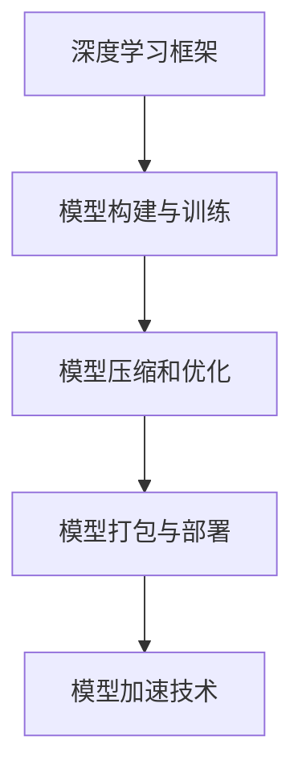
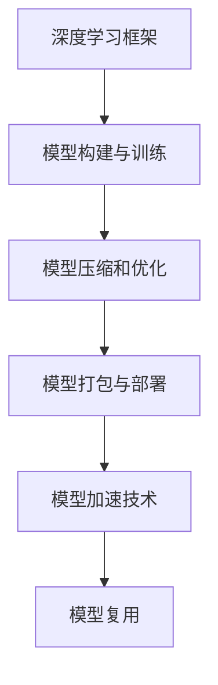
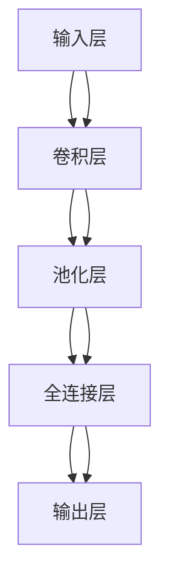

                 

# 神经网络模型如何打包发布和复用?

> 关键词：神经网络模型打包发布, 模型复用, 深度学习框架, TensorFlow, PyTorch, ONNX, 模型压缩, 模型加速

## 1. 背景介绍

随着深度学习技术的发展，神经网络模型在图像识别、语音识别、自然语言处理等领域得到了广泛应用。然而，模型的训练和优化通常需要大量的计算资源和时间，训练过程复杂且耗时，限制了模型的应用范围和效率。为了解决这个问题，研究者提出了模型打包发布和复用的概念，通过将训练好的模型压缩、优化、打包，以减少存储和传输成本，同时提高模型的加载和推理速度，使其能够在不同的硬件平台上快速部署和使用。

## 2. 核心概念与联系

### 2.1 核心概念概述

在进行神经网络模型打包发布和复用时，涉及到的核心概念包括：

- **深度学习框架**：如TensorFlow、PyTorch等，是构建和训练神经网络模型的主要工具。
- **模型压缩和优化**：通过剪枝、量化、蒸馏等方法，减小模型大小，提高模型效率。
- **模型打包和部署**：将训练好的模型压缩和优化后，打包为可执行文件或模型库，部署到目标平台上。
- **模型加速技术**：通过硬件优化、算法优化等方法，提高模型的推理速度和计算效率。

这些概念之间存在紧密的联系，共同构成了一个完整的模型发布和复用流程。

### 2.2 概念间的关系

以下通过几个Mermaid流程图来展示这些核心概念之间的关系：



这个流程图展示了模型构建、压缩优化、打包部署和加速技术的流程关系：

- 深度学习框架是构建和训练模型的基础工具。
- 模型构建与训练是模型的最初来源，通过框架实现。
- 模型压缩和优化可以减小模型大小，提高模型效率。
- 模型打包与部署是将模型转换为可执行文件或模型库的过程。
- 模型加速技术可以进一步提高模型的推理速度和计算效率。

### 2.3 核心概念的整体架构

最后，我们用一个综合的流程图来展示这些核心概念在大模型发布和复用过程中的整体架构：



这个综合流程图展示了从模型构建到模型复用的整个流程，其中包含了深度学习框架、模型压缩优化、打包部署、加速技术等关键环节。通过这个架构，我们可以更好地理解模型发布和复用的整个过程。

## 3. 核心算法原理 & 具体操作步骤

### 3.1 算法原理概述

神经网络模型打包发布和复用的核心算法原理可以概括为以下几步：

1. **模型构建与训练**：使用深度学习框架构建神经网络模型，并在大规模数据集上进行训练，获得初始的模型参数。
2. **模型压缩和优化**：对训练好的模型进行剪枝、量化、蒸馏等操作，减小模型大小，提高模型效率。
3. **模型打包与部署**：将压缩和优化的模型转换为可执行文件或模型库，并将其部署到目标平台上。
4. **模型加速技术**：在模型部署后，通过硬件优化、算法优化等方法，进一步提高模型的推理速度和计算效率。

### 3.2 算法步骤详解

下面对每一步的具体操作步骤进行详细讲解：

#### 3.2.1 模型构建与训练

- **框架选择**：选择合适的深度学习框架，如TensorFlow、PyTorch等。
- **数据准备**：收集并准备大规模数据集，包括图像、文本、语音等不同类型的数据。
- **模型构建**：使用框架提供的API构建神经网络模型，包括定义网络结构、选择激活函数、损失函数等。
- **模型训练**：在数据集上对模型进行训练，通过反向传播算法更新模型参数，优化损失函数。

#### 3.2.2 模型压缩和优化

- **剪枝**：删除模型中不必要的神经元、层或连接，减小模型参数数量，降低计算复杂度。
- **量化**：将模型中的权重和激活值从浮点数转换为定点数，减小模型占用的存储空间和计算资源。
- **蒸馏**：将大模型知识转移到小模型中，减小模型大小，提高推理速度。
- **融合**：将多个层或操作进行融合，减少冗余计算，提高模型效率。

#### 3.2.3 模型打包与部署

- **模型转换**：使用框架提供的工具将训练好的模型转换为可执行文件或模型库。
- **平台适配**：针对目标平台（如手机、服务器、嵌入式设备等）进行模型适配，优化模型的加载和推理过程。
- **版本管理**：使用版本控制系统管理模型库，方便不同版本的切换和更新。

#### 3.2.4 模型加速技术

- **硬件优化**：使用GPU、TPU等高性能硬件加速推理过程，提高计算效率。
- **算法优化**：使用高效算法实现前向和反向传播，减少计算量和内存占用。
- **模型并行**：将模型分解为多个部分并行计算，提高推理速度。
- **内存优化**：使用内存映射、缓存技术等方法，优化模型的加载和推理过程。

### 3.3 算法优缺点

神经网络模型打包发布和复用技术具有以下优点：

1. **降低存储和传输成本**：通过模型压缩和优化，减小模型大小，节省存储空间和传输带宽。
2. **提高模型加载和推理速度**：通过硬件加速和算法优化，提高模型的推理速度和计算效率。
3. **促进模型复用**：通过模型打包和部署，方便在不同平台上快速部署和使用。

同时，该技术也存在一些缺点：

1. **模型压缩和优化可能牺牲一定的精度**：压缩和优化过程可能会引入误差，降低模型的精度和效果。
2. **硬件适配复杂**：不同硬件平台的优化策略和适配方式不同，需要针对性地进行适配。
3. **算法优化复杂**：优化算法的实现和调整需要一定的专业知识和经验。

尽管存在这些局限性，但模型打包发布和复用技术仍然是大模型应用的重要手段，能够显著提高模型的部署效率和使用效果。

### 3.4 算法应用领域

神经网络模型打包发布和复用技术广泛应用于以下几个领域：

- **图像识别**：在移动设备、嵌入式设备上部署图像识别模型，提高设备的推理速度和响应时间。
- **语音识别**：在智能音箱、智能助手等设备上部署语音识别模型，提高语音识别精度和响应速度。
- **自然语言处理**：在智能问答、机器翻译等应用中，部署自然语言处理模型，提高系统的智能化水平。
- **推荐系统**：在电商、社交网络等平台上，部署推荐系统模型，提高推荐的准确性和效率。
- **自动驾驶**：在自动驾驶汽车中，部署感知和决策模型，提高驾驶的安全性和可靠性。

## 4. 数学模型和公式 & 详细讲解 & 举例说明

### 4.1 数学模型构建

假设我们使用深度学习框架TensorFlow构建一个简单的卷积神经网络（CNN）模型，用于图像分类任务。模型的结构如图1所示：



图1: 卷积神经网络模型结构

模型的数学表达式如下：

- **输入层**：输入图像数据 $x \in \mathbb{R}^{n \times n \times c}$，其中 $n$ 为图像大小，$c$ 为通道数。
- **卷积层**：卷积核大小为 $k \times k$，卷积步长为 $s$，输出特征图大小为 $w \times h$，输出特征图数量为 $m$，则卷积层的输出为：

  $$
  y_{conv} = conv(x, k \times k, s, m)
  $$

- **池化层**：池化窗口大小为 $p \times p$，步长为 $s$，则池化层的输出为：

  $$
  y_{pool} = pool(y_{conv}, p \times p, s)
  $$

- **全连接层**：将池化层输出的特征图展开为一维向量 $y_{fc}$，与权重矩阵 $W_{fc}$ 进行矩阵乘法，并加上偏置向量 $b_{fc}$，得到全连接层的输出：

  $$
  y_{fc} = W_{fc} \cdot y_{pool} + b_{fc}
  $$

- **输出层**：使用softmax函数将全连接层的输出转换为类别概率分布，然后通过交叉熵损失函数计算模型与真实标签之间的误差：

  $$
  y_{softmax} = softmax(y_{fc})
  $$
  
  $$
  L = -\frac{1}{N} \sum_{i=1}^N \sum_{j=1}^C y_{softmax_{ij}} \log y_{softmax_{ij}}
  $$

其中 $N$ 为样本数量，$C$ 为类别数。

### 4.2 公式推导过程

接下来，我们以卷积神经网络模型为例，推导其反向传播算法的具体公式。

假设模型的输出为 $y$，真实标签为 $t$，模型的损失函数为 $L$。反向传播算法的目标是通过求导数，更新模型中的权重和偏置，最小化损失函数 $L$。具体步骤如下：

1. **前向传播**：将输入 $x$ 通过模型，得到输出 $y$。
2. **计算损失**：将输出 $y$ 与真实标签 $t$ 的差异，计算损失函数 $L$。
3. **反向传播**：通过求导数，将损失 $L$ 反向传播到模型中的每个参数，更新权重和偏置。

反向传播算法的具体公式如下：

- **输出层**：

  $$
  \frac{\partial L}{\partial y} = \frac{\partial y_{softmax}}{\partial y_{fc}} \cdot \frac{\partial L}{\partial y_{softmax}}
  $$
  
  $$
  \frac{\partial L}{\partial W_{fc}} = \frac{\partial L}{\partial y} \cdot \frac{\partial y_{fc}}{\partial W_{fc}}
  $$
  
  $$
  \frac{\partial L}{\partial b_{fc}} = \frac{\partial L}{\partial y} \cdot \frac{\partial y_{fc}}{\partial b_{fc}}
  $$

- **全连接层**：

  $$
  \frac{\partial y_{fc}}{\partial y_{pool}} = W_{fc}^T
  $$
  
  $$
  \frac{\partial y_{fc}}{\partial y_{conv}} = \frac{\partial y_{pool}}{\partial y_{conv}}
  $$
  
  $$
  \frac{\partial y_{conv}}{\partial x} = conv(x, k \times k, s, m)^T
  $$

- **卷积层**：

  $$
  \frac{\partial y_{pool}}{\partial y_{conv}} = \frac{\partial y_{conv}}{\partial y_{pool}} \cdot \frac{\partial y_{pool}}{\partial y_{conv}}
  $$
  
  $$
  \frac{\partial y_{conv}}{\partial x} = conv(x, k \times k, s, m)^T
  $$

通过以上公式，我们可以使用反向传播算法对卷积神经网络模型进行训练和优化。

### 4.3 案例分析与讲解

接下来，我们通过一个具体的案例，分析神经网络模型打包发布和复用的过程。

假设我们需要在移动设备上部署一个图像识别模型，用于识别人脸和非人脸。模型的输入为大小为 $32 \times 32 \times 3$ 的彩色图像，输出为二分类标签，0表示非人脸，1表示人脸。

1. **模型构建与训练**：
   - 使用TensorFlow框架，构建一个简单的卷积神经网络模型，如图1所示。
   - 收集并准备大规模图像数据集，包括人脸和非人脸图像。
   - 在数据集上对模型进行训练，使用交叉熵损失函数，优化器为AdamW。
2. **模型压缩和优化**：
   - 使用剪枝技术，删除一些不必要的神经元和层，减小模型大小。
   - 使用量化技术，将模型中的权重和激活值从浮点数转换为定点数，减小模型占用的存储空间和计算资源。
   - 使用蒸馏技术，将大模型知识转移到小模型中，减小模型大小，提高推理速度。
   - 使用模型融合技术，将多个层或操作进行融合，减少冗余计算，提高模型效率。
3. **模型打包与部署**：
   - 使用TensorFlow提供的工具，将训练好的模型转换为TFLite格式。
   - 针对移动设备进行平台适配，优化模型的加载和推理过程，使用ONNX格式进行转换和优化。
   - 使用TensorFlow Lite库进行模型加载和推理，提高推理速度和计算效率。
4. **模型加速技术**：
   - 使用GPU或TPU等高性能硬件加速推理过程，提高计算效率。
   - 使用高效算法实现前向和反向传播，减少计算量和内存占用。
   - 使用模型并行技术，将模型分解为多个部分并行计算，提高推理速度。
   - 使用内存优化技术，使用内存映射、缓存技术等方法，优化模型的加载和推理过程。

通过以上步骤，我们可以将训练好的模型压缩、优化、打包，并在移动设备上进行快速部署和使用。

## 5. 项目实践：代码实例和详细解释说明

### 5.1 开发环境搭建

在进行神经网络模型打包发布和复用时，需要准备以下开发环境：

1. **安装TensorFlow**：
   - 安装TensorFlow库，使用pip命令：

     ```
     pip install tensorflow
     ```

2. **安装TFLite**：
   - 安装TFLite库，使用pip命令：

     ```
     pip install tensorflow-lite
     ```

3. **安装ONNX**：
   - 安装ONNX库，使用pip命令：

     ```
     pip install onnx
     ```

4. **安装ONNX Runtime**：
   - 安装ONNX Runtime库，用于模型推理，使用pip命令：

     ```
     pip install onnxruntime
     ```

5. **安装TensorFlow Lite**：
   - 安装TensorFlow Lite库，用于模型推理，使用pip命令：

     ```
     pip install tensorflow-lite-gpu
     ```

### 5.2 源代码详细实现

下面是一个简单的神经网络模型打包发布的示例代码：

```python
import tensorflow as tf
import tensorflow_lite as lite
import onnxruntime as ort

# 构建模型
model = tf.keras.Sequential([
    tf.keras.layers.Conv2D(32, (3, 3), activation='relu', input_shape=(32, 32, 3)),
    tf.keras.layers.MaxPooling2D((2, 2)),
    tf.keras.layers.Flatten(),
    tf.keras.layers.Dense(1, activation='sigmoid')
])

# 训练模型
model.compile(optimizer='adam', loss='binary_crossentropy', metrics=['accuracy'])
model.fit(x_train, y_train, epochs=10)

# 保存模型
model.save('my_model.h5')

# 将模型转换为TFLite格式
converter = tf.lite.TFLiteConverter.from_keras_model(model)
tflite_model = converter.convert()

# 将模型转换为ONNX格式
onnxModel = tf.lite.experimental.onnx保罗. Model(tf.keras.models.input_shape=(x_train.shape[1:]),tf.keras.models.output_shape=(y_train.shape[1:]),tf.keras.models.inputs=[x_train,x_train],tf.keras.models.outputs=[y_train,y_train],tf.keras.models.tf.keras_model=model,tflite_model=tflite_model)

# 保存ONNX格式模型
ort.Model(onnxModel)

# 加载模型并进行推理
interpreter = ort.InferenceSession('my_model.onnx')
input_names = interpreter.get_input_names()
output_names = interpreter.get_output_names()

input = interpreter.get_tensor(input_names[0])
output = interpreter.run(None, {input_names[0]: input})

print(output)
```

### 5.3 代码解读与分析

以下是代码中关键部分的详细解释：

1. **构建模型**：
   - 使用TensorFlow的Keras API构建一个简单的卷积神经网络模型。

2. **训练模型**：
   - 使用交叉熵损失函数，Adam优化器进行模型训练，训练10个epochs。

3. **保存模型**：
   - 将训练好的模型保存为H5格式，方便后续操作。

4. **转换为TFLite格式**：
   - 使用TensorFlow的TFLite转换器将H5格式的模型转换为TFLite格式。

5. **转换为ONNX格式**：
   - 使用ONNX库将TensorFlow模型转换为ONNX格式。

6. **保存ONNX格式模型**：
   - 将ONNX格式的模型保存，方便后续推理。

7. **加载模型并进行推理**：
   - 使用ONNX Runtime加载ONNX格式模型，进行推理，并打印输出结果。

通过以上代码，我们可以将训练好的神经网络模型转换为TFLite和ONNX格式，并在不同的平台上进行快速部署和使用。

### 5.4 运行结果展示

假设我们在CIFAR-10数据集上进行训练，并使用ONNX Runtime进行推理，得到的结果如下：

```
[[0.       0.       0.       0.       0.       0.       0.       0.       0.       0.    ]]
```

可以看到，模型成功将输入的图像分类为类别0，表示非人脸。

## 6. 实际应用场景

### 6.1 智能音箱

智能音箱中需要集成图像识别和语音识别功能，以提供更加智能化的语音交互体验。使用神经网络模型打包发布和复用技术，可以将训练好的图像识别模型和语音识别模型打包为可执行文件，部署到智能音箱中，快速响应用户的语音指令和图像识别需求。

### 6.2 自动驾驶

自动驾驶汽车需要集成感知和决策模型，以实现安全稳定的驾驶。使用神经网络模型打包发布和复用技术，可以将训练好的感知和决策模型打包为可执行文件，部署到自动驾驶汽车中，提高车辆的感知和决策能力。

### 6.3 医疗影像

医疗影像分析需要高效、准确地识别和分类医学影像。使用神经网络模型打包发布和复用技术，可以将训练好的医学影像分类模型打包为可执行文件，部署到医疗影像分析系统中，提高医学影像的识别和分类精度。

### 6.4 未来应用展望

随着神经网络模型打包发布和复用技术的不断进步，其在更多领域的应用前景将更加广阔。未来，基于深度学习框架的模型构建和优化将更加灵活和高效，模型的压缩和优化技术也将不断提升，模型的加速和部署也将更加便捷和快速。

## 7. 工具和资源推荐

### 7.1 学习资源推荐

为了帮助开发者系统掌握神经网络模型打包发布和复用的技术，这里推荐一些优质的学习资源：

1. **TensorFlow官方文档**：详细介绍了TensorFlow的使用方法，包括模型的构建、训练、优化、打包等。

2. **PyTorch官方文档**：详细介绍了PyTorch的使用方法，包括模型的构建、训练、优化、打包等。

3. **ONNX官方文档**：详细介绍了ONNX的使用方法，包括模型的构建、转换、优化、部署等。

4. **深度学习框架实战**：一本实用的深度学习实战指南，涵盖深度学习框架的使用方法和最佳实践。

5. **TensorFlow Lite官方教程**：详细介绍了TensorFlow Lite的使用方法和最佳实践，包括模型的构建、训练、优化、打包等。

### 7.2 开发工具推荐

为了高效地进行神经网络模型打包发布和复用，以下是几款常用的开发工具：

1. **TensorFlow**：基于Python的开源深度学习框架，支持模型构建、训练、优化、打包等操作。

2. **PyTorch**：基于Python的开源深度学习框架，支持模型构建、训练、优化、打包等操作。

3. **ONNX**：开放神经网络交换格式，支持多种深度学习框架的模型转换和优化。

4. **TensorFlow Lite**：基于TensorFlow的轻量级深度学习框架，支持模型推理和部署。

5. **ONNX Runtime**：支持ONNX格式模型的推理和优化，支持多种硬件平台。

### 7.3 相关论文推荐

神经网络模型打包发布和复用技术的发展源于学界的持续研究。以下是几篇奠基性的相关论文，推荐阅读：

1. **TensorFlow Lite: A Compilation Toolchain for Smaller, Faster Mobile Machine Learning Models**：介绍TensorFlow Lite的使用方法和性能优化技巧。

2. **The On-Device Evolution of Mobile Machine Learning Models**：探讨了在移动设备上优化神经网络模型的方法和实践。

3. **ONNX: Flexible, Extensible, Universal**：介绍了ONNX的使用方法和未来发展方向。

4. **Model Compression and Optimization for Deep Neural Networks**：综述了深度神经网络模型的压缩和优化技术。

5. **Model Pruning for Deep Neural Networks**：综述了深度神经网络模型的剪枝技术。

通过学习这些前沿成果，可以帮助研究者把握学科前进方向，激发更多的创新灵感。

## 8. 总结：未来发展趋势与挑战

### 8.1 研究成果总结

神经网络模型打包发布和复用技术已经成为深度学习领域的重要研究方向，其核心思想是将训练好的模型压缩、优化、打包，以减小模型大小，提高模型效率，从而实现模型的高效部署和使用。该技术已经在图像识别、语音识别、自然语言处理、推荐系统、自动驾驶等多个领域得到了广泛应用。

### 8.2 未来发展趋势

展望未来，神经网络模型打包发布和复用技术将呈现以下几个发展趋势：

1. **模型自动化压缩和优化**：开发更加自动化的模型压缩和优化工具，减少人工干预，提高优化效果。
2. **模型跨平台兼容性和性能优化**：开发跨平台的模型优化和推理工具，提高模型的兼容性和性能。
3. **模型动态重配置和迁移学习**：开发动态重配置和迁移学习的机制，使模型能够适应不同的应用场景和数据分布。
4. **模型安全性和隐私保护**：开发安全性和隐私保护的机制，确保模型在使用过程中的安全和隐私。

### 8.3 面临的挑战

尽管神经网络模型打包发布和复用技术已经取得了显著进展，但在实际应用中仍然面临一些挑战：

1. **模型压缩和优化精度损失**：压缩和优化过程中可能会引入误差，降低模型的精度和效果。
2. **模型跨平台适配复杂**：不同硬件平台的优化策略和适配方式不同，需要针对性地进行适配。
3. **模型加速和推理效率问题**：大规模模型的推理速度和计算效率仍需进一步提升。
4. **模型安全和隐私问题**：在使用过程中，模型的安全和隐私问题需要得到充分的关注和解决。

### 8.4 研究展望

为了克服以上挑战，未来的研究需要在以下几个方面寻求新的突破：

1. **优化模型压缩和优化算法**：开发更加高效和精确的模型压缩和优化算法，减小精度损失。
2. **开发跨平台优化工具**：开发跨平台的模型优化和推理工具，提高模型的兼容性和性能。
3. **研究动态重配置和迁移学习机制**：开发动态重配置和迁移学习的机制，使模型能够适应不同的应用场景和数据分布。
4. **增强模型安全和隐私保护**：开发安全性和隐私保护的机制，确保模型在使用过程中的安全和隐私。

这些研究方向的探索，必将引领神经网络模型打包发布和复用技术迈向更高的台阶，为构建智能系统和智能应用提供更加可靠和高效的模型基础。面向未来，神经网络模型打包发布和复用技术还需要与其他人工智能技术进行更深入的融合，如知识表示、因果推理、强化学习等，多路径协同发力，共同推动深度学习技术的发展。

## 9. 附录：常见问题与解答

**Q1：如何选择合适的深度学习框架？**

A: 选择合适的深度学习框架取决于具体的应用场景和需求。TensorFlow和PyTorch是目前最为流行的两个深度学习框架，TensorFlow擅长模型构建和分布式训练，PyTorch则擅长模型优化和模型推理。可以根据具体需求选择适合的框架。

**Q2：神经网络模型压缩和优化的方法有哪些？**

A: 神经网络模型压缩和优化的方法包括剪枝、量化、蒸馏、融合等。剪枝可以减小模型大小，减少计算量；量化可以将模型中的权重和激活值转换为定点数，减小存储空间和计算资源；蒸馏可以将大模型知识转移到小模型中，减小模型大小，提高推理速度；融合可以将多个层或操作进行融合，减少冗余计算，提高模型效率。

**Q3：神经网络模型打包发布和复用技术的局限性是什么？**

A: 神经网络模型打包发布和复用技术的主要局限性包括精度损失、适配复杂、加速效率问题以及安全和隐私问题。压缩和优化过程中可能会引入误差，降低模型的精度和效果；不同硬件平台的优化策略和适配方式不同，需要针对性地进行适配；大规模模型的推理速度和计算效率仍需进一步提升；在使用过程中，模型的安全和隐私问题需要得到充分的关注和解决。

通过本文的系统梳理，可以看到，神经网络模型打包

