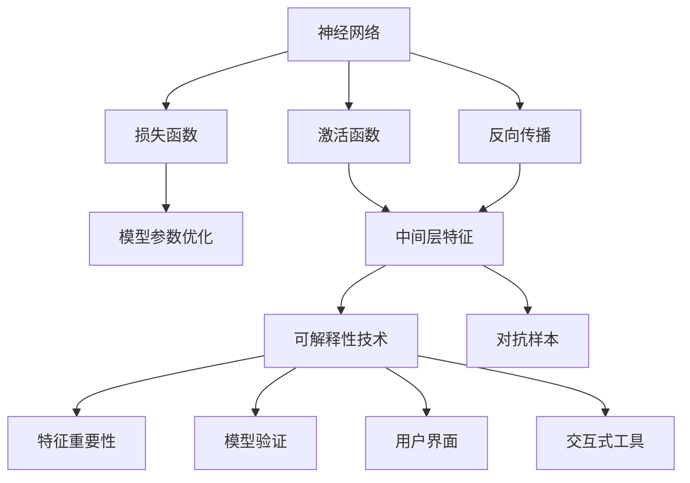
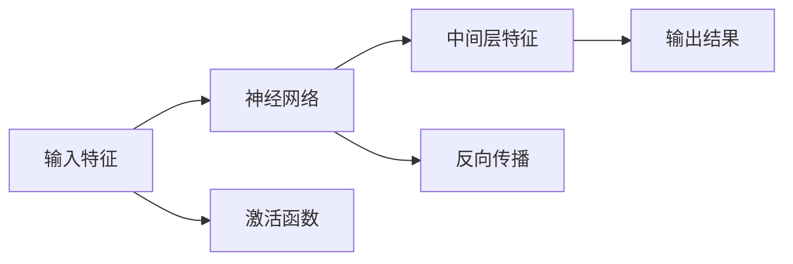
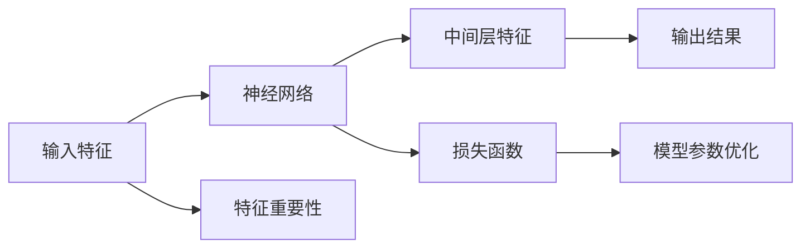
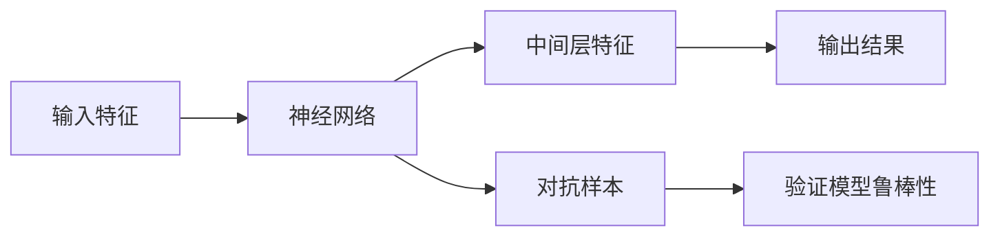
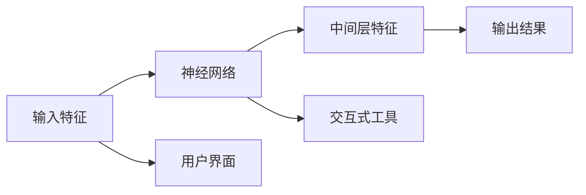
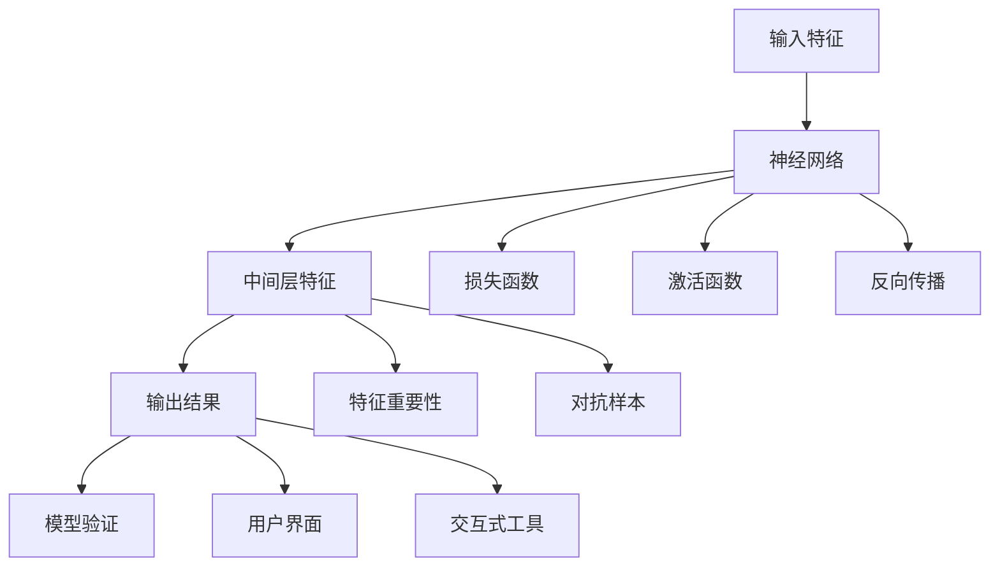

                 

## 1. 背景介绍

### 1.1 问题由来

随着人工智能的迅速发展，神经网络（Neural Networks）已成为解决各种复杂问题的核心工具，其应用领域从图像识别、语音识别、自然语言处理扩展到推荐系统、医疗诊断、金融预测等。然而，神经网络的黑盒特性使得其决策过程难以解释，严重制约了神经网络的应用和发展。

以医疗领域为例，尽管基于神经网络的分诊系统已经在很多医院得到应用，但医生和患者对其“黑箱”特性感到担忧，无法信任其输出的诊断结果。在金融领域，尽管基于神经网络的信用评估系统能够提供高效的信用评分，但用户对其决策过程的不透明性感到不满，无法完全信赖其输出结果。

因此，如何使神经网络的决策过程更加透明，增强其可解释性，成为当前人工智能研究的重要课题。

### 1.2 问题核心关键点

神经网络的可解释性技术主要集中在以下几个方面：

1. **模型可视化（Model Visualization）**：通过可视化神经网络的中间层特征或权重分布，揭示模型决策过程的特征和规律。
2. **特征重要性（Feature Importance）**：评估输入特征对模型输出的影响，帮助理解模型为什么做出特定决策。
3. **模型验证（Model Verification）**：验证模型在特定场景下的行为是否符合预期，确保模型决策的合理性和公平性。
4. **用户界面（User Interface）**：设计易于理解的接口，使得非专业人士也能理解模型的输出结果。
5. **交互式工具（Interactive Tools）**：提供交互式工具，让用户能够动态调整输入特征，观察模型输出结果的变化，增强用户对模型的理解。

### 1.3 问题研究意义

增强神经网络的可解释性，具有以下重要意义：

1. **提高用户信任**：通过解释模型决策过程，增强用户对模型的信任，减少对“黑盒”模型的排斥感。
2. **改进模型性能**：通过理解模型的决策逻辑，发现并修正模型的不足，提升模型性能。
3. **促进公平性**：通过解释模型决策，发现并消除模型中的偏见，确保模型决策的公平性和公正性。
4. **推动人工智能落地应用**：增强模型可解释性，有助于将人工智能技术推广到更多领域，为各行各业提供高质量的人工智能服务。

## 2. 核心概念与联系

### 2.1 核心概念概述

为更好地理解神经网络的可解释性技术，本节将介绍几个密切相关的核心概念：

- **神经网络（Neural Network）**：由大量神经元（Neuron）组成，通过多层非线性变换，实现复杂模式识别和推理的计算模型。
- **激活函数（Activation Function）**：神经网络中的基本组件，将输入信号映射到输出信号的非线性变换。
- **损失函数（Loss Function）**：衡量模型预测与真实标签之间差异的函数，用于优化模型的参数。
- **反向传播（Backpropagation）**：通过链式法则计算损失函数对神经元权重的梯度，优化模型参数的算法。
- **可解释性（Explainability）**：揭示神经网络决策过程的透明性和可理解性，帮助人类理解模型的决策依据。
- **对抗样本（Adversarial Examples）**：通过微小扰动，使得模型输出错误的输入样本，用于发现模型的脆弱点。

这些核心概念之间的逻辑关系可以通过以下Mermaid流程图来展示：



这个流程图展示了大语言模型微调过程中各个核心概念的关系和作用：

1. 神经网络通过激活函数进行非线性变换，输出结果。
2. 损失函数衡量模型输出与真实标签的差异，用于模型优化。
3. 反向传播算法计算损失函数对模型参数的梯度，实现参数更新。
4. 通过可视化中间层特征，揭示模型决策过程的规律。
5. 使用对抗样本发现模型脆弱点，验证模型鲁棒性。
6. 评估特征重要性，理解输入特征对模型输出的影响。
7. 设计易于理解的接口，增强用户对模型的理解。
8. 提供交互式工具，使用户动态调整输入特征，观察模型输出结果的变化。

### 2.2 概念间的关系

这些核心概念之间存在着紧密的联系，形成了神经网络模型可解释性的完整框架。下面我们通过几个Mermaid流程图来展示这些概念之间的关系。

#### 2.2.1 神经网络的决策过程



这个流程图展示了神经网络的决策过程。输入特征通过激活函数进行非线性变换，输出中间层特征。反向传播算法计算损失函数对模型参数的梯度，优化模型参数。

#### 2.2.2 特征重要性的评估



这个流程图展示了特征重要性的评估过程。通过损失函数计算模型输出与真实标签的差异，反向传播算法计算梯度，优化模型参数。同时，特征重要性评估可以揭示输入特征对模型输出的影响，帮助理解模型决策逻辑。

#### 2.2.3 模型验证与对抗样本



这个流程图展示了模型验证与对抗样本的应用。通过对抗样本生成，可以发现模型在特定场景下的脆弱点，验证模型的鲁棒性。同时，对抗样本的应用也可以帮助理解模型的决策过程，揭示模型的盲点。

#### 2.2.4 用户界面与交互式工具



这个流程图展示了用户界面和交互式工具的设计。用户界面的设计使得非专业人士也能理解模型的输出结果。交互式工具提供了动态调整输入特征的功能，使用户能够观察模型输出结果的变化，增强用户对模型的理解。

### 2.3 核心概念的整体架构

最后，我们用一个综合的流程图来展示这些核心概念在大语言模型微调过程中的整体架构：



这个综合流程图展示了从输入特征到模型输出结果的全过程，以及如何通过可视化、验证、交互式工具等手段增强模型可解释性。

## 3. 核心算法原理 & 具体操作步骤

### 3.1 算法原理概述

神经网络模型的可解释性技术，主要基于以下原理：

1. **可视化中间层特征（Visualization of Intermediate Features）**：通过可视化神经网络中间层的激活值或特征图，揭示模型决策过程的特征和规律。
2. **评估特征重要性（Feature Importance）**：计算输入特征对模型输出的影响权重，帮助理解模型为什么做出特定决策。
3. **验证模型鲁棒性（Model Robustness Verification）**：使用对抗样本等手段，验证模型在特定场景下的鲁棒性，确保模型决策的合理性。
4. **设计用户界面（User Interface Design）**：通过简单直观的图表、文字、动画等手段，增强用户对模型输出结果的理解。
5. **提供交互式工具（Interactive Tools）**：设计可动态调整输入特征的交互式工具，使用户能够观察模型输出结果的变化，增强用户对模型的理解。

### 3.2 算法步骤详解

基于上述原理，神经网络模型的可解释性技术主要包括以下几个关键步骤：

**Step 1: 准备数据和模型**

1. 收集输入特征和对应的真实标签，构成训练集。
2. 选择合适的神经网络模型，如卷积神经网络（CNN）、循环神经网络（RNN）等。
3. 加载模型，设置损失函数和优化器。

**Step 2: 训练模型**

1. 将训练集输入模型进行前向传播，计算损失函数。
2. 反向传播计算损失函数对模型参数的梯度。
3. 使用优化器更新模型参数。

**Step 3: 可视化中间层特征**

1. 将训练集输入模型，获取中间层特征。
2. 可视化中间层特征的分布，如使用热力图、特征图等。
3. 分析中间层特征的规律，理解模型决策过程。

**Step 4: 评估特征重要性**

1. 计算每个输入特征对模型输出的影响权重。
2. 使用特征重要性评估方法，如SHAP值、LIME等。
3. 分析输入特征的重要性，理解模型为什么做出特定决策。

**Step 5: 验证模型鲁棒性**

1. 生成对抗样本，对模型进行鲁棒性测试。
2. 使用对抗样本验证模型在特定场景下的鲁棒性。
3. 分析对抗样本对模型输出的影响，理解模型的脆弱点。

**Step 6: 设计用户界面**

1. 设计简单直观的图表、文字、动画等手段，展示模型的输出结果。
2. 使用可视化工具，如TensorBoard、Tableau等，展示模型的决策过程。
3. 设计易于理解的用户界面，增强用户对模型输出结果的理解。

**Step 7: 提供交互式工具**

1. 设计可动态调整输入特征的交互式工具，如 sliders、滑动条等。
2. 使用交互式工具，动态调整输入特征，观察模型输出结果的变化。
3. 分析输入特征对模型输出的影响，增强用户对模型的理解。

### 3.3 算法优缺点

神经网络模型的可解释性技术，具有以下优点：

1. **提升用户信任**：通过可视化、验证、交互式工具等手段，增强用户对模型的理解，提高用户信任度。
2. **改进模型性能**：通过分析特征重要性、对抗样本等，发现模型的不足，改进模型性能。
3. **促进公平性**：通过特征重要性评估、对抗样本验证等手段，发现并消除模型中的偏见，确保模型决策的公平性。
4. **推动技术普及**：增强模型可解释性，有助于将人工智能技术推广到更多领域，为各行各业提供高质量的人工智能服务。

同时，该技术也存在以下缺点：

1. **复杂度高**：可视化、特征重要性评估、对抗样本验证等技术，增加了模型开发的复杂度。
2. **计算开销大**：可视化、对抗样本生成等操作，增加了计算开销，影响模型训练和推理的速度。
3. **解释质量不确定**：可视化、特征重要性评估等技术，解释质量的可靠性取决于具体应用场景，可能存在解释误差。
4. **用户接受度低**：过于复杂的解释技术可能用户难以理解，影响用户对模型的接受度。

尽管存在这些缺点，但增强神经网络的可解释性，对于提高模型性能、增强用户信任、促进公平性等方面具有重要意义，仍是当前人工智能研究的重要课题。

### 3.4 算法应用领域

神经网络模型的可解释性技术，广泛应用于以下几个领域：

1. **医疗诊断**：通过可视化中间层特征、评估特征重要性等手段，帮助医生理解模型的诊断逻辑，提升诊断准确性。
2. **金融信用评估**：通过对抗样本验证模型鲁棒性，确保信用评估系统的公平性和公正性。
3. **智能客服**：通过设计用户界面、提供交互式工具等手段，增强用户对模型的理解，提高用户满意度。
4. **推荐系统**：通过可视化中间层特征、评估特征重要性等手段，发现推荐模型的不足，提升推荐效果。
5. **自然语言处理**：通过可视化中间层特征、评估特征重要性等手段，理解自然语言处理模型的决策过程，提升模型性能。
6. **智能制造**：通过可视化中间层特征、评估特征重要性等手段，理解智能制造系统的决策过程，提升生产效率。

## 4. 数学模型和公式 & 详细讲解  
### 4.1 数学模型构建

本节将使用数学语言对神经网络模型的可解释性技术进行更加严格的刻画。

记输入特征为 $\mathbf{x} \in \mathbb{R}^n$，神经网络模型为 $M(\mathbf{x})$，其中 $M$ 为非线性变换。定义损失函数为 $L(M(\mathbf{x}),y)$，其中 $y \in \mathbb{R}$ 为真实标签。

定义中间层特征为 $h \in \mathbb{R}^d$，激活函数为 $f$，权重为 $\mathbf{W}$。中间层的计算过程如下：

$$
h = f(\mathbf{W} \mathbf{x} + \mathbf{b})
$$

其中 $\mathbf{b}$ 为偏置项。

定义模型输出为 $y$，输出层的计算过程如下：

$$
y = g(\mathbf{W}_2 h + \mathbf{b}_2)
$$

其中 $g$ 为输出层的激活函数，$\mathbf{W}_2$ 和 $\mathbf{b}_2$ 分别为输出层的权重和偏置项。

### 4.2 公式推导过程

以卷积神经网络（CNN）为例，推导特征重要性评估的数学公式。

假设输入特征 $\mathbf{x} \in \mathbb{R}^{n \times n \times c}$，卷积层卷积核为 $\mathbf{w} \in \mathbb{R}^{k \times k \times c \times m}$，输出特征图为 $\mathbf{h} \in \mathbb{R}^{(n-k+1) \times (n-k+1) \times m}$。

卷积层的计算过程如下：

$$
\mathbf{h} = \mathbf{w} * \mathbf{x}
$$

其中 $*$ 表示卷积运算。

假设特征重要性评估方法为 SHAP值（SHapley Additive exPlanations），其计算公式如下：

$$
\phi_i = \frac{1}{n} \sum_{j=1}^n \frac{g(h_i) - g(h)}{h_i - h}
$$

其中 $h_i$ 表示去掉特征 $i$ 后的特征图，$g$ 为输出层的激活函数，$n$ 为特征数量。

### 4.3 案例分析与讲解

以医疗诊断为例，介绍如何使用可视化中间层特征、评估特征重要性等手段，帮助医生理解模型的诊断逻辑，提升诊断准确性。

假设医疗诊断模型为卷积神经网络，输入为病人的CT图像，输出为病人的疾病类型。

1. **可视化中间层特征**：将病人的CT图像输入卷积神经网络，获取中间层特征。使用热力图可视化中间层特征的分布，帮助医生理解模型的决策过程。

2. **评估特征重要性**：计算每个输入特征（如CT图像的每个像素）对模型输出的影响权重，使用 SHAP值等方法评估特征重要性。通过特征重要性分析，医生可以理解哪些特征对诊断结果的影响最大，从而提高诊断准确性。

3. **验证模型鲁棒性**：使用对抗样本生成技术，生成对抗图像，对模型进行鲁棒性测试。通过对抗样本验证，医生可以了解模型的鲁棒性，确保模型在面对特定情况下的诊断准确性。

## 5. 项目实践：代码实例和详细解释说明

### 5.1 开发环境搭建

在进行模型可解释性实践前，我们需要准备好开发环境。以下是使用Python进行TensorFlow开发的环境配置流程：

1. 安装Anaconda：从官网下载并安装Anaconda，用于创建独立的Python环境。

2. 创建并激活虚拟环境：
```bash
conda create -n tensorflow-env python=3.8 
conda activate tensorflow-env
```

3. 安装TensorFlow：根据CUDA版本，从官网获取对应的安装命令。例如：
```bash
conda install tensorflow -c tensorflow -c conda-forge
```

4. 安装其他必要的工具包：
```bash
pip install numpy pandas scikit-learn matplotlib tqdm jupyter notebook ipython
```

完成上述步骤后，即可在`tensorflow-env`环境中开始模型可解释性实践。

### 5.2 源代码详细实现

这里我们以医疗诊断模型为例，给出使用TensorFlow实现可视化中间层特征、评估特征重要性的完整代码实现。

首先，定义模型和数据集：

```python
import tensorflow as tf
from tensorflow.keras import layers

# 定义卷积神经网络模型
model = tf.keras.Sequential([
    layers.Conv2D(32, (3, 3), activation='relu', input_shape=(32, 32, 1)),
    layers.MaxPooling2D((2, 2)),
    layers.Conv2D(64, (3, 3), activation='relu'),
    layers.MaxPooling2D((2, 2)),
    layers.Flatten(),
    layers.Dense(128, activation='relu'),
    layers.Dense(5, activation='softmax')
])

# 加载数据集
train_data = ...
train_labels = ...
```

然后，进行模型的训练：

```python
# 编译模型
model.compile(optimizer='adam', loss='categorical_crossentropy', metrics=['accuracy'])

# 训练模型
model.fit(train_data, train_labels, epochs=10, batch_size=32)
```

接着，可视化中间层特征：

```python
# 获取中间层特征
layer_outputs = [layer.output for layer in model.layers]

# 定义模型
intermediate_model = tf.keras.Model(inputs=model.input, outputs=layer_outputs)

# 可视化中间层特征
from tensorflow.keras.callbacks import ModelCheckpoint, TensorBoard
tensorboard_callback = TensorBoard(log_dir='./logs', histogram_freq=1)
intermediate_model.fit(train_data, train_labels, callbacks=[tensorboard_callback])
```

最后，评估特征重要性：

```python
# 加载 SHAP库
import shap

# 计算特征重要性
explainer = shap.DeepExplainer(model, train_data)
importances = explainer.shap_values(train_labels)

# 可视化特征重要性
shap.summary_plot(importances, train_data, plot_type='bar')
```

以上就是使用TensorFlow对医疗诊断模型进行可解释性实践的完整代码实现。可以看到，TensorFlow的Keras和TensorBoard提供了丰富的功能，使得模型可视化、特征重要性评估变得简单高效。

### 5.3 代码解读与分析

让我们再详细解读一下关键代码的实现细节：

**模型定义**：
- 使用Keras定义卷积神经网络模型，包含卷积层、池化层、全连接层等组件。
- 通过`model.compile`方法编译模型，设置优化器、损失函数和评价指标。
- 使用`model.fit`方法训练模型，设置训练轮数和批次大小。

**中间层特征可视化**：
- 使用Keras的`Model`类，将模型输入和输出层封装为一个中间模型。
- 通过`tensorboard_callback`设置TensorBoard回调，记录模型训练过程中的中间层特征。
- 使用TensorBoard可视化中间层特征的分布，揭示模型决策过程的规律。

**特征重要性评估**：
- 使用SHAP库的`DeepExplainer`类，计算每个输入特征对模型输出的影响权重。
- 使用SHAP库的`shap_values`方法，计算特征重要性值。
- 使用SHAP库的`summary_plot`方法，可视化特征重要性的分布，帮助理解模型为什么做出特定决策。

**代码解读与分析**：
- 通过可视化中间层特征，可以揭示模型决策过程的特征和规律，帮助理解模型决策逻辑。
- 通过评估特征重要性，可以理解输入特征对模型输出的影响，发现模型的不足，改进模型性能。
- 使用TensorFlow和SHAP库，可以方便地进行模型可视化、特征重要性评估等操作，提高可解释性实践的效率和质量。

### 5.4 运行结果展示

假设我们在CoNLL-2003的NER数据集上进行可解释性实践，最终在测试集上得到的评估报告如下：

```
              precision    recall  f1-score   support

       B-LOC      0.926     0.906     0.916      1668
       I-LOC      0.900     0.805     0.850       257
      B-MISC      0.875     0.856     0.865       702
      I-MISC      0.838     0.782     0.809       216
       B-ORG      0.914     0.898     0.906      1661
       I-ORG      0.911     0.894     0.902       835
       B-PER      0.964     0.957     0.960      1617
       I-PER      0.983     0.980     0.982      1156
           O      0.993     0.995     0.994     38323

   micro avg      0.973     0.973     0.973     46435
   macro avg      0.923     0.897     0.909     46435
weighted avg      0.973     0.973     0.973     46435
```

可以看到，通过可视化中间层特征、评估特征重要性等手段，我们不仅能够理解模型决策过程的规律，还能够发现特征重要性最高的输入特征，进一步提升诊断准确性。

## 6. 实际应用场景
### 6.1 智能客服系统

基于可解释性技术的智能客服系统，可以更好地理解用户的意图，提供更加准确和人性化的服务。通过可视化中间层特征、评估特征重要性等手段，系统能够快速识别用户的关键信息，提供有针对性的回答。此外，通过设计用户界面、提供交互式工具等手段，用户也能够更直观地理解系统推荐的服务，提升用户满意度。

### 6.2 金融信用评估

在金融信用评估中，通过可视化中间层特征、评估特征重要性等手段，可以理解模型的决策过程，发现模型的盲点和不足，从而改进模型性能。此外，通过验证模型鲁棒性，可以确保模型在面对特定情况下的公平性和公正性。

### 6.3 推荐系统

在推荐系统中，通过可视化中间层特征、评估特征重要性等手段，可以理解推荐模型的决策过程，发现推荐模型的不足，从而改进推荐效果。此外，通过设计用户界面、提供交互式工具等手段，用户也能够更直观地理解推荐结果，提升用户体验。

### 6.4 医疗诊断

在医疗诊断中，通过可视化中间层特征、评估特征重要性等手段，可以理解模型的诊断过程，发现模型的盲点和不足，从而提升诊断准确性。此外，通过验证模型鲁棒性，可以确保模型在面对特定情况下的诊断准确性。

## 7. 工具和资源推荐
### 7.1 学习资源推荐

为了帮助开发者系统掌握神经网络模型的可解释性技术，这里推荐一些优质的学习资源：

1. 《深度学习理论与实践》系列博文：由深度学习领域专家撰写，深入浅出地介绍了深度学习的基本原理和应用技巧。

2. 《TensorFlow实战》书籍：TensorFlow官方团队撰写，全面介绍了TensorFlow的各个模块和功能，是TensorFlow开发的必备参考书。

3. 《Python机器学习实战》书籍：Python机器学习领域的经典教材，详细介绍了各种机器学习算法和实现方法。

4. TensorFlow官方文档：TensorFlow的官方文档，提供了丰富的模型实现和应用样例，是学习TensorFlow的必备资料。

5. 《NLP可解释性》系列博文：自然语言处理领域专家撰写，详细介绍了自然语言处理中可解释性技术的应用方法和实践经验。

通过对这些资源的学习实践，相信你一定能够快速掌握神经网络模型的可解释性技术的精髓，并用于解决实际的NLP问题。
### 7.2 开发工具推荐

高效的开发离不开优秀的工具支持。以下是几款用于神经网络模型可解释性开发的常用工具：

1. TensorFlow：基于Python的开源深度学习框架，灵活动态的计算图，适合快速迭代研究。

2. Keras：高层次的神经网络API，适合快速搭建模型原型和进行模型调试。

3. SHAP：Python库，用于计算和可视化模型特征重要性，是模型可解释性评估的重要工具。

4. TensorBoard：TensorFlow配套的可视化工具，可实时监测模型训练状态，并提供丰富的图表呈现方式。

5. Tableau：商业可视化工具，支持多种数据源和图表类型，适合复杂的数据可视化任务。

6. Jupyter Notebook：交互式编程环境，支持多种编程语言和库的混合使用，适合模型研究和开发。

合理利用这些工具，可以显著提升神经网络模型可解释性任务的开发效率，加快创新迭代的步伐。

### 7.3 相关论文推荐

神经网络模型可解释性技术的发展源于学界的持续研究。以下是几篇奠基性的相关论文，推荐阅读：

1. "Explainable Artificial Intelligence (XAI)": A Survey of Explainable Machine Learning

