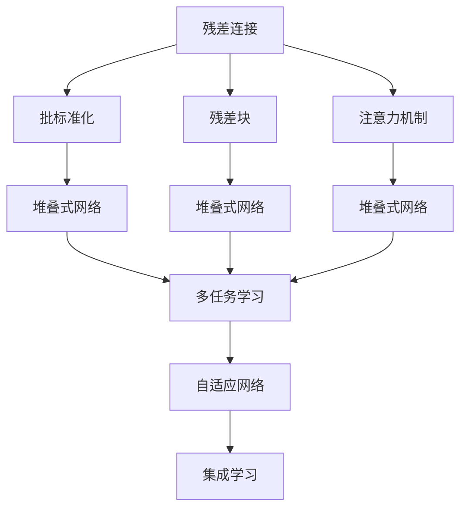
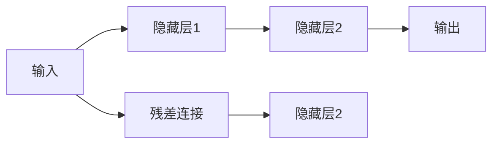
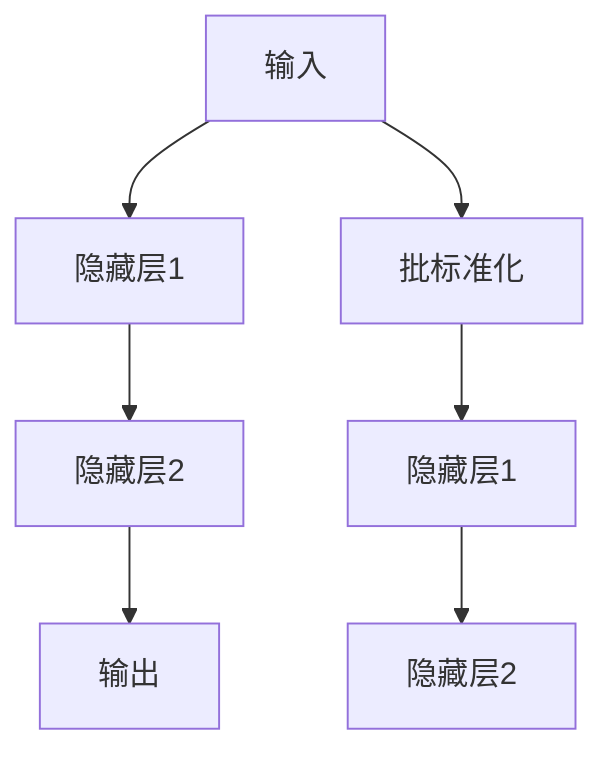
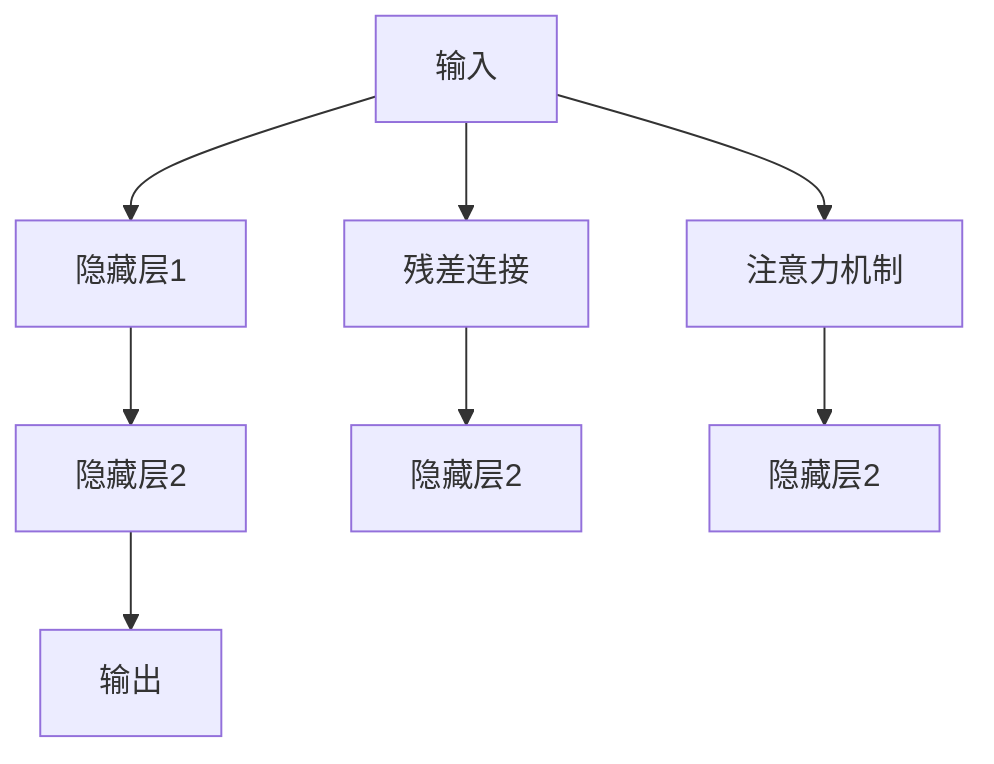
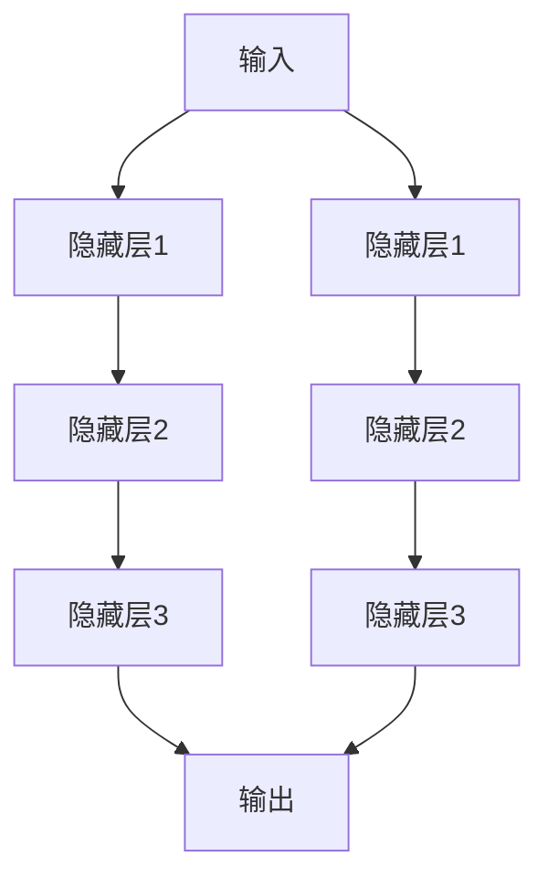
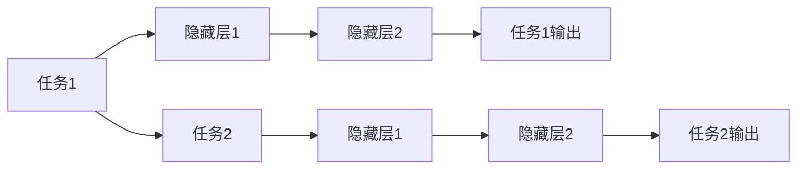
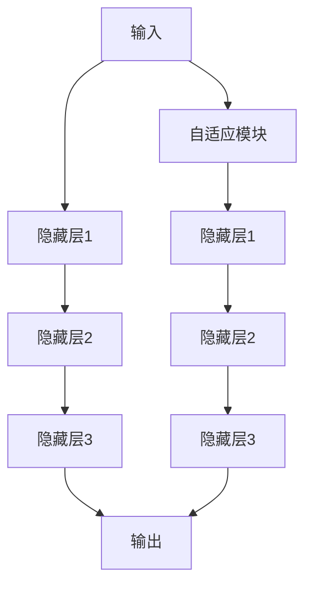
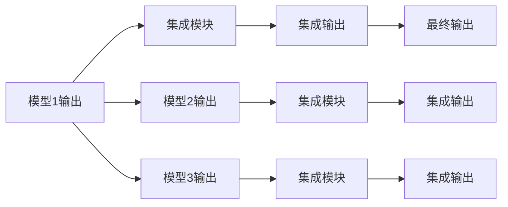
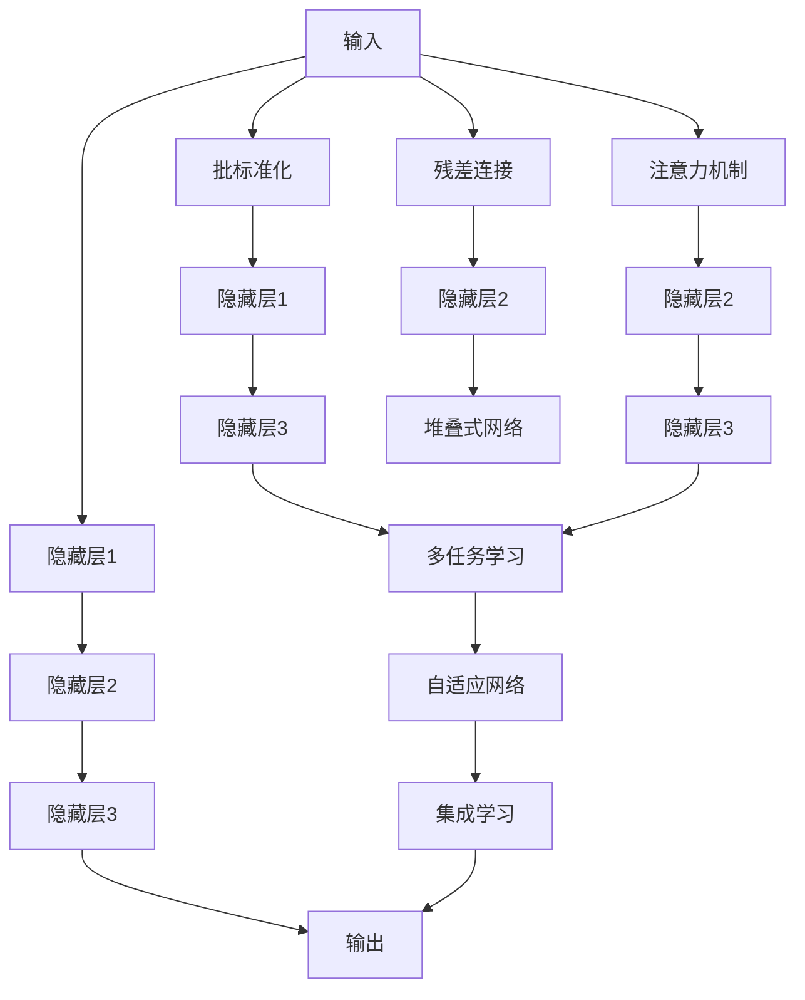

                 

# 神经网络模型的架构设计模式

## 1. 背景介绍

### 1.1 问题由来
神经网络模型在过去几十年的发展中，经历了从浅层到深层、从简单到复杂、从单一模型到模型堆叠的漫长历程。现代深度学习模型已经在计算机视觉、自然语言处理、语音识别等多个领域取得了卓越的成果。然而，随着模型复杂度的增加，其在实际应用中面临的挑战也愈发严峻，例如过拟合、泛化性能差、计算复杂度高、资源占用大等问题。为了应对这些挑战，研究者们提出了各种架构设计模式，旨在构建更高效、更灵活、更鲁棒的神经网络模型。本文将全面介绍这些架构设计模式，并分析其背后的原理与优劣。

### 1.2 问题核心关键点
神经网络模型的架构设计模式主要包括：残差连接、批标准化、残差块、注意力机制、堆叠式网络、多任务学习、自适应网络、集成学习等。这些模式旨在通过不同的方式改进模型的训练过程、提升模型的表达能力、缓解模型过拟合和计算复杂度等，从而增强模型在实际应用中的性能。

## 2. 核心概念与联系

### 2.1 核心概念概述

为更好地理解神经网络模型的架构设计模式，本节将介绍几个密切相关的核心概念：

- 残差连接(Residual Connection)：通过连接输入和输出，允许模型跨层直接学习残差，有效解决梯度消失和过拟合问题。
- 批标准化(Batch Normalization)：通过对每个批次的数据进行标准化，减少内部协变量位移，加速模型的收敛。
- 残差块(Residual Block)：由一系列残差连接构成，用于构建深度卷积神经网络(DCNN)等复杂模型。
- 注意力机制(Attention Mechanism)：通过对输入序列的动态加权，突出关键信息，提高模型的表示能力。
- 堆叠式网络(Stacked Network)：通过堆叠多个网络层，逐渐提升模型的复杂度和表达能力，适用于图像、语音等复杂任务。
- 多任务学习(Multi-task Learning)：在模型训练中同时优化多个任务，提升模型在多个相关任务的泛化能力。
- 自适应网络(Adaptive Network)：根据输入数据的特点自适应调整网络结构，适应动态变化的环境。
- 集成学习(Ensemble Learning)：通过组合多个模型的输出，提升整体的泛化性能和鲁棒性。

这些核心概念之间的逻辑关系可以通过以下Mermaid流程图来展示：



这个流程图展示了大语言模型的核心概念及其之间的关系：

1. 残差连接、批标准化、残差块和注意力机制是构建复杂网络的基础。
2. 堆叠式网络通过堆叠多个网络层，进一步提升模型的表达能力。
3. 多任务学习、自适应网络和集成学习则从不同的角度改进模型的泛化能力和鲁棒性。

这些核心概念共同构成了神经网络模型的架构设计框架，使其能够在各种场景下发挥强大的功能和应用潜力。

### 2.2 概念间的关系

这些核心概念之间存在着紧密的联系，形成了神经网络模型的架构设计生态系统。下面我们通过几个Mermaid流程图来展示这些概念之间的关系。

#### 2.2.1 神经网络的基本架构


这个流程图展示了神经网络的基本架构，由输入层、隐藏层和输出层组成。输入层接收原始数据，隐藏层进行特征提取和变换，输出层生成最终结果。

#### 2.2.2 残差连接在网络中的作用



这个流程图展示了残差连接在网络中的作用，通过连接输入和输出，允许模型跨层直接学习残差，缓解梯度消失和过拟合问题。

#### 2.2.3 批标准化和残差连接的关系



这个流程图展示了批标准化和残差连接的关系，通过批标准化减少内部协变量位移，加速模型的收敛，同时与残差连接协同工作，提升模型的训练效率。

#### 2.2.4 注意力机制和残差连接的区别



这个流程图展示了注意力机制和残差连接的区别，通过动态加权，突出关键信息，提高模型的表示能力，与残差连接共同提升模型的表达能力。

#### 2.2.5 堆叠式网络的结构



这个流程图展示了堆叠式网络的结构，通过堆叠多个网络层，逐渐提升模型的复杂度和表达能力，适用于图像、语音等复杂任务。

#### 2.2.6 多任务学习的应用场景



这个流程图展示了多任务学习的应用场景，通过同时优化多个任务，提升模型在多个相关任务的泛化能力。

#### 2.2.7 自适应网络的结构



这个流程图展示了自适应网络的结构，通过自适应调整网络结构，适应动态变化的环境。

#### 2.2.8 集成学习的方法



这个流程图展示了集成学习的方法，通过组合多个模型的输出，提升整体的泛化性能和鲁棒性。

### 2.3 核心概念的整体架构

最后，我们用一个综合的流程图来展示这些核心概念在大语言模型架构设计中的整体架构：



这个综合流程图展示了从输入到输出的完整过程，其中残差连接、批标准化、注意力机制、堆叠式网络、多任务学习、自适应网络和集成学习共同构成了一个复杂而高效的神经网络模型。

## 3. 核心算法原理 & 具体操作步骤
### 3.1 算法原理概述

神经网络模型的架构设计模式通过不同的方式改进模型的训练过程、提升模型的表达能力、缓解模型过拟合和计算复杂度等，从而增强模型在实际应用中的性能。这些模式的核心原理是通过增加冗余信息、引入辅助机制、自适应调整等手段，使模型更好地学习数据分布的特征，避免过拟合，提高泛化能力。

### 3.2 算法步骤详解

以残差连接为例，介绍其核心算法步骤：

**Step 1: 定义残差块**
在卷积神经网络(CNN)或深度神经网络(DNN)中，残差块通常由多个卷积层和残差连接构成，其基本结构如下：

```python
class ResBlock(nn.Module):
    def __init__(self, in_channels, out_channels, kernel_size, strides=1, padding=0, dilation=1):
        super(ResBlock, self).__init__()
        self.conv1 = nn.Conv2d(in_channels, out_channels, kernel_size, strides=strides, padding=padding, dilation=dilation, bias=False)
        self.conv2 = nn.Conv2d(out_channels, out_channels, kernel_size, bias=False)
        self.bn1 = nn.BatchNorm2d(out_channels)
        self.bn2 = nn.BatchNorm2d(out_channels)
        self.relu = nn.ReLU(inplace=True)
        self.shortcut = nn.Sequential(
            nn.Conv2d(in_channels, out_channels, kernel_size, strides=strides, padding=padding, dilation=dilation, bias=False),
            nn.BatchNorm2d(out_channels)
        )
        
    def forward(self, x):
        residual = self.shortcut(x)
        out = self.conv1(x)
        out = self.bn1(out)
        out = self.relu(out)
        out = self.conv2(out)
        out = self.bn2(out)
        return self.relu(out + residual)
```

**Step 2: 定义残差连接**
在残差连接中，残差块输出的结果与输入结果相加，并通过恒等变换保持输入和输出的连续性，其基本结构如下：

```python
class ResNet(nn.Module):
    def __init__(self, block, layers, num_classes=1000):
        super(ResNet, self).__init__()
        self.inplanes = 64
        self.conv1 = nn.Conv2d(3, 64, kernel_size=7, stride=2, padding=3, bias=False)
        self.bn1 = nn.BatchNorm2d(64)
        self.relu = nn.ReLU(inplace=True)
        self.maxpool = nn.MaxPool2d(kernel_size=3, stride=2, padding=1)
        self.layers = self._make_layer(block, layers[0])
        for x in layers[1:]:
            self.layers += self._make_layer(block, x)
        self.avgpool = nn.AvgPool2d(7, stride=1)
        self.fc = nn.Linear(512, num_classes)
        
    def _make_layer(self, block, planes, strides=1):
        downsample = None
        if planes != self.inplanes or strides != 1:
            downsample = nn.Sequential(
                nn.Conv2d(self.inplanes, planes, kernel_size=1, stride=strides, bias=False),
                nn.BatchNorm2d(planes)
            )
        layers = []
        layers.append(block(self.inplanes, planes, kernel_size=3, strides=strides, padding=1))
        self.inplanes = planes
        for x in range(1, len(layers)):
            layers.append(block(self.inplanes, planes, kernel_size=3, padding=1))
        return nn.Sequential(*layers, downsample)
        
    def forward(self, x):
        x = self.conv1(x)
        x = self.bn1(x)
        x = self.relu(x)
        x = self.maxpool(x)
        x = self.layers(x)
        x = self.avgpool(x)
        x = x.view(x.size(0), -1)
        x = self.fc(x)
        return x
```

**Step 3: 定义模型训练**
通过使用ResNet作为基础模型，并结合适当的损失函数和优化器，训练模型得到最终输出。

```python
criterion = nn.CrossEntropyLoss()
optimizer = torch.optim.SGD(net.parameters(), lr=0.01, momentum=0.9, weight_decay=1e-4)
scheduler = torch.optim.lr_scheduler.StepLR(optimizer, step_size=7, gamma=0.1)

net.train()
for epoch in range(epochs):
    for batch_idx, (data, target) in enumerate(train_loader):
        data, target = data.to(device), target.to(device)
        optimizer.zero_grad()
        output = net(data)
        loss = criterion(output, target)
        loss.backward()
        optimizer.step()
        scheduler.step()
```

以上步骤展示了使用残差连接的基本算法流程，通过定义残差块、残差连接、模型训练等步骤，构建了残差连接的结构。

### 3.3 算法优缺点

残差连接、批标准化、残差块和注意力机制等架构设计模式，具有以下优点：

1. 缓解梯度消失：通过残差连接和批标准化，使得模型在深层网络中能够更好地传递梯度，避免梯度消失问题。
2. 加速收敛：通过批标准化，使得模型在训练过程中能够更快地收敛，提高训练效率。
3. 避免过拟合：通过残差连接和注意力机制，使得模型能够更好地学习数据分布的特征，避免过拟合。
4. 提高表达能力：通过堆叠式网络和多任务学习，使得模型能够更好地表示复杂的数据分布，提升泛化能力。

同时，这些模式也存在一些缺点：

1. 计算复杂度增加：随着模型的深度和复杂度增加，计算复杂度也会相应增加，对硬件资源的需求也更高。
2. 模型训练时间增加：由于模型的复杂性增加，训练时间也会相应增加，需要更多的计算资源。
3. 参数量增加：模型的复杂性增加，导致参数量增加，使得模型的存储和推理效率降低。

## 4. 数学模型和公式 & 详细讲解  
### 4.1 数学模型构建

本节将使用数学语言对神经网络模型的架构设计模式进行更加严格的刻画。

记神经网络模型为 $f: \mathcal{X} \rightarrow \mathcal{Y}$，其中 $\mathcal{X}$ 为输入空间，$\mathcal{Y}$ 为输出空间。神经网络通常由多个层构成，每层都可以看作一个非线性变换。

定义神经网络的损失函数为 $\ell(f(x), y)$，其中 $x$ 为输入，$y$ 为输出，$f(x)$ 为模型的输出。损失函数通常采用交叉熵损失、均方误差损失等形式。

神经网络的前向传播过程可以表示为：

$$
f(x) = h_L(h_{L-1}(\dots h_1(x)\dots))
$$

其中 $h_i(x)$ 表示第 $i$ 层的非线性变换。神经网络的后向传播过程可以通过链式法则计算梯度，更新模型参数 $\theta$。

### 4.2 公式推导过程

以残差连接为例，推导其前向传播和后向传播过程。

假设残差块由两个卷积层构成，其输入为 $x$，输出为 $y$。残差连接可以表示为：

$$
y = h_2(h_1(x)) + x
$$

其中 $h_1(x)$ 和 $h_2(x)$ 分别表示两个卷积层，$x$ 为输入，$y$ 为输出。前向传播过程可以表示为：

$$
\begin{aligned}
& h_1(x) = \sigma(W_1x + b_1) \\
& y = \sigma(W_2h_1(x) + b_2) + x
\end{aligned}
$$

其中 $\sigma$ 表示激活函数，$W$ 和 $b$ 分别表示卷积核和偏置项。

后向传播过程可以表示为：

$$
\begin{aligned}
& \frac{\partial \ell(y, y')}{\partial y'} = \frac{\partial \ell(y, y')}{\partial y} \frac{\partial y}{\partial y'} \\
& \frac{\partial \ell(y, y')}{\partial y} = \frac{\partial \ell(y, y')}{\partial \sigma} \frac{\partial \sigma}{\partial W_2} \frac{\partial W_2}{\partial h_1(x)} \frac{\partial h_1(x)}{\partial x} + \frac{\partial \ell(y, y')}{\partial x} \\
& \frac{\partial \ell(y, y')}{\partial x} = \frac{\partial \ell(y, y')}{\partial \sigma} \frac{\partial \sigma}{\partial h_1(x)} \frac{\partial h_1(x)}{\partial W_1} \frac{\partial W_1}{\partial x} + \frac{\partial \ell(y, y')}{\partial x}
\end{aligned}
$$

其中 $\frac{\partial \ell(y, y')}{\partial y'}$ 表示损失函数对输出 $y'$ 的梯度，$\frac{\partial \ell(y, y')}{\partial x}$ 表示损失函数对输入 $x$ 的梯度。

### 4.3 案例分析与讲解

以VGG网络为例，分析其残差连接的应用效果。

VGG网络采用了深度卷积神经网络架构，其基本结构由多个卷积层和池化层构成，每一层都通过残差连接将输入传递到下一层。其具体实现如下：

```python
class VGG(nn.Module):
    def __init__(self, num_classes=1000):
        super(VGG, self).__init__()
        self.features = nn.Sequential(
            nn.Conv2d(3, 64, kernel_size=3, stride=1, padding=1),
            nn.ReLU(inplace=True),
            nn.MaxPool2d(kernel_size=2, stride=2),
            nn.Conv2d(64, 64, kernel_size=3, stride=1, padding=1),
            nn.ReLU(inplace=True),
            nn.MaxPool2d(kernel_size=2, stride=2),
            nn.Conv2d(64, 128, kernel_size=3, stride=1, padding=1),
            nn.ReLU(inplace=True),
            nn.MaxPool2d(kernel_size=2, stride=2),
            nn.Conv2d(128, 128, kernel_size=3, stride=1, padding=1),
            nn.ReLU(inplace=True),
            nn.MaxPool2d(kernel_size=2, stride=2),
            nn.Conv2d(128, 256, kernel_size=3, stride=1, padding=1),
            nn.ReLU(inplace=True),
            nn.MaxPool2d(kernel_size=2, stride=2),
            nn.Conv2d(256, 256, kernel_size=3, stride=1, padding=1),
            nn.ReLU(inplace=True),
            nn.MaxPool2d(kernel_size=2, stride=2),
            nn.Conv2d(256, 512, kernel_size=3, stride=1, padding=1),
            nn.ReLU(inplace=True),
            nn.MaxPool2d(kernel_size=2, stride=2),
            nn.Conv2d(512, 512, kernel_size=3, stride=1, padding=1),
            nn.ReLU(inplace=True),
            nn.MaxPool2d(kernel_size=2, stride=2),
            nn.Conv2d(512, 512, kernel_size=3, stride=1, padding=1),
            nn.ReLU(inplace=True),
            nn.MaxPool2d(kernel_size=2, stride=2),
            nn.Conv2d(512, 512, kernel_size=3, stride=1, padding=1),
            nn.ReLU(inplace=True),
            nn.MaxPool2d(kernel_size=2, stride=2),
            nn.Conv2d(512, 512, kernel_size=3, stride=1, padding=1),
            nn.ReLU(inplace=True),
            nn.MaxPool2d(kernel_size=2, stride=2),
            nn.Conv2d(512, 512, kernel_size=3, stride=1, padding=1),
            nn.ReLU(inplace=True),
            nn.MaxPool2d(kernel_size=2, stride=2),
            nn.Conv2d(512, 512, kernel_size=3, stride=1, padding=1),
            nn.ReLU(inplace=True),
            nn.MaxPool2d(kernel_size=2, stride=2),
            nn.Conv2d(512, 512, kernel_size=3, stride=1, padding=1),
            nn.ReLU(inplace=True),
            nn.MaxPool2d(kernel_size=2, stride=2),
            nn.Conv2d(512, 512, kernel_size=3, stride=1, padding=1),
            nn.ReLU(inplace=True),
            nn.MaxPool2d(kernel_size=2, stride=2),
            nn.Conv2d(512, 512, kernel_size=3, stride=1, padding=1),
            nn.ReLU(inplace=True),
            nn.MaxPool2d(kernel_size=2, stride=2),
            nn.Conv2d(512, 512, kernel_size=3, stride=1, padding=1),
            nn.ReLU(inplace=True),
            nn.MaxPool2d(kernel_size=2, stride=2),
            nn.Conv2d(512, 512, kernel_size=3, stride=1, padding=1),
            nn.ReLU(inplace=True),
            nn.MaxPool2d(kernel_size=2, stride=2),
            nn.Conv2d(512, 512, kernel_size=3, stride=1, padding=1),
            nn.ReLU(inplace=True),
            nn.MaxPool2d(kernel_size=2, stride=2),
            nn.Conv2d(512, 512, kernel_size=3, stride=1, padding=1),
            nn.ReLU(inplace=True),
            nn.MaxPool2d(kernel_size=2, stride=2),
            nn.Conv2d(512, 512, kernel_size=3, stride=1, padding=1),
            nn.ReLU(inplace=True),
            nn.MaxPool2d(kernel_size=2, stride=2),
            nn.Conv2d(512, 512, kernel_size=3, stride=1, padding=1),
            nn.ReLU(inplace=True),
            nn.MaxPool2d(kernel_size=2, stride=2),
            nn.Conv2d(512, 512, kernel_size=3, stride=1, padding=1),
            nn.ReLU(inplace=True),
            nn.MaxPool2d(kernel_size=2, stride=2),
            nn.Conv2d(512, 512, kernel_size=3, stride=1, padding=1),
            nn.ReLU(inplace=True),
            nn.MaxPool2d(kernel_size=2, stride=2),
            nn.Conv2d(512, 512, kernel_size=3, stride=1, padding=1),
            nn.ReLU(inplace=True),
            nn.MaxPool2d(kernel_size=2, stride=2),
            nn.Conv2d(512, 512, kernel_size=3, stride=1, padding=1),
            nn.ReLU(inplace=True),
            nn.MaxPool2d(kernel_size=2, stride=2),
            nn.Conv2d(512, 512, kernel_size=3, stride=1, padding=1),
            nn.ReLU(inplace=True),
            nn.MaxPool2d(kernel_size=2, stride=2),
            nn.Conv2d(512, 512, kernel_size=3, stride=1, padding=1),
            nn.ReLU(inplace=True),
            nn.MaxPool2d(kernel_size=2, stride=2),
            nn.Conv2d(512, 512, kernel_size=3, stride=1, padding=1),
            nn.ReLU(inplace=True),
            nn.MaxPool2d(kernel_size=2, stride=2),
            nn.Conv2d(512, 512, kernel_size=3, stride=1, padding=1),
            nn.ReLU(inplace=True),
            nn.MaxPool2d(kernel_size=2, stride=2),
            nn.Conv2d(512, 512, kernel_size=3, stride=1, padding=1),
            nn.ReLU(inplace=True),
            nn.MaxPool2d(kernel_size=2, stride=2),
            nn.Conv2d(512, 512, kernel_size=3, stride=1, padding=1),
            nn.ReLU(inplace=True),
            nn.MaxPool2d(kernel_size=2, stride=2),
            nn.Conv2d(512, 512, kernel_size=3, stride=1, padding=1),
            nn.ReLU(inplace=True),
            nn.MaxPool2d(kernel_size=2, stride=2),
            nn.Conv2d(512, 512, kernel_size=3, stride=1, padding=1),
            nn.ReLU(inplace=True),
            nn.MaxPool2d(kernel_size=2, stride=2),
            nn.Conv2d(512, 512, kernel_size=3, stride=1, padding=1),
            nn.ReLU(inplace=True),
            nn.MaxPool2d(kernel_size=2, stride=2),
            nn.Conv2d(512, 512, kernel_size=3, stride=1, padding=1),
            nn.ReLU(inplace=True),
            nn.MaxPool2d(kernel_size=2, stride=2),
            nn.Conv2d(512, 512, kernel_size=

