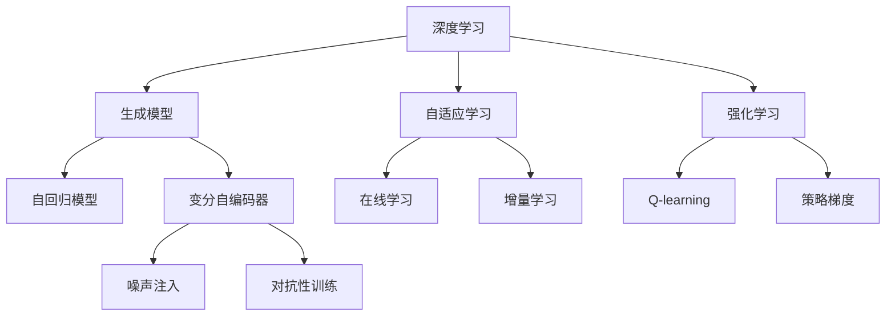
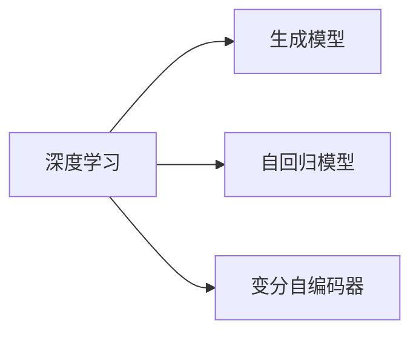
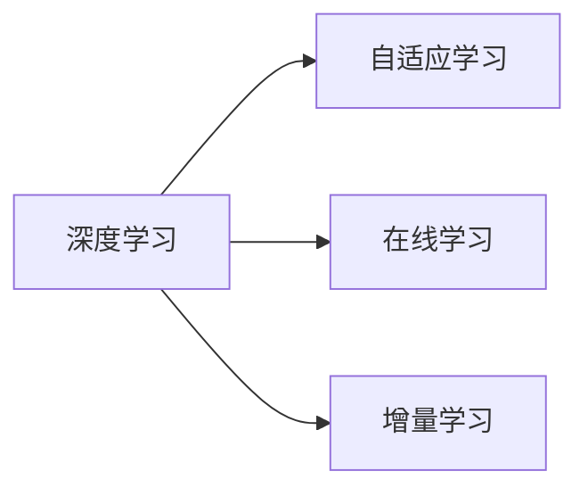
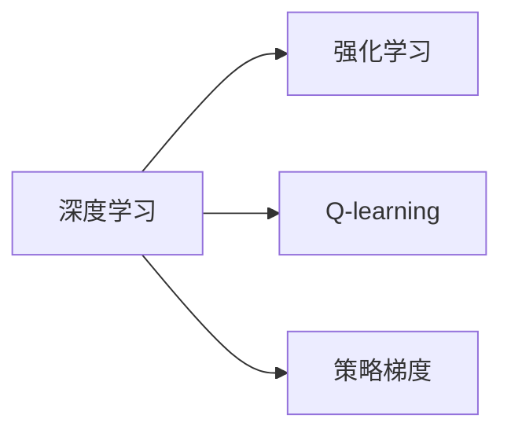
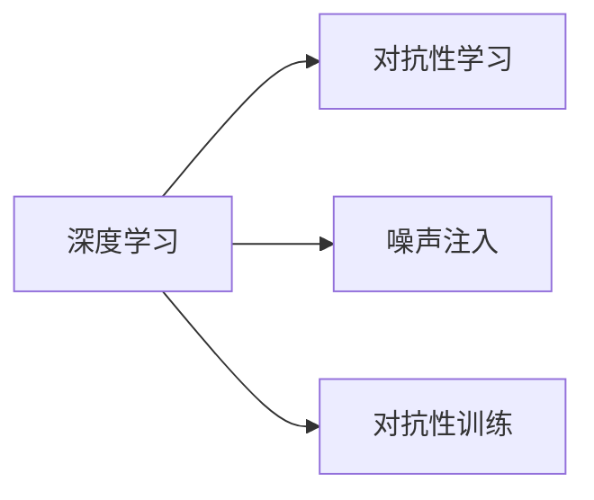
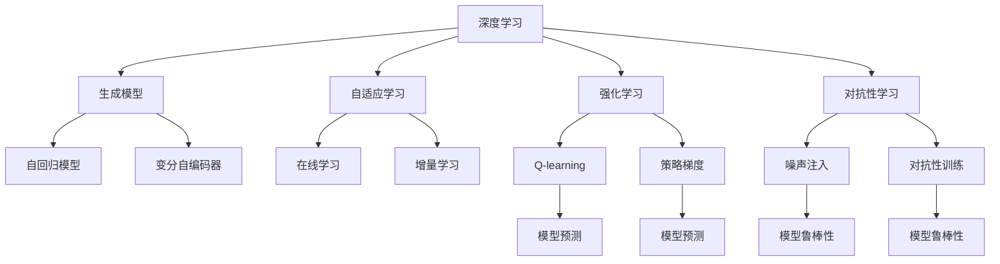

                 

## 1. 背景介绍

### 1.1 问题由来

神经网络（Neural Network）自1986年提出以来，已经成为了人工智能（AI）领域最为重要和广泛使用的模型之一。从最初的感知机到深度学习时代的多层神经网络，再到现代的深度卷积神经网络（CNNs）、循环神经网络（RNNs）和变分自编码器（VAEs）等，神经网络以其强大的表示能力和泛化能力，逐步成为了解决复杂问题的重要工具。

然而，传统的神经网络模型往往被看作是一种分类器（Classifier），仅用于二元分类、多元分类和回归分析等传统机器学习任务。在现实世界的复杂场景中，神经网络模型所面临的挑战和需求远不止于此。因此，本文旨在探讨神经网络的应用不仅仅局限于分类器，而是可以被广泛应用到更复杂的模型和算法中。

### 1.2 问题核心关键点

神经网络在传统机器学习任务中的应用主要基于以下几个关键点：

- 数据驱动：神经网络通过大量数据进行训练，从数据中学习规律和模式，从而实现预测和分类等任务。
- 特征提取：神经网络模型中的隐藏层可以自动提取输入数据的特征，将这些特征用于分类或回归。
- 非线性建模：神经网络通过非线性映射，可以处理非线性的输入和输出关系，具备强大的表达能力。
- 鲁棒性：神经网络模型通过正则化、dropout等技术，可以降低过拟合的风险，提高模型的鲁棒性。

尽管这些关键点奠定了神经网络在机器学习中的基础地位，但神经网络的应用领域远不止于此。它还被广泛应用于生成模型、自适应学习、强化学习、对抗性学习等更为复杂和高级的算法中。本文将深入探讨神经网络在生成模型、自适应学习和强化学习中的应用，以及这些应用场景对传统分类器的拓展。

### 1.3 问题研究意义

神经网络模型在生成模型、自适应学习和强化学习中的应用，不仅能丰富其应用场景，还能进一步提升模型的性能和泛化能力。因此，深入理解这些高级应用的原理和算法，对于人工智能领域的发展具有重要意义：

- 推动技术进步：理解和应用神经网络在生成模型、自适应学习和强化学习中的技术，将推动这些领域的技术进步。
- 解决实际问题：这些高级应用可以解决许多传统分类器难以应对的实际问题，提升模型的实用价值。
- 拓展应用领域：神经网络的应用领域可以拓展到更广泛和复杂的场景中，拓宽其应用边界。
- 提高模型效率：高级应用中的算法和技术，可以提升神经网络模型的效率和准确性。
- 增强模型泛化能力：神经网络在高级应用中的泛化能力更强，可以更好地适应新数据和新任务。

## 2. 核心概念与联系

### 2.1 核心概念概述

为更好地理解神经网络在生成模型、自适应学习和强化学习中的应用，本节将介绍几个密切相关的核心概念：

- 生成模型（Generative Model）：指通过学习数据分布，能够生成新的样本的模型。如自回归模型（AR）、变分自编码器（VAE）等。
- 自适应学习（Adaptive Learning）：指通过实时数据调整模型参数，提高模型适应性和泛化能力的过程。如在线学习、增量学习等。
- 强化学习（Reinforcement Learning, RL）：指通过与环境的交互，使模型学习最优策略以最大化奖励的过程。如Q-learning、策略梯度等。
- 对抗性学习（Adversarial Learning）：指通过对抗样本训练模型，提高模型的鲁棒性和泛化能力。
- 深度学习（Deep Learning）：指使用多层神经网络处理复杂数据，提取高级特征的过程。如卷积神经网络（CNNs）、递归神经网络（RNNs）等。

这些核心概念之间的逻辑关系可以通过以下Mermaid流程图来展示：



这个流程图展示了大语言模型中各种高级应用的逻辑关系：

1. 深度学习模型作为基础，可以用于生成模型、自适应学习和强化学习等高级应用。
2. 生成模型如自回归模型和变分自编码器，可以生成新的样本，具备强大的生成能力。
3. 自适应学习如在线学习和增量学习，可以实时调整模型参数，提升适应性和泛化能力。
4. 强化学习如Q-learning和策略梯度，通过与环境的交互，学习最优策略以最大化奖励。
5. 对抗性学习如噪声注入和对抗性训练，可以增强模型的鲁棒性和泛化能力。

### 2.2 概念间的关系

这些核心概念之间存在着紧密的联系，形成了神经网络模型的高级应用生态系统。下面我通过几个Mermaid流程图来展示这些概念之间的关系。

#### 2.2.1 深度学习与生成模型



这个流程图展示了深度学习模型与生成模型之间的关系：

1. 深度学习模型可以通过生成模型学习数据分布，从而实现生成新的样本。
2. 自回归模型和变分自编码器是生成模型中的两种常见形式，能够生成新的序列数据或随机样本。

#### 2.2.2 深度学习与自适应学习



这个流程图展示了深度学习模型与自适应学习之间的关系：

1. 深度学习模型可以通过在线学习和增量学习实时调整模型参数，提升模型的适应性和泛化能力。
2. 在线学习可以在不断获取新数据的过程中更新模型，保持模型的最新状态。
3. 增量学习可以在不重新训练模型的情况下，快速适应新数据和新任务。

#### 2.2.3 深度学习与强化学习



这个流程图展示了深度学习模型与强化学习之间的关系：

1. 深度学习模型可以通过强化学习学习最优策略，以最大化奖励。
2. Q-learning和策略梯度是强化学习中的两种常见形式，可以用于学习最优策略。

#### 2.2.4 对抗性学习与深度学习



这个流程图展示了对抗性学习与深度学习之间的关系：

1. 深度学习模型可以通过对抗性学习增强鲁棒性和泛化能力。
2. 噪声注入和对抗性训练是对抗性学习中的两种常见形式，可以用于增强模型的鲁棒性。

### 2.3 核心概念的整体架构

最后，我们用一个综合的流程图来展示这些核心概念在大语言模型高级应用中的整体架构：



这个综合流程图展示了从深度学习到高级应用的完整过程：

1. 深度学习模型作为基础，可以用于生成模型、自适应学习和强化学习等高级应用。
2. 生成模型如自回归模型和变分自编码器，可以生成新的样本，具备强大的生成能力。
3. 自适应学习如在线学习和增量学习，可以实时调整模型参数，提升模型的适应性和泛化能力。
4. 强化学习如Q-learning和策略梯度，通过与环境的交互，学习最优策略以最大化奖励。
5. 对抗性学习如噪声注入和对抗性训练，可以增强模型的鲁棒性和泛化能力。
6. 最终，通过生成模型、自适应学习和强化学习等高级应用，深度学习模型可以更好地适应新数据和新任务，提升其应用价值。

通过这些流程图，我们可以更清晰地理解神经网络在大语言模型高级应用中的作用和架构，为后续深入讨论具体的高级应用方法和技术奠定基础。

## 3. 核心算法原理 & 具体操作步骤

### 3.1 算法原理概述

神经网络在生成模型、自适应学习和强化学习中的应用，本质上是对深度学习模型的进一步拓展和深化。其核心思想是：通过更复杂和高级的算法和技术，提升深度学习模型的表示能力、适应能力和策略学习能力，从而应对更复杂和高级的实际问题。

形式化地，假设深度学习模型为 $M_{\theta}$，其中 $\theta$ 为模型参数。给定一个生成模型 $G$、一个自适应学习算法 $A$ 和一个强化学习算法 $R$，神经网络模型在各应用场景中的优化目标可以表示为：

$$
\hat{\theta}=\mathop{\arg\min}_{\theta} \mathcal{L}(A, R, G, M_{\theta})
$$

其中 $\mathcal{L}$ 为各应用场景下的损失函数，用于衡量模型预测与真实目标之间的差异。不同的应用场景具有不同的损失函数形式，如生成模型的重构误差、自适应学习的对数似然、强化学习的奖励累加等。

通过梯度下降等优化算法，各应用场景中的神经网络模型不断更新参数 $\theta$，最小化损失函数 $\mathcal{L}$，使得模型输出逼近真实目标。由于神经网络模型在预训练阶段已经获得了丰富的语言知识，因此即便在生成模型、自适应学习和强化学习等复杂应用场景中，也能较快收敛到理想的模型参数 $\hat{\theta}$。

### 3.2 算法步骤详解

神经网络在生成模型、自适应学习和强化学习中的应用，一般包括以下几个关键步骤：

**Step 1: 准备训练数据和模型架构**

- 根据应用场景的需求，选择合适的深度学习模型架构，如CNN、RNN、Transformer等。
- 收集并准备相应的训练数据，如自然语言语料、图像数据、交互数据等。
- 设计合适的损失函数，如生成模型的重构误差、自适应学习的对数似然、强化学习的奖励累加等。

**Step 2: 设置训练超参数**

- 选择合适的优化算法及其参数，如Adam、SGD等，设置学习率、批大小、迭代轮数等。
- 设置正则化技术及强度，包括权重衰减、Dropout、Early Stopping等。
- 确定冻结预训练参数的策略，如仅微调顶层，或全部参数都参与微调。

**Step 3: 执行训练过程**

- 将训练集数据分批次输入模型，前向传播计算损失函数。
- 反向传播计算参数梯度，根据设定的优化算法和学习率更新模型参数。
- 周期性在验证集上评估模型性能，根据性能指标决定是否触发Early Stopping。
- 重复上述步骤直到满足预设的迭代轮数或Early Stopping条件。

**Step 4: 应用模型进行预测**

- 在测试集上评估微调后模型 $M_{\hat{\theta}}$ 的性能，对比微调前后的效果。
- 使用微调后的模型对新样本进行推理预测，集成到实际的应用系统中。

以上是神经网络在生成模型、自适应学习和强化学习中的应用的一般流程。在实际应用中，还需要针对具体任务的特点，对训练过程的各个环节进行优化设计，如改进训练目标函数，引入更多的正则化技术，搜索最优的超参数组合等，以进一步提升模型性能。

### 3.3 算法优缺点

神经网络在生成模型、自适应学习和强化学习中的应用，具有以下优点：

1. 高表达能力：深度学习模型能够处理复杂的数据分布，具备强大的表示能力。
2. 自动特征提取：深度学习模型可以自动提取输入数据的特征，减少特征工程的工作量。
3. 鲁棒性：深度学习模型通过正则化、dropout等技术，可以降低过拟合的风险，提高模型的鲁棒性。
4. 实时性：自适应学习和在线学习等算法，可以在不断获取新数据的过程中更新模型，保持模型的最新状态。
5. 策略学习能力：强化学习算法能够通过与环境的交互，学习最优策略以最大化奖励，提升模型的适应性和泛化能力。

同时，这些应用也存在一定的局限性：

1. 数据依赖：生成模型、自适应学习和强化学习等高级应用，往往需要大量标注数据或交互数据进行训练，数据获取成本较高。
2. 模型复杂：神经网络模型在生成模型、自适应学习和强化学习中的应用，往往需要更复杂的算法和技术，实现难度较大。
3. 计算成本：深度学习模型在生成模型、自适应学习和强化学习中的应用，往往需要更高的计算资源和时间成本。
4. 可解释性不足：深度学习模型在生成模型、自适应学习和强化学习中的应用，往往缺乏可解释性，难以对其推理逻辑进行分析和调试。
5. 伦理问题：神经网络模型在生成模型、自适应学习和强化学习中的应用，可能涉及隐私保护、伦理安全等敏感问题，需要谨慎处理。

尽管存在这些局限性，但神经网络在生成模型、自适应学习和强化学习中的应用，无疑为深度学习模型的发展带来了新的突破。未来相关研究的重点在于如何进一步降低这些应用的计算成本和数据依赖，提高模型的可解释性和伦理安全性，从而推动深度学习模型的广泛应用。

### 3.4 算法应用领域

神经网络在生成模型、自适应学习和强化学习中的应用，已经广泛应用于计算机视觉、自然语言处理、机器人控制等领域，推动了相关技术的进步。以下是一些典型的应用场景：

- 生成对抗网络（GANs）：生成模型在生成对抗网络中的应用，可以生成高质量的图像、视频等新样本，用于数据增强、虚拟现实等场景。
- 自适应学习：自适应学习在推荐系统中的应用，可以实时更新模型参数，提升推荐系统的个性化和实时性。
- 强化学习：强化学习在自动驾驶、机器人控制中的应用，通过与环境的交互，学习最优策略，实现自主导航和控制。
- 对抗性学习：对抗性学习在图像分类、文本生成中的应用，可以增强模型的鲁棒性和泛化能力，提高系统的安全性。

除了上述这些经典应用外，神经网络在生成模型、自适应学习和强化学习中的应用，还被创新性地应用到更多场景中，如协同过滤、知识图谱、自然语言推理等，为相关技术的进步带来了新的动力。

## 4. 数学模型和公式 & 详细讲解 & 举例说明

### 4.1 数学模型构建

本节将使用数学语言对神经网络在生成模型、自适应学习和强化学习中的应用进行更加严格的刻画。

记深度学习模型为 $M_{\theta}$，其中 $\theta$ 为模型参数。假设生成模型为 $G$，自适应学习算法为 $A$，强化学习算法为 $R$。

生成模型的优化目标是最小化重构误差，即：

$$
\min_{\theta} \mathcal{L}_G(M_{\theta}) = \min_{\theta} \sum_{x \in D} (G_{\theta}(x) - x)^2
$$

其中 $D$ 为训练数据集，$G_{\theta}(x)$ 为模型生成的样本。

自适应学习的优化目标是最小化对数似然，即：

$$
\min_{\theta} \mathcal{L}_A(M_{\theta}) = \min_{\theta} -\frac{1}{N} \sum_{i=1}^N \log P(y_i|x_i, M_{\theta})
$$

其中 $N$ 为训练数据集大小，$P(y_i|x_i, M_{\theta})$ 为模型在 $x_i$ 上的预测概率。

强化学习的优化目标是最小化奖励累加，即：

$$
\min_{\theta} \mathcal{L}_R(M_{\theta}) = \min_{\theta} -\sum_{t=1}^{T} \gamma^t r_t
$$

其中 $T$ 为总时间步长，$\gamma$ 为折扣因子，$r_t$ 为第 $t$ 步的奖励。

### 4.2 公式推导过程

以下我们以生成模型和自适应学习为例，推导其优化目标函数及其梯度的计算公式。

**生成模型**

假设生成模型为变分自编码器（VAE），其中包含一个编码器 $q(z|x)$ 和一个解码器 $p(x|z)$。编码器将输入 $x$ 编码为隐变量 $z$，解码器将隐变量 $z$ 解码为样本 $x'$。

生成模型的优化目标是最小化重构误差，即：

$$
\mathcal{L}_G(M_{\theta}) = \min_{\theta} \mathbb{E}_{x \sim D} [\mathbb{E}_{z \sim q(z|x)} [-\log p(x'|z)]
$$

其中 $D$ 为训练数据集，$z$ 为隐变量，$x'$ 为解码后的样本。

通过链式法则，重构误差对模型参数 $\theta$ 的梯度为：

$$
\frac{\partial \mathcal{L}_G(M_{\theta})}{\partial \theta} = \frac{\partial \mathbb{E}_{x \sim D} [\mathbb{E}_{z \sim q(z|x)} [-\log p(x'|z)]}{\partial \theta}
$$

通过计算得到重构误差对编码器、解码器的梯度，然后利用自动微分技术计算得到对模型参数 $\theta$ 的梯度。

**自适应学习**

假设自适应学习算法为在线学习，模型参数 $\theta$ 在每次迭代 $t$ 中更新为：

$$
\theta_{t+1} = \theta_t + \alpha_t \nabla_{\theta} \mathcal{L}_A(M_{\theta})
$$

其中 $\alpha_t$ 为学习率，$\nabla_{\theta} \mathcal{L}_A(M_{\theta})$ 为模型参数的梯度。

通过链式法则，对数似然对模型参数 $\theta$ 的梯度为：

$$
\frac{\partial \mathcal{L}_A(M_{\theta})}{\partial \theta} = \frac{\partial -\frac{1}{N} \sum_{i=1}^N \log P(y_i|x_i, M_{\theta})}{\partial \theta}
$$

通过计算得到对数似然对模型参数 $\theta$ 的梯度，然后利用反向传播技术计算得到对模型参数 $\theta$ 的梯度。

### 4.3 案例分析与讲解

**生成对抗网络（GANs）**

生成对抗网络（GANs）是一种生成模型，通过两个神经网络相互对抗，学习生成高质量的样本。

生成对抗网络由一个生成器 $G$ 和一个判别器 $D$ 组成。生成器 $G$ 接收一个随机噪声 $z$，生成一个样本 $x'$，判别器 $D$ 判断 $x'$ 是否为真实样本。两个网络相互对抗，通过迭代训练，生成器生成高质量的样本，判别器能够准确判断样本的真实性。

生成对抗网络的目标函数为：

$$
\min_G \max_D \mathbb{E}_{x \sim D_{\text{real}}} [\log D(x)] + \mathbb{E}_{x \sim G} [\log (1-D(x))]
$$

其中 $D_{\text{real}}$ 为真实样本的分布，$G$ 为生成器，$D$ 为判别器。

通过梯度下降等优化算法，生成对抗网络不断更新生成器和判别器的参数，使得生成器生成高质量的样本，判别器能够准确判断样本的真实性。

**在线学习**

在线学习是一种自适应学习算法，能够实时更新模型参数，保持模型的最新状态。

在线学习算法的基本思路是在每次迭代 $t$ 中，根据新的数据 $(x_t, y_t)$ 更新模型参数：

$$
\theta_{t+1} = \theta_t + \alpha_t \nabla_{\theta} \mathcal{L}_A(M_{\theta})
$$

其中 $\alpha_t$ 为学习率，$\nabla_{\theta} \mathcal{L}_A(M_{\theta})$ 为模型参数的梯度。

在线学习算法的优点在于可以实时更新模型，保持模型的最新状态。缺点在于计算成本较高，每次更新需要重新计算梯度。

## 5. 项目实践：代码实例和详细解释说明

### 5.1 开发环境搭建

在进行神经网络应用实践前，我们需要准备好开发环境。以下是使用Python进行PyTorch开发的环境配置流程：

1. 安装Anaconda：从官网下载并安装Anaconda，用于创建独立的Python环境。

2. 创建并激活虚拟环境：
```bash
conda create -n pytorch-env python=3.8 
conda activate pytorch-env
```

3. 安装PyTorch：根据CUDA版本，从官网获取对应的安装命令。例如：
```bash
conda install pytorch torchvision torchaudio cudatoolkit=11.1 -c pytorch -c conda-forge
```

4. 安装Transformers库：
```bash
pip install transformers
```

5. 安装各类工具包：
```bash
pip install numpy pandas scikit-learn matplotlib tqdm jupyter notebook ipython
```

完成上述步骤后，即可在`pytorch-env`环境中开始神经网络应用实践。

### 5.2 源代码详细实现

这里我们以生成对抗网络（GANs）为例，给出使用PyTorch进行GANs的代码实现。

首先，定义GANs模型：

```python
import torch
import torch.nn as nn
import torch.optim as optim
import torchvision
from torchvision.utils import save_image

class Generator(nn.Module):
    def __init__(self):
        super(Generator, self).__init__()
        self.fc1 = nn.Linear(100, 256)
        self.fc2 = nn.Linear(256, 512)
        self.fc3 = nn.Linear(512, 784)

    def forward(self, x):
        x = self.fc1(x)
        x = torch.relu(x)
        x = self.fc2(x)
        x = torch.relu(x)
        x = self.fc3(x)
        x = torch.sigmoid(x)
        return x

class Discriminator(nn.Module):
    def __init__(self):
        super(Discriminator, self).__init__()
        self.fc1 = nn.Linear(784, 512)
        self.fc2 = nn.Linear(512, 256)
        self.fc3 = nn.Linear(256, 1)

    def forward(self, x):
        x = self.fc1(x)
        x = torch.relu(x)
        x = self.fc2(x)
        x = torch.relu(x)
        x = self.fc3(x)
        return x

def train_GAN(model_G, model_D, dataloader, n_epochs, batch_size):
    device = torch.device('cuda' if torch.cuda.is_available() else 'cpu')
    model_G.to(device)
    model_D.to(device)

    criterion_G = nn.BCELoss()
    criterion_D = nn.BCELoss()
    optimizer_G = optim.Adam(model_G.parameters(), lr=0.0002, betas=(0.5, 0.999))
    optimizer_D = optim.Adam(model_D.parameters(), lr=0.0002, betas=(0.5, 0.999))

    for epoch in range(n_epochs):
        for i, (images, _) in enumerate(dataloader):
            images = images.to(device)

            # 训练判别器
            optimizer_D.zero_grad()
            real_output = model_D(images)
            fake_output = model_D(model_G(torch.randn(batch_size, 100)).detach())
            d_loss = criterion_D(real_output, torch.ones(batch_size, 1).to(device)) + criterion_D(fake_output, torch.zeros(batch_size, 1).to(device))
            d_loss.backward()
            optimizer_D.step()

            # 训练生成器
            optimizer_G.zero_grad()
            fake_output = model_D(model_G(torch.randn(batch_size, 100)))
            g_loss = criterion_G(fake_output, torch.ones(batch_size, 1).to(device))
            g_loss.backward()
            optimizer_G.step()

            if (i+1) % 100 == 0:
                print('[%d/%d][%d]\t D Loss: %f\t G Loss: %f' % (epoch+1, n_epochs, i+1, d_loss.item(), g_loss.item()))
                save_image(model_G(torch.randn(64, 100)), 'images/%d.png' % (epoch+1))

    print('Finished Training')
```

然后，定义训练数据集和训练过程：

```python
mnist = torchvision.datasets.MNIST(root='./data', train=True, transform=torchvision.transforms.ToTensor(), download=True)
dataloader = torch.utils.data.DataLoader(mnist, batch_size=batch_size, shuffle=True)
```

最后，启动GANs训练流程

