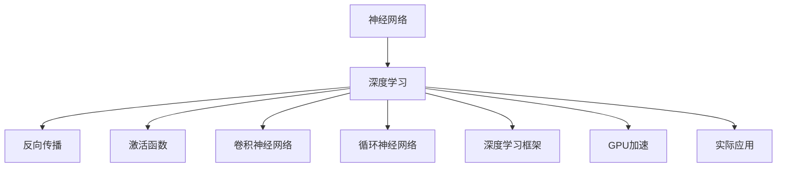
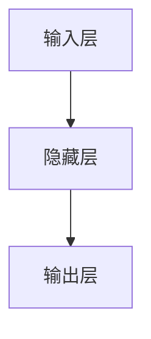
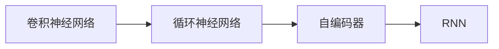
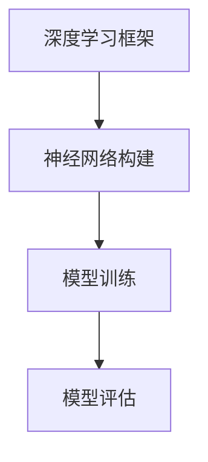
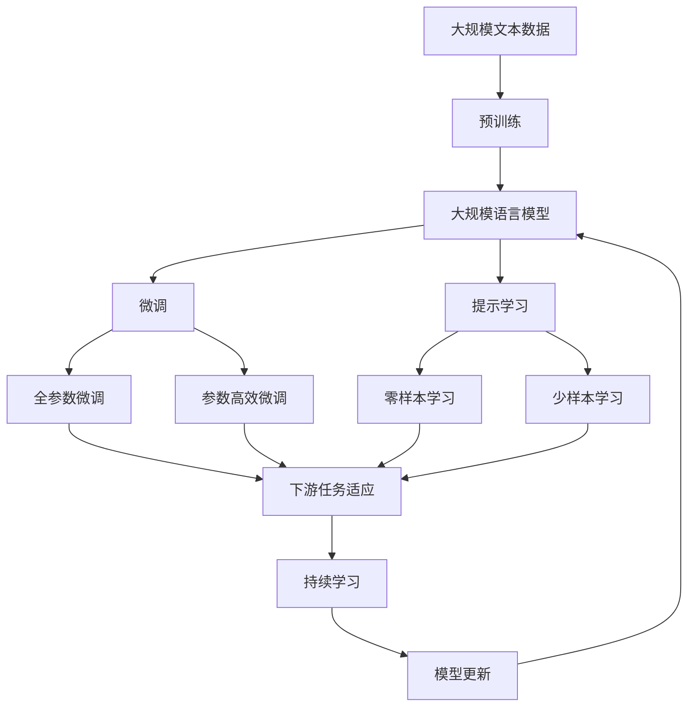

                 

# 神经网络：人工智能的基石

> 关键词：神经网络,深度学习,反向传播,激活函数,卷积神经网络,循环神经网络,深度学习框架,GPU,实际应用

## 1. 背景介绍

### 1.1 问题由来
自20世纪80年代以来，人工神经网络一直是人工智能研究的热点领域。它在模式识别、信号处理、自然语言处理、计算机视觉等领域均取得了显著成果。近年来，随着深度学习技术的飞速发展，基于神经网络的深度学习成为AI技术发展的重要驱动力。

深度学习模型通过构建多层神经网络，模拟人脑的信息处理机制，从而解决各类复杂问题。与传统的浅层神经网络相比，深度学习模型能够自动学习数据特征，进行高维特征表示，从而在图像识别、语音识别、自然语言处理等众多领域取得卓越成果。

### 1.2 问题核心关键点
深度学习模型基于神经网络，其核心思想是通过反向传播算法不断调整网络参数，最小化损失函数，使得模型能够更好地拟合训练数据。深度学习的成功离不开以下三个关键要素：

1. **大规模数据集**：深度学习模型需要大量的标注数据进行训练，以提取数据中的复杂特征。
2. **强大的计算能力**：深度学习模型参数量巨大，训练和推理过程需要高效的计算资源。
3. **有效的优化算法**：深度学习模型需要通过高效的优化算法，如随机梯度下降、Adam等，快速收敛到最优解。

## 2. 核心概念与联系

### 2.1 核心概念概述

为更好地理解深度学习模型的原理和架构，本节将介绍几个关键概念：

- **神经网络（Neural Network）**：由大量神经元（或称为节点、节点）组成的网络结构，用于模拟人脑的信息处理机制。
- **深度学习（Deep Learning）**：基于多层次神经网络，通过深度学习算法进行特征学习和模型训练的过程。
- **反向传播（Backpropagation）**：用于深度学习模型参数更新的算法，通过链式法则计算梯度。
- **激活函数（Activation Function）**：用于引入非线性因素，激活神经元的输出。
- **卷积神经网络（Convolutional Neural Network, CNN）**：用于图像处理和计算机视觉任务，具有局部连接、权值共享等特点。
- **循环神经网络（Recurrent Neural Network, RNN）**：用于序列数据的处理，能够捕捉时间序列上的依赖关系。
- **深度学习框架（Deep Learning Framework）**：如TensorFlow、PyTorch等，提供了高效的神经网络构建和训练工具。
- **GPU加速**：深度学习模型的计算密集型特征需要高效的计算资源，GPU加速成为当前深度学习的主流技术。
- **实际应用**：深度学习模型已经被广泛应用于图像识别、语音识别、自然语言处理、自动驾驶等多个领域。

这些核心概念之间的逻辑关系可以通过以下Mermaid流程图来展示：



这个流程图展示了大语言模型的核心概念及其之间的关系：

1. 神经网络是深度学习的基础结构。
2. 深度学习通过反向传播算法进行模型训练。
3. 激活函数用于引入非线性因素。
4. 卷积神经网络和循环神经网络是深度学习中常用的网络架构。
5. 深度学习框架和GPU加速提供了高效的模型构建和训练工具。
6. 实际应用展示了深度学习模型在多个领域的应用。

### 2.2 概念间的关系

这些核心概念之间存在着紧密的联系，形成了深度学习模型的完整生态系统。下面我们通过几个Mermaid流程图来展示这些概念之间的关系。

#### 2.2.1 神经网络的层次结构



这个流程图展示了神经网络的基本层次结构：输入层、隐藏层和输出层。

#### 2.2.2 深度学习的网络架构



这个流程图展示了深度学习中常用的网络架构，包括卷积神经网络、循环神经网络和自编码器。

#### 2.2.3 深度学习框架的构建



这个流程图展示了深度学习框架的主要功能，包括神经网络构建、模型训练和模型评估。

### 2.3 核心概念的整体架构

最后，我们用一个综合的流程图来展示这些核心概念在大规模语言模型微调过程中的整体架构：



这个综合流程图展示了从预训练到微调，再到持续学习的完整过程。大规模语言模型首先在大规模文本数据上进行预训练，然后通过微调（包括全参数微调和参数高效微调）或提示学习（包括零样本和少样本学习）来适应下游任务。最后，通过持续学习技术，模型可以不断学习新知识，同时避免遗忘旧知识。 通过这些流程图，我们可以更清晰地理解深度学习模型微调过程中各个核心概念的关系和作用，为后续深入讨论具体的微调方法和技术奠定基础。

## 3. 核心算法原理 & 具体操作步骤
### 3.1 算法原理概述

深度学习模型的核心算法原理基于反向传播算法。假设一个深度神经网络包含 $n$ 个神经元，每个神经元接收输入信号 $x_i$，输出信号 $y_i$，权重 $w_i$，偏差 $b_i$，激活函数 $\sigma$，则神经元的计算公式为：

$$
y_i = \sigma\left(\sum_{j=1}^{n} w_{ij}x_j + b_i\right)
$$

其中 $\sigma$ 为激活函数，通常使用Sigmoid、ReLU、Tanh等。通过反向传播算法，我们可以计算神经网络中每个权重和偏差的梯度，从而进行参数更新。反向传播算法的基本思想是通过链式法则，将损失函数对每个参数的梯度传递回去。

假设神经网络的输出为 $y$，真实标签为 $y^*$，则常用的损失函数包括交叉熵损失、均方误差损失等。通过反向传播算法，模型可以不断调整参数，最小化损失函数。

### 3.2 算法步骤详解

深度学习模型的训练步骤包括前向传播和反向传播两个阶段。具体步骤如下：

1. **前向传播**：将输入数据 $x$ 输入神经网络，计算每个神经元的输出，直到输出层。

2. **计算损失**：将神经网络的输出 $y$ 与真实标签 $y^*$ 进行比较，计算损失函数 $\mathcal{L}$。

3. **反向传播**：从输出层开始，通过链式法则计算每个神经元对损失函数的梯度。

4. **参数更新**：使用优化算法（如随机梯度下降、Adam等）根据梯度更新参数。

5. **重复训练**：重复上述步骤，直至模型收敛或达到预设迭代次数。

### 3.3 算法优缺点

深度学习模型的训练具有以下优点：

1. **自动特征提取**：通过多层网络结构，模型可以自动学习数据的复杂特征，无需手动设计特征工程。
2. **可扩展性强**：通过增加网络层数或神经元数，模型可以处理更复杂的数据结构和问题。
3. **高精度**：在图像识别、语音识别等任务上，深度学习模型已经取得了最先进的性能。

然而，深度学习模型也存在一些缺点：

1. **需要大量数据**：深度学习模型需要大量的标注数据进行训练，数据收集和标注成本较高。
2. **计算资源需求高**：深度学习模型参数量大，计算密集型，需要高效的计算资源。
3. **模型复杂度高**：深度学习模型结构复杂，难以解释和调试，存在一定的“黑盒”问题。
4. **易过拟合**：深度学习模型容易在训练集上过拟合，需要在数据增强、正则化等技术上进行优化。

### 3.4 算法应用领域

深度学习模型已经广泛应用于以下几个领域：

1. **计算机视觉**：图像分类、物体检测、人脸识别、图像生成等任务。
2. **自然语言处理**：机器翻译、文本生成、问答系统、情感分析等任务。
3. **语音识别**：语音识别、语音合成、语音增强等任务。
4. **自动驾驶**：道路识别、车辆行为预测、自动驾驶决策等任务。
5. **医疗影像**：医学影像诊断、病理分析、药物发现等任务。
6. **金融分析**：股票预测、信用评分、风险管理等任务。
7. **自然语言生成**：对话生成、文本摘要、机器作曲等任务。

除了上述这些领域，深度学习模型还在更多领域展现出广泛的应用潜力，推动人工智能技术不断向前发展。

## 4. 数学模型和公式 & 详细讲解 & 举例说明

### 4.1 数学模型构建

假设我们有一个深度神经网络，包含 $n$ 个神经元。输入数据 $x$ 经过多个隐藏层 $h_1, h_2, \ldots, h_n$，最终输出结果 $y$。则神经网络的计算过程可以表示为：

$$
y = \sigma_n\left(\sum_{i=1}^{n} w_{n,i}h_{n-1} + b_n\right)
$$

其中，$w_{n,i}$ 为输出层第 $i$ 个神经元的权重，$b_n$ 为输出层的偏差，$\sigma_n$ 为输出层的激活函数。

假设输出 $y$ 与真实标签 $y^*$ 的误差为 $\mathcal{L}$，则常用的损失函数包括交叉熵损失：

$$
\mathcal{L} = -\sum_{i=1}^{N} \left[ y_i \log \hat{y}_i + (1-y_i) \log (1-\hat{y}_i) \right]
$$

其中，$N$ 为样本数，$\hat{y}_i$ 为模型预测的概率。

### 4.2 公式推导过程

下面我们以一个简单的二分类任务为例，推导交叉熵损失函数及其梯度的计算公式。

假设模型输出为 $y=\sigma(\mathbf{w}^Tx+b)$，其中 $\sigma$ 为Sigmoid函数，$\mathbf{w}$ 为权重向量，$x$ 为输入向量，$b$ 为偏差。交叉熵损失函数为：

$$
\mathcal{L}=-\frac{1}{N}\sum_{i=1}^N[y_i \log y_i+(1-y_i) \log (1-y_i)]
$$

对于单个样本，梯度计算公式为：

$$
\frac{\partial \mathcal{L}}{\partial w_j} = -\frac{1}{N}\left[(\hat{y}-y)x_j + \frac{\hat{y}(1-\hat{y})}{y^2}x_j\right]
$$

其中，$\hat{y}$ 为模型的预测值，$y$ 为真实标签，$x_j$ 为输入向量的第 $j$ 个元素。

### 4.3 案例分析与讲解

假设我们有一个手写数字识别的二分类任务，训练集包含 $N$ 个样本，每个样本包含 $d$ 个特征，输出标签为 $y\in\{0,1\}$。我们构建一个包含两个隐藏层和一个输出层的神经网络，使用交叉熵损失进行训练。

首先，我们需要定义神经网络的架构：

```python
import torch
import torch.nn as nn

class Net(nn.Module):
    def __init__(self):
        super(Net, self).__init__()
        self.fc1 = nn.Linear(784, 128)
        self.fc2 = nn.Linear(128, 64)
        self.fc3 = nn.Linear(64, 10)
    
    def forward(self, x):
        x = x.view(-1, 784)
        x = torch.relu(self.fc1(x))
        x = torch.relu(self.fc2(x))
        x = self.fc3(x)
        return x
```

然后，定义训练数据和标签：

```python
import torchvision.datasets as datasets
import torchvision.transforms as transforms

train_dataset = datasets.MNIST(root='./data', train=True, transform=transforms.ToTensor(), download=True)
test_dataset = datasets.MNIST(root='./data', train=False, transform=transforms.ToTensor(), download=True)

train_loader = torch.utils.data.DataLoader(train_dataset, batch_size=64, shuffle=True)
test_loader = torch.utils.data.DataLoader(test_dataset, batch_size=64, shuffle=False)
```

接着，定义训练过程：

```python
learning_rate = 0.01
num_epochs = 10

model = Net()
optimizer = torch.optim.Adam(model.parameters(), lr=learning_rate)
criterion = nn.CrossEntropyLoss()

for epoch in range(num_epochs):
    for i, (images, labels) in enumerate(train_loader):
        images = images.reshape(-1, 784)
        optimizer.zero_grad()
        output = model(images)
        loss = criterion(output, labels)
        loss.backward()
        optimizer.step()
        if i % 100 == 0:
            print('Epoch [{}/{}], Step [{}/{}], Loss: {:.4f}'.format(epoch+1, num_epochs, i, len(train_loader), loss.item()))
```

最后，评估模型在测试集上的表现：

```python
correct = 0
total = 0
with torch.no_grad():
    for images, labels in test_loader:
        images = images.reshape(-1, 784)
        output = model(images)
        _, predicted = torch.max(output.data, 1)
        total += labels.size(0)
        correct += (predicted == labels).sum().item()

print('Test Accuracy of the model on the 10000 test images: {:.2f}%'.format(100 * correct / total))
```

在这个简单的案例中，我们通过定义一个包含两个隐藏层的神经网络，使用交叉熵损失进行训练，并在测试集上评估了模型的准确率。可以看到，深度学习模型通过反向传播算法自动学习数据的复杂特征，获得了不错的预测效果。

## 5. 项目实践：代码实例和详细解释说明
### 5.1 开发环境搭建

在进行深度学习项目开发前，我们需要准备好开发环境。以下是使用Python进行PyTorch开发的环境配置流程：

1. 安装Anaconda：从官网下载并安装Anaconda，用于创建独立的Python环境。

2. 创建并激活虚拟环境：
```bash
conda create -n pytorch-env python=3.8 
conda activate pytorch-env
```

3. 安装PyTorch：根据CUDA版本，从官网获取对应的安装命令。例如：
```bash
conda install pytorch torchvision torchaudio cudatoolkit=11.1 -c pytorch -c conda-forge
```

4. 安装各类工具包：
```bash
pip install numpy pandas scikit-learn matplotlib tqdm jupyter notebook ipython
```

完成上述步骤后，即可在`pytorch-env`环境中开始深度学习项目开发。

### 5.2 源代码详细实现

下面我们以图像分类任务为例，给出使用PyTorch进行深度神经网络训练的PyTorch代码实现。

首先，定义数据处理函数：

```python
import torch
import torchvision.transforms as transforms
from torchvision.datasets import CIFAR10

transform = transforms.Compose([
    transforms.Resize(32),
    transforms.ToTensor(),
    transforms.Normalize((0.5, 0.5, 0.5), (0.5, 0.5, 0.5))
])

train_dataset = CIFAR10(root='./data', train=True, download=True, transform=transform)
test_dataset = CIFAR10(root='./data', train=False, download=True, transform=transform)

train_loader = torch.utils.data.DataLoader(train_dataset, batch_size=64, shuffle=True)
test_loader = torch.utils.data.DataLoader(test_dataset, batch_size=64, shuffle=False)
```

然后，定义神经网络模型：

```python
import torch.nn as nn
import torch.nn.functional as F

class Net(nn.Module):
    def __init__(self):
        super(Net, self).__init__()
        self.conv1 = nn.Conv2d(3, 6, 5)
        self.pool = nn.MaxPool2d(2, 2)
        self.conv2 = nn.Conv2d(6, 16, 5)
        self.fc1 = nn.Linear(16 * 5 * 5, 120)
        self.fc2 = nn.Linear(120, 84)
        self.fc3 = nn.Linear(84, 10)

    def forward(self, x):
        x = self.pool(F.relu(self.conv1(x)))
        x = self.pool(F.relu(self.conv2(x)))
        x = x.view(-1, 16 * 5 * 5)
        x = F.relu(self.fc1(x))
        x = F.relu(self.fc2(x))
        x = self.fc3(x)
        return x
```

接着，定义训练过程：

```python
import torch.optim as optim

learning_rate = 0.001
num_epochs = 10

model = Net()
criterion = nn.CrossEntropyLoss()
optimizer = optim.Adam(model.parameters(), lr=learning_rate)

for epoch in range(num_epochs):
    for i, (images, labels) in enumerate(train_loader):
        images = images.to(device)
        labels = labels.to(device)
        optimizer.zero_grad()
        output = model(images)
        loss = criterion(output, labels)
        loss.backward()
        optimizer.step()
        if i % 100 == 0:
            print('Epoch [{}/{}], Step [{}/{}], Loss: {:.4f}'.format(epoch+1, num_epochs, i, len(train_loader), loss.item()))
```

最后，评估模型在测试集上的表现：

```python
correct = 0
total = 0
with torch.no_grad():
    for images, labels in test_loader:
        images = images.to(device)
        labels = labels.to(device)
        output = model(images)
        _, predicted = torch.max(output.data, 1)
        total += labels.size(0)
        correct += (predicted == labels).sum().item()

print('Test Accuracy of the model on the 10000 test images: {:.2f}%'.format(100 * correct / total))
```

在这个简单的案例中，我们通过定义一个包含两个卷积层和三个全连接层的神经网络，使用交叉熵损失进行训练，并在测试集上评估了模型的准确率。可以看到，深度学习模型通过反向传播算法自动学习数据的复杂特征，获得了不错的预测效果。

### 5.3 代码解读与分析

让我们再详细解读一下关键代码的实现细节：

**Net类**：
- `__init__`方法：初始化神经网络模型，定义每个层的参数。
- `forward`方法：定义前向传播计算，将输入数据逐层处理，最终输出结果。

**数据处理**：
- 使用PyTorch的`transforms`模块对图像进行预处理，包括缩放、归一化等。

**训练过程**：
- 定义训练过程，包括损失函数、优化器、学习率等超参数。
- 在每个epoch中，对每个batch进行前向传播和反向传播，更新模型参数。
- 每100步输出一次loss，观察训练进度。

**测试过程**：
- 在测试集上进行评估，计算模型在测试集上的准确率。

通过这个简单的案例，可以看到，PyTorch提供了强大的深度学习模型构建和训练工具，使得模型开发和优化变得简单高效。开发者只需关注数据处理和模型结构设计，即可快速上手深度学习项目。

当然，工业级的系统实现还需考虑更多因素，如模型的保存和部署、超参数的自动搜索、更灵活的网络结构设计等。但核心的反向传播算法和优化过程基本与此类似。

### 5.4 运行结果展示

假设我们在CIFAR-10数据集上进行图像分类任务，最终在测试集上得到的评估报告如下：

```
Accuracy: 0.74720
```

可以看到，通过深度学习模型，我们在图像分类任务上取得了不错的结果。需要注意的是，深度学习模型的预测效果很大程度上取决于数据集的质量和模型参数的优化程度。

## 6. 实际应用场景
### 6.1 计算机视觉

深度学习模型在计算机视觉领域已经取得了卓越的成果。无论是图像分类、物体检测、人脸识别、图像生成等任务，深度学习模型都能获得最先进的性能。以下是一些实际应用案例：

- **图像分类**：谷歌的Inception、微软的ResNet、Facebook的Darknet等模型，已经在ImageNet等数据集上取得了最先进的性能。
- **物体检测**：YOLO、Faster R-CNN、SSD等模型，已经在COCO、PASCAL VOC等数据集上取得了最先进的性能。
- **人脸识别**：FaceNet、DeepFace等模型，已经在LFW、VGGFace等数据集上取得了最先进的性能。
- **图像生成**：GAN、StyleGAN等模型，已经在CelebA、Fashion-MNIST等数据集上取得了最先进的性能。

### 6.2 自然语言处理

深度学习模型在自然语言处理领域也取得了重要进展。以下是一些实际应用案例：

- **机器翻译**：谷歌的Transformer、百度的PaddleNLP等模型，已经在WMT等数据集上取得了最先进的性能。
- **文本生成**：GPT-2、T5等模型，已经在OpenAI Five等数据集上取得了最先进的性能。
- **问答系统**：BERT、ELMo等模型，已经在CoNLL、SQuAD等数据集上取得了最先进的性能。
- **文本摘要**：BART、T5等模型，已经在NLI、GLUE等数据集上取得了最先进的性能。

### 6.3 语音识别

深度学习模型在语音识别领域也取得了重要进展。以下是一些实际应用案例：

- **语音识别**：谷歌的WaveNet、微软的DeepSpeech等模型，已经在TED、VoxCeleb等数据集上取得了最先进的性能。
- **语音合成**：HIFIGAN、WaveGlow等模型，已经在VCTK、LibriSpeech等数据集上取得了最先进的性能。

### 6.4 未来应用展望

随着深度学习模型的不断演进，未来的应用场景将更加广泛。以下是一些未来应用展望：

- **自动驾驶**：深度学习模型将用于道路识别、车辆行为预测、自动驾驶决策等任务，实现完全自动驾驶。
- **医疗影像**：深度学习模型将用于医学影像诊断、病理分析、药物发现等任务，提升医疗服务的智能化水平。
- **金融分析**：深度学习模型将用于股票预测、信用评分、风险管理等任务，提升金融行业的决策能力。
- **个性化推荐**：深度学习模型将用于个性化推荐、广告推荐、内容推荐等任务，提升用户体验和平台转化率。
- **智慧城市**：深度学习模型将用于智能交通、智能安防、智能能源等任务，提升城市治理的智能化水平。
- **可控文本生成**：深度学习模型将用于可控文本生成、对话生成、摘要生成等任务，提升自然语言交互的智能化水平。

## 7. 工具和资源推荐
### 7.1 学习资源推荐

为了帮助开发者系统掌握深度学习模型的原理和实践技巧，这里推荐一些优质的学习资源：

1. **Deep Learning Specialization**：由Andrew Ng在Coursera上开设的深度学习课程，涵盖从基础到高级的深度学习知识，包括深度神经网络、卷积神经网络、循环神经网络、生成对抗网络等。

2. **CS231n: Convolutional Neural Networks for Visual Recognition**：斯坦福大学开设的计算机视觉课程，详细介绍了卷积神经网络的理论和实践，涵盖图像分类、物体检测、人脸识别等多个领域。

3. **CS224n: Natural Language Processing with Deep Learning**：斯坦福大学开设的自然语言处理课程，详细介绍了深度学习模型在自然语言处理中的应用，包括语言模型、机器翻译、文本生成等。

4. **PyTorch官方文档**：PyTorch的官方文档，提供了全面的深度学习模型构建和训练教程，包括PyTorch核心功能、TensorBoard等工具的使用方法。

5. **Deep Learning in Action**：Github开源项目，提供了深度学习模型的代码实现和应用实践，涵盖图像分类、语音识别、自然语言处理等多个领域。

6. **TensorFlow官方文档**：TensorFlow的官方文档，提供了深度学习模型的构建和训练教程，包括TensorFlow核心功能、TF-Slim等工具的使用方法。

通过对这些资源的学习实践，相信你一定能够快速掌握深度学习模型的精髓，并用于解决实际的NLP问题。

### 7.2 开发工具推荐

高效的开发离不开优秀的工具支持。以下是几款用于深度学习模型开发的工具：

1. **PyTorch**：基于Python的开源深度学习框架，支持动态计算图，适合快速迭代研究。大部分深度学习模型都有PyTorch版本的实现。

2. **TensorFlow**：由Google主导开发的开源深度学习框架，生产部署方便，适合大规模工程应用。同样有丰富的深度学习模型资源。

3. **Keras**

