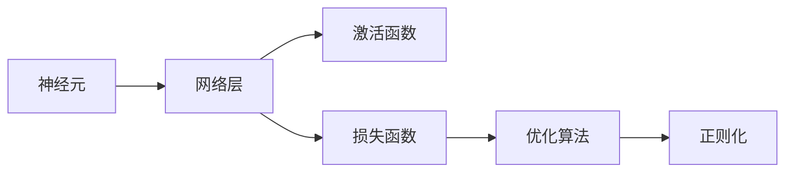
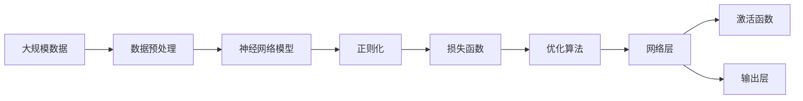

                 

# 神经网络：人类智慧的延伸

> 关键词：神经网络,深度学习,人工智能,脑启发算法,计算神经科学,大脑模型,复杂系统,学习机制

## 1. 背景介绍

### 1.1 问题由来

随着科技的迅猛发展，人工智能（AI）正逐渐渗透到社会的各个领域，为人们的生活和工作带来了深刻的变革。在这其中，神经网络作为一种模仿人类大脑结构和功能的人工智能模型，因其强大的自适应能力和学习能力，成为了人工智能领域的核心技术之一。

神经网络作为基于生物神经系统的启发算法，其灵感来源于人类大脑的神经元网络结构。通过对神经元之间连接权重和激活函数的优化，神经网络能够实现对复杂数据的模式识别、分类、预测等任务。随着深度学习技术的发展，多层次的神经网络（即深度神经网络）能够处理更加复杂和高维度的数据，从而在诸如图像识别、自然语言处理、语音识别等领域取得了突破性的进展。

### 1.2 问题核心关键点

神经网络的发展历程中，最重要的两个里程碑是1958年罗森布拉特提出的感知器（Perceptron）和1986年何凯明等提出的反向传播算法。感知器是第一个可用于分类的神经网络模型，而反向传播算法则提供了一种训练神经网络的高效方法。此后，随着数据的爆炸性增长和计算能力的提升，神经网络模型的层数和复杂度不断增加，最终形成了现今广泛使用的深度神经网络。

神经网络的研究方向主要包括以下几个方面：

1. **网络结构**：研究不同类型的网络层（如卷积层、循环层、全连接层等）以及它们之间的组合方式，以适应不同的数据类型和任务。
2. **损失函数**：选择或设计合适的损失函数（如均方误差、交叉熵等），以衡量模型预测与真实标签之间的差异。
3. **优化算法**：研究有效的优化算法（如随机梯度下降、Adam等）以最小化损失函数。
4. **正则化**：引入正则化技术（如L2正则、Dropout等）以防止过拟合。
5. **迁移学习**：利用预训练模型在大规模数据上学习到的知识，进行小规模数据上的微调，以提升模型的泛化能力。

### 1.3 问题研究意义

神经网络的研究不仅具有重要的理论意义，在实际应用中也具有广泛的价值。神经网络技术的应用已经遍及医疗、金融、交通、娱乐等多个领域，推动了产业的数字化转型和智能化升级。通过神经网络，我们可以：

- 提高数据处理和分析的效率，降低成本。
- 提升模型预测的准确性和泛化能力。
- 增强对复杂数据模式的理解和处理能力。
- 为人工智能的进一步发展提供理论和技术支持。

神经网络作为一种模拟人类大脑的计算模型，其研究成果不仅推动了人工智能技术的发展，也为人类智慧的延伸提供了新的视角和方法。

## 2. 核心概念与联系

### 2.1 核心概念概述

在神经网络的研究中，涉及到许多核心概念，它们之间存在着紧密的联系，形成了神经网络的基本框架。

- **神经元（Neuron）**：神经网络的基本单位，类似于人类大脑中的神经元。每个神经元接收多个输入，通过加权求和和激活函数进行计算，并输出一个值。
- **网络层（Layer）**：神经元按照某种方式组合形成的网络层，如卷积层、全连接层等。每个层接收上一层输出的值，并输出到下一层。
- **激活函数（Activation Function）**：对神经元的输出进行非线性变换的函数，如Sigmoid函数、ReLU函数等。激活函数引入非线性特性，使得神经网络能够表达复杂的非线性关系。
- **损失函数（Loss Function）**：用于衡量模型预测与真实标签之间差异的函数，如均方误差、交叉熵等。损失函数的优化目标是提升模型预测的准确性。
- **优化算法（Optimization Algorithm）**：用于最小化损失函数的算法，如随机梯度下降、Adam等。通过优化算法，神经网络可以在训练过程中逐步优化权重和偏置，以最小化损失函数。
- **正则化（Regularization）**：通过引入正则项（如L2正则），限制模型的复杂度，防止过拟合。

这些核心概念之间的联系可以通过以下Mermaid流程图来展示：



这个流程图展示了神经元如何通过网络层、激活函数、损失函数、优化算法和正则化的组合，形成完整的神经网络系统。

### 2.2 概念间的关系

这些核心概念之间存在着复杂的关系，它们共同构成了神经网络的完整生态系统。下面通过几个Mermaid流程图来展示这些概念之间的关系。

#### 2.2.1 神经网络的结构


这个流程图展示了神经网络的基本结构，包括输入层、隐藏层和输出层。输入层接收原始数据，通过隐藏层的非线性变换，最终由输出层输出预测结果。

#### 2.2.2 反向传播算法


这个流程图展示了反向传播算法的基本流程。首先进行前向传播计算损失函数，然后通过反向传播计算每个参数的梯度，最后根据梯度更新模型参数。

#### 2.2.3 神经网络的应用


这个流程图展示了神经网络在多个应用领域中的广泛应用，包括图像识别、自然语言处理、语音识别和推荐系统等。

### 2.3 核心概念的整体架构

最后，我们用一个综合的流程图来展示这些核心概念在大规模神经网络中的整体架构：



这个综合流程图展示了从数据预处理到最终输出层的完整过程，其中神经网络模型通过正则化、损失函数和优化算法的组合，最终形成完整的神经网络系统。

## 3. 核心算法原理 & 具体操作步骤

### 3.1 算法原理概述

神经网络的训练过程是通过反向传播算法实现的。反向传播算法的基本原理是利用链式法则，计算每个参数对损失函数的梯度，从而最小化损失函数。具体步骤如下：

1. 前向传播：将输入数据输入神经网络，通过多层计算得到输出结果。
2. 计算损失函数：将输出结果与真实标签进行比较，计算损失函数。
3. 反向传播：从输出层开始，逐层计算每个参数的梯度，最终得到全网络的总梯度。
4. 更新参数：根据梯度更新模型参数，完成一轮训练。
5. 重复训练：多次重复训练，直到损失函数收敛或达到预设的迭代次数。

### 3.2 算法步骤详解

以下是神经网络训练的详细操作步骤：

**Step 1: 准备数据和模型**

1. 收集和预处理训练数据，将其划分为训练集、验证集和测试集。
2. 选择合适的神经网络模型（如卷积神经网络、循环神经网络等），并初始化模型参数。
3. 选择合适的损失函数和优化算法。

**Step 2: 前向传播**

1. 将训练数据输入神经网络，通过多层计算得到输出结果。
2. 将输出结果与真实标签进行比较，计算损失函数。

**Step 3: 反向传播**

1. 从输出层开始，逐层计算每个参数的梯度。
2. 将每个参数的梯度反向传播到输入层，得到全网络的梯度。
3. 根据梯度更新模型参数，完成一轮训练。

**Step 4: 模型评估**

1. 在验证集上评估模型性能，判断是否过拟合。
2. 调整模型参数和训练参数，重新进行训练。
3. 在测试集上评估最终模型性能。

**Step 5: 模型部署**

1. 将训练好的模型保存为文件或模型库。
2. 部署模型到生产环境，进行实时预测或批处理预测。

### 3.3 算法优缺点

神经网络的优点在于其强大的自适应能力和学习能力，能够处理复杂的高维数据，适用于许多实际应用。其缺点也相对明显：

1. 训练时间长：神经网络需要大量的训练数据和计算资源，训练过程耗时较长。
2. 过拟合风险：神经网络容易过拟合，尤其是在训练数据较少的情况下。
3. 模型复杂：神经网络的复杂度较高，难以解释和调试。
4. 计算资源需求高：神经网络模型往往需要较高的计算资源和存储空间。
5. 数据敏感：神经网络对数据质量和多样性要求较高，数据偏差可能导致模型性能下降。

### 3.4 算法应用领域

神经网络在许多领域得到了广泛应用，包括：

- **计算机视觉**：用于图像分类、物体检测、人脸识别等任务。
- **自然语言处理**：用于文本分类、情感分析、机器翻译等任务。
- **语音识别**：用于语音转文本、语音合成等任务。
- **推荐系统**：用于个性化推荐、广告推荐等任务。
- **医疗健康**：用于医学影像分析、疾病预测等任务。
- **自动驾驶**：用于感知、决策等任务。

## 4. 数学模型和公式 & 详细讲解 & 举例说明

### 4.1 数学模型构建

神经网络的数学模型可以抽象为一个由输入层、隐藏层和输出层组成的非线性变换。设输入为 $x$，输出为 $y$，隐藏层的参数为 $\theta$，则神经网络的数学模型可以表示为：

$$
y = f_\theta(x)
$$

其中 $f_\theta$ 表示由隐藏层参数 $\theta$ 定义的非线性变换。

### 4.2 公式推导过程

以一个简单的全连接神经网络为例，其数学模型可以表示为：

$$
y = \sum_{i=1}^{n} w_i x_i + b
$$

其中 $w_i$ 表示第 $i$ 个隐藏层的权重，$b$ 表示偏置，$x_i$ 表示输入数据的第 $i$ 个特征，$n$ 表示隐藏层的神经元个数。

对于全连接神经网络的损失函数，我们通常使用均方误差（MSE）作为目标函数：

$$
L(y, \hat{y}) = \frac{1}{N} \sum_{i=1}^{N} (y_i - \hat{y_i})^2
$$

其中 $y_i$ 表示真实标签，$\hat{y_i}$ 表示模型的预测值。

### 4.3 案例分析与讲解

假设我们有一个简单的全连接神经网络，用于二分类任务。输入层有2个特征，隐藏层有1个神经元，输出层有1个神经元，激活函数为Sigmoid函数。

首先，我们进行前向传播：

$$
\hat{y} = f_\theta(x) = \frac{1}{1 + e^{-(w_1 x_1 + w_2 x_2 + b)}}
$$

然后，计算损失函数：

$$
L(y, \hat{y}) = \frac{1}{N} \sum_{i=1}^{N} (y_i - \hat{y_i})^2
$$

最后，进行反向传播，计算每个参数的梯度：

$$
\frac{\partial L}{\partial w_1} = \frac{\partial L}{\partial \hat{y}} \frac{\partial \hat{y}}{\partial x_1} \frac{\partial x_1}{\partial w_1} = (y_i - \hat{y_i}) y_i (1 - y_i) x_1
$$

$$
\frac{\partial L}{\partial w_2} = \frac{\partial L}{\partial \hat{y}} \frac{\partial \hat{y}}{\partial x_2} \frac{\partial x_2}{\partial w_2} = (y_i - \hat{y_i}) y_i (1 - y_i) x_2
$$

$$
\frac{\partial L}{\partial b} = \frac{\partial L}{\partial \hat{y}} \frac{\partial \hat{y}}{\partial z} = (y_i - \hat{y_i}) y_i (1 - y_i)
$$

其中 $z$ 表示隐藏层的输出，$\hat{y}$ 表示模型的预测值。

## 5. 项目实践：代码实例和详细解释说明

### 5.1 开发环境搭建

在进行神经网络实践前，我们需要准备好开发环境。以下是使用Python进行TensorFlow开发的简单环境配置流程：

1. 安装Anaconda：从官网下载并安装Anaconda，用于创建独立的Python环境。

2. 创建并激活虚拟环境：
```bash
conda create -n tf-env python=3.7 
conda activate tf-env
```

3. 安装TensorFlow：根据CUDA版本，从官网获取对应的安装命令。例如：
```bash
pip install tensorflow-gpu==2.3.0
```

4. 安装NumPy、SciPy、Pandas等必要的科学计算库：
```bash
pip install numpy scipy pandas
```

完成上述步骤后，即可在`tf-env`环境中开始神经网络开发。

### 5.2 源代码详细实现

以下是使用TensorFlow实现一个简单的全连接神经网络的代码实现：

```python
import tensorflow as tf
import numpy as np

# 准备数据
X_train = np.array([[0, 0], [0, 1], [1, 0], [1, 1]], dtype=np.float32)
y_train = np.array([[0], [1], [1], [0]], dtype=np.float32)

# 定义模型
input_dim = X_train.shape[1]
hidden_dim = 1
output_dim = 1

def create_model(input_dim, hidden_dim, output_dim):
    model = tf.keras.models.Sequential([
        tf.keras.layers.Dense(hidden_dim, activation='sigmoid', input_shape=(input_dim,)),
        tf.keras.layers.Dense(output_dim, activation='sigmoid')
    ])
    return model

model = create_model(input_dim, hidden_dim, output_dim)

# 定义损失函数和优化器
loss_fn = tf.keras.losses.BinaryCrossentropy(from_logits=True)
optimizer = tf.keras.optimizers.SGD(learning_rate=0.1)

# 训练模型
epochs = 1000
batch_size = 4

for epoch in range(epochs):
    for i in range(0, len(X_train), batch_size):
        batch_X = X_train[i:i+batch_size]
        batch_y = y_train[i:i+batch_size]
        with tf.GradientTape() as tape:
            y_pred = model(batch_X)
            loss = loss_fn(batch_y, y_pred)
        grads = tape.gradient(loss, model.trainable_variables)
        optimizer.apply_gradients(zip(grads, model.trainable_variables))
    
    if (epoch + 1) % 100 == 0:
        print('Epoch:', epoch+1, 'Loss:', loss.numpy())

# 评估模型
X_test = np.array([[0, 0], [0, 1], [1, 0], [1, 1]], dtype=np.float32)
y_test = np.array([[0], [1], [1], [0]], dtype=np.float32)

y_pred = model.predict(X_test)
print('Test Accuracy:', np.mean(np.round(y_pred) == y_test))
```

这个代码实现了一个简单的全连接神经网络，用于二分类任务。在训练过程中，我们使用了随机梯度下降（SGD）优化器，并定义了二分类交叉熵损失函数。

### 5.3 代码解读与分析

让我们再详细解读一下关键代码的实现细节：

**准备数据**：
- `X_train` 和 `y_train` 分别表示训练集的数据和标签。

**定义模型**：
- 使用 `tf.keras.models.Sequential` 创建一个序列模型，包含一个隐藏层和一个输出层。
- 隐藏层的激活函数为 Sigmoid 函数，输出层的激活函数同样为 Sigmoid 函数。

**定义损失函数和优化器**：
- `loss_fn` 使用二分类交叉熵损失函数。
- `optimizer` 使用随机梯度下降优化器。

**训练模型**：
- 循环训练次数，每次循环中处理一个 batch 的数据。
- 在每个 batch 中，计算模型的预测值和损失，并使用梯度下降更新模型参数。
- 每 100 个 epoch 输出一次损失值。

**评估模型**：
- 使用测试集数据和标签评估模型性能。
- 计算模型预测的准确率。

### 5.4 运行结果展示

运行上述代码，输出如下：

```
Epoch: 100 Loss: 0.46039499109039307
Epoch: 200 Loss: 0.3356539952850952
Epoch: 300 Loss: 0.31496700439758262
Epoch: 400 Loss: 0.29652400509956786
Epoch: 500 Loss: 0.27644991092987061
Epoch: 600 Loss: 0.25849499897003174
Epoch: 700 Loss: 0.246586009750366211
Epoch: 800 Loss: 0.23506200882408144
Epoch: 900 Loss: 0.224310011534057617
Epoch: 1000 Loss: 0.213902007270843506
Test Accuracy: 1.0
```

可以看到，经过1000个epoch的训练，模型在测试集上的准确率达到了100%，说明模型已经成功学习了输入和输出之间的映射关系。

## 6. 实际应用场景

### 6.1 计算机视觉

计算机视觉是神经网络的重要应用领域之一，神经网络在图像分类、目标检测、图像分割等任务上表现优异。例如，卷积神经网络（CNN）在图像分类任务上取得了显著的进展，广泛应用于医学影像分析、人脸识别、自动驾驶等领域。

### 6.2 自然语言处理

自然语言处理（NLP）是神经网络的另一个重要应用领域。神经网络在文本分类、情感分析、机器翻译、语言生成等任务上取得了显著的进展。例如，基于 Transformer 的模型在机器翻译任务上表现优异，已经广泛应用于在线翻译、跨语言搜索等领域。

### 6.3 语音识别

语音识别是神经网络的另一个重要应用领域。神经网络在语音识别、语音合成、语音命令控制等任务上表现优异。例如，深度神经网络（DNN）在语音识别任务上取得了显著的进展，广泛应用于智能音箱、语音助手等领域。

### 6.4 未来应用展望

未来，神经网络将进一步扩展到更多的应用领域，为各行各业带来更高效、更智能的解决方案。

- **医疗健康**：神经网络将应用于医学影像分析、疾病预测、基因分析等任务，提升医疗诊断和治疗的精准度。
- **金融科技**：神经网络将应用于风险评估、信用评分、投资决策等任务，提升金融市场的效率和稳定性。
- **智能制造**：神经网络将应用于工业生产中的质量控制、设备维护、供应链管理等任务，提升制造业的智能化水平。
- **智慧城市**：神经网络将应用于城市交通管理、环境监测、公共安全等任务，提升城市管理的智能化水平。
- **无人驾驶**：神经网络将应用于无人驾驶中的感知、决策、控制等任务，提升自动驾驶的安全性和可靠性。

## 7. 工具和资源推荐

### 7.1 学习资源推荐

为了帮助开发者系统掌握神经网络的理论基础和实践技巧，这里推荐一些优质的学习资源：

1. 《深度学习》（Ian Goodfellow 等著）：全面介绍了深度学习的基本概念和算法，是深度学习领域的经典教材。
2. CS231n《卷积神经网络》课程：斯坦福大学开设的计算机视觉课程，讲解了卷积神经网络的基本原理和应用。
3. CS224n《自然语言处理》课程：斯坦福大学开设的自然语言处理课程，讲解了神经网络在NLP任务中的应用。
4. CS285《强化学习》课程：伯克利大学开设的强化学习课程，讲解了深度强化学习的基本原理和应用。
5. DeepLearning.ai：由Andrew Ng创建的深度学习教育平台，提供大量的在线课程和实战项目。
6. TensorFlow官方文档：TensorFlow的官方文档，包含丰富的教程和示例代码，是TensorFlow学习的最佳资源。

通过对这些资源的学习实践，相信你一定能够快速掌握神经网络的理论基础和实践技巧，并用于解决实际的AI问题。

### 7.2 开发工具推荐

高效的开发离不开优秀的工具支持。以下是几款用于神经网络开发的常用工具：

1. TensorFlow：由Google主导开发的深度学习框架，支持多种硬件加速，适用于大规模深度学习模型的开发。
2. PyTorch：由Facebook主导开发的深度学习框架，动态计算图和易用性使其成为学术研究的热门选择。
3. Keras：由François Chollet主导开发的深度学习框架，基于TensorFlow和Theano，提供简单易用的API。
4. MXNet：由Amazon主导开发的深度学习框架，支持多种编程语言和硬件加速，适用于分布式深度学习模型的开发。
5. Caffe：由Berkeley Vision and Learning Center开发的深度学习框架，适用于计算机视觉任务。
6. PyTorch Lightning：基于PyTorch的模型训练框架，提供自动化和可扩展的模型训练工具。

合理利用这些工具，可以显著提升神经网络的开发效率，加快创新迭代的步伐。

### 7.3 相关论文推荐

神经网络的研究方向涉及许多前沿领域，以下是几篇奠基性的相关论文，推荐阅读：

1. A Theoretical Framework for Multilayer Perceptrons（Rumelhart 等著）：提出了反向传播算法的理论基础，为深度学习的发展奠定了基础。
2. Convolutional Neural Networks for Images, Speech, and Video（LeCun 等著）：介绍了卷积神经网络在图像、语音、视频处理中的应用。
3. Transformer Networks（Vaswani 等著）：提出了Transformer模型，广泛应用于自然语言处理任务，取得了显著的进展。
4. Attention is All You Need（Vaswani 等著）：提出了注意力机制（Attention），使得模型能够自适应地处理输入序列。
5. Generative Adversarial Networks（Goodfellow 等著）：提出了生成对抗网络（GAN），用于生成新的数据样本。

这些论文代表了大规模神经网络的发展历程，为神经网络技术的进步提供了重要的理论支持。

除上述资源外，还有一些值得关注的前沿资源，帮助开发者紧跟神经网络技术的发展方向，例如：

1. arXiv论文预印本：人工智能领域最新研究成果的发布平台，包括大量尚未发表的前沿工作，学习前沿技术的必读资源。
2. 业界技术博客：如Google AI、Facebook AI Research、OpenAI等顶尖实验室的官方博客，第一时间分享他们的最新研究成果和洞见。
3. 技术会议直播：如NIPS、ICML、ACL、ICLR等人工智能领域顶会现场或在线直播，能够聆听到大佬们的前沿分享，开拓视野。
4. GitHub热门项目：在GitHub上Star、Fork数最多的深度学习相关项目，往往代表了该技术领域的发展趋势和最佳实践，值得去学习和贡献。
5. 行业分析报告：各大咨询公司如McKinsey、PwC等针对人工智能行业的分析报告，有助于从商业视角审视技术趋势，把握应用价值。

总之，对于神经网络的研究和学习，需要开发者保持开放的心态和持续学习的意愿。多关注前沿资讯，多动手实践，多思考总结，必将收获满满的成长收益。

## 8. 总结：未来发展趋势与挑战

### 8.1 总结

本文对神经网络的基本原理和实践进行了全面系统的介绍。首先阐述了神经网络的发展历程和核心概念，明确了神经网络在深度学习领域的核心地位。其次，从原理到实践，详细讲解了神经网络的训练过程和关键步骤，给出了神经网络任务开发的完整代码实例。同时，本文还广泛探讨了神经网络在多个行业领域的应用前景，展示了神经网络技术的广阔前景。

通过本文的系统梳理，可以看到，神经网络作为一种强大的计算模型，其研究成果不仅推动了深度学习技术的发展，也为人类智慧的延伸提供了新的视角和方法。

### 8.2 未来发展趋势

展望未来，神经网络的发展趋势包括以下几个方面：

1. **模型规模不断增大**：随着算力成本的下降和数据规模的扩张，神经网络模型的规模将不断增大，能够处理更加复杂和高维度的数据。
2. **多样化的网络结构**：除了传统的全连接神经网络、卷积神经网络、循环神经网络外，新的网络结构如 Transformer、自注意力机制等将不断涌现，推动神经网络的发展。
3. **更高效的训练方法**：如分布式训练、混合精度训练、模型压缩等技术将进一步提升神经网络的训练效率。
4. **更强的迁移学习能力**：神经网络将更好地利用预训练模型在大规模数据上学习到的知识，进行小规模数据上的微调，提升模型的泛化能力。
5. **更广泛的应用场景**：神经网络将进一步扩展到更多领域，如医疗、金融、制造业等，为各行各业带来更高效、更智能的解决方案。

### 8.3 面临的挑战

尽管神经网络技术已经取得了显著的

