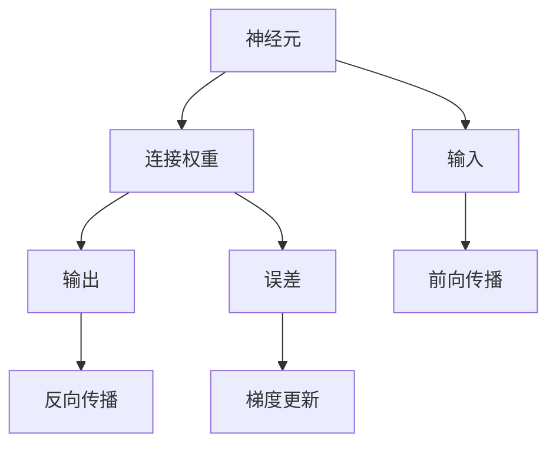
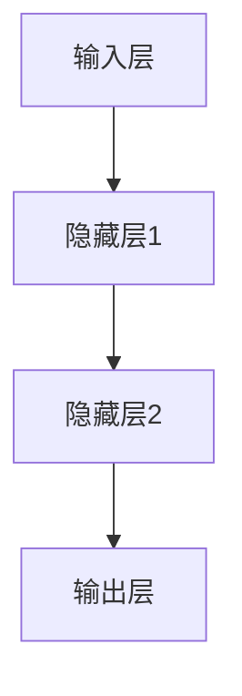

                 

# 神经网络：人类智慧的解放

> 关键词：神经网络，深度学习，AI，计算能力，智慧解放，科学研究，创新

## 1. 背景介绍

### 1.1 问题由来

随着科技的迅速发展，人类对于AI技术的探索和研究也在不断深入。人工智能已经成为全球科技发展的核心驱动力之一，在各个领域中展现出强大的潜力。尤其是在深度学习领域，神经网络作为其中的核心算法，已经成为推动人工智能向前发展的重要工具。

在过去几十年中，神经网络已经实现了从简单的感知器到复杂的深度学习模型的飞跃，并在图像识别、语音识别、自然语言处理等众多领域中取得了巨大成功。然而，神经网络的强大计算能力与人类智慧的联系，一直是科技界和哲学界共同关注的话题。

### 1.2 问题核心关键点

神经网络是一种模拟人类大脑神经元结构和功能的计算模型，通过学习大量数据，能够自动提取数据中的特征并进行分类、预测等任务。深度学习神经网络通常包含多个层次，每个层次都有不同的功能，通过多层次的特征提取和组合，最终完成复杂的任务。

神经网络的核心在于如何训练模型，使其能够准确地从数据中学习到特征，并应用于各种实际问题。常见的训练方法包括反向传播算法、随机梯度下降等。深度学习模型的训练需要大量的计算资源和时间，因此如何优化训练过程，提高模型性能，是当前研究的热点问题。

### 1.3 问题研究意义

研究神经网络及其在深度学习中的应用，对于推动人类智慧的解放具有重要意义。神经网络能够模拟人类大脑的工作原理，将复杂的任务分解为多个层次的特征提取和处理，从而提高计算效率和准确性。在医疗、金融、教育等领域中，神经网络已经展现出强大的应用潜力，为人类社会的进步提供了新的动力。

此外，神经网络的应用还将推动科学研究和技术创新的发展。通过模拟人类大脑的神经网络，科学家们可以更深入地理解人类大脑的工作机制，进而推动神经科学的进步。

## 2. 核心概念与联系

### 2.1 核心概念概述

神经网络是一种基于模拟生物神经系统的计算模型，由大量神经元相互连接构成。每个神经元接收输入，计算并输出结果，并与其他神经元相连，形成一个复杂的网络结构。

神经网络的训练过程通常包括前向传播和反向传播两个阶段。前向传播是指将输入数据输入神经网络，经过一系列的计算和处理，最终得到输出结果。反向传播是指根据输出结果和真实标签，计算出模型在每个神经元上的误差，并通过反向传播算法更新神经元的权重，以减小误差。

### 2.2 核心概念间的关系

神经网络的各个核心概念之间存在着紧密的联系，形成了完整的计算模型。以下是神经网络的各个核心概念及其之间的关系：



这个图表展示了神经网络的基本工作流程。输入数据通过神经元的前向传播计算输出结果，然后根据输出结果和真实标签计算误差，并通过反向传播更新神经元权重，以减小误差。

### 2.3 核心概念的整体架构

神经网络的整体架构可以分为输入层、隐藏层和输出层三个部分。输入层接收原始数据，隐藏层进行特征提取和处理，输出层输出最终结果。

以下是一个简单的神经网络架构图：



这个图表展示了最简单的神经网络架构。输入层接收输入数据，隐藏层1和隐藏层2进行特征提取和处理，最终通过输出层输出结果。

## 3. 核心算法原理 & 具体操作步骤
### 3.1 算法原理概述

神经网络的训练过程通常采用反向传播算法（Backpropagation），该算法通过前向传播和反向传播两个过程，不断更新神经元权重，以减小模型误差。以下是反向传播算法的具体步骤：

1. 前向传播：将输入数据输入神经网络，计算出每个神经元的输出结果。
2. 计算误差：根据输出结果和真实标签，计算出模型在每个神经元上的误差。
3. 反向传播：根据误差，通过反向传播算法计算出每个神经元的梯度，并更新神经元权重。
4. 重复训练：重复以上步骤，直到误差收敛或达到预设轮数。

### 3.2 算法步骤详解

以下是神经网络训练过程的具体步骤：

1. 数据预处理：将原始数据进行归一化、标准化等处理，以提高模型的训练效果。
2. 模型初始化：将神经元权重随机初始化，设置学习率和批大小等参数。
3. 前向传播：将输入数据输入神经网络，计算出每个神经元的输出结果。
4. 计算误差：根据输出结果和真实标签，计算出模型在每个神经元上的误差。
5. 反向传播：根据误差，计算每个神经元的梯度，并更新神经元权重。
6. 重复训练：重复以上步骤，直到误差收敛或达到预设轮数。
7. 评估模型：在测试集上评估模型性能，选择最优模型进行应用。

### 3.3 算法优缺点

神经网络在深度学习中的应用具有以下优点：

1. 高精度：通过多层次的特征提取和组合，神经网络可以处理复杂的数据结构，并实现高精度的分类和预测。
2. 可解释性：通过可视化神经元之间的连接和权重，可以直观地理解神经网络的工作原理。
3. 适用性强：神经网络可以应用于各种领域，如计算机视觉、自然语言处理、医疗等。

同时，神经网络也存在以下缺点：

1. 计算资源需求高：神经网络的训练需要大量的计算资源和时间，对硬件设备要求较高。
2. 过拟合风险：神经网络容易出现过拟合，需要采取正则化等方法进行缓解。
3. 可解释性不足：神经网络通常被视为"黑盒"模型，难以解释其内部工作机制。

### 3.4 算法应用领域

神经网络在深度学习中的应用已经覆盖了众多领域，以下是一些主要应用领域：

1. 计算机视觉：神经网络可以用于图像识别、物体检测、人脸识别等任务。
2. 自然语言处理：神经网络可以用于文本分类、机器翻译、问答系统等任务。
3. 语音识别：神经网络可以用于语音识别、语音合成等任务。
4. 医疗诊断：神经网络可以用于医学图像分析、疾病预测等任务。
5. 金融分析：神经网络可以用于股票预测、信用评估等任务。

## 4. 数学模型和公式 & 详细讲解

### 4.1 数学模型构建

神经网络可以通过数学模型来描述其计算过程。以下是神经网络的基本数学模型：

1. 输入层：将输入数据 $x$ 输入神经网络，记为 $x_i$。
2. 隐藏层：通过神经元的计算，将输入数据转化为特征向量 $h$。
3. 输出层：将特征向量输入到输出层，输出最终结果 $y$。

神经网络的计算过程可以用以下公式表示：

$$
y = f(h)
$$

其中 $f$ 表示激活函数，通常使用 sigmoid、ReLU 等函数。

### 4.2 公式推导过程

以下是神经网络中常用的激活函数sigmoid的推导过程：

1. 定义 sigmoid 函数：

$$
\sigma(z) = \frac{1}{1 + e^{-z}}
$$

其中 $z$ 表示神经元的输入。
2. 计算 sigmoid 函数的导数：

$$
\frac{\partial \sigma(z)}{\partial z} = \sigma(z)(1-\sigma(z))
$$

3. 将导数代入反向传播算法，更新神经元权重：

$$
\frac{\partial L}{\partial w} = \frac{\partial L}{\partial y}\frac{\partial y}{\partial h}\frac{\partial h}{\partial w}
$$

其中 $L$ 表示损失函数，$w$ 表示神经元权重。

### 4.3 案例分析与讲解

以下是一个简单的神经网络模型，用于手写数字识别：

```python
import numpy as np
from tensorflow.keras.datasets import mnist
from tensorflow.keras.models import Sequential
from tensorflow.keras.layers import Dense, Dropout
from tensorflow.keras.optimizers import Adam

# 加载 MNIST 数据集
(x_train, y_train), (x_test, y_test) = mnist.load_data()

# 数据预处理
x_train = x_train.reshape(-1, 28*28) / 255.0
x_test = x_test.reshape(-1, 28*28) / 255.0

# 定义模型
model = Sequential()
model.add(Dense(256, input_shape=(28*28,), activation='relu'))
model.add(Dropout(0.2))
model.add(Dense(10, activation='softmax'))

# 编译模型
model.compile(optimizer=Adam(learning_rate=0.001), loss='sparse_categorical_crossentropy', metrics=['accuracy'])

# 训练模型
model.fit(x_train, y_train, epochs=10, batch_size=32, validation_data=(x_test, y_test))

# 评估模型
model.evaluate(x_test, y_test)
```

这个代码展示了使用 TensorFlow 实现神经网络的简单过程。首先加载 MNIST 数据集，然后对数据进行预处理。定义了一个包含两个隐藏层的神经网络模型，使用 ReLU 和 dropout 进行激活和正则化。最后编译模型，并使用训练集进行训练。在测试集上进行评估，输出模型的性能指标。

## 5. 项目实践：代码实例和详细解释说明

### 5.1 开发环境搭建

在神经网络的开发过程中，需要使用一些常用的开发工具和库。以下是一些常用的工具和库：

1. TensorFlow：由 Google 开发的深度学习框架，支持多种神经网络模型和算法。
2. Keras：基于 TensorFlow 的高级神经网络库，提供了简单易用的接口，适合初学者和快速开发。
3. PyTorch：由 Facebook 开发的深度学习框架，具有动态计算图和灵活的接口设计，适合研究和实验。
4. Theano：由蒙特利尔大学开发的深度学习框架，具有高效的计算图优化，适合 CPU 和 GPU 的并行计算。
5. Caffe：由 Berkeley 大学开发的深度学习框架，适合图像识别和计算机视觉任务。

### 5.2 源代码详细实现

以下是使用 Keras 实现手写数字识别的完整代码：

```python
import numpy as np
from tensorflow.keras.datasets import mnist
from tensorflow.keras.models import Sequential
from tensorflow.keras.layers import Dense, Dropout
from tensorflow.keras.optimizers import Adam

# 加载 MNIST 数据集
(x_train, y_train), (x_test, y_test) = mnist.load_data()

# 数据预处理
x_train = x_train.reshape(-1, 28*28) / 255.0
x_test = x_test.reshape(-1, 28*28) / 255.0

# 定义模型
model = Sequential()
model.add(Dense(256, input_shape=(28*28,), activation='relu'))
model.add(Dropout(0.2))
model.add(Dense(10, activation='softmax'))

# 编译模型
model.compile(optimizer=Adam(learning_rate=0.001), loss='sparse_categorical_crossentropy', metrics=['accuracy'])

# 训练模型
model.fit(x_train, y_train, epochs=10, batch_size=32, validation_data=(x_test, y_test))

# 评估模型
model.evaluate(x_test, y_test)
```

### 5.3 代码解读与分析

以下是代码中每个部分的详细解读：

1. 数据预处理：将 MNIST 数据集中的图像数据进行归一化处理，将像素值缩放到 [0,1] 之间。
2. 定义模型：使用 Sequential 类定义一个包含两个隐藏层的神经网络模型，使用 ReLU 和 dropout 进行激活和正则化。
3. 编译模型：使用 Adam 优化器和 sparse_categorical_crossentropy 损失函数进行模型编译。
4. 训练模型：使用训练集进行模型训练，设置训练轮数为 10，批大小为 32，并在测试集上进行验证。
5. 评估模型：使用测试集评估模型的性能指标，输出准确率和损失函数。

## 6. 实际应用场景

### 6.1 医疗诊断

神经网络在医疗诊断中的应用非常广泛。通过训练神经网络模型，可以对医学图像、基因序列等数据进行分析，帮助医生进行疾病预测和诊断。例如，可以使用卷积神经网络（CNN）进行医学图像分析，对 CT 扫描、MRI 图像等进行分类和分割，帮助医生快速准确地诊断疾病。

### 6.2 金融分析

神经网络在金融分析中的应用也非常广泛。通过训练神经网络模型，可以对股票价格、信用评分等金融数据进行分析，帮助投资者进行决策和预测。例如，可以使用循环神经网络（RNN）进行股票价格预测，使用长短期记忆网络（LSTM）进行信用评分预测。

### 6.3 自然语言处理

神经网络在自然语言处理中的应用也非常广泛。通过训练神经网络模型，可以对文本数据进行分类、情感分析、机器翻译等任务。例如，可以使用序列到序列模型进行机器翻译，使用注意力机制进行文本分类和情感分析。

## 7. 工具和资源推荐

### 7.1 学习资源推荐

为了帮助开发者系统掌握神经网络及其在深度学习中的应用，这里推荐一些优质的学习资源：

1. 《深度学习》系列书籍：由 Ian Goodfellow、Yoshua Bengio、Aaron Courville 编写的经典教材，全面介绍了深度学习的基本概念和前沿技术。
2. 《Python深度学习》书籍：由 François Chollet 编写的深度学习入门教材，详细介绍了 Keras 和 TensorFlow 的使用方法。
3. 《神经网络与深度学习》课程：由 Andrew Ng 在 Coursera 上开设的深度学习课程，涵盖了神经网络的基础知识和应用。
4. DeepLearning.AI 课程：由 Andrew Ng 和李飞飞共同开设的深度学习课程，适合深度学习的初学者和进阶者。
5. Google AI 博客：由 Google AI 团队维护的技术博客，涵盖深度学习、神经网络等领域的最新进展。

通过对这些资源的学习实践，相信你一定能够快速掌握神经网络及其在深度学习中的应用。

### 7.2 开发工具推荐

高效的开发离不开优秀的工具支持。以下是几款用于神经网络开发的常用工具：

1. TensorFlow：由 Google 开发的深度学习框架，支持多种神经网络模型和算法。
2. Keras：基于 TensorFlow 的高级神经网络库，提供了简单易用的接口，适合初学者和快速开发。
3. PyTorch：由 Facebook 开发的深度学习框架，具有动态计算图和灵活的接口设计，适合研究和实验。
4. Theano：由蒙特利尔大学开发的深度学习框架，具有高效的计算图优化，适合 CPU 和 GPU 的并行计算。
5. Caffe：由 Berkeley 大学开发的深度学习框架，适合图像识别和计算机视觉任务。

合理利用这些工具，可以显著提升神经网络的开发效率，加快创新迭代的步伐。

### 7.3 相关论文推荐

神经网络及其在深度学习中的应用是当前人工智能领域的研究热点。以下是几篇奠基性的相关论文，推荐阅读：

1. LeNet-5：Yann LeCun 等人在 1998 年发表的卷积神经网络模型，开创了计算机视觉领域的新纪元。
2. AlexNet：Alex Krizhevsky 等人在 2012 年发表的卷积神经网络模型，首次在大规模图像分类任务上取得了突破。
3. ResNet：Kaiming He 等人在 2016 年发表的残差网络模型，解决了深度神经网络训练过程中的梯度消失问题。
4. Transformer：Ashish Vaswani 等人在 2017 年发表的注意力机制模型，显著提升了自然语言处理任务的性能。
5. GAN：Ian Goodfellow 等人在 2014 年发表的生成对抗网络模型，实现了高质量的图像生成和图像修复。

这些论文代表了大神经网络在深度学习中的应用和发展脉络。通过学习这些前沿成果，可以帮助研究者把握学科前进方向，激发更多的创新灵感。

## 8. 总结：未来发展趋势与挑战

### 8.1 研究成果总结

神经网络及其在深度学习中的应用已经取得了巨大成功，并在众多领域中展现出强大的潜力。以下是神经网络研究的一些主要成果：

1. 卷积神经网络（CNN）：广泛应用于计算机视觉领域，可以处理图像分类、物体检测、人脸识别等任务。
2. 循环神经网络（RNN）：广泛应用于自然语言处理领域，可以处理文本分类、情感分析、机器翻译等任务。
3. 生成对抗网络（GAN）：应用于图像生成、图像修复、图像风格转换等领域，取得了显著效果。
4. 注意力机制：广泛应用于自然语言处理领域，提升了模型的准确性和泛化能力。
5. 强化学习：应用于机器人控制、自动驾驶、游戏等领域，展示了深度学习在决策和优化方面的潜力。

### 8.2 未来发展趋势

展望未来，神经网络及其在深度学习中的应用将呈现以下几个发展趋势：

1. 模型规模持续增大：随着算力成本的下降和数据规模的扩张，神经网络的参数量还将持续增长。超大规模神经网络蕴含的丰富特征，有望支撑更加复杂多变的任务。
2. 参数高效微调：开发更加参数高效的神经网络模型，在固定大部分权重的情况下，只更新少量参数，以提高微调效率和模型泛化能力。
3. 跨模态融合：将视觉、语音、文本等多种模态的数据进行融合，实现多模态神经网络模型，提升模型的感知和理解能力。
4. 联邦学习：通过分布式训练和参数共享，实现跨设备和跨机构的学习，提升模型在隐私保护和数据安全方面的能力。
5. 可解释性：研究可解释性神经网络，提升模型的透明性和可理解性，减少"黑盒"模型的风险。

### 8.3 面临的挑战

尽管神经网络及其在深度学习中的应用已经取得了巨大成功，但在迈向更加智能化、普适化应用的过程中，仍然面临一些挑战：

1. 计算资源需求高：神经网络的训练和推理需要大量的计算资源和时间，对硬件设备要求较高。
2. 可解释性不足：神经网络通常被视为"黑盒"模型，难以解释其内部工作机制。
3. 过拟合风险：神经网络容易出现过拟合，需要采取正则化等方法进行缓解。
4. 数据安全风险：神经网络在处理敏感数据时，需要考虑隐私保护和数据安全问题。

### 8.4 研究展望

面对神经网络及其在深度学习中面临的挑战，未来的研究需要在以下几个方面寻求新的突破：

1. 探索可解释性神经网络：研究可解释性神经网络，提升模型的透明性和可理解性，减少"黑盒"模型的风险。
2. 开发联邦学习框架：通过分布式训练和参数共享，实现跨设备和跨机构的学习，提升模型在隐私保护和数据安全方面的能力。
3. 研究跨模态融合技术：将视觉、语音、文本等多种模态的数据进行融合，实现多模态神经网络模型，提升模型的感知和理解能力。
4. 研究参数高效微调方法：开发更加参数高效的神经网络模型，在固定大部分权重的情况下，只更新少量参数，以提高微调效率和模型泛化能力。
5. 研究联邦学习算法：研究联邦学习算法，解决分布式训练中的数据异构、网络延迟等问题，提升模型在分布式环境中的性能和可靠性。

## 9. 附录：常见问题与解答

**Q1：神经网络为何能够模拟人类大脑的工作原理？**

A: 神经网络通过模拟人类大脑的神经元结构和功能，实现了类似于人类大脑的信息处理和决策过程。神经元之间的连接和权重，可以通过反向传播算法进行学习和更新，从而实现对复杂任务的分类和预测。

**Q2：如何避免神经网络过拟合？**

A: 神经网络容易出现过拟合，需要采取以下方法进行缓解：
1. 数据增强：通过旋转、裁剪、翻转等方式扩充训练集。
2. 正则化：使用 L2 正则、Dropout、Early Stopping 等方法进行正则化。
3. 参数高效微调：只更新少量参数，以减小过拟合风险。
4. 模型裁剪：去除不必要的层和参数，减小模型尺寸。
5. 梯度裁剪：限制梯度的最大值，避免梯度爆炸。

**Q3：神经网络的训练过程为何需要大量的计算资源？**

A: 神经网络的训练过程需要大量的计算资源，主要有以下几个原因：
1. 前向传播：计算每个神经元的输出结果，需要大量的矩阵乘法和激活函数计算。
2. 反向传播：计算每个神经元的梯度，需要大量的反向传播和链式求导。
3. 模型复杂度：神经网络的模型复杂度越高，需要的计算资源也越多。

**Q4：神经网络在金融分析中的应用前景如何？**

A: 神经网络在金融分析中的应用前景非常广阔。通过训练神经网络模型，可以对股票价格、信用评分等金融数据进行分析，帮助投资者进行决策和预测。例如，可以使用循环神经网络（RNN）进行股票价格预测，使用长短期记忆网络（LSTM）进行信用评分预测。这些技术可以帮助投资者更准确地预测市场走势，减少投资风险。

总之，神经网络及其在深度学习中的应用，已经为人类智慧的解放提供了新的可能。未来，随着技术的不断进步，神经网络将在更多领域发挥其独特优势，推动人工智能技术的发展和应用。

