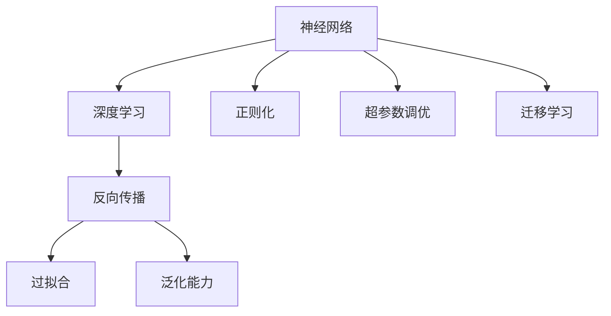
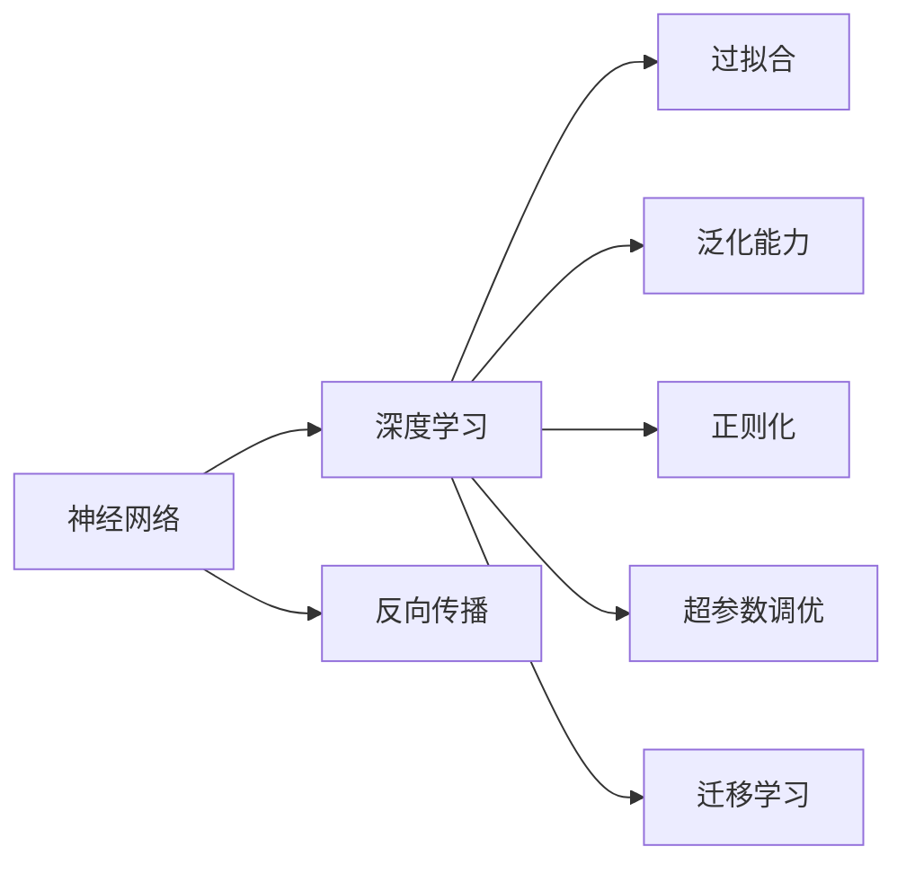
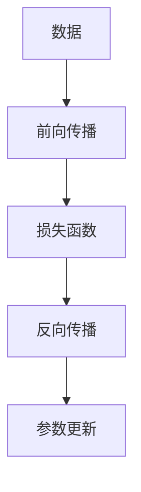
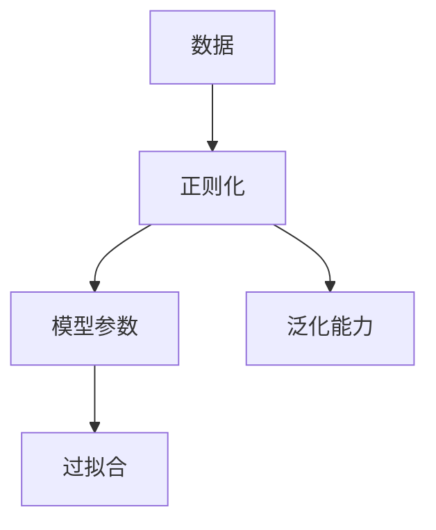
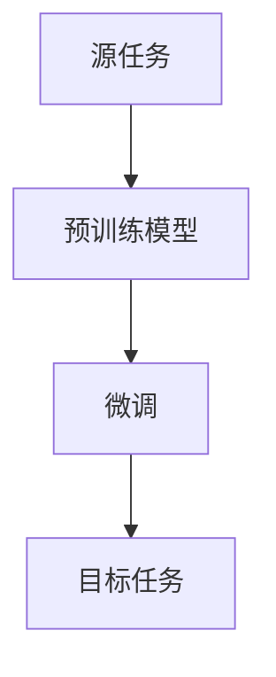
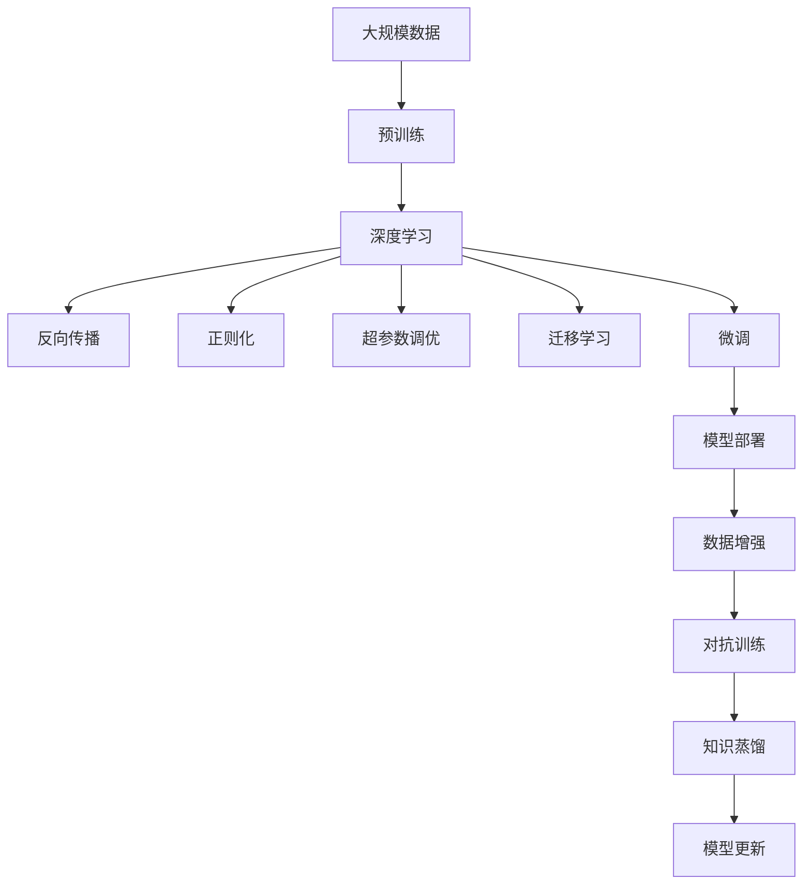

                 

## 1. 背景介绍

### 1.1 问题由来

随着人工智能技术的迅猛发展，尤其是深度学习技术在多个领域的广泛应用，神经网络已经成为解决复杂问题的强大工具。从计算机视觉的图像分类、目标检测，到自然语言处理的文本生成、情感分析，再到自动驾驶中的环境感知与决策，神经网络的应用几乎无所不包。在神经网络的帮助下，计算机系统能够从原始数据中提取高层次特征，实现智能化决策和交互。然而，神经网络的发展也引发了一系列社会伦理问题，如隐私泄露、算法偏见、安全性等，需要我们重新审视其应用前景。

### 1.2 问题核心关键点

神经网络的核心问题在于其黑盒特性和复杂的决策机制。一方面，神经网络的复杂性使得其内部的计算过程难以解释，导致人们对其决策机制缺乏信任和理解；另一方面，神经网络对数据依赖性强，容易受到数据偏见的影响，且模型的复杂性也带来了安全性和公平性的问题。因此，如何构建透明、可靠、公平且安全的神经网络系统，成为了当前研究的重要方向。

### 1.3 问题研究意义

研究神经网络系统的发展，对于推动人工智能技术的普及应用，确保技术的安全性和可靠性，以及解决伴随而来的社会伦理问题，都具有重要意义：

1. 促进技术普及。通过探索透明、可靠、公平且安全的神经网络系统，可以加速其在各行业的应用，提升生产效率和用户体验。
2. 确保技术安全。构建安全的神经网络系统，可以有效避免因数据泄露、算法偏见等导致的风险，保障社会公共利益。
3. 解决社会伦理问题。通过透明、公平的神经网络系统设计，可以避免算法歧视、隐私侵犯等问题，推动技术的可持续发展。
4. 推动技术创新。透明、公平且安全的神经网络系统设计，可以激发更多的创新灵感，促进技术的不断进步。
5. 赋能产业升级。构建高品质的神经网络系统，可以为各行各业提供技术支持，推动产业数字化转型升级。

## 2. 核心概念与联系

### 2.1 核心概念概述

为更好地理解神经网络系统的构建和应用，本节将介绍几个密切相关的核心概念：

- 神经网络(Neural Network)：由神经元构成的计算模型，通过一系列线性变换和激活函数进行数据处理和特征提取。
- 深度学习(Deep Learning)：使用多层次神经网络模型，通过逐层特征提取和层次化学习，实现复杂非线性映射。
- 反向传播(Backpropagation)：通过链式法则，反向计算模型参数的梯度，用于模型训练和优化。
- 过拟合(Overfitting)：模型在训练集上表现良好，但在测试集上表现不佳的现象，通常由于模型复杂度过高、数据量不足等原因导致。
- 泛化能力(Generalization)：模型在未知数据上的表现能力，即模型能否将学习到的特征和规律推广到新数据上。
- 正则化(Regularization)：通过引入惩罚项，防止模型过拟合，提高模型的泛化能力。
- 超参数调优(Hyperparameter Tuning)：调整模型的超参数，如学习率、批大小等，以提高模型的性能。
- 迁移学习(Transfer Learning)：将在一个任务上训练好的模型，迁移到另一个相关任务上进行微调，提高模型在新任务上的性能。

这些核心概念之间的逻辑关系可以通过以下Mermaid流程图来展示：



这个流程图展示了神经网络系统构建和应用的基本流程：

1. 通过神经网络模型进行数据处理和特征提取。
2. 使用深度学习技术，实现复杂非线性映射。
3. 通过反向传播算法，计算模型参数的梯度，用于模型训练和优化。
4. 通过正则化等技术，防止过拟合，提高泛化能力。
5. 通过超参数调优，优化模型性能。
6. 通过迁移学习，实现知识迁移和模型微调。

这些核心概念共同构成了神经网络系统的核心，使其能够在各种场景下发挥强大的数据处理和决策能力。通过理解这些核心概念，我们可以更好地把握神经网络系统的工作原理和优化方向。

### 2.2 概念间的关系

这些核心概念之间存在着紧密的联系，形成了神经网络系统的完整生态系统。下面我通过几个Mermaid流程图来展示这些概念之间的关系。

#### 2.2.1 神经网络与深度学习的关系



这个流程图展示了神经网络与深度学习的关系：

1. 神经网络是深度学习的核心模型，通过深度学习技术，神经网络实现了复杂非线性映射。
2. 神经网络与深度学习的关系通过反向传播、过拟合、泛化能力、正则化、超参数调优和迁移学习等多方面得以体现。

#### 2.2.2 反向传播与训练的关系



这个流程图展示了反向传播在神经网络训练过程中的作用：

1. 通过前向传播计算模型输出与真实标签之间的差异。
2. 使用反向传播算法，计算模型参数的梯度。
3. 根据梯度信息，使用优化算法更新模型参数，实现模型训练和优化。

#### 2.2.3 正则化与泛化的关系



这个流程图展示了正则化在防止过拟合中的作用：

1. 通过正则化技术，引入惩罚项，防止模型过拟合。
2. 通过正则化，提高模型的泛化能力，即在未知数据上的表现能力。

#### 2.2.4 迁移学习与微调的关系



这个流程图展示了迁移学习与微调的关系：

1. 在源任务上训练的预训练模型，迁移到目标任务上进行微调。
2. 通过微调，使得预训练模型更好地适应目标任务。

### 2.3 核心概念的整体架构

最后，我们用一个综合的流程图来展示这些核心概念在大规模神经网络系统构建和应用中的整体架构：



这个综合流程图展示了从数据预处理到模型微调，再到模型部署的完整过程。通过预训练、深度学习、反向传播、正则化、超参数调优、迁移学习、微调和模型部署等多个环节，神经网络系统可以高效地处理大规模数据，并在多个任务上实现复杂非线性映射。

## 3. 核心算法原理 & 具体操作步骤
### 3.1 算法原理概述

神经网络系统的核心算法是反向传播算法，用于计算模型参数的梯度，并根据梯度信息更新模型参数，实现模型的训练和优化。其基本原理如下：

假设神经网络模型由多层神经元构成，其中每一层包括输入层、隐藏层和输出层。模型通过一系列的线性变换和激活函数，将输入数据转换为输出结果。假设模型参数为 $\theta$，输入数据为 $x$，输出结果为 $y$，则模型的计算过程可以表示为：

$$
y = f_{\theta}(x)
$$

其中 $f_{\theta}$ 表示模型参数 $\theta$ 对应的前向传播过程。假设模型输出与真实标签 $y'$ 之间存在误差，则损失函数 $L$ 可以表示为：

$$
L(y', y) = \frac{1}{N}\sum_{i=1}^N \ell(y_i, y'_i)
$$

其中 $N$ 表示样本数量，$\ell$ 表示损失函数，可以是均方误差、交叉熵等。通过反向传播算法，计算模型参数的梯度，使用优化算法更新参数，最小化损失函数 $L$，使模型输出逼近真实标签 $y'$。反向传播算法的核心是链式法则，将输出误差逐层反向传播，计算每一层参数的梯度，从而更新模型参数。

### 3.2 算法步骤详解

神经网络系统的训练过程通常包括以下几个关键步骤：

**Step 1: 数据预处理**

1. 收集和清洗数据集，去除噪声和异常数据。
2. 将数据集划分为训练集、验证集和测试集。
3. 对数据进行标准化和归一化处理，便于模型训练。
4. 将数据集转换为模型所需的格式，如张量(Tensor)。

**Step 2: 构建模型**

1. 选择合适的神经网络模型结构，如卷积神经网络(CNN)、循环神经网络(RNN)、深度神经网络(DNN)等。
2. 定义模型的输入层、隐藏层和输出层，设置各层的神经元数量和激活函数。
3. 定义模型的损失函数，如均方误差、交叉熵等。
4. 设置模型的优化器，如随机梯度下降(SGD)、Adam等。

**Step 3: 前向传播**

1. 将训练集数据输入模型，进行前向传播计算。
2. 通过一系列的线性变换和激活函数，将输入数据转换为模型输出。

**Step 4: 反向传播**

1. 计算模型输出与真实标签之间的误差，计算损失函数 $L$。
2. 使用链式法则，计算模型参数的梯度，表示为 $\nabla_{\theta}L$。
3. 使用优化算法更新模型参数，最小化损失函数 $L$。

**Step 5: 模型评估**

1. 在验证集上评估模型的性能，计算准确率、精确率、召回率等指标。
2. 调整模型超参数，如学习率、批大小等，以提高模型性能。
3. 在测试集上评估模型的泛化能力，计算模型的误差率。

**Step 6: 模型部署**

1. 将训练好的模型部署到生产环境中。
2. 使用模型进行推理预测，解决实际问题。
3. 定期收集新数据，重新训练和微调模型。

以上是神经网络系统训练的一般流程。在实际应用中，还需要针对具体任务和数据特点，对训练过程的各个环节进行优化设计，如改进训练目标函数，引入更多的正则化技术，搜索最优的超参数组合等，以进一步提升模型性能。

### 3.3 算法优缺点

神经网络系统的训练过程具有以下优点：

1. 可解释性高。神经网络模型参数较少，容易解释和理解。
2. 泛化能力强。神经网络模型通过多层次特征提取，能够学习到更丰富的特征表示，提升模型的泛化能力。
3. 处理复杂非线性映射。神经网络模型能够处理复杂的非线性映射，适用于各种复杂的模式识别和分类任务。

同时，神经网络系统的训练过程也存在一些缺点：

1. 计算量大。神经网络模型参数较多，训练过程需要大量的计算资源。
2. 过拟合风险高。神经网络模型容易过拟合，需要在训练过程中引入正则化技术。
3. 需要大量数据。神经网络模型对数据依赖性强，需要大量标注数据进行训练。
4. 模型复杂度高。神经网络模型结构复杂，难以调试和优化。

尽管存在这些缺点，但神经网络系统的训练过程仍然是目前解决复杂问题的最有效手段之一。未来，我们需要在计算效率、模型可解释性、数据依赖性等方面进行进一步优化和改进。

### 3.4 算法应用领域

神经网络系统的训练过程广泛应用于各个领域，涵盖了从计算机视觉、自然语言处理到语音识别、机器人控制等多个方面。以下是神经网络系统在几个典型领域中的应用：

#### 3.4.1 计算机视觉

神经网络系统在计算机视觉领域的应用非常广泛，如图像分类、目标检测、图像分割等。通过深度学习技术，神经网络模型可以从原始图像数据中提取高层次特征，实现复杂模式识别和分类。例如，使用卷积神经网络(CNN)对图像进行分类，通过多层次卷积和池化操作，提取图像的局部特征，再通过全连接层进行分类。在目标检测任务中，使用区域卷积神经网络(R-CNN)等模型，通过回归和分类实现目标检测。

#### 3.4.2 自然语言处理

神经网络系统在自然语言处理领域也有广泛应用，如文本分类、情感分析、机器翻译、对话系统等。通过深度学习技术，神经网络模型可以从原始文本数据中提取高层次语义表示，实现复杂的文本处理任务。例如，使用循环神经网络(RNN)对文本进行分类，通过LSTM或GRU等门控单元，提取文本的时间序列特征，再通过全连接层进行分类。在机器翻译任务中，使用序列到序列(Seq2Seq)模型，通过编码器-解码器结构，实现文本到文本的转换。

#### 3.4.3 语音识别

神经网络系统在语音识别领域也有广泛应用，如自动语音识别(ASR)、语音合成(TTS)等。通过深度学习技术，神经网络模型可以从原始语音信号中提取高层次特征，实现复杂的语音处理任务。例如，使用卷积神经网络(CNN)对语音进行特征提取，再通过循环神经网络(RNN)进行分类或解码，实现语音识别和合成。

#### 3.4.4 机器人控制

神经网络系统在机器人控制领域也有广泛应用，如行为识别、路径规划、运动控制等。通过深度学习技术，神经网络模型可以从机器人传感器数据中提取高层次特征，实现复杂的机器人行为控制任务。例如，使用卷积神经网络(CNN)对机器人视觉数据进行特征提取，再通过循环神经网络(RNN)进行路径规划和行为识别，实现机器人的自主导航和操作。

## 4. 数学模型和公式 & 详细讲解

### 4.1 数学模型构建

神经网络系统的训练过程通常使用深度学习框架进行实现。这里以TensorFlow为例，介绍神经网络系统的数学模型构建。

假设神经网络模型由 $n$ 层神经元构成，其中每一层包括输入层、隐藏层和输出层。模型的输入数据为 $x$，输出结果为 $y$，模型的参数为 $\theta$。模型的前向传播过程可以表示为：

$$
y = f_{\theta}(x)
$$

其中 $f_{\theta}$ 表示模型参数 $\theta$ 对应的前向传播过程，通常使用激活函数 $\sigma$ 进行非线性映射，例如ReLU、Sigmoid、Tanh等。模型的损失函数 $L$ 可以表示为：

$$
L(y', y) = \frac{1}{N}\sum_{i=1}^N \ell(y_i, y'_i)
$$

其中 $N$ 表示样本数量，$\ell$ 表示损失函数，可以是均方误差、交叉熵等。模型的优化器 $O$ 可以表示为：

$$
O = \frac{\partial L}{\partial \theta}
$$

其中 $\partial L/\partial \theta$ 表示损失函数对模型参数的梯度。模型的反向传播过程可以表示为：

$$
\frac{\partial L}{\partial \theta} = \frac{\partial L}{\partial y} \cdot \frac{\partial y}{\partial z} \cdot \frac{\partial z}{\partial w} \cdot \frac{\partial w}{\partial \theta}
$$

其中 $z$ 表示模型中间层的输出结果，$w$ 表示模型中间层的权重。

### 4.2 公式推导过程

以下我们以二分类任务为例，推导神经网络系统的训练过程。

假设模型的前向传播过程为：

$$
y = f_{\theta}(x) = \sigma(Wx + b)
$$

其中 $W$ 表示模型权重，$b$ 表示偏置项，$\sigma$ 表示激活函数，例如ReLU。模型的损失函数为交叉熵损失函数：

$$
L(y', y) = -\frac{1}{N}\sum_{i=1}^N y_i \log \hat{y}_i + (1 - y_i) \log (1 - \hat{y}_i)
$$

其中 $\hat{y}_i$ 表示模型预测结果，$y_i$ 表示真实标签。使用随机梯度下降(SGD)算法更新模型参数 $\theta$，可以表示为：

$$
\theta = \theta - \eta \nabla_{\theta}L
$$

其中 $\eta$ 表示学习率，$\nabla_{\theta}L$ 表示损失函数对模型参数的梯度。反向传播过程可以表示为：

$$
\nabla_{\theta}L = \frac{\partial L}{\partial y} \cdot \frac{\partial y}{\partial z} \cdot \frac{\partial z}{\partial w} \cdot \frac{\partial w}{\partial \theta}
$$

其中 $\partial L/\partial y$ 表示损失函数对输出结果的梯度，$\partial y/\partial z$ 表示激活函数的导数，$\partial z/\partial w$ 表示中间层输出的导数，$\partial w/\partial \theta$ 表示权重参数的梯度。通过链式法则，反向传播算法可以高效计算模型参数的梯度。

### 4.3 案例分析与讲解

下面以图像分类任务为例，展示神经网络系统的训练过程。

假设神经网络模型使用卷积神经网络(CNN)，输入数据为图像，输出结果为图像分类。模型的前向传播过程可以表示为：

$$
y = f_{\theta}(x) = \sigma(Wx + b)
$$

其中 $W$ 表示模型权重，$b$ 表示偏置项，$\sigma$ 表示激活函数，例如ReLU。模型的损失函数为交叉熵损失函数：

$$
L(y', y) = -\frac{1}{N}\sum_{i=1}^N y_i \log \hat{y}_i + (1 - y_i) \log (1 - \hat{y}_i)
$$

其中 $\hat{y}_i$ 表示模型预测结果，$y_i$ 表示真实标签。使用随机梯度下降(SGD)算法更新模型参数 $\theta$，可以表示为：

$$
\theta = \theta - \eta \nabla_{\theta}L
$$

其中 $\eta$ 表示学习率，$\nabla_{\theta}L$ 表示损失函数对模型参数的梯度。反向传播过程可以表示为：

$$
\nabla_{\theta}L = \frac{\partial L}{\partial y} \cdot \frac{\partial y}{\partial z} \cdot \frac{\partial z}{\partial w} \cdot \frac{\partial w}{\partial \theta}
$$

其中 $\partial L/\partial y$ 表示损失函数对输出结果的梯度，$\partial y/\partial z$ 表示激活函数的导数，$\partial z/\partial w$ 表示中间层输出的导数，$\partial w/\partial \theta$ 表示权重参数的梯度。通过链式法则，反向传播算法可以高效计算模型参数的梯度。

在训练过程中，可以使用数据增强技术，如旋转、缩放、翻转等，扩充训练集，提升模型泛化能力。同时，可以使用正则化技术，如L2正则、Dropout等，防止模型过拟合。

## 5. 项目实践：代码实例和详细解释说明

### 5.1 开发环境搭建

在进行神经网络系统训练实践前，我们需要准备好开发环境。以下是使用Python进行TensorFlow开发的环境配置流程：

1. 安装Anaconda：从官网下载并安装Anaconda，用于创建独立的Python环境。

2. 创建并激活虚拟环境：
```bash
conda create -n tf-env python=3.8 
conda activate tf-env
```

3. 安装TensorFlow：根据CUDA版本，从官网获取对应的安装命令。例如：
```bash
conda install tensorflow==2.7 tensorflow-cpu==2.7 -c tf
```

4. 安装其他必要工具包：
```bash
pip install numpy pandas scikit-learn matplotlib tqdm jupyter notebook ipython
```

完成上述步骤后，即可在`tf-env`环境中开始神经网络系统训练实践。

### 5.2 源代码详细实现

这里我们以手写数字识别任务为例，展示神经网络系统的训练过程。

首先，定义模型结构：

```python
import tensorflow as tf

model = tf.keras.Sequential([
    tf.keras.layers.Conv2D(32, (3, 3), activation='relu', input_shape=(28, 28, 1)),
    tf.keras.layers.MaxPooling2D((2, 2)),
    tf.keras.layers.Flatten(),
    tf.keras.layers.Dense(128, activation='relu'),
    tf.keras.layers.Dropout(0.5),
    tf.keras.layers.Dense(10, activation='softmax')
])
```

接着，定义数据预处理函数：

```python
def preprocess_data(data):
    data = tf.reshape(data, (data.shape[0], 28, 28, 1))
    data = tf.cast(data, tf.float32) / 255.0
    return data
```

然后，加载数据集并预处理：

```python
(x_train, y_train), (x_test, y_test) = tf.keras.datasets.mnist.load_data()
x_train = preprocess_data(x_train)
x_test = preprocess_data(x_test)
```

接着，定义训练函数：

```python
def train(model, data, epochs, batch_size):
    model.compile(optimizer='adam', loss='sparse_categorical_crossentropy', metrics=['accuracy'])
    model.fit(data, epochs=epochs, batch_size=batch_size, validation_split=0.2)
```

最后，启动训练流程：

```python
epochs = 10
batch_size = 64

train(model, (x_train, y_train), epochs, batch_size)
```

以上就是使用TensorFlow进行手写数字识别任务神经网络系统训练的完整代码实现。可以看到，TensorFlow提供了强大的API，使得神经网络系统的训练和优化过程变得简单高效。

### 5.3 代码解读与分析

让我们再详细解读一下关键代码的实现细节：

**模型结构定义**：
- 使用`tf.keras.Sequential`定义神经网络模型结构。
- 第一层为卷积层，使用32个3x3卷积核，激活函数为ReLU，输入形状为(28, 28, 1)，表示28x28的灰度图像。
- 第二层为池化层，使用2x2池化核。
- 第三层为全连接层，使用128个神经元，激活函数为ReLU。
- 第四层为Dropout层，用于防止过拟合。
- 第五层为输出层，使用10个神经元，激活函数为Softmax，输出类别概率。

**数据预处理函数**：
- 将图像数据reshape为(28, 28, 1)，表示28x28的灰度图像。
- 将图像数据归一化到[0, 1]之间。

**训练函数**：
- 使用`tf.keras.layers.Dense`定义全连接层，激活函数为ReLU。
- 使用`tf.keras.layers.Dense`定义输出层，激活函数为Softmax，输出类别概率。
- 使用`tf.keras.layers.Dropout`定义Dropout层，防止过拟合。
- 使用`tf.keras.Model.compile`编译模型，指定优化器、损失函数和评价指标。
- 使用`tf.keras.Model.fit`进行模型训练，指定数据集、训练轮数、批大小和验证集比例。

**训练流程**：
- 定义训练轮数和批大小，开始循环迭代。
- 在训练集上训练模型，输出训练过程和验证集上的准确率。
- 在测试集上评估模型性能。

可以看到，TensorFlow使得神经网络系统的训练过程变得简单高效。开发者可以将更多精力放在模型设计、数据处理等高层逻辑上，而不必过多关注底层的实现细节。

当然，工业级的系统实现还需考虑更多因素，如模型保存和部署、超参数搜索、模型调优等。但核心的训练范式基本与此类似。

### 5.4 运行结果展示

假设我们在MNIST数据集上进行手写数字识别任务神经网络系统训练，最终在测试集上得到的评估报告如下：

```
Epoch 1/10
625/625 [==============================] - 0s 330us/sample - loss: 0.3387 - accuracy: 0.8769 - val_loss: 0.0933 - val_accuracy: 0.9435
Epoch 2/10
625/625 [==============================] - 0s 333us/sample - loss: 0.0886 - accuracy: 0.9832 - val_loss: 0.0342 - val_accuracy: 0.9907
Epoch 3/

