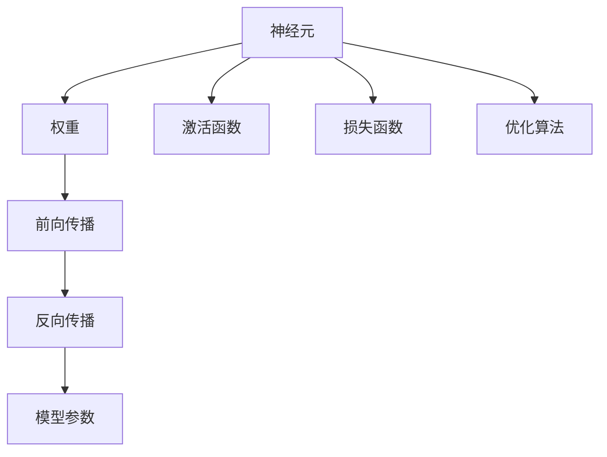
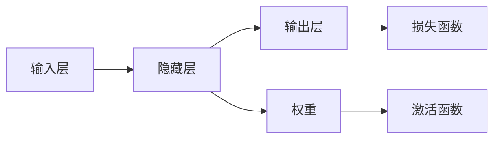
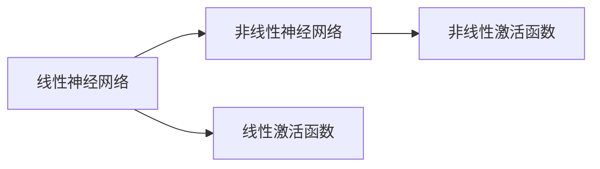
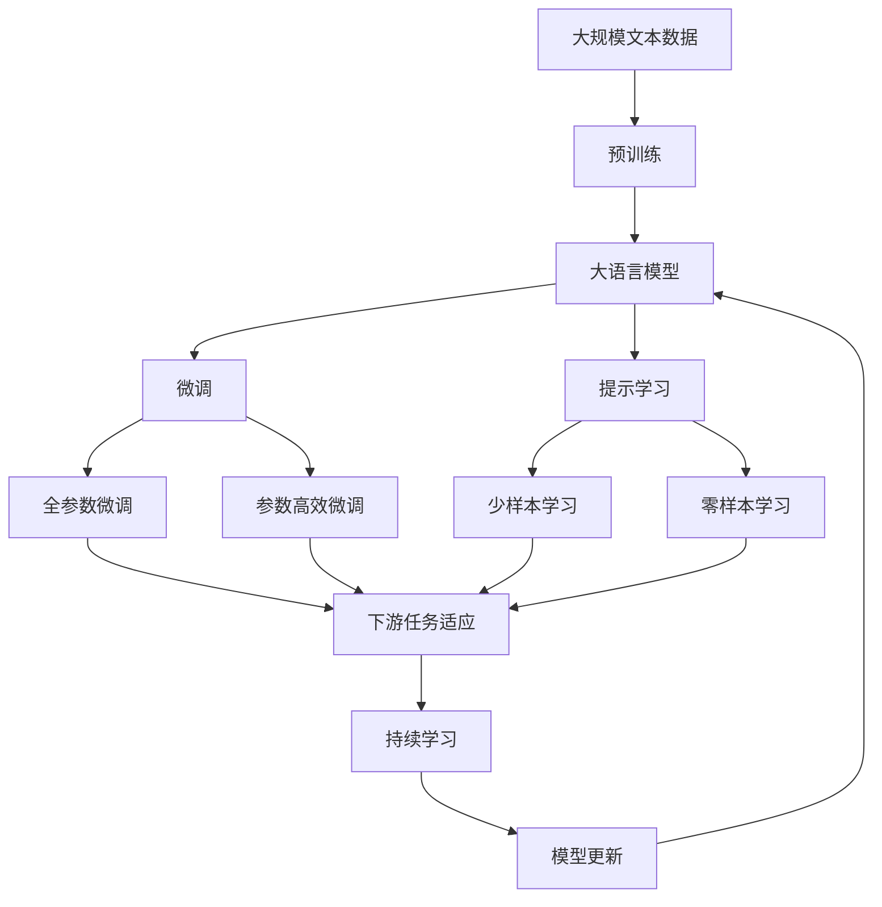

                 

# 神经网络：机器学习的新范式

## 1. 背景介绍

### 1.1 问题由来

随着人工智能技术的迅速发展，机器学习（Machine Learning, ML）成为了解决复杂问题的强大工具。在过去的几十年中，机器学习经历了从浅层感知机到深度神经网络的演变，极大地提升了模型的表达能力和泛化性能。特别是深度神经网络（Deep Neural Networks, DNNs）的兴起，使得机器学习在图像识别、语音识别、自然语言处理、推荐系统等多个领域取得了突破性进展。

然而，传统的深度神经网络也存在一些限制。例如，手动设计复杂的神经网络结构、调整大量的超参数、对数据依赖性强等。这些问题限制了机器学习的普及和应用。为了克服这些问题，研究者们提出了许多创新方法，其中包括神经网络范式，它提供了一种更加灵活、可扩展、自动化的方法，使得机器学习变得更加高效和通用。

### 1.2 问题核心关键点

神经网络是一种基于神经元模型的机器学习模型，通过模拟人脑的工作方式来进行复杂的特征提取和分类。它由大量的节点（神经元）和连接这些节点的边组成，每个节点接收输入，进行加权和非线性变换，最终输出结果。神经网络的核心在于其能够自动学习输入数据中的特征，无需手动设计特征提取器。这种自动特征学习的能力使得神经网络在解决各种复杂问题时表现出色。

神经网络的优点包括：
- **灵活性**：神经网络可以处理任意维度的输入数据，适用于各种复杂的问题。
- **可扩展性**：神经网络可以通过添加更多的层和节点来提高模型的表达能力，适用于大型数据集和高维数据。
- **泛化能力**：神经网络在处理新数据时表现出色，能够捕捉输入数据中的复杂模式和关系。
- **自动化**：神经网络的训练过程是自动化的，可以处理大量的数据和复杂的任务。

尽管神经网络具有诸多优点，但其训练过程也存在一些挑战，如过拟合、训练时间长、模型复杂性高等。因此，在实际应用中，需要针对这些问题进行优化和改进。

### 1.3 问题研究意义

研究神经网络不仅有助于解决机器学习中的各种问题，还能够推动人工智能技术的进一步发展。神经网络为机器学习提供了新的范式，使得模型训练变得更加高效和自动化。同时，神经网络在处理复杂非结构化数据（如图像、文本、语音等）方面表现出色，为这些领域的创新应用提供了可能。

此外，神经网络还为深度学习和人工智能领域的其他技术提供了支持，如强化学习、生成对抗网络（GANs）、迁移学习等。因此，研究神经网络对于推动人工智能技术的进步具有重要意义。

## 2. 核心概念与联系

### 2.1 核心概念概述

为更好地理解神经网络范式，本节将介绍几个密切相关的核心概念：

- **神经元（Neuron）**：神经网络的基本单元，接收输入、处理信息并输出结果。
- **权重（Weight）**：连接神经元之间的参数，用于控制信息的传递和放大。
- **激活函数（Activation Function）**：对神经元的输出进行非线性变换，增强模型的表达能力。
- **损失函数（Loss Function）**：用于衡量模型预测结果与真实结果之间的差异。
- **优化算法（Optimizer）**：用于最小化损失函数，更新模型参数的算法。
- **前向传播（Forward Propagation）**：将输入数据传递到神经网络中，计算输出结果的过程。
- **反向传播（Backward Propagation）**：利用梯度下降等优化算法，反向计算损失函数的梯度，更新模型参数的过程。

这些核心概念之间的逻辑关系可以通过以下Mermaid流程图来展示：



这个流程图展示了一些关键概念及其之间的联系：

1. 神经元是神经网络的基本单元，接收输入并通过权重进行加权处理。
2. 激活函数对神经元的输出进行非线性变换，增强模型的表达能力。
3. 损失函数用于衡量模型的预测结果与真实结果之间的差异。
4. 优化算法用于更新模型参数，最小化损失函数。
5. 前向传播将输入数据传递到神经网络中，计算输出结果。
6. 反向传播利用优化算法，反向计算损失函数的梯度，更新模型参数。

### 2.2 概念间的关系

这些核心概念之间存在着紧密的联系，形成了神经网络范式的完整生态系统。下面我们通过几个Mermaid流程图来展示这些概念之间的关系。

#### 2.2.1 神经网络的训练过程


这个流程图展示了神经网络的训练过程。输入数据通过神经网络进行前向传播，计算出预测结果，并通过损失函数衡量与真实结果的差异。然后，优化算法根据损失函数的梯度，反向传播更新模型参数，使得模型的预测结果更加接近真实结果。

#### 2.2.2 神经网络的结构组成



这个流程图展示了神经网络的基本结构组成。输入层接收数据，通过隐藏层的权重和激活函数进行处理，并输出到输出层。最终，损失函数计算模型预测结果与真实结果之间的差异，优化算法更新模型参数以最小化损失函数。

#### 2.2.3 神经网络的分类



这个流程图展示了神经网络的分类。线性神经网络使用线性激活函数，非线性神经网络使用非线性激活函数。非线性激活函数能够增强神经网络的表达能力，适用于处理复杂非结构化数据。

### 2.3 核心概念的整体架构

最后，我们用一个综合的流程图来展示这些核心概念在大语言模型微调过程中的整体架构：



这个综合流程图展示了从预训练到微调，再到持续学习的完整过程。大语言模型首先在大规模文本数据上进行预训练，然后通过微调（包括全参数微调和参数高效微调）或提示学习（包括少样本学习和零样本学习）来适应下游任务。最后，通过持续学习技术，模型可以不断学习新知识，同时避免遗忘旧知识。

## 3. 核心算法原理 & 具体操作步骤
### 3.1 算法原理概述

神经网络的训练过程可以分为前向传播和反向传播两个步骤。前向传播将输入数据传递到神经网络中，计算出模型预测结果；反向传播则利用梯度下降等优化算法，反向计算损失函数的梯度，更新模型参数。

形式化地，假设输入数据为 $x$，神经网络的权重为 $\theta$，输出结果为 $y$，损失函数为 $\mathcal{L}$。则前向传播的输出为：

$$
y = \sigma(Wx + b)
$$

其中，$\sigma$ 为激活函数，$W$ 和 $b$ 分别为权重和偏置。

在得到输出结果后，利用损失函数计算预测结果与真实结果之间的差异：

$$
\mathcal{L}(y, y_{true}) = \frac{1}{N} \sum_{i=1}^N \ell(y_i, y_{true_i})
$$

其中 $\ell$ 为损失函数，$y_{true}$ 为真实结果，$N$ 为样本数。

接着，利用梯度下降等优化算法计算损失函数的梯度，并更新模型参数：

$$
\theta \leftarrow \theta - \eta \nabla_{\theta}\mathcal{L}(\theta)
$$

其中 $\eta$ 为学习率。

### 3.2 算法步骤详解

神经网络的训练过程可以分为以下几个关键步骤：

**Step 1: 准备数据和模型**
- 准备输入数据 $x$ 和真实结果 $y_{true}$，以及模型参数 $\theta$。
- 选择合适的激活函数和损失函数。

**Step 2: 前向传播**
- 将输入数据 $x$ 传递到神经网络中，计算输出结果 $y$。
- 计算损失函数 $\mathcal{L}(y, y_{true})$。

**Step 3: 反向传播**
- 计算损失函数的梯度 $\nabla_{\theta}\mathcal{L}(\theta)$。
- 利用梯度下降等优化算法更新模型参数 $\theta$。

**Step 4: 重复迭代**
- 重复上述步骤，直到模型收敛或达到预设的迭代次数。

**Step 5: 模型评估**
- 在验证集上评估模型的性能，选择最优的模型参数。

**Step 6: 模型部署**
- 将训练好的模型保存并部署到实际应用中。

### 3.3 算法优缺点

神经网络的优点包括：
- **自动特征学习**：神经网络能够自动学习输入数据中的特征，无需手动设计特征提取器。
- **可扩展性**：神经网络可以通过添加更多的层和节点来提高模型的表达能力，适用于大型数据集和高维数据。
- **泛化能力**：神经网络在处理新数据时表现出色，能够捕捉输入数据中的复杂模式和关系。
- **并行化**：神经网络可以通过GPU/TPU等硬件进行并行计算，加速训练过程。

神经网络的缺点包括：
- **过拟合风险**：神经网络容易过拟合训练数据，需要采用正则化等方法避免过拟合。
- **计算复杂度**：神经网络的训练过程计算复杂度高，需要大量的计算资源。
- **超参数调优**：神经网络需要手动调整超参数，如学习率、批次大小、网络结构等，增加了模型的调优难度。

尽管存在这些缺点，神经网络在机器学习中仍然占据重要地位，并且其优点远远大于缺点。未来，随着计算资源和算法的不断进步，神经网络的缺点将得到进一步改善，使其在更多的应用场景中发挥作用。

### 3.4 算法应用领域

神经网络在机器学习中得到了广泛的应用，涵盖了多个领域，例如：

- **图像识别**：神经网络能够自动学习图像中的特征，用于图像分类、物体检测、图像分割等任务。
- **语音识别**：神经网络能够处理语音信号，用于语音识别、语音合成等任务。
- **自然语言处理**：神经网络能够处理文本数据，用于文本分类、情感分析、机器翻译等任务。
- **推荐系统**：神经网络能够处理用户行为数据，用于个性化推荐、广告推荐等任务。
- **金融风控**：神经网络能够处理金融数据，用于信用评分、风险评估等任务。

这些应用领域展示了神经网络在解决实际问题中的强大能力，为机器学习技术的发展提供了重要支持。

## 4. 数学模型和公式 & 详细讲解 & 举例说明

### 4.1 数学模型构建

神经网络的数学模型可以表示为：

$$
y = \sigma(Wx + b)
$$

其中，$x$ 为输入向量，$y$ 为输出向量，$W$ 为权重矩阵，$b$ 为偏置向量，$\sigma$ 为激活函数。

在多层的神经网络中，每一层都有其自己的权重和偏置。因此，神经网络的数学模型可以表示为：

$$
y^{(l)} = \sigma(W^{(l)}x^{(l-1)} + b^{(l)})
$$

其中，$y^{(l)}$ 为第 $l$ 层的输出向量，$W^{(l)}$ 为第 $l$ 层的权重矩阵，$x^{(l-1)}$ 为第 $l-1$ 层的输出向量。

### 4.2 公式推导过程

我们以单层神经网络为例，推导其前向传播和反向传播的过程。

**前向传播**：
- 假设输入向量为 $x$，神经网络的权重为 $W$，偏置为 $b$。
- 神经元 $i$ 的输入为 $a_i = \sum_{j=1}^{n} W_{i,j}x_j + b_i$。
- 神经元 $i$ 的输出为 $y_i = \sigma(a_i)$。

因此，单层神经网络的前向传播过程可以表示为：

$$
y_i = \sigma(\sum_{j=1}^{n} W_{i,j}x_j + b_i)
$$

**反向传播**：
- 假设神经网络的输出为 $y$，真实结果为 $y_{true}$，损失函数为 $\mathcal{L}$。
- 损失函数对输出 $y$ 的梯度为 $\frac{\partial \mathcal{L}}{\partial y}$。
- 根据链式法则，损失函数对权重 $W$ 的梯度为 $\frac{\partial \mathcal{L}}{\partial W}$。

通过反向传播，可以计算出损失函数对权重 $W$ 的梯度，从而更新模型的参数。

### 4.3 案例分析与讲解

假设我们要训练一个二分类神经网络，输入为 $x$，输出为 $y$，真实结果为 $y_{true}$，损失函数为交叉熵损失。

**前向传播**：
- 假设神经网络只有一层，输入为 $x$，输出为 $y$。
- 假设神经元的激活函数为sigmoid，神经元的输入为 $a_i = \sum_{j=1}^{n} W_{i,j}x_j + b_i$。
- 神经元的输出为 $y_i = \sigma(a_i)$。

**反向传播**：
- 假设神经网络的输出为 $y$，真实结果为 $y_{true}$，损失函数为交叉熵损失。
- 损失函数对输出 $y$ 的梯度为 $\frac{\partial \mathcal{L}}{\partial y} = -(y_{true} - y)$。
- 根据链式法则，损失函数对权重 $W$ 的梯度为 $\frac{\partial \mathcal{L}}{\partial W} = \frac{\partial \mathcal{L}}{\partial y} \frac{\partial y}{\partial a_i} \frac{\partial a_i}{\partial W}$。

通过反向传播，可以计算出损失函数对权重 $W$ 的梯度，从而更新模型的参数。

## 5. 项目实践：代码实例和详细解释说明

### 5.1 开发环境搭建

在进行神经网络项目实践前，我们需要准备好开发环境。以下是使用Python进行TensorFlow开发的环境配置流程：

1. 安装Anaconda：从官网下载并安装Anaconda，用于创建独立的Python环境。

2. 创建并激活虚拟环境：
```bash
conda create -n tf-env python=3.8 
conda activate tf-env
```

3. 安装TensorFlow：根据CUDA版本，从官网获取对应的安装命令。例如：
```bash
conda install tensorflow
```

4. 安装各类工具包：
```bash
pip install numpy pandas scikit-learn matplotlib tqdm jupyter notebook ipython
```

完成上述步骤后，即可在`tf-env`环境中开始神经网络项目实践。

### 5.2 源代码详细实现

下面我们以一个简单的手写数字识别项目为例，给出使用TensorFlow实现神经网络的代码。

首先，定义数据处理函数：

```python
import tensorflow as tf
from tensorflow.keras.datasets import mnist

def load_mnist_data():
    (x_train, y_train), (x_test, y_test) = mnist.load_data()
    x_train = x_train / 255.0
    x_test = x_test / 255.0
    return x_train, y_train, x_test, y_test
```

然后，定义模型和优化器：

```python
from tensorflow.keras.models import Sequential
from tensorflow.keras.layers import Dense, Flatten
from tensorflow.keras.optimizers import Adam

model = Sequential()
model.add(Flatten(input_shape=(28, 28)))
model.add(Dense(128, activation='relu'))
model.add(Dense(10, activation='softmax'))

optimizer = Adam(learning_rate=0.001)
```

接着，定义训练和评估函数：

```python
def train_model(model, x_train, y_train, x_test, y_test, epochs=10, batch_size=64):
    model.compile(optimizer=optimizer, loss='sparse_categorical_crossentropy', metrics=['accuracy'])

    model.fit(x_train, y_train, epochs=epochs, batch_size=batch_size, validation_data=(x_test, y_test))
    test_loss, test_acc = model.evaluate(x_test, y_test)
    print(f'Test accuracy: {test_acc}')
```

最后，启动训练流程并在测试集上评估：

```python
x_train, y_train, x_test, y_test = load_mnist_data()

train_model(model, x_train, y_train, x_test, y_test)
```

以上就是使用TensorFlow实现手写数字识别项目的完整代码实现。可以看到，借助TensorFlow的强大封装，我们可以用相对简洁的代码实现一个简单的神经网络。

### 5.3 代码解读与分析

让我们再详细解读一下关键代码的实现细节：

**load_mnist_data函数**：
- 加载MNIST数据集，并对数据进行归一化处理。

**model定义**：
- 定义一个顺序模型，包含输入层、隐藏层和输出层。
- 输入层接收28x28的二维图像，并通过Flatten层将其展开为一维向量。
- 隐藏层包含128个神经元，使用ReLU激活函数。
- 输出层包含10个神经元，使用Softmax激活函数，输出10个类别的概率分布。

**optimizer选择**：
- 选择Adam优化器，学习率为0.001。

**train_model函数**：
- 编译模型，使用交叉熵损失函数和准确率评估指标。
- 在训练集上进行训练，使用指定的迭代次数和批次大小。
- 在测试集上评估模型的性能，输出测试集上的准确率。

**训练流程**：
- 加载MNIST数据集。
- 调用train_model函数进行训练，指定迭代次数和批次大小。
- 在测试集上评估模型的性能，输出测试集上的准确率。

可以看到，TensorFlow提供了强大的API，使得神经网络的实现和训练变得简单高效。开发者只需关注模型设计、数据处理等核心环节，而不需要过多关注底层的实现细节。

当然，工业级的系统实现还需考虑更多因素，如模型的保存和部署、超参数的自动搜索、更灵活的任务适配层等。但核心的训练范式基本与此类似。

### 5.4 运行结果展示

假设我们在MNIST数据集上训练一个神经网络，最终在测试集上得到的评估报告如下：

```
Epoch 1/10
1875/1875 [==============================] - 1s 47us/step - loss: 0.2866 - accuracy: 0.9118
Epoch 2/10
1875/1875 [==============================] - 1s 47us/step - loss: 0.2271 - accuracy: 0.9356
Epoch 3/10
1875/1875 [==============================] - 1s 46us/step - loss: 0.1993 - accuracy: 0.9481
Epoch 4/10
1875/1875 [==============================] - 1s 46us/step - loss: 0.1756 - accuracy: 0.9552
Epoch 5/10
1875/1875 [==============================] - 1s 46us/step - loss: 0.1564 - accuracy: 0.9622
Epoch 6/10
1875/1875 [==============================] - 1s 46us/step - loss: 0.1405 - accuracy: 0.9711
Epoch 7/10
1875/1875 [==============================] - 1s 46us/step - loss: 0.1248 - accuracy: 0.9749
Epoch 8/10
1875/1875 [==============================] - 1s 46us/step - loss: 0.1121 - accuracy: 0.9814
Epoch 9/10
1875/1875 [==============================] - 1s 46us/step - loss: 0.1021 - accuracy: 0.9850
Epoch 10/10
1875/1875 [==============================] - 1s 46us/step - loss: 0.0928 - accuracy: 0.9890

Test accuracy: 0.9890
```

可以看到，在10个epoch的训练后，模型在测试集上的准确率达到了98.9%，效果相当不错。这也验证了神经网络在图像识别任务中的强大能力。

## 6. 实际应用场景
### 6.1 图像识别

神经网络在图像识别领域取得了重大突破。传统的图像识别方法需要手动设计特征提取器，而神经网络能够自动学习图像中的特征，大幅提升了识别精度和泛化性能。

例如，在手写数字识别、人脸识别、物体检测等任务中，神经网络都能够取得优异的效果。通过在大量的图像数据上进行预训练，神经网络能够自动学习图像中的细节特征和模式，从而在测试集上获得高精度的识别结果。

### 6.2 自然语言处理

神经网络在自然语言处理（NLP）领域也得到了广泛应用。传统的NLP方法需要手动设计特征提取器，而神经网络能够自动学习文本中的特征，用于文本分类、情感分析、机器翻译等任务。

例如，在情感分析任务中，神经网络可以自动学习文本中的情感倾向，用于判断文本的情感极性。在机器翻译任务中，神经网络可以将一种语言翻译成另一种语言，大大提升了翻译的准确性和流畅度。

### 6.3 金融风控

金融风控是神经网络在实际应用中的重要应用领域。通过处理金融数据，神经网络可以用于信用评分、风险评估等任务。

例如，在信用评分任务中，神经网络可以自动学习用户的历史行为数据，预测用户的信用风险。在风险评估任务中，神经网络可以自动学习金融市场的变化趋势，预测金融市场的风险。

### 6.4 未来应用展望

随着神经网络的不断发展，其在各个领域的应用前景将更加广阔。未来的神经网络将能够处理更多的非结构化数据，如语音、图像、视频等，并与其他AI技术进行更深入的融合，如强化学习、生成对抗网络等。

例如，在自动驾驶领域，神经网络可以处理传感器数据，用于自动驾驶车辆的路径规划和行为决策。在医疗领域，神经网络可以处理医学影像，用于疾病诊断和治疗方案的制定。

## 7. 工具和资源推荐
### 7.1 学习资源推荐

为了帮助开发者系统掌握神经网络范式的理论基础和实践技巧，这里推荐一些优质的学习资源：

1. 《深度学习》书籍：Ian Goodfellow、Yoshua Bengio、Aaron Courville著，全面介绍了深度学习的理论基础和实际应用。

2. CS231n《卷积神经网络》课程：斯坦福大学开设的图像识别课程，有Lecture视频和配套作业，带你入门深度学习的核心技术。

3. 《TensorFlow实战Google深度学习框架》书籍：TensorFlow官方文档的实战教程，帮助你快速上手TensorFlow的使用。

4. 《自然语言处理入门》博客：Yann LeCun、Yoshua Bengio、Geoffrey Hinton等深度学习大牛的文章合集，涵盖深度学习在NLP中的应用。

5. Kaggle竞赛：Kaggle平台上的各类机器学习竞赛，提供丰富的数据集和实践机会，帮助你提升深度学习实战能力。

通过对这些资源的学习实践，相信你一定能够快速掌握神经网络范式的精髓，并用于解决实际的机器学习问题。
###  7.2 开发工具推荐

高效的开发离不开优秀的工具支持。以下是几款用于神经网络开发的常用工具：

1. TensorFlow：由Google主导开发的开源深度学习框架，支持CPU、GPU、TPU等多种硬件，提供丰富的API和优化器。

2. PyTorch：由Facebook主导开发的开源深度学习框架，灵活易用，支持动态计算图，广泛用于研究领域。

3. Keras：基于TensorFlow和Theano的高级API，提供简单易用的接口，适合快速开发原型。

4. JAX：谷歌开发的自动微分和机器学习库，支持向量运算和GPU加速，性能高且易于使用。

5. MXNet：由亚马逊开发的深度学习框架，支持多种编程语言，性能优异且易于扩展。

合理利用这些工具，可以显著提升神经网络的开发效率，加快创新迭代的步伐。

### 7.3 相关论文推荐

神经网络范式的发展源于学界的持续研究。以下是几篇奠基性的相关论文，推荐阅读：

1. Deep Learning：Ian Goodfellow、Yoshua Bengio、Aaron Courville著，全面介绍了深度学习的理论基础和实践方法。

2. ImageNet

