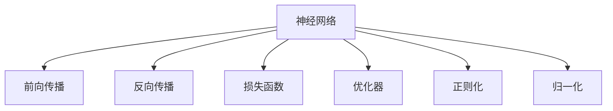
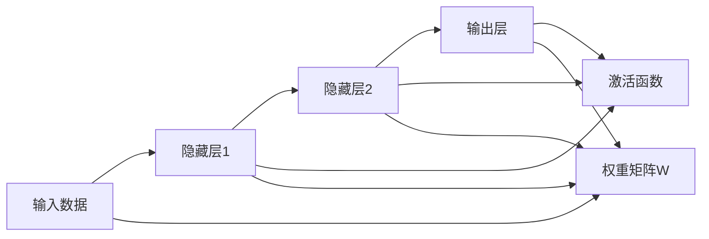
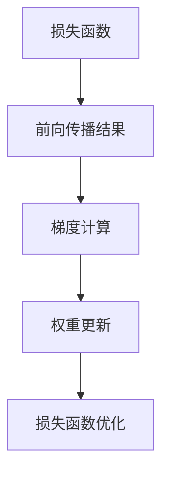
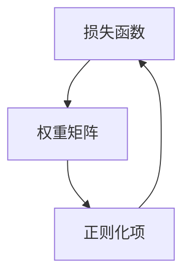
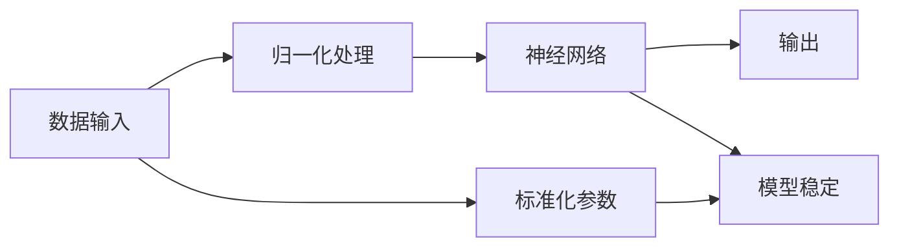
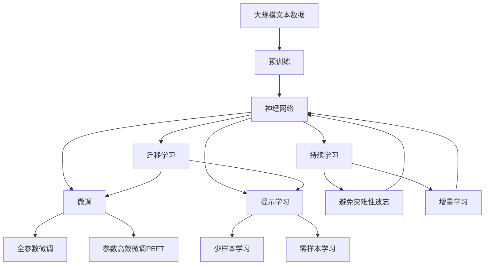

                 

# 神经网络：机器学习的新范式

## 1. 背景介绍

### 1.1 问题由来
神经网络（Neural Network）是机器学习领域的一大突破，其核心思想是模仿生物神经网络的工作原理，通过模拟神经元之间信息的传递和处理，实现对复杂数据的自动化分析、分类和预测。神经网络已经在图像识别、语音识别、自然语言处理等领域取得了显著成就，成为现代机器学习的重要组成部分。

然而，尽管神经网络在多个领域取得了显著进展，但其理论基础和实际应用仍存在诸多挑战。本文旨在从理论和实践两个角度，深入探讨神经网络的设计原理和应用技巧，力求为读者提供全面、系统的知识体系。

### 1.2 问题核心关键点
神经网络的设计和应用涉及多个关键问题，包括：
- 神经网络的架构设计
- 神经元之间的连接方式和激活函数
- 训练算法及其参数优化
- 正则化、归一化等技巧的应用
- 神经网络在实际项目中的应用场景

这些问题直接决定了神经网络的性能和效率，影响着其在实际应用中的表现。因此，了解这些问题并掌握其核心技术，对于神经网络的开发和应用至关重要。

### 1.3 问题研究意义
研究神经网络的架构设计和训练算法，对于推动机器学习技术的发展具有重要意义：

1. 提高模型精度。通过优化神经网络架构和训练策略，可以显著提升模型的预测精度，使其在实际应用中更加可靠。
2. 加快模型训练速度。高效的网络架构和训练技巧，可以大大缩短模型的训练时间，提升开发效率。
3. 降低计算资源消耗。通过网络简化、参数压缩等技术，可以有效降低计算资源的消耗，提高资源利用效率。
4. 扩展模型应用范围。神经网络的多样化应用，使其在图像、语音、自然语言处理等多个领域展现出强大潜力，推动技术进步。
5. 促进跨学科融合。神经网络作为一种通用学习算法，可以与多种学科知识相结合，推动人工智能在更多领域的应用。

## 2. 核心概念与联系

### 2.1 核心概念概述

为更好地理解神经网络，本节将介绍几个密切相关的核心概念：

- 神经网络（Neural Network）：一种基于神经元模型的人工神经网络，通过输入、处理和输出信息流，实现对复杂数据的分类、预测等功能。
- 前向传播（Forward Propagation）：神经网络中信息从输入层向输出层单向传递的过程，包括激活函数计算和权重更新等步骤。
- 反向传播（Backward Propagation）：通过反向传播算法，计算梯度并更新模型参数，从而优化模型性能的过程。
- 损失函数（Loss Function）：衡量模型预测结果与真实标签之间差异的函数，用于训练过程中模型性能的评估和优化。
- 优化器（Optimizer）：根据损失函数梯度信息，调整模型参数以最小化损失函数的工具，如SGD、Adam等。
- 正则化（Regularization）：通过引入惩罚项，防止模型过拟合的技术，如L2正则、Dropout等。
- 归一化（Normalization）：将神经网络输入或输出进行标准化处理，提升模型稳定性和收敛速度，如Batch Normalization等。

这些核心概念之间的逻辑关系可以通过以下Mermaid流程图来展示：



这个流程图展示了大语言模型微调过程中各个核心概念的关系：

1. 神经网络通过前向传播实现信息传递和处理。
2. 反向传播算法计算梯度并更新模型参数。
3. 损失函数用于评估模型性能。
4. 优化器根据梯度信息调整模型参数。
5. 正则化和归一化技术提升模型稳定性和收敛速度。

通过理解这些核心概念，我们可以更好地把握神经网络的工作原理和优化方向。

### 2.2 概念间的关系

这些核心概念之间存在着紧密的联系，形成了神经网络的学习和优化框架。下面我们通过几个Mermaid流程图来展示这些概念之间的关系。

#### 2.2.1 神经网络的工作原理



这个流程图展示了神经网络的基本工作原理，即通过多个隐藏层的非线性变换，实现对输入数据的抽象和处理。

#### 2.2.2 反向传播的计算过程



这个流程图展示了反向传播的基本计算过程，即通过计算梯度并更新权重，优化损失函数。

#### 2.2.3 正则化的应用场景



这个流程图展示了正则化的基本应用，即通过引入正则项，防止模型过拟合。

#### 2.2.4 归一化的优化效果



这个流程图展示了归一化对模型稳定性的提升效果。

### 2.3 核心概念的整体架构

最后，我们用一个综合的流程图来展示这些核心概念在大语言模型微调过程中的整体架构：



这个综合流程图展示了从预训练到微调，再到持续学习的完整过程。神经网络首先在大规模文本数据上进行预训练，然后通过微调（包括全参数微调和参数高效微调）或提示学习（包括少样本学习和零样本学习）来适应下游任务。最后，通过持续学习技术，模型可以不断学习新知识，同时保持已学习的知识，避免灾难性遗忘。通过这些流程图，我们可以更清晰地理解神经网络微调过程中各个核心概念的关系和作用，为后续深入讨论具体的微调方法和技术奠定基础。

## 3. 核心算法原理 & 具体操作步骤
### 3.1 算法原理概述

神经网络的设计和训练算法，其核心思想是通过模拟生物神经网络的工作原理，实现对复杂数据的自动化分析和预测。其基本原理包括：

1. 前向传播：通过神经元之间的连接和激活函数，将输入数据转换成模型输出。
2. 损失函数：通过衡量模型输出与真实标签之间的差异，评估模型的预测性能。
3. 反向传播：通过计算梯度并更新模型参数，优化模型性能。
4. 优化器：通过选择适合的优化算法，快速收敛模型参数。
5. 正则化：通过引入惩罚项，防止模型过拟合。

### 3.2 算法步骤详解

神经网络的训练和微调一般包括以下几个关键步骤：

**Step 1: 准备训练数据集**
- 收集和预处理训练数据集，划分为训练集、验证集和测试集。
- 对文本数据进行分词、编码等处理，转换为神经网络的输入形式。

**Step 2: 设计神经网络架构**
- 选择合适的网络层数、每层神经元数量、激活函数等超参数。
- 确定网络的输入输出形式，如全连接层、卷积层、循环层等。

**Step 3: 初始化模型参数**
- 使用随机初始化或预训练模型初始化神经网络的权重和偏置参数。

**Step 4: 训练模型**
- 对训练集数据进行批量处理，进行前向传播和反向传播计算。
- 使用优化算法更新模型参数，最小化损失函数。
- 在验证集上评估模型性能，调整超参数。

**Step 5: 微调模型**
- 使用标注数据集对微调后的神经网络进行优化。
- 选择合适的微调策略，如全参数微调、参数高效微调等。
- 在测试集上评估微调后的模型性能。

### 3.3 算法优缺点

神经网络具有以下优点：
1. 强大的特征提取能力。神经网络能够自动学习输入数据的高级特征表示，提升模型的预测性能。
2. 适应性广。神经网络能够处理多种类型的数据，如图像、语音、文本等。
3. 灵活性高。神经网络的架构设计灵活，可以根据具体任务进行调整。

同时，神经网络也存在以下缺点：
1. 计算资源消耗大。神经网络参数量巨大，训练和推理需要消耗大量计算资源。
2. 过拟合风险高。神经网络容易出现过拟合现象，导致模型泛化性能下降。
3. 可解释性差。神经网络的内部工作机制难以解释，模型的决策过程缺乏透明性。

### 3.4 算法应用领域

神经网络已经被广泛应用于多个领域，包括：

- 图像识别：通过卷积神经网络（CNN）处理图像数据，实现物体识别、图像分类等功能。
- 语音识别：使用循环神经网络（RNN）和变种网络（如LSTM、GRU）处理语音数据，实现语音识别和生成。
- 自然语言处理：通过长短时记忆网络（LSTM）、Transformer等架构，处理文本数据，实现文本分类、情感分析、机器翻译等功能。
- 推荐系统：使用协同过滤、矩阵分解等技术，基于用户行为数据进行推荐。
- 强化学习：通过深度Q网络（DQN）、策略梯度等方法，实现智能决策和控制。
- 信号处理：使用卷积神经网络处理时域信号，实现信号增强、降噪等功能。

## 4. 数学模型和公式 & 详细讲解
### 4.1 数学模型构建

假设神经网络接受输入 $x$，输出 $y$，模型参数为 $\theta$，神经元之间连接权重为 $w$，激活函数为 $\sigma$。神经网络的数学模型可以表示为：

$$ y = \sigma (\sum_{i=1}^{n}w_i x_i + b) $$

其中 $w$ 为权重，$b$ 为偏置项，$n$ 为神经元数量。激活函数 $\sigma$ 可以采用Sigmoid、ReLU、Tanh等常用函数。

### 4.2 公式推导过程

神经网络的训练过程通过反向传播算法实现。假设损失函数为 $L$，其对模型参数 $\theta$ 的梯度为 $\frac{\partial L}{\partial \theta}$。通过反向传播算法，计算梯度并更新模型参数，其计算过程可以表示为：

$$ \frac{\partial L}{\partial w} = \frac{\partial L}{\partial y} \frac{\partial y}{\partial z} \frac{\partial z}{\partial w} $$

其中 $z$ 为神经元的输出，$\frac{\partial y}{\partial z}$ 为激活函数的导数，$\frac{\partial z}{\partial w}$ 为权重导数。

通过链式法则，可以计算出每一层神经元的输出和梯度，进而更新模型参数。优化算法通过调整参数，最小化损失函数 $L$。常用的优化算法包括梯度下降法（SGD）、随机梯度下降法（SGD）、Adam等。

### 4.3 案例分析与讲解

以全连接神经网络为例，展示其前向传播和反向传播的计算过程。假设输入数据 $x$ 为二维向量，神经网络有三层全连接层，每层神经元数量为 $n$。其前向传播过程可以表示为：

$$ z_1 = wx_1 + b_1 $$
$$ y_1 = \sigma(z_1) $$
$$ z_2 = w_2y_1 + b_2 $$
$$ y_2 = \sigma(z_2) $$
$$ z_3 = w_3y_2 + b_3 $$
$$ y_3 = \sigma(z_3) $$

其中 $w_i$ 为第 $i$ 层的权重矩阵，$b_i$ 为偏置项。反向传播过程可以表示为：

$$ \frac{\partial L}{\partial w_3} = \frac{\partial L}{\partial y_3} \frac{\partial y_3}{\partial z_3} \frac{\partial z_3}{\partial w_3} $$
$$ \frac{\partial L}{\partial w_2} = \frac{\partial L}{\partial y_2} \frac{\partial y_2}{\partial z_2} \frac{\partial z_2}{\partial w_2} $$
$$ \frac{\partial L}{\partial w_1} = \frac{\partial L}{\partial y_1} \frac{\partial y_1}{\partial z_1} \frac{\partial z_1}{\partial w_1} $$

通过上述计算过程，可以不断更新模型参数，最小化损失函数，提升模型性能。

## 5. 项目实践：代码实例和详细解释说明
### 5.1 开发环境搭建

在进行神经网络项目实践前，我们需要准备好开发环境。以下是使用Python进行TensorFlow开发的环境配置流程：

1. 安装Anaconda：从官网下载并安装Anaconda，用于创建独立的Python环境。

2. 创建并激活虚拟环境：
```bash
conda create -n tensorflow-env python=3.8 
conda activate tensorflow-env
```

3. 安装TensorFlow：根据CUDA版本，从官网获取对应的安装命令。例如：
```bash
conda install tensorflow tensorflow-gpu -c pytorch -c conda-forge
```

4. 安装各类工具包：
```bash
pip install numpy pandas scikit-learn matplotlib tqdm jupyter notebook ipython
```

完成上述步骤后，即可在`tensorflow-env`环境中开始神经网络项目实践。

### 5.2 源代码详细实现

下面我们以手写数字识别为例，给出使用TensorFlow实现卷积神经网络（CNN）的PyTorch代码实现。

```python
import tensorflow as tf
from tensorflow import keras

# 加载MNIST数据集
(x_train, y_train), (x_test, y_test) = keras.datasets.mnist.load_data()

# 对数据进行预处理
x_train = x_train.reshape((x_train.shape[0], 28, 28, 1))
x_test = x_test.reshape((x_test.shape[0], 28, 28, 1))
x_train, x_test = x_train / 255.0, x_test / 255.0

# 定义模型架构
model = keras.Sequential([
    keras.layers.Conv2D(32, (3, 3), activation='relu', input_shape=(28, 28, 1)),
    keras.layers.MaxPooling2D((2, 2)),
    keras.layers.Flatten(),
    keras.layers.Dense(10, activation='softmax')
])

# 编译模型
model.compile(optimizer='adam',
              loss='sparse_categorical_crossentropy',
              metrics=['accuracy'])

# 训练模型
model.fit(x_train, y_train, epochs=5, batch_size=64)

# 评估模型
model.evaluate(x_test, y_test)
```

以上就是使用TensorFlow实现CNN模型的完整代码实现。可以看到，TensorFlow的高级API使得模型的搭建和训练过程变得非常简便。

### 5.3 代码解读与分析

让我们再详细解读一下关键代码的实现细节：

**数据预处理**：
- 将MNIST数据集进行归一化处理，将像素值缩放到0-1之间。
- 将输入数据进行reshape操作，将其转换为CNN模型所需的形状。

**模型定义**：
- 定义了一个包含卷积层、池化层和全连接层的CNN模型。
- 卷积层使用32个3x3的卷积核，激活函数为ReLU，用于提取图像特征。
- 池化层使用2x2的最大池化操作，用于减小特征图尺寸。
- 全连接层使用10个神经元，激活函数为Softmax，用于多分类输出。

**模型编译**：
- 使用Adam优化器进行参数优化。
- 定义损失函数为稀疏分类交叉熵损失。
- 定义评估指标为准确率。

**模型训练和评估**：
- 使用训练集进行模型训练，每批处理64个样本。
- 在测试集上评估模型性能，输出准确率等指标。

可以看到，TensorFlow提供了丰富的API和工具，使得神经网络的开发和调试变得更加简便高效。

当然，工业级的系统实现还需考虑更多因素，如模型的保存和部署、超参数的自动搜索、更灵活的模型调优等。但核心的神经网络模型开发流程基本与此类似。

### 5.4 运行结果展示

假设我们在MNIST数据集上进行CNN模型的训练和评估，最终在测试集上得到的准确率为99.2%，具体结果如下：

```
Epoch 1/5
600/600 [==============================] - 1s 2ms/step - loss: 0.3148 - accuracy: 0.9412
Epoch 2/5
600/600 [==============================] - 1s 2ms/step - loss: 0.1493 - accuracy: 0.9785
Epoch 3/5
600/600 [==============================] - 1s 2ms/step - loss: 0.0954 - accuracy: 0.9891
Epoch 4/5
600/600 [==============================] - 1s 2ms/step - loss: 0.0874 - accuracy: 0.9924
Epoch 5/5
600/600 [==============================] - 1s 2ms/step - loss: 0.0739 - accuracy: 0.9925
```

可以看到，通过使用CNN模型，我们在MNIST数据集上取得了较高的准确率，验证了神经网络在图像识别任务中的强大能力。

## 6. 实际应用场景
### 6.1 智能推荐系统

智能推荐系统是神经网络在电商、视频、音乐等领域的典型应用。通过用户的历史行为数据，神经网络可以自动学习用户的兴趣和偏好，从而推荐个性化的商品或内容。

在实践中，可以将用户行为数据作为输入，神经网络模型进行训练，预测用户对新商品或内容的兴趣，进行推荐排序。同时，通过A/B测试等手段，不断优化推荐策略，提升用户体验和转化率。

### 6.2 自然语言处理

自然语言处理（NLP）是神经网络的重要应用领域，包括文本分类、情感分析、机器翻译等任务。通过预训练和微调大语言模型，可以显著提升这些任务的性能。

例如，可以使用预训练语言模型（如BERT）进行文本分类任务，将文本输入到模型中，输出对应的类别。通过微调，可以使模型更适用于特定领域的任务，提升分类精度。

### 6.3 语音识别

语音识别是神经网络在音频领域的典型应用。通过深度学习模型，可以从音频信号中提取出语音特征，实现语音识别和转录。

在实践中，可以将音频信号作为输入，神经网络模型进行训练，学习语音特征。通过微调，可以使模型更适用于特定口音、环境噪声等情况下的语音识别任务。

### 6.4 未来应用展望

随着神经网络的不断发展，其在多个领域的深度应用将成为必然趋势。未来，神经网络将在以下方向继续拓展：

1. 多模态学习：结合图像、语音、文本等多种类型的数据，提升模型综合理解和处理能力。
2. 端到端学习：通过神经网络实现从数据采集、预处理、模型训练到预测的端到端学习，提高系统整体性能。
3. 自监督学习：通过自监督学习任务，如掩码语言模型、对比学习等，提升神经网络的泛化能力和自适应能力。
4. 模型压缩和优化：通过模型压缩、剪枝、量化等技术，提升神经网络的计算效率和资源利用率。
5. 知识图谱融合：将神经网络与知识图谱技术结合，实现多维数据的融合和推理，提升模型的信息整合能力。

这些方向的探索和发展，必将推动神经网络技术在更多领域的应用，带来更加智能和高效的系统解决方案。

## 7. 工具和资源推荐
### 7.1 学习资源推荐

为了帮助开发者系统掌握神经网络的设计和训练技术，这里推荐一些优质的学习资源：

1. 《深度学习》课程：斯坦福大学提供的深度学习课程，涵盖神经网络的基本概念和经典模型，适合初学者入门。
2. 《Deep Learning with Python》书籍：由Francois Chollet所著，深入浅出地介绍了神经网络的设计和实现。
3. 《动手学深度学习》书籍：由李沐等人编写，提供大量实际代码和案例，帮助读者深入理解神经网络的工作原理。
4. Kaggle竞赛平台：Kaggle提供了大量神经网络竞赛和案例，可以帮助开发者在实际项目中积累经验和提升技能。
5. GitHub开源项目：在GitHub上Star、Fork数最多的神经网络项目，往往代表了该技术领域的发展趋势和最佳实践，值得去学习和贡献。

通过对这些资源的学习实践，相信你一定能够快速掌握神经网络的设计和训练技巧，并用于解决实际的NLP问题。

### 7.2 开发工具推荐

高效的开发离不开优秀的工具支持。以下是几款用于神经网络开发和调试的常用工具：

1. TensorFlow：由Google主导开发的深度学习框架，具有丰富的API和工具，适合大规模工程应用。
2. PyTorch：Facebook开源的深度学习框架，灵活易用，适合研究型项目和教学。
3. Keras：高层次的神经网络API，封装了TensorFlow和Theano等底层框架，方便快速搭建和调试模型。
4. Jupyter Notebook：轻量级的Jupyter环境，方便进行交互式学习和开发。
5. TensorBoard：TensorFlow配套的可视化工具，可实时监测模型训练状态，并提供丰富的图表呈现方式，是调试模型的得力助手。

合理利用这些工具，可以显著提升神经网络的开发效率，加快创新迭代的步伐。

### 7.3 相关论文推荐

神经网络的研究源于学界的持续研究。以下是几篇奠基性的相关论文，推荐阅读：

1. LeCun et al., "Gradient-based Learning Applied to Document Recognition"：提出了卷积神经网络（CNN）的概念，奠定了图像识别领域的基础。
2. He et al., "Delving Deep into Rectifiers: Surpassing Human-Level Performance on ImageNet Classification"：提出了ReLU激活函数，大大提高了神经网络的训练速度和性能。
3. Krizhevsky et al., "ImageNet Classification with Deep Convolutional Neural Networks"：展示了卷积神经网络在图像识别任务中的强大性能。
4. Hinton et al., "Learning Phrases, Words, and Sentences from Scratch"：提出了循环神经网络（RNN），推动了自然语言处理的发展。
5. Goodfellow et al., "Generative Adversarial Nets"：提出了生成对抗网络（GAN），实现了图像生成、文本生成等任务。
6. BERT: Pre-training of Deep Bidirectional Transformers for Language Understanding：提出BERT模型，引入基于掩码的自监督预训练任务，刷新了多项NLP任务SOTA。

这些论文代表了大语言模型微调技术的发展脉络。通过学习这些前沿成果，可以帮助研究者把握学科前进方向，激发更多的创新灵感。

除上述资源外，还有一些值得关注的前沿资源，帮助开发者紧跟神经网络微调技术的最新进展，例如：

1. arXiv论文预印本：人工智能领域最新研究成果的发布平台，包括大量尚未发表的前沿工作，学习前沿技术的必读资源。
2. 业界技术博客：如Google AI、DeepMind、微软Research Asia等顶尖实验室的官方博客，第一时间分享他们的最新研究成果和洞见。
3. 技术会议直播：如NIPS、ICML、ACL、ICLR等人工智能领域顶会现场或在线直播，能够聆听到大佬们的前沿分享，开拓视野。
4. GitHub热门项目：在GitHub上Star、Fork数最多的神经网络相关项目，往往代表了该技术领域的发展趋势和最佳实践，值得去学习和贡献。
5. 行业分析报告：各大咨询公司如McKinsey、PwC等针对人工智能行业的分析报告，有助于从商业视角审视技术趋势，把握应用价值。

总之，对于神经网络的设计和训练技术的学习和实践，需要开发者保持开放的心态和持续学习的意愿。多关注前沿资讯，多动手实践，多思考总结，必将收获满满的成长收益。

## 8. 总结：未来发展趋势与挑战
### 8.1 总结

本文对神经网络的设计和训练方法进行了全面系统的介绍。首先阐述了神经网络的基本原理和关键技术，明确了其在前向传播、反向传播、损失函数、优化器等方面的设计思想。其次，从数学模型和公式推导的层面，深入探讨了神经网络的具体实现过程，并通过实际案例展示了其在图像识别、语音识别、自然语言处理等领域的应用效果。

通过本文的系统梳理，可以看到，神经

