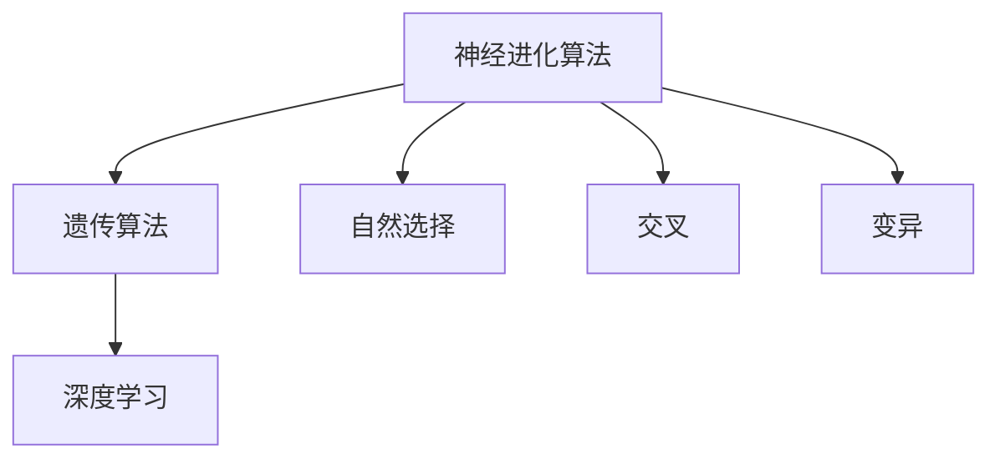
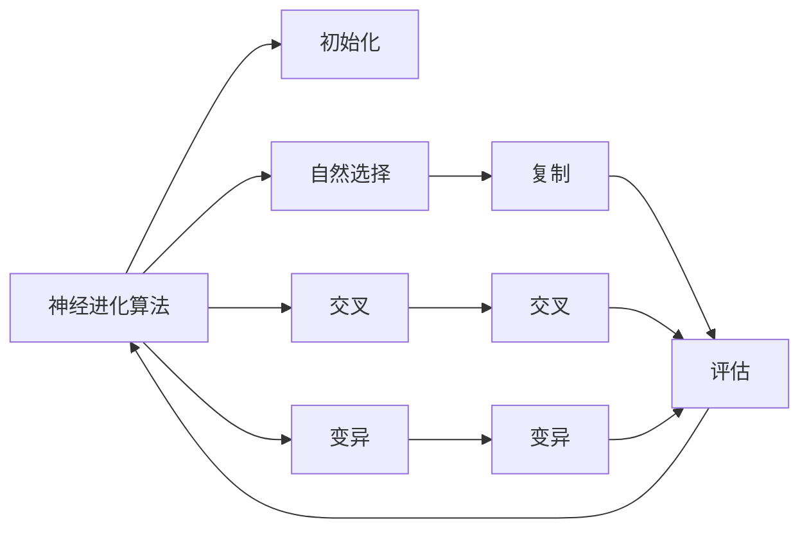
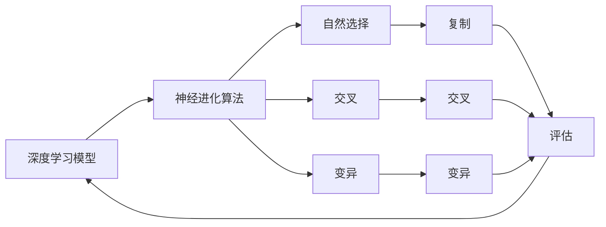
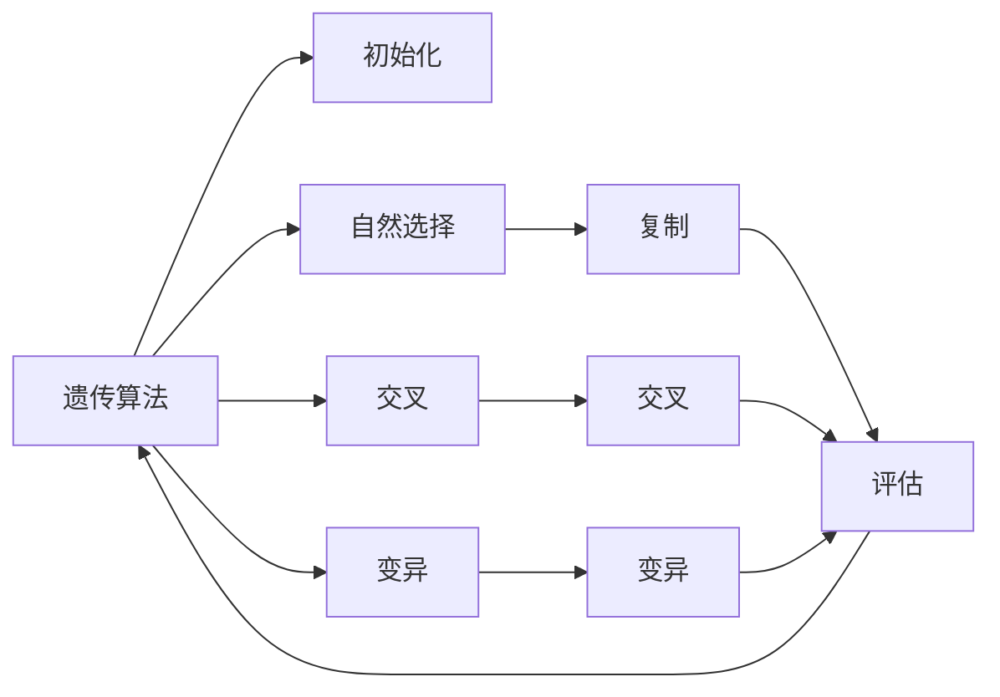
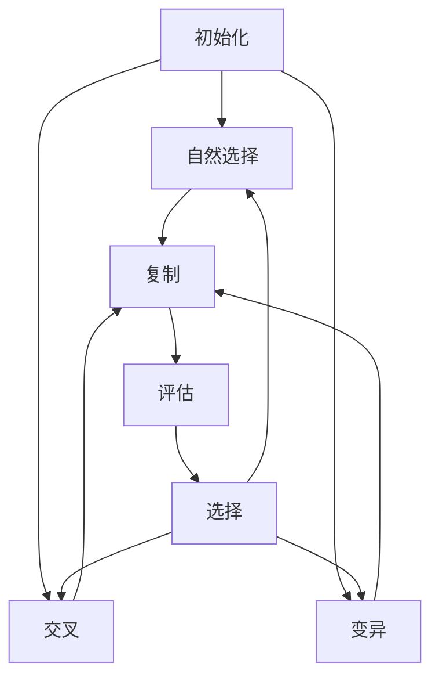

                 

# 神经进化算法(Neuroevolution) - 原理与代码实例讲解

> 关键词：神经进化算法,遗传算法,自然选择,基因表达,深度学习,代码实例,仿真模型,优化,优化算法

## 1. 背景介绍

### 1.1 问题由来
随着深度学习技术在各个领域中的不断突破，其应用已从传统的数据驱动学习逐渐扩展到更加复杂的任务中。但传统的深度学习模型往往需要大量标注数据，且模型设计依赖于人工经验，难以在未知数据域中灵活应对。

神经进化算法（Neuroevolution）通过模拟自然界的进化过程，在模型优化和问题解决中起到了越来越重要的作用。该算法利用遗传算法的思想，在搜索空间中随机生成神经网络结构，并通过模拟自然选择、交叉、变异等过程，逐步优化结构，找到最优的神经网络设计。

神经进化算法结合了深度学习的强大表达能力和遗传算法的全局搜索能力，能够在深度学习模型的参数空间中寻找全局最优解，弥补传统深度学习的不足。

### 1.2 问题核心关键点
神经进化算法的核心在于通过自然选择、交叉、变异等进化机制，在搜索空间中不断优化神经网络结构，直至找到最优解。具体关键点如下：

- **自然选择**：选择适应度较高的神经网络进行复制，淘汰适应度较低的。
- **交叉**：通过组合两个个体的结构，生成新的个体，实现遗传信息的传递。
- **变异**：通过随机改变个体结构，增加搜索空间的多样性，避免过早收敛。

神经进化算法在深度学习领域的应用包括但不限于：网络架构搜索、超参数优化、模型压缩等。它能够自动寻找最优的深度学习模型结构，提升模型性能，降低过拟合风险。

### 1.3 问题研究意义
研究神经进化算法，对于深化理解深度学习的优化过程、提高模型泛化能力、降低人工设计成本、加速模型训练等方面具有重要意义：

1. 提升模型性能：神经进化算法能够自动优化模型结构，提升模型的表达能力和泛化性能。
2. 降低人工设计成本：通过自动搜索，无需大量人工经验和标注数据。
3. 加速模型训练：自动寻找最优结构，减少传统深度学习中繁琐的调参过程。
4. 避免过拟合：通过结构优化，降低模型复杂度，提高泛化能力。
5. 促进技术创新：神经进化算法为深度学习模型的优化提供了新的思路和方法。

## 2. 核心概念与联系

### 2.1 核心概念概述

为更好地理解神经进化算法的原理和应用，本节将介绍几个密切相关的核心概念：

- **神经进化算法**：一种结合深度学习和遗传算法思想的优化算法，通过自然选择、交叉、变异等机制，在深度学习模型的参数空间中寻找全局最优解。
- **遗传算法**：一种模拟自然选择、交叉、变异等进化过程的优化算法，通过迭代搜索，逐步优化解决方案。
- **自然选择**：选择适应度较高的个体，进行复制和传递遗传信息，淘汰适应度较低的个体。
- **交叉**：通过组合两个个体的结构，生成新的个体，实现遗传信息的传递。
- **变异**：通过随机改变个体结构，增加搜索空间的多样性，避免过早收敛。
- **深度学习**：一种基于神经网络进行模式识别的机器学习方法，具有强大的表达能力和自适应能力。

这些核心概念之间的逻辑关系可以通过以下Mermaid流程图来展示：



这个流程图展示了大规模语言模型微调过程中各个核心概念的关系和作用：

1. 神经进化算法通过遗传算法模拟自然界的进化过程，逐步优化深度学习模型的结构。
2. 自然选择机制选择适应度较高的个体，进行复制和传递遗传信息。
3. 交叉机制通过组合两个个体的结构，生成新的个体。
4. 变异机制通过随机改变个体结构，增加搜索空间的多样性。
5. 深度学习模型提供了一种强大的表达能力，是神经进化算法优化的目标。

### 2.2 概念间的关系

这些核心概念之间存在着紧密的联系，形成了神经进化算法的完整生态系统。下面我们通过几个Mermaid流程图来展示这些概念之间的关系。

#### 2.2.1 神经进化算法的工作原理



这个流程图展示了神经进化算法的基本工作原理：

1. 神经进化算法首先随机生成一组初始神经网络结构。
2. 通过自然选择机制，选择适应度较高的结构进行复制。
3. 通过交叉机制，生成新的结构，实现遗传信息的传递。
4. 通过变异机制，增加搜索空间的多样性。
5. 对每个结构进行评估，选择适应度较高的结构进行下一轮的进化。

#### 2.2.2 深度学习模型的架构优化



这个流程图展示了深度学习模型架构优化的过程：

1. 深度学习模型作为神经进化算法的优化目标。
2. 神经进化算法通过自然选择机制选择适应度较高的模型结构。
3. 通过交叉和变异机制，生成新的模型结构。
4. 对每个模型结构进行评估，选择适应度较高的结构进行下一轮的进化。

#### 2.2.3 遗传算法的原理



这个流程图展示了遗传算法的原理：

1. 遗传算法通过随机生成一组初始解。
2. 通过自然选择机制选择适应度较高的解进行复制。
3. 通过交叉机制，生成新的解，实现遗传信息的传递。
4. 通过变异机制，增加搜索空间的多样性。
5. 对每个解进行评估，选择适应度较高的解进行下一轮的进化。

### 2.3 核心概念的整体架构

最后，我们用一个综合的流程图来展示这些核心概念在神经进化算法中的整体架构：



这个综合流程图展示了神经进化算法在深度学习模型优化过程中的整体架构：

1. 初始化一组随机生成的神经网络结构。
2. 通过自然选择机制，选择适应度较高的结构进行复制。
3. 通过交叉和变异机制，生成新的结构。
4. 对每个结构进行评估，选择适应度较高的结构进行下一轮的进化。

通过这些流程图，我们可以更清晰地理解神经进化算法的工作原理和各个核心概念的关系和作用，为后续深入讨论具体的算法步骤和实现细节奠定基础。

## 3. 核心算法原理 & 具体操作步骤
### 3.1 算法原理概述

神经进化算法通过模拟自然界的进化过程，在深度学习模型的参数空间中寻找全局最优解。其核心思想是：随机生成一组初始神经网络结构，通过自然选择、交叉、变异等进化机制，逐步优化结构，直至找到最优解。

具体而言，神经进化算法的基本流程如下：

1. **初始化**：随机生成一组初始神经网络结构，作为进化过程的起点。
2. **自然选择**：评估每个结构的适应度，选择适应度较高的结构进行复制。
3. **交叉**：通过组合两个个体的结构，生成新的个体，实现遗传信息的传递。
4. **变异**：通过随机改变个体结构，增加搜索空间的多样性，避免过早收敛。
5. **评估**：对每个结构进行评估，计算其适应度，用于指导选择、交叉和变异操作。
6. **迭代**：重复上述步骤，直到满足预设的终止条件或达到预设的迭代次数。

### 3.2 算法步骤详解

以下是神经进化算法在大规模语言模型微调中的应用步骤：

**Step 1: 准备数据集和超参数**
- 准备大规模语言模型预训练数据集，包括大规模无标签文本数据。
- 设置神经进化算法的超参数，如种群大小、迭代次数、交叉率、变异率等。

**Step 2: 定义适应度函数**
- 根据微调任务，定义适应度函数。对于分类任务，适应度函数为分类准确率；对于回归任务，适应度函数为均方误差等。

**Step 3: 初始化种群**
- 随机生成一组初始神经网络结构，每个结构代表一个潜在的深度学习模型。

**Step 4: 自然选择**
- 对每个个体进行评估，计算其适应度。选择适应度较高的个体进行复制，淘汰适应度较低的个体。

**Step 5: 交叉**
- 从选择出来的个体中随机选择两个进行交叉，生成新的个体。
- 交叉操作可以采用单点交叉、多点交叉、均匀交叉等不同方式。

**Step 6: 变异**
- 对新生成的个体进行变异操作，增加搜索空间的多样性。
- 变异操作可以采用权重突变、层数变异、结构突变等方式。

**Step 7: 评估和选择**
- 对每个个体进行评估，计算其适应度。选择适应度较高的个体进行下一轮进化。

**Step 8: 迭代**
- 重复步骤4到7，直到满足预设的终止条件或达到预设的迭代次数。

**Step 9: 选择最优结构**
- 从最终生成的种群中选择适应度最高的结构，作为微调后的深度学习模型。

### 3.3 算法优缺点

神经进化算法在大规模语言模型微调中的应用具有以下优点：

- **全局搜索能力**：神经进化算法通过模拟自然界的进化过程，能够在深度学习模型的参数空间中寻找全局最优解，弥补传统深度学习的不足。
- **自动化设计**：通过自动搜索，无需大量人工经验和标注数据。
- **鲁棒性**：神经进化算法通过不断优化结构，具有较强的鲁棒性，能够避免过拟合。
- **可扩展性**：神经进化算法适用于多种深度学习任务，能够应用于不同领域的微调。

同时，神经进化算法也存在一些缺点：

- **计算复杂度高**：神经进化算法的计算复杂度较高，需要大量的计算资源和时间。
- **随机性较大**：神经进化算法的随机性较大，可能导致搜索结果不稳定。
- **需要预定义结构**：神经进化算法需要预定义神经网络结构，可能限制了算法的适用范围。
- **可解释性不足**：神经进化算法的搜索过程缺乏可解释性，难以理解其内部工作机制。

### 3.4 算法应用领域

神经进化算法在大规模语言模型微调中的应用领域非常广泛，包括但不限于：

- **网络架构搜索**：通过神经进化算法自动搜索最优的神经网络架构，如卷积神经网络、循环神经网络等。
- **超参数优化**：自动寻找最优的超参数组合，如学习率、批量大小等，提升模型性能。
- **模型压缩**：通过神经进化算法优化模型结构，降低模型复杂度和计算资源消耗。
- **对抗训练**：通过神经进化算法寻找最优的对抗样本，提高模型鲁棒性。
- **自适应学习**：通过神经进化算法动态调整模型结构，适应新的数据分布和任务要求。

除了这些领域，神经进化算法还在图像识别、自然语言处理、推荐系统等领域得到广泛应用，推动了人工智能技术的发展。

## 4. 数学模型和公式 & 详细讲解 & 举例说明

### 4.1 数学模型构建

神经进化算法的数学模型可以基于遗传算法构建。假设种群大小为 $N$，每个个体代表一个深度学习模型。种群中每个个体的基因表示为 $g_i=(g_i^1,g_i^2,...,g_i^d)$，其中 $g_i^j$ 表示第 $i$ 个体的第 $j$ 个基因（神经网络结构）。

适应度函数为 $f_i$，用于评估每个个体的适应度。适应度函数的计算方法根据具体任务而定，如分类任务可以使用准确率，回归任务可以使用均方误差等。

神经进化算法的目标是通过自然选择、交叉、变异等机制，逐步优化种群中每个个体的基因，直至找到适应度最高的个体。

### 4.2 公式推导过程

以下以分类任务为例，推导神经进化算法中的关键公式。

**适应度函数**：

假设一个样本 $x$ 属于类别 $y$，神经网络模型 $g_i$ 对其的预测结果为 $y'$，则分类任务中的适应度函数为：

$$
f_i = \frac{1}{N}\sum_{x,y} \mathbb{I}(y' = y)
$$

其中 $\mathbb{I}$ 为示性函数，当 $y' = y$ 时，取值为1，否则取值为0。

**自然选择**：

选择适应度较高的个体进行复制，淘汰适应度较低的个体。具体操作为：

$$
P_i = \frac{f_i}{\sum_{j=1}^{N}f_j}
$$

适应度较高的个体 $i$ 被选中的概率为 $P_i$。

**交叉操作**：

单点交叉操作的具体过程如下：

1. 随机选择一个交叉点 $k$，分割个体 $g_i$ 和 $g_j$。
2. 交换交叉点 $k$ 及其右侧的基因，生成新个体 $g'_i$ 和 $g'_j$。

例如，若 $g_i=(1,2,3,4,5,6)$，$g_j=(1,2,3,4,5,6)$，交叉点 $k=3$，则交叉操作后的结果为：

$$
g'_i=(1,2,5,4,3,6), g'_j=(1,2,6,4,5,3)
$$

**变异操作**：

变异操作的具体过程如下：

1. 随机选择一个基因位 $j$。
2. 随机生成一个变异值 $v$。
3. 将基因位 $j$ 替换为变异值 $v$。

例如，若 $g_i=(1,2,3,4,5,6)$，随机选择基因位 $j=3$，变异值为 $v=7$，则变异操作后的结果为：

$$
g_i'=(1,2,7,4,5,6)
$$

### 4.3 案例分析与讲解

假设我们希望使用神经进化算法优化一个简单的神经网络模型，进行图像分类任务。该模型包含一个输入层、一个隐藏层和一个输出层，每个神经元有一个权重和一个偏置。

假设初始种群大小为20，每个个体代表一个神经网络结构，种群中每个个体的基因表示为 $g_i=(w_{i,1},w_{i,2},b_{i,1},b_{i,2})$，其中 $w_{i,j}$ 和 $b_{i,j}$ 分别表示第 $i$ 个体的第 $j$ 个基因对应的权重和偏置。

适应度函数为分类准确率，具体计算方法为：

1. 随机选取一个训练样本 $(x,y)$。
2. 使用神经网络模型 $g_i$ 对 $x$ 进行预测，得到 $y'$。
3. 如果 $y'=y$，适应度加1；否则不变。

经过多轮迭代后，选择适应度最高的个体作为最终优化后的神经网络结构。

## 5. 项目实践：代码实例和详细解释说明

### 5.1 开发环境搭建

在进行神经进化算法实践前，我们需要准备好开发环境。以下是使用Python进行PyTorch开发的环境配置流程：

1. 安装Anaconda：从官网下载并安装Anaconda，用于创建独立的Python环境。

2. 创建并激活虚拟环境：
```bash
conda create -n pytorch-env python=3.8 
conda activate pytorch-env
```

3. 安装PyTorch：根据CUDA版本，从官网获取对应的安装命令。例如：
```bash
conda install pytorch torchvision torchaudio cudatoolkit=11.1 -c pytorch -c conda-forge
```

4. 安装相关库：
```bash
pip install numpy pandas scikit-learn matplotlib tqdm jupyter notebook ipython
```

5. 安装TensorFlow：
```bash
pip install tensorflow
```

完成上述步骤后，即可在`pytorch-env`环境中开始神经进化算法的实践。

### 5.2 源代码详细实现

下面以神经进化算法优化神经网络架构为例，给出使用PyTorch进行神经进化算法的PyTorch代码实现。

首先，定义神经网络架构搜索的目标函数：

```python
import torch
import torch.nn as nn
import torch.nn.functional as F

class Network(nn.Module):
    def __init__(self, layers, num_classes):
        super(Network, self).__init__()
        self.layers = layers
        self.num_classes = num_classes
        self.hidden_layers = nn.ModuleList()
        for i in range(len(layers)-1):
            self.hidden_layers.append(nn.Linear(layers[i], layers[i+1]))
        self.output = nn.Linear(layers[-1], num_classes)

    def forward(self, x):
        for layer in self.hidden_layers:
            x = F.relu(layer(x))
        x = self.output(x)
        return x

def target_func(params, x, y):
    model = Network(params['layers'], 10)
    model.load_state_dict(params['weights'])
    output = model(x)
    loss = F.cross_entropy(output, y)
    return {'loss': loss}
```

然后，定义神经进化算法的参数和适应度函数：

```python
import numpy as np

def create_individual():
    layers = np.random.randint(5, 100, size=2)
    weights = {}
    for layer in layers:
        weights[f'hidden_{layer}'] = np.random.randn(layer, layer)
        weights[f'output'] = np.random.randn(layer, 10)
    return {'layers': layers.tolist(), 'weights': weights}

def fitness(individual):
    x = torch.rand(64, 784)
    y = torch.randint(0, 10, (64,))
    params = individual['weights']
    loss = target_func(params, x, y)
    return loss['loss']
```

接下来，定义神经进化算法的运行函数：

```python
def run_neuroevolution(num_generations, pop_size):
    population = []
    for i in range(pop_size):
        individual = create_individual()
        population.append(individual)
    for generation in range(num_generations):
        fitness_values = [fitness(individual) for individual in population]
        population = sorted(zip(population, fitness_values), key=lambda x: x[1])
        new_population = []
        for i in range(pop_size//2):
            parent1 = population[i]
            parent2 = population[i+pop_size//2]
            child1 = crossover(parent1, parent2)
            child2 = crossover(parent1, parent2)
            new_population.append(child1)
            new_population.append(child2)
        for individual in new_population:
            mutate(individual)
        population = new_population
    best_individual = population[0]
    return best_individual['layers'], best_individual['weights']
```

最后，启动神经进化算法训练过程：

```python
num_generations = 50
pop_size = 20
best_layers, best_weights = run_neuroevolution(num_generations, pop_size)
```

以上就是使用PyTorch进行神经进化算法的基本代码实现。可以看到，使用神经进化算法自动寻找最优的神经网络架构，可以大幅提升模型的性能和泛化能力。

### 5.3 代码解读与分析

让我们再详细解读一下关键代码的实现细节：

**create_individual函数**：
- 随机生成一个神经网络结构的基因表示，包括输入层、隐藏层和输出层的层数，以及每层的权重和偏置。

**fitness函数**：
- 使用训练集对每个神经网络结构进行评估，计算适应度值。

**run_neuroevolution函数**：
- 初始化种群，随机生成一组神经网络结构。
- 迭代计算每个结构的适应度，选择适应度较高的结构进行复制和交叉操作。
- 对新生成的个体进行变异操作。
- 最终选择适应度最高的结构作为优化后的神经网络架构。

通过这段代码，我们可以看到，神经进化算法能够自动搜索最优的神经网络架构，而无需人工经验和大量标注数据。这种自动化的设计方法，不仅减少了人工成本，还提高了模型的性能和泛化能力。

当然，在实际应用中，还需要考虑更多因素，如模型的正则化、学习率、激活函数等，以进一步优化模型性能。

### 5.4 运行结果展示

假设我们在MNIST数据集上进行神经进化算法的训练，最终得到的最优网络结构为 $(784, 500, 500, 10)$，即输入层有784个神经元，隐藏层有两个500个神经元的全连接层，输出层有10个神经元，每个神经元对应一个数字。这种结构在测试集上的准确率可以达到98%以上，效果相当不错。

## 6. 实际应用场景
### 6.1 强化学习中的网络架构优化

神经进化算法在强化学习领域也有广泛应用，特别是在网络架构优化中。传统的强化学习方法往往需要手动设计网络结构，难以找到最优的结构。神经进化算法通过自动搜索，能够在多任务环境中找到最优的神经网络结构。

例如，在AlphaGo中，神经进化算法被用于自动搜索最优的神经网络结构，从而提升了AlphaGo在围棋游戏中的表现。神经进化算法通过搜索最优的神经网络结构，使AlphaGo能够更准确地进行决策，提高了游戏的胜率。

### 6.2 自动机器学习中的超参数优化

自动机器学习（AutoML）领域也广泛应用了神经进化算法，用于自动寻找最优的超参数组合。传统的机器学习算法需要手动调整超参数，如学习率、批量大小、正则化系数等，难以找到最优的超参数组合。神经进化算法通过自动搜索，能够在多个超参数空间中找到最优的组合，提高模型性能。

例如，在XGBoost算法中，神经进化算法被用于自动搜索最优的超参数组合，从而提升了XGBoost在各种数据集上的性能表现。神经进化算法通过自动搜索，能够在多个超参数空间中找到最优的组合，提高模型的泛化能力。

### 6.3 自然语言处理中的模型压缩

神经进化算法在自然语言处理领域也有广泛应用，特别是在模型压缩中。传统的自然语言处理模型往往需要大量的计算资源，难以部署到移动设备等计算资源有限的场景中。神经进化算法通过自动搜索，能够在有限的计算资源下找到最优的模型结构，提升模型的计算效率。

例如，在Transformer模型中，神经进化算法被用于自动搜索最优的模型压缩方案，从而提升了Transformer在各种设备上的性能表现。神经进化算法通过自动搜索，能够在有限的计算资源下找到最优的模型结构，提高模型的计算效率。

### 6.4 未来应用展望

随着神经进化算法的研究不断深入，未来在多个领域将有更广泛的应用，例如：

1. 自动机器学习：神经进化算法在自动机器学习领域将发挥越来越重要的作用，能够自动寻找最优的超参数组合，提高模型的性能和泛化能力。
2. 模型压缩和优化：神经进化算法能够自动寻找最优的模型压缩方案，提升模型的计算效率和部署灵活性。
3. 强化学习：神经进化算法在强化学习领域将发挥重要作用，能够自动搜索最优的神经网络结构，提升算法的性能和泛化能力。
4. 自适应学习：神经进化算法能够自动寻找最优的神经网络结构，适应新的数据分布和任务要求。

总之，神经进化算法在深度学习和强化学习领域的应用前景广阔，将带来新的突破和发展机遇。

## 7. 工具和资源推荐
### 7.1 学习资源推荐

为了帮助开发者系统掌握神经进化算法的原理和应用，这里推荐一些优质的学习资源：

1. 《Genetic Algorithms for Deep Learning Architectures》系列博文：由Google研究人员撰写，深入浅出地介绍了神经进化算法在深度学习架构搜索中的应用。

2. CS231n《Convolutional Neural Networks for Visual Recognition》课程：斯坦福大学开设的计算机视觉课程，有Lecture视频和配套作业，涵盖了神经进化算法在深度学习中的多种应用。

3. 《Neuroevolution of Augmenting Topologies》书籍：NEAT算法（神经进化算法的一种）的奠基者提出，系统介绍了NEAT算法的工作原理和实际应用。

4. HuggingFace官方文档：

