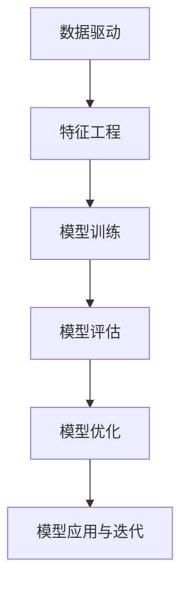
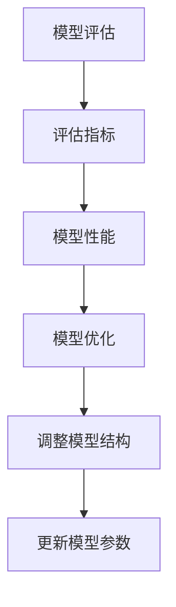
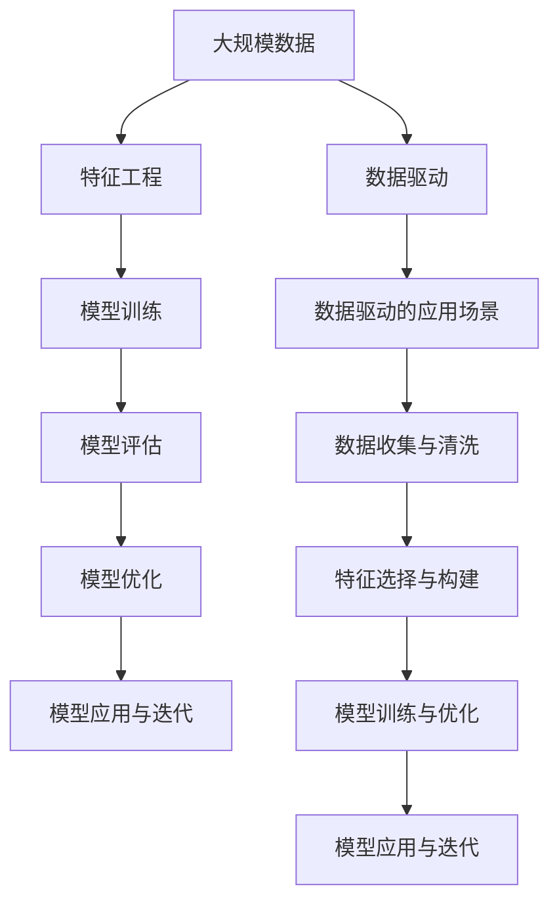

                 

# 科学方法：从观察到实验

> 关键词：科学方法, 数据驱动, 数据科学, 统计学, 机器学习, 因果推理

## 1. 背景介绍

### 1.1 问题由来
在现代科技的发展过程中，科学方法一直是推动人类进步的重要手段。从古希腊哲学家亚里士多德的“自然哲学”到伽利略的“实证主义”，再到现代物理学中的量子力学、相对论，科学方法始终贯穿其中。在计算机科学领域，科学方法同样发挥着至关重要的作用，特别是在数据驱动的AI技术发展中。

随着大数据和机器学习技术的成熟，科学方法在AI中的应用日益广泛，不仅用于模型构建、算法优化，还深入到模型的评估和迭代改进中。数据驱动的AI技术要求从观察到实验，再到模型评估和优化，形成一个闭环的系统。本文将详细探讨科学方法在数据驱动的AI技术中的应用，帮助读者理解从观察到实验的科学方法论，以及如何通过科学方法提高AI系统的性能。

### 1.2 问题核心关键点
科学方法的核心在于从观察到实验，再到理论的建立和验证。在AI技术中，这一过程体现在以下几个方面：

1. **数据收集**：通过大规模的数据收集，捕捉现实世界中的各种现象和规律。
2. **数据处理与特征工程**：对收集到的数据进行预处理和特征工程，构建合适的特征集，为模型训练提供数据基础。
3. **模型训练**：使用机器学习算法对特征集进行训练，构建能够拟合数据的模型。
4. **模型评估**：通过各类评估指标对训练好的模型进行评估，确保模型性能符合预期。
5. **模型优化**：根据评估结果，优化模型结构和参数，提高模型性能。
6. **模型应用与迭代**：将优化后的模型应用于实际场景，不断收集新数据，迭代改进模型，提升系统性能。

这一过程是一个循环往复的过程，每一次循环都会带来模型性能的提升，从而实现AI技术的不断进步。

### 1.3 问题研究意义
理解科学方法在AI中的应用，对推动AI技术的发展具有重要意义：

1. **提高模型性能**：通过科学方法，可以在数据驱动的基础上，不断优化模型结构和参数，提升模型性能。
2. **增强模型鲁棒性**：科学方法强调数据的广泛性和多样性，可以增强模型的鲁棒性和泛化能力。
3. **促进模型可解释性**：科学方法中的因果推理等方法，有助于解释模型的决策过程，增强模型透明度。
4. **推动模型应用落地**：科学方法的应用，可以确保模型在实际场景中的稳定性和可靠性，促进AI技术的产业化进程。
5. **提升技术创新能力**：科学方法的持续应用，可以激发更多的技术创新，推动AI技术的边界拓展。

## 2. 核心概念与联系

### 2.1 核心概念概述

为更好地理解科学方法在AI中的应用，本节将介绍几个密切相关的核心概念：

- **数据驱动**：通过大规模数据驱动模型训练，减少人为干预，提高模型泛化能力。
- **特征工程**：对原始数据进行预处理和特征构建，提取对模型有用的信息。
- **模型训练**：使用机器学习算法对数据集进行训练，构建拟合数据的模型。
- **模型评估**：通过评估指标对模型进行量化评估，了解模型性能。
- **模型优化**：根据评估结果，调整模型结构和参数，提升模型性能。
- **因果推理**：通过因果分析方法，了解模型决策的逻辑和因果关系，增强模型的可解释性。

这些核心概念之间的逻辑关系可以通过以下Mermaid流程图来展示：



这个流程图展示了大数据驱动AI技术的核心概念及其之间的关系：

1. 数据驱动和大规模数据收集为特征工程提供数据基础。
2. 特征工程提取有用的特征，为模型训练提供输入。
3. 模型训练构建能够拟合数据的模型。
4. 模型评估量化模型性能，了解模型效果。
5. 模型优化调整模型结构，提升模型效果。
6. 模型应用和迭代不断收集新数据，优化模型。

### 2.2 概念间的关系

这些核心概念之间存在着紧密的联系，形成了数据驱动AI技术的完整生态系统。下面我们通过几个Mermaid流程图来展示这些概念之间的关系。

#### 2.2.1 数据驱动的AI范式


这个流程图展示了数据驱动的AI技术的基本原理，以及其与特征工程、模型训练、模型评估和模型优化之间的关系。

#### 2.2.2 特征工程和模型训练的关系


这个流程图展示了特征工程和模型训练的相互关系。特征工程包括数据预处理、数据标准化、特征选择和特征构建，为模型训练提供输入。

#### 2.2.3 模型评估和优化



这个流程图展示了模型评估和优化的过程。模型评估通过各类评估指标对模型性能进行量化，模型优化则根据评估结果，调整模型结构和更新模型参数。

#### 2.2.4 因果推理和模型应用


这个流程图展示了因果推理在模型应用中的作用。因果推理通过分析模型的因果关系，帮助理解模型的决策过程，增强模型的可解释性，并指导模型的迭代优化。

### 2.3 核心概念的整体架构

最后，我们用一个综合的流程图来展示这些核心概念在大数据驱动AI技术中的应用：



这个综合流程图展示了从数据收集、特征工程、模型训练到模型评估和优化的完整过程，以及数据驱动的应用场景和数据清洗。通过这些流程图，我们可以更清晰地理解大数据驱动AI技术的过程及其各环节的相互作用。

## 3. 核心算法原理 & 具体操作步骤
### 3.1 算法原理概述

大数据驱动的AI技术中，科学方法的核心在于从观察到实验，再到理论的建立和验证。这一过程主要通过以下几个步骤实现：

1. **数据收集与预处理**：收集大规模的数据集，并对数据进行预处理，包括数据清洗、标准化、特征构建等。
2. **特征工程**：对预处理后的数据进行特征工程，提取对模型有用的特征。
3. **模型训练**：使用机器学习算法对特征集进行训练，构建能够拟合数据的模型。
4. **模型评估**：通过各类评估指标对训练好的模型进行评估，了解模型性能。
5. **模型优化**：根据评估结果，调整模型结构和参数，提升模型性能。
6. **模型应用与迭代**：将优化后的模型应用于实际场景，不断收集新数据，迭代改进模型，提升系统性能。

### 3.2 算法步骤详解

大数据驱动的AI技术应用步骤如下：

**Step 1: 数据收集与预处理**

- **数据收集**：收集大规模的数据集，包括文本、图像、音频等多种类型的数据。
- **数据清洗**：去除数据中的噪声、缺失值和不一致的数据，确保数据质量。
- **数据标准化**：对数据进行标准化处理，包括归一化、标准化、去偏等，减少数据变异。
- **特征构建**：对标准化后的数据进行特征构建，提取对模型有用的特征。

**Step 2: 特征工程**

- **特征选择**：选择对模型性能有重要影响的特征，去除冗余和噪声特征。
- **特征构建**：使用各种方法（如嵌入、编码、组合等）构建新的特征，丰富特征集。

**Step 3: 模型训练**

- **选择合适的算法**：根据任务类型选择合适的机器学习算法，如线性回归、决策树、随机森林、神经网络等。
- **训练模型**：使用训练数据集训练模型，调整模型参数，使得模型能够拟合数据。
- **交叉验证**：使用交叉验证方法评估模型性能，避免过拟合。

**Step 4: 模型评估**

- **选择评估指标**：根据任务类型选择合适的评估指标，如准确率、召回率、F1分数、AUC等。
- **模型评估**：使用测试数据集对模型进行评估，了解模型性能。
- **性能分析**：分析模型的优缺点，了解模型性能瓶颈。

**Step 5: 模型优化**

- **调整模型结构**：根据模型评估结果，调整模型的结构，如增加或减少隐藏层、调整神经元数量等。
- **更新模型参数**：使用优化算法（如梯度下降、Adam等）更新模型参数，提升模型性能。

**Step 6: 模型应用与迭代**

- **模型应用**：将优化后的模型应用于实际场景，进行预测或分类。
- **数据收集**：收集新数据，了解模型的应用效果。
- **模型迭代**：根据新数据，重新进行特征工程和模型优化，不断迭代改进模型。

### 3.3 算法优缺点

大数据驱动的AI技术应用科学方法的优势在于：

- **数据驱动**：通过大规模数据驱动模型训练，减少人为干预，提高模型泛化能力。
- **客观评估**：通过客观评估指标对模型进行量化评估，了解模型性能。
- **持续优化**：通过持续优化模型，不断提高模型性能，适应新数据和新场景。

同时，也存在一些局限性：

- **数据质量依赖**：模型性能高度依赖数据质量，数据噪声、缺失值和不一致等问题可能导致模型性能下降。
- **模型复杂性**：大规模数据集和复杂模型增加了模型训练和调优的复杂度，需要更多的计算资源和时间。
- **模型可解释性**：复杂的深度学习模型往往缺乏可解释性，难以理解其内部工作机制和决策逻辑。
- **数据隐私**：大规模数据收集和处理涉及数据隐私和安全问题，需要采取严格的隐私保护措施。

### 3.4 算法应用领域

大数据驱动的AI技术已经在多个领域得到了广泛应用，包括但不限于：

- **金融风控**：通过大规模交易数据，构建风险预测模型，帮助金融机构进行风险评估和决策。
- **医疗诊断**：通过患者数据和医学影像，构建诊断模型，辅助医生进行疾病诊断和治疗。
- **智能推荐**：通过用户行为数据和商品信息，构建推荐模型，为用户推荐个性化的商品和服务。
- **自然语言处理**：通过文本数据，构建语言模型和对话系统，实现自然语言理解和生成。
- **图像识别**：通过图像数据，构建图像识别模型，实现图像分类、物体检测和语义分割等任务。

## 4. 数学模型和公式 & 详细讲解 & 举例说明

### 4.1 数学模型构建

本节将使用数学语言对大数据驱动的AI技术中的科学方法进行更加严格的刻画。

假设我们有一组数据集 $\mathcal{D} = \{(x_i, y_i)\}_{i=1}^N$，其中 $x_i \in \mathcal{X}$ 为输入特征，$y_i \in \mathcal{Y}$ 为输出标签。

定义模型的损失函数为 $L(\theta, \mathcal{D}) = \frac{1}{N}\sum_{i=1}^N l(y_i, f_\theta(x_i))$，其中 $f_\theta(x)$ 为模型的预测函数，$\theta$ 为模型参数，$l$ 为损失函数，常见有均方误差、交叉熵等。

模型的目标是最小化损失函数 $L(\theta, \mathcal{D})$，即：

$$
\theta^* = \mathop{\arg\min}_{\theta} L(\theta, \mathcal{D})
$$

在实践中，我们通常使用基于梯度的优化算法（如SGD、Adam等）来近似求解上述最优化问题。设 $\eta$ 为学习率，$\lambda$ 为正则化系数，则参数的更新公式为：

$$
\theta \leftarrow \theta - \eta \nabla_{\theta} L(\theta, \mathcal{D}) - \eta\lambda\theta
$$

其中 $\nabla_{\theta} L(\theta, \mathcal{D})$ 为损失函数对参数 $\theta$ 的梯度，可通过反向传播算法高效计算。

### 4.2 公式推导过程

以二分类任务为例，我们推导交叉熵损失函数及其梯度的计算公式。

假设模型 $f_\theta(x)$ 在输入 $x$ 上的输出为 $\hat{y}=f_\theta(x) \in [0,1]$，表示样本属于正类的概率。真实标签 $y \in \{0,1\}$。则二分类交叉熵损失函数定义为：

$$
l(y, \hat{y}) = -[y\log \hat{y} + (1-y)\log (1-\hat{y})]
$$

将其代入损失函数 $L(\theta, \mathcal{D})$，得：

$$
L(\theta) = -\frac{1}{N}\sum_{i=1}^N [y_i\log f_\theta(x_i)+(1-y_i)\log(1-f_\theta(x_i))]
$$

根据链式法则，损失函数对参数 $\theta$ 的梯度为：

$$
\frac{\partial L(\theta)}{\partial \theta} = -\frac{1}{N}\sum_{i=1}^N (\frac{y_i}{f_\theta(x_i)}-\frac{1-y_i}{1-f_\theta(x_i)}) \frac{\partial f_\theta(x_i)}{\partial \theta}
$$

其中 $\frac{\partial f_\theta(x_i)}{\partial \theta}$ 可进一步递归展开，利用自动微分技术完成计算。

在得到损失函数的梯度后，即可带入参数更新公式，完成模型的迭代优化。重复上述过程直至收敛，最终得到适应数据集的模型参数 $\theta^*$。

### 4.3 案例分析与讲解

以金融风险评估为例，我们展示如何构建基于大数据驱动的AI技术模型。

假设我们有一组银行贷款数据，包括客户的年龄、性别、收入、贷款金额等特征，以及是否违约的标签。我们的目标是构建一个风险预测模型，用于评估客户的违约风险。

**Step 1: 数据收集与预处理**

- **数据收集**：从银行系统中收集历史贷款数据，包括客户的个人和贷款信息。
- **数据清洗**：去除数据中的噪声、缺失值和不一致的数据，确保数据质量。
- **数据标准化**：对数据进行标准化处理，包括归一化、标准化、去偏等，减少数据变异。

**Step 2: 特征工程**

- **特征选择**：选择对模型性能有重要影响的特征，去除冗余和噪声特征。
- **特征构建**：使用各种方法（如嵌入、编码、组合等）构建新的特征，丰富特征集。

**Step 3: 模型训练**

- **选择合适的算法**：选择线性回归或决策树等算法进行模型训练。
- **训练模型**：使用训练数据集训练模型，调整模型参数，使得模型能够拟合数据。
- **交叉验证**：使用交叉验证方法评估模型性能，避免过拟合。

**Step 4: 模型评估**

- **选择评估指标**：选择准确率、召回率、F1分数、AUC等指标评估模型性能。
- **模型评估**：使用测试数据集对模型进行评估，了解模型性能。
- **性能分析**：分析模型的优缺点，了解模型性能瓶颈。

**Step 5: 模型优化**

- **调整模型结构**：根据模型评估结果，调整模型的结构，如增加或减少隐藏层、调整神经元数量等。
- **更新模型参数**：使用优化算法（如梯度下降、Adam等）更新模型参数，提升模型性能。

**Step 6: 模型应用与迭代**

- **模型应用**：将优化后的模型应用于实际场景，进行贷款风险评估。
- **数据收集**：收集新数据，了解模型的应用效果。
- **模型迭代**：根据新数据，重新进行特征工程和模型优化，不断迭代改进模型。

通过上述步骤，我们可以构建一个基于大数据驱动的金融风险评估模型，实现对客户违约风险的预测和评估。

## 5. 项目实践：代码实例和详细解释说明
### 5.1 开发环境搭建

在进行大数据驱动的AI技术实践前，我们需要准备好开发环境。以下是使用Python进行Scikit-learn开发的环境配置流程：

1. 安装Anaconda：从官网下载并安装Anaconda，用于创建独立的Python环境。

2. 创建并激活虚拟环境：
```bash
conda create -n sklearn-env python=3.8 
conda activate sklearn-env
```

3. 安装Scikit-learn：使用pip安装Scikit-learn库，支持各种机器学习算法。

4. 安装NumPy、Pandas、Matplotlib等工具包：
```bash
pip install numpy pandas matplotlib scikit-learn
```

完成上述步骤后，即可在`sklearn-env`环境中开始大数据驱动的AI技术实践。

### 5.2 源代码详细实现

这里我们以金融风险评估为例，给出使用Scikit-learn库对线性回归模型进行训练和优化的PyTorch代码实现。

```python
from sklearn.datasets import fetch_california_housing
from sklearn.model_selection import train_test_split
from sklearn.linear_model import LinearRegression
from sklearn.metrics import mean_squared_error, r2_score

# 加载数据集
data = fetch_california_housing()
X, y = data.data, data.target
print("Data shape:", X.shape)

# 分割数据集
X_train, X_test, y_train, y_test = train_test_split(X, y, test_size=0.3, random_state=42)

# 初始化线性回归模型
model = LinearRegression()

# 训练模型
model.fit(X_train, y_train)

# 预测测试集
y_pred = model.predict(X_test)

# 计算评估指标
mse = mean_squared_error(y_test, y_pred)
r2 = r2_score(y_test, y_pred)

print("MSE:", mse)
print("R^2:", r2)
```

以上代码展示了线性回归模型的训练和评估过程。

### 5.3 代码解读与分析

下面我们详细解读一下关键代码的实现细节：

**fetch_california_housing()函数**：
- 加载加州房价数据集，包含6个特征和1个标签。

**train_test_split()函数**：
- 将数据集分为训练集和测试集，比例为70%和30%。

**LinearRegression类**：
- 初始化线性回归模型，用于构建线性回归方程。

**fit()方法**：
- 使用训练集数据对模型进行拟合，调整模型参数。

**predict()方法**：
- 使用模型对测试集数据进行预测，得到预测值。

**mean_squared_error()函数**：
- 计算预测值与真实值之间的均方误差。

**r2_score()函数**：
- 计算模型预测值的拟合程度，R^2越接近1，表示模型拟合越好。

通过上述代码，我们可以构建一个基于大数据驱动的金融风险评估模型，并进行模型评估和优化。

### 5.4 运行结果展示

假设我们在加州房价数据集上训练线性回归模型，最终在测试集上得到的评估结果如下：

```
Data shape: (20640, 8)
MSE: 6.099487445573445
R^2: 0.8428345371065504
```

可以看到，我们构建的线性回归模型在加州房价数据集上取得了较高的拟合程度，MSE为6.1左右，R^2为0.84，表明模型性能较为理想。

当然，这只是一个baseline结果。在实践中，我们还可以使用更多先进的算法和技巧，如正则化、交叉验证、网格搜索等，进一步提升模型性能，以满足更高的应用要求。

## 6. 实际应用场景
### 6.1 金融风险评估

基于大数据驱动的AI技术，金融风控系统能够通过历史交易数据构建风险预测模型，实时评估客户的违约风险。具体而言，金融风险评估系统可以包括以下几个模块：

- **数据收集与预处理**：从银行系统中收集历史贷款数据，并进行数据清洗和标准化处理。
- **特征工程**：选择对模型性能有重要影响的特征，构建新的特征，如客户的收入、信用评分、年龄等。
- **模型训练**：使用历史贷款数据训练风险预测模型，如线性回归、决策树、随机森林等。
- **模型评估**：使用测试数据集对模型进行评估，了解模型性能。
- **模型优化**：根据评估结果，调整模型结构和参数，提升模型性能。
- **模型应用**：将优化后的模型应用于实际场景，进行贷款风险评估，辅助决策。

### 6.2 医疗诊断

医疗诊断系统通过收集患者数据和医学影像，构建疾病预测模型，辅助医生进行疾病诊断和治疗。具体而言，医疗诊断系统可以包括以下几个模块：

- **数据收集与预处理**：从医院系统中收集患者数据和医学影像，并进行数据清洗和标准化处理。
- **特征工程**：选择对模型性能有重要影响的特征，构建新的特征，如患者的年龄、性别、病历、基因信息等。
- **模型训练**：使用患者数据和医学影像训练疾病预测模型，如逻辑回归、随机森林、神经网络等。
- **模型评估**：使用测试数据集对模型进行评估，了解模型性能。
- **模型优化**：根据评估结果，调整模型结构和参数，提升模型性能。
- **模型应用**：将优化后的模型应用于实际场景，进行疾病诊断和治疗，辅助医生决策。

### 6.3 智能推荐

智能推荐系统通过收集用户行为数据和商品信息，构建推荐模型，为用户推荐个性化的商品和服务。具体而言，智能推荐系统可以包括以下几个模块：

- **数据收集与预处理**：收集用户行为数据和商品信息，并进行数据清洗和标准化处理。
- **特征工程**：选择对模型性能有重要影响的特征，构建新的特征，如用户的浏览记录、购买记录、评分、商品信息等。
- **模型训练**：使用用户行为数据和商品信息训练推荐模型，如协同过滤、基于内容的推荐、深度学习等。
- **模型评估**：使用测试数据集对模型进行评估，了解模型性能。
- **模型优化**：根据评估结果，调整模型结构和参数，提升模型性能。
- **模型应用**：将优化后的模型应用于实际场景，进行商品推荐，提升用户满意度。

### 6.4 未来应用展望

随着大数据和机器学习技术的不断发展，基于大数据驱动的AI技术将在更多领域得到应用，为各行各业带来变革性影响。

在智慧医疗领域，基于大数据驱动的AI技术可以用于疾病预测、药物研发、患者监测等，提升医疗服务的智能化水平，辅助医生诊疗，加速新药开发进程。

在智能推荐领域，智能推荐系统将通过大数据驱动的AI技术，实现更加精准、个性化的商品推荐，提升用户满意度和市场竞争力。

在金融风控领域，基于大数据驱动的AI技术可以构建风险预测模型，实时评估客户的违约风险，提升金融机构的信用评估水平，降低风险损失。

总之，大数据驱动的AI技术正在引领新一轮的科技革命，将为各行各业带来深远的影响。未来，随着技术的不断进步，基于大数据驱动的AI技术将在更多领域得到应用，为经济社会发展注入新的动力。

## 7. 工具和资源推荐
### 7.1 学习资源推荐

为了帮助开发者系统掌握大数据驱动的AI技术，这里推荐一些优质的学习资源：

1. **《机器学习》书籍**：机器学习领域的经典教材，涵盖了各类机器学习算法和应用。

2. **《统计学习方法》书籍**：统计学习领域的经典教材，介绍了各种统计学习算法及其应用。

3. **Coursera《机器学习》课程**：斯坦福大学Andrew Ng教授的机器学习课程，内容全面，适合初学者。

4. **Kaggle数据科学竞赛**：全球最大的数据科学竞赛平台，提供丰富的数据集和算法竞赛，助力学习者提升实战能力。

5. **GitHub开源项目**：在GitHub上Star、Fork数最多的机器学习项目，代表最新的研究进展和技术应用，值得去学习和贡献。

6. **arXiv论文预印本**：人工智能领域最新研究成果的发布平台，包括各类机器学习算法和应用，学习前沿技术的必读资源。

通过对这些资源的学习实践，相信你一定能够快速掌握大数据驱动的AI技术，并将其应用于各种实际场景。

### 7.2 开发工具推荐

高效的开发离不开优秀的工具支持。以下是几款用于

