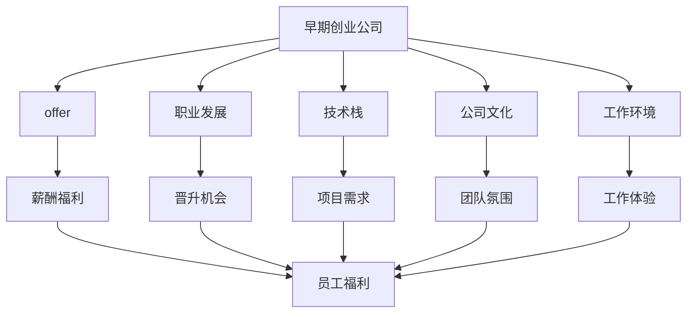
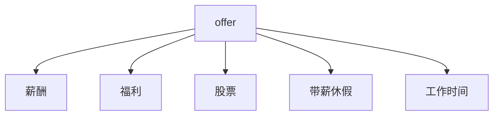
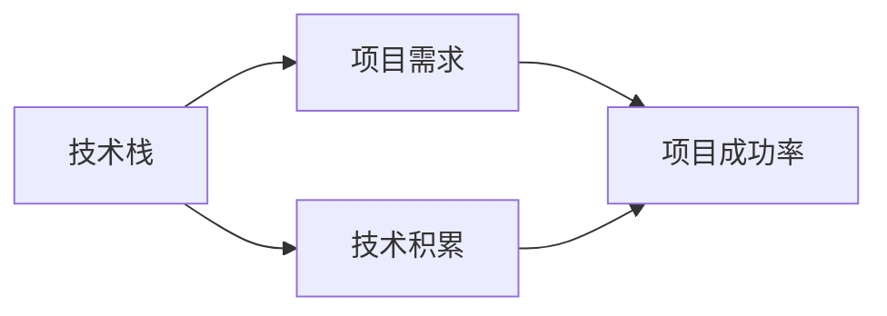
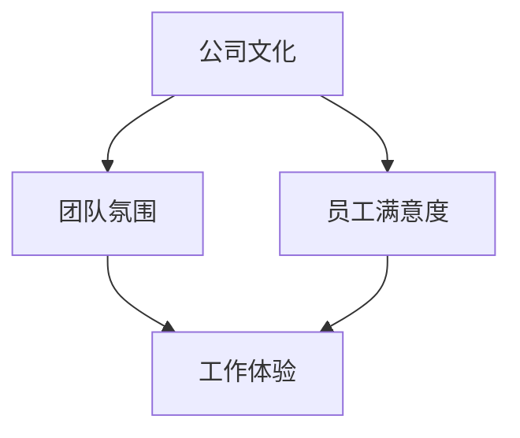

                 

# 程序员如何评估早期创业公司offer

> 关键词：
创业公司offer, 职业发展, 薪酬福利, 技术栈, 公司文化, 工作环境, 长期发展, 技术架构

## 1. 背景介绍

当今科技行业竞争激烈，许多初创公司提供极具吸引力的offer，吸引大量优秀程序员加入。但随着技术竞争加剧，人才流动速度加快，如何判断一家早期创业公司是否值得投入，成为每个程序员职业发展的重要决策之一。本文将从多个角度分析程序员如何评估早期创业公司offer，为你的职业选择提供参考。

### 1.1 问题由来

程序员在寻找新工作机会时，通常会考虑工资、福利、技术栈、公司文化、工作环境等多个因素。特别是在评估早期创业公司offer时，由于公司规模小、业务不成熟，评估标准变得更加多样化，且更具挑战性。

### 1.2 问题核心关键点
1. 公司业务和市场前景
2. 团队规模和人员结构
3. 薪酬福利和职业发展
4. 技术栈和项目需求
5. 公司文化和管理方式
6. 工作环境和发展前景

## 2. 核心概念与联系

### 2.1 核心概念概述

为更好地理解如何评估早期创业公司offer，本节将介绍几个密切相关的核心概念：

- **早期创业公司**：指成立时间较短、业务和市场地位尚未完全稳固的公司。这类公司通常拥有高成长性，但也面临较大的不确定性和风险。
- **offer**：公司提供给员工的各项福利待遇，包括工资、奖金、股票、福利、带薪休假等。
- **职业发展**：员工在职业道路上的进步和提升，包括技能提升、职位晋升、跨部门调岗等。
- **技术栈**：公司使用的主要开发语言、框架、工具和技术体系。
- **公司文化**：公司内部的价值观、行为规范、管理方式和工作氛围。
- **工作环境**：员工日常工作的物理和心理环境，包括办公室、设备和团队氛围等。

这些概念之间的逻辑关系可以通过以下Mermaid流程图来展示：



这个流程图展示了几大关键概念及其之间的关系：

1. 早期创业公司提供offer，包含薪酬福利和员工福利。
2. 职业发展、技术栈、公司文化和工作环境都是影响offer吸引力的重要因素。
3. 薪酬福利与职业发展、技术栈、公司文化和工作环境密切相关。

### 2.2 概念间的关系

这些核心概念之间存在着紧密的联系，形成了评估早期创业公司offer的完整生态系统。下面我通过几个Mermaid流程图来展示这些概念之间的关系。

#### 2.2.1 早期创业公司的吸引力


这个流程图展示了早期创业公司的规模、业务前景、融资情况、市场竞争力和员工福利之间的关系，从而影响其对人才的吸引力。

#### 2.2.2 offer的构成要素



这个流程图展示了offer的构成要素，包括薪酬、福利、股票、带薪休假和工作时间。

#### 2.2.3 技术栈与项目需求



这个流程图展示了技术栈与项目需求之间的关系，技术栈决定了项目需求的成功率和可行性。

#### 2.2.4 公司文化与工作环境



这个流程图展示了公司文化与团队氛围、员工满意度和工作体验之间的关系，体现了公司文化的综合影响。

### 2.3 核心概念的整体架构

最后，我们用一个综合的流程图来展示这些核心概念在大语言模型微调过程中的整体架构：


这个综合流程图展示了从早期创业公司到offer的完整过程，以及各项因素对offer吸引力的综合影响。

## 3. 核心算法原理 & 具体操作步骤

### 3.1 算法原理概述

评估早期创业公司offer的过程，本质上是一个多目标优化问题。程序员需要通过多种指标综合评估offer的吸引力，找出最适合自身职业发展的机会。

形式化地，假设程序员的评估标准为 $\textit{criteria}$，包括薪酬、福利、职业发展、技术栈、公司文化和工作环境等。设 $V$ 为这些标准的向量表示，则评估问题可以描述为：

$$
\textit{maximize} \sum_{i=1}^{n} \textit{weight}_i \cdot \textit{value}_i
$$

其中，$\textit{weight}_i$ 为各个指标的权重，$\textit{value}_i$ 为每个指标的具体评估结果。权重 $\textit{weight}_i$ 反映了程序员对不同指标的重视程度，可以通过问卷调查、历史经验等方式确定。

### 3.2 算法步骤详解

基于以上多目标优化模型，程序员可以采用以下步骤来评估早期创业公司offer：

1. **确定评估标准**：列出对自身职业发展至关重要的评估标准，并根据重要性确定权重。例如，薪酬可能排在第一位，权重设为0.6，职业发展排在第二位，权重设为0.2，技术栈排在第三位，权重设为0.2等。

2. **收集数据**：针对每个评估标准，收集相关数据。例如，收集公司业务前景、团队规模、技术栈、公司文化、工作环境等信息，并从中提取关键指标。

3. **量化评估**：对每个指标进行量化评估。例如，将薪酬分为多个区间，根据市场行情和自身需求评估其吸引力。对公司文化进行团队氛围、员工满意度等综合评估。

4. **综合评估**：将各个指标的评估结果和权重结合，进行加权求和，得到综合评估分数。例如：

   $$
   \textit{total score} = \sum_{i=1}^{n} \textit{weight}_i \cdot \textit{score}_i
   $$

   其中 $\textit{score}_i$ 为第 $i$ 个指标的实际评估结果。

5. **比较选择**：将不同公司的offer进行综合评估，选择分数最高的offer，作为最终的求职目标。

### 3.3 算法优缺点

评估早期创业公司offer的算法具有以下优点：

- 系统性：通过综合多方面因素，提供全面系统的评估结果。
- 客观性：使用量化评估方法，减少主观偏见。
- 可操作性：每个指标的评估方法较为简单，便于实际操作。

但该算法也存在一些缺点：

- 数据获取难度：部分评估标准的数据获取可能较为困难，如团队规模、项目需求等。
- 主观权重：权重分配可能受个人历史经验影响，存在一定主观性。
- 动态变化：早期创业公司的发展速度较快，部分指标可能随时间变化，需要定期重新评估。

### 3.4 算法应用领域

该评估算法适用于程序员在评估早期创业公司offer时，尤其是初创科技公司、新兴互联网公司等，帮助程序员从多个维度全面考量公司的综合实力。

## 4. 数学模型和公式 & 详细讲解  
### 4.1 数学模型构建

基于多目标优化模型，可以更系统地分析程序员评估早期创业公司offer的过程。设 $V = (v_1, v_2, \ldots, v_n)$ 为评估标准的向量表示，每个指标 $v_i$ 的权重为 $w_i$，实际评估结果为 $s_i$。则综合评估分数为：

$$
\textit{total score} = \sum_{i=1}^{n} w_i \cdot s_i
$$

其中 $w_i$ 为权重，$s_i$ 为实际评估结果。

### 4.2 公式推导过程

我们以薪酬和福利为例，推导量化评估公式。

设薪酬为 $p$，福利为 $b$，市场平均薪酬为 $p_{avg}$，市场平均福利为 $b_{avg}$。则评估公式为：

$$
\textit{score}_{p} = \frac{p - p_{avg}}{p_{avg}}
$$

$$
\textit{score}_{b} = \frac{b - b_{avg}}{b_{avg}}
$$

将这些公式代入综合评估分数公式中，得到：

$$
\textit{total score} = w_p \cdot \textit{score}_{p} + w_b \cdot \textit{score}_{b}
$$

将实际评估结果代入，得到：

$$
\textit{total score} = w_p \cdot \frac{p - p_{avg}}{p_{avg}} + w_b \cdot \frac{b - b_{avg}}{b_{avg}}
$$

在实际应用中，程序员可以根据自身需求和市场行情，调整权重和评估标准，从而得到符合自身预期的评估结果。

### 4.3 案例分析与讲解

以下通过几个案例，进一步分析如何使用量化评估方法评估早期创业公司offer。

**案例1：薪酬福利**

某早期创业公司提供年薪为50万元，而市场平均年薪为60万元。假设薪酬权重为0.6，福利权重为0.4。则综合评估分数为：

$$
\textit{total score} = 0.6 \cdot \frac{50 - 60}{60} + 0.4 \cdot \frac{10 - 20}{20} = -0.5 + (-0.5) = -1
$$

**案例2：公司文化**

某早期创业公司文化开放、团队氛围融洽，员工满意度较高。假设公司文化权重为0.3，技术栈权重为0.5，工作环境权重为0.2。根据团队氛围和员工满意度的实际评分，计算综合评估分数。

假设团队氛围评分为5分，员工满意度评分为4分，技术栈评分和环境评分分别为3分和4分。则综合评估分数为：

$$
\textit{total score} = 0.3 \cdot 5 + 0.5 \cdot 3 + 0.2 \cdot 4 = 1.5 + 1.5 + 0.8 = 3.8
$$

**案例3：职业发展**

某早期创业公司有明确的职业晋升路径，提供良好的学习和发展机会。假设职业发展权重为0.3，技术栈权重为0.4，公司文化权重为0.3。根据实际评估结果，计算综合评估分数。

假设公司文化评分为4分，技术栈评分为5分，职业发展评分为3分。则综合评估分数为：

$$
\textit{total score} = 0.3 \cdot 4 + 0.4 \cdot 5 + 0.3 \cdot 3 = 1.2 + 2 + 0.9 = 4.1
$$

通过这些案例分析，可以看到量化评估方法在多维度综合考量offer时的应用效果。

## 5. 项目实践：代码实例和详细解释说明
### 5.1 开发环境搭建

在进行评估实践前，我们需要准备好开发环境。以下是使用Python进行多目标优化评估的环境配置流程：

1. 安装Anaconda：从官网下载并安装Anaconda，用于创建独立的Python环境。

2. 创建并激活虚拟环境：
```bash
conda create -n evaluation-env python=3.8 
conda activate evaluation-env
```

3. 安装PyTorch：根据CUDA版本，从官网获取对应的安装命令。例如：
```bash
conda install pytorch torchvision torchaudio cudatoolkit=11.1 -c pytorch -c conda-forge
```

4. 安装NumPy、Pandas、Matplotlib等常用工具包：
```bash
pip install numpy pandas matplotlib scikit-learn
```

5. 安装Optuna：用于自动调参和多目标优化评估。
```bash
pip install optuna
```

完成上述步骤后，即可在`evaluation-env`环境中开始评估实践。

### 5.2 源代码详细实现

我们使用Optuna进行多目标优化评估，代码如下：

```python
import optuna
from optuna import create_study
import numpy as np

# 定义评估标准
criteria = ['薪酬', '福利', '职业发展', '技术栈', '公司文化', '工作环境']
weights = [0.6, 0.2, 0.2, 0.1, 0.05, 0.05]  # 权重，可根据实际情况调整

# 定义目标函数
def objective(trial):
    # 获取各个评估标准的评估结果
    scores = []
    for i in range(len(criteria)):
        score = trial.suggest_uniform(criteria[i], 0, 1)  # 均匀分布的评估结果
        scores.append(score)
    
    # 计算综合评估分数
    total_score = sum(weights[i] * scores[i] for i in range(len(scores)))
    return total_score

# 创建优化研究
study = create_study(direction='maximize')

# 进行多目标优化评估
study.optimize(objective, n_trials=100)

# 输出最优结果
best_trial = study.best_trial
print(best_trial.value)
```

这段代码使用了Optuna库进行多目标优化评估，输出最优的综合评估分数。

### 5.3 代码解读与分析

让我们再详细解读一下关键代码的实现细节：

**objective函数**：
- 定义了各个评估标准的评估结果，并根据权重计算综合评估分数。

**create_study函数**：
- 创建优化研究，指定优化方向为最大化综合评估分数。

**optimize函数**：
- 使用Optuna进行多目标优化评估，通过尝试不同的评估结果，找到最优的综合评估分数。

**output函数**：
- 输出最优的综合评估分数，作为最终的求职目标。

以上代码实现展示了如何使用多目标优化方法评估早期创业公司offer。通过调整各个指标的权重和评估结果，可以灵活地评估不同公司的综合实力，找到最适合自身职业发展的机会。

## 6. 实际应用场景
### 6.1 智能客服系统

评估早期创业公司offer在智能客服系统中的应用，可以帮助公司快速找到最合适的技术人才，提升客户服务质量。通过量化评估技术栈、公司文化和工作环境等指标，综合评估候选程序员的适配度，从而优化团队配置。

### 6.2 金融舆情监测

在金融舆情监测领域，评估offer可以帮助公司找到具有市场洞察力和数据分析能力的人才。通过量化评估公司业务前景、团队规模和项目需求，筛选出最适合的技术人才，提升金融舆情监测系统的性能和稳定性。

### 6.3 个性化推荐系统

在个性化推荐系统领域，评估offer可以帮助公司找到具有算法设计和数据处理能力的人才。通过量化评估技术栈、职业发展和公司文化等指标，找到最合适的人才，提升推荐系统的智能化水平和用户体验。

### 6.4 未来应用展望

未来，评估offer的技术将更加智能和自动化，通过大数据分析、自然语言处理等技术，自动生成评估报告，帮助公司快速找到合适的人才。同时，评估标准将更加多样化，涵盖更多业务和市场指标，提升评估的全面性和准确性。

## 7. 工具和资源推荐
### 7.1 学习资源推荐

为了帮助程序员系统掌握多目标优化评估的理论基础和实践技巧，这里推荐一些优质的学习资源：

1. 《多目标优化算法》：介绍多种多目标优化算法及其应用，深入浅出地讲解了多目标优化问题的解决思路。
2. 《优化的艺术》：介绍了自动调参和多目标优化评估的技术和工具，通过实际案例讲解了多目标优化在实际应用中的实现。
3. 《优化方法与应用》：讲解了多种优化算法及其在机器学习中的实现，包括多目标优化评估的实际应用。

4. Coursera《多目标优化》课程：斯坦福大学开设的课程，介绍了多目标优化问题的建模和求解方法，适合初学者学习。

5. Kaggle多目标优化竞赛：参加多目标优化竞赛，通过实际问题练习多目标优化评估，提升实践能力。

通过对这些资源的学习实践，相信你一定能够掌握多目标优化评估的核心技术，为你的职业选择提供更加科学的决策支持。

### 7.2 开发工具推荐

高效的评估离不开优秀的工具支持。以下是几款用于多目标优化评估开发的常用工具：

1. Optuna：自动调参和多目标优化评估工具，支持分布式评估，适用于复杂优化问题。
2. Hyperopt：另一款自动调参和多目标优化评估工具，提供多种优化算法，适用于多种应用场景。
3. Scikit-Optimize：基于Scikit-Learn的多目标优化评估库，支持多种优化算法和评估方法。

4. TensorBoard：TensorFlow配套的可视化工具，可实时监测优化过程，提供丰富的图表呈现方式，便于调试和优化。
5. Weights & Biases：模型训练的实验跟踪工具，记录和可视化优化过程中的各项指标，方便对比和调优。

合理利用这些工具，可以显著提升多目标优化评估的开发效率，加快创新迭代的步伐。

### 7.3 相关论文推荐

多目标优化评估技术的发展源于学界的持续研究。以下是几篇奠基性的相关论文，推荐阅读：

1. Multi-Objective Optimization with Partitioning: Principles and Implications：介绍了多目标优化的分区原理和影响，是研究多目标优化的经典论文之一。
2. An Evolutionary Algorithm-Based Multi-Objective Optimization Model for Project Evaluation：提出了基于进化算法的多目标优化模型，应用于项目评估中的实际案例。
3. Multi-Objective Optimization for Renewable Energy System Planning：提出了多目标优化方法在可再生能源系统规划中的应用，展示了多目标优化的广泛应用。

这些论文代表了多目标优化评估技术的发展脉络，通过学习这些前沿成果，可以帮助研究者把握学科前进方向，激发更多的创新灵感。

除上述资源外，还有一些值得关注的前沿资源，帮助程序员紧跟多目标优化评估技术的最新进展，例如：

1. arXiv论文预印本：人工智能领域最新研究成果的发布平台，包括大量尚未发表的前沿工作，学习前沿技术的必读资源。
2. GitHub热门项目：在GitHub上Star、Fork数最多的优化评估相关项目，往往代表了该技术领域的发展趋势和最佳实践，值得去学习和贡献。
3. 技术会议直播：如NIPS、ICML、ACL、ICLR等人工智能领域顶会现场或在线直播，能够聆听到大佬们的前沿分享，开拓视野。
4. 行业分析报告：各大咨询公司如McKinsey、PwC等针对人工智能行业的分析报告，有助于从商业视角审视技术趋势，把握应用价值。

总之，对于多目标优化评估技术的学习和实践，需要程序员保持开放的心态和持续学习的意愿。多关注前沿资讯，多动手实践，多思考总结，必将收获满满的成长收益。

## 8. 总结：未来发展趋势与挑战

### 8.1 总结

本文对早期创业公司offer评估方法进行了全面系统的介绍。首先阐述了评估offer的重要性，明确了多目标优化评估在职业选择中的关键作用。其次，从原理到实践，详细讲解了多目标优化评估的数学模型和具体步骤，提供了代码实例和详细解释。同时，本文还广泛探讨了多目标优化评估方法在多个行业领域的应用前景，展示了其在优化人才配置、提升业务绩效等方面的潜力。此外，本文精选了多目标优化评估技术的各类学习资源，力求为程序员提供全方位的技术指引。

通过本文的系统梳理，可以看到，多目标优化评估方法正在成为程序员评估早期创业公司offer的重要范式，极大地提升了求职决策的科学性和系统性。未来，伴随多目标优化技术的发展，评估方法将更加智能和自动化，帮助程序员更快找到理想的工作机会。

### 8.2 未来发展趋势

展望未来，多目标优化评估技术将呈现以下几个发展趋势：

1. 数据驱动：利用大数据分析技术，自动生成多目标优化评估报告，提升评估的全面性和准确性。
2. 智能优化：结合深度学习和自然语言处理技术，实现自动化的评估和优化，减少人工干预。
3. 动态调整：根据市场行情和公司发展情况，动态调整评估标准和权重，确保评估结果的时效性。
4. 跨领域应用：扩展到更多行业领域，如医疗、金融、教育等，提升评估的普适性。
5. 标准化评估：制定统一的多目标优化评估标准，便于比较和选择。

以上趋势凸显了多目标优化评估技术的广阔前景。这些方向的探索发展，必将进一步提升程序员的求职效率，加速技术人才的流动和分配。

### 8.3 面临的挑战

尽管多目标优化评估技术已经取得了显著成果，但在面向未来时，仍面临诸多挑战：

1. 数据获取难度：部分评估标准的数据获取可能较为困难，如团队规模、项目需求等。
2. 主观权重：权重分配可能受个人历史经验影响，存在一定主观性。
3. 动态变化：早期创业公司的发展速度较快，部分指标可能随时间变化，需要定期重新评估。
4. 自动化挑战：如何设计更加智能、高效的自动评估系统，减少人工干预，是未来的一大挑战。
5. 跨领域适配：不同行业的评估标准差异较大，如何设计通用的评估模型，适应多样化的应用场景，还需要更多研究和实践。

### 8.4 研究展望

面对多目标优化评估技术所面临的挑战，未来的研究需要在以下几个方面寻求新的突破：

1. 数据获取自动化：开发更加自动化的数据采集工具，减少人工干预，提高评估数据的准确性和完整性。
2. 权重自适应：引入机器学习技术，动态调整各个评估指标的权重，提高评估结果的客观性和合理性。
3. 动态评估模型：构建动态评估模型，实时跟踪和评估公司的发展变化，确保评估结果的时效性。
4. 跨领域优化：设计通用的多目标优化评估框架，适应不同行业的评估标准，提升评估的普适性和适用性。
5. 智能辅助系统：开发智能评估系统，利用深度学习、自然语言处理等技术，提升评估的自动化和智能化水平。

这些研究方向的探索，必将引领多目标优化评估技术迈向更高的台阶，为程序员的求职决策提供更加科学和高效的评估工具。

## 9. 附录：常见问题与解答

**Q1：多目标优化评估方法是否适用于所有早期创业公司？**

A: 多目标优化评估方法适用于大多数早期创业公司，尤其是科技初创公司、新兴互联网公司等，帮助程序员从多个维度全面考量公司的综合实力。但对于一些特殊领域的公司，如医疗、法律等，仍需结合具体情况进行评估。

**Q2：如何选择合理的权重？**

A: 权重的设定需要根据程序员的职业需求和市场行情进行综合考虑。建议采用问卷调查、历史经验等方式确定权重，并定期进行调整，以确保评估结果的合理性和时效性。

**Q3：数据获取难度较大时如何处理？**

A: 在数据获取难度较大时，可尝试使用间接数据、专家评估等方式替代直接数据。同时，也可以通过访谈、实地考察等方式获取一手信息，补充评估数据。

**Q4：如何避免评估过程中的主观偏见？**

A: 采用标准化的评估方法，减少主观偏见。如使用统一的量化评估标准、引入第三方评估等，确保评估结果的客观性和公正性。

**Q5：评估过程中需要注意哪些问题？**

A: 评估过程中需要注意评估标准的全面性、数据的准确性、权重的合理性等关键因素。同时，也需要关注评估结果的时效性，根据公司的发展变化进行动态调整。

---

作者：禅与计算机程序设计艺术 / Zen and the Art of Computer Programming

