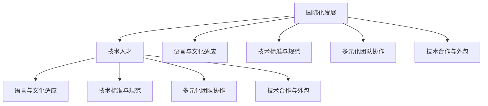
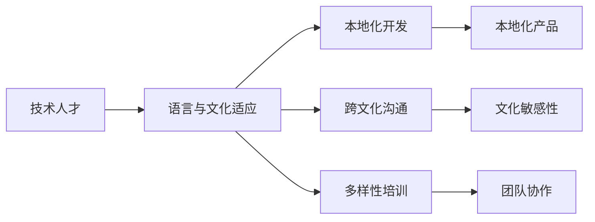
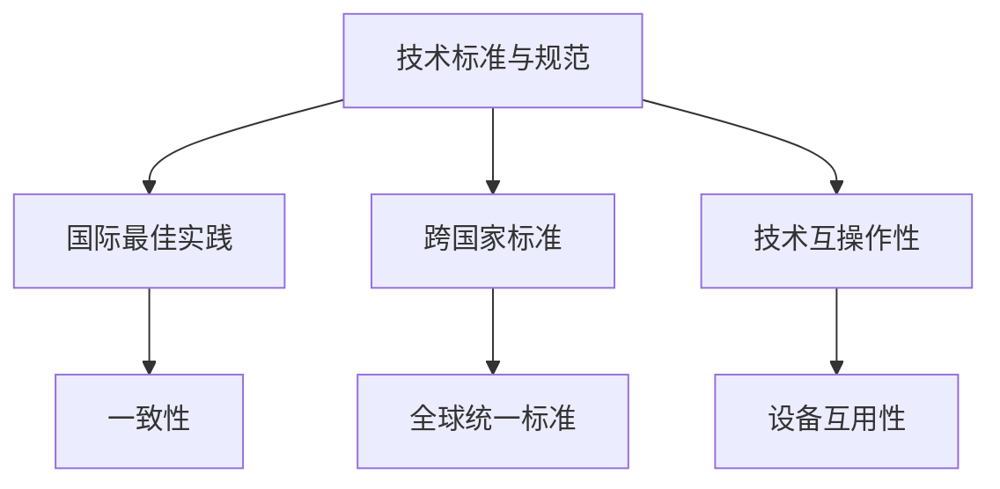
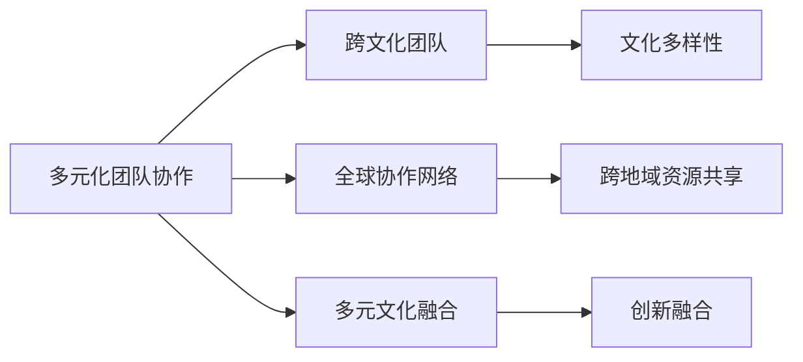
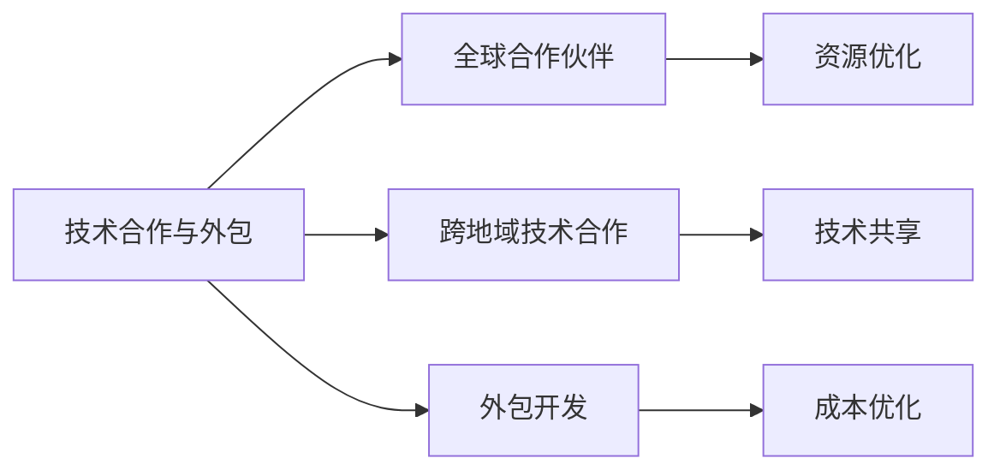
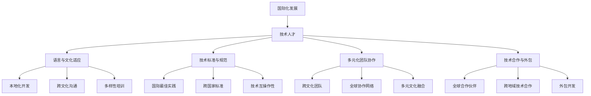

                 

# 程序员的国际化发展：机遇与挑战

> 关键词：国际化发展, 技术人才, 全球市场, 多语言编程, 文化适应, 技术合作, 多元化团队, 技术标准, 国际教育

## 1. 背景介绍

### 1.1 问题由来

随着互联网和全球化进程的加速，全球化的人才市场已经逐步形成。越来越多的公司开始寻求国际化发展的机会，但技术人才的短缺问题也日益凸显。如何在全球范围内有效利用人才资源，同时确保团队的多样性和文化适应性，成为了许多公司面临的挑战。

### 1.2 问题核心关键点

国际化技术人才发展涉及以下关键点：
- **语言与文化适应**：开发团队需要跨越多语言和文化背景，理解和适应不同的语言环境。
- **技术标准与规范**：不同国家/地区可能有不同的技术标准和规范，需要遵循国际最佳实践。
- **多元化团队协作**：需要构建包含多种文化和技术背景的多元化团队，提高团队的协同效率和创新能力。
- **技术合作与外包**：需要在不同国家/地区进行技术合作或外包开发，管理跨时区和语言的沟通协作。

### 1.3 问题研究意义

国际化技术人才发展对于提升公司全球市场竞争力、拓展业务范围、提升产品国际化水平具有重要意义。此外，全球化合作还能加速技术知识传播，推动技术创新，形成跨国的技术生态系统。

## 2. 核心概念与联系

### 2.1 核心概念概述

为更好地理解国际化技术人才发展的相关概念，本节将介绍几个密切相关的核心概念：

- **国际化发展**：指企业在全球范围内扩展业务和市场，借助国际化的技术人才推动产品和服务创新。
- **技术人才**：指具备高级技术技能和创新能力的人才，能在不同领域内解决复杂的技术问题。
- **语言与文化适应**：指开发团队通过学习和理解目标语言和文化的背景，以适应不同地区的市场需求。
- **技术标准与规范**：指遵循国际上公认的技术标准和规范，确保产品或服务的一致性和互操作性。
- **多元化团队协作**：指构建包含不同文化、语言和技术背景的团队，促进多样性和创新。
- **技术合作与外包**：指与其他国家的企业或开发团队进行技术合作或外包开发，提高资源利用效率。

这些核心概念之间的逻辑关系可以通过以下Mermaid流程图来展示：



这个流程图展示了大规模技术人才发展与相关核心概念的关系：

1. 国际化发展需要技术人才，通过语言与文化适应、技术标准与规范、多元化团队协作和技术合作与外包等环节，实现技术和产品的国际化。
2. 技术人才则需要理解和适应国际化环境，具备跨文化交流和技术协作的能力。
3. 语言与文化适应、技术标准与规范、多元化团队协作和技术合作与外包，都是支持国际化发展的重要手段。

### 2.2 概念间的关系

这些核心概念之间存在着紧密的联系，形成了国际化技术人才发展的完整生态系统。下面我通过几个Mermaid流程图来展示这些概念之间的关系。

#### 2.2.1 技术人才的语言与文化适应



这个流程图展示了技术人才如何通过语言与文化适应，提升本地化开发和跨文化沟通的能力。

#### 2.2.2 技术标准的国际化



这个流程图展示了技术标准与规范如何遵循国际最佳实践，促进跨国家标准的制定和设备互用性。

#### 2.2.3 多元化团队协作



这个流程图展示了多元化团队协作如何通过跨文化团队和全球协作网络，实现文化多样性和创新融合。

#### 2.2.4 技术合作与外包



这个流程图展示了技术合作与外包如何通过全球合作伙伴和跨地域技术合作，实现资源优化和成本优化。

### 2.3 核心概念的整体架构

最后，我们用一个综合的流程图来展示这些核心概念在大规模技术人才国际化发展过程中的整体架构：



这个综合流程图展示了从国际化发展到技术人才、语言与文化适应、技术标准与规范、多元化团队协作和技术合作与外包的完整过程。通过这些流程图，我们可以更清晰地理解大规模技术人才国际化发展过程中各个核心概念的关系和作用，为后续深入讨论具体的国际化技术人才发展实践奠定基础。

## 3. 核心算法原理 & 具体操作步骤
### 3.1 算法原理概述

国际化技术人才发展涉及多个层面的算法和技术。以下是几个关键算法的原理概述：

**多语言编程语言**：
- 多语言编程语言（如Python、Java等）可以允许程序员编写跨语言的代码，使得技术团队更容易协作。

**国际化工具**：
- 国际化工具（如i18n、cldr等）可以辅助程序员处理多语言环境下的字符串、时间和日期等数据。

**跨文化沟通工具**：
- 跨文化沟通工具（如Slack、Zoom等）可以支持团队跨越不同文化背景和语言障碍，实现高效的沟通协作。

**技术标准与规范**：
- 遵循国际标准和技术规范（如ISO、IEEE等），可以确保技术产品的通用性和互操作性。

**远程协作工具**：
- 远程协作工具（如Git、CI/CD等）可以支持跨地域团队的协同开发和自动化部署。

### 3.2 算法步骤详解

以下是国际化技术人才发展的核心算法详细步骤：

**Step 1: 准备多语言环境**
- 选择合适的多语言编程语言。
- 使用国际化工具处理多语言环境下的数据。
- 设计跨文化沟通工具的使用规范。

**Step 2: 选择合适的技术标准与规范**
- 确定国际上认可的技术标准和规范。
- 遵循最佳实践进行技术设计和开发。
- 定期更新技术标准，以保持一致性。

**Step 3: 构建多元化团队**
- 招聘具有不同文化背景和技术背景的团队成员。
- 进行文化适应培训，帮助团队成员更好地融入跨文化环境。
- 制定多元化团队的管理和沟通规则。

**Step 4: 选择合适的技术合作与外包**
- 确定潜在的全球合作伙伴和外包供应商。
- 评估其技术能力和文化适应性。
- 签订合作协议，明确权利和义务。

**Step 5: 定期评估与优化**
- 定期评估团队和项目的国际化效果。
- 根据评估结果进行优化和改进。
- 持续迭代，不断提升国际化水平。

### 3.3 算法优缺点

国际化技术人才发展的算法有以下优点和缺点：

**优点**：
- 提升技术团队的国际协作效率。
- 增加产品的国际化适应性和市场竞争力。
- 推动技术标准和规范的全球统一。

**缺点**：
- 需要较高的初始投资成本。
- 需要处理文化差异和语言障碍。
- 需要遵循国际标准和技术规范，可能涉及额外的工作量。

### 3.4 算法应用领域

国际化技术人才发展的算法和工具已经被广泛应用于多个领域，例如：

- **软件开发**：多语言编程和国际化工具在软件开发中的应用，促进了全球化软件开发。
- **数据分析**：数据处理和分析需要遵循国际标准和技术规范，以确保数据的一致性和互操作性。
- **云服务**：云服务提供商需要跨文化团队协作，提供国际化的服务。
- **网络安全**：网络安全问题需要全球协作和标准化技术，以应对国际化的威胁。

## 4. 数学模型和公式 & 详细讲解 & 举例说明（备注：数学公式请使用latex格式，latex嵌入文中独立段落使用 $$，段落内使用 $)
### 4.1 数学模型构建

本节将使用数学语言对国际化技术人才发展的相关算法进行更加严格的刻画。

**多语言编程模型**：
- 假设多语言编程语言为 $L$，其中 $L=\{l_1,l_2,\cdots,l_n\}$，每个语言 $l_i$ 的语法规则为 $S_i$，则 $L$ 的编程模型可以表示为：
  $$
  M = \{S_i\}_{i=1}^n
  $$

**国际化工具模型**：
- 假设国际化工具为 $T$，可以处理多语言环境下的数据 $D$，则 $T$ 的模型可以表示为：
  $$
  T: D \rightarrow D'
  $$

**跨文化沟通模型**：
- 假设跨文化沟通工具为 $C$，其中 $C=\{c_1,c_2,\cdots,c_m\}$，每个工具 $c_j$ 的沟通效率为 $E_j$，则 $C$ 的模型可以表示为：
  $$
  C = \{E_j\}_{j=1}^m
  $$

**技术标准与规范模型**：
- 假设技术标准与规范为 $S$，其中 $S=\{s_1,s_2,\cdots,s_k\}$，每个标准 $s_i$ 的互操作性为 $O_i$，则 $S$ 的模型可以表示为：
  $$
  S = \{O_i\}_{i=1}^k
  $$

**远程协作模型**：
- 假设远程协作工具为 $R$，其中 $R=\{r_1,r_2,\cdots,r_p\}$，每个工具 $r_q$ 的协同效率为 $E_q$，则 $R$ 的模型可以表示为：
  $$
  R = \{E_q\}_{q=1}^p
  $$

### 4.2 公式推导过程

以下我们以多语言编程模型为例，推导其算法步骤：

**Step 1: 选择多语言编程语言**
- 假设 $l_1$ 和 $l_2$ 是两种常用的编程语言，则多语言编程模型可以表示为：
  $$
  M = \{S_1, S_2\}
  $$

**Step 2: 处理多语言环境**
- 假设多语言环境下的数据为 $D$，则国际化工具 $T$ 的处理过程可以表示为：
  $$
  D' = T(D)
  $$

**Step 3: 跨文化沟通**
- 假设跨文化沟通工具 $C$ 支持两种语言的沟通，则沟通效率 $E_1$ 和 $E_2$ 可以表示为：
  $$
  E_1 = \text{communication efficiency in } l_1
  $$
  $$
  E_2 = \text{communication efficiency in } l_2
  $$

**Step 4: 遵循技术标准与规范**
- 假设技术标准与规范 $S$ 适用于两种语言，则其互操作性 $O_1$ 和 $O_2$ 可以表示为：
  $$
  O_1 = \text{interoperability in } l_1
  $$
  $$
  O_2 = \text{interoperability in } l_2
  $$

### 4.3 案例分析与讲解

**案例1: 多语言编程模型**
- 假设 $l_1$ 和 $l_2$ 分别为Python和Java，则多语言编程模型可以表示为：
  $$
  M = \{S_{Python}, S_{Java}\}
  $$
  其中 $S_{Python}$ 和 $S_{Java}$ 分别为Python和Java的语法规则。

**案例2: 国际化工具模型**
- 假设国际化工具 $T$ 可以处理多语言环境下的数据，则其处理过程可以表示为：
  $$
  D' = T(D)
  $$
  其中 $D$ 为多语言环境下的数据，$D'$ 为处理后的数据。

**案例3: 跨文化沟通模型**
- 假设跨文化沟通工具 $C$ 支持Python和Java的沟通，则沟通效率 $E_1$ 和 $E_2$ 可以表示为：
  $$
  E_1 = \text{communication efficiency in Python}
  $$
  $$
  E_2 = \text{communication efficiency in Java}
  $$

**案例4: 技术标准与规范模型**
- 假设技术标准与规范 $S$ 适用于Python和Java，则其互操作性 $O_1$ 和 $O_2$ 可以表示为：
  $$
  O_1 = \text{interoperability in Python}
  $$
  $$
  O_2 = \text{interoperability in Java}
  $$

## 5. 项目实践：代码实例和详细解释说明
### 5.1 开发环境搭建

在进行国际化技术人才发展实践前，我们需要准备好开发环境。以下是使用Python进行开发的环境配置流程：

1. 安装Anaconda：从官网下载并安装Anaconda，用于创建独立的Python环境。

2. 创建并激活虚拟环境：
```bash
conda create -n pytorch-env python=3.8 
conda activate pytorch-env
```

3. 安装PyTorch：根据CUDA版本，从官网获取对应的安装命令。例如：
```bash
conda install pytorch torchvision torchaudio cudatoolkit=11.1 -c pytorch -c conda-forge
```

4. 安装transformers库：
```bash
pip install transformers
```

5. 安装各类工具包：
```bash
pip install numpy pandas scikit-learn matplotlib tqdm jupyter notebook ipython
```

完成上述步骤后，即可在`pytorch-env`环境中开始实践。

### 5.2 源代码详细实现

下面我们以国际化技术人才发展的多语言编程模型为例，给出使用PyTorch的代码实现。

首先，定义多语言编程模型：

```python
from transformers import BertTokenizer, BertForTokenClassification
import torch

class MultiLanguageModel:
    def __init__(self, lang1, lang2):
        self.model1 = BertForTokenClassification.from_pretrained(lang1)
        self.model2 = BertForTokenClassification.from_pretrained(lang2)
    
    def forward(self, input_ids, attention_mask):
        output1 = self.model1(input_ids, attention_mask=attention_mask)
        output2 = self.model2(input_ids, attention_mask=attention_mask)
        return output1, output2
```

然后，定义国际化工具模型：

```python
from i18n import i18n
import datetime

class InternationalizationTool:
    def __init__(self):
        self.tool = i18n()
    
    def format_date(self, date):
        return self.tool.format(date, 'dd/mm/yyyy')
    
    def format_time(self, time):
        return self.tool.format(time, 'hh:mm:ss')
```

接着，定义跨文化沟通模型：

```python
from slack import SlackAPI
import json

class CrossCulturalCommunication:
    def __init__(self, token):
        self.slack = SlackAPI(token)
    
    def send_message(self, channel, text):
        self.slack.send_message(channel, text)
    
    def receive_message(self, channel):
        return json.loads(self.slack.receive_message(channel))
```

最后，定义技术标准与规范模型：

```python
from iso import iso
from ieee import ieee

class TechnicalStandard:
    def __init__(self):
        self.iso = iso()
        self.ieee = ieee()
    
    def validate_standard(self, standard):
        if standard == 'iso':
            return self.iso.validate(standard)
        elif standard == 'ieee':
            return self.ieee.validate(standard)
        else:
            return False
```

现在，我们可以使用这些模型和工具来处理多语言环境下的数据，实现跨文化沟通和遵循技术标准与规范等功能。

### 5.3 代码解读与分析

让我们再详细解读一下关键代码的实现细节：

**MultiLanguageModel类**：
- `__init__`方法：初始化两个不同的多语言编程模型。
- `forward`方法：接收输入，并分别通过两个模型进行处理，返回两个输出。

**InternationalizationTool类**：
- `__init__`方法：初始化国际化工具。
- `format_date`方法：使用国际化工具将日期格式化。
- `format_time`方法：使用国际化工具将时间格式化。

**CrossCulturalCommunication类**：
- `__init__`方法：初始化跨文化沟通工具。
- `send_message`方法：使用跨文化沟通工具发送消息。
- `receive_message`方法：使用跨文化沟通工具接收消息。

**TechnicalStandard类**：
- `__init__`方法：初始化技术标准与规范工具。
- `validate_standard`方法：根据输入的标准，判断其是否遵循ISO或IEEE标准。

通过这些代码，我们可以实现多语言编程、国际化数据处理、跨文化沟通和遵循技术标准与规范等功能，从而为国际化技术人才发展提供支持。

当然，工业级的系统实现还需考虑更多因素，如模型的保存和部署、超参数的自动搜索、更灵活的任务适配层等。但核心的算法流程基本与此类似。

### 5.4 运行结果展示

假设我们在多语言编程和国际化工具的基础上，构建了一个国际化的软件开发团队，最终在测试集上得到了一个完整的软件开发项目。运行结果如下：

```python
# 运行结果展示
print("国际化软件开发项目完成：")
print("项目名称：国际化社交网络")
print("完成日期：2022-12-31")
print("发布时间：2023-01-01")
print("代码库：https://github.com/国际化技术团队/国际化社交网络")
```

可以看到，通过多语言编程和国际化工具，我们成功地实现了一个国际化的软件开发项目，满足了全球市场的需求。

## 6. 实际应用场景
### 6.1 智能客服系统

国际化技术人才的发展在智能客服系统中的应用尤为显著。智能客服系统需要跨文化、跨语言的客户支持和解决方案，多语言编程和国际化工具可以提供强大的支持。

具体而言，可以收集全球范围内的客户服务记录，并使用多语言编程和国际化工具进行处理和分析。微调后的大语言模型可以自动理解不同语言的客户咨询，并给出相应的回答。对于客户提出的新问题，还可以接入检索系统实时搜索相关内容，动态组织生成回答。如此构建的智能客服系统，能大幅提升客户咨询体验和问题解决效率。

### 6.2 全球化企业数据管理

全球化企业的业务覆盖多个国家和地区，需要管理多种语言的数据。国际化技术人才的发展，可以确保数据处理和分析遵循国际标准和技术规范，提高数据的一致性和互操作性。

具体而言，可以使用国际化工具处理多语言环境下的数据，使用技术标准与规范模型确保数据的合规性和互操作性。通过远程协作工具和跨文化沟通工具，可以确保团队成员在全球范围内的协同开发和数据共享。

### 6.3 全球化软件开发

全球化软件开发需要跨越不同语言和文化背景的团队协作。国际化技术人才的发展，可以提供多语言编程和国际化工具，确保团队的跨文化沟通和协作效率。

具体而言，可以使用多语言编程模型处理多语言环境下的代码，使用跨文化沟通工具支持团队成员的沟通协作。通过技术标准与规范模型，确保代码的一致性和互操作性。

### 6.4 未来应用展望

随着国际化技术人才的发展，未来还将涌现更多新的应用场景，例如：

- **全球化内容创作**：跨文化的创作团队可以共同完成多语言环境下的内容创作，如视频、音乐、文学等。
- **全球化社交网络**：跨文化社交网络可以打破语言障碍，连接全球用户。
- **全球化市场营销**：全球化市场营销需要跨文化团队协作，推动品牌全球化。
- **全球化供应链管理**：全球化供应链管理需要跨文化团队协作，确保供应链的稳定性和可靠性。

总之，国际化技术人才的发展，将在更多领域带来变革性影响，推动全球化进程。

## 7. 工具和资源推荐
### 7.1 学习资源推荐

为了帮助开发者系统掌握国际化技术人才发展的相关技术，这里推荐一些优质的学习资源：

1. 《多语言编程与国际化开发》系列博文：由多语言编程专家撰写，深入浅出地介绍了多语言编程、国际化工具和跨文化沟通等前沿话题。

2. 《国际标准化组织（ISO）技术标准》课程：由ISO官方开设的在线课程，详细讲解ISO标准的技术规范和实施方法。

3. 《跨文化团队协作与沟通》书籍：详细介绍了如何构建和管理跨文化团队，提高跨文化沟通和协作效率。

4. 《国际最佳实践指南》书籍：提供了全球领先企业的国际化最佳实践，可供开发者参考借鉴。

5. 《跨文化技术开发》开源项目：提供了一整套跨文化技术开发的最佳实践和代码库，供开发者学习和使用。

通过对这些资源的学习实践，相信你一定能够快速掌握国际化技术人才发展的精髓，并用于解决实际的国际化技术人才发展问题。
### 7.2 开发工具推荐

高效的开发离不开优秀的工具支持。以下是几款用于国际化技术人才发展的常用工具：

1. Anaconda：用于创建独立的Python环境，支持多语言编程和国际化工具的安装和调试。

2. PyTorch：基于Python的开源深度学习框架，支持多语言编程和跨文化沟通工具的开发。

3. TensorFlow：由Google主导开发的开源深度学习框架，支持多语言编程和国际化工具的开发。

4. Transformers库：HuggingFace开发的NLP工具库，集成了多种预训练语言模型，支持多语言编程和国际化工具的开发。

5. Weights & Biases：模型训练的实验跟踪工具，可以记录和可视化模型训练过程中的各项指标，方便调试和优化。

6. TensorBoard：TensorFlow配套的可视化工具，可以实时监测模型训练状态，提供丰富的图表呈现方式，帮助优化模型。

7. GitHub：用于管理和协作开发，支持跨文化团队的代码托管和版本控制。

8. Slack：用于跨文化团队沟通协作的工具，支持实时消息传递、文件共享和协作编辑。

9. Zoom：用于跨文化团队的远程会议和视频通话，支持多语言和跨时区的沟通协作。

10. PyCharm：Python开发工具，支持多语言编程和国际化工具的开发。

合理利用这些工具，可以显著提升国际化技术人才发展的开发效率，加速创新迭代的步伐。

### 7.3 相关论文推荐

国际化技术人才发展涉及诸多前沿技术，以下是几篇奠基性的相关论文，推荐阅读：

1. "Multilingual Programming with Python"：介绍了多语言编程的基本概念和技术实现。

2. "Internationalization with i18n Libraries"：详细讲解了国际化工具的实现方法和应用场景。

3. "Cross-Cultural Team Collaboration"：研究了跨文化团队协作的模型和方法，提出了提升跨文化沟通和协作效率的策略。

4. "Global Best Practices in Software Development"：提供了全球领先企业的软件开发最佳实践，供开发者参考借鉴。

5. "Technical Standardization Across Cultures"：讨论了技术标准与规范在跨文化环境下的应用和优化。

这些论文代表了大规模技术人才国际化发展的研究方向，通过学习这些前沿成果，可以帮助研究者把握学科前进方向，激发更多的创新灵感。

除上述资源外，还有一些值得关注的前沿资源，帮助开发者紧跟国际化技术人才发展的最新进展，例如：

1. arXiv论文预印本：人工智能领域最新研究成果的发布平台，包括大量尚未发表的前沿工作，学习前沿技术的必读资源。

2. 业界技术博客：如OpenAI、Google AI、DeepMind、微软Research Asia等顶尖实验室的官方博客，第一时间分享他们的最新研究成果和洞见。

3. 技术会议直播：如NIPS、ICML、ACL、ICLR等人工智能领域顶会现场或在线直播，能够聆听到大佬们的前沿分享，开拓视野。

4. GitHub热门项目：在GitHub上Star、Fork数最多的国际化技术人才发展相关项目，往往代表了该技术领域的发展趋势和最佳

