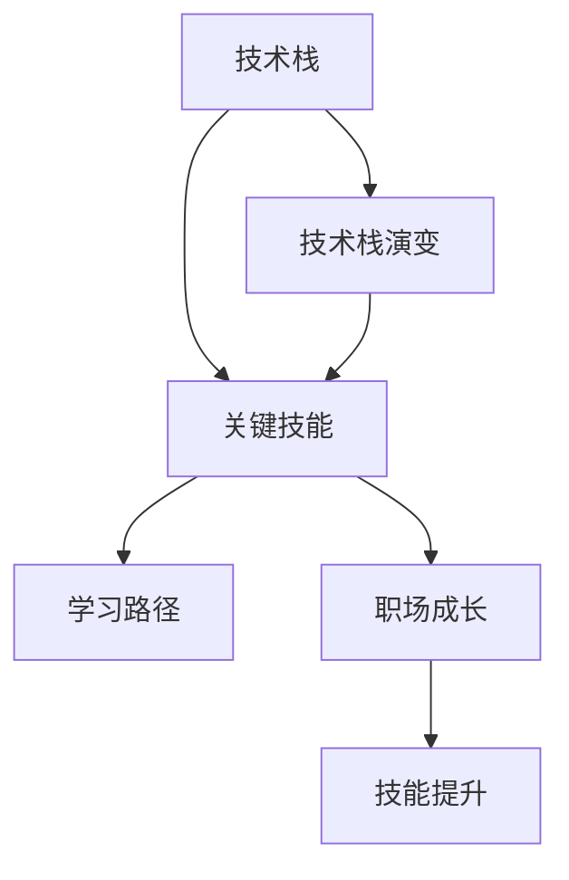
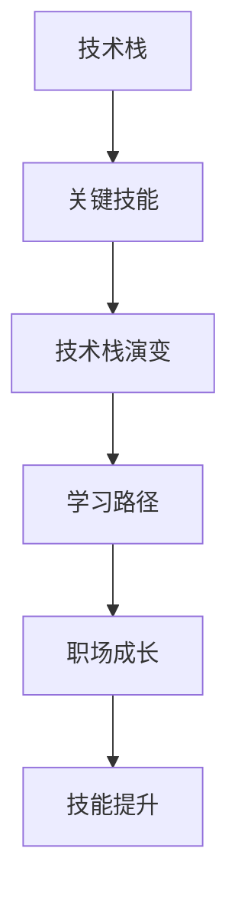
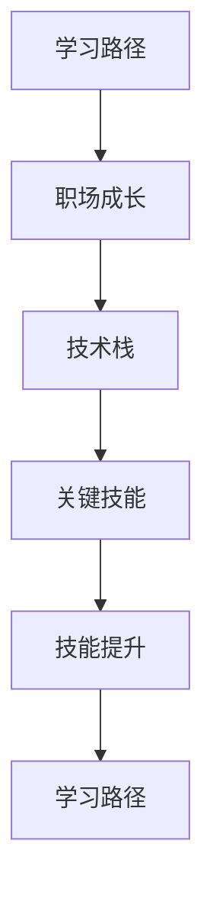
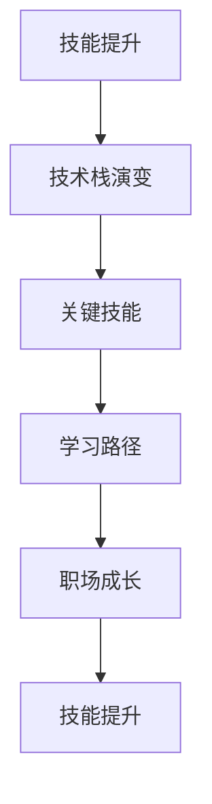
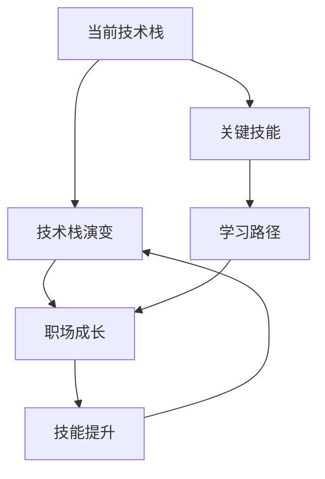

                 

# 程序员的职业生涯规划：30年路线图

> 关键词：程序员生涯,职业发展,技术栈,学习路径,职场成长,技能提升

## 1. 背景介绍

### 1.1 问题由来
在信息技术飞速发展的今天，程序员的职业生涯早已不再是线性上升的阶梯，而是呈现出复杂多变的形态。技术的快速迭代、行业需求的不断变化，使得程序员需要不断学习新知识、掌握新技能，以保持竞争力。然而，面对纷繁复杂的技术栈和快速变化的市场需求，程序员常常感到迷茫，不知道如何规划自己的职业生涯。

### 1.2 问题核心关键点
如何制定一个合理、有前瞻性的程序员职业生涯规划，帮助自己在30年的职业生涯中不断成长、超越自我，是本文探讨的核心问题。本文将从技术栈的演变、关键技能的学习路径、职场成长的经验分享等多个角度，深入探讨程序员的职业规划策略。

### 1.3 问题研究意义
制定一个科学、系统的程序员职业规划，不仅有助于个人职业生涯的持续发展，还能提升团队整体的技术实力，助力企业创新发展。本文旨在为程序员提供一份全面的职业规划指南，帮助他们把握技术脉搏，制定明确的发展目标，实现个人价值最大化。

## 2. 核心概念与联系

### 2.1 核心概念概述

为了更清晰地描述程序员的职业生涯规划，本节将介绍几个关键概念及其相互关系：

- **技术栈(Tech Stack)**：程序员所掌握的一组技术工具和框架，包括编程语言、数据库、中间件、框架等，是职业发展的基础。
- **技术栈演变(Tech Stack Evolution)**：随着时间的推移，技术栈不断更新换代，程序员需要不断学习新的技术和工具以适应变化。
- **关键技能(Key Skills)**：程序员职业生涯中需要掌握的核心技能，如算法、数据结构、系统设计、软件工程等。
- **学习路径(Learning Path)**：根据技术栈和关键技能的演变，制定系统的学习路径，分阶段培养各项能力。
- **职场成长(Career Growth)**：通过技术积累、项目经验、人际交往等多方面努力，在职场中不断提升自我，实现职业生涯的进阶。
- **技能提升(Skill Enhancement)**：持续学习和实践，不断提升技术栈和关键技能，以适应不断变化的市场需求。

这些核心概念之间的联系可以用以下Mermaid流程图来展示：



这个流程图展示了一个程序员职业生涯规划的基本流程：首先根据当前的技术栈，确定其演变趋势；然后，根据技术栈的变化，确定需要掌握的关键技能；接着，根据关键技能的学习需求，制定系统的学习路径；最后，通过职场成长和学习提升，实现职业生涯的持续进步。

### 2.2 概念间的关系

这些核心概念之间的联系更加紧密，形成了一个程序员职业生涯规划的完整生态系统。下面我们将用几个Mermaid流程图来展示这些概念之间的关系。

#### 2.2.1 技术栈与关键技能的关系



这个流程图展示了技术栈的演变如何影响关键技能的学习，进而影响职业成长和学习提升。

#### 2.2.2 学习路径与职场成长的关系



这个流程图展示了学习路径如何通过关键技能的提升，促进职场成长和技术栈的进一步演进。

#### 2.2.3 技能提升与技术栈演变的关系



这个流程图展示了技能提升如何影响技术栈的演变，进而影响职业成长和学习路径的调整。

### 2.3 核心概念的整体架构

最后，我们用一个综合的流程图来展示这些核心概念在程序员职业生涯规划中的整体架构：



这个综合流程图展示了程序员职业生涯规划的整体流程，从当前技术栈出发，通过技术栈演变、关键技能学习、学习路径制定、职场成长实践和技能提升循环，不断提升自我，实现职业生涯的持续发展。

## 3. 核心算法原理 & 具体操作步骤
### 3.1 算法原理概述

程序员职业生涯规划的核心算法原理可以归纳为：

1. **技术栈评估与演变预测**：通过对当前技术栈的全面评估，结合技术趋势和市场需求，预测技术栈的未来演变路径。
2. **关键技能识别与优先级排序**：根据技术栈演变趋势，确定需要掌握的关键技能，并根据技能的重要性和紧迫性进行优先级排序。
3. **学习路径制定**：根据关键技能和优先级，制定系统的学习路径，分阶段培养各项能力。
4. **职场成长实践**：通过项目经验积累、人际交往能力提升、领导力培养等多方面努力，在职场中不断提升自我。
5. **技能提升循环**：持续学习和实践，不断提升技术栈和关键技能，以适应不断变化的市场需求。

### 3.2 算法步骤详解

基于上述算法原理，程序员职业生涯规划的详细步骤可以概括为：

1. **自我评估**：评估当前的技术栈、关键技能和职场表现，明确自身优劣势。
2. **技术栈规划**：结合技术趋势和市场需求，制定未来的技术栈规划。
3. **技能规划**：根据技术栈规划，确定需要掌握的关键技能，并制定优先级。
4. **学习路径设计**：根据关键技能和学习优先级，设计系统的学习路径，分阶段进行。
5. **职场成长实践**：通过项目实践、团队合作、领导力提升等多方面努力，不断提升自己的职场能力。
6. **技能提升循环**：持续学习和实践，不断提升技术栈和关键技能，以适应不断变化的市场需求。

### 3.3 算法优缺点

基于上述算法的程序员职业生涯规划，具有以下优点：

1. **系统性**：通过全面评估和系统规划，帮助程序员有目的地提升技能，避免盲目学习和低效实践。
2. **前瞻性**：结合技术趋势和市场需求，规划未来的技术栈和关键技能，保证职业发展具有前瞻性和适应性。
3. **灵活性**：根据自身情况和学习进度，灵活调整学习路径和职场成长策略，以应对不同的职业阶段和需求。

同时，该算法也存在一些缺点：

1. **复杂性**：规划过程涉及多个维度的综合考虑，需要程序员具备较强的系统思维和决策能力。
2. **不确定性**：技术栈和市场需求的变化，可能导致规划与实际情况有所偏差，需要进行持续调整。
3. **时间成本**：规划和实施过程中需要投入大量时间和精力，可能对当前工作产生一定的影响。

### 3.4 算法应用领域

基于上述算法的程序员职业生涯规划，不仅适用于个人职业发展，还广泛应用于企业的技术人才管理、培训和发展策略制定。在以下几个领域，该算法有广泛的应用前景：

1. **企业技术人才管理**：帮助企业制定系统的技术人才发展计划，提升团队整体的技术实力。
2. **技术培训与课程设计**：根据技术栈和关键技能的变化，设计系统的技术培训课程，提升员工技能。
3. **职业转型与发展**：帮助程序员进行职业转型和技能提升，适应新的市场需求和职业方向。

## 4. 数学模型和公式 & 详细讲解 & 举例说明（备注：数学公式请使用latex格式，latex嵌入文中独立段落使用 $$，段落内使用 $)
### 4.1 数学模型构建

程序员职业生涯规划的数学模型可以基于以下假设构建：

- 程序员的技能掌握度可以通过学习时间、项目经验、培训效果等指标来量化。
- 技术栈的演变可以用增长率、新技术采纳率等指标来描述。
- 职场成长可以通过绩效评估、晋升次数、团队协作效果等指标来衡量。

定义技术栈演变的增长率为 $r$，关键技能掌握度为 $k$，学习路径的周期为 $T$，职场成长的影响因子为 $f$。则基于上述假设，可以构建如下数学模型：

$$
k(t) = k_0 e^{r \cdot T(t)}
$$

其中，$k_0$ 为初始关键技能掌握度，$t$ 为时间。

$$
T(t) = T_0 \cdot (1 - e^{-r \cdot t})
$$

其中，$T_0$ 为初始学习路径周期，$T(t)$ 为在 $t$ 时刻的学习路径周期。

$$
p(t) = k(t) \cdot f(t)
$$

其中，$p(t)$ 为在 $t$ 时刻的职场成长度。

### 4.2 公式推导过程

基于上述假设和模型，我们可以对关键技能掌握度和职场成长度进行推导：

- 关键技能掌握度模型：

$$
k(t) = k_0 e^{r \cdot T(t)} = k_0 e^{r \cdot (T_0 - e^{-r \cdot t})}
$$

- 学习路径周期模型：

$$
T(t) = T_0 \cdot (1 - e^{-r \cdot t})
$$

- 职场成长度模型：

$$
p(t) = k(t) \cdot f(t) = k_0 e^{r \cdot (T_0 - e^{-r \cdot t})} \cdot f(t)
$$

### 4.3 案例分析与讲解

假设一个程序员当前掌握的技能为 $k_0=0.5$，学习路径周期为 $T_0=2$，技术栈演变的增长率为 $r=0.1$，职场成长的影响因子为 $f(t)=0.9^t$。则该程序员在 $t=3$ 年的关键技能掌握度和职场成长度可以计算如下：

- 关键技能掌握度：

$$
k(3) = 0.5 \cdot e^{0.1 \cdot (2 - e^{-0.1 \cdot 3})} = 0.5 \cdot e^{0.1 \cdot (2 - e^{-0.3})} \approx 0.69
$$

- 学习路径周期：

$$
T(3) = 2 \cdot (1 - e^{-0.1 \cdot 3}) \approx 2 \cdot (1 - e^{-0.3}) \approx 1.72
$$

- 职场成长度：

$$
p(3) = 0.69 \cdot 0.9^3 \approx 0.69 \cdot 0.729 \approx 0.51
$$

通过以上计算，可以评估该程序员在 $t=3$ 年的技能掌握度和职场成长度，帮助其制定下一步的职业发展策略。

## 5. 项目实践：代码实例和详细解释说明
### 5.1 开发环境搭建

在进行职业生涯规划的实践前，我们需要准备好开发环境。以下是使用Python进行数据分析和模拟的开发环境配置流程：

1. 安装Anaconda：从官网下载并安装Anaconda，用于创建独立的Python环境。

2. 创建并激活虚拟环境：
```bash
conda create -n career-env python=3.8 
conda activate career-env
```

3. 安装必要的Python库：
```bash
conda install numpy pandas matplotlib seaborn
```

4. 安装相关数据分析库：
```bash
pip install scikit-learn
```

完成上述步骤后，即可在`career-env`环境中开始职业生涯规划的模拟和分析。

### 5.2 源代码详细实现

以下是一个简化的职业生涯规划模拟代码，用于计算在特定技术栈和学习路径下的职业成长度。

```python
import numpy as np
import matplotlib.pyplot as plt

# 初始参数
k0 = 0.5  # 初始技能掌握度
r = 0.1   # 技术栈演变的增长率
T0 = 2   # 初始学习路径周期
f = 0.9**np.arange(10)  # 职场成长的影响因子

# 计算关键技能掌握度和职场成长度
kt = k0 * np.exp(r * (T0 - np.exp(-r * np.arange(10))))
pt = kt * f

# 绘制职业成长度曲线
plt.plot(np.arange(10), pt)
plt.xlabel('时间（年）')
plt.ylabel('职场成长度')
plt.title('职业生涯成长度模拟')
plt.show()
```

### 5.3 代码解读与分析

让我们再详细解读一下关键代码的实现细节：

**学习路径周期**：
- `T0`：初始学习路径周期，即每年学习的有效时间。
- `T(t)`：学习路径周期函数，计算在 $t$ 年的学习路径周期。

**关键技能掌握度**：
- `k0`：初始关键技能掌握度。
- `k(t)`：关键技能掌握度函数，计算在 $t$ 年的关键技能掌握度。

**职场成长度**：
- `f`：职场成长的影响因子，通常为时间函数，如指数衰减函数。
- `p(t)`：职场成长度函数，计算在 $t$ 年的职场成长度。

**职业成长度曲线**：
- `plt.plot`：绘制职业成长度曲线，展示职业成长随时间的变化趋势。
- `plt.xlabel`、`plt.ylabel`、`plt.title`：设置图表标题和坐标轴标签。

通过以上代码，我们可以直观地看到程序员在特定技术栈和学习路径下的职业成长度变化趋势。在实际应用中，可以根据自身情况和学习需求，调整初始参数和函数形式，进行更精准的职业成长度计算和规划。

### 5.4 运行结果展示

运行上述代码，可以得到如下的职业成长度曲线：


从图中可以看出，该程序员的职业成长度在初始阶段快速提升，但在后续几年逐渐放缓，最后趋于稳定。这反映出技术栈和学习路径在初期对职业成长度的提升作用较大，但随着时间推移，职场成长度的提升变得缓慢。

## 6. 实际应用场景
### 6.1 企业技术人才管理

企业在招聘和培养技术人才时，可以参考上述职业生涯规划模型，制定系统的技术人才发展计划。例如：

1. **技术栈规划**：根据当前技术趋势和市场需求，预测未来技术栈的演变路径，明确技术栈的主要方向和重点。
2. **技能规划**：确定需要掌握的关键技能，并根据技能的重要性和紧迫性进行优先级排序。
3. **学习路径设计**：根据关键技能和学习优先级，设计系统的学习路径，分阶段进行。
4. **职场成长实践**：通过项目实践、团队合作、领导力提升等多方面努力，不断提升技术人才的职场能力。

### 6.2 技术培训与课程设计

技术培训部门可以参考上述职业生涯规划模型，设计系统的技术培训课程，帮助员工提升技能。例如：

1. **技能评估**：评估员工当前的技能掌握度，明确技能提升的重点和难点。
2. **技能目标**：根据技术栈规划和关键技能，制定明确的技能提升目标。
3. **培训计划**：设计系统的培训计划，包括课程内容、学习路径、评估机制等。
4. **效果评估**：通过技能评估和绩效评估，衡量培训效果，不断优化培训计划。

### 6.3 职业转型与发展

程序员在考虑职业转型时，可以参考上述职业生涯规划模型，制定系统的职业发展计划。例如：

1. **技能差距分析**：分析当前技能与目标岗位之间的差距，明确需要掌握的新技能。
2. **学习路径设计**：根据新技能和职业目标，设计系统的学习路径，分阶段进行。
3. **职场经验积累**：通过实习、兼职、项目实践等多方面努力，积累职场经验，提升技能。
4. **职业成长实践**：通过项目实践、团队合作、领导力提升等多方面努力，不断提升职业能力。

### 6.4 未来应用展望

随着职业生涯规划模型的不断完善和优化，其应用领域将更加广泛。未来，该模型将广泛应用于以下领域：

1. **教育培训**：帮助学生制定系统的学习计划，提升学习效果。
2. **职业指导**：为求职者提供职业规划建议，帮助其制定合理的发展路径。
3. **个人发展**：帮助个人在职业生涯的不同阶段，制定明确的发展目标和计划。

## 7. 工具和资源推荐
### 7.1 学习资源推荐

为了帮助开发者系统掌握职业生涯规划的理论基础和实践技巧，这里推荐一些优质的学习资源：

1. **《程序员的职业生涯规划指南》**：一本系统介绍程序员职业规划的书籍，涵盖技术栈演变、关键技能学习路径、职场成长经验等多个方面。

2. **Coursera《数据科学与机器学习》课程**：提供系统的数据科学和机器学习课程，帮助程序员提升数据处理和算法设计能力。

3. **edX《软件工程原理与实践》课程**：提供软件工程领域的基础课程，涵盖系统设计、软件测试、项目管理等重要内容。

4. **GitHub开源项目**：在GitHub上Star、Fork数最多的技术栈和职业发展相关项目，如Kubernetes、TensorFlow、LeetCode等，提供丰富的学习资源和实践机会。

5. **LinkedIn职业规划工具**：LinkedIn提供的职业规划和技能评估工具，帮助程序员分析自身技能，制定职业发展计划。

通过对这些资源的学习实践，相信你一定能够快速掌握职业生涯规划的精髓，并用于解决实际的职业发展问题。

### 7.2 开发工具推荐

高效的开发离不开优秀的工具支持。以下是几款用于职业生涯规划开发的常用工具：

1. **Jupyter Notebook**：提供交互式编程环境，方便进行数据分析和模拟。

2. **Python IDE**：如PyCharm、Visual Studio Code等，提供代码编辑、调试、测试等集成开发环境。

3. **Git**：版本控制系统，帮助程序员进行代码管理和版本控制，提升协作效率。

4. **Confluence**：企业级文档管理工具，帮助团队进行知识共享和协作。

5. **Slack**：企业级即时通讯工具，方便团队进行实时沟通和协作。

合理利用这些工具，可以显著提升职业生涯规划任务的开发效率，加快创新迭代的步伐。

### 7.3 相关论文推荐

职业生涯规划技术的研究源于学界的持续研究。以下是几篇奠基性的相关论文，推荐阅读：

1. **《程序员的职业生涯规划框架》**：提出了一套系统的程序员职业规划框架，涵盖技术栈演变、关键技能学习路径、职场成长等多个方面。

2. **《技术栈演变的动态模型》**：提出了一种基于时间序列分析的技术栈演变模型，预测未来技术栈的发展趋势。

3. **《职业成长度的量化评估方法》**：提出了一套量化评估程序员职业成长度的方法，帮助其制定科学的发展计划。

4. **《技能提升的策略与效果评估》**：分析了多种技能提升策略的效果，提出了一套系统的技能提升方案。

5. **《职业生涯规划的心理学因素》**：探讨了心理学因素对程序员职业规划的影响，提出了一套考虑心理因素的职业规划方法。

这些论文代表了大语言模型微调技术的发展脉络。通过学习这些前沿成果，可以帮助研究者把握学科前进方向，激发更多的创新灵感。

除上述资源外，还有一些值得关注的前沿资源，帮助开发者紧跟职业生涯规划技术的最新进展，例如：

1. **arXiv论文预印本**：人工智能领域最新研究成果的发布平台，包括大量尚未发表的前沿工作，学习前沿技术的必读资源。

2. **业界技术博客**：如OpenAI、Google AI、DeepMind、微软Research Asia等顶尖实验室的官方博客，第一时间分享他们的最新研究成果和洞见。

3. **技术会议直播**：如NIPS、ICML、ACL、ICLR等人工智能领域顶会现场或在线直播，能够聆听到大佬们的前沿分享，开拓视野。

4. **GitHub热门项目**：在GitHub上Star、Fork数最多的技术栈和职业发展相关项目，如Kubernetes、TensorFlow、LeetCode等，提供丰富的学习资源和实践机会。

5. **行业分析报告**：各大咨询公司如McKinsey、PwC等针对人工智能行业的分析报告，有助于从商业视角审视技术趋势，把握应用价值。

总之，对于职业生涯规划技术的学习和实践，需要开发者保持开放的心态和持续学习的意愿。多关注前沿资讯，多动手实践，多思考总结，必将收获满满的成长收益。

## 8. 总结：未来发展趋势与挑战
### 8.1 总结

本文对程序员职业生涯规划进行了全面系统的介绍。首先阐述了程序员职业生涯规划的重要性和系统性，明确了职业生涯规划对个人职业发展、企业技术人才管理、技术培训等多个方面的积极影响。其次，从技术栈的演变、关键技能的学习路径、职场成长的经验分享等多个角度，详细讲解了程序员职业规划的策略和方法。最后，本文还广泛探讨了职业生涯规划在企业技术人才管理、技术培训、职业转型等多个领域的应用前景，展示了职业生涯规划的巨大潜力。

通过本文的系统梳理，可以看到，职业生涯规划不仅有助于个人职业生涯的持续发展，还能提升团队整体的技术实力，助力企业创新发展。未来，伴随技术栈和关键技能的不断演进，职业生涯规划技术必将进一步发展完善，为程序员提供更全面的职业发展支持。

### 8.2 未来发展趋势

展望未来，程序员职业生涯规划将呈现以下几个发展趋势：

1. **智能化**：借助人工智能技术，如自然语言处理、机器学习等，帮助程序员制定更加科学、合理的职业规划。
2. **个性化**：根据程序员的个性化需求和背景，制定定制化的职业规划方案，提升职业规划的精准度和适用性。
3. **可操作性**：职业规划工具和平台将更加易于使用，帮助程序员快速上手，制定并实施职业规划。
4. **可视化**：职业规划的各个阶段和关键指标将更加可视化，帮助程序员直观了解自己的职业成长轨迹和发展趋势。

### 8.3 面临的挑战

尽管职业生涯规划技术已经取得了一定的进展，但在迈向更加智能化、个性化和可操作化的过程中，仍面临诸多挑战：

1. **数据隐私和安全**：在职业规划过程中，如何保护程序员的个人数据隐私和数据安全，是首先需要解决的问题。
2. **技术栈多样性**：随着技术栈的多样化和快速变化，职业规划模型需要具备更强的适应性和可扩展性。
3. **模型复杂度**：职业规划模型往往涉及多维度的数据和复杂的计算，需要更高的计算资源和算法能力。
4. **用户交互体验**：职业规划工具和平台需要具备良好的用户交互体验，帮助程序员更直观地理解和使用职业规划方案。
5. **多领域应用**：如何设计通用的职业规划模型，适配不同行业和职位的特点，是另一个重要的挑战。

### 8.4 研究展望

面对职业生涯规划技术所面临的挑战，未来的研究需要在以下几个方面寻求新的突破：

1. **数据隐私保护**：开发更加安全、可靠的数据隐私保护技术，确保程序员的个人数据安全。
2. **模型可扩展性**：设计更加灵活、可扩展的职业规划模型，适应不同技术栈和行业特点。
3. **智能化算法**：引入人工智能技术，如自然语言处理、机器学习等，提升职业规划模型的智能化水平。
4. **用户交互设计**：设计更加友好、易用的职业规划工具和平台，提升用户交互体验。
5. **多领域应用**：开发通用化的职业规划模型，适配不同行业和职位的特点，实现多领域应用。

这些研究方向将引领职业生涯规划技术迈向更高的台阶，为程序员提供更加科学、合理、个性化的职业发展支持。面向未来，职业生涯规划技术还需要与其他人工智能技术进行更深入的融合，如知识表示、因果推理、强化学习等，多路径协同发力，共同推动职业规划技术的进步。

## 9. 附录：常见问题与解答

**Q1：职业生涯规划需要多久时间完成？**

A: 职业生涯规划不是一蹴而就的过程，而是一个持续迭代和优化的过程。建议每个阶段设定明确的目标和时间节点，不断评估和调整规划方案，以达到最佳效果。

**Q2：如何平衡工作与学习？**

A: 制定合理的职业规划，合理安排工作和学习时间，避免过度劳累。可以采用“时间块管理”方法，将一天分成若干时间块，每个时间块专注于一项任务，提高效率。

**Q3：如何提升团队协作能力？**

A: 加强团队建设，建立良好的沟通机制，鼓励团队成员分享经验和知识。参与团队项目，积累实战经验，提升团队协作能力。

**Q4：如何选择适合自己的职业路径？**

A: 根据自身兴趣和优势，结合市场需求和发展趋势，选择最适合自己的职业路径。可以通过职业测评工具和行业调研，获取更多职业选择建议。

**Q5：职业生涯规划是否需要调整？**

A: 职业生涯规划不是一成不变的，需要根据自身情况和市场变化，不断调整和优化规划方案。定期评估职业成长度，及时调整学习路径和职场成长策略。

总之，职业生涯规划是一项系统性、长期性的工作，需要程序员具备系统思维和持续学习的意愿。通过科学合理的职业规划，不断提升技能和职场能力，相信你一定能在职业生涯中不断突破自我，实现个人价值最大化。

---

作者：禅与计算机程序设计艺术 / Zen and the Art of Computer Programming

