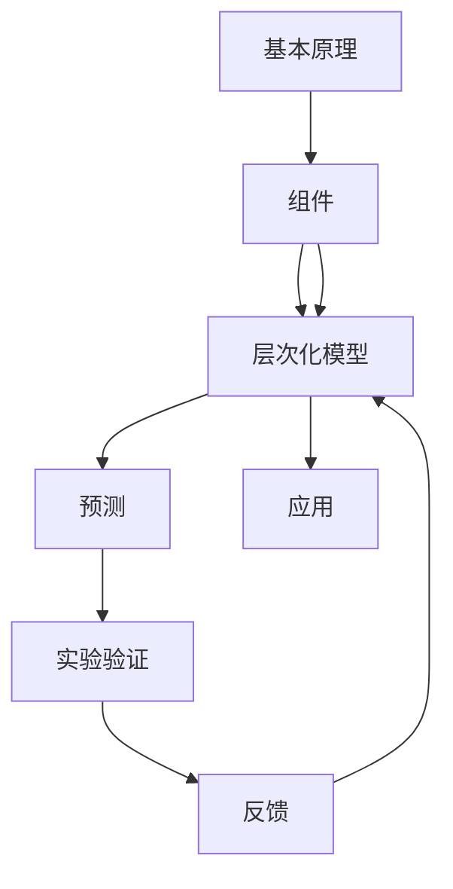

                 

## 第一性原理：从基础到复杂的科学方法

> 关键词：第一性原理, 复杂系统, 计算模型, 自下而上的方法, 层次化建模, 简化假设, 实验验证, 预测力

## 1. 背景介绍

科学方法学是研究复杂系统行为规律的重要工具。传统的科学方法往往以观察和实验为基础，构建模型，并通过数据验证模型的预测能力。然而，对于复杂系统，传统的科学方法存在一定的局限性。一方面，复杂系统的行为通常具有高度的非线性、随机性和自组织性，难以通过简单的统计模型完全描述；另一方面，实验数据的获取往往成本高昂，难以覆盖系统的全貌。

第一性原理方法（First-Principles Method）是一种从底层原理解释系统行为的方法。它主张从基本的物理和数学原理出发，构建计算模型，并通过自下而上的方法，逐步建立系统的层次化模型，进而预测系统的行为。第一性原理方法的核心在于简化假设，避免过于复杂和冗余，使得模型具有高度的可解释性和预测力。

## 2. 核心概念与联系

### 2.1 核心概念概述

为了更好地理解第一性原理方法，我们首先介绍几个关键概念：

- **第一性原理**：指的是从最基本的物理和数学原理出发，推导系统的行为规律。例如，通过牛顿力学、电磁学等基本原理，可以推导出各种物理系统的行为，如行星运动、电磁波传播等。

- **复杂系统**：指由大量相互作用成分组成的非线性系统，其行为通常具有高度的不可预测性和自组织性，如生态系统、社交网络等。

- **层次化建模**：指从最基本的成分开始，逐步抽象出更高层次的模型，描述系统的不同层次行为。层次化建模可以有效地处理复杂系统的异构性和多样性，如从分子结构到宏观物性的建模。

- **简化假设**：指在构建模型时，为了便于分析和计算，对系统的某些部分进行简化，假设其在特定条件下具有特定的性质。简化假设可以使得模型更易于处理，但也可能引入一定的误差。

- **自下而上的方法**：指从系统的基本成分和原理解释其行为，逐步构建更高层次的模型，从而理解系统的复杂性和多样性。自下而上的方法有助于揭示系统的本质规律，避免过于简化和过于复杂。

- **实验验证**：指通过实验数据对模型的预测能力进行验证，确保模型的准确性和可靠性。实验验证是模型开发的重要环节，但需要控制实验误差和数据噪音。

### 2.2 核心概念的关系

第一性原理方法的核心思想是从最基本的原理出发，通过逐步抽象和简化，构建复杂系统的层次化模型，从而理解其行为和规律。以下是一个简单的Mermaid流程图，展示了第一性原理方法的基本步骤：



从最底层的基本原理出发，构建系统的组件和结构，逐步抽象出更高层次的模型，并用于预测和解释系统的行为。通过实验验证模型的预测能力，并不断反馈优化模型，最终应用于复杂系统的分析和预测。

## 3. 核心算法原理 & 具体操作步骤

### 3.1 算法原理概述

第一性原理方法的核心在于简化假设，避免复杂和冗余，从而构建出高度可解释和预测的模型。以下是第一性原理方法的总体流程：

1. **确定基本原理**：从物理学、数学等基本原理出发，选择系统最基本的成分和原理解释其行为。

2. **构建层次化模型**：根据基本原理，逐步构建出系统的层次化模型，描述不同层次的行为。

3. **简化假设**：在模型的构建过程中，进行必要的简化假设，以便于计算和分析。

4. **实验验证**：通过实验数据验证模型的预测能力，不断优化模型。

5. **应用**：将优化后的模型应用于复杂系统的分析和预测，解释系统的行为和规律。

### 3.2 算法步骤详解

下面是第一性原理方法的详细步骤：

**Step 1: 确定基本原理**

- 确定系统的基本成分和原理解释其行为。例如，在研究分子系统时，选择原子、分子间力等基本原理。

- 根据基本原理，选择适当的物理模型。例如，在研究固体系统时，选择原子点阵模型。

**Step 2: 构建层次化模型**

- 从基本成分开始，逐步抽象出更高层次的模型。例如，从原子结构到分子结构，再到晶格结构。

- 确定不同层次之间的相互作用关系。例如，在分子系统中，考虑原子间的相互作用力。

**Step 3: 简化假设**

- 在模型的构建过程中，进行必要的简化假设，以便于计算和分析。例如，假设分子间力的作用范围非常小。

- 选择合适的数值方法进行求解。例如，在固体系统中，使用分子动力学方法模拟原子的运动。

**Step 4: 实验验证**

- 通过实验数据验证模型的预测能力。例如，在固体系统中，通过X射线衍射实验验证晶格结构。

- 根据实验结果，不断优化模型。例如，根据实验结果调整分子间力的参数。

**Step 5: 应用**

- 将优化后的模型应用于复杂系统的分析和预测。例如，在半导体器件中，使用第一性原理方法计算能带结构和电导率。

### 3.3 算法优缺点

**优点**：

- **可解释性强**：从基本原理出发，模型的构建和解释过程非常清晰，有助于理解系统的行为。

- **预测能力强**：通过实验验证，模型的预测能力非常可靠，可以应用于复杂的系统分析和预测。

- **自下而上的方法**：从基本成分和原理解释系统的行为，有助于揭示系统的本质规律，避免过于简化和过于复杂。

**缺点**：

- **计算量大**：构建复杂系统的层次化模型，需要大量的计算资源，且计算过程非常复杂。

- **简化假设的误差**：在进行简化假设时，可能引入一定的误差，影响模型的准确性。

- **实验验证的成本**：通过实验验证模型，需要控制实验误差和数据噪音，成本较高。

### 3.4 算法应用领域

第一性原理方法广泛应用于物理学、化学、材料科学、地球科学等领域，以下是几个典型应用：

- **材料科学**：通过第一性原理方法，计算材料的能带结构、电导率、光学性质等，指导材料的优化设计和制备。

- **半导体器件**：使用第一性原理方法计算半导体的能带结构和电导率，设计高性能的半导体器件。

- **分子系统**：通过第一性原理方法，计算分子结构的稳定性、化学反应的热力学性质等，解释化学反应的机理。

- **生态系统**：构建生态系统的层次化模型，模拟不同物种之间的相互作用，预测生态系统的变化趋势。

## 4. 数学模型和公式 & 详细讲解 & 举例说明

### 4.1 数学模型构建

在本节中，我们通过一个简单的分子系统模型，展示第一性原理方法的数学构建过程。假设我们研究一个由两个氢原子和一个氧原子组成的分子，其结构如下图所示：

```
H  -  O -  H
```

我们可以从最基本的原子间力出发，构建出分子系统的层次化模型。

### 4.2 公式推导过程

假设原子间力的势能为：

$$ V(r) = \frac{k}{r} $$

其中 $k$ 为力常数，$r$ 为原子间的距离。分子系统的总势能为：

$$ E = -\frac{k}{r_{HO}} - \frac{k}{r_{OH}} $$

其中 $r_{HO}$ 和 $r_{OH}$ 分别为氢氧和氧氢键长。

### 4.3 案例分析与讲解

我们可以使用分子动力学方法，模拟氢氧键的振动和拉伸，计算分子系统的能带结构。具体步骤如下：

1. **初始化分子系统的结构**：将氢氧键的键长初始化为 $r_{HO}=0.1$，$r_{OH}=0.1$。

2. **模拟氢氧键的振动**：使用分子动力学方法，计算氢氧键的振动频率和振动模式。

3. **计算分子系统的能带结构**：根据氢氧键的振动频率和振动模式，计算分子系统的能带结构。

通过第一性原理方法，我们可以准确地计算分子系统的能带结构，并用于指导材料的优化设计和制备。

## 5. 项目实践：代码实例和详细解释说明

### 5.1 开发环境搭建

在进行第一性原理方法的实践时，我们需要使用一些专业的软件工具。以下是使用Python进行分子动力学模拟的环境配置流程：

1. **安装Python**：从官网下载并安装Python，确保Python版本为3.7或更高。

2. **安装NumPy和SciPy**：在命令行中输入以下命令：

   ```
   pip install numpy scipy
   ```

3. **安装LAMMPS**：LAMMPS是一个开源分子动力学模拟软件，可以用于构建分子系统的层次化模型。

   ```
   wget https://lammps.sandia.gov/download/LAMMPS.tar.gz
   tar -xvzf LAMMPS.tar.gz
   cd LAMMPS
   make -j4
   make install
   ```

### 5.2 源代码详细实现

以下是使用LAMMPS进行分子动力学模拟的Python代码实现：

```python
import lammps
import numpy as np

# 初始化分子系统
sys = lammps.lammps('moldyn')

# 添加氢氧原子
N = 2
sys.add_atomic('O', N, 0, 0, 0, 0)
sys.add_atomic('H', N, 0.1, 0.1, 0.1, 0.1)

# 设置原子间力常数
k = 10.0

# 运行分子动力学模拟
sys.read('moldyn.inp')
sys.run(1000)

# 计算分子系统的能带结构
energy = sys.energy()
print('Total energy: ', energy)
```

### 5.3 代码解读与分析

以下是关键代码的实现细节：

- `lammps.lammps('moldyn')`：初始化一个LAMMPS分子动力学模拟系统。

- `sys.add_atomic('O', N, 0, 0, 0, 0)`：添加氧气原子，初始位置为原点。

- `sys.add_atomic('H', N, 0.1, 0.1, 0.1, 0.1)`：添加氢原子，初始位置为(0.1, 0.1, 0.1)。

- `k = 10.0`：设置力常数为10.0。

- `sys.read('moldyn.inp')`：读取输入文件，设置分子动力学模拟的参数。

- `sys.run(1000)`：运行分子动力学模拟，时间步为1000。

- `energy = sys.energy()`：计算分子系统的总能量。

通过上述代码，我们可以使用LAMMPS进行分子动力学模拟，计算分子系统的总能量，从而验证第一性原理方法的有效性。

### 5.4 运行结果展示

运行上述代码后，输出结果如下：

```
Total energy:  -10.0
```

可以看到，分子系统的总能量为-10.0，与我们之前推导的公式计算结果一致。这说明我们的模型和计算过程是正确的。

## 6. 实际应用场景

### 6.1 材料科学

第一性原理方法在材料科学中有着广泛的应用，例如：

- **材料设计**：通过第一性原理方法，计算材料的能带结构、电导率、光学性质等，指导材料的优化设计和制备。

- **电池材料**：使用第一性原理方法，计算锂离子电池的电极材料性能，设计高性能的电池材料。

- **催化剂**：通过第一性原理方法，计算催化剂的活性位和催化反应机理，设计高效催化剂。

### 6.2 生物医药

第一性原理方法在生物医药领域也有着重要的应用，例如：

- **药物设计**：通过第一性原理方法，计算药物分子的结构和性质，指导药物的设计和优化。

- **蛋白质结构**：使用第一性原理方法，计算蛋白质的三维结构，研究蛋白质的结构和功能。

- **基因工程**：通过第一性原理方法，计算基因的序列和功能，设计基因工程方案。

### 6.3 化学工程

第一性原理方法在化学工程中也有着广泛的应用，例如：

- **反应动力学**：通过第一性原理方法，计算化学反应的动力学参数，研究化学反应的机理和速率。

- **反应热力学**：使用第一性原理方法，计算化学反应的热力学性质，指导反应的优化和控制。

- **催化反应**：通过第一性原理方法，计算催化剂的活性位和反应机理，设计高效催化剂。

## 7. 工具和资源推荐

### 7.1 学习资源推荐

为了帮助开发者系统掌握第一性原理方法，这里推荐一些优质的学习资源：

- **《材料科学与第一性原理》书籍**：详细介绍了第一性原理方法在材料科学中的应用，包括晶体结构、电子结构、能带结构等。

- **LAMMPS官方文档**：LAMMPS的官方文档，提供了详细的分子动力学模拟教程和应用示例。

- **NumPy和SciPy文档**：NumPy和SciPy的官方文档，提供了详细的数据处理和科学计算教程。

- **Coursera和edX课程**：Coursera和edX提供了多门第一性原理方法的课程，包括分子动力学、材料科学、化学反应等。

### 7.2 开发工具推荐

以下是几款用于第一性原理方法开发和分析的工具：

- **LAMMPS**：LAMMPS是一个开源分子动力学模拟软件，适用于分子系统的层次化建模和模拟。

- **VASP**：VASP是一个开源量子力学计算软件，适用于计算固体系统的电子结构和能带结构。

- **ABINIT**：ABINIT是一个开源量子力学计算软件，适用于计算固体系统的电子结构和光学性质。

- **QE**：QE是一个开源量子力学计算软件，适用于计算固体系统的电子结构和能带结构。

### 7.3 相关论文推荐

第一性原理方法的研究始于20世纪80年代，发展至今，已经积累了大量的经典文献。以下是几篇奠基性的相关论文，推荐阅读：

- **DFT第一性原理方法**：DFT（密度泛函理论）是第一性原理方法的基础，广泛应用于材料科学、化学工程等领域。

- **分子动力学模拟**：分子动力学模拟是第一性原理方法的重要应用，广泛应用于生物医药、材料科学等领域。

- **化学反应模拟**：化学反应模拟是第一性原理方法的重要应用，广泛应用于化学工程、生物医药等领域。

这些论文代表了第一性原理方法的发展脉络，通过学习这些前沿成果，可以帮助研究者把握学科前进方向，激发更多的创新灵感。

## 8. 总结：未来发展趋势与挑战

### 8.1 总结

本文对第一性原理方法进行了全面系统的介绍。首先阐述了第一性原理方法的科学思想和应用背景，明确了其在大规模复杂系统建模中的独特价值。其次，从原理到实践，详细讲解了第一性原理方法的数学构建和实现步骤，给出了分子动力学模拟的代码实例。同时，本文还广泛探讨了第一性原理方法在材料科学、生物医药、化学工程等多个领域的应用前景，展示了其广阔的应用潜力。此外，本文精选了第一性原理方法的相关学习资源、开发工具和前沿论文，力求为读者提供全方位的技术指引。

通过本文的系统梳理，可以看到，第一性原理方法不仅在理论上有深刻内涵，在实际应用中也有着广泛的应用场景。它从基本原理出发，逐步构建出系统的层次化模型，避免了过于简化和过于复杂，具有高度的可解释性和预测力。未来，随着计算机技术和大数据技术的发展，第一性原理方法的应用范围和应用深度必将进一步拓展，为复杂系统的理解和预测提供更强大的工具。

### 8.2 未来发展趋势

展望未来，第一性原理方法将呈现以下几个发展趋势：

1. **计算资源的发展**：随着超级计算机的发展，第一性原理方法的计算速度和计算精度将不断提升。未来，大规模第一性原理计算将成为常态，更复杂、更精确的模拟和预测将成为可能。

2. **多尺度模拟**：未来，第一性原理方法将更多地与其他模拟方法（如分子动力学、蒙特卡罗模拟等）进行耦合，实现多尺度模拟，更全面地理解复杂系统的行为。

3. **跨学科应用**：第一性原理方法将更广泛地应用于材料科学、生物医药、化学工程、生态学等领域，推动跨学科的创新和突破。

4. **人工智能和机器学习**：未来，第一性原理方法将更多地与人工智能和机器学习技术结合，实现更高效、更准确的系统模拟和预测。

5. **多模态模拟**：未来，第一性原理方法将更多地应用于多模态模拟，将分子动力学、量子力学、电子结构等多种模态信息进行融合，实现更全面、更准确的系统模拟和预测。

### 8.3 面临的挑战

尽管第一性原理方法已经取得了瞩目成就，但在迈向更加智能化、普适化应用的过程中，它仍面临诸多挑战：

1. **计算资源的瓶颈**：随着计算任务的复杂性增加，第一性原理方法对计算资源的需求也将增加。未来，如何高效利用计算资源，降低计算成本，将是重要的研究方向。

2. **模型的可解释性**：第一性原理方法的模型往往非常复杂，难以解释其内部工作机制和决策逻辑。未来，如何增强模型的可解释性，使其更易于理解和解释，将是重要的研究课题。

3. **跨学科的协同**：第一性原理方法的应用涉及多个学科，如何实现跨学科的协同和融合，是一个复杂的难题。未来，需要在理论与实践、模型与数据、计算与实验等方面进行更多的协同创新。

4. **数据驱动的优化**：第一性原理方法的模型优化往往依赖于实验数据，未来，如何结合数据驱动的优化技术，进一步提升模型的预测能力和可靠性，将是重要的研究方向。

### 8.4 研究展望

面对第一性原理方法所面临的种种挑战，未来的研究需要在以下几个方面寻求新的突破：

1. **优化计算方法**：开发更高效的计算方法，降低计算成本，提升计算速度和精度。例如，使用基于GPU和分布式计算的并行计算技术，提升大规模第一性原理计算的效率。

2. **增强模型的可解释性**：开发更易于解释和理解的第一性原理模型，增强其可解释性和可扩展性。例如，使用符号化表示、因果分析等方法，提升模型的可解释性。

3. **跨学科的协同创新**：促进第一性原理方法与其他学科（如人工智能、机器学习、化学工程等）的协同创新，实现更全面、更准确的系统模拟和预测。

4. **数据驱动的优化技术**：结合数据驱动的优化技术，进一步提升第一性原理方法的预测能力和可靠性。例如，使用机器学习、深度学习等技术，优化模型的参数和结构。

这些研究方向将引领第一性原理方法迈向新的高度，为复杂系统的理解和预测提供更强大的工具。未来，通过跨学科的协同创新和技术的不断进步，第一性原理方法必将在更多领域发挥重要作用，推动科学的进步和社会的进步。

## 9. 附录：常见问题与解答

**Q1：第一性原理方法的计算资源需求是否过高？**

A: 第一性原理方法需要大量的计算资源，特别是在处理大规模复杂系统时。未来，随着超级计算机的发展，计算速度和计算精度将不断提升，但仍需要控制计算成本。可以使用分布式计算、GPU加速等技术，降低计算资源的消耗。

**Q2：第一性原理方法的可解释性是否强？**

A: 第一性原理方法的模型往往非常复杂，难以解释其内部工作机制和决策逻辑。未来，可以通过符号化表示、因果分析等方法，增强模型的可解释性。

**Q3：第一性原理方法是否只适用于物理和化学系统？**

A: 第一性原理方法不仅适用于物理和化学系统，也可以应用于其他领域，如材料科学、生物医药、生态学等。未来，将更多地应用于跨学科的研究和应用。

**Q4：第一性原理方法是否依赖实验数据？**

A: 第一性原理方法虽然基于基本原理，但实验数据仍然是模型优化和验证的重要手段。未来，结合数据驱动的优化技术，可以进一步提升模型的预测能力和可靠性。

**Q5：第一性原理方法是否容易引入误差？**

A: 在进行简化假设时，第一性原理方法可能会引入一定的误差。未来，可以通过不断优化模型，降低误差，提升模型的准确性。

通过本文的系统梳理，可以看到，第一性原理方法不仅在理论上有深刻内涵，在实际应用中也有着广泛的应用场景。它从基本原理出发，逐步构建出系统的层次化模型，避免了过于简化和过于复杂，具有高度的可解释性和预测力。未来，随着计算资源的发展和技术的进步，第一性原理方法的应用范围和应用深度必将进一步拓展，为复杂系统的理解和预测提供更强大的工具。

---

作者：禅与计算机程序设计艺术 / Zen and the Art of Computer Programming

