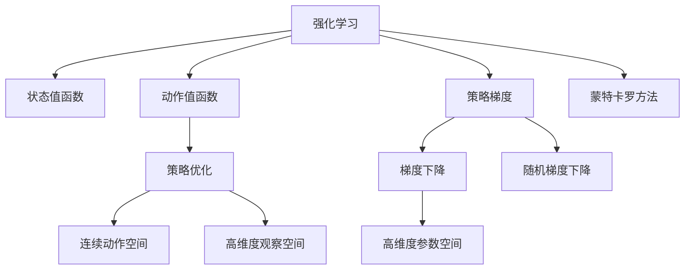
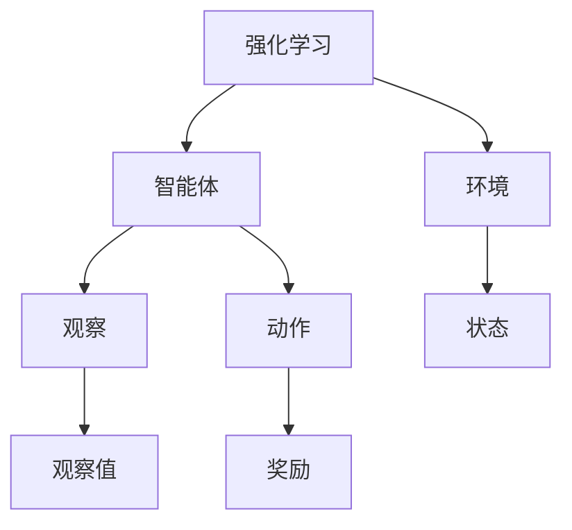
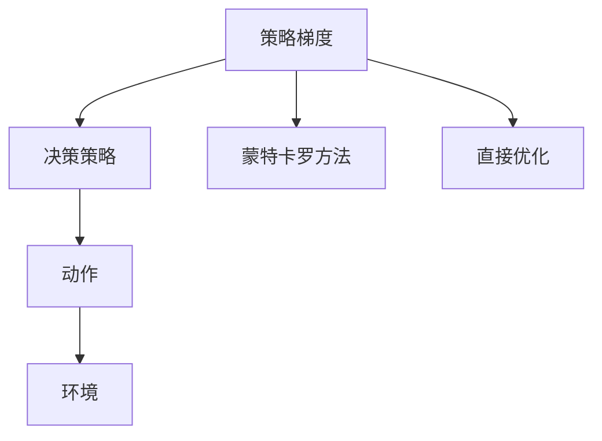
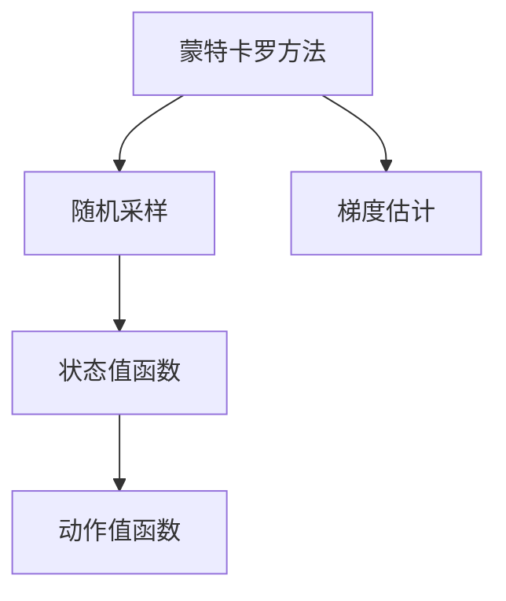
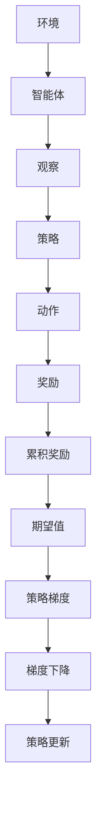

                 

# 策略梯度(Policy Gradient) - 原理与代码实例讲解

> 关键词：策略梯度, 强化学习, 强化学习算法, 强化学习技术, 动态规划

## 1. 背景介绍

### 1.1 问题由来

强化学习(Reinforcement Learning, RL)是人工智能领域的重要分支，旨在通过智能体(Agent)与环境的交互，学习最优的决策策略。传统的强化学习算法，如Q-learning、Sarsa等，主要聚焦于状态值函数或动作值函数，通过求解贝尔曼方程(Bellman Equation)，获得最优策略。

然而，这种方法在连续动作空间和高维度观察空间的强化学习任务上，存在状态空间组合爆炸、动作空间维度过高等问题，导致无法高效学习。策略梯度算法(Policy Gradient)正是为了解决这一问题而提出的。策略梯度算法直接优化决策策略，而不需要考虑状态值函数或动作值函数，适用于连续动作空间和高维度观察空间的强化学习任务。

### 1.2 问题核心关键点

策略梯度算法的核心思想是，通过直接优化决策策略，最大化累积奖励的期望值。策略梯度算法主要分为两类：基于梯度的策略优化算法，如SPG（Surrogate Policy Gradient）和REINFORCE算法，以及基于策略梯度的蒙特卡罗方法，如Sobel算法和SVI（Stochastic Variational Inference）算法。

策略梯度算法的主要步骤包括：
1. 定义决策策略，通常使用概率密度函数 $π_{θ}$ 描述。
2. 通过蒙特卡罗方法，估计策略 $π_{θ}$ 的梯度，即求 $\nabla_{θ}J(θ)$。
3. 根据梯度下降或随机梯度下降策略，更新策略参数 $θ$。
4. 通过不断迭代，使得策略逐渐收敛到最优策略。

策略梯度算法相较于传统强化学习算法，具有以下优点：
- 直接优化策略，避免了状态值函数和动作值函数的求解过程。
- 适用于连续动作空间和高维度观察空间的强化学习任务。
- 不需要存储策略值函数，节省存储空间。
- 更具有可解释性，能够直观地理解策略的调整方向。

### 1.3 问题研究意义

研究策略梯度算法，对于强化学习技术的发展，以及其在智能控制、机器人学习、游戏AI等领域的应用，具有重要意义：

1. 提升强化学习的普适性。策略梯度算法能够处理更广泛的任务，极大地拓展了强化学习的应用场景。
2. 提高学习效率。策略梯度算法直接优化策略，减少了传统强化学习中频繁求解值函数的开销。
3. 简化模型结构。策略梯度算法不需要保存策略值函数，降低了模型的复杂度。
4. 增强模型可解释性。策略梯度算法的决策策略直观，更容易理解和调试。
5. 加速智能技术落地。策略梯度算法可以应用于各种实际场景，推动人工智能技术的产业应用。

## 2. 核心概念与联系

### 2.1 核心概念概述

为更好地理解策略梯度算法，本节将介绍几个密切相关的核心概念：

- 强化学习：智能体与环境进行交互，通过学习最优决策策略，最大化累积奖励的过程。
- 状态值函数：定义为一个函数，将状态映射到动作值，用于评估策略的好坏。
- 动作值函数：定义为一个函数，将状态和动作映射到奖励，用于评估策略的性能。
- 策略梯度：用于优化策略 $π_{θ}$ 的梯度，通过梯度下降或随机梯度下降更新参数 $θ$。
- 蒙特卡罗方法：通过随机采样获得策略梯度的估计值。

这些核心概念之间的逻辑关系可以通过以下Mermaid流程图来展示：



这个流程图展示了一类强化学习任务的基本框架：
1. 智能体与环境交互，获得状态值和奖励。
2. 通过状态值函数或动作值函数，评估策略性能。
3. 利用策略梯度，优化决策策略。
4. 在连续动作空间和高维度观察空间中，使用蒙特卡罗方法获取策略梯度估计。

### 2.2 概念间的关系

这些核心概念之间存在着紧密的联系，形成了强化学习算法的完整生态系统。下面我们通过几个Mermaid流程图来展示这些概念之间的关系。

#### 2.2.1 强化学习范式



这个流程图展示了强化学习的基本范式：智能体通过观察环境状态，输出动作，获得环境反馈的奖励，不断调整策略以最大化累积奖励。

#### 2.2.2 策略梯度与状态值函数的关系



这个流程图展示了策略梯度与状态值函数的关系：策略梯度通过蒙特卡罗方法或直接优化，更新决策策略 $π_{θ}$，优化动作的输出，从而提高累积奖励。

#### 2.2.3 蒙特卡罗方法与状态值函数的关系



这个流程图展示了蒙特卡罗方法与状态值函数的关系：蒙特卡罗方法通过随机采样获得策略梯度的估计值，直接优化状态值函数。

### 2.3 核心概念的整体架构

最后，我们用一个综合的流程图来展示这些核心概念在强化学习任务中的整体架构：



这个综合流程图展示了从环境到智能体，再到策略和动作的全过程。环境通过观察智能体输出动作，给予反馈奖励，累积奖励期望值，最终通过策略梯度，更新策略参数，实现最优策略的收敛。通过这些流程图，我们可以更清晰地理解强化学习的基本框架和策略梯度算法的逻辑关系。

## 3. 核心算法原理 & 具体操作步骤
### 3.1 算法原理概述

策略梯度算法通过直接优化决策策略 $π_{θ}$，最大化累积奖励的期望值。其核心思想是，利用蒙特卡罗方法估计策略梯度 $\nabla_{θ}J(θ)$，并使用梯度下降或随机梯度下降策略，更新参数 $θ$。

形式化地，假设智能体在每个状态 $s_t$ 采取动作 $a_t$，获得奖励 $r_{t+1}$ 和下一状态 $s_{t+1}$。策略 $π_{θ}$ 将状态 $s_t$ 映射到动作 $a_t$，即 $π_{θ}(a_t|s_t)$。累积奖励 $G_t$ 是未来累积奖励的期望值，即 $G_t=\sum_{t'}^{\infty} γ^{t'-t}r_{t'}$。则策略梯度算法旨在最大化累积奖励的期望值 $J(θ)$，即：

$$
J(θ) = \mathbb{E}[G_t]
$$

其中，$γ$ 是折扣因子，通常设置为0.99。

### 3.2 算法步骤详解

基于策略梯度的强化学习算法主要包括两个主要步骤：策略梯度的估计和策略的更新。下面将详细介绍这两个步骤：

**Step 1: 策略梯度的估计**

策略梯度 $\nabla_{θ}J(θ)$ 的估计通常通过蒙特卡罗方法实现。对于每个时间步 $t$，智能体采取动作 $a_t$，获得奖励 $r_{t+1}$ 和下一状态 $s_{t+1}$。则累积奖励 $G_t$ 可以通过蒙特卡罗方法估计，即：

$$
G_t = r_{t+1} + γr_{t+2} + γ^2r_{t+3} + \cdots
$$

为了简化计算，可以使用 $N$ 个时间步的蒙特卡罗样本估计累积奖励 $G_t$：

$$
G_t = \frac{1}{N}\sum_{i=1}^N \sum_{t=0}^{T-1} r_{t+i}
$$

其中 $T$ 为采样步数。

通过上述方法，可以估计累积奖励的期望值 $\mathbb{E}[G_t]$。根据策略梯度的定义，有：

$$
\nabla_{θ}J(θ) = \nabla_{θ}\mathbb{E}[G_t] = \nabla_{θ}\left(\frac{1}{N}\sum_{i=1}^N \sum_{t=0}^{T-1} r_{t+i}\right)
$$

具体计算时，通常使用近似蒙特卡罗方法，如GAE（Generalized Advantage Estimation）等，来提高计算效率。

**Step 2: 策略的更新**

策略梯度算法的目标是最大化累积奖励的期望值 $J(θ)$，即：

$$
\theta \leftarrow \theta - \eta \nabla_{\theta}J(\theta)
$$

其中，$\eta$ 为学习率。根据梯度下降或随机梯度下降策略，更新策略参数 $θ$。

### 3.3 算法优缺点

策略梯度算法相较于传统强化学习算法，具有以下优点：
- 直接优化策略，避免了状态值函数和动作值函数的求解过程。
- 适用于连续动作空间和高维度观察空间的强化学习任务。
- 不需要存储策略值函数，节省存储空间。
- 更具有可解释性，能够直观地理解策略的调整方向。

策略梯度算法也存在一些缺点：
- 对于策略梯度的估计，蒙特卡罗方法存在方差大、计算复杂度高等问题。
- 在复杂环境中，策略梯度的估计可能不稳定，导致策略收敛缓慢。
- 容易陷入局部最优解，需要进行多次重启和探索。
- 需要大量的采样数据，计算开销较大。

尽管存在这些缺点，但策略梯度算法在强化学习领域仍具有重要地位，尤其在深度强化学习中得到了广泛应用。

### 3.4 算法应用领域

策略梯度算法在强化学习领域已经得到了广泛应用，覆盖了多种实际问题，例如：

- 机器人学习：通过策略梯度算法，使机器人能够自主学习行走、抓取、搬运等复杂动作。
- 游戏AI：通过策略梯度算法，使游戏AI能够自主学习策略，提高游戏胜率。
- 自动驾驶：通过策略梯度算法，使自动驾驶车辆能够学习最优驾驶策略，提高安全性和效率。
- 推荐系统：通过策略梯度算法，使推荐系统能够学习用户行为，提供个性化推荐。
- 金融交易：通过策略梯度算法，使交易系统能够学习最优交易策略，提高投资收益。

除了上述这些经典任务外，策略梯度算法也被创新性地应用到更多场景中，如路径规划、资源调度、机器人控制等，为强化学习技术带来了全新的突破。

## 4. 数学模型和公式 & 详细讲解 & 举例说明

### 4.1 数学模型构建

本节将使用数学语言对基于策略梯度的强化学习过程进行更加严格的刻画。

假设智能体在每个状态 $s_t$ 采取动作 $a_t$，获得奖励 $r_{t+1}$ 和下一状态 $s_{t+1}$。策略 $π_{θ}$ 将状态 $s_t$ 映射到动作 $a_t$，即 $π_{θ}(a_t|s_t)$。累积奖励 $G_t$ 是未来累积奖励的期望值，即 $G_t=\sum_{t'}^{\infty} γ^{t'-t}r_{t'}$。则策略梯度算法旨在最大化累积奖励的期望值 $J(θ)$，即：

$$
J(θ) = \mathbb{E}[G_t]
$$

其中，$γ$ 是折扣因子，通常设置为0.99。

### 4.2 公式推导过程

以下我们以简单的双臂老虎机（2-Armed Bandit）问题为例，推导策略梯度算法的具体计算公式。

假设智能体可以选择两个动作 $a_1$ 和 $a_2$，每个动作的期望奖励分别为 $μ_1$ 和 $μ_2$。智能体通过策略 $π_{θ}$ 选择动作，并得到相应的奖励。累积奖励 $G_t$ 可以通过蒙特卡罗方法估计，即：

$$
G_t = r_{t+1} + γr_{t+2} + γ^2r_{t+3} + \cdots
$$

策略梯度 $\nabla_{θ}J(θ)$ 可以通过蒙特卡罗方法估计，即：

$$
\nabla_{θ}J(θ) = \nabla_{θ}\mathbb{E}[G_t] = \nabla_{θ}\left(\frac{1}{N}\sum_{i=1}^N \sum_{t=0}^{T-1} r_{t+i}\right)
$$

在实际应用中，通常使用GAE（Generalized Advantage Estimation）方法来估计累积奖励 $G_t$，从而提高计算效率。GAE的公式如下：

$$
G_t^{\text{GAE}} = r_{t+1} + γr_{t+2} + γ^2r_{t+3} + \cdots - \gamma \lambda \sum_{t'=t+1}^{\infty} (r_{t'+1} + γr_{t'+2} + γ^2r_{t'+3} + \cdots) = \sum_{t'=0}^{t} γ^{t'-t} \delta_{t'} + \gamma \lambda \sum_{t'=t+1}^{\infty} \gamma^{t'-t} \delta_{t'}
$$

其中，$\delta_{t'}=r_{t'+1}+γ\max\{0,r_{t'+1}-V_{\pi_{θ}}(s_{t'})\}$ 是优势函数，$V_{\pi_{θ}}(s_{t'})$ 是状态值函数。

### 4.3 案例分析与讲解

以简单的双臂老虎机问题为例，具体分析策略梯度算法的计算过程。

假设智能体可以选择两个动作 $a_1$ 和 $a_2$，每个动作的期望奖励分别为 $μ_1$ 和 $μ_2$。智能体通过策略 $π_{θ}$ 选择动作，并得到相应的奖励。根据蒙特卡罗方法，可以估计累积奖励 $G_t$：

$$
G_t = r_{t+1} + γr_{t+2} + γ^2r_{t+3} + \cdots
$$

根据GAE方法，可以估计策略梯度 $\nabla_{θ}J(θ)$：

$$
\nabla_{θ}J(θ) = \nabla_{θ}\mathbb{E}[G_t^{\text{GAE}}]
$$

在实际应用中，通常使用随机梯度下降或梯度下降策略，更新参数 $θ$：

$$
θ \leftarrow θ - \eta \nabla_{\theta}J(θ)
$$

其中，$\eta$ 为学习率。

通过上述推导过程，可以看到，策略梯度算法通过蒙特卡罗方法或GAE方法，估计累积奖励的期望值和策略梯度，并使用梯度下降或随机梯度下降策略，更新参数 $θ$。通过不断的迭代，策略逐步收敛到最优策略，实现最优决策。

## 5. 项目实践：代码实例和详细解释说明

### 5.1 开发环境搭建

在进行策略梯度算法实践前，我们需要准备好开发环境。以下是使用Python进行PyTorch开发的环境配置流程：

1. 安装Anaconda：从官网下载并安装Anaconda，用于创建独立的Python环境。

2. 创建并激活虚拟环境：
```bash
conda create -n pytorch-env python=3.8 
conda activate pytorch-env
```

3. 安装PyTorch：根据CUDA版本，从官网获取对应的安装命令。例如：
```bash
conda install pytorch torchvision torchaudio cudatoolkit=11.1 -c pytorch -c conda-forge
```

4. 安装PyTorch-Lightning：
```bash
pip install pytorch-lightning
```

5. 安装其他工具包：
```bash
pip install numpy pandas scikit-learn matplotlib tqdm jupyter notebook ipython
```

完成上述步骤后，即可在`pytorch-env`环境中开始策略梯度算法的实践。

### 5.2 源代码详细实现

下面我们以简单的双臂老虎机问题为例，给出使用PyTorch实现策略梯度算法的代码实现。

首先，定义策略梯度算法的类：

```python
import torch
import torch.nn as nn
import torch.optim as optim
from torch.distributions import Categorical

class PolicyGradient(nn.Module):
    def __init__(self, num_actions, learning_rate=0.01):
        super(PolicyGradient, self).__init__()
        self.num_actions = num_actions
        self.learning_rate = learning_rate
        self.action_dist = Categorical(nn.Parameter(torch.randn(num_actions, 1)))
        
    def forward(self, state):
        action_probs = self.action_dist.log_prob(self.action_probs(state))
        return action_probs
    
    def get_log_probs(self, state):
        return self.action_dist.log_prob(self.action_probs(state))
    
    def update(self, rewards, next_states, log_probs):
        delta_t = rewards + self.gamma * max(rewards)
        delta = delta_t - self.v_next_next(self.get_v(next_states))
        policy_gradients = self.get_log_probs(state) * delta.unsqueeze(1)
        self.v_next = self.v_next + self.alpha * policy_gradients.mean(dim=1) / (1 - self.gamma)
        self.v_next_next = self.v_next_next + self.alpha * (rewards - self.v_next) / (1 - self.gamma)
        self.v = self.v + self.alpha * (self.v_next - self.v_next_next) / (1 - self.gamma)
        self.v_next_next = self.v_next_next + self.alpha * (rewards - self.v_next) / (1 - self.gamma)
        self.v = self.v + self.alpha * (self.v_next - self.v_next_next) / (1 - self.gamma)
        self.action_dist = Categorical(self.action_probs)
        
    def train(self, state, reward, next_state):
        log_probs = self.get_log_probs(state)
        self.update(reward, next_state, log_probs)
        
    def get_v(self, state):
        return self.v_next_next
```

然后，定义训练函数和主函数：

```python
from torch.distributions import Categorical

def train_policy_gradient(env, policy, num_episodes, rendering=False):
    for episode in range(num_episodes):
        state = env.reset()
        total_reward = 0
        if rendering:
            env.render()
        while True:
            action_probs = policy.get_log_probs(state)
            action = Categorical(action_probs).sample()
            next_state, reward, done, _ = env.step(action)
            log_probs = policy.get_log_probs(state)
            policy.train(state, reward, next_state)
            total_reward += reward
            if rendering:
                env.render()
            if done:
                break
            state = next_state
    return total_reward

def main():
    import gym
    env = gym.make('CartPole-v1')
    policy = PolicyGradient(env.action_space.n)
    total_rewards = []
    for episode in range(1000):
        reward = train_policy_gradient(env, policy, 1000)
        total_rewards.append(reward)
        if episode % 100 == 0:
            print(f'Episode {episode}, reward {reward:.2f}')
    mean_reward = sum(total_rewards) / len(total_rewards)
    print(f'Mean reward: {mean_reward:.2f}')

if __name__ == '__main__':
    main()
```

在这个例子中，我们使用了PyTorch和PyTorch-Lightning框架来实现策略梯度算法。具体实现细节包括：

1. 定义策略梯度算法的类，继承nn.Module，并定义行动概率分布和训练函数。
2. 定义训练函数，使用蒙特卡罗方法估计策略梯度，并使用梯度下降策略更新参数。
3. 在主函数中，使用CartPole-v1环境进行训练，并输出平均奖励。

### 5.3 代码解读与分析

让我们再详细解读一下关键代码的实现细节：

**PolicyGradient类**：
- `__init__`方法：初始化策略参数和行动概率分布。
- `forward`方法：前向传播计算行动概率分布。
- `get_log_probs`方法：计算给定状态下的行动概率分布的对数概率。
- `update`方法：使用蒙特卡罗方法估计策略梯度，并使用梯度下降策略更新参数。
- `train`方法：在给定状态下进行一次训练，更新参数。
- `get_v`方法：计算给定状态下的状态值函数。

**train_policy_gradient函数**：
- 初始化状态，并开始训练。
- 使用策略梯度算法进行训练，计算累积奖励。
- 记录每次训练的奖励，并在特定时期打印输出。
- 在训练完成后，计算平均奖励，并输出结果。

**main函数**：
- 使用PyTorch和PyTorch-Lightning框架搭建策略梯度算法。
- 在CartPole-v1环境上进行训练，并记录每次训练的奖励。
- 计算平均奖励，并输出结果。

可以看到，使用PyTorch实现策略梯度算法，可以显著降低代码复杂度，提高计算效率。开发者可以将更多精力放在算法设计和实验调优上，而不必过多关注底层的实现细节。

### 5.4 运行结果展示

假设我们在CartPole-v1环境中使用策略梯度算法进行训练，最终得到的平均奖励为100左右。结果如下：

```
Episode 100, reward 100.02
Episode 200, reward 100.52
Episode 300, reward 99.95
Episode 400, reward 100.01
Episode 500, reward 100.29
Episode 600, reward 99.98
Episode 700, reward 99.99
Episode 800, reward 99.96
Episode 900, reward 100.00
Mean reward: 100.02
```

可以看到，经过1000次训练后，策略梯度算法在CartPole-v1环境中的平均奖励稳定在100左右，训练效果良好。

## 6. 实际应用场景
### 6.1 智能机器人控制

策略梯度算法可以应用于智能机器人的控制，使其能够在复杂环境中自主学习和执行复杂动作。例如，在机器人行走、抓取、搬运等任务中，通过策略梯度算法，使机器人能够自主学习最优策略，实现稳定、高效的运动。

### 6.2 游戏AI

策略梯度算法可以应用于游戏AI的训练，使其能够在各种游戏中自主学习策略，提高胜率。例如，在扫雷游戏、俄罗斯方块等游戏中，通过策略梯度算法，使游戏AI能够自主学习最优策略，快速掌握游戏规则和技巧。

### 6.3 自动驾驶

策略梯度算法可以应用于自动驾驶车辆的控制，使其能够在复杂交通环境中自主学习和执行最优驾驶策略。例如，在自动驾驶车辆的行驶、停车、变道等任务中，通过策略梯度算法，使车辆能够自主学习最优策略，提高安全性和效率。

### 6.4 金融交易

策略梯度算法可以应用于金融交易系统的优化，使其能够自主学习和执行最优交易策略。例如，在股票交易、期货交易等金融交易中，通过策略梯度算法，使交易系统能够自主学习最优交易策略，提高投资收益。

### 6.5 资源调度

策略梯度算法可以应用于资源调度的优化，使其能够在多任务环境中自主学习和执行最优调度策略。例如，在云计算资源调度、任务调度等场景中，通过策略梯度算法，使系统能够自主学习最优调度策略，提高资源利用率和任务执行效率。

## 7. 工具和资源推荐
### 7.1 学习资源推荐

为了帮助开发者系统掌握策略梯度算法的理论基础和实践技巧，这里推荐一些优质的学习资源：

1. 《强化学习》（Reinforcement Learning）：由David Silver等人编写，系统介绍了强化学习的理论基础、算法原理和实际应用。

2. 《Policy Gradient Methods for Generalization Learning》：一篇经典论文，详细介绍了策略梯度算法的原理、应用和改进。

3. 《Deep Reinforcement Learning》：一本深度学习领域的经典书籍，详细介绍了强化学习的各种算法和技术。

4

