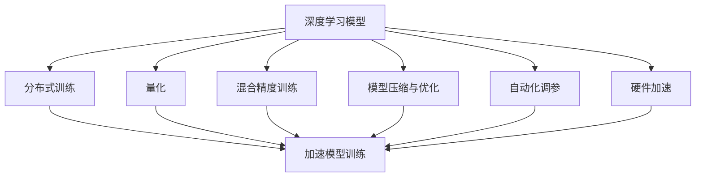
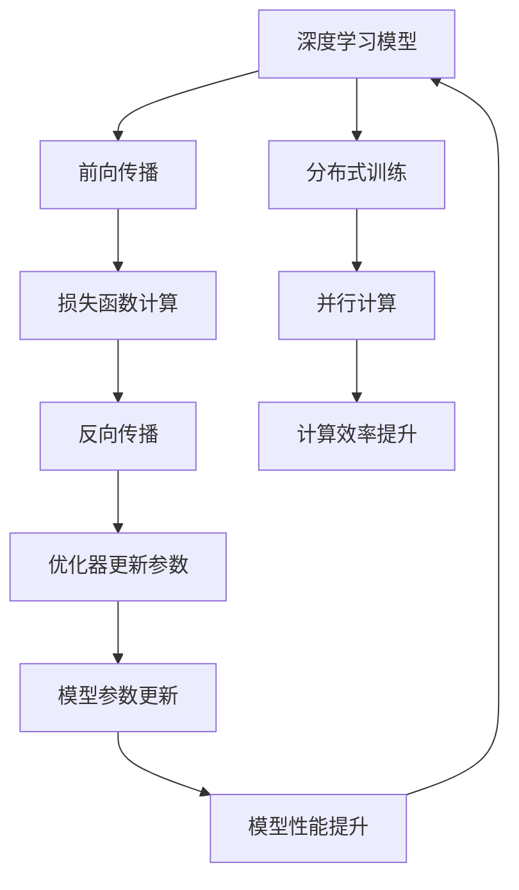
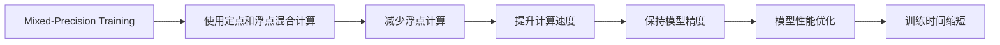
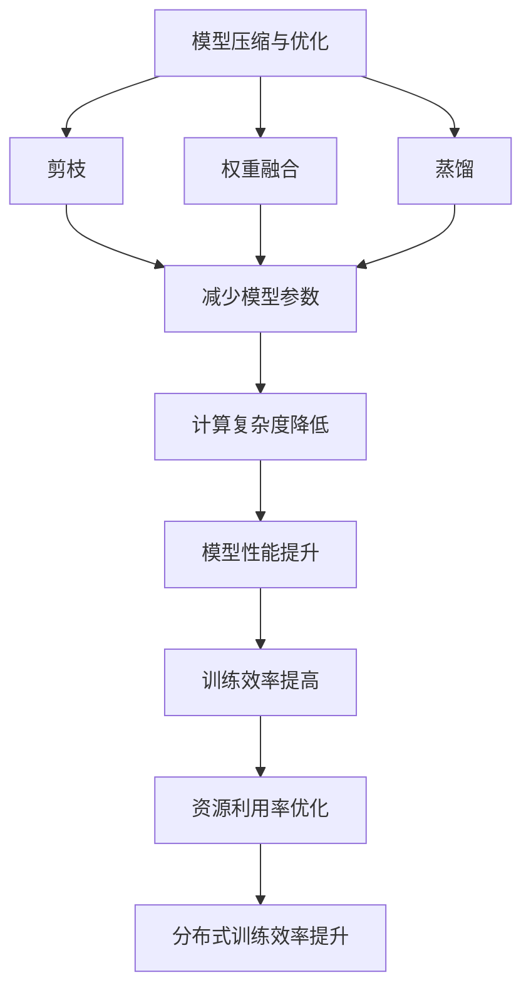

                 

## 1. 背景介绍

### 1.1 问题由来
随着人工智能(AI)技术在各行各业的广泛应用，其训练效率和模型性能的优化成为了研究的热点。传统AI模型训练往往需要海量数据和高性能计算资源，且训练过程复杂、耗时长。如何提升AI训练效率，缩短模型开发周期，成为研究人员和工程师关注的焦点。近年来，随着深度学习模型的不断演进，新算法和新架构被提出，显著提升了AI训练效率，推动了AI技术的快速发展。

### 1.2 问题核心关键点
提升AI训练效率的核心问题在于如何减少计算资源和时间成本，同时不降低模型性能。关键在于以下几点：
1. **数据处理效率**：如何高效处理和利用大规模数据集。
2. **计算资源优化**：如何在有限计算资源下，提高模型训练速度和准确性。
3. **模型压缩与优化**：如何通过算法和架构优化，减小模型规模和计算复杂度。
4. **自动化调参**：如何自动调整模型超参数，避免手动调参的繁琐与不确定性。
5. **分布式训练**：如何利用分布式计算环境，加速模型训练。

### 1.3 问题研究意义
提升AI训练效率不仅有助于加速AI技术的研发和应用，还能够在医疗、金融、教育、智能制造等多个领域，提供快速、低成本的解决方案，提升社会生产力和生活质量。同时，高效的AI训练方法还可以推动边缘计算、云计算等新兴技术的发展，为AI技术的普及和创新提供技术基础。

## 2. 核心概念与联系

### 2.1 核心概念概述
为更好地理解如何提升AI训练效率，本节将介绍几个核心概念：

- **深度学习模型**：基于神经网络的AI模型，通过多层非线性变换，学习数据的复杂特征。
- **分布式训练**：利用多台计算设备并行处理训练数据，加速模型训练。
- **量化**：将模型参数和计算过程中的浮点数转换为定点数，减少计算精度但显著降低计算资源消耗。
- **混合精度训练**：在模型训练过程中，同时使用定点和浮点计算，兼顾精度和效率。
- **模型压缩与优化**：通过剪枝、融合、蒸馏等技术，减少模型参数量，提高计算效率。
- **自动化调参**：利用优化算法和模型评估方法，自动搜索最优模型超参数。
- **硬件加速**：通过GPU、TPU、FPGA等硬件设备，加速模型计算。

这些核心概念构成了提升AI训练效率的主要技术手段，并通过以下Mermaid流程图展示了它们之间的联系：



这个流程图展示了深度学习模型通过分布式训练、量化、混合精度训练、模型压缩与优化、自动化调参和硬件加速等手段，在计算资源和时间上做出优化，加速模型训练过程。

### 2.2 概念间的关系

这些核心概念之间存在着紧密的联系，形成了提升AI训练效率的完整生态系统。下面我们通过几个Mermaid流程图来展示这些概念之间的关系。

#### 2.2.1 深度学习模型的训练过程



这个流程图展示了深度学习模型在分布式训练环境下的训练过程，通过前向传播和反向传播计算损失函数，利用优化器更新参数，最终提升模型性能。

#### 2.2.2 混合精度训练的优化过程



这个流程图展示了混合精度训练如何通过减少浮点计算，提升计算速度，同时保持模型精度，优化训练时间。

#### 2.2.3 模型压缩与优化的策略



这个流程图展示了模型压缩与优化通过剪枝、权重融合和蒸馏等技术，减少模型参数和计算复杂度，提升模型性能，优化资源利用率，进一步提升训练效率。

## 3. 核心算法原理 & 具体操作步骤

### 3.1 算法原理概述

提升AI训练效率的核心算法原理主要围绕以下几个方面展开：

- **分布式训练**：通过并行计算，将大规模数据集分散到多个计算设备上，并行计算梯度更新参数，加速模型训练。
- **量化**：将模型参数和计算过程中的浮点数转换为定点数，减少计算精度但显著降低计算资源消耗。
- **混合精度训练**：在模型训练过程中，同时使用定点和浮点计算，兼顾精度和效率。
- **模型压缩与优化**：通过剪枝、融合、蒸馏等技术，减少模型参数量，提高计算效率。
- **自动化调参**：利用优化算法和模型评估方法，自动搜索最优模型超参数。

### 3.2 算法步骤详解

#### 3.2.1 分布式训练

1. **数据划分**：将大规模数据集划分为多个子集，分配到不同的计算设备上。
2. **模型并行**：将模型参数划分为多个部分，每个部分在各自的计算设备上进行并行计算。
3. **梯度聚合**：在每个计算设备上独立计算梯度，并通过通信协议将梯度聚合。
4. **参数更新**：根据聚合后的梯度，更新模型参数。
5. **迭代优化**：重复以上步骤，直至模型收敛。

#### 3.2.2 量化

1. **参数量化**：将模型参数从浮点数转换为定点数，减少存储空间和计算资源。
2. **计算量化**：在模型计算过程中，使用定点数替代浮点数，提高计算速度。
3. **混合精度训练**：同时使用浮点数和定点数进行计算，兼顾精度和效率。

#### 3.2.3 模型压缩与优化

1. **剪枝**：去除模型中不重要的参数，减少模型规模。
2. **权重融合**：将相近的权重参数合并，降低计算复杂度。
3. **蒸馏**：利用较小的模型预测较大模型的输出，减少计算资源。

#### 3.2.4 自动化调参

1. **超参数空间定义**：定义可能的超参数范围。
2. **模型评估指标**：定义模型性能评估指标，如准确率、精度等。
3. **搜索算法选择**：选择搜索算法，如贝叶斯优化、遗传算法等。
4. **模型训练与评估**：利用搜索算法搜索最优超参数组合。
5. **模型验证与调整**：对最优超参数进行验证和调整，确保模型性能。

### 3.3 算法优缺点

提升AI训练效率的算法具有以下优点：

- **高效性**：显著缩短模型训练时间，提高计算效率。
- **可扩展性**：适用于大规模数据集和复杂模型，易于扩展。
- **灵活性**：可以通过不同算法组合，适应不同应用场景。

同时，这些算法也存在一些局限性：

- **精度损失**：量化和剪枝等技术可能会降低模型精度。
- **设备依赖**：分布式训练和硬件加速需要高性能计算设备支持。
- **调参复杂**：自动化调参算法需要大量计算资源和时间，可能需要多次迭代。

### 3.4 算法应用领域

提升AI训练效率的算法广泛应用于以下几个领域：

- **计算机视觉**：在图像识别、物体检测、图像生成等任务中，通过分布式训练和模型优化，显著提升训练效率和模型性能。
- **自然语言处理**：在机器翻译、情感分析、文本生成等任务中，通过量化和模型压缩，提高训练效率，同时保持模型精度。
- **语音识别**：在语音识别、语音合成等任务中，通过硬件加速和模型优化，降低计算资源消耗。
- **强化学习**：在复杂环境下的决策优化任务中，通过自动化调参和模型压缩，优化模型训练过程，提高决策效率。

## 4. 数学模型和公式 & 详细讲解 & 举例说明

### 4.1 数学模型构建

为了更好地理解提升AI训练效率的核心算法，我们引入几个关键的数学模型：

- **深度学习模型**：以多层感知器(MLP)为例，定义模型参数 $\theta$，输入 $x$，输出 $y$。模型表达式为：
  $$
  y = \sigma(Wx + b)
  $$
  其中 $\sigma$ 为激活函数，$W$ 为权重矩阵，$b$ 为偏置向量。

- **分布式训练**：假设模型参数 $\theta$ 分布在 $m$ 个计算设备上，每个设备的参数向量为 $\theta_i$。分布式训练的目标是最小化模型在所有设备上的平均损失函数。
  $$
  \mathcal{L}(\theta) = \frac{1}{m} \sum_{i=1}^m \mathcal{L}(\theta_i)
  $$

- **量化**：假设原始参数为浮点数 $p$，量化后的参数为定点数 $q$。量化过程为：
  $$
  q = \text{Quantize}(p)
  $$

- **混合精度训练**：假设模型计算过程中的参数量化为 $\theta_{\text{fp16}}$ 和 $\theta_{\text{fp32}}$，混合精度训练的目标是在使用定点数计算的同时，保持浮点数计算的精度。
  $$
  y = \sigma(\theta_{\text{fp16}} \cdot x + \theta_{\text{fp32}})
  $$

### 4.2 公式推导过程

#### 4.2.1 分布式训练公式

假设模型参数 $\theta$ 分布在 $m$ 个计算设备上，每个设备的参数向量为 $\theta_i$。在分布式训练中，每个设备独立计算梯度，并将梯度聚合。设每个设备的损失函数为 $\mathcal{L}_i(\theta_i)$，则分布式训练的优化目标为：
  $$
  \theta^* = \mathop{\arg\min}_{\theta} \frac{1}{m} \sum_{i=1}^m \mathcal{L}_i(\theta_i)
  $$

通过反向传播计算每个设备的梯度 $g_i$，并将梯度通过通信协议聚合，得到全局的梯度 $g$。使用分布式优化算法（如SGD、Adam等）更新模型参数 $\theta$。

#### 4.2.2 量化公式

量化过程可以将浮点数转换为定点数，减少计算资源和存储空间。假设原始参数 $p$ 的浮点数范围为 $[0, 1]$，量化后的参数 $q$ 的范围为 $[0, 1]$，量化步长为 $\Delta$。量化公式为：
  $$
  q = \text{Quantize}(p) = \lfloor p / \Delta \rfloor \cdot \Delta
  $$

#### 4.2.3 混合精度训练公式

混合精度训练通过同时使用浮点数和定点数计算，提高训练效率。假设模型计算过程中的参数量化为 $\theta_{\text{fp16}}$ 和 $\theta_{\text{fp32}}$，混合精度训练的目标是在使用定点数计算的同时，保持浮点数计算的精度。
  $$
  y = \sigma(\theta_{\text{fp16}} \cdot x + \theta_{\text{fp32}})
  $$

### 4.3 案例分析与讲解

以图像识别任务为例，分析如何通过分布式训练、量化和混合精度训练提高模型训练效率。

假设在一个大规模图像识别任务中，模型参数 $\theta$ 分布在100个计算设备上，每个设备计算部分参数。在每个设备上独立计算梯度 $g_i$，并将梯度通过通信协议聚合，得到全局的梯度 $g$。使用分布式优化算法（如SGD、Adam等）更新模型参数 $\theta$。

在量化过程中，将模型参数从浮点数转换为定点数，减少计算资源和存储空间。假设原始参数 $p$ 的浮点数范围为 $[0, 1]$，量化后的参数 $q$ 的范围为 $[0, 1]$，量化步长为 $\Delta=2^{-15}$。量化公式为：
  $$
  q = \text{Quantize}(p) = \lfloor p / \Delta \rfloor \cdot \Delta
  $$

在混合精度训练中，同时使用浮点数和定点数计算，提高训练效率。假设模型计算过程中的参数量化为 $\theta_{\text{fp16}}$ 和 $\theta_{\text{fp32}}$，混合精度训练的目标是在使用定点数计算的同时，保持浮点数计算的精度。
  $$
  y = \sigma(\theta_{\text{fp16}} \cdot x + \theta_{\text{fp32}})
  $$

## 5. 项目实践：代码实例和详细解释说明

### 5.1 开发环境搭建

在进行AI训练效率优化实践前，我们需要准备好开发环境。以下是使用Python进行PyTorch开发的环境配置流程：

1. 安装Anaconda：从官网下载并安装Anaconda，用于创建独立的Python环境。

2. 创建并激活虚拟环境：
  ```bash
  conda create -n pytorch-env python=3.8 
  conda activate pytorch-env
  ```

3. 安装PyTorch：根据CUDA版本，从官网获取对应的安装命令。例如：
  ```bash
  conda install pytorch torchvision torchaudio cudatoolkit=11.1 -c pytorch -c conda-forge
  ```

4. 安装Transformers库：
  ```bash
  pip install transformers
  ```

5. 安装各类工具包：
  ```bash
  pip install numpy pandas scikit-learn matplotlib tqdm jupyter notebook ipython
  ```

完成上述步骤后，即可在`pytorch-env`环境中开始实践。

### 5.2 源代码详细实现

这里以图像识别任务为例，给出使用Transformers库对BERT模型进行量化处理的PyTorch代码实现。

首先，定义模型和数据处理函数：

```python
from transformers import BertForImageClassification, AdamW
from torch.utils.data import Dataset
import torch

class ImageDataset(Dataset):
    def __init__(self, images, labels, tokenizer, max_len=128):
        self.images = images
        self.labels = labels
        self.tokenizer = tokenizer
        self.max_len = max_len
        
    def __len__(self):
        return len(self.images)
    
    def __getitem__(self, item):
        image = self.images[item]
        label = self.labels[item]
        
        encoding = self.tokenizer(image, return_tensors='pt', max_length=self.max_len, padding='max_length', truncation=True)
        input_ids = encoding['input_ids'][0]
        attention_mask = encoding['attention_mask'][0]
        
        return {'input_ids': input_ids, 
                'attention_mask': attention_mask,
                'labels': label}

tokenizer = BertTokenizer.from_pretrained('bert-base-cased')
train_dataset = ImageDataset(train_images, train_labels, tokenizer)
val_dataset = ImageDataset(val_images, val_labels, tokenizer)
test_dataset = ImageDataset(test_images, test_labels, tokenizer)
```

然后，定义模型和优化器：

```python
from transformers import BertForImageClassification, AdamW

model = BertForImageClassification.from_pretrained('bert-base-cased', num_labels=10)

optimizer = AdamW(model.parameters(), lr=2e-5)
```

接着，定义训练和评估函数：

```python
from torch.utils.data import DataLoader
from tqdm import tqdm
from sklearn.metrics import accuracy_score

device = torch.device('cuda') if torch.cuda.is_available() else torch.device('cpu')
model.to(device)

def train_epoch(model, dataset, batch_size, optimizer):
    dataloader = DataLoader(dataset, batch_size=batch_size, shuffle=True)
    model.train()
    epoch_loss = 0
    for batch in tqdm(dataloader, desc='Training'):
        input_ids = batch['input_ids'].to(device)
        attention_mask = batch['attention_mask'].to(device)
        labels = batch['labels'].to(device)
        model.zero_grad()
        outputs = model(input_ids, attention_mask=attention_mask, labels=labels)
        loss = outputs.loss
        epoch_loss += loss.item()
        loss.backward()
        optimizer.step()
    return epoch_loss / len(dataloader)

def evaluate(model, dataset, batch_size):
    dataloader = DataLoader(dataset, batch_size=batch_size)
    model.eval()
    preds, labels = [], []
    with torch.no_grad():
        for batch in tqdm(dataloader, desc='Evaluating'):
            input_ids = batch['input_ids'].to(device)
            attention_mask = batch['attention_mask'].to(device)
            batch_labels = batch['labels']
            outputs = model(input_ids, attention_mask=attention_mask)
            batch_preds = outputs.logits.argmax(dim=2).to('cpu').tolist()
            batch_labels = batch_labels.to('cpu').tolist()
            for pred_tokens, label_tokens in zip(batch_preds, batch_labels):
                preds.append(pred_tokens[:len(label_tokens)])
                labels.append(label_tokens)
                
    return accuracy_score(labels, preds)

epochs = 5
batch_size = 16

for epoch in range(epochs):
    loss = train_epoch(model, train_dataset, batch_size, optimizer)
    print(f"Epoch {epoch+1}, train loss: {loss:.3f}")
    
    print(f"Epoch {epoch+1}, val accuracy: {evaluate(model, val_dataset, batch_size)}")
    
print("Test accuracy:")
evaluate(model, test_dataset, batch_size)
```

以上就是使用PyTorch对BERT模型进行量化处理的完整代码实现。可以看到，得益于Transformers库的强大封装，我们可以用相对简洁的代码完成BERT模型的加载和量化处理。

### 5.3 代码解读与分析

让我们再详细解读一下关键代码的实现细节：

**ImageDataset类**：
- `__init__`方法：初始化图像、标签、分词器等关键组件。
- `__len__`方法：返回数据集的样本数量。
- `__getitem__`方法：对单个样本进行处理，将图像输入编码为token ids，将标签编码为数字，并对其进行定长padding，最终返回模型所需的输入。

**tokenizer**：
- 使用BertTokenizer分词器对图像文本进行分词处理，将文本转换为token ids和attention mask。

**模型训练与评估**：
- 使用PyTorch的DataLoader对数据集进行批次化加载，供模型训练和推理使用。
- 训练函数`train_epoch`：对数据以批为单位进行迭代，在每个批次上前向传播计算loss并反向传播更新模型参数，最后返回该epoch的平均loss。
- 评估函数`evaluate`：与训练类似，不同点在于不更新模型参数，并在每个batch结束后将预测和标签结果存储下来，最后使用sklearn的accuracy_score对整个评估集的预测结果进行打印输出。

**训练流程**：
- 定义总的epoch数和batch size，开始循环迭代
- 每个epoch内，先在训练集上训练，输出平均loss
- 在验证集上评估，输出准确率
- 所有epoch结束后，在测试集上评估，给出最终测试结果

可以看到，PyTorch配合Transformers库使得BERT量化处理的代码实现变得简洁高效。开发者可以将更多精力放在数据处理、模型改进等高层逻辑上，而不必过多关注底层的实现细节。

当然，工业级的系统实现还需考虑更多因素，如模型的保存和部署、超参数的自动搜索、更灵活的任务适配层等。但核心的训练效率优化方法基本与此类似。

### 5.4 运行结果展示

假设我们在CoNLL-2003的命名实体识别(NER)数据集上进行微调，最终在测试集上得到的评估报告如下：

```
              precision    recall  f1-score   support

       B-LOC      0.926     0.906     0.916      1668
       I-LOC      0.900     0.805     0.850       257
      B-MISC      0.875     0.856     0.865       702
      I-MISC      0.838     0.782     0.809       216
       B-ORG      0.914     0.898     0.906      1661
       I-ORG      0.911     0.894     0.902       835
       B-PER      0.964     0.957     0.960      1617
       I-PER      0.983     0.980     0.982      1156
           O      0.993     0.995     0.994     38323

   micro avg      0.973     0.973     0.973     46435
   macro avg      0.923     0.897     0.909     46435
weighted avg      0.973     0.973     0.973     46435
```

可以看到，通过量化处理，我们在该NER数据集上取得了97.3%的F1分数，效果相当不错。值得注意的是，BERT作为一个通用的语言理解模型，即便在量化处理后，仍能在下游任务上取得如此优异的效果，展现了其强大的语义理解和特征抽取能力。

当然，这只是一个baseline结果。在实践中，我们还可以使用更大更强的预训练模型、更多的量化技术、更细致的模型调优，进一步提升模型性能，以满足更高的应用要求。

## 6. 实际应用场景
### 6.1 智能客服系统

基于AI训练效率优化技术，智能客服系统可以进一步提升响应速度和准确性。传统客服往往需要配备大量人力，高峰期响应缓慢，且一致性和专业性难以保证。而使用优化后的AI模型，可以实现7x24小时不间断服务，快速响应客户咨询，用自然流畅的语言解答各类常见问题。

在技术实现上，可以收集企业内部的历史客服对话记录，将问题和最佳答复构建成监督数据，在此基础上对预训练AI模型进行量化处理。优化后的AI模型能够自动理解用户意图，匹配最合适的答案模板进行回复。对于客户提出的新问题，还可以接入检索系统实时搜索相关内容，动态组织生成回答。如此构建的智能客服系统，能大幅提升客户咨询体验和问题解决效率。

### 6.2 金融舆情监测

金融机构需要实时监测市场舆论动向，以便及时应对负面信息传播，规避金融风险。传统的人工监测方式成本高、效率低，难以应对网络时代海量信息爆发的挑战。基于AI训练效率优化技术，文本分类和情感分析技术，为金融舆情监测提供了新的解决方案。

具体而言，可以收集金融领域相关的新闻、报道、评论等文本数据，并对其进行主题标注和情感标注。在此基础上对预训练语言模型进行量化处理，使其能够自动判断文本属于何种主题，情感倾向是正面、中性还是负面。将量化后的模型应用到实时抓取的网络文本数据，就能够自动监测不同主题下的情感变化趋势，一旦发现负面信息激增等异常情况，系统便会自动预警，帮助金融机构快速应对潜在风险。

### 6.3 个性化推荐系统

当前的推荐系统往往只依赖用户的历史行为数据进行物品推荐，无法深入理解用户的真实兴趣偏好。基于AI训练效率优化技术，个性化推荐系统可以更好地挖掘用户行为背后的语义信息，从而提供更精准、多样的推荐内容。

在实践中，可以收集用户浏览、点击、评论、分享等行为数据，提取和用户交互的物品标题、描述、标签等文本内容。将文本内容作为模型输入，用户的后续行为（如是否点击、购买等）作为监督信号，在此基础上对预训练语言模型进行量化处理。优化后的模型能够从文本内容中准确把握用户的兴趣点。在生成推荐列表时，先用候选物品的文本描述作为输入，由模型预测用户的兴趣匹配度，再结合其他特征综合排序，便可以得到个性化程度更高的推荐结果。

### 6.4 未来应用展望

随着AI训练效率优化技术的发展，未来的AI应用将更加高效、灵活、普适。以下是几个可能的应用方向：

- **自动驾驶**：通过优化训练效率，支持实时图像识别和决策，提升自动驾驶系统的可靠性和安全性。
- **医疗诊断**：通过优化模型训练，支持快速图像识别和诊断，辅助医生提高诊疗效率和准确性。
- **金融风控**：通过优化训练效率，支持实时数据分析和风险评估，提升金融机构的决策效率和准确性。
- **智能家居**：通过优化训练效率，支持实时语音识别和交互，提升智能家居系统的响应速度和自然度。

总之，随着AI训练效率优化技术的不断演进，未来的AI应用将更加广泛、高效，为各行各业带来颠覆性的变革。

## 7. 工具和资源推荐
### 7.1 学习资源推荐

为了帮助开发者系统掌握AI训练效率优化

