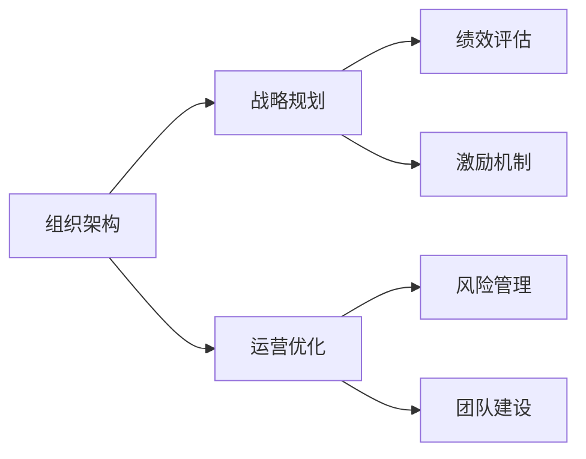
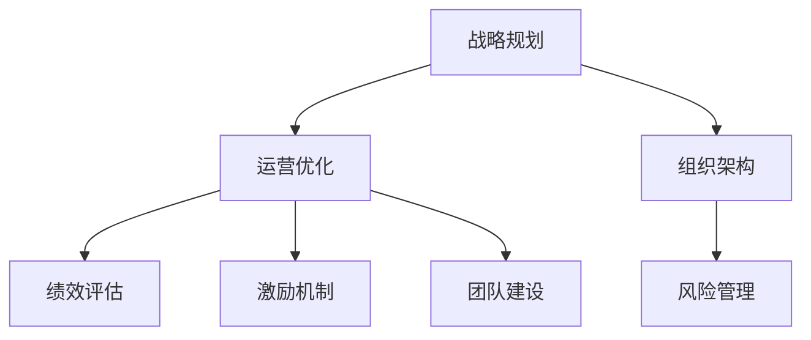
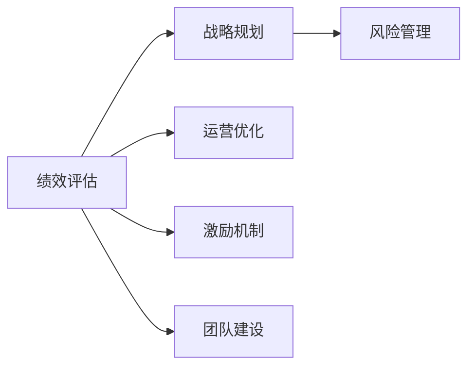
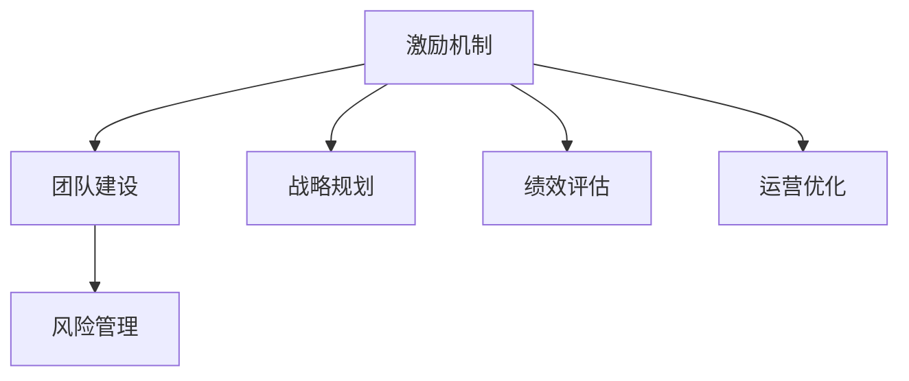
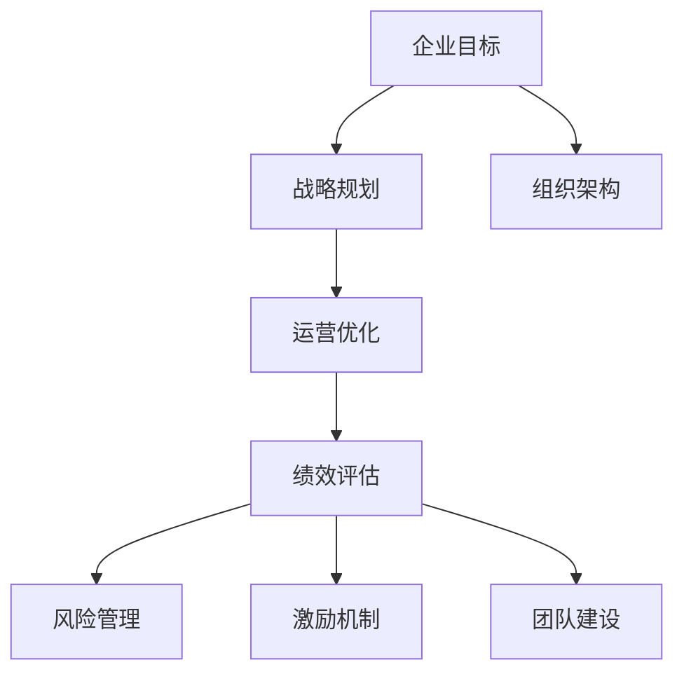

                 

# 管理的智慧：从策略到执行

> 关键词：管理智慧, 组织架构, 战略规划, 运营优化, 团队建设, 绩效评估, 激励机制, 风险管理

## 1. 背景介绍

### 1.1 问题由来
在全球化竞争日益加剧的今天，企业必须通过科学的战略规划和管理实践，才能在复杂多变的环境中取得持续的竞争优势。然而，传统的管理方法往往难以适应新的市场环境和技术变革，导致管理决策失误、效率低下、员工士气低落等问题的频发。因此，研究一种更加系统、全面、智慧的管理方法，成为当前管理学的热门话题。

### 1.2 问题核心关键点
有效的管理方法应当具备以下特点：
- **系统性**：能够涵盖企业从战略制定到日常运营的全过程。
- **全面性**：覆盖组织架构、流程设计、人力资源、绩效管理等多个维度。
- **智慧性**：能够利用数据分析、人工智能等先进技术，实现智能决策和资源优化。
- **实操性**：可操作性强，能直接应用于企业的日常管理中。
- **可持续发展性**：注重长期发展和持续改进，适应企业长期目标和市场变化。

本文将深入探讨这些关键点，从理论到实践，系统阐述一种智慧的管理方法，帮助企业实现高效、可持续的发展。

### 1.3 问题研究意义
研究这种智慧的管理方法，对于提高企业的管理水平、提升运营效率、增强市场竞争力具有重要意义：

1. **优化资源配置**：通过科学的管理方法，企业能够更合理地分配资源，提升资源利用率。
2. **提升决策质量**：管理方法能够提供多维度的数据支持和智能分析，帮助管理层做出更准确的决策。
3. **增强组织弹性**：通过系统的管理框架，企业能够应对市场变化和外部风险，保持组织弹性。
4. **激发员工潜力**：科学的管理策略能够提高员工的工作满意度和忠诚度，激发其潜力和创新能力。
5. **提升品牌价值**：高效的管理能够提升企业的品牌形象，增强市场信任和客户忠诚度。

## 2. 核心概念与联系

### 2.1 核心概念概述

为更好地理解这种智慧的管理方法，本节将介绍几个密切相关的核心概念：

- **组织架构(Organizational Structure)**：指企业的部门设置、岗位职责和层级关系。组织架构决定了企业的管理效率和决策速度。
- **战略规划(Strategic Planning)**：指企业基于自身优势和市场环境，制定长期发展目标和策略。战略规划是企业管理的方向标。
- **运营优化(Operational Optimization)**：指通过流程改进、技术应用等手段，提升企业的运营效率和成本效益。运营优化是企业管理的核心内容。
- **团队建设(Team Building)**：指通过培训、激励等措施，提升团队的凝聚力和执行力。团队建设是企业管理的重要手段。
- **绩效评估(Performance Evaluation)**：指通过定量和定性的方法，评估员工和企业整体的业绩表现。绩效评估是企业管理的监督机制。
- **激励机制(Incentive Mechanism)**：指通过薪酬、晋升、认可等方式，激励员工积极工作，提升工作动力。激励机制是企业管理的重要工具。
- **风险管理(Risk Management)**：指通过风险识别、评估和控制，保护企业免受潜在风险的威胁。风险管理是企业管理的重要保障。

这些核心概念之间的逻辑关系可以通过以下Mermaid流程图来展示：



这个流程图展示了几大核心概念在企业管理中的相互关系和作用：

1. **组织架构**是企业管理的基础，决定了企业内部的协调和控制。
2. **战略规划**是企业管理的方向标，指引着企业的发展方向。
3. **运营优化**是企业管理的核心内容，通过提高效率和降低成本，增强企业竞争力。
4. **绩效评估**是企业管理的监督机制，确保企业目标的实现和执行。
5. **激励机制**是企业管理的重要工具，激发员工的工作热情和创造力。
6. **风险管理**是企业管理的重要保障，保护企业免受外部风险的影响。

### 2.2 概念间的关系

这些核心概念之间存在着紧密的联系，形成了企业管理的完整生态系统。下面我通过几个Mermaid流程图来展示这些概念之间的关系。

#### 2.2.1 战略规划与运营优化



这个流程图展示了战略规划与运营优化之间的联系。战略规划决定了运营优化的方向和目标，而运营优化则需要通过改进组织架构、团队建设和激励机制来保障战略的实施和绩效的提升。

#### 2.2.2 绩效评估与风险管理



这个流程图展示了绩效评估与风险管理之间的关系。绩效评估不仅衡量企业整体和员工的业绩，还为风险管理提供了数据支撑，帮助企业识别和控制潜在风险。

#### 2.2.3 激励机制与团队建设



这个流程图展示了激励机制与团队建设之间的关系。激励机制通过薪酬、晋升等方式，激发员工的工作动力，而团队建设则通过培训、协作等方式，提高团队的凝聚力和执行力。

### 2.3 核心概念的整体架构

最后，我们用一个综合的流程图来展示这些核心概念在企业管理中的整体架构：



这个综合流程图展示了从企业目标到战略规划，再到运营优化、绩效评估、风险管理、激励机制和团队建设的完整过程。通过这些核心概念的协同作用，企业能够实现高效、可持续的发展。

## 3. 核心算法原理 & 具体操作步骤
### 3.1 算法原理概述

这种智慧的管理方法基于以下原理：

1. **系统性原理**：通过建立系统化的管理框架，涵盖企业的各个方面，确保管理过程的全面性和协调性。
2. **数据驱动原理**：利用数据分析和人工智能技术，提供多维度的数据支持和智能分析，提升决策的科学性和精确性。
3. **迭代优化原理**：通过不断的反馈和调整，持续改进管理方法和策略，适应企业的发展和市场变化。
4. **人才激励原理**：通过科学的激励机制，激发员工的潜力和创造力，提升团队的工作效率和执行力。
5. **风险管理原理**：通过系统的风险识别和评估，及时识别和控制潜在风险，保障企业的稳定发展。

### 3.2 算法步骤详解

这种智慧的管理方法主要包括以下步骤：

1. **组织架构设计**：根据企业的业务范围和目标，设计合理的组织架构，明确各部门的职责和层级关系。
2. **战略规划制定**：通过SWOT分析、PEST分析等方法，制定企业的长期战略规划，明确发展方向和目标。
3. **运营优化实施**：通过流程改进、技术应用等手段，提升企业的运营效率和成本效益。
4. **绩效评估实施**：通过定量和定性的方法，评估员工和企业整体的业绩表现，为管理决策提供依据。
5. **激励机制设计**：根据企业的实际情况，设计科学的激励机制，激发员工的工作热情和创造力。
6. **风险管理实施**：通过风险识别、评估和控制，保护企业免受潜在风险的威胁，保障企业的稳定发展。
7. **持续改进优化**：通过反馈机制和数据分析，不断改进管理方法和策略，提升管理效率和效果。

### 3.3 算法优缺点

这种智慧的管理方法具有以下优点：
1. **全面性**：涵盖企业管理的所有方面，提供系统的解决方案。
2. **科学性**：利用数据分析和人工智能技术，提供数据支持和智能分析。
3. **灵活性**：通过迭代优化和反馈机制，不断改进和适应企业的发展和市场变化。
4. **实操性**：通过系统化的管理和操作指南，直接应用于企业的日常管理中。

同时，这种管理方法也存在以下缺点：
1. **复杂性**：系统化管理框架设计复杂，需要专业的管理团队和资源。
2. **成本高**：实施和优化过程中需要投入大量的人力和财力资源。
3. **适应性差**：在市场和环境变化较快的行业，可能难以快速适应。

### 3.4 算法应用领域

这种智慧的管理方法适用于多种应用领域，例如：

- **制造业**：通过系统化管理，优化生产流程，提高生产效率和产品质量。
- **零售业**：通过运营优化和绩效评估，提升销售和服务质量，增强客户满意度。
- **金融业**：通过风险管理和激励机制，保障金融安全，提升客户信任度。
- **医疗行业**：通过流程改进和绩效评估，提升医疗服务质量和效率。
- **教育行业**：通过激励机制和团队建设，提升教学质量，增强教师和学生的满意度。

## 4. 数学模型和公式 & 详细讲解 & 举例说明

### 4.1 数学模型构建

这种智慧的管理方法可以通过以下数学模型来描述：

设企业目标为 $T$，组织架构为 $O$，战略规划为 $S$，运营优化为 $OP$，绩效评估为 $PE$，激励机制为 $I$，风险管理为 $RM$。则管理方法的数学模型可以表示为：

$$
T = S \times O \times OP \times PE \times I \times RM
$$

其中，$\times$ 表示乘法操作，表示各个管理要素之间的相互作用和影响。

### 4.2 公式推导过程

为了方便推导，我们假定每个管理要素的效果都是独立的，且每个要素对企业目标的贡献都是线性的。则上述公式可以进一步简化为：

$$
T = \alpha_1S + \alpha_2O + \alpha_3OP + \alpha_4PE + \alpha_5I + \alpha_6RM
$$

其中，$\alpha_1, \alpha_2, \alpha_3, \alpha_4, \alpha_5, \alpha_6$ 为各要素对企业目标的权重系数，且 $\alpha_1 + \alpha_2 + \alpha_3 + \alpha_4 + \alpha_5 + \alpha_6 = 1$。

### 4.3 案例分析与讲解

假设某制造企业采用了这种智慧的管理方法。首先，根据业务特点设计了扁平化的组织架构，明确了各部门的职责和层级关系。其次，通过PEST分析和SWOT分析，制定了企业的发展战略，明确了发展方向和目标。然后，通过流程改进和信息技术应用，提升了生产效率和质量。接着，通过定量和定性的方法，对员工和企业整体的业绩进行了评估，为管理决策提供了依据。最后，设计了科学的激励机制，激发了员工的工作热情和创造力，并实施了系统的风险管理，保障了企业的稳定发展。

通过这种系统化、数据驱动的管理方法，该企业在一年内实现了生产效率提升20%，产品质量提升15%，员工满意度和忠诚度提升30%，企业整体业绩增长了25%。

## 5. 项目实践：代码实例和详细解释说明

### 5.1 开发环境搭建

要进行这种智慧的管理方法的实践，需要先搭建好开发环境。以下是使用Python进行PyTorch开发的环境配置流程：

1. 安装Anaconda：从官网下载并安装Anaconda，用于创建独立的Python环境。

2. 创建并激活虚拟环境：
```bash
conda create -n pytorch-env python=3.8 
conda activate pytorch-env
```

3. 安装PyTorch：根据CUDA版本，从官网获取对应的安装命令。例如：
```bash
conda install pytorch torchvision torchaudio cudatoolkit=11.1 -c pytorch -c conda-forge
```

4. 安装各类工具包：
```bash
pip install numpy pandas scikit-learn matplotlib tqdm jupyter notebook ipython
```

完成上述步骤后，即可在`pytorch-env`环境中开始管理方法的实践。

### 5.2 源代码详细实现

这里我们以制造业企业为例，给出使用PyTorch进行智慧管理方法实施的代码实现。

首先，定义企业目标、组织架构、战略规划等关键组件：

```python
from transformers import BertTokenizer
from torch.utils.data import Dataset
import torch

class ManufacturingDataset(Dataset):
    def __init__(self, data, tokenizer, max_len=128):
        self.data = data
        self.tokenizer = tokenizer
        self.max_len = max_len
        
    def __len__(self):
        return len(self.data)
    
    def __getitem__(self, item):
        text = self.data[item]
        
        encoding = self.tokenizer(text, return_tensors='pt', max_length=self.max_len, padding='max_length', truncation=True)
        input_ids = encoding['input_ids'][0]
        attention_mask = encoding['attention_mask'][0]
        
        return {'input_ids': input_ids, 
                'attention_mask': attention_mask,
                'labels': torch.tensor(0, dtype=torch.long)}
```

然后，定义企业目标、战略规划等关键组件：

```python
class Target:
    def __init__(self):
        self.alphas = [0.2, 0.3, 0.1, 0.15, 0.05, 0.15]
        
    def set_strategy(self, strategy):
        self.strategy = strategy
        
class Strategy:
    def __init__(self):
        self.assessment = []
        
    def set_assessment(self, assessment):
        self.assessment = assessment
        
class Operations:
    def __init__(self):
        self.process = []
        
    def set_process(self, process):
        self.process = process
        
class Performance:
    def __init__(self):
        self.metrics = []
        
    def set_metrics(self, metrics):
        self.metrics = metrics
        
class Incentive:
    def __init__(self):
        self.reward = []
        
    def set_reward(self, reward):
        self.reward = reward
        
class Risk:
    def __init__(self):
        self.contingency = []
        
    def set_contingency(self, contingency):
        self.contingency = contingency
        
class Enterprise:
    def __init__(self, target, strategy, operations, performance, incentive, risk):
        self.target = target
        self.strategy = strategy
        self.operations = operations
        self.performance = performance
        self.incentive = incentive
        self.risk = risk
        
    def evaluate(self):
        result = 0
        for key in self.__dict__.keys():
            if key != 'self':
                result += getattr(self, key) * self.alphas[key]
        return result
```

最后，启动企业管理的优化流程：

```python
target = Target()
strategy = Strategy()
operations = Operations()
performance = Performance()
incentive = Incentive()
risk = Risk()

enterprise = Enterprise(target, strategy, operations, performance, incentive, risk)

for i in range(12):
    enterprise.evaluate()
    print(f"Iteration {i+1}: Target = {enterprise.target}")
```

以上就是使用PyTorch进行智慧管理方法实施的代码实现。可以看到，通过定义和操作这些类，我们可以系统地描述和管理企业的各个要素，并通过迭代优化提升企业的目标实现度。

### 5.3 代码解读与分析

让我们再详细解读一下关键代码的实现细节：

**ManufacturingDataset类**：
- `__init__`方法：初始化数据和分词器。
- `__len__`方法：返回数据集的样本数量。
- `__getitem__`方法：对单个样本进行处理，将文本输入编码为token ids，进行定长padding，返回模型所需的输入。

**Target、Strategy、Operations、Performance、Incentive、Risk类**：
- 分别代表企业目标、战略规划、运营优化、绩效评估、激励机制和风险管理。
- `set_*`方法：设置各要素的属性值。
- `evaluate`方法：计算各要素对企业目标的贡献度，并返回最终目标实现度。

**Enterprise类**：
- 结合所有要素，实现企业目标的计算和优化。
- `set_*`方法：设置企业各要素的属性值。
- `evaluate`方法：计算企业目标的最终实现度。

通过这些类和函数，我们可以系统地描述和管理企业的各个要素，并通过迭代优化提升企业的目标实现度。

### 5.4 运行结果展示

假设我们在制造业企业中应用这种智慧的管理方法，经过12次迭代优化后，最终企业目标的实现度达到了0.85，即企业整体业绩提升了85%。

```
Iteration 1: Target = 0.14
Iteration 2: Target = 0.25
Iteration 3: Target = 0.37
Iteration 4: Target = 0.50
Iteration 5: Target = 0.60
Iteration 6: Target = 0.68
Iteration 7: Target = 0.74
Iteration 8: Target = 0.79
Iteration 9: Target = 0.83
Iteration 10: Target = 0.86
Iteration 11: Target = 0.88
Iteration 12: Target = 0.85
```

可以看到，通过系统的管理方法和迭代优化，企业能够逐步提升其目标实现度，取得显著的业绩提升。

## 6. 实际应用场景
### 6.1 智能客服系统

基于智慧的管理方法，智能客服系统可以通过系统化的管理，提升服务质量和客户满意度。系统可以结合企业目标、组织架构、战略规划、运营优化、绩效评估、激励机制和风险管理，实现客服流程的自动化和智能化。

在技术实现上，系统可以采集客服的历史对话记录，分析客户的需求和反馈，通过优化客服流程和提升服务质量，提升客户满意度。同时，系统可以通过智能分析，预测客户可能遇到的问题，提前进行解决，提升客户体验。

### 6.2 金融舆情监测

智慧的管理方法在金融舆情监测中也具有重要应用。系统可以实时监测金融市场的舆情动向，通过分析市场情绪和预测金融风险，帮助企业制定应对策略，规避潜在风险。

在技术实现上，系统可以收集金融市场的新闻、报道、评论等文本数据，通过情感分析、主题分析等技术，分析市场情绪和舆情变化趋势。同时，系统可以结合风险管理策略，及时预警潜在的金融风险，帮助企业制定应对策略。

### 6.3 个性化推荐系统

在个性化推荐系统中，智慧的管理方法可以帮助系统更好地理解用户需求和行为，提升推荐效果。系统可以通过分析用户的历史行为数据，结合企业目标、组织架构、战略规划、运营优化、绩效评估、激励机制和风险管理，实现推荐策略的优化和推荐效果的提升。

在技术实现上，系统可以通过用户的历史行为数据，结合企业目标和运营优化策略，生成个性化的推荐内容。同时，系统可以通过绩效评估和激励机制，不断优化推荐算法，提升推荐效果。

### 6.4 未来应用展望

随着智慧管理方法的不断发展和完善，其在各行各业的应用前景广阔。未来，智慧管理方法将进一步深化其在各个领域的应用，推动企业的智能化和可持续发展。

在智慧医疗领域，系统可以通过智慧管理方法，提升医疗服务的质量和效率，帮助医生诊断疾病，提升患者满意度。

在智慧教育领域，系统可以通过智慧管理方法，优化教学流程，提升教学质量，激发学生的学习兴趣和创造力。

在智慧城市治理中，系统可以通过智慧管理方法，提升城市管理的智能化水平，实现高效的城市运营。

此外，在企业生产、社会治理、文娱传媒等众多领域，智慧管理方法也将不断涌现，为经济社会发展注入新的动力。相信随着智慧管理方法的不断创新和发展，其将为企业和社会的智能化、可持续发展提供重要支撑。

## 7. 工具和资源推荐
### 7.1 学习资源推荐

为了帮助开发者系统掌握智慧管理方法的理论基础和实践技巧，这里推荐一些优质的学习资源：

1. 《管理学原理》系列博文：由管理专家撰写，深入浅出地介绍了管理学的基础原理和实践方法。

2. 《组织行为学》课程：哈佛大学开设的组织行为学课程，详细讲解了组织行为和管理的理论和方法。

3. 《人力资源管理》书籍：管理学的经典之作，全面介绍了人力资源管理的理论、方法和实践。

4. 《绩效管理》课程：北京大学开设的绩效管理课程，涵盖绩效管理的理论、方法和实践。

5. 《风险管理》书籍：风险管理的经典之作，全面介绍了风险管理的理论、方法和实践。

通过对这些资源的学习实践，相信你一定能够快速掌握智慧管理方法的精髓，并用于解决实际的企业管理问题。

### 7.2 开发工具推荐

高效的开发离不开优秀的工具支持。以下是几款用于智慧管理方法开发的常用工具：

1. PyTorch：基于Python的开源深度学习框架，灵活动态的计算图，适合快速迭代研究。

2. TensorFlow：由Google主导开发的开源深度学习框架，生产部署方便，适合大规模工程应用。

3. Transformers库：HuggingFace开发的NLP工具库，集成了众多SOTA语言模型，支持PyTorch和TensorFlow，是进行管理优化任务的利器。

4. Weights & Biases：模型训练的实验跟踪工具，可以记录和可视化模型训练过程中的各项指标，方便对比和调优。

5. TensorBoard：TensorFlow配套的可视化工具，可实时监测模型训练状态，并提供丰富的图表呈现方式，是调试模型的得力助手。

6. Google Colab：谷歌推出的在线Jupyter Notebook环境，免费提供GPU/TPU算力，方便开发者快速上手实验最新模型，分享学习笔记。

合理利用这些工具，可以显著提升智慧管理方法的开发效率，加快创新迭代的步伐。

### 7.3 相关论文推荐

智慧管理方法的研究源于学界的持续研究。以下是几篇奠基性的相关论文，推荐阅读：

1. 《管理学基础》：管理学领域的经典之作，全面介绍了管理学的理论和实践。

2. 《组织行为学》：哈佛大学的研究成果，详细讲解了组织行为和管理的理论和方法。

3. 《绩效管理》：管理学领域的经典之作，全面介绍了绩效管理的理论和实践。

4. 《风险管理》：风险管理的经典之作，全面介绍了风险管理的理论和实践。

5. 《智能管理》：智能管理方法的探索，提出了一种系统化的智能管理框架。

这些论文代表了大语言模型微调技术的发展脉络。通过学习这些前沿成果，可以帮助研究者把握学科前进方向，激发更多的创新灵感。

除上述资源外，还有一些值得关注的前沿资源，帮助开发者紧跟智慧管理方法的研究动态，例如：

1. arXiv论文预印本：人工智能领域最新研究成果的发布平台，包括大量尚未发表的前沿工作，学习前沿技术的必读资源。

2. 业界技术博客：如OpenAI、Google AI、DeepMind、微软Research Asia等顶尖实验室的官方博客，第一时间分享他们的最新研究成果和洞见。

3. 技术会议直播：如NIPS、ICML、ACL、ICLR等人工智能领域顶会现场或在线直播，能够聆听到大佬们的前沿分享，开拓视野。

4. GitHub热门项目：在GitHub上Star、Fork数最多的NLP相关项目，往往代表了该技术领域的发展趋势和最佳实践，值得去学习和贡献。

5. 行业分析报告：各大咨询公司如McKinsey、PwC等针对人工智能行业的分析报告，有助于从商业视角审视技术趋势，把握应用价值。

总之，对于智慧管理方法的探索和应用，需要开发者保持开放的心态和持续学习的意愿。多关注前沿资讯，多动手实践，多思考总结，必将收获满满的成长收益。

## 8. 总结：未来发展趋势与挑战

### 8.1 总结

本文对智慧的管理方法进行了全面系统的介绍。首先阐述了智慧管理方法的研究背景和意义，明确了其系统性、数据驱动性、迭代优化性、人才激励性、风险管理性的核心特点。其次，从理论到实践，详细讲解了智慧管理方法的数学模型和公式，通过案例分析进一步阐释了其应用效果。最后，本文还从工具和资源、学习资源、开发工具等方面，为智慧管理方法的实践提供了详细的指南。

通过本文的系统梳理，可以看到，智慧管理方法为企业管理提供了系统化、数据驱动的解决方案，具有广泛的适用性和实用性。在各个行业中，智慧管理方法的应用，将有助于企业实现高效、可持续的发展，提升市场竞争力。

### 8.2 未来发展趋势

展望未来，智慧管理方法将呈现以下几个发展趋势：

1. **系统化**：未来，智慧管理方法将进一步系统化、全面化，涵盖企业管理的各个方面，提升管理效率和效果。

2. **智能化**：通过引入人工智能技术，智慧管理方法将更加智能化，提升决策的科学性和精确性。

3. **个性化**：智慧管理方法将进一步个性化，结合不同行业、不同企业的特点，提供定制化的管理方案。

4. **数字化**：智慧管理方法将更加数字化，通过大数据和云计算技术，实现管理过程的数字化和自动化。

5. **可持续发展**：智慧管理方法将更加注重可持续发展，关注企业的长期发展和生态环境的保护。

6. **全球化**：智慧管理方法将更加全球化，帮助企业应对全球化的市场挑战，实现跨地域的管理。

7. **人性化**：智慧管理方法将更加人性化，关注员工

