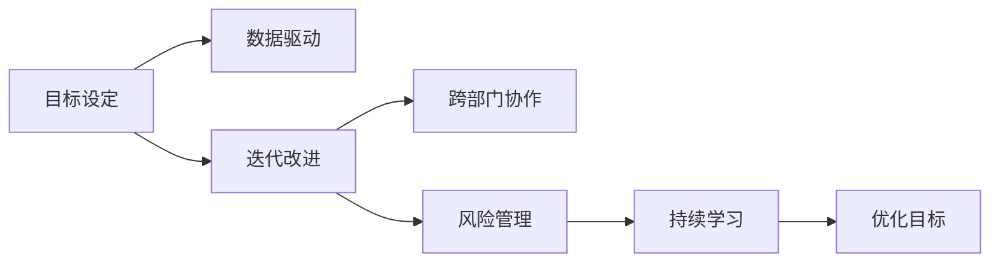
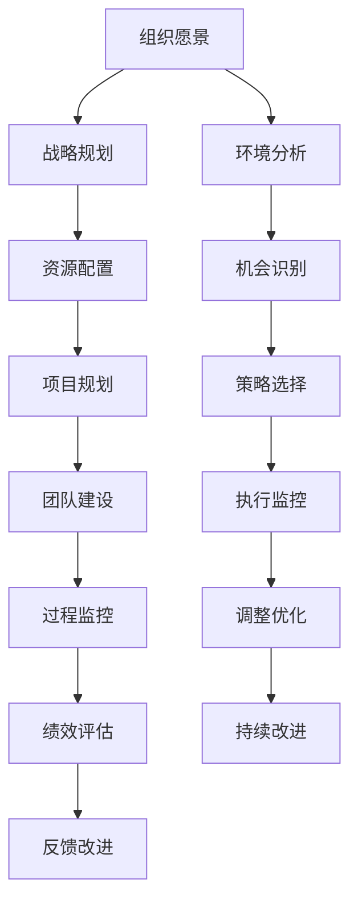

                 

## 1. 背景介绍

在快速发展的信息技术时代，管理者面临着各种复杂且多变的挑战。从提升团队效率到改善用户体验，从决策支持到客户关系管理，管理者需要不断地适应新技术、新方法。然而，技术日新月异，方法更新迭代，管理者如何才能形成自己独特且有效的方法论？本文将深入探讨这一问题，并提供一个全面、系统的方法论框架。

## 2. 核心概念与联系

### 2.1 核心概念概述

管理者方法论的核心概念包括：

- **目标设定**：明确管理活动的最终目标，包括短期和长期目标。
- **数据驱动**：利用数据分析和信息管理，做出基于事实的决策。
- **迭代改进**：采用敏捷开发和持续改进的方法，不断优化管理流程。
- **跨部门协作**：促进跨部门合作，提升组织整体效率。
- **风险管理**：识别、评估和应对潜在风险，保障业务连续性。
- **持续学习**：不断学习新知识和技能，适应技术变革。

### 2.2 核心概念之间的联系

这些核心概念之间有着紧密的联系，形成了管理者方法论的逻辑框架：

1. **目标设定与数据驱动**：明确目标后，通过数据驱动的决策支持，使得管理活动更加科学和有效。
2. **迭代改进与跨部门协作**：通过敏捷方法和跨部门协作，持续优化管理流程，提高组织整体效率。
3. **风险管理与持续学习**：通过识别和管理风险，以及不断学习新技术，确保管理方法论的持续适应性。

这些联系通过以下Mermaid流程图展示：



### 2.3 核心概念的整体架构

我们通过一个综合的流程图展示这些核心概念在管理活动中的整体架构：



这个流程图展示了从组织愿景到战略规划，再到项目执行和绩效评估的完整管理流程。各个阶段之间通过持续改进和反馈机制，不断优化和提升管理效果。

## 3. 核心算法原理 & 具体操作步骤

### 3.1 算法原理概述

管理者方法论的算法原理基于系统化的管理科学和工程实践，旨在通过科学方法论指导管理者在复杂多变的业务环境中做出最优决策。其核心思想是通过目标设定、数据驱动、迭代改进、跨部门协作、风险管理、持续学习等关键步骤，形成一个闭环的管理框架。

### 3.2 算法步骤详解

管理者方法论的实现步骤如下：

1. **目标设定**：
   - 明确组织短期和长期目标，制定SMART目标（Specific, Measurable, Achievable, Relevant, Time-bound）。
   - 确定关键绩效指标（KPIs）和评估标准。

2. **数据驱动**：
   - 收集和分析相关数据，支持决策制定。
   - 使用数据可视化工具，如Tableau、Power BI等，进行数据展示和分析。

3. **迭代改进**：
   - 采用敏捷开发方法，如Scrum或Kanban，进行持续迭代。
   - 定期进行回顾和反思，不断优化管理流程。

4. **跨部门协作**：
   - 建立跨部门沟通机制，如周报、月会等。
   - 促进团队协作，共享资源和信息，协同解决问题。

5. **风险管理**：
   - 识别潜在风险和问题。
   - 制定应对措施和应急预案，进行风险评估和监控。

6. **持续学习**：
   - 定期参加培训和学习活动，提升个人和团队技能。
   - 跟踪技术发展，引入新技术和方法。

### 3.3 算法优缺点

管理者方法论的优点包括：

- 科学决策：通过目标设定和数据驱动，提高了决策的科学性和合理性。
- 持续优化：通过迭代改进和持续学习，保证管理方法论的适应性和有效性。
- 高效协作：通过跨部门协作，提高了组织整体效率。

其缺点包括：

- 实施复杂：需要跨部门协调和资源投入，实施难度较大。
- 成本高昂：初期投入较大，尤其是数据分析和培训成本。
- 技术依赖：对数据和技术工具的依赖较大，需要持续维护和更新。

### 3.4 算法应用领域

管理者方法论在多个领域都有广泛应用，包括但不限于：

- **企业战略规划**：通过目标设定和数据驱动，制定科学的战略规划。
- **项目管理**：采用敏捷开发方法，确保项目按时、按质、按预算完成。
- **产品开发**：通过跨部门协作和持续学习，提升产品质量和市场竞争力。
- **客户关系管理**：通过风险管理和数据驱动，提高客户满意度和忠诚度。
- **人力资源管理**：通过目标设定和绩效评估，优化人才管理和团队建设。

## 4. 数学模型和公式 & 详细讲解

### 4.1 数学模型构建

管理者方法论的数学模型构建主要围绕目标设定、数据驱动、迭代改进、风险管理、持续学习等核心概念展开。

- **目标设定模型**：
  $$
  \text{SMART目标} = (S, M, A, R, T)
  $$
  其中 $S$ 表示具体（Specific）、$M$ 表示可测量（Measurable）、$A$ 表示可实现（Achievable）、$R$ 表示相关（Relevant）、$T$ 表示时间限制（Time-bound）。

- **数据驱动模型**：
  $$
  \text{决策} = f(\text{数据}, \text{算法}, \text{模型})
  $$
  表示决策是基于数据、算法和模型的综合结果。

- **迭代改进模型**：
  $$
  \text{管理流程} = \text{敏捷方法} \times \text{跨部门协作} + \text{反馈改进}
  $$
  表示管理流程通过敏捷方法、跨部门协作和反馈改进进行迭代优化。

- **风险管理模型**：
  $$
  \text{风险} = \text{识别} + \text{评估} + \text{应对措施}
  $$
  表示风险管理通过识别、评估和应对措施，确保业务连续性。

- **持续学习模型**：
  $$
  \text{持续学习} = \text{培训} + \text{技术跟踪} + \text{经验积累}
  $$
  表示持续学习通过培训、技术跟踪和经验积累，保证管理方法论的持续适应性。

### 4.2 公式推导过程

以下推导管理者方法论中的关键公式：

1. **目标设定**：
  - 目标设定模型基于SMART原则，通过目标分解和量化，确保目标的可操作性。

2. **数据驱动**：
  - 数据驱动模型利用数据挖掘和机器学习算法，从海量数据中提取有用信息，支持决策制定。

3. **迭代改进**：
  - 迭代改进模型采用Scrum或Kanban方法，通过迭代开发和持续反馈，优化管理流程。

4. **风险管理**：
  - 风险管理模型通过VaR（Value at Risk）、CVA（Credit Value at Risk）等模型，评估和控制潜在风险。

5. **持续学习**：
  - 持续学习模型通过知识图谱和推荐系统，推荐和学习新知识和技能，促进个人和团队成长。

### 4.3 案例分析与讲解

以企业战略规划为例，展示管理者方法论的实际应用：

- **目标设定**：
  - 目标：提升公司市场份额至30%。
  - KPI：市场份额、客户满意度、员工满意度。

- **数据驱动**：
  - 收集市场数据、客户反馈和员工满意度调查，使用数据可视化工具展示趋势和变化。
  - 使用回归分析、聚类分析等方法，识别市场机会和客户需求。

- **迭代改进**：
  - 采用Scrum方法，将战略规划分解为多个迭代周期。
  - 定期进行回顾和反思，调整战略方向和资源配置。

- **风险管理**：
  - 识别市场竞争、供应链风险等潜在问题。
  - 制定应对措施，如多元化投资、供应链优化等。

- **持续学习**：
  - 定期参加行业峰会和培训，学习新战略和最佳实践。
  - 引入新兴技术，如人工智能和大数据分析，提升战略规划的科学性和前瞻性。

## 5. 项目实践：代码实例和详细解释说明

### 5.1 开发环境搭建

管理者方法论的实践需要强大的工具和平台支持。以下是推荐的开发环境搭建步骤：

1. **安装Python**：
   - 从官网下载Python安装程序，根据操作系统安装。

2. **安装Pandas**：
   - 在命令行输入 `pip install pandas`，安装Pandas库，用于数据处理和分析。

3. **安装Matplotlib**：
   - 在命令行输入 `pip install matplotlib`，安装Matplotlib库，用于数据可视化。

4. **安装Scikit-learn**：
   - 在命令行输入 `pip install scikit-learn`，安装Scikit-learn库，用于机器学习。

5. **安装Jupyter Notebook**：
   - 在命令行输入 `pip install jupyter notebook`，安装Jupyter Notebook，用于编写和运行Python代码。

### 5.2 源代码详细实现

以下是一个简单的Python代码示例，展示如何使用Pandas和Matplotlib进行数据处理和可视化：

```python
import pandas as pd
import matplotlib.pyplot as plt

# 读取数据
data = pd.read_csv('data.csv')

# 数据处理
data_mean = data['value'].mean()
data_median = data['value'].median()

# 数据可视化
plt.hist(data['value'], bins=30)
plt.xlabel('Value')
plt.ylabel('Frequency')
plt.title('Value Distribution')
plt.show()

# 输出统计结果
print(f'Mean: {data_mean}')
print(f'Median: {data_median}')
```

### 5.3 代码解读与分析

代码中，我们首先使用Pandas读取数据文件，然后对数据进行统计分析，使用Matplotlib绘制直方图，最后输出统计结果。

- **Pandas**：Pandas库提供了强大的数据处理和分析能力，能够读取、清洗、转换和分析各种数据格式，是管理者数据驱动决策的重要工具。
- **Matplotlib**：Matplotlib库提供了丰富的可视化功能，能够绘制各种类型的图表，帮助管理者直观理解数据和趋势。

### 5.4 运行结果展示

运行上述代码，将输出数据统计结果和可视化图表。


## 6. 实际应用场景

### 6.1 智能制造管理

管理者方法论在智能制造管理中得到了广泛应用，通过数据驱动和持续改进，提升了生产效率和产品质量。例如，某智能制造企业通过数据监控和分析，及时发现生产线上的异常，调整设备和工艺，实现了生产效率的显著提升。

### 6.2 医疗健康管理

在医疗健康管理中，管理者方法论通过目标设定和风险管理，提高了医疗服务质量和患者满意度。例如，某医院通过数据分析和风险评估，优化了诊疗流程，减少了医疗事故和患者等待时间。

### 6.3 教育培训管理

在教育培训管理中，管理者方法论通过持续学习和跨部门协作，提升了教学质量和学生成绩。例如，某教育培训机构通过敏捷开发和跨部门合作，开发了智能化教学系统，提高了学生的学习效果和满意度。

### 6.4 未来应用展望

未来，管理者方法论将继续在各个领域发挥重要作用，以下是几个未来的应用展望：

1. **智慧城市管理**：通过大数据和AI技术，实现城市管理智能化，提升城市治理水平。
2. **企业数字化转型**：通过数字化转型，提升企业运营效率和市场竞争力。
3. **个性化推荐系统**：通过数据驱动和机器学习，实现个性化推荐，提升用户体验。
4. **金融风险管理**：通过数据驱动和风险管理，提升金融产品和服务的风险控制能力。

## 7. 工具和资源推荐

### 7.1 学习资源推荐

为了帮助管理者系统掌握方法论的原理和实践，推荐以下学习资源：

1. **《管理学原理》**：经典管理学教材，系统介绍了管理学的基本理论和实践方法。
2. **《敏捷项目管理》**：介绍敏捷开发方法论，帮助管理者提升项目管理能力。
3. **《风险管理》**：系统讲解风险管理的理论和实践，提升风险控制能力。
4. **《持续学习》**：介绍持续学习的重要性和方法，帮助管理者保持竞争力。
5. **Coursera和edX**：提供大量相关课程和培训，帮助管理者系统学习相关知识。

### 7.2 开发工具推荐

以下是一些推荐的管理者方法论开发工具：

1. **Jupyter Notebook**：强大的Python代码编写和运行平台，支持数据处理和可视化。
2. **Tableau**：数据可视化工具，支持多种数据格式和图表类型。
3. **Git**：版本控制工具，支持团队协作和代码管理。
4. **Gantt Chart**：项目管理工具，支持进度跟踪和资源分配。
5. **Slack**：团队协作工具，支持跨部门沟通和信息共享。

### 7.3 相关论文推荐

管理者方法论的研究涉及多个学科和领域，以下是几篇具有代表性的论文：

1. **《敏捷方法论》**：介绍敏捷开发方法论，提升项目管理效率。
2. **《风险管理框架》**：提供系统化的风险管理方法，提升风险控制能力。
3. **《持续学习理论》**：研究持续学习的重要性和方法，提升个人和组织的学习能力。
4. **《数据驱动管理》**：探讨数据驱动在管理中的应用，提升决策科学性。

## 8. 总结：未来发展趋势与挑战

### 8.1 研究成果总结

管理者方法论通过目标设定、数据驱动、迭代改进、跨部门协作、风险管理、持续学习等关键步骤，形成了一套科学、系统的方法论体系。该方法论在各个领域得到了广泛应用，显著提升了管理效率和业务效果。

### 8.2 未来发展趋势

未来，管理者方法论将继续发展，呈现以下几个趋势：

1. **数字化和智能化**：通过大数据和AI技术，实现管理过程的数字化和智能化。
2. **跨领域融合**：与其他学科和方法论进行融合，提升管理方法的适应性和有效性。
3. **全球化**：适应全球化的管理需求，提升国际化管理能力。
4. **可持续发展**：关注环境和社会责任，推动可持续发展管理。

### 8.3 面临的挑战

尽管管理者方法论在多个领域取得了显著成效，但仍面临以下挑战：

1. **数据质量**：数据的不完整、不准确、不一致，影响决策的科学性和合理性。
2. **技术依赖**：对技术和工具的依赖较大，需要持续投入资源进行维护和更新。
3. **人才短缺**：缺乏具备数据分析、项目管理等技能的人才，制约方法论的实施效果。
4. **组织文化**：传统组织文化可能对新的管理方法论存在抵触和阻碍。

### 8.4 研究展望

管理者方法论的未来研究应关注以下几个方面：

1. **数据治理**：提升数据质量，建立数据治理框架，确保数据的安全和可靠。
2. **技术创新**：推动技术创新，提升数字化和智能化水平，实现管理方法论的全面升级。
3. **人才培养**：加强数据分析、项目管理等技能培训，提升管理者的综合素质。
4. **组织变革**：推动组织变革，提升组织文化的适应性和灵活性，支持新管理方法论的实施。

## 9. 附录：常见问题与解答

### Q1：管理者方法论的实施难度大吗？

A: 管理者方法论的实施确实需要跨部门协调和资源投入，但通过系统化的管理框架和工具，可以显著降低实施难度，提升管理效果。

### Q2：如何保证数据的质量和安全性？

A: 通过建立数据治理框架，制定数据质量标准和数据安全策略，定期进行数据审计和风险评估，可以确保数据的质量和安全性。

### Q3：如何平衡创新与传统组织文化的冲突？

A: 通过高层支持、文化引导和持续沟通，逐步推动组织文化的变革，平衡创新与传统文化的冲突，确保新管理方法论的顺利实施。

### Q4：如何提升管理者的技能和素质？

A: 通过系统化的培训和学习，提升管理者的数据分析、项目管理、风险管理等技能，增强其综合素质，适应新技术和新方法。

作者：禅与计算机程序设计艺术 / Zen and the Art of Computer Programming

