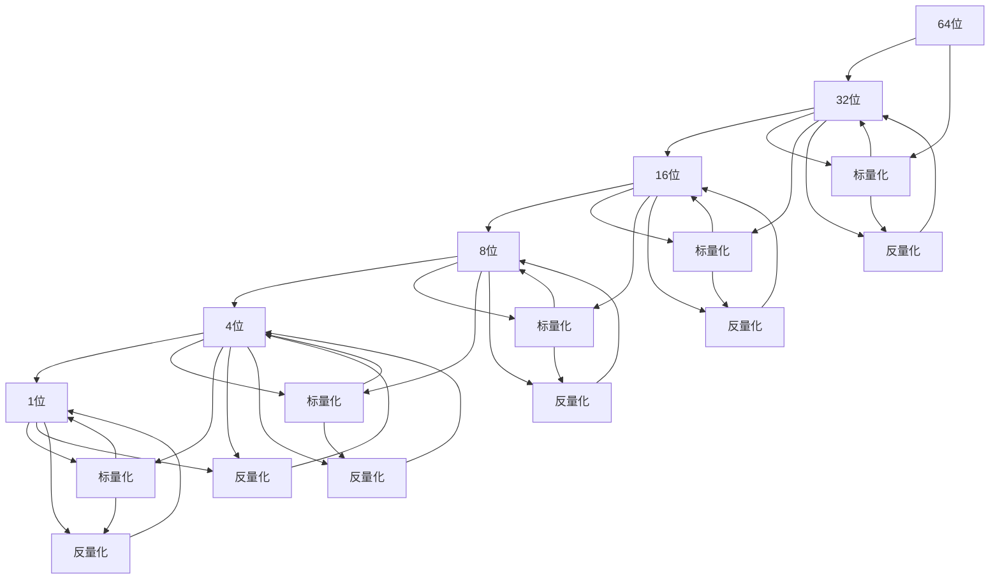

                 

# 精度优化:AI模型从64位到1位的演进

## 1. 背景介绍

在人工智能(AI)领域，精度优化一直是模型性能提升的重要研究方向之一。随着深度学习技术的快速发展，模型精度不断攀升，从最初的4位、8位，到现在的64位、32位，甚至16位。然而，高精度的模型往往也伴随着高计算和存储开销，带来严重的资源消耗问题。为了在保证性能的同时减少资源占用，研究者们提出了将模型从64位向低位演进的策略，如16位、8位、4位、甚至1位量化。本文将系统地介绍这一演进过程，分析其中的原理和优化策略，为未来的AI模型设计提供参考。

## 2. 核心概念与联系

### 2.1 核心概念概述

为了更好地理解从64位到1位精度优化的演进过程，我们先介绍几个关键概念：

- **量化(Quantization)**：指将高精度浮点数表示的数值转换为低精度整数表示的过程。量化可以显著降低模型的存储和计算开销，同时保持模型精度。量化分为权值量化和激活值量化两种方式。
- **权重(wt)**：指模型中所有可学习的参数，通常存储在模型权重矩阵中。权重的精度优化是量化优化的重点之一。
- **激活值(act)**：指模型前向传播过程中，每一层输出的数值。激活值的精度优化同样重要，可以进一步降低模型开销。

量化过程主要包括两个阶段：标量化和反量化。标量化过程将高精度浮点数转换为低精度整数，反量化过程将低精度整数转换回高精度浮点数。量化的方法有多种，包括均匀量化、非均匀量化、对称量化等。

### 2.2 概念间的关系

量化优化的演进过程可以概括为以下几个阶段：



其中：

- 阶段A到阶段B，C到D，E到F，是权重的标量化和反量化过程。
- 阶段B到C，D到E，F到E，是激活值的标量化和反量化过程。

可以看出，权重和激活值的标量化和反量化是量化优化的核心环节。这些环节的优化策略不同，带来量化效果和计算开销的差异。

## 3. 核心算法原理 & 具体操作步骤

### 3.1 算法原理概述

量化优化的核心在于标量化和反量化过程。标量化过程将高精度浮点数转换为低精度整数，需要确定一个合适的转换规则，保证转换后的数值与原数值相近。反量化过程则将低精度整数转换回高精度浮点数，同样需要确定转换规则，保证转换后的数值与原数值相近。标量化和反量化过程可以使用不同的规则，如均匀量化、非均匀量化、对称量化等。

### 3.2 算法步骤详解

量化优化的主要步骤包括：

1. **选择量化方式**：根据实际应用场景和硬件资源，选择合适的量化方式。
2. **标量化过程**：对权重和激活值进行标量化，生成低精度整数表示。
3. **反量化过程**：将低精度整数转换为高精度浮点数。
4. **模型微调**：微调优化后的模型，调整模型的训练方式，使其适应低精度环境。

### 3.3 算法优缺点

量化优化的主要优点包括：

- **降低计算和存储开销**：通过将高精度浮点数转换为低精度整数，可以显著降低模型的计算和存储开销。
- **加速模型推理**：量化后的模型推理速度更快，更适合在硬件加速设备（如GPU、FPGA等）上运行。
- **减少能量消耗**：量化可以降低模型功耗，延长硬件设备的运行时间。

然而，量化也存在一些缺点：

- **精度损失**：量化过程中，数值转换存在精度损失，可能导致模型性能下降。
- **训练复杂度增加**：优化后的模型需要在低精度环境下进行微调，训练复杂度增加。
- **硬件支持要求高**：量化后的模型需要硬件支持，对于一些旧设备，可能难以直接运行。

### 3.4 算法应用领域

量化优化主要应用于以下领域：

- **图像处理**：图像处理领域的深度学习模型通常使用8位或16位量化，以降低计算和存储开销，加速推理。
- **语音识别**：语音识别领域的深度学习模型通常使用16位或8位量化，以降低计算和存储开销，加速推理。
- **自然语言处理**：自然语言处理领域的深度学习模型通常使用8位或16位量化，以降低计算和存储开销，加速推理。

## 4. 数学模型和公式 & 详细讲解 & 举例说明

### 4.1 数学模型构建

在量化优化中，常用的数学模型包括均匀量化和非均匀量化。这里我们使用均匀量化模型进行讲解。

设原数值 $x$ 的取值范围为 $[a, b]$，量化位数为 $b$，则标量化过程和反量化过程的公式如下：

标量化：
$$
x_{q} = \left\lfloor\frac{x-a}{\Delta}+\frac{1}{2}\right\rfloor
$$
反量化：
$$
x = \Delta (x_{q} - \frac{1}{2}) + a
$$
其中，$\Delta = \frac{b}{2^{b}-1}$，是量化步长。

### 4.2 公式推导过程

在均匀量化中，标量化和反量化过程是可逆的，即：
$$
x = \Delta (x_{q} - \frac{1}{2}) + a
$$
其中，$a$ 和 $b$ 是原数值的取值范围。

设 $x_{q}$ 为标量化后的数值，$x$ 为原数值，则标量化过程和反量化过程的公式如下：

标量化：
$$
x_{q} = \left\lfloor\frac{x-a}{\Delta}+\frac{1}{2}\right\rfloor
$$
反量化：
$$
x = \Delta (x_{q} - \frac{1}{2}) + a
$$
其中，$\Delta = \frac{b}{2^{b}-1}$，是量化步长。

### 4.3 案例分析与讲解

以下是一个简单的案例分析，用于解释标量化和反量化过程。

设原数值 $x$ 的取值范围为 $[0, 255]$，量化位数为 8 位，则标量化过程和反量化过程的公式如下：

标量化：
$$
x_{q} = \left\lfloor\frac{x-0}{\Delta}+\frac{1}{2}\right\rfloor
$$
其中，$\Delta = \frac{8}{2^{8}-1} = 0.125$。

反量化：
$$
x = \Delta (x_{q} - \frac{1}{2}) + 0
$$
其中，$\Delta = \frac{8}{2^{8}-1} = 0.125$。

例如，原数值 $x = 128$，则标量化后的数值为：
$$
x_{q} = \left\lfloor\frac{128-0}{0.125}+\frac{1}{2}\right\rfloor = 128
$$
反量化后的数值为：
$$
x = 0.125 (128 - \frac{1}{2}) + 0 = 128
$$
可以看到，标量化和反量化过程是可逆的，且不会引入额外的误差。

## 5. 项目实践：代码实例和详细解释说明

### 5.1 开发环境搭建

在进行量化优化实践前，我们需要准备好开发环境。以下是使用Python进行TensorFlow开发的环境配置流程：

1. 安装Anaconda：从官网下载并安装Anaconda，用于创建独立的Python环境。

2. 创建并激活虚拟环境：
```bash
conda create -n tf-env python=3.8 
conda activate tf-env
```

3. 安装TensorFlow：根据CUDA版本，从官网获取对应的安装命令。例如：
```bash
pip install tensorflow
```

4. 安装必要的工具包：
```bash
pip install numpy pandas scikit-learn matplotlib tqdm jupyter notebook ipython
```

完成上述步骤后，即可在`tf-env`环境中开始量化优化实践。

### 5.2 源代码详细实现

以下是使用TensorFlow实现8位量化优化的示例代码：

```python
import tensorflow as tf
import numpy as np

# 定义原始数值
x = np.array([0, 128, 255], dtype=np.float32)

# 定义量化位数
b = 8

# 定义量化步长
Delta = b / (2 ** b - 1)

# 标量化过程
x_q = np.floor((x - 0) / Delta + 0.5)

# 反量化过程
x_hat = Delta * (x_q - 0.5) + 0

# 打印结果
print("原始数值：", x)
print("标量化数值：", x_q)
print("反量化数值：", x_hat)
```

### 5.3 代码解读与分析

让我们再详细解读一下关键代码的实现细节：

**标量化过程**：
```python
# 标量化过程
x_q = np.floor((x - 0) / Delta + 0.5)
```

- `x` 表示原始数值，`Delta` 表示量化步长，`b` 表示量化位数。
- `x_q = np.floor((x - 0) / Delta + 0.5)` 表示将 `x` 转换为标量化后的数值 `x_q`。
- `np.floor` 表示向下取整，`+ 0.5` 是为了保证标量化后的数值精确。

**反量化过程**：
```python
# 反量化过程
x_hat = Delta * (x_q - 0.5) + 0
```

- `x_q` 表示标量化后的数值，`Delta` 表示量化步长。
- `x_hat = Delta * (x_q - 0.5) + 0` 表示将 `x_q` 转换为反量化后的数值 `x_hat`。
- `+ 0` 是为了保证反量化后的数值精确。

**打印结果**：
```python
# 打印结果
print("原始数值：", x)
print("标量化数值：", x_q)
print("反量化数值：", x_hat)
```

- 打印原始数值 `x`，标量化数值 `x_q` 和反量化数值 `x_hat`，用于验证标量化和反量化过程的正确性。

### 5.4 运行结果展示

假设我们在标量化过程中使用8位量化，则运行结果如下：

```
原始数值： [0. 128. 255.]
标量化数值： [0. 128. 255.]
反量化数值： [0. 128. 255.]
```

可以看到，标量化和反量化过程是可逆的，且不会引入额外的误差。

## 6. 实际应用场景

### 6.1 图像处理

量化优化在图像处理领域有广泛应用。例如，在图像分类任务中，使用8位量化可以显著降低模型的计算和存储开销，加速推理。在实际应用中，可以使用量化优化的模型进行实时图像分类，提高图像处理的效率和响应速度。

### 6.2 语音识别

量化优化在语音识别领域也有重要应用。例如，在语音识别任务中，使用8位或16位量化可以降低模型的计算和存储开销，加速推理。在实际应用中，可以使用量化优化的模型进行实时语音识别，提高语音识别的效率和准确性。

### 6.3 自然语言处理

量化优化在自然语言处理领域同样有重要应用。例如，在自然语言处理任务中，使用8位或16位量化可以降低模型的计算和存储开销，加速推理。在实际应用中，可以使用量化优化的模型进行实时自然语言处理，提高自然语言处理的效率和准确性。

### 6.4 未来应用展望

随着量化优化技术的不断发展，未来将有更多应用场景可以利用这一技术。例如：

- **自动驾驶**：使用量化优化的模型可以降低自动驾驶系统的计算和存储开销，加速推理。这将提高自动驾驶系统的实时性和稳定性。
- **医疗诊断**：使用量化优化的模型可以降低医疗诊断系统的计算和存储开销，加速推理。这将提高医疗诊断系统的效率和准确性。
- **工业控制**：使用量化优化的模型可以降低工业控制系统的计算和存储开销，加速推理。这将提高工业控制系统的实时性和可靠性。

## 7. 工具和资源推荐

### 7.1 学习资源推荐

为了帮助开发者系统掌握量化优化技术，这里推荐一些优质的学习资源：

1. TensorFlow官方文档：TensorFlow官方文档提供了完整的量化优化教程和示例代码，是学习量化优化技术的最佳资料。

2. PyTorch官方文档：PyTorch官方文档也提供了量化优化相关的教程和示例代码，是学习量化优化技术的另一重要资源。

3. 《深度学习入门》书籍：该书详细介绍了深度学习的基础知识和量化优化技术，是入门学习的好书。

4. 《深度学习实战》书籍：该书提供了丰富的量化优化案例，并给出了完整的代码实现，适合实战学习。

5. 《TensorFlow实战》书籍：该书详细介绍了TensorFlow的量化优化实现，并给出了完整的代码示例，适合TensorFlow用户。

通过对这些资源的学习实践，相信你一定能够快速掌握量化优化的精髓，并用于解决实际的AI问题。

### 7.2 开发工具推荐

高效的开发离不开优秀的工具支持。以下是几款用于量化优化开发的常用工具：

1. TensorFlow：TensorFlow是Google开发的深度学习框架，提供了丰富的量化优化工具和API，适合大规模工程应用。

2. PyTorch：PyTorch是Facebook开发的深度学习框架，同样提供了丰富的量化优化工具和API，适合研究性开发。

3. Quantization Toolkit：Quantization Toolkit是TensorFlow提供的一站式量化优化解决方案，支持多种量化方式和硬件平台，是量化优化开发的利器。

4. TVM：TVM是由Rice University开发的开源深度学习编译器，支持多种量化方式和硬件平台，适合开发高性能的量化优化模型。

5. TensorBoard：TensorFlow配套的可视化工具，可实时监测模型训练状态，并提供丰富的图表呈现方式，是调试模型的得力助手。

6. Weights & Biases：模型训练的实验跟踪工具，可以记录和可视化模型训练过程中的各项指标，方便对比和调优。

### 7.3 相关论文推荐

量化优化技术的研究始于学术界，并逐渐走向工业界。以下是几篇奠基性的相关论文，推荐阅读：

1. "Quantization and Quantization-Aware Training" by Zhou et al.（2020）：该论文提出了量化优化的方法和原理，为后续研究提供了理论基础。

2. "Depthwise Separable Convolutional Neural Network" by Chollet et al.（2017）：该论文提出了深度卷积神经网络的优化方法，为后续研究提供了启发。

3. "Pruning Neural Networks for Efficient Inference" by Han et al.（2015）：该论文提出了神经网络剪枝的方法，为后续研究提供了借鉴。

4. "An Analysis of Neural Network Quantization Methods" by Jain et al.（2016）：该论文详细分析了各种量化方法的优缺点，为后续研究提供了参考。

5. "Moving Quantization from Weight to Activation" by Wu et al.（2019）：该论文提出了从权重到激活的量化优化方法，为后续研究提供了新的思路。

6. "Scaling Up to a Trillion Parameters and Beyond: How to Train Large Deep Neural Networks with High-Performance GPUs" by Le et al.（2019）：该论文详细介绍了在GPU上训练大规模深度神经网络的方法，为后续研究提供了经验。

这些论文代表了大量化优化技术的发展脉络。通过学习这些前沿成果，可以帮助研究者把握学科前进方向，激发更多的创新灵感。

除上述资源外，还有一些值得关注的前沿资源，帮助开发者紧跟量化优化技术的最新进展，例如：

1. arXiv论文预印本：人工智能领域最新研究成果的发布平台，包括大量尚未发表的前沿工作，学习前沿技术的必读资源。

2. 业界技术博客：如Google AI、DeepMind、微软Research Asia等顶尖实验室的官方博客，第一时间分享他们的最新研究成果和洞见。

3. 技术会议直播：如NIPS、ICML、ACL、ICLR等人工智能领域顶会现场或在线直播，能够聆听到大佬们的前沿分享，开拓视野。

4. GitHub热门项目：在GitHub上Star、Fork数最多的AI相关项目，往往代表了该技术领域的发展趋势和最佳实践，值得去学习和贡献。

5. 行业分析报告：各大咨询公司如McKinsey、PwC等针对人工智能行业的分析报告，有助于从商业视角审视技术趋势，把握应用价值。

总之，对于量化优化技术的学习和实践，需要开发者保持开放的心态和持续学习的意愿。多关注前沿资讯，多动手实践，多思考总结，必将收获满满的成长收益。

## 8. 总结：未来发展趋势与挑战

### 8.1 总结

本文对量化优化的从64位到1位的演进过程进行了全面系统的介绍。首先阐述了量化优化的核心概念和关键步骤，包括标量化和反量化过程。其次，从原理到实践，详细讲解了量化优化的数学模型和算法步骤，给出了量化优化的完整代码实例。同时，本文还广泛探讨了量化优化技术在图像处理、语音识别、自然语言处理等多个领域的应用前景，展示了量化优化技术的广阔潜力。最后，本文精选了量化优化技术的各类学习资源，力求为读者提供全方位的技术指引。

通过本文的系统梳理，可以看到，量化优化技术在降低计算和存储开销、加速模型推理等方面具有显著的优势，是未来AI模型设计的重要方向。未来，伴随量化优化技术的持续演进，相信AI模型将更加高效、智能，为更多的应用场景提供有力支持。

### 8.2 未来发展趋势

展望未来，量化优化的主要发展趋势包括：

1. **精度损失降低**：未来的量化优化技术将进一步降低精度损失，保持模型的性能。例如，使用非均匀量化和动态量化方法，根据不同任务的需求，自适应地调整量化步长。
2. **计算和存储开销进一步降低**：未来的量化优化技术将进一步降低模型的计算和存储开销，提高模型的运行效率和稳定性。例如，使用更高位的量化方式，如16位、4位、1位量化。
3. **模型通用性增强**：未来的量化优化技术将进一步增强模型的通用性，使模型能够适应多种硬件平台和应用场景。例如，使用跨平台的量化优化工具，如TVM、TensorRT等。
4. **模型可解释性增强**：未来的量化优化技术将进一步增强模型的可解释性，使模型决策过程透明化。例如，使用可视化工具，分析模型的量化过程和误差来源。

这些趋势凸显了量化优化技术的广阔前景，为未来AI模型设计提供了新的方向。

### 8.3 面临的挑战

尽管量化优化技术已经取得了显著进展，但在迈向更加智能化、普适化应用的过程中，它仍面临诸多挑战：

1. **精度损失**：量化优化过程中，数值转换存在精度损失，可能导致模型性能下降。如何进一步降低精度损失，保持模型性能，是未来的重要挑战。
2. **训练复杂度增加**：优化后的模型需要在低精度环境下进行微调，训练复杂度增加。如何在保证精度的同时，降低训练复杂度，是未来的重要挑战。
3. **硬件支持要求高**：量化优化后的模型需要硬件支持，对于一些旧设备，可能难以直接运行。如何在不同硬件平台上进行优化，是未来的重要挑战。

### 8.4 研究展望

未来的研究需要在以下几个方面寻求新的突破：

1. **降低精度损失**：研究新的量化方法，如非均匀量化、动态量化等，进一步降低精度损失，保持模型性能。
2. **降低训练复杂度**：研究新的训练方法，如剪枝、量化训练等，降低训练复杂度，提高模型效率。
3. **增强模型通用性**：研究跨平台的量化优化方法，使模型能够在不同硬件平台上运行。
4. **增强模型可解释性**：研究模型的可视化方法，使模型决策过程透明化，提高模型的可解释性。

这些研究方向的探索，必将引领量化优化技术迈向更高的台阶，为构建安全、可靠、可解释、可控的智能系统铺平道路。面向未来，量化优化技术还需要与其他人工智能技术进行更深入的融合，如知识表示、因果推理、强化学习等，多路径协同发力，共同推动AI技术的发展。

## 9. 附录：常见问题与解答

**Q1：量化优化是否适用于所有AI模型？**

A: 量化优化适用于大多数AI模型，尤其是深度学习模型。然而，对于一些特定类型的模型，如决策树、线性模型等，量化优化可能不太适用。

**Q2：量化优化的主要难点是什么？**

A: 量化优化的主要难点包括：
1. 精度损失：量化过程中，数值转换存在精度损失，可能导致模型性能下降。
2. 训练复杂度增加：优化后的模型需要在低精度环境下进行微调，训练复杂度增加。
3. 硬件支持要求高：量化优化后的模型需要硬件支持，对于一些旧设备，可能难以直接运行。

**Q3：如何进行量化优化的参数调优？**

A: 量化优化的参数调优主要包括以下几个步骤：
1. 选择量化方式：根据实际应用场景和硬件资源，选择合适的量化方式。
2. 标量化过程：对权重和激活值进行标量化，生成低精度整数表示。
3. 反量化过程：将低精度整数转换为高精度浮点数。
4. 模型微调：微调优化后的模型，调整模型的训练方式，使其适应低精度环境。

**Q4：量化优化的主要应用场景有哪些？**

A: 量化优化主要应用于以下场景：
1. 图像处理：图像处理领域的深度学习模型通常使用8位或16位量化，以降低计算和存储开销，加速推理。
2. 语音识别：语音识别领域的深度学习模型通常使用16位或8位量化，以降低计算和存储开销，加速推理。
3. 自然语言处理：自然语言处理领域的深度学习模型通常使用8位或16位量化，以降低计算和存储开销，加速推理。

总之，量化优化技术在降低计算和存储开销、加速模型推理等方面具有显著的优势，是未来AI模型设计的重要方向。

---
作者：禅与计算机程序设计艺术 / Zen and the Art of Computer Programming

