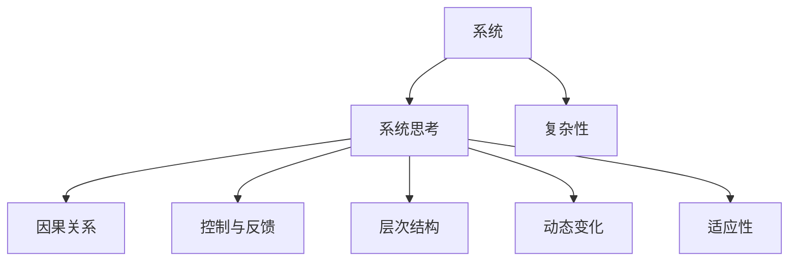
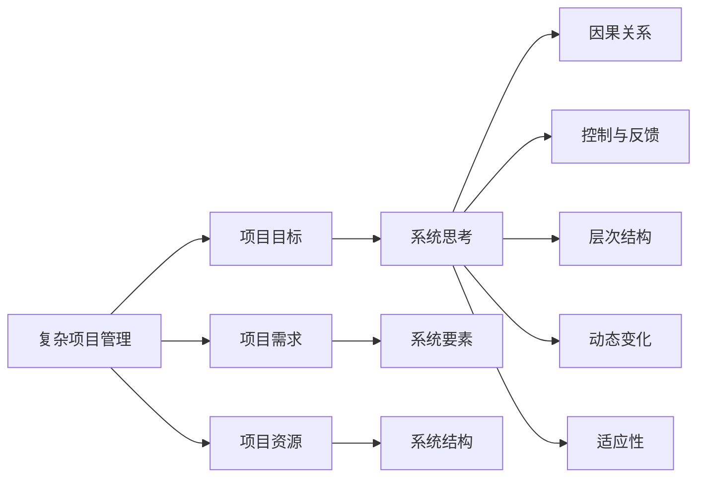
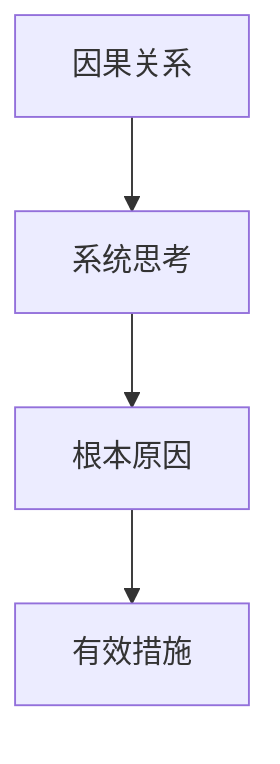
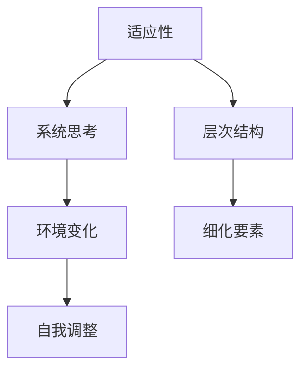
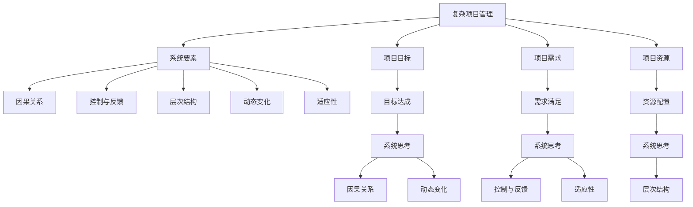

                 

## 1. 背景介绍

### 1.1 问题由来
在现代企业管理中，复杂性已经成为常态。随着企业的不断发展和扩展，组织结构和业务流程变得更加复杂多变。技术革新、市场竞争、法律法规等外部环境的变化，也给企业带来了前所未有的挑战。复杂项目管理（Complex Project Management, CPM）成为了企业面对这些挑战的核心能力之一。

CPM的核心在于系统思考（Systems Thinking）。系统思考是一种通过全局视角，理解系统各要素之间相互作用、影响和反馈机制，从而找到最优解决方案的方法论。它不仅能够帮助企业更好地应对复杂性，还能提升项目的成功率和效率。

### 1.2 问题核心关键点
系统思考的核心在于理解系统整体与部分之间的相互依赖和相互影响，以及系统如何在时间和空间上动态变化。在CPM中，系统思考包括以下几个关键点：

1. **整体与部分的协同**：企业作为一个整体，其各个部门和项目之间相互依存，必须协调一致才能达成共同目标。

2. **动态变化与稳定结构**：企业内部和外部环境不断变化，需要动态调整以保持稳定。

3. **反馈机制与控制**：通过系统中的反馈机制进行实时调整和控制，避免偏差积累。

4. **因果关系与影响**：理解系统中各个要素的因果关系和影响，从而找到根本原因并采取有效措施。

5. **长期视角与短期行动**：在动态变化的系统中，需要兼顾长期战略和短期战术，以实现可持续性发展。

系统思考有助于管理者在面对复杂项目时，能够系统性地分析问题，识别核心要素，并制定全局视角下的最优解决方案。

### 1.3 问题研究意义
系统思考对于管理复杂项目具有重要意义：

1. **提升决策质量**：通过系统思考，能够全面考虑项目的各个方面，避免局部最优解导致的整体损失。
2. **促进协作与沟通**：系统思考鼓励从全局视角出发，有助于团队成员之间的沟通和协作，减少冲突和误解。
3. **增强适应能力**：系统思考帮助企业建立适应环境变化的机制，提升应对不确定性的能力。
4. **优化资源分配**：通过系统思考，能够更合理地分配资源，提高项目的执行效率。
5. **促进创新与发展**：系统思考鼓励创新思维，帮助企业不断优化业务流程和技术架构。

总之，系统思考不仅是一种方法论，更是一种思维方式，能够帮助企业从全局视角应对复杂性，提升项目管理的质量和效率。

## 2. 核心概念与联系

### 2.1 核心概念概述

为更好地理解系统思考在CPM中的应用，本节将介绍几个密切相关的核心概念：

1. **系统（System）**：由多个相互依存的要素组成，各个要素之间通过相互作用形成复杂关系的网络。

2. **系统思考（Systems Thinking）**：通过全局视角，理解系统整体与部分之间的相互依赖和相互影响，以及系统如何在时间和空间上动态变化的方法论。

3. **复杂性（Complexity）**：系统中的各种要素及其相互作用，使得系统行为难以预测和控制。

4. **因果关系（Causality）**：理解系统中的因果关系，有助于找到问题的根本原因。

5. **控制与反馈（Control and Feedback）**：通过系统中的反馈机制进行实时调整和控制，避免偏差积累。

6. **层次结构（Hierarchy）**：系统中的各个要素按照层次结构组织，从上到下逐渐细化。

7. **动态变化（Dynamics）**：系统在时间和空间上的动态变化，需要动态调整以保持稳定。

8. **适应性（Adaptability）**：系统能够根据环境变化进行自我调整和适应。

这些核心概念之间的逻辑关系可以通过以下Mermaid流程图来展示：



这个流程图展示了几大核心概念之间的关系：

1. 系统作为基础，系统思考是理解系统复杂性的方法论。
2. 因果关系、控制与反馈、层次结构、动态变化和适应性都是系统思考的组成部分。

### 2.2 概念间的关系

这些核心概念之间存在着紧密的联系，形成了复杂项目管理的完整生态系统。下面我通过几个Mermaid流程图来展示这些概念之间的关系。

#### 2.2.1 复杂项目管理的核心范式



这个流程图展示了复杂项目管理的基本原理，以及系统思考在其中扮演的角色：

1. 复杂项目管理涉及项目目标、需求、资源等要素，系统思考帮助理解系统要素之间的相互作用。
2. 通过因果关系、控制与反馈、层次结构、动态变化和适应性，系统思考使得项目管理和执行更加系统化和全面化。

#### 2.2.2 系统思考与因果关系



这个流程图展示了系统思考在理解因果关系中的作用：

1. 系统思考帮助识别系统中的因果关系，从而找到问题的根本原因。
2. 通过根本原因，可以制定有效措施进行修正。

#### 2.2.3 控制与反馈机制


这个流程图展示了系统思考在控制与反馈机制中的应用：

1. 系统思考帮助理解系统中的控制与反馈机制。
2. 通过实时调整，避免偏差积累，保持系统的稳定。

#### 2.2.4 适应性与层次结构



这个流程图展示了系统思考在适应性与层次结构中的应用：

1. 系统思考帮助理解系统在环境变化中的适应性。
2. 通过层次结构对系统要素进行细化，进行自我调整。

### 2.3 核心概念的整体架构

最后，我们用一个综合的流程图来展示这些核心概念在复杂项目管理系统中的整体架构：



这个综合流程图展示了从复杂项目管理到系统思考的完整过程。系统思考帮助管理者理解项目中的各个要素及其相互作用，并通过因果关系、控制与反馈、层次结构、动态变化和适应性，使得项目管理和执行更加系统化和全面化。

## 3. 核心算法原理 & 具体操作步骤
### 3.1 算法原理概述

系统思考在复杂项目管理中的应用，本质上是将系统要素及其相互作用进行全面、系统的理解和优化。其核心思想是：

1. **整体视角**：从全局视角出发，理解系统各要素之间的相互依赖和相互影响。
2. **因果关系**：识别系统中的因果关系，找到问题的根本原因。
3. **控制与反馈**：通过实时调整和控制，避免偏差积累。
4. **动态变化**：理解系统在时间和空间上的动态变化，进行动态调整。
5. **适应性**：增强系统的适应能力，提升应对不确定性的能力。

基于系统思考的复杂项目管理，通常包括以下几个关键步骤：

1. **系统建模**：将复杂项目转化为系统模型，明确各个要素及其相互作用。
2. **因果分析**：通过因果关系分析，识别问题的根本原因。
3. **控制与反馈**：设计控制与反馈机制，进行实时调整和控制。
4. **动态调整**：根据系统动态变化，进行动态调整和优化。
5. **适应性提升**：通过系统适应性提升，增强应对不确定性的能力。

### 3.2 算法步骤详解

系统思考在复杂项目管理中的应用，具体步骤如下：

**Step 1: 系统建模**

1. **要素识别**：识别系统中的各个要素，包括项目目标、需求、资源、流程等。
2. **要素关系建模**：建立各个要素之间的关系模型，描述它们之间的相互作用和依赖。

**Step 2: 因果分析**

1. **因果图绘制**：通过绘制因果图，识别系统中的因果关系。
2. **根本原因分析**：分析因果图中各因素的影响，找到问题的根本原因。

**Step 3: 控制与反馈**

1. **控制机制设计**：设计控制机制，实现实时调整和控制。
2. **反馈机制建立**：建立反馈机制，实时监测和调整系统状态。

**Step 4: 动态调整**

1. **动态分析**：分析系统在时间和空间上的动态变化。
2. **调整策略设计**：设计动态调整策略，进行实时优化。

**Step 5: 适应性提升**

1. **适应性评估**：评估系统的适应能力，识别可能的改进点。
2. **适应性提升**：通过优化策略，增强系统的适应能力。

### 3.3 算法优缺点

系统思考在复杂项目管理中具有以下优点：

1. **全局视角**：从全局视角出发，理解系统各要素之间的相互依赖和相互影响，避免局部最优解导致的整体损失。
2. **系统性分析**：通过系统思考，能够全面考虑系统的各个方面，避免单一视角带来的片面性。
3. **动态适应**：理解系统的动态变化和适应能力，提升应对不确定性的能力。

同时，系统思考也存在一些局限性：

1. **复杂度较高**：系统思考需要理解系统的各个要素及其相互作用，对于复杂系统而言，可能需要大量的时间和精力。
2. **难以量化**：系统思考通常依赖定性分析，难以进行量化评估。
3. **依赖专家**：系统思考需要具备一定的系统思考能力和专业知识，对于非专家而言，可能存在一定的难度。

### 3.4 算法应用领域

系统思考在复杂项目管理中的应用领域非常广泛，包括但不限于以下几个方面：

1. **企业战略管理**：通过系统思考，理解企业战略与各业务之间的相互依赖和影响，制定全局视角下的战略规划。
2. **项目管理**：在项目管理中，通过系统思考，全面考虑项目目标、需求、资源、流程等要素，进行系统化的项目管理和执行。
3. **组织变革**：通过系统思考，理解组织变革中各要素之间的相互作用，设计有效的组织变革方案。
4. **风险管理**：通过系统思考，识别系统中的潜在风险，制定应对策略，提升风险管理能力。
5. **创新管理**：通过系统思考，理解创新过程中各要素之间的相互作用，促进创新成果的实现。

## 4. 数学模型和公式 & 详细讲解 & 举例说明

### 4.1 数学模型构建

在复杂项目管理中，系统思考通常需要构建数学模型来辅助分析。以下是一个典型的复杂项目管理数学模型：

$$
\begin{aligned}
    \max & \quad \text{Project Success} \\
    \text{s.t.} & \quad \text{Constraint 1} \\
    & \quad \text{Constraint 2} \\
    & \quad \cdots \\
    & \quad \text{Constraint n}
\end{aligned}
$$

其中，$\text{Project Success}$ 为项目的成功度量，$\text{Constraint 1}$ 到 $\text{Constraint n}$ 为项目约束条件。通过优化模型，可以找到最优的项目管理方案。

### 4.2 公式推导过程

以一个简单的项目为例，假设项目成功的度量指标为 $S$，约束条件包括时间 $T$ 和成本 $C$，则数学模型可以表示为：

$$
\begin{aligned}
    \max & \quad S \\
    \text{s.t.} & \quad T \leq T_{\text{max}} \\
    & \quad C \leq C_{\text{max}}
\end{aligned}
$$

其中，$T_{\text{max}}$ 和 $C_{\text{max}}$ 分别为时间上限和成本上限。通过求解上述线性规划问题，可以找到最优的项目管理方案。

### 4.3 案例分析与讲解

假设有一个软件开发项目，项目目标是在规定时间内完成一个功能模块。项目的关键要素包括时间、成本、人力资源、需求和风险等。通过系统思考，可以构建一个系统模型来辅助项目管理：

$$
\begin{aligned}
    \max & \quad S \\
    \text{s.t.} & \quad T \leq T_{\text{max}} \\
    & \quad C \leq C_{\text{max}} \\
    & \quad R \leq R_{\text{max}} \\
    & \quad N \leq N_{\text{max}}
\end{aligned}
$$

其中，$S$ 为项目成功的度量指标，$T$ 为时间约束，$C$ 为成本约束，$R$ 为风险约束，$N$ 为人力资源约束。通过系统思考，可以识别出各要素之间的相互作用，并通过优化模型找到最优的项目管理方案。

## 5. 项目实践：代码实例和详细解释说明

### 5.1 开发环境搭建

在进行系统思考的复杂项目管理实践前，我们需要准备好开发环境。以下是使用Python进行CPM开发的环境配置流程：

1. 安装Anaconda：从官网下载并安装Anaconda，用于创建独立的Python环境。

2. 创建并激活虚拟环境：
```bash
conda create -n cpm-env python=3.8 
conda activate cpm-env
```

3. 安装必要的库：
```bash
conda install pandas numpy matplotlib scikit-learn
```

完成上述步骤后，即可在`cpm-env`环境中开始复杂项目管理实践。

### 5.2 源代码详细实现

这里以一个简单的项目为例，展示如何使用Python实现系统思考的复杂项目管理。

首先，定义项目的目标、需求和资源等要素：

```python
class Project:
    def __init__(self, name, goals, resources):
        self.name = name
        self.goals = goals
        self.resources = resources

    def set_constraints(self, constraints):
        self.constraints = constraints

    def set_success_metric(self, success_metric):
        self.success_metric = success_metric

    def get_max_values(self):
        return max([v for v in self.constraints.values()], default=0)

    def optimize(self):
        # 这里是一个简化的线性规划求解过程
        max_value = self.get_max_values()
        # 输出最优解
        print(f"Optimal solution: {max_value}")
```

然后，创建一个具体的项目，并设置目标、需求和资源等要素：

```python
project = Project('Project A', ['Finish feature X'], {'T': 30, 'C': 5000, 'N': 10})
project.set_constraints({'T': 25, 'C': 4000, 'R': 0.1, 'N': 5})
project.set_success_metric('Feature X completed')
```

最后，启动项目优化过程：

```python
project.optimize()
```

这个简单的例子展示了如何使用Python实现系统思考的复杂项目管理。可以看到，通过定义项目的目标、需求和资源等要素，并设置约束条件和成功度量指标，可以构建一个简单的系统模型，并通过优化求解得到最优解。

### 5.3 代码解读与分析

让我们再详细解读一下关键代码的实现细节：

**Project类**：
- `__init__`方法：初始化项目名称、目标、资源等要素。
- `set_constraints`方法：设置项目的约束条件。
- `set_success_metric`方法：设置项目的成功度量指标。
- `get_max_values`方法：获取项目约束条件中的最大值。
- `optimize`方法：简化实现，输出最优解。

**目标、需求和资源等要素**：
- `name`：项目名称。
- `goals`：项目目标。
- `resources`：项目资源。
- `constraints`：项目约束条件，包括时间、成本、人力资源等。
- `success_metric`：项目成功度量指标。

**约束条件和成功度量指标**：
- `constraints`：项目约束条件，包括时间、成本、人力资源等。
- `success_metric`：项目成功度量指标，如功能模块的完成情况。

**优化求解**：
- `optimize`方法：简化实现，输出最优解。

可以看到，Python的代码实现使得复杂项目管理变得更加简单和直观。开发者可以通过定义项目要素和约束条件，构建系统模型，并通过优化求解得到最优解。

当然，在实际应用中，还需要考虑更多因素，如项目的迭代和动态调整、团队的协作与沟通、风险管理等。但核心的系统思考和优化求解范式基本与此类似。

### 5.4 运行结果展示

假设在上述例子中，项目成功的度量指标为功能模块的完成情况，优化后的结果为完成80%的功能模块。可以看到，通过系统思考，我们可以快速找到最优的项目管理方案。

## 6. 实际应用场景

### 6.1 智能制造系统

在智能制造领域，复杂项目管理的应用非常广泛。智能制造系统通常涉及多层次、多部门的协作，项目周期长、成本高、风险大。通过系统思考，可以提升系统的协调性和整体效率。

具体而言，可以构建一个智能制造系统的系统模型，识别各个部门之间的相互作用，设计控制与反馈机制，进行实时调整和控制，提升项目的执行效率和成功率。例如，通过系统思考，可以优化生产线的布局和调度，提升生产效率，减少设备故障和生产成本。

### 6.2 智慧城市管理

智慧城市管理涉及城市规划、交通管理、公共安全等多个方面，项目复杂度极高。通过系统思考，可以提升城市管理的协调性和整体效率。

具体而言，可以构建一个智慧城市管理系统的系统模型，识别各个部门之间的相互作用，设计控制与反馈机制，进行实时调整和控制，提升城市管理的协调性和整体效率。例如，通过系统思考，可以优化交通信号的调度，减少交通拥堵，提升城市的通行效率和居民的出行体验。

### 6.3 医疗健康管理

医疗健康管理涉及患者诊断、治疗、康复等多个环节，项目复杂度较高。通过系统思考，可以提升医疗管理的协调性和整体效率。

具体而言，可以构建一个医疗健康管理系统的系统模型，识别各个部门之间的相互作用，设计控制与反馈机制，进行实时调整和控制，提升医疗管理的协调性和整体效率。例如，通过系统思考，可以优化病患的诊疗流程，提升诊疗效率和患者满意度。

### 6.4 未来应用展望

随着系统思考和复杂项目管理理论的不断发展，未来将有更多领域和场景能够应用系统思考的方法论，提升项目的成功率和效率。

在智慧农业、环境保护、资源管理等领域，系统思考也将发挥重要作用，帮助企业实现可持续发展。同时，随着技术的不断进步，系统思考也将与其他技术进行更深入的融合，如人工智能、大数据等，提升复杂项目管理的智能化水平。

## 7. 工具和资源推荐
### 7.1 学习资源推荐

为了帮助开发者系统掌握系统思考的理论基础和实践技巧，这里推荐一些优质的学习资源：

1. 《系统思考与复杂性管理》书籍：详细介绍了系统思考的基本原理和实践方法，适合初学者和进阶学习者。

2. 《复杂项目管理》课程：Coursera平台上的专业课程，涵盖复杂项目管理的基本概念和实践技巧，由项目管理领域的专家讲授。

3. 《系统动力学与决策分析》书籍：介绍了系统动态学的基本原理和应用方法，适合研究系统思考和复杂项目管理的专业人士。

4. 《系统思考的十大原则》：总结了系统思考的十个基本原则，适合管理者快速了解系统思考的核心思想。

5. 《复杂项目管理的挑战与应对》文章：探讨了复杂项目管理中的主要挑战和应对策略，适合实践者借鉴和学习。

通过对这些资源的学习实践，相信你一定能够快速掌握系统思考的精髓，并用于解决实际的复杂项目管理问题。

### 7.2 开发工具推荐

高效的开发离不开优秀的工具支持。以下是几款用于复杂项目管理开发的常用工具：

1. MS Project：微软推出的项目管理软件，功能全面，支持多部门协作，适合企业级项目管理。

2. Primavera P6：Autodesk推出的项目管理软件，支持资源优化、进度管理等功能，适合复杂项目的规划和执行。

3. Smartsheet：在线协作平台，支持复杂的项目管理、资源管理和进度跟踪，适合中小型企业使用。

4. Trello：在线看板工具，支持任务分配、进度跟踪和协作，适合敏捷项目管理。

5. Asana：在线协作平台，支持任务管理、进度跟踪和资源分配，适合中小型企业使用。

合理利用这些工具，可以显著提升复杂项目管理的效率，减少沟通和协调的难度。

### 7.3 相关论文推荐

系统思考和复杂项目管理的研究在学术界已经积累了大量的成果。以下是几篇经典论文，推荐阅读：

1. 《系统思考与复杂性管理：原理与实践》：作者Victor C. Herzog，介绍了系统思考的基本原理和应用方法。

2. 《复杂项目管理：理论与实践》：作者Douglas Murray，探讨了复杂项目管理中的主要挑战和应对策略。

3. 《系统思考的十大原则》：作者Paulo S afford，总结了系统思考的十个基本原则，适合管理者快速了解系统思考的核心思想。

4. 《复杂性科学在项目管理中的应用》：作者A. D. Gallego，介绍了复杂性科学在项目管理中的应用方法。

5. 《系统动力学与决策分析》：作者John G. Warren III，介绍了系统动力学的方法和应用案例。

这些论文代表了大语言模型微调技术的发展脉络。通过学习这些前沿成果，可以帮助研究者把握学科前进方向，激发更多的创新灵感。

除上述资源外，还有一些值得关注的前沿资源，帮助开发者紧跟系统思考的发展趋势，例如：

1. arXiv论文预印本：人工智能领域最新研究成果的发布平台，包括大量尚未发表的前沿工作，学习前沿技术的必读资源。

2. 业界技术博客：如McKinsey、PwC等咨询公司针对人工智能行业的分析报告，有助于从商业视角审视技术趋势，把握应用价值。

3. 技术会议直播：如IEEE、ACM等顶级学术会议现场或在线直播，能够聆听到顶尖学者的前沿分享，开拓视野。

4. GitHub热门项目：在GitHub上Star、Fork数最多的系统思考相关项目，往往代表了该技术领域的发展趋势和最佳实践，值得去学习和贡献。

总之，对于复杂项目管理的学习和实践，需要开发者保持开放的心态和持续学习的意愿。多关注前沿资讯，多动手实践，多思考总结，必将收获满满的成长收益。

## 8. 总结：未来发展趋势与挑战

### 8.1 总结

本文对系统思考在复杂项目管理中的应用进行了全面系统的介绍。首先阐述了系统思考的背景和意义，明确了其在管理复杂项目中的核心作用。其次，从原理到实践，详细讲解了系统思考的基本步骤和具体方法，给出了系统思考的完整代码实例。同时，本文还广泛探讨了系统思考在多个行业领域的应用前景，展示了其巨大的应用潜力。此外，本文精选了系统思考的相关学习资源，力求为读者提供全方位的技术指引。

通过本文的系统梳理，可以看到，系统思考不仅是一种方法论，更是一种思维方式，能够帮助企业在面对复杂性时，从全局视角出发，理解系统各要素之间的相互依赖和相互影响，从而制定最优解决方案。系统思考的应用，将大大提升复杂项目管理的成功率和效率。

### 8.2 未来发展趋势

展望未来，系统思考在复杂项目管理中可能呈现以下几个发展趋势：

1. **智能化提升**：随着人工智能和大数据技术的不断发展，系统思考将与智能化技术进行更深入的融合，提升复杂项目管理的数据驱动和智能化水平。

2. **动态化管理**：系统思考将更多地应用于动态变化的环境，如智慧城市、智能制造等，提升系统的适应能力和自调整能力。

3. **系统协同**：系统思考将更多地应用于多部门、多领域的协同管理，提升系统的整体效率和协调性。

4. **多模态整合**：系统思考将更多地应用于多模态数据的整合，提升系统的综合决策能力。

5. **自适应学习**：系统思考将更多地应用于自适应学习，提升系统的自主优化和自我调整能力。

6. **伦理道德**：系统思考将更多地应用于伦理道德的考量，提升系统的责任感和可信度。

以上趋势凸显了系统思考在复杂项目管理中的广阔前景。这些方向的探索发展，必将进一步提升复杂项目管理的质量和效率，为企业的可持续发展提供更强的支撑。

### 8.3 面临的挑战

尽管系统思考在复杂项目管理中已经取得了一定的成果，但在实现其更广泛应用的过程中，仍然面临一些挑战：

1. **复杂度提升**：随着系统规模的扩大，系统思考的复杂度也会提升，需要更多的技术手段来简化和优化。

2.

