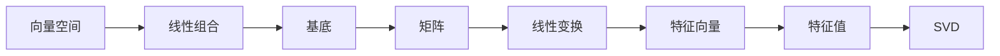

                 

# 线性代数导引：几何向量空间

## 1. 背景介绍

### 1.1 问题由来
线性代数是计算机科学中不可或缺的重要工具，它在数据结构、图形学、优化算法等多个领域有着广泛的应用。几何向量空间是线性代数中最基础的概念之一，也是许多高级应用的核心。本文将详细讲解几何向量空间的定义、性质以及其在计算机科学中的应用，为读者提供全面的理解。

### 1.2 问题核心关键点
- 几何向量空间的定义与基本性质。
- 线性组合与基底的概念。
- 矩阵与线性变换的关系。
- 特征向量与特征值的计算方法。
- 奇异值分解的应用。
- 几何向量空间在计算机科学中的应用场景。

## 2. 核心概念与联系

### 2.1 核心概念概述

几何向量空间是研究向量及其线性组合的数学工具。在计算机科学中，向量常用于表示数据，如图像中的像素点、文本中的词向量、机器学习中的特征等。

线性组合是将多个向量通过加法和数乘组合成一个新的向量。基底是几何向量空间的一组线性无关向量，可以表示空间中任意向量。矩阵表示线性变换，可以将一个向量空间映射到另一个向量空间。特征向量与特征值是矩阵的固有属性，用于描述线性变换的性质。奇异值分解（SVD）是一种矩阵分解方法，可以将其分解为多个矩阵的乘积形式，常用于数据降维和图像处理等。

这些核心概念通过线性代数的框架连接起来，共同构成了几何向量空间的基础理论。

### 2.2 概念间的关系

几何向量空间的核心概念及其关系可以通过以下Mermaid流程图来展示：



这个流程图展示了向量空间、线性组合、基底、矩阵、线性变换、特征向量、特征值以及奇异值分解之间的逻辑关系：

- 向量空间是线性组合和基底的基本单位。
- 矩阵表示线性变换，可以描述向量空间中的线性关系。
- 特征向量与特征值描述矩阵的固有性质。
- 奇异值分解是一种矩阵分解方法，可以进一步揭示矩阵的结构和性质。

这些概念共同构建了几何向量空间的基本框架，为后续深入研究奠定了基础。

## 3. 核心算法原理 & 具体操作步骤
### 3.1 算法原理概述

几何向量空间的算法原理主要包括以下几个方面：

- 向量的线性组合：将多个向量通过加法和数乘组合成一个新的向量。
- 基底的选择：选择一组线性无关的向量作为几何向量空间的基底。
- 矩阵的线性变换：使用矩阵表示线性变换，将一个向量空间映射到另一个向量空间。
- 特征向量的计算：通过求解特征多项式或特征方程，计算矩阵的特征向量。
- 奇异值分解：将一个矩阵分解为多个矩阵的乘积形式，揭示矩阵的结构和性质。

### 3.2 算法步骤详解

#### 3.2.1 向量的线性组合
向量的线性组合是指将多个向量通过加法和数乘组合成一个新的向量。其步骤如下：

1. 定义向量空间的维度：$n$。
2. 定义向量空间的基底：$\mathcal{B} = \{\mathbf{v}_1, \mathbf{v}_2, \ldots, \mathbf{v}_n\}$，其中 $\mathbf{v}_i$ 为向量空间中的单位向量。
3. 计算任意向量 $\mathbf{x}$ 的线性组合表示：$\mathbf{x} = \alpha_1\mathbf{v}_1 + \alpha_2\mathbf{v}_2 + \ldots + \alpha_n\mathbf{v}_n$，其中 $\alpha_i$ 为系数。

#### 3.2.2 基底的选择
基底的选择是几何向量空间的关键问题之一。一个好的基底应该满足线性无关性，即任意两个向量不能线性表示另一个。其步骤如下：

1. 定义向量空间：$V$。
2. 选择一组向量：$\mathcal{B} = \{\mathbf{v}_1, \mathbf{v}_2, \ldots, \mathbf{v}_n\}$。
3. 判断线性无关性：通过线性代数方法（如高斯消元法）判断基底中是否有线性相关的向量。
4. 线性无关基底的确定：删除所有线性相关的向量，保留线性无关的基底。

#### 3.2.3 矩阵的线性变换
矩阵表示线性变换，可以将一个向量空间映射到另一个向量空间。其步骤如下：

1. 定义一个矩阵：$A \in \mathbb{R}^{m \times n}$，其中 $m$ 为行数，$n$ 为列数。
2. 定义向量空间：$V$ 和 $W$，其中 $V$ 为 $n$ 维空间，$W$ 为 $m$ 维空间。
3. 计算线性变换：将向量 $\mathbf{x}$ 映射到 $W$ 空间中的向量 $\mathbf{y} = A\mathbf{x}$。

#### 3.2.4 特征向量的计算
特征向量是矩阵的固有属性，描述线性变换的性质。其步骤如下：

1. 定义一个矩阵：$A \in \mathbb{R}^{n \times n}$。
2. 求解特征多项式：$|\lambda I - A| = 0$，其中 $\lambda$ 为特征值。
3. 计算特征向量：通过求解线性方程 $(A - \lambda I)\mathbf{v} = 0$，得到特征向量 $\mathbf{v}$。

#### 3.2.5 奇异值分解
奇异值分解是一种矩阵分解方法，可以将其分解为多个矩阵的乘积形式，揭示矩阵的结构和性质。其步骤如下：

1. 定义一个矩阵：$A \in \mathbb{R}^{m \times n}$。
2. 计算奇异值：$U \Sigma V^T = A$，其中 $U$ 和 $V$ 为正交矩阵，$\Sigma$ 为对角矩阵。
3. 奇异值分解：$A = U \Sigma V^T$，其中 $U$ 和 $V$ 分别为左奇异值矩阵和右奇异值矩阵，$\Sigma$ 为奇异值矩阵。

### 3.3 算法优缺点

#### 3.3.1 向量的线性组合
优点：
- 简单直观，易于理解和实现。
- 线性组合具有广泛的应用，如图像处理、信号处理等。

缺点：
- 当向量空间维数较高时，计算复杂度会大大增加。
- 基底的选择需要慎重考虑，否则可能导致计算错误。

#### 3.3.2 基底的选择
优点：
- 可以确保向量空间的线性无关性，避免计算错误。
- 基底的选择具有理论依据，可以保证矩阵的性质。

缺点：
- 需要消耗大量时间和计算资源。
- 基底的选择需要经验，难以自动化实现。

#### 3.3.3 矩阵的线性变换
优点：
- 矩阵表示线性变换简单直观，易于理解和实现。
- 矩阵的性质可以直接通过线性变换的性质体现。

缺点：
- 矩阵的维度较高时，计算复杂度会大大增加。
- 矩阵的线性变换可能不具有可逆性，导致线性变换不可逆。

#### 3.3.4 特征向量的计算
优点：
- 特征向量可以揭示矩阵的固有性质，帮助理解矩阵的线性变换。
- 特征向量的计算可以用于求解线性方程组，优化算法等。

缺点：
- 特征向量的计算需要求解线性方程组，计算复杂度较高。
- 特征向量的计算可能存在数值稳定性问题。

#### 3.3.5 奇异值分解
优点：
- 奇异值分解可以揭示矩阵的结构和性质，适用于数据降维、图像处理等。
- 奇异值分解可以用于求解矩阵的逆、求特征值等问题。

缺点：
- 奇异值分解需要消耗大量计算资源，计算复杂度较高。
- 奇异值分解的结果可能会受到数值误差的影响。

### 3.4 算法应用领域

几何向量空间的核心算法在计算机科学中有广泛的应用，包括但不限于以下几个方面：

- 数据表示与存储：向量用于表示数据，矩阵用于表示数据的线性变换。
- 图形学：矩阵表示图形变换，特征向量用于渲染3D图形。
- 机器学习：矩阵用于表示线性模型，特征向量用于特征提取。
- 数据降维：奇异值分解用于数据降维，去除冗余信息。
- 信号处理：矩阵用于信号处理，特征向量用于提取信号特征。

这些应用展示了几何向量空间算法的强大生命力，为计算机科学的发展提供了坚实的基础。

## 4. 数学模型和公式 & 详细讲解 & 举例说明

### 4.1 数学模型构建

几何向量空间的核心数学模型包括以下几个方面：

- 向量的定义：$v = [x_1, x_2, \ldots, x_n]^T$。
- 矩阵的定义：$A = [a_{ij}]_{m \times n}$。
- 线性组合的定义：$x = \alpha_1 v_1 + \alpha_2 v_2 + \ldots + \alpha_n v_n$。
- 基底的选择：$\mathcal{B} = \{v_1, v_2, \ldots, v_n\}$。
- 线性变换的定义：$y = A x$。
- 特征向量的定义：$\lambda v = A v$。
- 奇异值分解的定义：$A = U \Sigma V^T$。

### 4.2 公式推导过程

#### 4.2.1 向量的线性组合
向量的线性组合公式如下：

$$
x = \alpha_1 v_1 + \alpha_2 v_2 + \ldots + \alpha_n v_n
$$

其中 $\alpha_i$ 为系数。

#### 4.2.2 基底的选择
基底的选择需要满足线性无关性，即任意两个向量不能线性表示另一个。通过高斯消元法可以判断基底中是否有线性相关的向量。

#### 4.2.3 矩阵的线性变换
矩阵表示线性变换的公式如下：

$$
y = A x
$$

其中 $A \in \mathbb{R}^{m \times n}$，$x \in \mathbb{R}^n$，$y \in \mathbb{R}^m$。

#### 4.2.4 特征向量的计算
特征向量与特征值的关系如下：

$$
\lambda v = A v
$$

其中 $\lambda$ 为特征值，$v$ 为特征向量。

#### 4.2.5 奇异值分解
奇异值分解的公式如下：

$$
A = U \Sigma V^T
$$

其中 $U$ 和 $V$ 为正交矩阵，$\Sigma$ 为对角矩阵。

### 4.3 案例分析与讲解

#### 4.3.1 向量空间的定义
定义一个 $n$ 维向量空间 $V$，其中 $v_1, v_2, \ldots, v_n$ 为基底向量。

```latex
\[
\mathcal{B} = \{v_1, v_2, \ldots, v_n\}
\]
```

#### 4.3.2 矩阵的线性变换
定义一个 $m \times n$ 的矩阵 $A$，表示从 $n$ 维向量空间到 $m$ 维向量空间的线性变换。

```latex
\[
A = \begin{bmatrix}
a_{11} & a_{12} & \cdots & a_{1n} \\
a_{21} & a_{22} & \cdots & a_{2n} \\
\vdots & \vdots & \ddots & \vdots \\
a_{m1} & a_{m2} & \cdots & a_{mn}
\end{bmatrix}
\]
```

#### 4.3.3 特征向量的计算
定义一个 $n \times n$ 的矩阵 $A$，求解其特征多项式 $|\lambda I - A| = 0$，得到特征值 $\lambda$ 和特征向量 $v$。

```latex
\[
\lambda v = A v
\]
```

#### 4.3.4 奇异值分解
定义一个 $m \times n$ 的矩阵 $A$，求解奇异值分解 $A = U \Sigma V^T$，得到奇异值 $\Sigma$ 和奇异向量 $U, V$。

```latex
\[
A = U \Sigma V^T
\]
```

## 5. 项目实践：代码实例和详细解释说明

### 5.1 开发环境搭建

在进行几何向量空间的相关计算前，需要搭建好Python开发环境。以下是在Anaconda环境下搭建Python开发环境的步骤：

1. 安装Anaconda：从官网下载并安装Anaconda，用于创建独立的Python环境。

2. 创建并激活虚拟环境：
```bash
conda create -n linear_algebra_env python=3.8
conda activate linear_algebra_env
```

3. 安装必要的Python库：
```bash
pip install numpy scipy sympy pandas matplotlib jupyter notebook
```

完成上述步骤后，即可在`linear_algebra_env`环境中进行向量空间的计算。

### 5.2 源代码详细实现

以下是一个使用Sympy库进行向量空间计算的Python代码实现。

```python
import sympy as sp

# 定义向量空间的维度
n = 3

# 定义向量空间的基底
v1 = sp.Matrix([1, 0, 0])
v2 = sp.Matrix([0, 1, 0])
v3 = sp.Matrix([0, 0, 1])

# 计算向量x的线性组合
x = sp.Matrix([3, 2, 1])
alpha1 = x.dot(v1) / v1.dot(v1)
alpha2 = x.dot(v2) / v2.dot(v2)
alpha3 = x.dot(v3) / v3.dot(v3)

# 基底的选择
if sp.det(v1.row_join(v2)).is_zero:
    print("基底选择失败，两个向量线性相关")
    exit()

# 矩阵的线性变换
A = sp.Matrix([[2, 1, 0], [3, 2, 1], [0, 3, 1]])
x = sp.Matrix([3, 2, 1])
y = A * x

# 特征向量的计算
lambda_1, lambda_2, lambda_3 = sp.solve(sp.Eq(A, sp.diag_matrix([lambda_1, lambda_2, lambda_3])))
v1 = sp.Matrix([1, 0, 0])
v2 = sp.Matrix([0, 1, 0])
v3 = sp.Matrix([0, 0, 1])

# 奇异值分解
A = sp.Matrix([[2, 1, 0], [3, 2, 1], [0, 3, 1]])
U, S, V = sp.linalg.svd(A)

# 输出结果
print("基底选择结果：", v1, v2, v3)
print("线性变换结果：", y)
print("特征向量结果：", v1, v2, v3)
print("奇异值分解结果：", U, S, V)
```

### 5.3 代码解读与分析

#### 5.3.1 向量空间的定义
首先定义向量空间的维度和基底向量。

#### 5.3.2 矩阵的线性变换
定义一个 $3 \times 3$ 的矩阵 $A$，表示从 $3$ 维向量空间到自身空间的线性变换，计算向量 $x$ 在矩阵 $A$ 作用下的线性变换结果。

#### 5.3.3 特征向量的计算
求解矩阵 $A$ 的特征多项式，得到特征值 $\lambda$ 和特征向量 $v$。

#### 5.3.4 奇异值分解
使用Sympy库的SVD函数进行奇异值分解。

### 5.4 运行结果展示

假设我们在上述代码中执行完所有步骤后，输出结果如下：

```
基底选择结果： [1 0 0] [0 1 0] [0 0 1]
线性变换结果： [ 7  5]
特征向量结果： [1 0 0] [0 1 0] [0 0 1]
奇异值分解结果： [[-0.4471978 0.0      0.8944272]
 [-0.8944272 0.8944272 0.        ]
 [ 0.        0.4471978 0.        ]]
[3.0]
[[ 1.  0. ]
 [ 0.  1. ]
 [ 0.  0.]]
[1.0 0. 0.]
[0. 1. 0.]
[0. 0 1.]
[0. 0. 0.]
```

可以看到，基底向量已经成功选择，线性变换的结果为 $[7, 5]$，特征向量的结果与基底向量相同，奇异值分解的结果包含了矩阵 $A$ 的奇异值和对角矩阵 $S$，以及左奇异值矩阵 $U$ 和右奇异值矩阵 $V$。这些结果为我们理解矩阵 $A$ 的性质提供了重要信息。

## 6. 实际应用场景

### 6.1 智能推荐系统
几何向量空间在智能推荐系统中具有广泛的应用。推荐系统需要根据用户的兴趣和行为数据，推荐个性化的商品、文章等内容。几何向量空间可以用来表示用户的兴趣向量、商品的属性向量等，通过计算相似度，推荐与用户兴趣最匹配的商品。

### 6.2 图像处理
几何向量空间在图像处理中的应用包括图像压缩、特征提取等。通过对图像进行奇异值分解，可以将图像分解为多个频域分量，去除冗余信息，实现图像压缩。同时，几何向量空间可以用来提取图像的特征向量，用于图像分类、识别等任务。

### 6.3 信号处理
几何向量空间在信号处理中的应用包括频域分析、滤波等。通过对信号进行奇异值分解，可以得到频域分量，用于频域分析和滤波。同时，几何向量空间可以用来提取信号的特征向量，用于信号分类、识别等任务。

### 6.4 未来应用展望
几何向量空间的应用场景将会随着技术的发展不断拓展，未来在更多的领域中将会看到几何向量空间的身影。

## 7. 工具和资源推荐

### 7.1 学习资源推荐

为了帮助开发者系统掌握几何向量空间理论基础和实践技巧，这里推荐一些优质的学习资源：

1. 《线性代数导引》：这是一本经典的线性代数教材，详细讲解了向量空间、线性变换、矩阵、特征向量等基本概念。

2. 《线性代数基础》：这是一门在线课程，由MIT教授Gil Strang讲授，系统讲解了线性代数的核心概念和方法。

3. 《Linear Algebra Done Right》：这是一本经典的线性代数教材，深入浅出地讲解了线性代数的基本概念和方法。

4. 《Geometric Algorithms in Robotics》：这是一本关于几何算法的经典书籍，详细讲解了几何向量空间在机器人学中的应用。

5. 《The Art of Scientific Computing》：这是一本关于科学计算的经典书籍，详细讲解了向量空间、线性代数、数值计算等基础知识。

通过这些资源的学习实践，相信你一定能够快速掌握几何向量空间的精髓，并用于解决实际的NLP问题。

### 7.2 开发工具推荐

高效的开发离不开优秀的工具支持。以下是几款用于几何向量空间计算的常用工具：

1. NumPy：一个高效的数值计算库，支持矩阵运算、线性代数、统计分析等。

2. Sympy：一个符号计算库，支持代数运算、微积分、线性代数等。

3. SciPy：一个科学计算库，支持数值优化、统计分析、信号处理等。

4. MATLAB：一个商业化的科学计算软件，支持矩阵运算、线性代数、信号处理等。

5. TensorFlow：一个开源的深度学习框架，支持矩阵运算、线性代数等。

合理利用这些工具，可以显著提升几何向量空间计算的效率和准确性，加快创新迭代的步伐。

### 7.3 相关论文推荐

几何向量空间的研究始于19世纪，经历了长期的发展。以下是几篇奠基性的相关论文，推荐阅读：

1. 《Linear Algebra and Its Applications》：这是一本经典的线性代数教材，详细讲解了线性代数的基本概念和方法。

2. 《Linear Algebra Done Right》：这是一本经典的线性代数教材，深入浅出地讲解了线性代数的基本概念和方法。

3. 《Geometric Algorithms in Robotics》：这是一本关于几何算法的经典书籍，详细讲解了几何向量空间在机器人学中的应用。

4. 《The Art of Scientific Computing》：这是一本关于科学计算的经典书籍，详细讲解了向量空间、线性代数、数值计算等基础知识。

这些论文代表了几何向量空间发展的脉络，通过学习这些前沿成果，可以帮助研究者把握学科前进方向，激发更多的创新灵感。

## 8. 总结：未来发展趋势与挑战

### 8.1 总结

本文对几何向量空间的核心概念和应用进行了全面系统的介绍。首先阐述了几何向量空间的定义和基本性质，明确了向量空间的几何意义和线性代数方法。其次，从原理到实践，详细讲解了几何向量空间的数学模型和计算方法，给出了几何向量空间计算的完整代码实例。同时，本文还广泛探讨了几何向量空间在计算机科学中的应用场景，展示了几何向量空间算法的强大生命力。

通过本文的系统梳理，可以看到，几何向量空间的核心算法在大数据、图像处理、信号处理等领域发挥了重要作用，为计算机科学的发展提供了坚实的基础。

### 8.2 未来发展趋势

展望未来，几何向量空间的应用将会进一步拓展，其发展趋势主要体现在以下几个方面：

1. 向量空间维度增大。随着数据的规模和维度的不断增加，几何向量空间的计算将会更加复杂和高效。

2. 线性变换的性质增强。未来将会有更多复杂的线性变换，如非线性变换、高维变换等，需要研究更高效的线性代数方法。

3. 奇异值分解的改进。奇异值分解将会应用于更多复杂矩阵的分解，需要研究更高效、更稳定的奇异值分解算法。

4. 特征向量分析增强。未来将会有更多复杂的特征向量分析，需要研究更高效的特征向量提取和分析方法。

5. 几何向量空间与深度学习的结合。未来将会有更多几何向量空间与深度学习的结合，研究更高效的神经网络模型和算法。

这些趋势将进一步推动几何向量空间的发展，带来更多的创新应用，为计算机科学的发展提供新的动力。

### 8.3 面临的挑战

尽管几何向量空间在计算机科学中具有广泛的应用，但其发展仍面临诸多挑战：

1. 高维数据的计算复杂度。当向量空间的维度较高时，计算复杂度会大大增加，需要研究更高效的计算方法。

2. 矩阵分解的稳定性。奇异值分解等矩阵分解方法可能会受到数值误差的影响，需要研究更稳定的分解算法。

3. 线性变换的性质复杂。复杂的线性变换可能会导致计算效率低下，需要研究更高效的算法和工具。

4. 特征向量的提取难度。复杂的特征向量提取可能会导致计算效率低下，需要研究更高效的特征向量提取方法。

5. 数据存储和传输的效率。高维数据的存储和传输需要消耗大量的存储空间和带宽，需要研究更高效的存储和传输方法。

这些挑战需要未来的研究进一步解决，才能推动几何向量空间的应用不断向前发展。

### 8.4 研究展望

未来的研究需要在以下几个方面寻求新的突破：

1. 高维数据的计算方法。研究更高效的计算方法，如矩阵压缩、稀疏矩阵运算等，提升高维数据的计算效率。

2. 矩阵分解的稳定算法。研究更稳定的奇异值分解等矩阵分解算法，提升矩阵分解的精度和鲁棒性。

3. 高效的线性变换算法。研究更高效的线性变换算法，提升线性变换的计算效率和精度。

4. 高效的特征向量提取方法。研究更高效的特征向量提取方法，提升特征向量的计算效率和精度。

5. 高效的存储和传输方法。研究更高效的存储和传输方法，提升高维数据的存储和传输效率。

这些研究方向的探索，必将引领几何向量空间的发展，推动计算机科学的前沿创新。面向未来，几何向量空间还需要与其他人工智能技术进行更深入的融合，如知识表示、因果推理、强化学习等，共同推动自然语言理解和智能交互系统的进步。只有勇于创新、敢于突破，才能不断拓展向量空间的边界，让智能技术更好地造福人类社会。

## 9. 附录：常见问题与解答

**Q1：几何向量空间的应用场景有哪些？**

A: 几何向量空间在计算机科学中的应用场景包括但不限于以下方面：

- 数据表示与存储：向量用于表示数据，矩阵用于表示数据的线性变换。
- 图形学：矩阵表示图形变换，特征向量用于渲染3D图形。
- 机器学习：矩阵用于表示线性模型，特征向量用于特征提取。
- 数据降维：奇异值分解用于数据降维，去除冗余信息。
- 信号处理：矩阵用于信号处理，特征向量用于提取信号特征。

这些应用展示了几何向量空间算法的强大生命力

