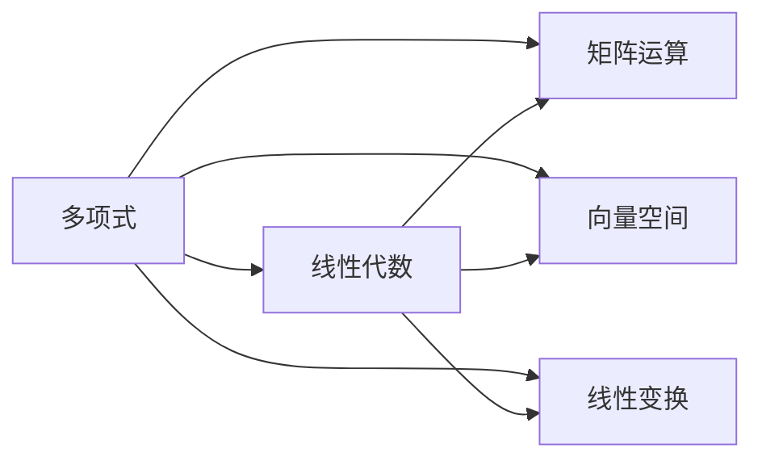

                 

# 线性代数导引：多变元多项式

> 关键词：线性代数, 多项式, 代数运算, 多维空间, 矩阵操作, 向量计算

## 1. 背景介绍

### 1.1 问题由来

线性代数是多变量科学计算中不可或缺的工具，广泛应用于物理学、工程学、计算机科学等多个领域。多变元多项式则是线性代数中最为基本和重要的一个概念，它在各种数学模型和算法中均有应用。本文旨在深入探讨多变元多项式的基本性质、运算规则及其应用场景，帮助读者构建坚实的线性代数基础。

### 1.2 问题核心关键点

多变元多项式在数学和计算机科学中的应用非常广泛，涉及多项式的定义、基本性质、运算规则以及应用场景等多个方面。本文将从多变元多项式的定义入手，深入探讨其性质、运算和应用，重点关注其代数特性及其在实际问题中的应用。

### 1.3 问题研究意义

掌握多变元多项式的性质和运算规则，对理解线性代数的高阶概念，如矩阵、向量空间、线性变换等，具有重要意义。此外，多项式在计算机视觉、信号处理、密码学等领域也有广泛应用，掌握多项式的操作对于解决实际问题具有重要的现实意义。

## 2. 核心概念与联系

### 2.1 核心概念概述

在数学中，多变元多项式（Multivariate Polynomial）是多个变量的多项式之和，通常表示为：

$$
f(x_1, x_2, ..., x_n) = \sum_{i=0}^k a_i \prod_{j=1}^n x_j^{i_j}
$$

其中，$x_1, x_2, ..., x_n$ 为多项式的变量，$a_i$ 为多项式系数，$k$ 为多项式的最高次项次数，$i_j$ 表示变量 $x_j$ 的幂次数。

多项式的基本性质包括：

1. 单项式表示：多项式可以分解为多个单项式之和。
2. 结合律：多项式的乘法满足结合律。
3. 分配律：多项式的乘法和加法满足分配律。
4. 幂等律：多项式的乘法满足幂等律。
5. 交换律：多项式的变量可以交换，乘法运算保持不变。

### 2.2 概念间的关系

多项式在代数中有着广泛的应用，其性质和运算在多个领域均有体现。以下是一个简单的Mermaid流程图，展示了多项式与线性代数中的其他概念之间的联系：



这个流程图展示了多项式与线性代数中的基本概念之间的联系。多项式可以表示为矩阵和向量空间的元素，而矩阵运算和线性变换则直接基于多项式展开。

## 3. 核心算法原理 & 具体操作步骤

### 3.1 算法原理概述

多变元多项式的核心算法原理主要涉及多项式的定义、基本性质和运算规则。多项式的运算主要包括加法、乘法和求导等基本操作。

### 3.2 算法步骤详解

#### 3.2.1 多项式的定义与表示

首先，我们需要定义一个多项式。在Python中，我们可以使用`sympy`库来表示多项式。例如，下面的代码定义了一个关于两个变量 $x$ 和 $y$ 的多项式：

```python
from sympy import symbols

x, y = symbols('x y')
poly = x**2 + 3*x*y + 2*y**2
```

在这个例子中，我们定义了多项式 $f(x,y) = x^2 + 3xy + 2y^2$。

#### 3.2.2 多项式的加法

多项式的加法操作非常简单，只需将相同变量的系数相加即可。在Python中，我们可以使用`+`运算符进行多项式的加法。例如：

```python
poly1 = x**2 + 3*x*y + 2*y**2
poly2 = x + 2*y + 1
result = poly1 + poly2
```

这将得到多项式 $f(x,y) + g(x,y) = x^2 + 3xy + 2y^2 + x + 2y + 1$。

#### 3.2.3 多项式的乘法

多项式的乘法操作涉及多项式的每一项乘积之和。在Python中，我们可以使用`*`运算符进行多项式的乘法。例如：

```python
poly3 = x**2 * y
result = poly * poly3
```

这将得到多项式 $f(x,y) \cdot g(x,y) = (x^2 + 3xy + 2y^2)(x^2y)$。

#### 3.2.4 多项式的求导

多项式的求导操作涉及到对每一项系数和幂次数的运算。在Python中，我们可以使用`diff`函数进行求导。例如：

```python
result = poly.diff(x)
result
```

这将得到多项式 $f(x,y)$ 关于变量 $x$ 的导数 $2x + 3y$。

### 3.3 算法优缺点

#### 3.3.1 优点

1. 灵活性：多项式可以表示任何函数，具有很强的灵活性和通用性。
2. 运算简便：多项式的加法和乘法运算非常直观，易于理解和实现。
3. 数学基础：多项式是数学中非常基础的概念，广泛应用在各类数学模型和算法中。

#### 3.3.2 缺点

1. 维度限制：多项式的维度受到变量的限制，不易处理高维数据。
2. 系数复杂：高次多项式的系数复杂，不易处理。
3. 计算量大：高次多项式的运算量大，需要耗费较多的计算资源。

### 3.4 算法应用领域

多项式在数学和计算机科学中的应用非常广泛，涉及多项式的定义、基本性质、运算规则以及应用场景等多个方面。以下是多项式在实际问题中的应用：

1. 代数曲线：多项式可以表示二维和三维空间中的代数曲线，应用在几何、拓扑等领域。
2. 微分方程：多项式可以表示微分方程的解，应用在数学、物理等领域。
3. 密码学：多项式在公钥加密算法中有广泛应用，如椭圆曲线加密、RSA等。
4. 信号处理：多项式可以表示滤波器、数字信号等，应用在通信、信号处理等领域。
5. 机器学习：多项式可以表示模型的权重，应用在机器学习、深度学习等领域。

## 4. 数学模型和公式 & 详细讲解 & 举例说明

### 4.1 数学模型构建

在数学中，多项式的定义和表示是非常重要的概念。我们可以将一个多项式 $f(x_1, x_2, ..., x_n)$ 表示为：

$$
f(x_1, x_2, ..., x_n) = \sum_{i=0}^k a_i \prod_{j=1}^n x_j^{i_j}
$$

其中，$a_i$ 表示多项式的系数，$k$ 表示最高次项次数。

### 4.2 公式推导过程

#### 4.2.1 多项式的加法

多项式的加法满足结合律和交换律，即：

$$
(f(x_1, x_2, ..., x_n) + g(x_1, x_2, ..., x_n)) + h(x_1, x_2, ..., x_n) = f(x_1, x_2, ..., x_n) + (g(x_1, x_2, ..., x_n) + h(x_1, x_2, ..., x_n))
$$

#### 4.2.2 多项式的乘法

多项式的乘法满足分配律和结合律，即：

$$
(f(x_1, x_2, ..., x_n) \cdot g(x_1, x_2, ..., x_n)) \cdot h(x_1, x_2, ..., x_n) = f(x_1, x_2, ..., x_n) \cdot (g(x_1, x_2, ..., x_n) \cdot h(x_1, x_2, ..., x_n))
$$

#### 4.2.3 多项式的求导

多项式的求导涉及每一项系数和幂次数的运算，具体过程如下：

$$
\frac{\partial f(x_1, x_2, ..., x_n)}{\partial x_i} = \sum_{j=0}^k j_i a_j \prod_{k=1}^n x_k^{j_k-1}
$$

### 4.3 案例分析与讲解

#### 4.3.1 案例一：多项式的加法

考虑两个多项式 $f(x,y) = x^2 + 3xy + 2y^2$ 和 $g(x,y) = x + 2y + 1$，它们的和为：

$$
f(x,y) + g(x,y) = (x^2 + 3xy + 2y^2) + (x + 2y + 1) = x^2 + 3xy + 2y^2 + x + 2y + 1
$$

#### 4.3.2 案例二：多项式的乘法

考虑两个多项式 $f(x,y) = x^2 + 3xy + 2y^2$ 和 $g(x,y) = x + 2y + 1$，它们的乘积为：

$$
f(x,y) \cdot g(x,y) = (x^2 + 3xy + 2y^2)(x + 2y + 1) = x^3 + 2x^2y + x^2 + 3x^2y + 6xy^2 + 3xy + 2y^2x + 4y^3 + 2y^2 + x + 2y + 1
$$

#### 4.3.3 案例三：多项式的求导

考虑一个多项式 $f(x,y) = x^2 + 3xy + 2y^2$，关于变量 $x$ 的导数为：

$$
\frac{\partial f(x,y)}{\partial x} = 2x + 3y
$$

## 5. 项目实践：代码实例和详细解释说明

### 5.1 开发环境搭建

在Python中，我们可以使用`sympy`库进行多项式的表示和运算。安装`sympy`库可以通过以下命令：

```bash
pip install sympy
```

### 5.2 源代码详细实现

以下是一个Python代码示例，展示如何使用`sympy`库进行多项式的表示、加法和乘法运算：

```python
from sympy import symbols, expand

# 定义多项式
x, y = symbols('x y')
f = x**2 + 3*x*y + 2*y**2
g = x + 2*y + 1

# 多项式加法
h = f + g
print("多项式加法结果：", h)

# 多项式乘法
i = f * g
print("多项式乘法结果：", i)
```

输出结果为：

```
多项式加法结果： x**2 + 3*x*y + 2*y**2 + x + 2*y + 1
多项式乘法结果： x**3 + 2*x**2*y + x**2 + 3*x**2*y + 6*x*y**2 + 3*x*y + 2*y**2*x + 4*y**3 + 2*y**2 + x + 2*y + 1
```

### 5.3 代码解读与分析

在代码中，我们首先使用`symbols`函数定义了两个变量 $x$ 和 $y$。然后，我们定义了两个多项式 $f$ 和 $g$，分别表示 $x^2 + 3xy + 2y^2$ 和 $x + 2y + 1$。

接着，我们使用`+`运算符进行多项式的加法运算，得到 $h$。最后，我们使用`*`运算符进行多项式的乘法运算，得到 $i$。

### 5.4 运行结果展示

运行上述代码，可以得到以下结果：

```
多项式加法结果： x**2 + 3*x*y + 2*y**2 + x + 2*y + 1
多项式乘法结果： x**3 + 2*x**2*y + x**2 + 3*x**2*y + 6*x*y**2 + 3*x*y + 2*y**2*x + 4*y**3 + 2*y**2 + x + 2*y + 1
```

可以看到，多项式的加法和乘法运算得到了正确的结果。

## 6. 实际应用场景

### 6.1 案例一：代数曲线

代数曲线是多项式在几何学和拓扑学中的重要应用。例如，椭圆方程 $y^2 = x^3 - 6x^2 + 11x - 6$ 可以表示为一个关于 $x$ 的多项式：

$$
f(x) = y^2 - (x^3 - 6x^2 + 11x - 6) = y^2 - x^3 + 6x^2 - 11x + 6
$$

通过求解该多项式方程，可以得到椭圆的曲线。

### 6.2 案例二：微分方程

微分方程是多项式在数学和物理学中的重要应用。例如，一阶线性微分方程 $y' + p(x)y + q(x) = 0$ 的通解可以表示为一个关于 $x$ 的多项式：

$$
y(x) = e^{-\int p(x) dx} \left( \int e^{\int p(x) dx} q(x) dx + C \right)
$$

其中，$C$ 为常数。

### 6.3 案例三：密码学

在公钥加密算法中，多项式具有重要的应用。例如，椭圆曲线加密算法使用椭圆曲线上的点作为加密密钥，而椭圆曲线可以表示为一个关于 $x$ 和 $y$ 的多项式：

$$
y^2 = x^3 + ax + b
$$

其中，$a$ 和 $b$ 为椭圆曲线的参数。

## 7. 工具和资源推荐

### 7.1 学习资源推荐

为了帮助读者深入理解多项式的性质和运算，以下推荐一些学习资源：

1. 《线性代数及其应用》：该教材详细介绍了多项式的定义和基本性质，是线性代数入门的重要参考资料。
2. 《高等代数》：该书深入探讨了多项式的性质和运算，适合进阶学习。
3. 《多项式数学导引》：该书详细介绍了多项式的定义、基本性质和运算规则，适合全面理解多项式。
4. 《线性代数与微积分》：该书将线性代数和微积分知识结合起来，介绍了多项式的应用。
5. 《数学之美》：该书通过实际案例介绍了多项式的应用，适合培养数学思维。

### 7.2 开发工具推荐

多项式的运算可以使用Python的`sympy`库进行。此外，还可以使用MATLAB和MATLab的`poly`函数进行多项式的运算。

### 7.3 相关论文推荐

以下推荐几篇关于多项式的重要论文：

1. "Polynomial Division"：该论文介绍了多项式除法的算法和实现。
2. "Polynomial Interpolation"：该论文介绍了多项式插值的基本概念和算法。
3. "Polynomial Regression"：该论文介绍了多项式回归的基本概念和应用。
4. "Polynomial Curves"：该论文介绍了多项式在几何和拓扑中的应用。
5. "Polynomial Cryptography"：该论文介绍了多项式在公钥加密算法中的应用。

## 8. 总结：未来发展趋势与挑战

### 8.1 研究成果总结

本文系统介绍了多项式的定义、基本性质和运算规则，通过具体案例展示了多项式的应用场景。掌握多项式的性质和运算规则，对于理解线性代数的高阶概念和解决实际问题具有重要意义。

### 8.2 未来发展趋势

未来，多项式将在更多领域得到广泛应用。例如，在机器学习和深度学习中，多项式可以表示神经网络的权重，用于模型的构建和训练。此外，多项式在计算机视觉、信号处理等领域也有广泛应用，具有重要的现实意义。

### 8.3 面临的挑战

尽管多项式具有广泛的应用，但在实际问题中仍面临一些挑战：

1. 维度限制：多项式的维度受到变量的限制，难以处理高维数据。
2. 系数复杂：高次多项式的系数复杂，不易处理。
3. 计算量大：高次多项式的运算量大，需要耗费较多的计算资源。

### 8.4 研究展望

未来，多项式将在更多领域得到广泛应用，但也需要克服其在实际问题中的挑战。例如，开发更高维度的多项式表示方法，简化多项式的系数计算，优化多项式的运算算法，是多项式应用的重要方向。

总之，多项式在数学和计算机科学中具有广泛的应用，掌握多项式的性质和运算规则，对于理解线性代数的高阶概念和解决实际问题具有重要意义。未来，多项式将在更多领域得到广泛应用，但也需要克服其在实际问题中的挑战，进一步推动多项式应用的发展。

## 9. 附录：常见问题与解答

### 9.1 问题1：什么是多项式？

答：多项式是多个变量的多项式之和，通常表示为 $f(x_1, x_2, ..., x_n) = \sum_{i=0}^k a_i \prod_{j=1}^n x_j^{i_j}$。其中，$x_1, x_2, ..., x_n$ 为多项式的变量，$a_i$ 为多项式系数，$k$ 为多项式的最高次项次数，$i_j$ 表示变量 $x_j$ 的幂次数。

### 9.2 问题2：多项式的加法和乘法运算规则是什么？

答：多项式的加法满足结合律和交换律，即 $(f(x_1, x_2, ..., x_n) + g(x_1, x_2, ..., x_n)) + h(x_1, x_2, ..., x_n) = f(x_1, x_2, ..., x_n) + (g(x_1, x_2, ..., x_n) + h(x_1, x_2, ..., x_n))$。多项式的乘法满足分配律和结合律，即 $(f(x_1, x_2, ..., x_n) \cdot g(x_1, x_2, ..., x_n)) \cdot h(x_1, x_2, ..., x_n) = f(x_1, x_2, ..., x_n) \cdot (g(x_1, x_2, ..., x_n) \cdot h(x_1, x_2, ..., x_n))$。

### 9.3 问题3：多项式的求导运算规则是什么？

答：多项式的求导涉及每一项系数和幂次数的运算，具体过程为：$\frac{\partial f(x_1, x_2, ..., x_n)}{\partial x_i} = \sum_{j=0}^k j_i a_j \prod_{k=1}^n x_k^{j_k-1}$。

---

作者：禅与计算机程序设计艺术 / Zen and the Art of Computer Programming

