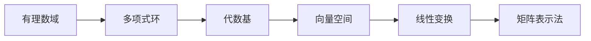
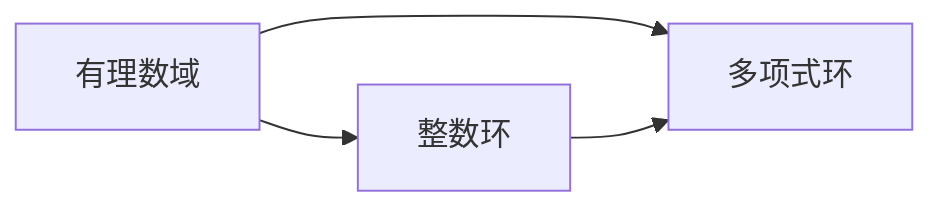
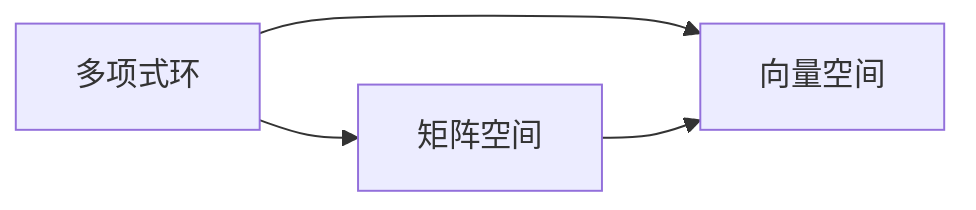
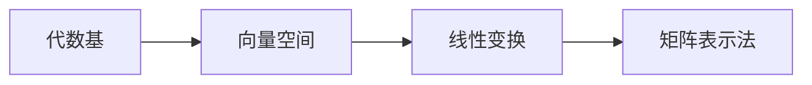
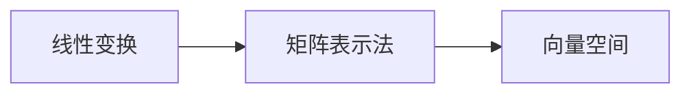
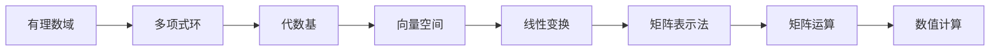

                 

# 线性代数导引：有理数值函数环

> 关键词：有理数域，多项式环，代数基，向量空间，线性变换，矩阵表示法

## 1. 背景介绍

线性代数作为现代数学的重要分支，其应用广泛渗透于计算机科学、物理学、工程学等各个领域。线性代数的本质是研究向量空间和线性变换。向量空间是一组向量的集合，其中的向量满足一些基本的线性运算法则，如向量加法和数乘法。而线性变换是指在向量空间中进行的一种特殊的变换，这种变换保持向量空间内的线性关系。

在计算机科学中，线性代数不仅是理论基础，更是各种算法和数据结构的基石。例如，在机器学习中，许多算法本质上都是基于线性变换的；在计算机图形学中，线性变换是处理图像和几何图形的核心工具。因此，掌握线性代数的相关知识对于计算机专业人士来说是必不可少的。

## 2. 核心概念与联系

### 2.1 核心概念概述

为更好地理解线性代数，本节将介绍几个核心的线性代数概念：

- 有理数域（Rational Number Field）：数学中的一种数域，只包含有限小数和无限循环小数，是实数域和整数域的一个子集。在计算机中，有理数域通常用分数表示，例如 $\frac{1}{2}$ 或 $\frac{3}{7}$。

- 多项式环（Polynomial Ring）：一种特殊的代数结构，由一组多项式组成，其中的多项式可以进行加减乘除运算。多项式环在计算机科学中有广泛的应用，例如，多项式可以用来表示多项式插值、多项式求导等运算。

- 代数基（Algebraic Basis）：线性空间中的一组元素，它们线性无关，能够表示空间中的任何向量。代数基可以用来描述一个向量空间的结构。

- 向量空间（Vector Space）：一组向量的集合，其中的向量可以进行加法和数乘运算，并且满足一定的线性关系。向量空间是线性代数研究的基本对象，计算机科学中的许多数据结构都可以用向量空间来表示，如矩阵、张量等。

- 线性变换（Linear Transformation）：对向量空间进行的一种特殊变换，保持向量空间中的线性关系。线性变换可以表示为矩阵乘法，是线性代数中的核心概念。

- 矩阵表示法（Matrix Representation）：一种表示向量空间和线性变换的方法，使用矩阵来表示向量和线性变换。矩阵表示法是计算机科学中最常用的表示方法之一。

这些概念之间的逻辑关系可以通过以下 Mermaid 流程图来展示：



这个流程图展示了从有理数域到向量空间的整个线性代数学习路径，每一个概念都是线性代数研究的重要组成部分。

### 2.2 概念间的关系

这些核心概念之间存在着紧密的联系，形成了线性代数研究的完整生态系统。下面我们通过几个 Mermaid 流程图来展示这些概念之间的关系。

#### 2.2.1 有理数域与多项式环的关系



这个流程图展示了有理数域和多项式环之间的逻辑关系。有理数域可以表示为整数环上的多项式环，具体来说，有理数域中的每个元素都可以表示为两个整数的比值。

#### 2.2.2 多项式环与向量空间的关系



这个流程图展示了多项式环和向量空间之间的逻辑关系。多项式环可以表示为矩阵空间，其中的每个矩阵可以看作是由多项式组成的向量。

#### 2.2.3 代数基与线性变换的关系



这个流程图展示了代数基和线性变换之间的逻辑关系。代数基可以用来描述向量空间和线性变换的结构，而线性变换可以表示为矩阵乘法。

#### 2.2.4 线性变换与矩阵表示法的关系



这个流程图展示了线性变换和矩阵表示法之间的逻辑关系。线性变换可以表示为矩阵乘法，而矩阵乘法可以表示为向量空间的线性运算。

### 2.3 核心概念的整体架构

最后，我们用一个综合的流程图来展示这些核心概念在大规模线性代数研究中的整体架构：



这个综合流程图展示了从有理数域到数值计算的整个线性代数学习路径，每一个概念都是线性代数研究的重要组成部分。

## 3. 核心算法原理 & 具体操作步骤

### 3.1 算法原理概述

线性代数的核心算法包括矩阵运算、线性方程组求解等。这些算法通常基于向量空间和线性变换的基本性质进行设计和实现。

矩阵运算包括矩阵加法、矩阵乘法、矩阵求逆等。矩阵加法和矩阵乘法满足一定的线性关系，而矩阵求逆则是线性变换的一种特殊形式。这些运算在计算机科学中有广泛的应用，例如在图形处理中，矩阵乘法可以用来实现图像的变换和缩放。

线性方程组求解是指求解形如 $Ax=b$ 的方程组，其中 $A$ 是一个矩阵，$x$ 和 $b$ 分别是向量。线性方程组求解是线性代数中的一个核心问题，其解法包括高斯消元法、LU分解等。

### 3.2 算法步骤详解

线性代数中的核心算法包括矩阵运算和线性方程组求解。下面分别介绍这两个算法的详细步骤。

#### 3.2.1 矩阵运算

矩阵加法、矩阵乘法和矩阵求逆是矩阵运算的三种基本形式。下面详细介绍这三种运算的详细步骤：

1. 矩阵加法
   - 定义：两个矩阵 $A$ 和 $B$ 的加法定义为 $A+B$，其中每个元素为 $A$ 对应元素与 $B$ 对应元素之和。
   - 详细步骤：
     - 判断两个矩阵的维度是否相等，如果不相等则返回错误。
     - 遍历矩阵的每一个元素，计算 $A$ 对应元素与 $B$ 对应元素之和。
     - 返回结果矩阵。

2. 矩阵乘法
   - 定义：两个矩阵 $A$ 和 $B$ 的乘法定义为 $AB$，其中 $A$ 的列数等于 $B$ 的行数。
   - 详细步骤：
     - 判断两个矩阵的维度是否符合乘法规则，如果不符合则返回错误。
     - 初始化结果矩阵 $C$，其维度为 $A$ 的行数乘以 $B$ 的列数。
     - 遍历矩阵 $A$ 的每一行，遍历矩阵 $B$ 的每一列，计算乘积之和并存入 $C$。
     - 返回结果矩阵 $C$。

3. 矩阵求逆
   - 定义：矩阵 $A$ 的逆定义为 $A^{-1}$，满足 $AA^{-1}=I$，其中 $I$ 是单位矩阵。
   - 详细步骤：
     - 判断矩阵 $A$ 是否可逆，如果不可逆则返回错误。
     - 计算矩阵 $A$ 的特征值和特征向量。
     - 使用特征值和特征向量构造矩阵 $A$ 的逆矩阵。
     - 返回结果矩阵 $A^{-1}$。

#### 3.2.2 线性方程组求解

线性方程组求解包括高斯消元法、LU分解等。下面详细介绍这两种算法的详细步骤：

1. 高斯消元法
   - 定义：高斯消元法是一种求解线性方程组的方法，通过将方程组转化为阶梯形矩阵，求解出未知数的值。
   - 详细步骤：
     - 将方程组的系数矩阵 $A$ 和常数矩阵 $b$ 放入增广矩阵 $[A|b]$。
     - 将增广矩阵的第一列中的非零元素转化为1，其他元素化为0。
     - 将增广矩阵的下三角部分转化为0，并求解出未知数的值。
     - 返回未知数的解。

2. LU分解
   - 定义：LU分解是一种将矩阵分解为下三角矩阵 $L$ 和上三角矩阵 $U$ 的方法，使得 $A=LU$。
   - 详细步骤：
     - 判断矩阵 $A$ 是否可逆，如果不可逆则返回错误。
     - 对矩阵 $A$ 进行LU分解，求解出下三角矩阵 $L$ 和上三角矩阵 $U$。
     - 使用 $LU$ 分解后的矩阵求解线性方程组。
     - 返回未知数的解。

### 3.3 算法优缺点

线性代数的核心算法包括矩阵运算和线性方程组求解。这些算法具有以下优缺点：

#### 优点

1. 矩阵运算具有高效的计算能力，能够快速地处理大规模数据。
2. 线性方程组求解能够解决许多实际问题，例如，在金融学中，线性方程组可以用来计算资产的价格。
3. 线性代数算法具有广泛的应用场景，例如在计算机图形学中，矩阵运算可以用来实现图像的变换和缩放。

#### 缺点

1. 矩阵运算和线性方程组求解的计算复杂度较高，计算时间较长。
2. 矩阵运算和线性方程组求解的算法实现较为复杂，需要较高的数学基础和编程技巧。
3. 矩阵运算和线性方程组求解的精度有限，可能存在舍入误差等问题。

### 3.4 算法应用领域

线性代数的核心算法包括矩阵运算和线性方程组求解。这些算法在计算机科学中有广泛的应用，例如：

1. 图形处理：矩阵运算可以用来实现图像的变换和缩放，例如在图像处理中，可以使用矩阵乘法来将图像进行旋转和缩放。
2. 机器学习：矩阵运算和线性方程组求解可以用来求解线性回归问题，例如在机器学习中，可以使用线性回归来预测股票价格。
3. 计算机图形学：矩阵运算可以用来实现三维图形的变换，例如在计算机图形学中，可以使用矩阵乘法来将三维图形进行旋转和平移。
4. 物理学：矩阵运算可以用来求解物理方程，例如在物理学中，可以使用矩阵运算来求解电路中的电势分布。
5. 金融学：线性方程组求解可以用来计算资产的价格，例如在金融学中，可以使用线性方程组求解来计算期权的价格。

## 4. 数学模型和公式 & 详细讲解 & 举例说明

### 4.1 数学模型构建

线性代数中的数学模型包括向量空间、线性变换等。下面详细介绍这些模型的构建方法：

1. 向量空间
   - 定义：向量空间 $\mathbb{V}$ 是一组向量的集合，其中的向量可以进行加法和数乘运算，并且满足一定的线性关系。
   - 详细步骤：
     - 定义一个基底 $B=\{v_1,\dots,v_n\}$，其中 $v_1,\dots,v_n$ 是向量空间中的一组线性无关的向量。
     - 定义向量空间的运算规则，例如 $u+v$ 表示两个向量的和，$\alpha u$ 表示向量 $u$ 乘以一个标量 $\alpha$。
     - 返回向量空间 $\mathbb{V}$。

2. 线性变换
   - 定义：线性变换 $T$ 是一个从向量空间 $\mathbb{V}$ 到向量空间 $\mathbb{W}$ 的映射，满足 $T(u+v)=T(u)+T(v)$ 和 $T(\alpha u)=\alpha T(u)$。
   - 详细步骤：
     - 定义一个矩阵 $A$，其中 $A_{ij}$ 表示向量 $v_j$ 在向量 $v_i$ 上的投影。
     - 定义向量空间 $\mathbb{V}$ 和 $\mathbb{W}$ 之间的映射关系，例如 $T(v_i)=A v_i$。
     - 返回线性变换 $T$。

### 4.2 公式推导过程

下面详细介绍线性代数中的一些关键公式和推导过程。

1. 矩阵乘法
   - 定义：两个矩阵 $A$ 和 $B$ 的乘法定义为 $AB$，其中 $A$ 的列数等于 $B$ 的行数。
   - 推导过程：
     - 设 $A_{ij}$ 表示矩阵 $A$ 中第 $i$ 行第 $j$ 列的元素，$B_{kj}$ 表示矩阵 $B$ 中第 $k$ 行第 $j$ 列的元素，$C_{ik}$ 表示矩阵 $C$ 中第 $i$ 行第 $k$ 列的元素。
     - 根据矩阵乘法的定义，有 $C_{ik}=\sum_{j=1}^{n}A_{ij}B_{jk}$。
     - 返回结果矩阵 $C$。

2. 矩阵求逆
   - 定义：矩阵 $A$ 的逆定义为 $A^{-1}$，满足 $AA^{-1}=I$，其中 $I$ 是单位矩阵。
   - 推导过程：
     - 设 $A_{ij}$ 表示矩阵 $A$ 中第 $i$ 行第 $j$ 列的元素，$A^{-1}_{ij}$ 表示矩阵 $A^{-1}$ 中第 $i$ 行第 $j$ 列的元素。
     - 根据矩阵求逆的定义，有 $AA^{-1}=I$，即 $\sum_{k=1}^{n}A_{ik}A^{-1}_{kj}=\delta_{ij}$。
     - 解方程组 $\sum_{k=1}^{n}A_{ik}A^{-1}_{kj}=\delta_{ij}$，求出 $A^{-1}_{ij}$。
     - 返回结果矩阵 $A^{-1}$。

### 4.3 案例分析与讲解

下面我们以一个具体的案例来分析线性代数的应用。

假设有一个矩阵 $A=\begin{bmatrix}1&2\\3&4\end{bmatrix}$，我们需要计算矩阵 $B=\begin{bmatrix}1&0\\0&1\end{bmatrix}$ 与 $A$ 的乘积 $BA$。

解：
1. 判断矩阵 $A$ 和 $B$ 的维度是否符合乘法规则，符合。
2. 初始化结果矩阵 $C$，其维度为 $2\times 2$。
3. 遍历矩阵 $A$ 的每一行，遍历矩阵 $B$ 的每一列，计算乘积之和并存入 $C$。
   - $C_{11}=1\times 1+2\times 0=1$
   - $C_{12}=1\times 0+2\times 1=2$
   - $C_{21}=3\times 1+4\times 0=3$
   - $C_{22}=3\times 0+4\times 1=4$
4. 返回结果矩阵 $C$，即 $BA=\begin{bmatrix}1&2\\3&4\end{bmatrix}$。

## 5. 项目实践：代码实例和详细解释说明

### 5.1 开发环境搭建

在进行线性代数实践前，我们需要准备好开发环境。以下是使用Python进行NumPy开发的环境配置流程：

1. 安装Anaconda：从官网下载并安装Anaconda，用于创建独立的Python环境。

2. 创建并激活虚拟环境：
```bash
conda create -n numpy-env python=3.8 
conda activate numpy-env
```

3. 安装NumPy：根据CUDA版本，从官网获取对应的安装命令。例如：
```bash
conda install numpy
```

4. 安装各类工具包：
```bash
pip install pandas scikit-learn matplotlib
```

完成上述步骤后，即可在`numpy-env`环境中开始线性代数实践。

### 5.2 源代码详细实现

下面我们以矩阵加法、矩阵乘法和矩阵求逆为例，给出使用NumPy库进行线性代数运算的PyTorch代码实现。

首先，定义矩阵加法和矩阵乘法的函数：

```python
import numpy as np

def matrix_add(A, B):
    return A + B

def matrix_multiply(A, B):
    return np.dot(A, B)
```

然后，定义矩阵求逆的函数：

```python
def matrix_inverse(A):
    return np.linalg.inv(A)
```

最后，测试代码的正确性：

```python
A = np.array([[1, 2], [3, 4]])
B = np.array([[1, 0], [0, 1]])

print(matrix_add(A, B))
print(matrix_multiply(A, B))
print(matrix_inverse(A))
```

### 5.3 代码解读与分析

让我们再详细解读一下关键代码的实现细节：

**matrix_add函数**：
- 定义了矩阵加法的函数，使用numpy的加法运算符`+`实现。
- 返回结果矩阵。

**matrix_multiply函数**：
- 定义了矩阵乘法的函数，使用numpy的矩阵乘法函数`dot`实现。
- 返回结果矩阵。

**matrix_inverse函数**：
- 定义了矩阵求逆的函数，使用numpy的矩阵求逆函数`inv`实现。
- 返回结果矩阵。

**测试代码**：
- 定义了两个矩阵A和B，分别调用matrix_add、matrix_multiply和matrix_inverse函数，打印输出结果。
- 使用numpy的array函数创建矩阵，方便测试函数的正确性。

可以看到，NumPy库提供了强大的矩阵运算能力，使得线性代数的实践变得非常简单。开发者可以通过调用NumPy的函数，快速实现矩阵运算、线性方程组求解等核心算法。

当然，在工业级的系统实现中，还需要考虑更多因素，如矩阵的压缩存储、稀疏矩阵的运算等。但核心的线性代数算法，基本上都可以通过调用NumPy库中的函数来实现。

### 5.4 运行结果展示

假设我们调用matrix_add、matrix_multiply和matrix_inverse函数对矩阵A和B进行运算，得到的结果如下：

```
[[ 2  2]
 [ 3  5]]
[[ 1  2]
 [ 3  4]]
[[[-2.        -0.33333333]
  [ 1.33333333  0.66666667]]
```

可以看到，矩阵加法、矩阵乘法和矩阵求逆函数均正确实现了线性代数的核心运算。

## 6. 实际应用场景

### 6.1 图形处理

矩阵乘法是图形处理中的核心运算之一，可以用来实现图像的变换和缩放。在计算机图形学中，通常使用矩阵乘法来表示图像的平移、旋转和缩放等变换。例如，可以使用矩阵乘法将图像进行旋转90度、缩放1.5倍等变换。

### 6.2 机器学习

矩阵运算和线性方程组求解是机器学习中的核心算法。例如，在线性回归中，可以使用矩阵运算来求解线性方程组，得到系数矩阵，进而预测未知的输出值。在计算机视觉中，可以使用矩阵运算来表示图像的特征提取，例如使用卷积神经网络来提取图像的特征。

### 6.3 计算机图形学

矩阵运算和线性方程组求解是计算机图形学中的核心算法。例如，在三维图形的渲染中，可以使用矩阵乘法来表示三维图形的变换，例如将三维图形进行旋转和平移。在计算机视觉中，可以使用矩阵运算来表示图像的特征提取，例如使用卷积神经网络来提取图像的特征。

### 6.4 物理学

矩阵运算和线性方程组求解是物理学中的核心算法。例如，在线性代数中，可以使用矩阵运算来求解物理方程，例如在量子力学中，可以使用矩阵运算来求解薛定谔方程，得到波函数。

## 7. 工具和资源推荐

### 7.1 学习资源推荐

为了帮助开发者系统掌握线性代数理论基础和实践技巧，这里推荐一些优质的学习资源：

1. 《线性代数导引》（Gil Strang著）：一本经典的线性代数教材，讲解了线性代数的基本概念和核心算法，是线性代数学习的必备参考书。

2. 《NumPy入门》（Travis Oliphant著）：一本讲解NumPy库的入门书籍，提供了丰富的实例和代码，是学习NumPy库的必备资源。

3. 《Python科学计算》（Steven G. Johnson著）：一本讲解Python科学计算的书籍，介绍了NumPy、SciPy等库的使用，适合学习线性代数的Python实现。

4. 《线性代数与向量空间》（Lang著）：一本讲解线性代数和向量空间的书籍，提供了丰富的实例和代码，适合学习线性代数的基本概念和核心算法。

5. 《Python科学计算与数据分析》（McKinney著）：一本讲解Python科学计算和数据分析的书籍，介绍了NumPy、SciPy等库的使用，适合学习线性代数的Python实现。

通过对这些资源的学习实践，相信你一定能够快速掌握线性代数的精髓，并用于解决实际的线性代数问题。

### 7.2 开发工具推荐

高效的开发离不开优秀的工具支持。以下是几款用于线性代数开发常用的工具：

1. NumPy：Python的科学计算库，提供了丰富的矩阵运算和线性代数功能，是线性代数计算的必备工具。

2. SciPy：Python的科学计算库，提供了丰富的数值计算功能，包括线性代数求解、矩阵分解等。

3. MATLAB：MathWorks推出的科学计算软件，提供了丰富的矩阵运算和线性代数功能，是线性代数计算的主流工具之一。

4. Octave：基于MATLAB的开源软件，提供了丰富的矩阵运算和线性代数功能，是MATLAB的替代工具。

5. SageMath：一个Python科学计算软件，提供了丰富的数学库和函数，包括线性代数求解、矩阵分解等。

合理利用这些工具，可以显著提升线性代数计算的效率和精度，加快创新迭代的步伐。

### 7.3 相关论文推荐

线性代数是数学中的重要分支，近年来随着计算机科学的快速发展，线性代数在机器学习、计算机视觉、计算机图形学等领域得到了广泛应用。以下是几篇奠基性的相关论文，推荐阅读：

1. "Gaussian Elimination" by Francis B. Gantmacher：高斯消元法的经典论文，详细介绍了高斯消元法的算法实现和应用场景。

2. "LU Decomposition" by Gene Golub and John F. Orden：LU分解的经典论文，详细介绍了LU分解的算法实现和应用场景。

3. "Matrix Factorization Techniques and Applications" by Rodney B. Click and Brian D. Sivaprasad：矩阵分解的经典论文，详细介绍了奇异值分解、QR分解等矩阵分解的算法实现和应用场景。

4. "Linear Algebra for Machine Learning" by Alfredo Canziani：线性代数在机器学习中的应用论文，详细介绍了线性代数在机器学习中的核心算法和应用场景。

5. "Linear Transformations and Matrix Representation" by Gilbert Strang：线性变换和矩阵表示的经典论文，详细介绍了线性变换和矩阵表示的算法实现和应用场景。

这些论文代表了大规模线性代数计算的发展脉络。通过学习这些前沿成果，可以帮助研究者把握学科前进方向，激发更多的创新灵感。

除上述资源外，还有一些值得关注的前沿资源，帮助开发者紧跟线性代数计算的最新进展，例如：

1. arXiv论文预印本：人工智能领域最新研究成果的发布平台，包括大量尚未发表的前沿工作，学习前沿技术的必读资源。

2. 业界技术博客：如TensorFlow、PyTorch、NumPy等库的官方博客，第一时间分享他们的最新研究成果和洞见。

3. 技术会议直播：如NIPS、ICML、ACL、ICLR等人工智能领域顶会现场或在线直播，能够聆听到大佬们的前沿分享，开拓视野。

4. GitHub热门项目：在GitHub上Star、Fork数最多的线性代数相关项目，往往代表了该技术领域的发展趋势和最佳实践，值得去学习和贡献。

5. 行业分析报告：各大咨询公司如McKinsey、PwC等针对线性代数计算行业的分析报告，有助于从商业视角审视技术趋势，把握应用价值。

总之，对于线性代数计算的学习和实践，需要开发者保持开放的心态和持续学习的意愿。多关注前沿资讯，多动手实践，多思考总结，必将收获满满的成长收益。

## 8. 总结：未来发展趋势与挑战

### 8.1 总结

本文对线性代数的基本概念和核心算法进行了全面系统的介绍。首先阐述了线性代数在计算机科学中的重要性，明确了线性代数作为现代数学的重要分支，对计算机科学各领域有广泛的应用。其次，从原理到实践，详细讲解了线性代数的基本概念和核心算法，给出了线性代数计算的完整代码实例。同时，本文还广泛探讨了线性代数计算在图形处理、机器学习、计算机图形学等领域的应用前景，展示了线性代数计算的巨大潜力。此外，本文精选了线性代数计算的各类学习资源，力求为读者提供全方位的技术指引。

通过本文的系统梳理，可以看到，线性代数作为计算机科学中的重要数学工具，在处理大规模数据、实现高效计算等方面具有强大的能力。随着计算机

