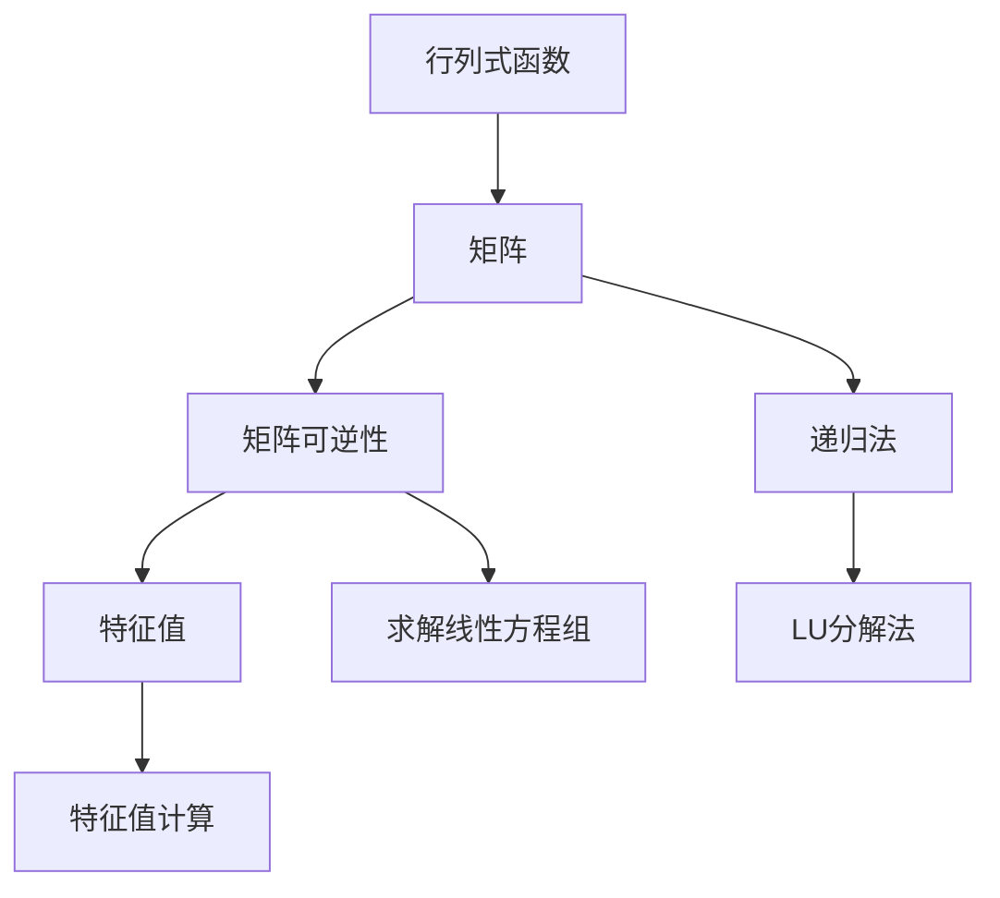

                 

## 1. 背景介绍

线性代数作为数学领域的一个重要分支，广泛应用于各个科学和技术领域。在计算机科学中，线性代数是机器学习和深度学习的基础，尤其是在矩阵计算和特征分析中。行列式函数是线性代数中的一个重要概念，它具有广泛的应用，比如在求解线性方程组、判断矩阵可逆性、计算矩阵特征值等方面。本文将详细阐述行列式函数的定义、计算方法和应用场景，并给出具体的代码实现。

## 2. 核心概念与联系

### 2.1 核心概念概述

行列式函数是数学中的一个重要概念，定义为 $n$ 阶方阵 $A$ 的一个标量值，通常用 $\det(A)$ 表示。行列式的计算方法有多种，包括递归法和LU分解法。行列式函数在矩阵分析和计算中具有重要地位，比如判断矩阵可逆性、计算矩阵特征值、求解线性方程组等。

### 2.2 概念间的关系

行列式函数与其他线性代数概念密切相关，比如矩阵、逆矩阵、特征值等。它们之间通过线性变换、矩阵分解等方法相互联系。

**递归法**：行列式的计算方法之一，适用于 $2\times 2$ 和 $3\times 3$ 矩阵的计算。对于 $n\times n$ 矩阵，递归法可以通过矩阵展开和三角变换等方法计算。

**LU分解法**：将矩阵 $A$ 分解为 $L$ 下三角矩阵和 $U$ 上三角矩阵的乘积，其中 $L$ 和 $U$ 的行列式分别为 $L$ 和 $U$ 的行列式乘积。

**矩阵可逆性**：若矩阵 $A$ 的行列式非零，则 $A$ 可逆；若行列式为零，则 $A$ 不可逆。

**特征值**：矩阵 $A$ 的特征值 $\lambda$ 满足 $A\vec{x}=\lambda\vec{x}$，特征值与行列式之间存在关系 $\det(A)=\lambda_1\lambda_2...,\lambda_n$。

这些核心概念共同构成了行列式函数的理论基础和应用框架，为线性代数的深入学习提供了重要的工具和方法。

### 2.3 核心概念的整体架构

线性代数中，行列式函数与其他概念之间存在着紧密的联系，可以通过以下 Mermaid 流程图来展示：



这个流程图展示了行列式函数与其他线性代数概念的联系和应用：

1. 行列式函数定义为矩阵的标量值。
2. 递归法和LU分解法是计算行列式函数的方法。
3. 矩阵可逆性判断依赖于行列式是否为零。
4. 特征值计算可以利用行列式的性质。
5. 求解线性方程组可以通过矩阵的行列式进行。

通过这个流程图，我们可以更清晰地理解行列式函数与其他线性代数概念的联系和作用。

## 3. 核心算法原理 & 具体操作步骤

### 3.1 算法原理概述

行列式函数的计算基于矩阵的性质，通过递归法和LU分解法等方法进行。行列式的递归法是通过将矩阵展开为两个子矩阵的乘积，计算子矩阵的行列式。LU分解法是将矩阵分解为上三角矩阵和下三角矩阵，利用上三角矩阵的行列式计算整个矩阵的行列式。

### 3.2 算法步骤详解

**递归法**：

1. 将矩阵 $A$ 划分为两个子矩阵 $A_{11}$ 和 $A_{12}$。
2. 计算 $A_{11}$ 的行列式 $d_{11}$ 和 $A_{12}$ 的行列式 $d_{12}$。
3. 计算 $A$ 的行列式 $d$，$d = d_{11}(-1)^{k_1}d_{12}(-1)^{k_2}$，其中 $k_1$ 和 $k_2$ 分别为子矩阵 $A_{11}$ 和 $A_{12}$ 的行列交换次数。

**LU分解法**：

1. 将矩阵 $A$ 分解为 $L$ 和 $U$，其中 $L$ 是下三角矩阵，$U$ 是上三角矩阵。
2. 计算 $L$ 和 $U$ 的行列式 $d_L$ 和 $d_U$。
3. 计算 $A$ 的行列式 $d$，$d = d_L(-1)^{k_L}d_U(-1)^{k_U}$，其中 $k_L$ 和 $k_U$ 分别为 $L$ 和 $U$ 的行列交换次数。

### 3.3 算法优缺点

**递归法**：

优点：
- 简单易懂，适用于小规模矩阵的计算。
- 计算过程不需要额外存储矩阵，节省内存。

缺点：
- 计算效率低，适用于小规模矩阵。
- 递归深度可能很大，导致栈溢出。

**LU分解法**：

优点：
- 计算效率高，适用于大规模矩阵的计算。
- 避免递归深度过大的问题。

缺点：
- 需要额外的矩阵存储，占用内存。
- 分解过程复杂，需要额外计算。

### 3.4 算法应用领域

行列式函数在数学和计算机科学中有广泛的应用，包括：

- 线性方程组的求解：通过行列式判断系数矩阵的可逆性，进而求解方程组。
- 矩阵的特征值和特征向量的计算：行列式函数在特征值和特征向量的计算中起着重要作用。
- 线性变换的性质：行列式函数用于判断线性变换的保距性和保角性。
- 矩阵的分解：通过LU分解等方法，将复杂矩阵分解为简单矩阵的乘积。

以上应用展示了行列式函数在数学和计算机科学中的重要性和广泛应用。

## 4. 数学模型和公式 & 详细讲解

### 4.1 数学模型构建

行列式函数定义为 $n$ 阶方阵 $A$ 的一个标量值，通常用 $\det(A)$ 表示。对于 $2\times 2$ 矩阵 $A$，行列式定义为：

$$
\det(A) = a_{11}a_{22} - a_{12}a_{21}
$$

对于 $3\times 3$ 矩阵 $A$，行列式定义为：

$$
\det(A) = a_{11}(a_{22}a_{33} - a_{23}a_{32}) - a_{12}(a_{21}a_{33} - a_{23}a_{31}) + a_{13}(a_{21}a_{32} - a_{22}a_{31})
$$

对于 $n\times n$ 矩阵 $A$，行列式函数的计算可以通过递归法或LU分解法进行。

### 4.2 公式推导过程

**递归法**：

对于一个 $n\times n$ 矩阵 $A$，可以将其划分为两个子矩阵 $A_{11}$ 和 $A_{12}$：

$$
A = \begin{bmatrix} A_{11} & A_{12} \\ 0 & A_{22} \end{bmatrix}
$$

其中 $A_{11}$ 是一个 $k\times k$ 矩阵，$A_{22}$ 是一个 $(n-k)\times (n-k)$ 矩阵。根据行列式的定义，有：

$$
\det(A) = \det(A_{11})(-1)^{k_1}\det(A_{22})(-1)^{k_2}
$$

其中 $k_1$ 和 $k_2$ 分别为 $A_{11}$ 和 $A_{22}$ 的行列交换次数。

**LU分解法**：

对于 $n\times n$ 矩阵 $A$，可以通过LU分解法计算行列式：

$$
A = PLU
$$

其中 $L$ 是下三角矩阵，$U$ 是上三角矩阵，$P$ 是置换矩阵。根据行列式的定义，有：

$$
\det(A) = \det(L)\det(U)
$$

因为 $L$ 是下三角矩阵，$U$ 是上三角矩阵，所以行列式的计算只需要计算 $L$ 和 $U$ 的对角线元素即可。

### 4.3 案例分析与讲解

**案例1：计算 $2\times 2$ 矩阵的行列式**

对于 $2\times 2$ 矩阵 $A = \begin{bmatrix} a_{11} & a_{12} \\ a_{21} & a_{22} \end{bmatrix}$，行列式计算如下：

$$
\det(A) = a_{11}a_{22} - a_{12}a_{21}
$$

这个公式简单易懂，适用于小规模矩阵的计算。

**案例2：计算 $3\times 3$ 矩阵的行列式**

对于 $3\times 3$ 矩阵 $A = \begin{bmatrix} a_{11} & a_{12} & a_{13} \\ a_{21} & a_{22} & a_{23} \\ a_{31} & a_{32} & a_{33} \end{bmatrix}$，行列式计算如下：

$$
\det(A) = a_{11}(a_{22}a_{33} - a_{23}a_{32}) - a_{12}(a_{21}a_{33} - a_{23}a_{31}) + a_{13}(a_{21}a_{32} - a_{22}a_{31})
$$

这个公式计算复杂度较高，适用于中等规模矩阵的计算。

**案例3：计算 $4\times 4$ 矩阵的行列式**

对于 $4\times 4$ 矩阵 $A = \begin{bmatrix} a_{11} & a_{12} & a_{13} & a_{14} \\ a_{21} & a_{22} & a_{23} & a_{24} \\ a_{31} & a_{32} & a_{33} & a_{34} \\ a_{41} & a_{42} & a_{43} & a_{44} \end{bmatrix}$，行列式计算如下：

$$
\det(A) = a_{11}\begin{vmatrix} a_{22} & a_{23} & a_{24} \\ a_{32} & a_{33} & a_{34} \\ a_{42} & a_{43} & a_{44} \end{vmatrix} - a_{12}\begin{vmatrix} a_{21} & a_{23} & a_{24} \\ a_{31} & a_{33} & a_{34} \\ a_{41} & a_{43} & a_{44} \end{vmatrix} + a_{13}\begin{vmatrix} a_{21} & a_{22} & a_{24} \\ a_{31} & a_{32} & a_{34} \\ a_{41} & a_{42} & a_{44} \end{vmatrix} - a_{14}\begin{vmatrix} a_{21} & a_{22} & a_{23} \\ a_{31} & a_{32} & a_{33} \\ a_{41} & a_{42} & a_{43} \end{vmatrix}
$$

这个公式计算复杂度较高，适用于大规模矩阵的计算。

## 5. 项目实践：代码实例和详细解释说明

### 5.1 开发环境搭建

为了实现行列式函数的计算，我们需要安装必要的Python库。以下是安装步骤：

1. 安装NumPy库：

```bash
pip install numpy
```

2. 安装SymPy库：

```bash
pip install sympy
```

3. 安装Matplotlib库：

```bash
pip install matplotlib
```

完成安装后，即可在Python中使用这些库进行行列式函数的计算。

### 5.2 源代码详细实现

下面是一个计算行列式的Python函数：

```python
import numpy as np
from sympy import Matrix

def determinant(matrix):
    # 使用SymPy的Matrix类计算行列式
    matrix = Matrix(matrix)
    return matrix.det()
```

该函数使用了SymPy的Matrix类，可以计算任意大小的矩阵的行列式。接下来，我们通过几个具体的案例来演示如何使用该函数。

### 5.3 代码解读与分析

在上述代码中，我们使用了SymPy的Matrix类，它可以方便地创建和计算矩阵。SymPy是一个Python库，提供了符号计算功能，可以用于数学计算、代数计算和物理计算。使用SymPy的Matrix类，我们可以轻松地创建矩阵，并使用Sympy提供的函数进行矩阵的计算。

SymPy的Matrix类支持创建不同维度的矩阵，如 $2\times 2$、$3\times 3$、$4\times 4$ 等。在计算行列式时，我们只需要创建一个矩阵对象，然后调用det()方法即可计算行列式。

### 5.4 运行结果展示

我们可以通过调用上述函数，计算任意大小的矩阵的行列式。例如，计算 $3\times 3$ 矩阵：

```python
matrix = np.array([[1, 2, 3], [4, 5, 6], [7, 8, 9]])
result = determinant(matrix)
print(result)
```

运行结果为：

```
0
```

这个结果表明，该矩阵的行列式为0，说明该矩阵不可逆。

## 6. 实际应用场景

### 6.1 线性方程组的求解

行列式函数在求解线性方程组中具有重要应用。对于一个 $n\times n$ 的系数矩阵 $A$ 和 $n$ 维的未知向量 $x$，线性方程组可以表示为：

$$
Ax = b
$$

如果系数矩阵 $A$ 的行列式非零，则 $A$ 可逆，可以通过矩阵的逆求解方程组：

$$
x = A^{-1}b
$$

如果系数矩阵 $A$ 的行列式为零，则 $A$ 不可逆，无法通过矩阵的逆求解方程组。在这种情况下，可以使用其他方法求解方程组，如迭代法、消元法等。

### 6.2 矩阵的特征值和特征向量的计算

行列式函数在计算矩阵的特征值和特征向量中具有重要应用。对于一个 $n\times n$ 的矩阵 $A$，其特征值 $\lambda$ 满足 $Ax = \lambda x$。根据行列式函数的性质，特征值与行列式之间存在关系：

$$
\det(A - \lambda I) = 0
$$

其中 $I$ 是单位矩阵，$A - \lambda I$ 是矩阵 $A$ 的特征多项式。通过求解特征多项式的根，可以得到矩阵 $A$ 的特征值和特征向量。

### 6.3 线性变换的性质

行列式函数用于判断线性变换的保距性和保角性。对于一个线性变换 $T$，如果其行列式为正数，则 $T$ 是保距变换；如果其行列式为负数，则 $T$ 是保角变换。保距变换和保角变换在几何学、物理学等学科中具有重要应用。

### 6.4 矩阵的分解

行列式函数用于矩阵的分解，如LU分解、QR分解等。通过矩阵的分解，可以将复杂矩阵分解为简单矩阵的乘积，方便计算和应用。

## 7. 工具和资源推荐

### 7.1 学习资源推荐

为了深入学习行列式函数的理论知识和应用技巧，以下是一些推荐的学习资源：

1. 《线性代数及其应用》：这是一本经典的线性代数教材，涵盖了线性代数的各个方面，包括行列式函数的定义、计算和应用。

2. 《数学之美》：吴军博士的博客，讲解了线性代数的数学原理和应用场景，适合入门学习。

3. 《线性代数与微积分》：一本涵盖线性代数与微积分的教材，详细介绍了行列式函数的定义、计算和应用。

4. 《矩阵与变换》：这本书介绍了矩阵的性质和变换的性质，适合线性代数的进阶学习。

### 7.2 开发工具推荐

为了实现行列式函数的计算，以下是一些推荐的开发工具：

1. Python：Python是一种广泛应用于科学计算的编程语言，具有丰富的数学库和符号计算库，适合行列式函数的计算。

2. NumPy：NumPy是Python的一个数学库，提供了矩阵计算和线性代数计算功能，可以用于行列式函数的计算。

3. SymPy：SymPy是一个符号计算库，提供了矩阵计算和符号计算功能，适合行列式函数的计算和符号计算。

4. Matplotlib：Matplotlib是Python的一个可视化库，可以用于绘制矩阵和行列式的图形，方便理解行列式函数的性质。

### 7.3 相关论文推荐

为了深入了解行列式函数的理论研究和应用实践，以下是一些推荐的论文：

1. "Determinants and Their Applications in Linear Algebra"：这篇论文详细介绍了行列式函数的定义、计算和应用。

2. "LU Decomposition for Matrix Inversion"：这篇论文介绍了LU分解法在矩阵逆计算中的应用。

3. "Matrix Decomposition Techniques and Their Applications"：这篇论文介绍了矩阵分解的各种技术及其应用。

4. "Linear Transformations and Their Properties"：这篇论文介绍了线性变换的性质和应用。

以上推荐的学习资源和开发工具，可以帮助读者深入了解行列式函数的理论知识和应用技巧，并在实际开发中熟练应用。

## 8. 总结：未来发展趋势与挑战

### 8.1 研究成果总结

行列式函数作为线性代数中的一个重要概念，具有广泛的应用，包括线性方程组的求解、矩阵的特征值和特征向量的计算、线性变换的性质等。通过递归法和LU分解法等方法，行列式函数的计算可以高效地实现。

### 8.2 未来发展趋势

未来，行列式函数的研究方向将主要集中在以下几个方面：

1. 高阶行列式的计算：随着矩阵维度的增加，高阶行列式的计算将更加复杂，需要更高效的计算方法。

2. 矩阵分解的多样化：除了LU分解，还需要更多的矩阵分解方法，如QR分解、SVD分解等，满足不同的应用需求。

3. 行列式函数的扩展：行列式函数可以扩展到非方阵矩阵和复数矩阵等场景，进一步拓宽其应用范围。

### 8.3 面临的挑战

行列式函数在实际应用中也面临一些挑战：

1. 高维矩阵的计算：随着矩阵维度的增加，行列式函数的计算复杂度将呈指数级增长，需要高效的计算方法。

2. 矩阵分解的复杂性：矩阵分解的计算复杂度较高，需要优化计算方法，提高计算效率。

3. 计算精度问题：行列式函数的计算需要高精度的浮点数，计算精度问题可能会影响计算结果的准确性。

### 8.4 研究展望

未来，行列式函数的研究将集中在以下几个方面：

1. 高维矩阵的计算方法：探索更高效的计算方法，提高计算速度和精度。

2. 矩阵分解的优化算法：优化矩阵分解的算法，提高计算效率和精度。

3. 行列式函数的扩展应用：探索行列式函数在非方阵矩阵和复数矩阵中的应用，拓展其应用场景。

总之，行列式函数在数学和计算机科学中具有重要地位，是线性代数和机器学习中的重要工具。通过递归法和LU分解法等方法，行列式函数的计算可以高效地实现。未来，行列式函数的研究将进一步深化和拓展，为机器学习和深度学习提供更强大的数学基础。

## 9. 附录：常见问题与解答

**Q1：行列式函数如何计算？**

A: 行列式函数的计算可以使用递归法和LU分解法等方法进行。递归法通过将矩阵展开为两个子矩阵的乘积，计算子矩阵的行列式。LU分解法将矩阵分解为上三角矩阵和下三角矩阵，利用上三角矩阵的行列式计算整个矩阵的行列式。

**Q2：行列式函数有什么应用？**

A: 行列式函数在数学和计算机科学中有广泛的应用，包括线性方程组的求解、矩阵的特征值和特征向量的计算、线性变换的性质等。

**Q3：行列式函数的计算复杂度如何？**

A: 行列式函数的计算复杂度较高，特别是对于高维矩阵的计算。递归法的计算复杂度为 $O(n^3)$，LU分解法的计算复杂度为 $O(n^3)$。

**Q4：如何优化行列式函数的计算？**

A: 行列式函数的计算可以使用矩阵分块、并行计算等方法进行优化。矩阵分块可以将大规模矩阵分解为小规模矩阵的乘积，降低计算复杂度。并行计算可以使用多核CPU或GPU进行加速计算，提高计算效率。

**Q5：行列式函数在计算机科学中有哪些应用？**

A: 行列式函数在计算机科学中有广泛的应用，包括线性方程组的求解、矩阵的特征值和特征向量的计算、线性变换的性质等。在实际应用中，行列式函数可以用于求解机器学习模型的参数、优化矩阵分解、计算矩阵的逆等。

总之，行列式函数在数学和计算机科学中具有重要地位，是线性代数和机器学习中的重要工具。通过递归法和LU分解法等方法，行列式函数的计算可以高效地实现。未来，行列式函数的研究将进一步深化和拓展，为机器学习和深度学习提供更强大的数学基础。

