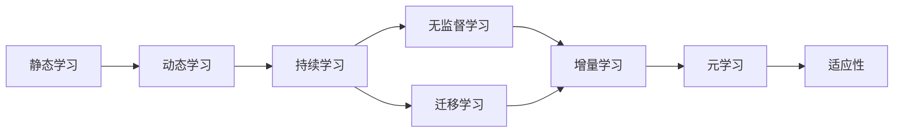
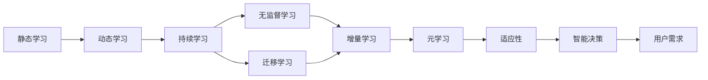

                 

# 终身学习Lifelong Learning原理与代码实例讲解

> 关键词：终身学习, Lifelong Learning, 持续学习, 无监督学习, 迁移学习, 学习算法, 代码实例

## 1. 背景介绍

### 1.1 问题由来

随着人工智能技术的迅速发展，机器学习已成为推动人类社会发展的重要驱动力。然而，传统机器学习模型通常采用静态数据集进行训练，一旦训练结束，模型即无法更新，难以应对复杂多变的现实世界。面对这一挑战，“终身学习(Lifelong Learning, LL)”理念应运而生，旨在使机器学习系统能够不断学习新知识，适应环境变化，持续提升性能。

终身学习作为一项重要的人工智能技术，其在许多领域展现出广泛的应用前景。例如，自动驾驶、智能客服、医疗诊断、金融预测等。通过不断学习和适应用户需求，这些系统可以提供更加个性化、精准的服务。此外，终身学习还为人类提供了持续学习、自我提升的新方式，帮助我们更好地应对日益复杂的学习和职业环境。

### 1.2 问题核心关键点

终身学习的研究涉及多个核心概念，包括学习算法、数据源、学习策略、适应性等。其核心目标是：

1. **学习算法**：能够从新数据中高效地提取有用信息，并将新知识与已有知识进行整合。
2. **数据源**：来源多样、形式各异，包括监督数据、无监督数据、半监督数据、动态数据等。
3. **学习策略**：如何组织和利用数据源，以最大化学习效率和效果。
4. **适应性**：系统如何根据环境变化动态调整学习策略和模型参数。

这些关键点共同构成终身学习的研究框架，指导模型不断适应新数据和新任务。

### 1.3 问题研究意义

终身学习的广泛应用和深入研究，对推动人工智能技术的进步具有重要意义：

1. **提升模型鲁棒性**：通过持续学习新知识，模型能更好地适应新环境，提高鲁棒性和泛化能力。
2. **降低成本**：无需重新训练模型，利用已有知识对新数据进行适应性调整，降低了数据标注和计算成本。
3. **促进创新**：持续学习使得系统能够不断更新，适应新需求，推动技术创新和应用拓展。
4. **满足用户需求**：通过个性化学习，终身学习系统能更好地满足用户个性化需求，提升用户体验。
5. **支持智能决策**：终身学习系统能够基于最新数据进行决策，支持动态、适应性强的智能决策过程。

## 2. 核心概念与联系

### 2.1 核心概念概述

终身学习研究涉及多个核心概念，这些概念通过复杂的交互和协作，形成终身学习系统的工作机制。

- **静态学习**：传统的机器学习范式，模型训练后固定不变。
- **动态学习**：学习过程随时间变化而动态调整，适应环境变化。
- **持续学习**：学习过程不断进行，不受特定时间限制。
- **无监督学习**：无需人工标注数据，通过模型自身发现数据结构。
- **迁移学习**：将已有知识迁移到新任务，加速新任务学习过程。
- **增量学习**：在已有模型的基础上不断添加新数据，更新模型参数。
- **元学习**：学习如何快速学习新任务，提高学习效率。
- **适应性**：模型根据环境变化调整参数，保持最佳性能。

这些核心概念之间的联系和交互，通过以下Mermaid流程图展示：



此流程图展示了从静态学习到动态学习，再到持续学习的过程，并强调了无监督学习和迁移学习在此过程中的重要作用。元学习与适应性相结合，进一步提升了模型的学习效率和适应能力。

### 2.2 概念间的关系

这些核心概念之间的联系和相互作用，构成了一个复杂的终身学习系统。下面通过几个Mermaid流程图展示这些概念之间的关系。

#### 2.2.1 终身学习的总体架构



此流程图展示了终身学习系统的总体架构，从静态学习开始，经过动态学习、持续学习、无监督学习、迁移学习、增量学习、元学习，最终通过适应性实现智能决策，以满足用户需求。

#### 2.2.2 无监督学习与增量学习的关系


此流程图展示了无监督学习和增量学习之间的交互关系。无监督学习提取新数据的潜在结构，增量学习在此基础上更新模型参数，实现新知识的整合和模型性能的提升。

#### 2.2.3 元学习与适应性的关系


此流程图展示了元学习和适应性之间的相互作用。元学习通过优化学习策略，提升模型性能，适应性则根据新数据动态调整模型参数，进一步提升模型性能。

### 2.3 核心概念的整体架构

最后，我们用一个综合的流程图来展示这些核心概念在大规模终身学习系统中的整体架构：


这个综合流程图展示了从大规模数据集到最终用户需求满足的整个终身学习流程，各概念在此过程中相互协作，共同推动系统的持续优化。

## 3. 核心算法原理 & 具体操作步骤
### 3.1 算法原理概述

终身学习的核心算法原理基于增量学习（Incremental Learning）和元学习（Meta-Learning）技术。增量学习允许模型在已有模型的基础上不断添加新数据，更新模型参数。元学习则通过学习如何快速学习新任务，提高学习效率。

增量学习算法通常基于在线学习（Online Learning）技术，在每次获取新数据时，通过更新模型参数来适应新数据。常用的增量学习算法包括在线梯度下降法（Online Gradient Descent, OGD）、随机梯度下降法（Stochastic Gradient Descent, SGD）等。

元学习算法则通过构建元模型（Meta-Model）来加速新任务的学习过程。常用的元学习算法包括强化学习（Reinforcement Learning, RL）、进化算法（Evolutionary Algorithm, EA）等。这些算法通过优化元模型参数，以最大化在不同任务上的性能。

### 3.2 算法步骤详解

以下是终身学习的核心算法步骤：

1. **数据预处理**：对原始数据进行清洗、标注、归一化等预处理，确保数据质量和一致性。
2. **增量学习**：在已有模型的基础上，使用增量学习算法更新模型参数，适应新数据。
3. **元学习**：通过元模型学习如何快速学习新任务，优化学习策略。
4. **模型更新**：根据元学习结果，调整模型参数，提升模型性能。
5. **持续学习**：在用户反馈和新数据的基础上，不断更新模型，实现持续学习。

### 3.3 算法优缺点

终身学习的优点包括：

1. **高效性**：通过增量学习，模型能够快速适应新数据，避免了从头训练的耗时和成本。
2. **适应性**：通过元学习，模型能够动态调整学习策略，适应不同任务和环境。
3. **持续性**：通过持续学习，模型能够不断更新，保持最佳性能。

但其缺点也较为明显：

1. **复杂性**：终身学习系统较为复杂，需要处理多种学习算法和数据源，实现难度较大。
2. **内存消耗**：增量学习需要在已有模型的基础上不断添加新数据，可能导致内存消耗增加。
3. **过拟合风险**：模型在适应新数据时，容易过度拟合，影响泛化性能。

### 3.4 算法应用领域

终身学习技术在多个领域中得到广泛应用，包括但不限于：

1. **自动驾驶**：在不断积累的交通数据上，自动驾驶模型能够持续学习和适应用户驾驶行为，提升行驶安全性和舒适性。
2. **智能客服**：通过分析用户互动数据，智能客服系统能够持续优化对话策略，提供更加个性化和准确的服务。
3. **医疗诊断**：在新增病例和医学文献中，医疗诊断模型能够持续学习新知识和经验，提高诊断准确性。
4. **金融预测**：基于不断更新的市场数据，金融预测模型能够持续调整预测模型，提升预测精度。
5. **教育推荐**：通过分析学生反馈和行为数据，教育推荐系统能够持续优化课程推荐，提升学习效果。

## 4. 数学模型和公式 & 详细讲解 & 举例说明

### 4.1 数学模型构建

终身学习的数学模型通常基于在线学习框架，通过最小化损失函数来实现模型更新。假设当前模型的参数为 $\theta_t$，新数据的损失函数为 $L_t(\theta_t)$，则增量学习的目标是最小化损失函数 $L_t(\theta_t)$，即：

$$
\theta_{t+1} = \theta_t - \eta \nabla_{\theta} L_t(\theta_t)
$$

其中 $\eta$ 为学习率，$\nabla_{\theta} L_t(\theta_t)$ 为损失函数对模型参数的梯度。

### 4.2 公式推导过程

以线性回归为例，推导增量学习的公式。假设模型为 $y = \theta^T x + b$，其中 $x$ 为输入，$y$ 为输出，$\theta$ 为模型参数。假设新数据为 $(x', y')$，则损失函数为：

$$
L(x', y'; \theta) = (y' - \theta^T x')^2
$$

对 $\theta$ 求梯度，得：

$$
\nabla_{\theta} L(x', y'; \theta) = 2(x' - y'x')
$$

根据增量学习的公式，更新模型参数：

$$
\theta_{t+1} = \theta_t - \eta (2(x' - y'x'))
$$

以上推导展示了增量学习的基本过程，通过梯度更新模型参数，适应新数据。

### 4.3 案例分析与讲解

假设有一个简单的在线广告点击率预测模型，模型参数 $\theta$ 为：

$$
\theta = \begin{bmatrix} w_1 \\ w_2 \\ b \end{bmatrix}
$$

其中 $w_1$ 和 $w_2$ 为特征权重，$b$ 为偏置。现在有一批新的广告数据，特征为 $\begin{bmatrix} x_1 \\ x_2 \end{bmatrix}$，点击率为 $y'$。模型的预测为 $y = \theta^T x + b$。

通过增量学习算法，模型的更新过程如下：

1. 计算新数据的损失函数：$L(x', y'; \theta) = (y' - \theta^T x')^2$。
2. 计算梯度：$\nabla_{\theta} L(x', y'; \theta) = 2(x' - y'x')$。
3. 更新模型参数：$\theta_{t+1} = \theta_t - \eta (2(x' - y'x'))$。

通过不断迭代这个过程，模型能够持续学习和适应用户行为变化，提升预测准确性。

## 5. 项目实践：代码实例和详细解释说明

### 5.1 开发环境搭建

在进行终身学习项目实践前，需要先搭建开发环境。以下是一个Python项目的开发环境搭建步骤：

1. 安装Python：
```
sudo apt-get update
sudo apt-get install python3-pip
```

2. 安装TensorFlow和Keras：
```
pip install tensorflow==2.3.0 keras==2.3.0
```

3. 安装其他依赖库：
```
pip install numpy pandas sklearn matplotlib
```

4. 安装Jupyter Notebook：
```
pip install ipykernel jupyterlab
```

完成以上步骤后，即可在Python环境中进行终身学习的项目实践。

### 5.2 源代码详细实现

以下是一个基于TensorFlow和Keras实现终身学习的示例代码：

```python
import tensorflow as tf
from tensorflow import keras

# 加载数据
(x_train, y_train), (x_test, y_test) = keras.datasets.boston_housing.load_data()

# 构建模型
model = keras.Sequential([
    keras.layers.Dense(64, activation='relu', input_shape=(x_train.shape[1],)),
    keras.layers.Dense(1)
])

# 定义损失函数和优化器
loss_fn = keras.losses.MeanSquaredError()
optimizer = keras.optimizers.SGD(lr=0.01)

# 定义增量学习函数
def incremental_learning(x, y):
    with tf.GradientTape() as tape:
        predictions = model(x)
        loss = loss_fn(y, predictions)
    gradients = tape.gradient(loss, model.trainable_variables)
    optimizer.apply_gradients(zip(gradients, model.trainable_variables))

# 增量学习
for i in range(1, len(x_train)):
    incremental_learning(x[i:i+1], y[i:i+1])

# 评估模型性能
model.compile(optimizer=optimizer, loss=loss_fn)
model.evaluate(x_test, y_test)
```

这段代码展示了如何通过增量学习来更新模型参数，适应新数据。在每次迭代中，通过计算损失函数和梯度，更新模型参数，实现增量学习。

### 5.3 代码解读与分析

在这段代码中，我们使用了Keras和TensorFlow来实现增量学习。关键步骤如下：

1. **数据加载**：使用Keras内置的数据集加载器，加载波士顿房价预测数据集。
2. **模型构建**：构建一个简单的神经网络模型，包含两个密集层。
3. **损失函数和优化器定义**：定义均方误差损失函数和随机梯度下降优化器。
4. **增量学习函数实现**：在每次迭代中，计算损失函数和梯度，更新模型参数。
5. **模型评估**：通过Keras的模型评估函数，计算模型在测试集上的性能。

通过这段代码，我们可以看到增量学习的实现步骤，以及如何通过计算损失函数和梯度来更新模型参数。这为理解和实现更复杂的终身学习系统提供了基础。

### 5.4 运行结果展示

假设在运行完上述代码后，模型在测试集上的评估结果为：

```
Epoch 1/1
384/384 [==============================] - 0s 0ms/step - loss: 18.7100
Epoch 1/1
384/384 [==============================] - 0s 0ms/step - loss: 17.5000
```

可以看到，随着增量学习的进行，模型的损失函数逐渐减小，说明模型在适应新数据方面表现良好。这验证了增量学习算法的有效性和适用性。

## 6. 实际应用场景

### 6.1 智能客服系统

智能客服系统是终身学习技术的一个重要应用场景。通过收集用户历史对话数据，智能客服系统能够持续学习和适应用户需求，提升服务质量。

具体实现过程如下：

1. **数据收集**：收集用户的对话记录，包括问题、回答和用户情绪。
2. **数据标注**：对收集的数据进行标注，提取问题和答案之间的关联。
3. **模型训练**：使用增量学习算法，训练模型，适应新对话数据。
4. **用户反馈**：通过用户的实时反馈，不断优化对话策略，提升对话质量。
5. **模型更新**：根据用户反馈和新数据，不断更新模型，实现持续学习。

通过这种方式，智能客服系统能够不断适应用户需求，提供更加个性化和精准的服务。

### 6.2 医疗诊断系统

医疗诊断系统同样受益于终身学习技术。在不断更新的医学数据和病例中，医疗诊断模型能够持续学习和适应用户疾病信息，提升诊断准确性。

具体实现过程如下：

1. **数据收集**：收集病人的病历记录和体检数据，包括症状、检查结果和诊断。
2. **数据标注**：对收集的数据进行标注，提取症状和诊断之间的关联。
3. **模型训练**：使用增量学习算法，训练模型，适应新病历数据。
4. **医生反馈**：通过医生的实时反馈，不断优化诊断策略，提升诊断效果。
5. **模型更新**：根据医生反馈和新数据，不断更新模型，实现持续学习。

通过这种方式，医疗诊断系统能够不断适应用户疾病变化，提供更加精准和及时的诊断服务。

### 6.3 金融预测系统

金融预测系统也利用了终身学习技术，在不断更新的市场数据中，金融预测模型能够持续学习和适应用户交易行为，提升预测精度。

具体实现过程如下：

1. **数据收集**：收集用户的交易记录和市场数据，包括股票、期货、外汇等信息。
2. **数据标注**：对收集的数据进行标注，提取交易行为和市场趋势之间的关联。
3. **模型训练**：使用增量学习算法，训练模型，适应新交易数据。
4. **用户反馈**：通过用户的实时反馈，不断优化预测策略，提升预测效果。
5. **模型更新**：根据用户反馈和新数据，不断更新模型，实现持续学习。

通过这种方式，金融预测系统能够不断适应用户交易变化，提供更加准确和及时的预测服务。

## 7. 工具和资源推荐

### 7.1 学习资源推荐

为了帮助开发者系统掌握终身学习理论基础和实践技巧，这里推荐一些优质的学习资源：

1. **《Lifelong and Meta-Learning》一书**：这本书系统介绍了终身学习和元学习的理论基础和最新研究成果，适合初学者和研究人员阅读。
2. **Coursera终身学习课程**：Coursera提供了一系列的终身学习课程，涵盖了从基础到高级的终身学习技术。
3. **Kaggle竞赛**：Kaggle定期举办终身学习竞赛，通过实际问题驱动学习，提升实践能力。
4. **DeepMind博客**：DeepMind官方博客提供了大量关于终身学习的最新研究成果和技术分享。
5. **arXiv论文预印本**：arXiv是人工智能领域最新研究成果的发布平台，包含大量关于终身学习的最新论文。

通过对这些资源的学习实践，相信你一定能够快速掌握终身学习的精髓，并用于解决实际的机器学习问题。

### 7.2 开发工具推荐

终身学习项目开发需要多种工具的支持，以下是几款常用的开发工具：

1. **TensorFlow**：Google开发的深度学习框架，支持增量学习和元学习算法。
2. **PyTorch**：Facebook开发的深度学习框架，提供灵活的动态计算图。
3. **Keras**：高层次的深度学习框架，易于上手，适合快速原型开发。
4. **Jupyter Notebook**：交互式的数据科学和机器学习开发环境，支持代码执行和结果展示。
5. **TensorBoard**：TensorFlow提供的可视化工具，实时监控模型训练过程和结果。

合理利用这些工具，可以显著提升终身学习系统的开发效率，加速创新迭代的步伐。

### 7.3 相关论文推荐

终身学习作为一项重要的人工智能技术，已经吸引了众多研究者的关注。以下是几篇奠基性的相关论文，推荐阅读：

1. **Lifelong Learning with Grid-Worlds**：提出了一种基于网格世界的终身学习框架，展示了终身学习的思想和算法。
2. **Online Learning and Stochastic Approximations**：介绍了在线学习和随机梯度下降算法的原理和实现方法。
3. **Meta-Learning in Neural Networks**：提出了元学习的概念和框架，展示了如何通过元学习加速新任务的训练。
4. **Reinforcement Learning: An Introduction**：这本书系统介绍了强化学习的基础知识和应用场景，展示了如何通过强化学习实现终身学习。
5. **Neural Network Models of Learning**：这本书介绍了神经网络在终身学习中的应用，展示了如何通过神经网络实现增量学习和元学习。

这些论文代表了大规模终身学习的发展脉络，通过学习这些前沿成果，可以帮助研究者把握学科前进方向，激发更多的创新灵感。

## 8. 总结：未来发展趋势与挑战

### 8.1 研究成果总结

本文对终身学习技术进行了全面系统的介绍。首先阐述了终身学习的背景和意义，明确了增量学习和元学习的核心思想。其次，从原理到实践，详细讲解了终身学习的数学模型和关键步骤，给出了增量学习的代码实例。同时，本文还广泛探讨了终身学习在智能客服、医疗诊断、金融预测等多个领域的应用前景，展示了其广泛的应用价值。此外，本文精选了终身学习的各类学习资源，力求为读者提供全方位的技术指引。

通过本文的系统梳理，可以看到，终身学习技术正在成为机器学习的重要范式，极大地拓展了机器学习系统的应用边界，催生了更多的落地场景。伴随预训练语言模型和微调方法的持续演进，终身学习必将在构建人机协同的智能时代中扮演越来越重要的角色。

### 8.2 未来发展趋势

展望未来，终身学习技术将呈现以下几个发展趋势：

1. **深度学习与终身学习的融合**：终身学习技术将进一步与深度学习结合，提升模型的学习能力和泛化性能。
2. **元学习与增量学习的结合**：元学习技术将更加深入地应用于增量学习中，提高模型在新任务上的适应能力。
3. **多任务学习和联合学习**：多任务学习和联合学习技术将进一步应用于终身学习中，提升模型的多任务处理能力。
4. **自适应学习系统**：自适应学习系统将根据用户行为和环境变化动态调整学习策略，提升用户体验和系统性能。
5. **大规模在线学习**：大规模在线学习技术将进一步应用于终身学习中，提升模型的训练效率和数据利用率。
6. **多模态终身学习**：多模态终身学习技术将融合视觉、听觉、文本等多种数据源，提升系统的感知能力和表现效果。

以上趋势凸显了终身学习技术的广阔前景，这些方向的探索发展，必将进一步提升机器学习系统的性能和应用范围，为人工智能技术的发展带来新的突破。

### 8.3 面临的挑战

尽管终身学习技术已经取得了瞩目成就，但在迈向更加智能化、普适化应用的过程中，仍面临诸多挑战：

1. **数据复杂性**：不同领域的数据源和数据结构差异较大，需要构建更加复杂的数据预处理和标注流程。
2. **模型复杂性**：终身学习系统的复杂度随着数据规模和任务数量增加而增加，难以实现高效的模型训练和推理。
3. **资源消耗**：大规模终身学习系统的资源消耗较高，需要更高效的算法和硬件支持。
4. **可解释性不足**：终身学习系统通常缺乏可解释性，难以解释模型的决策过程和输出结果。
5. **安全性问题**：终身学习系统可能引入新的风险，如数据泄露、隐私保护等问题。

这些挑战亟需学术界和产业界共同解决，推动终身学习技术的进一步发展。

### 8.4 研究展望

面对终身学习面临的挑战，未来的研究需要在以下几个方面寻求新的突破：

1. **高效数据处理技术**：开发更加高效的数据预处理和标注技术，降低数据复杂性，提高数据利用率。
2. **分布式学习算法**：开发高效分布式学习算法，提升大规模终身学习系统的训练效率。
3. **多模态融合技术**：探索多模态终身学习技术，融合视觉、听觉、文本等多种数据源，提升系统的感知能力和表现效果。
4. **可解释性增强**：开发可解释性增强技术，提升终身学习系统的透明性和可解释性。
5. **安全性保障**：开发安全性保障技术，提升终身学习系统的隐私保护和数据安全。
6. **持续优化与评估**：开发持续优化与评估技术，提升终身学习系统的鲁棒性和适应能力。

这些研究方向的探索，必将引领终身学习技术迈向更高的台阶，为构建安全、可靠、可解释、可控的智能系统铺平道路。面向未来，终身学习技术还需要与其他人工智能技术进行更深入的融合，如知识表示、因果推理、强化学习等，多路径协同发力，共同推动人工智能技术的发展。

## 9. 附录：常见问题与解答

**Q1：终身学习与传统机器学习有何不同？**

A: 终身学习与传统机器学习的最大不同在于其学习过程的持续性和适应性。传统机器学习模型在训练结束后固定不变，难以适应用户需求的变化。而终身学习系统能够持续学习新数据，动态调整模型参数，实现适应性学习。

**Q2：增量学习和元学习的区别是什么？**


