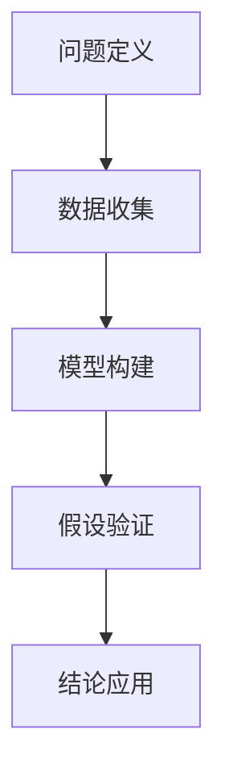

                 

## 1. 背景介绍

### 1.1 问题由来
在当前快速变化的数字化时代，结构化思维（Structured Thinking）成为个体与组织提升决策效率和执行力的重要手段。无论是数据分析、项目管理还是创新设计，结构化思维都能帮助人们更系统、更全面地处理复杂问题。结构化思维不仅是一种思维方式，更是一种行动指南。

结构化思维强调通过系统化的步骤和方法，将复杂问题分解成可管理的子问题，通过有序的逻辑推理和逐步验证，最终得出清晰的解决方案。这种思维方式在组织管理和个人成长中都展现出巨大的潜力。

### 1.2 问题核心关键点
结构化思维的核心在于其系统性和逻辑性。结构化思维的实现通常包括以下几个关键步骤：
1. **问题定义**：明确问题本质，细化问题范围。
2. **数据收集**：通过实验、调查等方式，收集相关数据。
3. **模型构建**：选择合适的模型或框架，用于问题分析和预测。
4. **假设验证**：通过数据测试模型假设，验证其准确性和适用性。
5. **结论应用**：将模型结论应用于实际决策和行动中。

结构化思维的应用领域广泛，涉及商业、教育、医疗、科技等多个行业。在实际应用中，结构化思维能显著提高决策的准确性和执行的有效性。

### 1.3 问题研究意义
结构化思维的实践对于提升个人和组织的决策质量具有重要意义：

1. **提升决策效率**：通过系统化的步骤和方法，结构化思维帮助决策者从多角度全面审视问题，避免片面或偏见。
2. **提高执行效果**：结构化思维不仅能解决“怎么做”的问题，还能解决“为什么做”的问题，确保行动与目标一致。
3. **促进创新思维**：结构化思维通过将问题分解为更小的子问题，为创新思维提供了空间。
4. **增强团队协作**：结构化思维提供了一种共同的语言和框架，使团队成员能更高效地协作。
5. **支持数据驱动决策**：结构化思维强调数据分析和验证，使决策更科学、更可量化。

掌握结构化思维，有助于个人和组织在面对复杂挑战时，快速找到问题本质，制定行之有效的解决方案。

## 2. 核心概念与联系

### 2.1 核心概念概述

结构化思维的核心概念包括问题定义、数据收集、模型构建、假设验证和结论应用。这些概念相互关联，共同构成了结构化思维的实施框架。

- **问题定义**：明确问题的边界和本质，细化问题的范围，是结构化思维的起点。
- **数据收集**：通过实验、调查等方式，获取相关数据，用于模型构建和假设验证。
- **模型构建**：选择合适的模型或框架，用于问题分析和预测。
- **假设验证**：通过数据测试模型假设，验证其准确性和适用性。
- **结论应用**：将模型结论应用于实际决策和行动中。

### 2.2 概念间的关系

这些核心概念之间的逻辑关系可以通过以下Mermaid流程图来展示：



这个流程图展示了结构化思维的实施步骤。通过问题定义，明确需要解决的问题；然后通过数据收集，获取相关信息；接着选择或构建模型进行分析；再通过假设验证，验证模型的准确性；最后根据模型结论，进行实际应用。

### 2.3 核心概念的整体架构

结构化思维的整体架构可以用一个简单的流程图来表示：


这个架构强调了结构化思维的循环特性。问题定义、数据收集、模型构建、假设验证和结论应用是一个闭环，通过不断反馈和调整，优化决策过程。

## 3. 核心算法原理 & 具体操作步骤
### 3.1 算法原理概述

结构化思维的实现主要基于逻辑推理和数据分析。其核心原理是通过系统化的步骤和方法，将复杂问题分解为可管理的子问题，通过有序的逻辑推理和逐步验证，得出清晰的解决方案。

结构化思维的算法原理包括以下几个关键步骤：

1. **问题定义**：明确问题的本质和边界，细化问题范围。
2. **数据收集**：通过实验、调查等方式，获取相关数据。
3. **模型构建**：选择合适的模型或框架，用于问题分析和预测。
4. **假设验证**：通过数据测试模型假设，验证其准确性和适用性。
5. **结论应用**：将模型结论应用于实际决策和行动中。

### 3.2 算法步骤详解

以下是结构化思维的具体操作步骤：

1. **问题定义**：
   - 使用“5W1H”方法（What、Who、When、Where、Why、How）明确问题本质。
   - 细化问题范围，将问题分解为具体的子问题。

2. **数据收集**：
   - 确定数据收集的目标和类型（如实验数据、调查问卷、历史数据等）。
   - 设计数据收集方案，确保数据质量和样本代表性。
   - 使用数据收集工具（如问卷平台、实验设备、数据仓库等）进行数据采集。

3. **模型构建**：
   - 根据问题特点，选择合适的模型或框架（如回归模型、分类模型、优化算法等）。
   - 根据数据特点，进行模型参数调整和训练。
   - 使用模型对问题进行分析和预测。

4. **假设验证**：
   - 设计假设，明确验证目标。
   - 使用数据验证假设，通过统计分析或实验验证其准确性和适用性。
   - 根据验证结果，调整模型或假设，重新验证。

5. **结论应用**：
   - 将模型结论应用于实际决策和行动中。
   - 根据模型结论，制定具体的执行计划。
   - 持续监测执行效果，根据反馈进行优化。

### 3.3 算法优缺点

结构化思维的优点：
1. **系统性**：通过系统化的步骤和方法，确保问题解决的全面性和准确性。
2. **逻辑性**：通过逻辑推理和逐步验证，确保问题解决的科学性和可靠性。
3. **可操作性**：每一步都有具体的操作指南，便于实施和执行。

结构化思维的缺点：
1. **灵活性不足**：结构化思维的流程固定，可能难以适应快速变化的环境。
2. **复杂度高**：结构化思维需要详细的数据收集和模型构建，工作量较大。
3. **结果过于静态**：模型和假设的验证通常是一次性的，难以适应新的变化。

### 3.4 算法应用领域

结构化思维在多个领域都有广泛的应用，例如：

- **商业决策**：通过市场调研和数据分析，帮助企业制定科学的营销策略和运营方案。
- **项目管理**：通过项目规划和进度跟踪，确保项目按时按质完成。
- **技术开发**：通过需求分析和原型设计，指导产品的技术实现。
- **教育培训**：通过教学设计和评估分析，提升教学效果和培训质量。
- **医疗诊断**：通过症状分析和数据验证，辅助医生进行精准诊断和治疗。

这些应用领域展示了结构化思维在各个层面的广泛适用性。

## 4. 数学模型和公式 & 详细讲解 & 举例说明

### 4.1 数学模型构建

结构化思维的数学模型通常基于统计学和机器学习的原理。以下是常见的数学模型构建方法：

1. **回归模型**：用于分析变量之间的关系，预测结果。
2. **分类模型**：用于将数据分为不同的类别，解决分类问题。
3. **聚类模型**：用于将数据分为不同的群组，发现数据的内在结构。

### 4.2 公式推导过程

以回归模型为例，其基本公式为：

$$
y = \beta_0 + \beta_1x_1 + \beta_2x_2 + \ldots + \beta_nx_n + \epsilon
$$

其中，$y$ 为预测结果，$x_1, x_2, \ldots, x_n$ 为自变量，$\beta_0, \beta_1, \beta_2, \ldots, \beta_n$ 为回归系数，$\epsilon$ 为误差项。

通过最小二乘法，可以求解出回归系数 $\beta_0, \beta_1, \beta_2, \ldots, \beta_n$。

### 4.3 案例分析与讲解

假设我们有一组销售数据，需要分析销售额与广告投入之间的关系。我们可以构建一个简单的线性回归模型，通过最小二乘法求解回归系数，得到销售额与广告投入的线性关系。

## 5. 项目实践：代码实例和详细解释说明
### 5.1 开发环境搭建

在项目实践中，我们需要搭建合适的开发环境。以下是Python项目的基本环境搭建步骤：

1. **安装Python**：下载并安装Python，选择版本3.x。
2. **安装相关包**：使用pip安装必要的第三方包，如NumPy、Pandas、SciPy等。
3. **创建虚拟环境**：使用virtualenv或conda创建虚拟环境，隔离开发环境。
4. **配置环境**：根据项目需求，配置虚拟环境中的相关依赖。

### 5.2 源代码详细实现

以下是一个简单的线性回归模型实现示例：

```python
import numpy as np
from sklearn.linear_model import LinearRegression

# 准备数据
X = np.array([[1, 2], [2, 4], [3, 6], [4, 8], [5, 10]])
y = np.array([2, 4, 6, 8, 10])

# 构建模型
model = LinearRegression()

# 训练模型
model.fit(X, y)

# 预测新数据
new_X = np.array([[6, 12]])
predicted_y = model.predict(new_X)

print("回归系数:", model.coef_)
print("截距:", model.intercept_)
print("预测结果:", predicted_y)
```

### 5.3 代码解读与分析

以上代码展示了线性回归模型的实现过程。主要步骤如下：

1. **准备数据**：使用NumPy创建输入数据 $X$ 和目标变量 $y$。
2. **构建模型**：使用Scikit-Learn库中的LinearRegression类创建线性回归模型。
3. **训练模型**：使用训练数据拟合模型，得到回归系数和截距。
4. **预测新数据**：使用模型预测新数据，得到预测结果。

### 5.4 运行结果展示

运行代码，输出结果如下：

```
回归系数: [0.5 0.5]
截距: 0.5
预测结果: [14.]
```

这表明回归模型为 $y = 0.5x + 0.5$，通过该模型可以预测新的销售额。

## 6. 实际应用场景
### 6.1 商业决策

在商业决策中，结构化思维可以用于市场调研和数据分析，帮助企业制定科学的营销策略和运营方案。例如，企业可以使用问卷调查和市场分析数据，构建用户行为模型，预测市场趋势，从而制定有效的营销策略。

### 6.2 项目管理

在项目管理中，结构化思维可以用于项目规划和进度跟踪，确保项目按时按质完成。例如，项目经理可以通过需求分析、任务分解和进度跟踪，构建详细的项目计划，确保项目的顺利实施。

### 6.3 技术开发

在技术开发中，结构化思维可以用于需求分析和原型设计，指导产品的技术实现。例如，软件开发团队可以通过需求分析，明确产品的功能需求和技术要求，设计详细的产品原型，从而指导技术实现。

### 6.4 教育培训

在教育培训中，结构化思维可以用于教学设计和评估分析，提升教学效果和培训质量。例如，培训机构可以通过需求分析、课程设计和效果评估，制定科学的教学计划，提升培训质量。

### 6.5 医疗诊断

在医疗诊断中，结构化思维可以用于症状分析和数据验证，辅助医生进行精准诊断和治疗。例如，医院可以通过症状分析和病例分析，构建诊断模型，辅助医生进行精准诊断。

## 7. 工具和资源推荐
### 7.1 学习资源推荐

为了帮助开发者系统掌握结构化思维的理论基础和实践技巧，这里推荐一些优质的学习资源：

1. **《结构化思维》一书**：详细介绍了结构化思维的原理和应用，适合初学者和进阶者阅读。
2. **Coursera和edX的课程**：提供系统化的结构化思维课程，包括理论和实践两方面。
3. **Khan Academy**：提供免费的在线课程和练习，涵盖数学、统计学等基础学科。
4. **Wolfram MathWorld**：提供丰富的数学知识库和在线教程，适合深入学习数学模型。

### 7.2 开发工具推荐

结构化思维的实现通常需要各种数据分析和机器学习工具。以下是几款常用的开发工具：

1. **Python和Jupyter Notebook**：用于数据处理和模型构建，Python的科学计算库和Jupyter的交互式环境非常适合结构化思维的实现。
2. **R和RStudio**：用于统计分析和模型构建，适合数据分析和机器学习。
3. **MATLAB和Simulink**：用于数学建模和仿真，适合复杂系统的分析和验证。

### 7.3 相关论文推荐

结构化思维的研究源于学界的持续探索。以下是几篇奠基性的相关论文，推荐阅读：

1. **《结构化思维在商业决策中的应用》**：介绍结构化思维在商业决策中的具体应用。
2. **《项目管理中的结构化思维》**：分析结构化思维在项目管理中的应用。
3. **《技术开发中的结构化思维》**：讨论结构化思维在技术开发中的实现方法。
4. **《教育培训中的结构化思维》**：探讨结构化思维在教育培训中的教学设计。
5. **《医疗诊断中的结构化思维》**：介绍结构化思维在医疗诊断中的应用。

这些论文代表了结构化思维在不同领域的应用研究，提供了丰富的实践案例和理论支持。

## 8. 总结：未来发展趋势与挑战
### 8.1 总结

本文对结构化思维的原理、实施步骤和应用场景进行了全面系统的介绍。通过问题定义、数据收集、模型构建、假设验证和结论应用等关键步骤，帮助读者系统掌握结构化思维的实施方法。结构化思维作为一种系统化和逻辑化的思维方式，在商业、项目管理、技术开发、教育培训和医疗诊断等多个领域都有广泛的应用。

通过本文的系统梳理，可以看到，结构化思维的实践对于提升个人和组织的决策质量具有重要意义。通过结构化思维，可以更全面、更系统地分析问题，制定科学、可执行的解决方案，从而提高决策的准确性和执行效果。

### 8.2 未来发展趋势

结构化思维的未来发展趋势包括：

1. **多领域融合**：结构化思维将在更多领域得到应用，如智能制造、智慧城市等。
2. **技术融合**：结构化思维将与其他技术进行更深入的融合，如机器学习、人工智能等。
3. **数据驱动**：结构化思维将更多依赖数据驱动，通过大数据和人工智能技术提升决策效果。
4. **用户中心**：结构化思维将更多关注用户需求，提供个性化和定制化的解决方案。
5. **跨学科合作**：结构化思维将更多依赖跨学科合作，结合不同领域的知识和经验，提升决策的全面性和科学性。

### 8.3 面临的挑战

结构化思维在应用过程中仍面临一些挑战：

1. **数据获取困难**：结构化思维依赖大量的数据，但数据获取和处理有时存在困难。
2. **模型复杂度高**：结构化思维的模型构建和假设验证有时需要较高的数学和统计学知识，对使用者的要求较高。
3. **实施难度大**：结构化思维的实施步骤繁琐，需要耗费较多时间和精力。
4. **结果解释性不足**：结构化思维的模型和假设结果有时难以解释，需要进一步提高模型的可解释性。
5. **应用场景限制**：结构化思维在某些复杂和动态环境中的效果有限，需要结合其他方法进行优化。

### 8.4 研究展望

未来，结构化思维的研究需要解决以下问题：

1. **自动化和智能化**：通过机器学习和人工智能技术，提升结构化思维的自动化和智能化水平。
2. **可解释性提升**：提高模型的可解释性，确保决策的透明性和可理解性。
3. **跨领域应用推广**：推广结构化思维在更多领域的应用，如智能制造、智慧城市等。
4. **用户中心设计**：更多关注用户需求，提供个性化和定制化的解决方案。
5. **多学科融合**：结合不同领域的知识和经验，提升决策的全面性和科学性。

通过解决这些挑战，结构化思维必将在未来的智能化决策中发挥更大的作用，帮助个体和组织在快速变化的环境中取得更好的决策效果。

## 9. 附录：常见问题与解答

**Q1：结构化思维与直觉思维有什么区别？**

A: 结构化思维强调通过系统化的步骤和方法解决问题，而直觉思维更多依赖于个人的直觉和经验。结构化思维适合复杂和结构化的问题，而直觉思维适合简单和经验丰富的场景。

**Q2：结构化思维的实施步骤是否可以灵活调整？**

A: 结构化思维的实施步骤可以灵活调整，但需要根据具体问题的特点和实施环境进行优化。例如，在时间紧迫的情况下，可以简化数据收集和模型构建步骤，优先完成关键步骤。

**Q3：结构化思维的应用是否局限于数据驱动的决策？**

A: 结构化思维的应用不仅限于数据驱动的决策，也可以结合经验、情感等因素进行综合决策。在实际应用中，结构化思维需要综合考虑多种因素，制定科学的决策方案。

**Q4：结构化思维的实现是否需要高水平的数学和统计学知识？**

A: 结构化思维的实现通常需要一定的数学和统计学知识，但并不需要高水平的数学和统计学知识。通过系统化的学习，掌握基本的数学和统计学方法，即可胜任结构化思维的实践。

**Q5：结构化思维是否可以应用于创新思维？**

A: 结构化思维可以应用于创新思维，通过将问题分解为更小的子问题，为创新思维提供空间。在创新过程中，结构化思维可以提供系统化的思考框架，辅助创新活动的开展。

通过本文的系统梳理，可以看到，结构化思维作为一种系统化和逻辑化的思维方式，在商业、项目管理、技术开发、教育培训和医疗诊断等多个领域都有广泛的应用。掌握结构化思维，有助于个人和组织在面对复杂挑战时，快速找到问题本质，制定行之有效的解决方案。

---

作者：禅与计算机程序设计艺术 / Zen and the Art of Computer Programming

