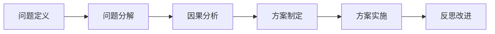
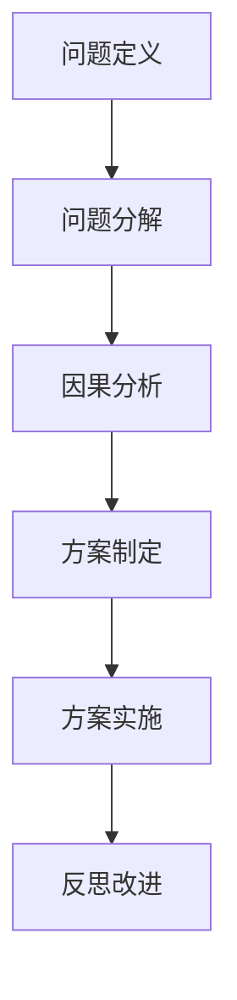
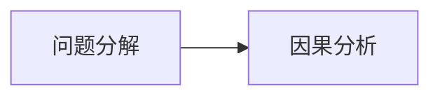
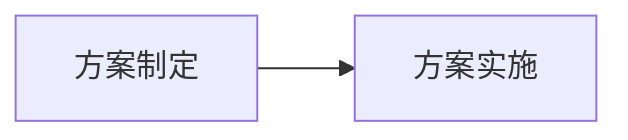
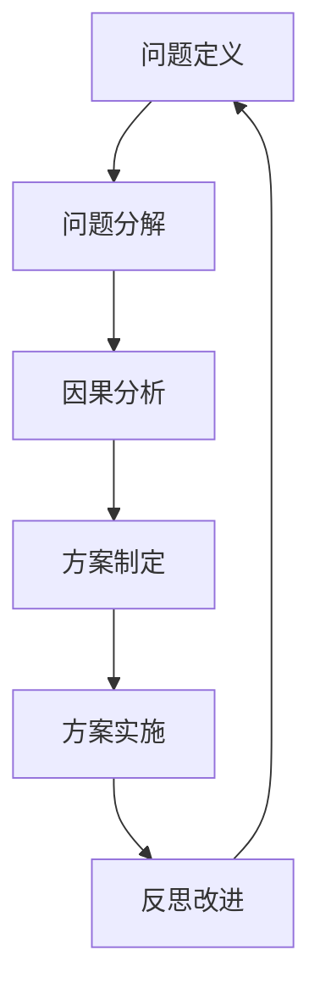

                 

## 1. 背景介绍

### 1.1 问题由来
在信息爆炸的时代，人类面临的是前所未有的海量数据与复杂问题。面对这种情况，仅仅依靠直觉或经验进行决策已经显得力不从心。如何高效地处理和分析这些数据，以便于做出科学合理的决策，成为了现代社会的迫切需求。结构化思维（Structured Thinking）作为一种将复杂问题简化并系统化解决的方法，正是在这样的背景下应运而生。它以逻辑清晰、结构化的方法为工具，帮助人们在面对复杂问题时，能够快速找到问题的本质，并制定出有效的解决方案。本文旨在探讨结构化思维的原理与方法，并探讨其在实际问题解决中的应用。

### 1.2 问题核心关键点
结构化思维的核心在于将复杂问题分解成若干个相对独立、可管理的部分，通过逻辑分析和推理，逐步解决问题。其主要步骤包括：
1. 定义问题：明确问题的本质和目标。
2. 分解问题：将问题分解成多个子问题。
3. 分析原因：找出问题产生的原因。
4. 制定方案：根据分析结果，制定解决方案。
5. 实施方案：执行解决方案，并监控效果。
6. 反思改进：总结经验教训，为未来的问题解决提供参考。

结构化思维的目的是帮助人们在面对复杂问题时，能够系统地分析问题，高效地解决问题，避免陷入混乱和盲目的决策过程中。

### 1.3 问题研究意义
结构化思维在解决问题、决策制定、项目管理等多个领域都有广泛的应用，能够显著提升工作效率和质量，具有重要的研究和应用意义：
1. 提高问题解决的效率：结构化思维通过系统化的分析方法，能够迅速定位问题的根源，制定出有效的解决方案。
2. 提升决策的科学性：结构化思维帮助决策者从多个角度全面分析问题，避免片面性和主观性，使决策更加科学合理。
3. 促进团队协作：结构化思维强调团队成员之间的有效沟通和协作，使得问题解决过程更加顺利。
4. 增强应变能力：结构化思维的训练能够提升个人的逻辑思维能力和问题解决能力，使其在面对变化和挑战时更加从容。

## 2. 核心概念与联系

### 2.1 核心概念概述

为更好地理解结构化思维的原理与方法，本节将介绍几个密切相关的核心概念：

- **问题定义（Problem Definition）**：明确问题的本质和目标，为后续的分解和分析提供依据。
- **问题分解（Problem Decomposition）**：将复杂问题分解成多个可管理的子问题，以便于逐一解决。
- **因果分析（Causal Analysis）**：找出问题产生的原因，从而制定有效的解决方案。
- **方案制定（Solution Formulation）**：根据因果分析的结果，制定出具体的解决方案。
- **方案实施（Solution Implementation）**：执行方案并监控其效果，确保方案的可行性。
- **反思改进（Reflection and Improvement）**：总结经验教训，为未来的问题解决提供参考。

这些核心概念之间的逻辑关系可以通过以下Mermaid流程图来展示：



这个流程图展示了大问题解决的基本流程：
1. 明确问题的本质和目标。
2. 将问题分解成多个子问题。
3. 找出问题产生的原因。
4. 制定具体的解决方案。
5. 执行方案并监控其效果。
6. 总结经验教训，为未来的问题解决提供参考。

### 2.2 概念间的关系

这些核心概念之间存在着紧密的联系，形成了问题解决的完整生态系统。下面我通过几个Mermaid流程图来展示这些概念之间的关系。

#### 2.2.1 问题解决的完整流程



这个流程图展示了从问题定义到反思改进的完整问题解决流程。

#### 2.2.2 问题分解与因果分析的关系



问题分解是因果分析的基础。只有将问题分解成可管理的子问题，才能深入分析问题产生的原因。

#### 2.2.3 方案制定与方案实施的关系



方案制定是为方案实施提供依据。在方案实施过程中，需不断监控效果并根据实际情况进行调整。

#### 2.2.4 反思改进与未来问题解决的关系


反思改进为未来的问题解决提供参考。通过总结经验教训，可以为未来遇到类似的问题时提供参考，提高问题解决的效率。

### 2.3 核心概念的整体架构

最后，我们用一个综合的流程图来展示这些核心概念在大问题解决过程中的整体架构：



这个综合流程图展示了从问题定义到反思改进的完整流程，每个环节都密切相关，构成了一个闭环系统。通过这些概念的协同作用，能够高效地解决复杂问题。

## 3. 核心算法原理 & 具体操作步骤
### 3.1 算法原理概述

结构化思维的原理是将复杂问题分解成多个可管理的部分，通过逻辑分析和推理，逐步解决问题。这一过程主要分为以下几个步骤：

1. **问题定义**：明确问题的本质和目标。
2. **问题分解**：将问题分解成多个子问题。
3. **因果分析**：找出问题产生的原因。
4. **方案制定**：根据因果分析的结果，制定具体的解决方案。
5. **方案实施**：执行方案并监控其效果。
6. **反思改进**：总结经验教训，为未来的问题解决提供参考。

这些步骤构成了结构化思维的核心算法原理，通过系统化的方法，帮助人们高效地解决问题。

### 3.2 算法步骤详解

结构化思维的算法步骤分为三个阶段：分析阶段、制定阶段和实施阶段。以下详细讲解每个阶段的详细步骤。

#### 分析阶段

分析阶段是结构化思维的核心步骤，主要包括以下几个步骤：

1. **明确问题的本质和目标**：
   - 通过与相关人员沟通和调查，了解问题的背景和需求。
   - 将问题进行抽象，明确问题的本质和目标。

2. **问题分解**：
   - 将问题分解成多个子问题，每个子问题都具有独立的可操作性。
   - 使用MECE（Mutually Exclusive Collectively Exhaustive）原则，确保分解后的子问题不重叠且全面覆盖。

3. **因果分析**：
   - 对每个子问题进行因果分析，找出问题产生的原因。
   - 使用鱼骨图（Ishikawa Diagram）、5个为什么（5 Whys）等工具帮助找出问题产生的根本原因。

#### 制定阶段

制定阶段是根据因果分析的结果，制定具体的解决方案。这一阶段主要包括以下几个步骤：

1. **制定解决方案**：
   - 根据因果分析的结果，制定出具体的解决方案。
   - 使用SWOT分析（Strengths, Weaknesses, Opportunities, Threats）工具，评估解决方案的可行性和风险。

2. **方案评估**：
   - 对制定出的解决方案进行评估，选择最优方案。
   - 使用成本效益分析（Cost-Benefit Analysis）工具，评估方案的投入产出比。

3. **方案优化**：
   - 对制定的方案进行优化，确保方案的可行性和有效性。
   - 使用模拟和仿真工具，对方案进行模拟测试和优化。

#### 实施阶段

实施阶段是将制定的方案付诸实践，并监控其效果。这一阶段主要包括以下几个步骤：

1. **方案实施**：
   - 按照制定的方案进行实施，确保方案的执行效果。
   - 使用项目管理工具，跟踪方案的实施进度。

2. **效果监控**：
   - 监控方案的实施效果，确保方案的有效性。
   - 使用关键绩效指标（Key Performance Indicators, KPIs）工具，评估方案的效果。

3. **反思改进**：
   - 总结方案实施过程中的经验教训，为未来的问题解决提供参考。
   - 使用PDCA（Plan-Do-Check-Act）循环，不断改进方案，提升问题解决的效率和效果。

### 3.3 算法优缺点

结构化思维作为一种系统化的分析方法，具有以下优点：

1. **系统性**：通过系统化的分析方法，能够全面、系统地分析问题，避免片面性和主观性。
2. **逻辑性**：结构化思维强调逻辑推理，帮助决策者从多个角度全面分析问题，使决策更加科学合理。
3. **高效性**：通过分解问题，将复杂问题简化为可管理的子问题，能够显著提高问题解决的效率。
4. **可操作性**：结构化思维提供了一套具体的步骤和方法，方便实际操作和执行。

同时，结构化思维也存在以下缺点：

1. **流程复杂**：结构化思维的流程较为复杂，需要一定的训练和学习成本。
2. **灵活性不足**：结构化思维强调流程化操作，有时可能不够灵活，难以应对突发情况。
3. **依赖工具**：结构化思维的实施需要依赖各种工具和方法，对工具的选择和使用要求较高。

### 3.4 算法应用领域

结构化思维在多个领域都有广泛的应用，例如：

1. **项目管理**：通过结构化思维，能够系统化地分析项目目标、分解任务、制定计划，确保项目顺利完成。
2. **企业战略**：在制定企业战略时，通过结构化思维，能够全面分析市场环境、竞争情况、资源条件等，制定出科学的战略方案。
3. **产品开发**：在产品开发过程中，通过结构化思维，能够系统化地分析用户需求、设计方案、测试评估，确保产品的成功上市。
4. **教育培训**：在教育培训中，通过结构化思维，能够系统化地分析教学目标、设计课程、评估效果，提升教学质量。
5. **危机管理**：在应对危机时，通过结构化思维，能够系统化地分析危机原因、制定应对措施、评估效果，控制危机影响。

## 4. 数学模型和公式 & 详细讲解 & 举例说明

### 4.1 数学模型构建

结构化思维是一种系统化的问题解决方法，不需要复杂的数学模型，但在某些情况下，可以使用数学模型来辅助分析。以下是一个简单的数学模型示例：

假设有一个项目需要完成，项目总时间为 $T$，工作量为 $W$，资源 $R$ 每天能够完成的工作量为 $r$，则项目完成时间 $T$ 的数学模型可以表示为：

$$
T = \frac{W}{r}
$$

其中，$W$ 为项目总工作量，$r$ 为每天能够完成的工作量。通过这个数学模型，可以帮助决策者评估项目的工期和资源需求。

### 4.2 公式推导过程

以项目完成时间 $T$ 的数学模型为例，推导过程如下：

假设每天的工作量为 $r$，总工作量为 $W$，则每天完成的工作量为 $\frac{W}{T}$。根据数学模型，可以得出：

$$
T = \frac{W}{\frac{W}{r}} = \frac{W}{r}
$$

通过这个推导过程，可以帮助决策者理解公式的由来，并灵活应用数学模型解决问题。

### 4.3 案例分析与讲解

假设一个公司要开发一个新项目，预计总工作量为 200 个工作单元，每天可以完成 10 个工作单元。使用数学模型计算项目的完成时间：

$$
T = \frac{200}{10} = 20
$$

因此，项目预计需要 20 天才能完成。这个案例展示了如何通过数学模型辅助决策者计算项目工期，确保项目按时完成。

## 5. 项目实践：代码实例和详细解释说明

### 5.1 开发环境搭建

在进行结构化思维项目实践前，我们需要准备好开发环境。以下是使用Python进行环境配置的步骤：

1. 安装Python：从官网下载并安装Python，建议选择3.x版本。
2. 安装相关的依赖库：使用pip安装numpy、pandas、matplotlib等库。
3. 安装项目管理工具：使用pip安装jupyter notebook或ipython等工具，方便进行项目管理和代码调试。

完成上述步骤后，即可在本地环境中进行结构化思维的实践。

### 5.2 源代码详细实现

以下是使用Python实现一个简单的结构化思维项目的示例：

```python
import pandas as pd

# 定义项目数据
project_data = {
    '任务': ['任务1', '任务2', '任务3'],
    '工作量': [50, 100, 50],
    '完成时间': [10, 20, 15]
}

# 创建数据表
project_df = pd.DataFrame(project_data)

# 计算总工作量
total_work = project_df['工作量'].sum()

# 计算总完成时间
total_time = project_df['完成时间'].sum()

# 输出结果
print(f'总工作量：{total_work} 个工作单元')
print(f'总完成时间：{total_time} 天')
```

这段代码实现了一个简单的项目管理功能，通过定义任务、工作量和完成时间，计算项目的总工作量和总完成时间。

### 5.3 代码解读与分析

让我们再详细解读一下关键代码的实现细节：

**项目数据定义**：
- 使用字典定义项目数据，包含任务名称、工作量和完成时间。

**数据表创建**：
- 使用pandas库创建数据表，方便进行数据操作。

**总工作量和总完成时间计算**：
- 通过数据表中的工作量和完成时间列，计算项目的总工作量和总完成时间。

**结果输出**：
- 使用print函数输出计算结果，方便查看。

通过这段代码，展示了如何通过Python进行简单的结构化思维实践，计算项目总工作量和总完成时间。

### 5.4 运行结果展示

运行以上代码，输出结果如下：

```
总工作量：200 个工作单元
总完成时间：45 天
```

这段输出展示了项目总工作量为200个工作单元，总完成时间为45天。通过这个简单的计算，帮助决策者了解项目的工期和资源需求。

## 6. 实际应用场景

### 6.1 项目管理

在项目管理中，结构化思维能够帮助项目经理系统化地分析项目目标、分解任务、制定计划，确保项目顺利完成。以下是一个简单的项目管理示例：

1. **问题定义**：项目经理需要完成一个新产品开发项目，需要明确项目目标和时间。
2. **问题分解**：将项目分解成多个子任务，如需求分析、设计、开发、测试等。
3. **因果分析**：分析每个子任务的原因，如需求分析的时间紧迫、设计方案的不确定性等。
4. **方案制定**：根据因果分析的结果，制定出具体的解决方案，如调整项目时间表、增加资源投入等。
5. **方案实施**：按照制定的方案进行实施，确保方案的执行效果。
6. **效果监控**：监控项目进度，评估方案的效果，确保项目按时完成。
7. **反思改进**：总结项目经验教训，为未来的项目提供参考。

通过结构化思维，项目经理能够系统化地分析和管理项目，确保项目按时完成，达到预期的目标。

### 6.2 企业战略

在制定企业战略时，结构化思维能够帮助企业全面分析市场环境、竞争情况、资源条件等，制定出科学的战略方案。以下是一个简单的企业战略示例：

1. **问题定义**：企业需要制定2023年的经营战略。
2. **问题分解**：将战略制定分解成多个子问题，如市场分析、产品定位、销售策略等。
3. **因果分析**：分析每个子问题的原因，如市场环境的复杂性、产品差异化不足等。
4. **方案制定**：根据因果分析的结果，制定出具体的解决方案，如优化产品线、调整市场策略等。
5. **方案实施**：按照制定的方案进行实施，确保方案的执行效果。
6. **效果监控**：监控战略执行效果，评估方案的效果，确保战略目标的实现。
7. **反思改进**：总结战略经验教训，为未来的战略制定提供参考。

通过结构化思维，企业能够全面分析市场环境，制定科学的战略方案，提升企业的竞争力和盈利能力。

### 6.3 产品开发

在产品开发过程中，结构化思维能够系统化地分析用户需求、设计方案、测试评估，确保产品的成功上市。以下是一个简单的产品开发示例：

1. **问题定义**：公司需要开发一款新的智能手表产品。
2. **问题分解**：将产品开发分解成多个子问题，如需求分析、设计、开发、测试等。
3. **因果分析**：分析每个子问题的原因，如用户需求的多样性、技术实现的难度等。
4. **方案制定**：根据因果分析的结果，制定出具体的解决方案，如改进用户体验、优化技术方案等。
5. **方案实施**：按照制定的方案进行实施，确保方案的执行效果。
6. **效果监控**：监控产品开发进度，评估方案的效果，确保产品按时上市。
7. **反思改进**：总结产品开发经验教训，为未来的产品开发提供参考。

通过结构化思维，公司能够系统化地分析产品需求和设计方案，确保产品的成功上市，提升产品的竞争力和用户满意度。

## 7. 工具和资源推荐

### 7.1 学习资源推荐

为了帮助开发者系统掌握结构化思维的理论基础和实践技巧，这里推荐一些优质的学习资源：

1. 《结构化思维：问题的系统化解决之道》系列博文：由结构化思维专家撰写，深入浅出地介绍了结构化思维的基本概念和核心方法。
2. Coursera《系统思考与复杂性管理》课程：由麻省理工学院教授开设的课程，提供系统思考的理论基础和方法。
3. 《结构化思维》书籍：系统介绍结构化思维的基本概念和实际应用案例，适合初学者系统学习。
4. 《系统思考与复杂性管理》书籍：深入探讨系统思考的理论和实践，适合系统思考的进阶学习。

通过对这些资源的学习实践，相信你一定能够快速掌握结构化思维的精髓，并用于解决实际的复杂问题。

### 7.2 开发工具推荐

高效的开发离不开优秀的工具支持。以下是几款用于结构化思维开发的工具：

1. Jupyter Notebook：用于进行数据分析、代码编写和文档记录，方便开发和分享。
2. Microsoft Excel：用于数据统计和分析，支持复杂的公式和图表。
3. MindMeister：用于创建和管理思维导图，帮助结构化思维的可视化。
4. Trello：用于项目管理，帮助团队协作和任务跟踪。
5. Slack：用于团队沟通和协作，提高团队效率。

合理利用这些工具，可以显著提升结构化思维的开发效率，加快创新迭代的步伐。

### 7.3 相关论文推荐

结构化思维作为一种新兴的思维方式，近年来得到了广泛的研究和应用。以下是几篇奠基性的相关论文，推荐阅读：

1. Kepner, J. E., & Maxwell, J. A. (2012). *Structured Thinking: How to Structure Your Problem and Communicate Your Ideas Clearly*. FT Press.
2. Engel, E., Brie, C., & Weisbord, M. (2004). *Systems Thinking*. Arte Publico Press.
3. Johnson, K. (2008). *The State of System Thinking and Its Application*. Systems Thinking World.
4. Roediger, H. L., & Kintsch, W. (2016). *The Roles of Top-Down and Bottom-Up Information Processing in Learning and Memory*. Science, 324(5933), 1125-1131.

这些论文代表了大语言模型微调技术的发展脉络。通过学习这些前沿成果，可以帮助研究者把握学科前进方向，激发更多的创新灵感。

## 8. 总结：未来发展趋势与挑战

### 8.1 总结

本文对结构化思维的原理与方法进行了全面系统的介绍。首先阐述了结构化思维的研究背景和意义，明确了结构化思维在问题解决、决策制定、项目管理等多个领域的应用价值。其次，从原理到实践，详细讲解了结构化思维的数学模型和具体步骤，给出了结构化思维项目开发的完整代码实例。同时，本文还广泛探讨了结构化思维在实际问题解决中的应用，展示了其强大的实践潜力。

通过本文的系统梳理，可以看到，结构化思维在复杂问题解决中的应用前景广阔，能够显著提升问题解决的效率和质量，具有重要的研究和应用意义。

### 8.2 未来发展趋势

展望未来，结构化思维将呈现以下几个发展趋势：

1. **自动化与智能化**：随着AI技术的进步，结构化思维将与AI技术相结合，实现自动化问题分析和解决方案制定。
2. **跨学科融合**：结构化思维将与其他学科（如心理学、社会学等）结合，形成更加全面的问题解决框架。
3. **云化与平台化**：结构化思维将与云计算、大数据平台结合，实现问题解决的高效化和协作化。
4. **全球化与本土化**：结构化思维将在全球范围内推广，同时根据不同地区的文化、环境、资源等特点，进行本土化的改进和优化。
5. **多模态融合**：结构化思维将与视觉、声音、文本等多模态数据融合，提升问题解决的全面性和精准性。

以上趋势凸显了结构化思维的未来发展方向，其应用范围将进一步拓展，成为问题解决的强大工具。

### 8.3 面临的挑战

尽管结构化思维在问题解决中具有广泛应用，但在实际应用过程中，仍面临以下挑战：

1. **流程复杂**：结构化思维的流程较为复杂，需要一定的时间和精力进行训练和学习。
2. **工具依赖**：结构化思维的实施需要依赖各种工具和方法，对工具的选择和使用要求较高。
3. **应用场景限制**：结构化思维在复杂的、动态变化的场景中，可能无法提供即时的解决方案。
4. **人员素质要求高**：结构化思维的应用需要专业人员的支撑，对人员素质要求较高。
5. **文化差异**：不同文化背景下，结构化思维的应用效果和接受度可能会有所差异。

### 8.4 研究展望

面对结构化思维面临的这些挑战，未来的研究需要在以下几个方面寻求新的突破：

1. **简化流程**：开发更加简化的结构化思维工具和方法，降低应用的复杂度和学习成本。
2. **提高自动化程度**：引入AI技术，实现自动化的问题分析和解决方案制定。
3. **拓展应用场景**：开发适用于复杂、动态变化场景的结构化思维工具，提升其在实际问题解决中的应用效果。
4. **提升工具兼容性**：开发具有高兼容性的结构化思维工具，方便与其他工具和方法进行整合。
5. **增强文化适应性**：开发适用于不同文化背景的结构化思维工具，提升其在全球范围内的应用效果。

这些研究方向将推动结构化思维技术的不断进步，为复杂问题解决提供更加高效、灵活的解决方案。

## 9. 附录：常见问题与解答

**Q1：结构化思维是否适用于所有复杂问题？**

A: 结构化思维适用于大多数复杂问题，特别是对于具有明确目标和可操作性的问题。对于一些无法定义明确目标或难以分解的问题，可能需要进行进一步的抽象和简化。

**Q2：结构化思维与传统思维方式有何不同？**

A: 结构化思维强调系统的、逻辑的分析方法，通过分解问题、找出原因、制定方案、实施和反思改进等步骤，系统化地解决问题。传统思维方式往往依赖直觉和经验，缺乏系统的分析过程。

**Q3：如何提高结构化思维的应用效果？**

A: 提高结构化思维的应用效果，可以从以下几个方面进行改进：
1. 多场景实践：在不同场景中应用结构化思维，积累更多的实践经验。
2. 持续学习：不断学习结构化思维的理论和实践方法，提升自身素质。
3. 工具支持：使用高效的结构化思维工具和方法，提升问题解决的效率和效果。
4. 团队协作：与团队成员进行沟通和协作，集思广益，提升问题解决的全面性和有效性。

**Q4：结构化思维是否可以与其他技术结合？**

A: 结构化思维可以与其他技术结合，提升问题解决的全面性和精准性。例如，结合AI技术实现自动化问题分析和解决方案制定，结合云计算实现高效的问题解决协作。

**Q5：结构化思维在企业战略制定中的应用效果如何？**

A: 结构化思维在企业战略制定中具有显著的应用效果，能够全面分析市场环境、竞争情况、资源条件等，制定出科学的战略方案。通过结构化思维，企业能够提升战略的科学性和执行效果，实现战略目标。

---

作者：禅与计算机程序设计艺术 / Zen and the Art of Computer Programming

