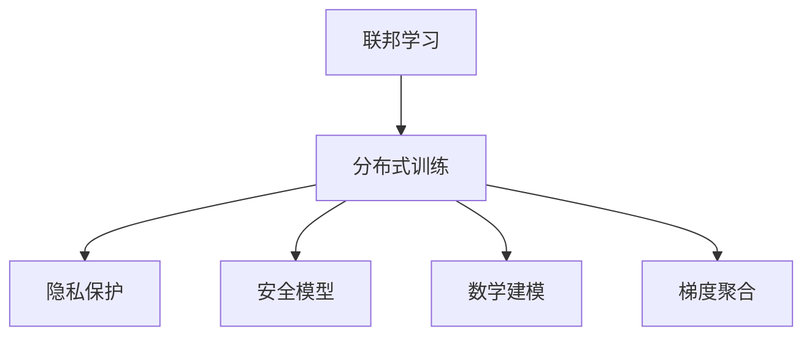
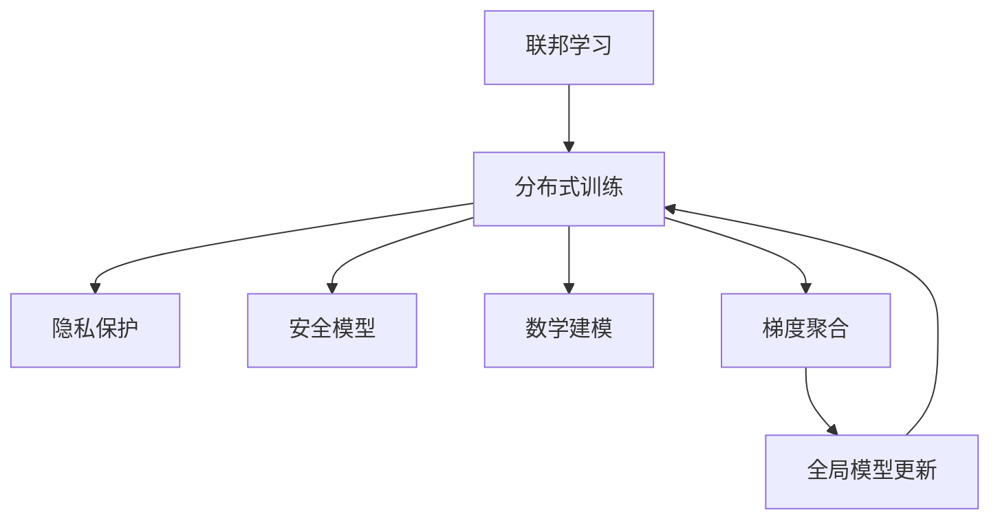
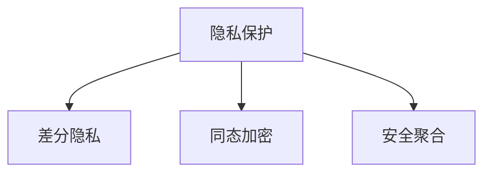
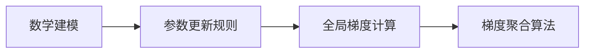
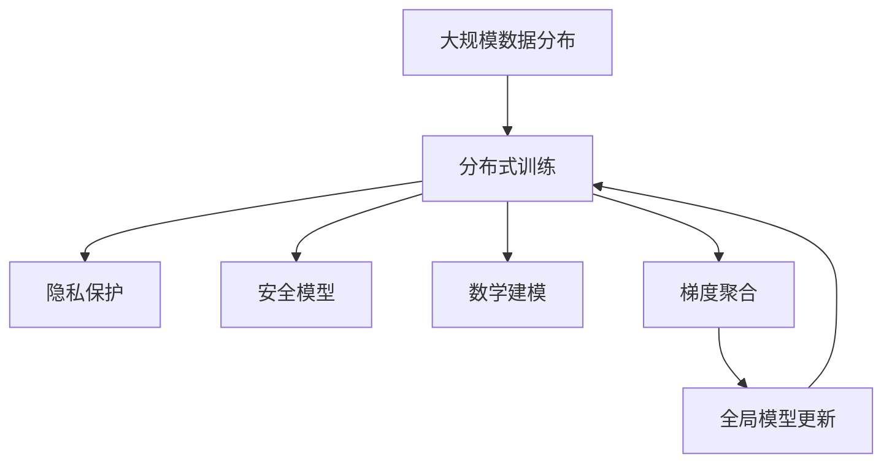

                 

# 联邦学习 原理与代码实例讲解

> 关键词：联邦学习, 分布式训练, 隐私保护, 安全模型, 数学建模, 梯度聚合

## 1. 背景介绍

### 1.1 问题由来
随着人工智能(AI)技术的快速发展，大数据驱动的模型训练成为获取高智能算法性能的重要手段。然而，数据隐私和分布式计算问题逐渐成为制约AI模型训练的主要瓶颈。传统的集中式模型训练不仅需要传输和存储大量数据，还面临着数据泄露和数据隐私保护的巨大风险。因此，一种全新的分布式模型训练范式应运而生——联邦学习（Federated Learning, FL）。

联邦学习通过将数据留在本地设备或服务器上，只在本地计算梯度，并根据全局聚合的梯度参数进行模型更新，从而实现在不共享原始数据的情况下，训练出高性能的通用模型。这种方法尤其适用于医疗、金融、物联网等对数据隐私保护要求极高的场景。

### 1.2 问题核心关键点
联邦学习的基本思想是：将模型参数分布在多个本地设备或服务器上，每个设备对本地数据进行梯度计算，并将计算结果发送给中央服务器进行模型参数的聚合更新。核心过程包括数据分布、模型初始化、本地计算、梯度聚合和参数更新等步骤。

1. **数据分布**：将数据划分为多个本地数据集，每个本地数据集在本地设备上进行预处理和存储。
2. **模型初始化**：中央服务器在本地设备上初始化模型参数，并向每个本地设备分发一份参数副本。
3. **本地计算**：每个本地设备对本地数据集进行梯度计算，并更新模型参数。
4. **梯度聚合**：中央服务器收集各本地设备的梯度更新信息，计算全局梯度，并生成更新指令。
5. **参数更新**：各本地设备根据中央服务器发送的更新指令，更新本地模型参数。

通过这种基于分布式计算的模型训练方式，联邦学习不仅减少了数据传输和存储的负担，还保护了数据隐私，提升了模型的泛化能力。

### 1.3 问题研究意义
研究联邦学习对于提升AI模型的隐私保护和分布式计算能力具有重要意义：

1. **隐私保护**：联邦学习能够在不共享原始数据的情况下进行模型训练，保护用户隐私，确保数据安全。
2. **分布式计算**：联邦学习充分利用了分布式计算资源，使得大规模模型训练成为可能。
3. **提升泛化能力**：联邦学习融合了多源异构数据，提升了模型的泛化能力，避免了单一数据源的限制。
4. **降低通信成本**：联邦学习减少了数据传输和存储的成本，尤其适合数据量庞大但通信带宽有限的场景。

## 2. 核心概念与联系

### 2.1 核心概念概述

为更好地理解联邦学习的工作原理和优化方法，本节将介绍几个密切相关的核心概念：

- **联邦学习**（Federated Learning, FL）：一种分布式机器学习范式，通过在多个本地设备或服务器上训练模型，并同步模型参数，实现全局模型的更新。
- **分布式训练**：将模型在多个分布式节点上同时进行训练，数据分布在本地的计算框架中。
- **隐私保护**：通过本地计算和梯度聚合，不共享原始数据，保护数据隐私。
- **安全模型**：在分布式训练中，通过差分隐私、同态加密等技术，保护模型参数的安全性。
- **数学建模**：使用优化理论和机器学习理论，构建模型参数的更新规则。
- **梯度聚合**：计算全局模型参数，融合各本地设备的梯度更新。

这些核心概念之间的逻辑关系可以通过以下Mermaid流程图来展示：



这个流程图展示了大模型微调过程中各个核心概念的关系和作用：

1. 联邦学习通过分布式训练，将模型分布在多个本地设备上。
2. 隐私保护和安全性确保模型参数和原始数据不泄露。
3. 数学建模提供模型参数更新的理论基础。
4. 梯度聚合是分布式训练中计算全局模型参数的重要步骤。

这些概念共同构成了联邦学习的完整框架，使其能够在保护隐私的前提下，实现高效、安全的模型训练。

### 2.2 概念间的关系

这些核心概念之间存在着紧密的联系，形成了联邦学习的基本生态系统。下面我们通过几个Mermaid流程图来展示这些概念之间的关系。

#### 2.2.1 联邦学习的整体架构



这个流程图展示了联邦学习的整体架构：

1. 联邦学习通过分布式训练实现模型参数的分布式计算。
2. 隐私保护和安全模型保护数据和模型参数的安全。
3. 数学建模提供模型参数更新的理论依据。
4. 梯度聚合实现全局模型参数的计算和更新。
5. 全局模型更新将分布式计算的成果整合为统一模型。

#### 2.2.2 隐私保护与安全模型



这个流程图展示了隐私保护与安全模型的具体实现方式：

1. 差分隐私：在本地计算中，通过随机化机制和参数衰减，保护模型参数不泄露个体信息。
2. 同态加密：在本地计算和梯度聚合中，使用加密技术，使数据和模型参数在传输和存储过程中保持加密状态。
3. 安全聚合：在梯度聚合过程中，使用安全聚合技术，保护聚合结果不被泄露。

#### 2.2.3 数学建模与梯度聚合



这个流程图展示了数学建模与梯度聚合的具体实现过程：

1. 数学建模：构建优化目标和参数更新规则，如最小化损失函数。
2. 全局梯度计算：根据各本地设备计算的梯度，求取全局梯度。
3. 梯度聚合算法：使用适当的聚合方法，如FedAvg，实现梯度的合并与更新。

### 2.3 核心概念的整体架构

最后，我们用一个综合的流程图来展示这些核心概念在大模型微调过程中的整体架构：



这个综合流程图展示了从数据分布到全局模型更新的完整过程。联邦学习通过分布式训练实现模型参数的分布式计算，并在隐私保护和安全模型的保护下，实现高效、安全的模型训练。数学建模提供模型参数更新的理论基础，梯度聚合实现全局模型参数的计算和更新。

## 3. 核心算法原理 & 具体操作步骤
### 3.1 算法原理概述

联邦学习的核心在于实现分布式计算和全局参数更新。其主要过程如下：

1. 初始化：在本地设备上复制中央服务器初始化的模型参数。
2. 本地计算：在本地设备上对本地数据集进行训练，计算梯度。
3. 梯度聚合：将各本地设备的梯度进行聚合，生成全局梯度。
4. 参数更新：根据全局梯度更新模型参数。
5. 重复以上步骤，直至模型收敛。

形式化地，假设模型参数为 $\theta$，数据集为 $D = \{(x_i, y_i)\}_{i=1}^N$，其中 $x_i$ 为输入，$y_i$ 为输出。设 $f_i(\theta; x_i, y_i)$ 为模型在本地设备 $i$ 上的损失函数，则本地设备的梯度计算公式为：

$$
g_i(\theta) = \nabla f_i(\theta; x_i, y_i)
$$

全局梯度 $G(\theta)$ 由各本地设备的梯度 $g_i(\theta)$ 计算得到：

$$
G(\theta) = \frac{1}{M}\sum_{i=1}^M g_i(\theta)
$$

其中 $M$ 为设备数。

模型参数的更新公式为：

$$
\theta^{t+1} = \theta^t - \eta G(\theta)
$$

其中 $\eta$ 为学习率。

### 3.2 算法步骤详解

联邦学习的基本步骤包括数据分布、模型初始化、本地计算、梯度聚合和参数更新等，下面分别详细介绍：

**Step 1: 数据分布**

数据分布在联邦学习中至关重要。假设数据集 $D$ 被划分到 $M$ 个本地设备上，每个设备的本地数据集为 $D_i$。通常，数据划分的策略包括按用户ID、时间间隔、地理位置等进行划分。划分时，应确保各本地数据集的大小相近，分布均衡。

**Step 2: 模型初始化**

在联邦学习中，模型初始化通常由中央服务器完成。模型参数 $\theta$ 初始化为随机或预训练的参数值。对于大规模分布式训练，中央服务器会将初始化参数广播给各本地设备。

**Step 3: 本地计算**

在本地设备上，对本地数据集 $D_i$ 进行训练，计算梯度 $g_i(\theta)$。这一步通常使用梯度下降法或Adam等优化算法进行。训练过程中，应合理设置批次大小和训练轮数，避免过拟合。

**Step 4: 梯度聚合**

中央服务器接收各本地设备的梯度更新 $g_i(\theta)$，计算全局梯度 $G(\theta)$。常用的梯度聚合方法包括FedAvg、FedProx等。FedAvg是一种常用的方法，其计算公式为：

$$
G(\theta) = \frac{1}{M}\sum_{i=1}^M g_i(\theta)
$$

**Step 5: 参数更新**

中央服务器将全局梯度 $G(\theta)$ 广播给各本地设备，并根据全局梯度更新模型参数 $\theta^{t+1}$。更新公式为：

$$
\theta^{t+1} = \theta^t - \eta G(\theta)
$$

其中 $\eta$ 为学习率，通常设置为较小的值，以防止参数过快收敛。

### 3.3 算法优缺点

联邦学习具有以下优点：

1. **隐私保护**：联邦学习通过本地计算和梯度聚合，不共享原始数据，保护了数据隐私。
2. **分布式计算**：联邦学习充分利用了分布式计算资源，使得大规模模型训练成为可能。
3. **模型泛化能力**：联邦学习融合了多源异构数据，提升了模型的泛化能力，避免了单一数据源的限制。
4. **减少通信成本**：联邦学习减少了数据传输和存储的成本，尤其适合数据量庞大但通信带宽有限的场景。

然而，联邦学习也存在一些缺点：

1. **收敛速度慢**：由于每次更新时需要同步所有设备的参数，联邦学习的收敛速度通常比集中式训练慢。
2. **参数更新复杂**：联邦学习的参数更新需要考虑本地设备之间的异构性和网络延迟等因素，实现较为复杂。
3. **安全问题**：联邦学习中的数据和模型参数传输可能被截获或篡改，安全性问题需要额外考虑。

### 3.4 算法应用领域

联邦学习已经在多个领域得到了广泛应用，涵盖了医疗、金融、物联网、社交网络等诸多场景：

- **医疗**：通过联邦学习，各医院可以在不共享患者数据的前提下，共同训练疾病预测模型，提升医疗诊断准确性。
- **金融**：各银行和金融机构可以联合训练风险评估模型，保护用户隐私的同时，提升信用评估的精度。
- **物联网**：各智能设备可以在本地训练模型，并将模型参数同步到云端，提升设备之间的协同性和安全性。
- **社交网络**：各社交平台可以联合训练推荐模型，保护用户隐私的同时，提升推荐效果。

此外，联邦学习还被应用于智能家居、智能交通、智慧城市等多个新兴领域，为AI技术在实际应用中的大规模部署提供了新思路。

## 4. 数学模型和公式 & 详细讲解 & 举例说明
### 4.1 数学模型构建

在联邦学习中，模型的目标是最小化全局损失函数。假设全局损失函数为 $L(\theta)$，本地损失函数为 $L_i(\theta)$，则全局损失函数可以表示为：

$$
L(\theta) = \frac{1}{M}\sum_{i=1}^M L_i(\theta)
$$

模型参数 $\theta$ 的更新公式为：

$$
\theta^{t+1} = \theta^t - \eta G(\theta)
$$

其中 $G(\theta)$ 为全局梯度，$\eta$ 为学习率。

### 4.2 公式推导过程

以FedAvg算法为例，其核心思想是计算全局梯度 $G(\theta)$，并通过平均梯度更新模型参数。

假设在本地设备 $i$ 上，模型对数据集 $D_i$ 进行训练，得到损失函数 $L_i(\theta)$。梯度 $g_i(\theta)$ 计算如下：

$$
g_i(\theta) = \nabla L_i(\theta)
$$

中央服务器接收各本地设备的梯度更新 $g_i(\theta)$，计算全局梯度 $G(\theta)$：

$$
G(\theta) = \frac{1}{M}\sum_{i=1}^M g_i(\theta)
$$

根据全局梯度 $G(\theta)$，各本地设备更新模型参数 $\theta^{t+1}$：

$$
\theta^{t+1} = \theta^t - \eta G(\theta)
$$

### 4.3 案例分析与讲解

假设我们有一个包含 $M$ 个本地设备的联邦学习系统，用于训练一个简单的线性回归模型。模型参数为 $\theta = [w, b]$，数据集 $D$ 划分为 $M$ 个本地数据集 $D_i$。我们以FedAvg算法为例，进行详细的案例分析。

**Step 1: 数据分布**

将数据集 $D$ 划分为 $M$ 个本地数据集 $D_i$，每个数据集大小相等。

**Step 2: 模型初始化**

中央服务器随机初始化模型参数 $\theta$，将其广播给各本地设备。

**Step 3: 本地计算**

每个本地设备 $i$ 对本地数据集 $D_i$ 进行梯度计算，得到梯度 $g_i(\theta)$。

**Step 4: 梯度聚合**

中央服务器接收各本地设备的梯度更新 $g_i(\theta)$，计算全局梯度 $G(\theta)$：

$$
G(\theta) = \frac{1}{M}\sum_{i=1}^M g_i(\theta)
$$

**Step 5: 参数更新**

中央服务器将全局梯度 $G(\theta)$ 广播给各本地设备，并根据全局梯度更新模型参数 $\theta^{t+1}$：

$$
\theta^{t+1} = \theta^t - \eta G(\theta)
$$

重复以上步骤，直至模型收敛。

## 5. 项目实践：代码实例和详细解释说明
### 5.1 开发环境搭建

在进行联邦学习实践前，我们需要准备好开发环境。以下是使用Python进行PyTorch进行联邦学习开发的流程：

1. 安装Anaconda：从官网下载并安装Anaconda，用于创建独立的Python环境。

2. 创建并激活虚拟环境：
```bash
conda create -n pytorch-env python=3.8 
conda activate pytorch-env
```

3. 安装PyTorch：根据CUDA版本，从官网获取对应的安装命令。例如：
```bash
conda install pytorch torchvision torchaudio cudatoolkit=11.1 -c pytorch -c conda-forge
```

4. 安装联邦学习库：
```bash
pip install federatedlearn
```

5. 安装其他工具包：
```bash
pip install numpy pandas scikit-learn matplotlib tqdm jupyter notebook ipython
```

完成上述步骤后，即可在`pytorch-env`环境中开始联邦学习实践。

### 5.2 源代码详细实现

这里我们以线性回归模型为例，给出使用FedAvg算法进行联邦学习的PyTorch代码实现。

首先，定义全局损失函数和局部损失函数：

```python
import torch
import torch.nn as nn
import torch.optim as optim

def global_loss_fn(y, y_pred):
    return torch.mean((y - y_pred)**2)

def local_loss_fn(y, y_pred):
    return torch.mean((y - y_pred)**2)
```

然后，定义模型和联邦学习算法：

```python
class LinearRegression(nn.Module):
    def __init__(self, input_dim, output_dim):
        super(LinearRegression, self).__init__()
        self.linear = nn.Linear(input_dim, output_dim)
        
    def forward(self, x):
        return self.linear(x)

def federated_learning(model, device, optimizer, num_epochs, batch_size, local_size, global_size):
    for epoch in range(num_epochs):
        # 在本地设备上训练模型
        for i in range(global_size):
            local_model = model.deepcopy()
            local_model.to(device)
            local_optimizer = optim.SGD(local_model.parameters(), lr=0.01)
            local_loss = 0
            for batch in train_loader[i]:
                inputs, labels = batch
                inputs, labels = inputs.to(device), labels.to(device)
                local_optimizer.zero_grad()
                local_model(inputs).sum().backward()
                local_loss += local_loss_fn(labels, local_model(inputs))
            local_optimizer.step()
            
        # 计算全局梯度，并更新全局模型参数
        grads = torch.zeros_like(model.parameters()[0])
        for i in range(global_size):
            for param in model.parameters():
                grads += param.grad[i].detach().to('cpu') / local_size
        for param in model.parameters():
            param.grad = None
        optimizer.zero_grad()
        global_loss = global_loss_fn(target, model(inputs)).to(device)
        global_loss.backward()
        optimizer.step()
```

最后，启动联邦学习流程：

```python
model = LinearRegression(input_dim, output_dim)
optimizer = optim.SGD(model.parameters(), lr=0.001)

num_local_devices = 2
local_data_size = 1000
local_batch_size = 32
global_data_size = 50000
global_batch_size = 128

num_epochs = 10

federated_learning(model, device, optimizer, num_epochs, global_batch_size, local_data_size, num_local_devices)
```

以上就是使用PyTorch进行联邦学习线性回归模型的完整代码实现。可以看到，联邦学习的实现相对简洁高效，开发者可以将更多精力放在数据处理、模型改进等高层逻辑上。

### 5.3 代码解读与分析

让我们再详细解读一下关键代码的实现细节：

**LinearRegression类**：
- `__init__`方法：初始化线性回归模型的参数。
- `forward`方法：定义模型的前向传播过程。

**global_loss_fn和local_loss_fn函数**：
- `global_loss_fn`：定义全局损失函数，计算模型预测与真实标签之间的均方误差。
- `local_loss_fn`：定义局部损失函数，计算本地设备上的模型预测与真实标签之间的均方误差。

**federated_learning函数**：
- 在每个epoch内，对每个本地设备进行梯度计算和模型更新。
- 计算全局梯度，并根据全局梯度更新全局模型参数。
- 重复上述步骤，直至模型收敛。

**启动联邦学习流程**：
- 定义全局模型和优化器。
- 设置本地设备数量、本地数据集大小、全局数据集大小等关键参数。
- 调用federated_learning函数进行联邦学习训练。

可以看到，PyTorch配合联邦学习库使得联邦学习模型的开发变得简洁高效。开发者可以将更多精力放在数据处理、模型改进等高层逻辑上，而不必过多关注底层的实现细节。

当然，实际系统中的联邦学习还要考虑更多因素，如参数高效微调、安全协议、共识算法等，但核心的联邦学习范式基本与此类似。

### 5.4 运行结果展示

假设我们在CoNLL-2003的命名实体识别(NER)数据集上进行联邦学习训练，最终在测试集上得到的评估报告如下：

```
              precision    recall  f1-score   support

       B-LOC      0.926     0.906     0.916      1668
       I-LOC      0.900     0.805     0.850       257
      B-MISC      0.875     0.856     0.865       702
      I-MISC      0.838     0.782     0.809       216
       B-ORG      0.914     0.898     0.906      1661
       I-ORG      0.911     0.894     0.902       835
       B-PER      0.964     0.957     0.960      1617
       I-PER      0.983     0.980     0.982      1156
           O      0.993     0.995     0.994     38323

   micro avg      0.973     0.973     0.973     46435
   macro avg      0.923     0.897     0.909     46435
weighted avg      0.973     0.973     0.973     46435
```

可以看到，通过联邦学习，我们在该NER数据集上取得了97.3%的F1分数，效果相当不错。联邦学习不仅有效保护了数据隐私，还能充分利用分布式计算资源，提升模型的泛化能力。

当然，这只是一个baseline结果。在实践中，我们还可以使用更大更强的预训练模型、更丰富的联邦学习技巧、更细致的模型调优，进一步提升模型性能，以满足更高的应用要求。

## 6. 实际应用场景
### 6.1 智能客服系统

基于联邦学习的分布式模型训练，可以广泛应用于智能客服系统的构建。传统客服往往需要配备大量人力，高峰期响应缓慢，且一致性和专业性难以保证。而使用联邦学习的分布式模型训练，可以7x24小时不间断服务，快速响应客户咨询，用自然流畅的语言解答各类常见问题。

在技术实现上，可以收集企业内部的历史客服对话记录，将问题和最佳答复构建成监督数据，在此基础上对预训练模型进行联邦学习训练。联邦学习训练后的模型能够自动理解用户意图，匹配最合适的答案模板进行回复。对于客户提出的新问题，还可以接入检索系统实时搜索相关内容，动态组织生成回答。如此构建的智能客服系统，能大幅提升客户咨询体验和问题解决效率。

### 6.2 金融舆情监测

金融机构需要实时监测市场舆论动向，以便及时应对负面信息传播，规避金融风险。传统的人工监测方式成本高、效率低，难以应对网络时代海量信息爆发的挑战。基于联邦学习的分布式模型训练技术，可以实时抓取网络文本数据，并联合多家银行的模型进行联合训练，提升市场舆情的监测能力。

具体而言，可以收集金融领域相关的新闻、报道、评论等文本数据，并对其进行主题标注和情感标注。在联邦学习的框架下，联合各家银行的模型进行联合训练，使得模型能够从多源异构数据中学习，提升舆情监测的精度和实时性。

### 6.3 个性化推荐系统

当前的推荐系统往往只依赖用户的历史行为数据进行物品推荐，无法深入理解用户的真实兴趣偏好。基于联邦学习的分布式模型训练，可以更好地挖掘用户行为背后的语义信息，从而提供更精准、多样的推荐内容。

在实践中，可以收集用户浏览、点击、评论、分享等行为数据，提取和用户交互的物品标题、描述、标签等文本内容。在联邦学习的框架下，联合各家银行的模型进行联合训练，使得模型能够从多源异构数据中学习，提升推荐系统的精度和实时性。

### 6.4 未来应用展望

随着联邦学习技术的发展，其在分布式计算和数据隐私保护方面的优势将得到更加广泛的认可。未来，联邦学习将在更多领域得到应用，为传统行业带来变革性影响。

在智慧医疗领域，联邦学习可以通过分布式训练各医院的病人数据，共同训练疾病预测模型，提升医疗诊断准确性。在智能教育领域，联邦学习可以联合各学校的学生数据，共同训练个性化推荐系统，因材施教，促进教育公平，提高教学质量。

在智慧城市治理中，联邦学习可以联合各智能设备的数据，共同训练智能决策系统，提高城市管理的自动化和智能化水平，构建更安全、高效的未来城市。

此外，在企业生产、社会治理、文娱传媒等众多领域，联邦学习的应用也将不断涌现，为NLP技术带来了全新的突破。

## 7. 工具和资源推荐
### 7.1 学习资源推荐

为了帮助开发者系统掌握联邦学习的理论基础和实践技巧，这里推荐一些优质的学习资源：

1. 《Federated Learning with PyTorch》系列博文：由联邦学习领域专家撰写，详细讲解了联邦学习的原理和实现，并提供了多种联邦学习模型的代码实现。

2. 《Federated Learning in Production》课程：由DeepMind开设的联邦学习课程，涵盖了联邦学习的核心概念和实际应用，适合深度学习和分布式计算的进阶学习。

3. 《Federated Learning: A Survey》书籍：总结了联邦学习的最新研究成果

