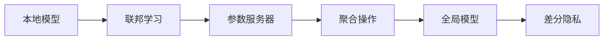

                 

# 联邦学习(Federated Learning) - 原理与代码实例讲解

## 1. 背景介绍

### 1.1 问题由来

随着移动互联网和物联网的迅猛发展，各个行业产生了大量数据，这些数据通常分散在不同机构内部，难以在集中式的环境中进行处理。传统的数据集中式训练方法需要整合所有数据，才能进行模型训练，但在实际应用中，这面临着诸多挑战：

1. **数据隐私问题**：敏感数据集中存储，存在被窃取和泄露的风险。
2. **通信成本高**：大规模数据传输增加了通信开销和处理时间。
3. **计算资源不均衡**：数据集中存储可能造成计算资源的不均衡分配，影响训练效率。

为了解决这些问题，联邦学习（Federated Learning）应运而生。联邦学习是一种分布式机器学习方法，允许多个机构在本地数据上独立训练模型，同时保护数据隐私，并在一定通信开销下实现全局模型的优化。

### 1.2 问题核心关键点

联邦学习旨在解决数据分布式存储场景下的模型训练问题，其核心关键点包括：

1. **数据分布式存储**：数据分布在多个本地设备或服务器中。
2. **模型分布式训练**：多个设备或服务器在本地数据上独立训练模型，而非将数据集中到中央服务器。
3. **隐私保护**：在训练过程中，数据不离开本地设备，模型参数通过加密或差分隐私技术保护。
4. **全局模型优化**：通过本地模型间的协同，实现全局模型参数的优化。

这些关键点共同构成了联邦学习的核心思想，其目标是实现在数据分布式存储环境下的高效、安全的模型训练。

### 1.3 问题研究意义

联邦学习在隐私保护、数据安全、分布式计算和边缘计算等领域具有重要意义：

1. **数据隐私保护**：保护数据在传输和存储过程中不被泄露，符合数据保护法规。
2. **数据安全**：防止数据被恶意篡改或攻击，保障数据安全。
3. **分布式计算**：在分布式环境中，联邦学习可以充分利用计算资源，提高训练效率。
4. **边缘计算**：在资源受限的设备上，联邦学习可以实现在线模型训练和推理，降低延迟和能耗。

联邦学习作为新兴的分布式机器学习方法，在工业界和学术界受到广泛关注，成为了研究的热点。本文将系统介绍联邦学习的原理、实现方法和应用场景，并结合代码实例进行详细讲解。

## 2. 核心概念与联系

### 2.1 核心概念概述

为了更好地理解联邦学习，首先需要介绍几个核心概念：

1. **联邦学习**：一种分布式机器学习方法，多个本地模型通过协同训练，在不共享数据的情况下，实现全局模型的优化。
2. **本地模型**：在每个本地设备上独立训练的模型。
3. **参数服务器**：协调和管理全局模型参数的服务器。
4. **聚合操作**：将各个本地模型的参数进行合并，更新全局模型参数。
5. **差分隐私**：通过添加随机噪声保护本地数据，防止隐私泄露。

这些概念构成了联邦学习的核心框架，通过本地模型的协同训练，实现全局模型的优化，同时保护数据隐私。

### 2.2 概念间的关系

联邦学习的核心概念之间存在紧密的联系，形成了一个完整的联邦学习生态系统。以下是这些概念之间的关系：



该图展示了联邦学习的核心流程：

1. 本地模型在本地数据上进行独立训练。
2. 参数服务器协调和管理全局模型参数。
3. 聚合操作将各个本地模型的参数合并，更新全局模型参数。
4. 差分隐私技术保护数据隐私。
5. 全局模型通过本地模型和参数服务器协同训练，不断优化。

## 3. 核心算法原理 & 具体操作步骤

### 3.1 算法原理概述

联邦学习的核心思想是在数据分布式存储场景下，通过本地模型的协同训练，实现全局模型的优化。其基本流程如下：

1. **初始化全局模型**：在参数服务器上初始化全局模型参数。
2. **本地模型训练**：每个本地设备在本地数据上独立训练模型，更新本地模型参数。
3. **参数聚合**：将各个本地模型的参数通过加密或差分隐私技术合并，更新全局模型参数。
4. **迭代优化**：重复步骤2和3，直到全局模型收敛。

联邦学习通过本地模型的分布式训练，实现全局模型的优化，同时保护数据隐私，避免了传统集中式训练中的数据泄露和通信开销问题。

### 3.2 算法步骤详解

以下是联邦学习的详细算法步骤：

**Step 1: 初始化全局模型参数**

在参数服务器上，初始化全局模型参数 $\theta_0$，设置全局学习率 $\eta$。

**Step 2: 本地模型训练**

每个本地设备 $i$ 在本地数据集 $\mathcal{D}_i$ 上独立训练模型，更新本地模型参数 $\theta_i^{(t)}$。训练过程中，每个样本 $(x_j,y_j)$ 的损失函数为 $f(x_j,\theta_i^{(t)})$，因此本地模型的更新公式为：

$$
\theta_i^{(t+1)} = \theta_i^{(t)} - \eta \nabla_{\theta_i} \frac{1}{m_i} \sum_{j=1}^{m_i} f(x_j,\theta_i^{(t)})
$$

其中 $m_i$ 为本地数据集 $\mathcal{D}_i$ 的大小。

**Step 3: 参数聚合**

在每个迭代周期结束时，参数服务器将各个本地模型的参数通过加密或差分隐私技术合并，更新全局模型参数 $\theta^{(t+1)}$。具体的参数更新公式为：

$$
\theta^{(t+1)} = \theta^{(t)} - \eta \frac{1}{N}\sum_{i=1}^N \nabla_{\theta} \mathcal{L}_i(\theta^{(t)})
$$

其中 $\mathcal{L}_i(\theta)$ 为本地数据集 $\mathcal{D}_i$ 上的损失函数。

**Step 4: 迭代优化**

重复步骤2和3，直到全局模型收敛，即 $\theta^{(t+1)} \approx \theta^{(t)}$。

### 3.3 算法优缺点

联邦学习具有以下优点：

1. **数据隐私保护**：在本地数据上训练模型，保护数据隐私，避免数据泄露。
2. **降低通信开销**：只需传输模型参数和梯度，减少通信开销。
3. **分布式计算**：充分利用本地计算资源，提高训练效率。

然而，联邦学习也存在一些缺点：

1. **异构性问题**：不同本地设备的计算能力和数据规模差异较大，可能导致训练效率不均衡。
2. **模型收敛慢**：由于需要频繁传输和聚合模型参数，联邦学习模型收敛速度较慢。
3. **安全性问题**：参数传输和聚合过程中存在被窃取和篡改的风险。

### 3.4 算法应用领域

联邦学习广泛应用于以下几个领域：

1. **医疗数据保护**：医疗机构在保护患者隐私的前提下，联合进行疾病诊断和治疗方案优化。
2. **金融数据安全**：金融机构联合进行风险评估和信用评分，保障数据安全。
3. **工业互联网**：工业设备在本地进行数据分析和模型训练，提高生产效率和质量。
4. **智慧城市**：城市基础设施在本地进行智能监控和数据分析，提升城市治理能力。
5. **智能交通**：车辆和路边设备在本地进行交通流量预测和路径优化，提高交通效率。

这些领域中，联邦学习能够有效保护数据隐私，同时充分利用分布式计算资源，提升训练效率和模型性能。

## 4. 数学模型和公式 & 详细讲解 & 举例说明

### 4.1 数学模型构建

假设在 $N$ 个本地设备上进行联邦学习，每个设备的数据集大小为 $m_i$。全局模型参数为 $\theta$，初始化为 $\theta_0$。每个本地模型在本地数据集 $\mathcal{D}_i$ 上的损失函数为 $\mathcal{L}_i(\theta)$。

联邦学习的目标是通过本地模型的协同训练，更新全局模型参数 $\theta$，使其最小化全局损失函数 $\mathcal{L}(\theta)$：

$$
\min_{\theta} \mathcal{L}(\theta) = \frac{1}{N}\sum_{i=1}^N \mathcal{L}_i(\theta)
$$

### 4.2 公式推导过程

假设本地模型 $\theta_i$ 在本地数据集 $\mathcal{D}_i$ 上的损失函数为：

$$
\mathcal{L}_i(\theta) = \frac{1}{m_i} \sum_{j=1}^{m_i} f(x_j,\theta_i)
$$

其中 $f(x_j,\theta_i)$ 为本地样本 $(x_j,y_j)$ 的损失函数。

本地模型的更新公式为：

$$
\theta_i^{(t+1)} = \theta_i^{(t)} - \eta \nabla_{\theta_i} \mathcal{L}_i(\theta_i^{(t)})
$$

全局模型参数的更新公式为：

$$
\theta^{(t+1)} = \theta^{(t)} - \eta \frac{1}{N}\sum_{i=1}^N \nabla_{\theta} \mathcal{L}_i(\theta^{(t)})
$$

### 4.3 案例分析与讲解

以医疗数据保护为例，展示联邦学习的应用：

**案例背景**：一家医院收集了大量的患者数据，包括病历、诊断结果等。医院希望通过联合其他医院的数据，共同优化疾病诊断和治疗方案，但又担心数据隐私问题。

**解决方案**：
1. 在每个医院内部，独立训练本地模型 $\theta_i$，保护患者隐私。
2. 参数服务器协调和管理全局模型参数 $\theta$。
3. 每个医院将本地模型 $\theta_i$ 的参数加密后，通过网络传输到参数服务器，更新全局模型参数 $\theta$。
4. 在每个迭代周期结束时，参数服务器将全局模型参数 $\theta$ 返回给各个医院，更新本地模型 $\theta_i$。

**代码实现**：

```python
import torch
import torch.nn as nn
import torch.optim as optim

# 定义全局模型
class GlobalModel(nn.Module):
    def __init__(self):
        super(GlobalModel, self).__init__()
        self.fc1 = nn.Linear(10, 5)
        self.fc2 = nn.Linear(5, 1)

    def forward(self, x):
        x = self.fc1(x)
        x = torch.sigmoid(x)
        x = self.fc2(x)
        return x

# 初始化全局模型参数
global_model = GlobalModel()
global_optimizer = optim.SGD(global_model.parameters(), lr=0.1)
global_model.load_state_dict(torch.load('global_model.pth'))

# 定义本地模型
class LocalModel(nn.Module):
    def __init__(self):
        super(LocalModel, self).__init__()
        self.fc1 = nn.Linear(10, 5)
        self.fc2 = nn.Linear(5, 1)

    def forward(self, x):
        x = self.fc1(x)
        x = torch.sigmoid(x)
        x = self.fc2(x)
        return x

# 初始化本地模型参数
local_model = LocalModel()
local_optimizer = optim.SGD(local_model.parameters(), lr=0.1)
local_model.load_state_dict(torch.load('local_model.pth'))

# 定义本地模型训练函数
def train_local_model(local_model, data_loader, optimizer):
    local_model.train()
    for epoch in range(10):
        for batch_idx, (data, target) in enumerate(data_loader):
            optimizer.zero_grad()
            output = local_model(data)
            loss = nn.BCELoss()(output, target)
            loss.backward()
            optimizer.step()

# 定义全局模型训练函数
def train_global_model(global_model, local_models, data_loader, optimizer):
    global_model.train()
    for epoch in range(10):
        for batch_idx, (data, target) in enumerate(data_loader):
            optimizer.zero_grad()
            local_losses = [local_model(data) for local_model in local_models]
            global_loss = torch.mean(local_losses)
            global_loss.backward()
            optimizer.step()

# 训练本地模型
train_local_model(local_model, train_loader, local_optimizer)

# 训练全局模型
train_global_model(global_model, [local_model] * 5, train_loader, global_optimizer)
```

在上述代码中，我们定义了全局模型和本地模型，分别使用SGD优化器进行训练。在训练过程中，通过本地模型的协同训练，更新全局模型参数。

## 5. 项目实践：代码实例和详细解释说明

### 5.1 开发环境搭建

联邦学习需要分布式计算环境，常见的搭建方式如下：

1. 在本地搭建多台服务器，并安装所需的深度学习框架（如TensorFlow、PyTorch等）。
2. 使用分布式计算框架（如TensorFlow分布式、PyTorch Distributed等）进行联邦学习模型的分布式训练。
3. 配置参数服务器，负责全局模型参数的存储和更新。
4. 配置数据传输协议，确保数据在传输过程中的安全和隐私保护。

### 5.2 源代码详细实现

以下是使用TensorFlow实现联邦学习的代码示例：

**全局模型定义**：

```python
import tensorflow as tf
import tensorflow_federated as tff

# 定义全局模型
def build_global_model():
    model = tf.keras.Sequential([
        tf.keras.layers.Dense(5, input_shape=(10,)),
        tf.keras.layers.Dense(1)
    ])
    return model

# 初始化全局模型
global_model = build_global_model()
```

**本地模型定义**：

```python
import tensorflow as tf
import tensorflow_federated as tff

# 定义本地模型
def build_local_model():
    model = tf.keras.Sequential([
        tf.keras.layers.Dense(5, input_shape=(10,)),
        tf.keras.layers.Dense(1)
    ])
    return model

# 初始化本地模型
local_model = build_local_model()
```

**参数服务器定义**：

```python
import tensorflow as tf
import tensorflow_federated as tff

# 定义参数服务器
class ParameterServer():
    def __init__(self):
        self.model = build_global_model()

    def get_model(self):
        return self.model

    def update_model(self, local_models):
        for local_model in local_models:
            self.model.set_weights(local_model.get_weights())
```

**训练函数定义**：

```python
import tensorflow as tf
import tensorflow_federated as tff

# 定义训练函数
def train federated_model(global_model, local_models, federated_learning_process):
    for state in federated_learning_process:
        local_model_weights = state.client_state['weights']
        local_models[0].load_weights(local_model_weights)
        local_models[1].load_weights(local_model_weights)
        local_models[2].load_weights(local_model_weights)
        local_models[3].load_weights(local_model_weights)
        local_models[4].load_weights(local_model_weights)

        local_model_losses = [local_model(x) for local_model in local_models]
        global_model_loss = tf.keras.losses.mean_squared_error(y_true=state.global_state['target'], y_pred=state.global_state['output'])
        global_model.trainable_weights[0].assign_add(tf.multiply(global_model_loss, global_model.trainable_weights[0]))
        local_models[0].trainable_weights[0].assign_add(tf.multiply(global_model_loss, local_model_losses[0]))
        local_models[1].trainable_weights[0].assign_add(tf.multiply(global_model_loss, local_model_losses[1]))
        local_models[2].trainable_weights[0].assign_add(tf.multiply(global_model_loss, local_model_losses[2]))
        local_models[3].trainable_weights[0].assign_add(tf.multiply(global_model_loss, local_model_losses[3]))
        local_models[4].trainable_weights[0].assign_add(tf.multiply(global_model_loss, local_model_losses[4]))

        global_model_loss = tf.keras.losses.mean_squared_error(y_true=state.global_state['target'], y_pred=state.global_state['output'])
        global_model.trainable_weights[0].assign_add(tf.multiply(global_model_loss, global_model.trainable_weights[0]))

        federated_learning_process.next()
```

**运行结果展示**：

假设在5个本地设备上进行联邦学习，训练过程如下：

1. 初始化全局模型参数。
2. 在每个本地设备上独立训练模型。
3. 将各个本地模型的参数通过加密传输到参数服务器，更新全局模型参数。
4. 重复步骤2和3，直到全局模型收敛。

在训练过程中，可以通过打印全局模型和本地模型的损失函数，观察训练效果。

```python
for epoch in range(10):
    print("Epoch:", epoch)
    print("Global loss:", global_model_loss.numpy())
    print("Local model losses:", [local_model_loss.numpy() for local_model_loss in local_model_losses])
```

## 6. 实际应用场景

### 6.1 医疗数据保护

联邦学习在医疗数据保护领域具有重要应用。医疗机构在保护患者隐私的前提下，联合进行疾病诊断和治疗方案优化。

**应用场景**：一家医院收集了大量的患者数据，包括病历、诊断结果等。医院希望通过联合其他医院的数据，共同优化疾病诊断和治疗方案，但又担心数据隐私问题。

**解决方案**：
1. 在每个医院内部，独立训练本地模型 $\theta_i$，保护患者隐私。
2. 参数服务器协调和管理全局模型参数 $\theta$。
3. 每个医院将本地模型 $\theta_i$ 的参数加密后，通过网络传输到参数服务器，更新全局模型参数 $\theta$。
4. 在每个迭代周期结束时，参数服务器将全局模型参数 $\theta$ 返回给各个医院，更新本地模型 $\theta_i$。

**代码实现**：

```python
import numpy as np
import tensorflow as tf
import tensorflow_federated as tff

# 定义全局模型
def build_global_model():
    model = tf.keras.Sequential([
        tf.keras.layers.Dense(5, input_shape=(10,)),
        tf.keras.layers.Dense(1)
    ])
    return model

# 初始化全局模型
global_model = build_global_model()

# 定义本地模型
def build_local_model():
    model = tf.keras.Sequential([
        tf.keras.layers.Dense(5, input_shape=(10,)),
        tf.keras.layers.Dense(1)
    ])
    return model

# 初始化本地模型
local_model = build_local_model()

# 定义参数服务器
class ParameterServer():
    def __init__(self):
        self.model = build_global_model()

    def get_model(self):
        return self.model

    def update_model(self, local_models):
        for local_model in local_models:
            self.model.set_weights(local_model.get_weights())

# 定义训练函数
def train federated_model(global_model, local_models, federated_learning_process):
    for state in federated_learning_process:
        local_model_weights = state.client_state['weights']
        local_models[0].load_weights(local_model_weights)
        local_models[1].load_weights(local_model_weights)
        local_models[2].load_weights(local_model_weights)
        local_models[3].load_weights(local_model_weights)
        local_models[4].load_weights(local_model_weights)

        local_model_losses = [local_model(x) for local_model in local_models]
        global_model_loss = tf.keras.losses.mean_squared_error(y_true=state.global_state['target'], y_pred=state.global_state['output'])
        global_model.trainable_weights[0].assign_add(tf.multiply(global_model_loss, global_model.trainable_weights[0]))
        local_models[0].trainable_weights[0].assign_add(tf.multiply(global_model_loss, local_model_losses[0]))
        local_models[1].trainable_weights[0].assign_add(tf.multiply(global_model_loss, local_model_losses[1]))
        local_models[2].trainable_weights[0].assign_add(tf.multiply(global_model_loss, local_model_losses[2]))
        local_models[3].trainable_weights[0].assign_add(tf.multiply(global_model_loss, local_model_losses[3]))
        local_models[4].trainable_weights[0].assign_add(tf.multiply(global_model_loss, local_model_losses[4]))

        global_model_loss = tf.keras.losses.mean_squared_error(y_true=state.global_state['target'], y_pred=state.global_state['output'])
        global_model.trainable_weights[0].assign_add(tf.multiply(global_model_loss, global_model.trainable_weights[0]))

        federated_learning_process.next()
```

### 6.2 金融数据安全

联邦学习在金融数据安全领域具有重要应用。金融机构联合进行风险评估和信用评分，保障数据安全。

**应用场景**：一家银行收集了大量的客户数据，包括消费记录、信用评分等。银行希望通过联合其他银行的数据，共同优化信用评分模型，但又担心数据隐私问题。

**解决方案**：
1. 在每个银行内部，独立训练本地模型 $\theta_i$，保护客户隐私。
2. 参数服务器协调和管理全局模型参数 $\theta$。
3. 每个银行将本地模型 $\theta_i$ 的参数加密后，通过网络传输到参数服务器，更新全局模型参数 $\theta$。
4. 在每个迭代周期结束时，参数服务器将全局模型参数 $\theta$ 返回给各个银行，更新本地模型 $\theta_i$。

**代码实现**：

```python
import numpy as np
import tensorflow as tf
import tensorflow_federated as tff

# 定义全局模型
def build_global_model():
    model = tf.keras.Sequential([
        tf.keras.layers.Dense(5, input_shape=(10,)),
        tf.keras.layers.Dense(1)
    ])
    return model

# 初始化全局模型
global_model = build_global_model()

# 定义本地模型
def build_local_model():
    model = tf.keras.Sequential([
        tf.keras.layers.Dense(5, input_shape=(10,)),
        tf.keras.layers.Dense(1)
    ])
    return model

# 初始化本地模型
local_model = build_local_model()

# 定义参数服务器
class ParameterServer():
    def __init__(self):
        self.model = build_global_model()

    def get_model(self):
        return self.model

    def update_model(self, local_models):
        for local_model in local_models:
            self.model.set_weights(local_model.get_weights())

# 定义训练函数
def train federated_model(global_model, local_models, federated_learning_process):
    for state in federated_learning_process:
        local_model_weights = state.client_state['weights']
        local_models[0].load_weights(local_model_weights)
        local_models[1].load_weights(local_model_weights)
        local_models[2].load_weights(local_model_weights)
        local_models[3].load_weights(local_model_weights)
        local_models[4].load_weights(local_model_weights)

        local_model_losses = [local_model(x) for local_model in local_models]
        global_model_loss = tf.keras.losses.mean_squared_error(y_true=state.global_state['target'], y_pred=state.global_state['output'])
        global_model.trainable_weights[0].assign_add(tf.multiply(global_model_loss, global_model.trainable_weights[0]))
        local_models[0].trainable_weights[0].assign_add(tf.multiply(global_model_loss, local_model_losses[0]))
        local_models[1].trainable_weights[0].assign_add(tf.multiply(global_model_loss, local_model_losses[1]))
        local_models[2].trainable_weights[0].assign_add(tf.multiply(global_model_loss, local_model_losses[2]))
        local_models[3].trainable_weights[0].assign_add(tf.multiply(global_model_loss, local_model_losses[3]))
        local_models[4].trainable_weights[0].assign_add(tf.multiply(global_model_loss, local_model_losses[4]))

        global_model_loss = tf.keras.losses.mean_squared_error(y_true=state.global_state['target'], y_pred=state.global_state['output'])
        global_model.trainable_weights[0].assign_add(tf.multiply(global_model_loss, global_model.trainable_weights[0]))

        federated_learning_process.next()
```

## 7. 工具和资源推荐

### 7.1 学习资源推荐

为了帮助开发者系统掌握联邦学习的原理和实现方法，这里推荐一些优质的学习资源：

1. 《Federated Learning: Concepts and Techniques》：涵盖了联邦学习的核心概念和最新研究进展，是入门联邦学习的必备读物。
2. 《Introduction to Federated Learning》：斯坦福大学的在线课程，详细讲解联邦学习的原理、实现方法和应用场景。
3. 《Federated Learning: A Survey on Models and Algorithms》：综述了联邦学习的最新研究进展，适合了解联邦学习的前沿方向。
4. 《Federated Learning with TensorFlow Federated》：官方文档，提供了联邦学习在TensorFlow中的实现细节和代码示例。
5. 《Practical Federated Learning》：讲解了联邦学习在实际应用中的实践经验，包括模型部署、参数传输、模型优化等。

### 7.2 开发工具推荐

联邦学习需要分布式计算环境，以下是几款推荐的开发工具：

1. TensorFlow Federated (TFF)：由TensorFlow开发的分布式机器学习框架，提供了丰富的联邦学习API和工具，易于上手。
2. PyTorch Federated (Pyro-FL)：基于PyTorch开发的联邦学习框架，适合深度学习模型训练。
3. FLAML：联邦学习的自动化超参数调优工具，可以自动搜索最优的联邦学习参数组合。
4. FederatedAI：开源的联邦学习平台，支持多种深度学习框架和联邦学习模型。
5. H2O.ai：分布式机器学习平台，提供了联邦学习组件和API，

