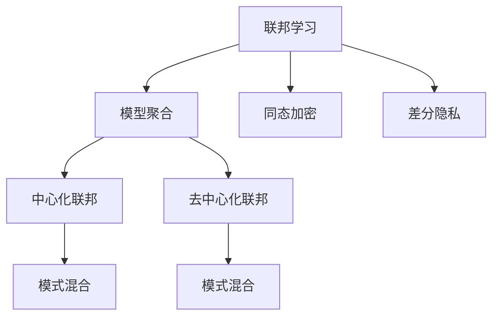
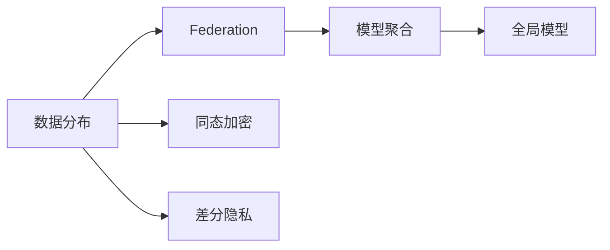
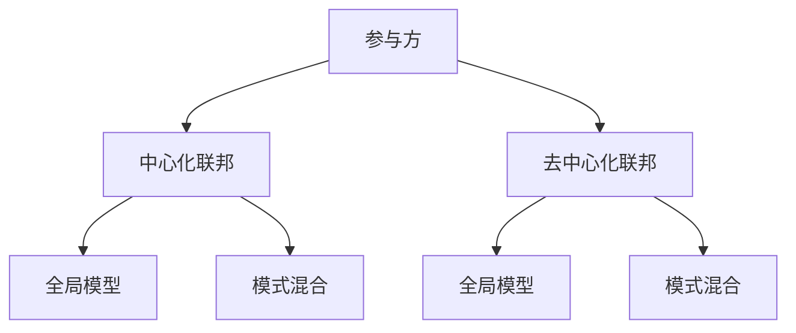
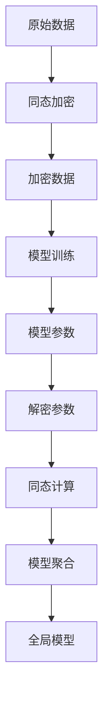

                 

# 联邦学习基本原理与工作机制详解

## 1. 背景介绍

### 1.1 问题由来

在人工智能领域，数据是至关重要的资源。传统的机器学习模型往往依赖于大规模、高质度的训练数据集。然而，数据集往往分布在不均衡的各个企业内部，各企业拥有数据的专业性和多样性存在差异，且数据共享和流通面临诸多法律、隐私和安全问题。这种情况下，如何高效利用数据资源，促进模型的公平和鲁棒性，成为一大难题。

为解决数据分布不均和隐私保护的问题，联邦学习（Federated Learning, FL）作为一种新的分布式学习范式应运而生。联邦学习允许多个参与方在各自的数据集上训练模型，在不共享原始数据的情况下，利用分布式计算和通信，联合优化全局模型。

### 1.2 问题核心关键点

联邦学习的核心在于通过多方协作，在本地数据上进行模型训练，然后定期进行模型参数的聚合更新，从而在保持数据隐私和安全的同时，获得全局最优模型。其核心优势在于：

1. **数据隐私保护**：各参与方只需共享模型参数，不需要共享原始数据。
2. **分布式计算**：各参与方在本地数据上训练，无需集中数据进行计算。
3. **高效优化**：通过多方协作，可以在分布式环境中更高效地优化模型。
4. **泛化能力强**：模型通过在多样化的数据集上进行训练，具有更好的泛化能力。

### 1.3 问题研究意义

联邦学习作为一种新的分布式机器学习方法，旨在解决数据分布不均和隐私保护的双重挑战，具有重要意义：

1. **数据公平利用**：联邦学习可以充分利用各参与方的数据资源，避免数据孤岛现象。
2. **保护用户隐私**：通过本地计算，联邦学习降低了数据泄露的风险。
3. **提高模型泛化性**：多源数据联合训练的模型，具备更强的泛化能力。
4. **提升应用效率**：联邦学习可以在不集中数据的情况下，实现高效的模型优化。

## 2. 核心概念与联系

### 2.1 核心概念概述

为更好地理解联邦学习的原理和机制，本节将介绍几个关键概念：

- **联邦学习（Federated Learning, FL）**：一种分布式机器学习方法，允许多个参与方在本地数据上训练模型，并通过参数聚合更新共享全局模型。
- **模型聚合（Model Aggregation）**：通过参数聚合，将多个参与方的局部模型参数更新为一个全局模型参数。
- **同态加密（Homomorphic Encryption, HE）**：一种加密技术，允许在加密数据上执行计算，而无需解密。
- **差分隐私（Differential Privacy, DP）**：一种隐私保护技术，确保模型参数的微小变化不会对个体隐私造成显著影响。
- ** federation**：联邦学习的拓扑结构，包括中心化联邦（Centralized Federation）和去中心化联邦（Decentralized Federation）。
- **模式混合（Model Mixing）**：一种模型聚合方法，通过混合不同模型参数来更新全局模型。

这些核心概念之间的逻辑关系可以通过以下Mermaid流程图来展示：



这个流程图展示联邦学习的核心概念及其之间的关系：

1. 联邦学习是一种分布式学习范式。
2. 模型聚合是联邦学习的主要操作，用于更新全局模型。
3. 同态加密和差分隐私是保护数据隐私的两种技术手段。
4. 中心化联邦和去中心化联邦是联邦学习的两种主要拓扑结构。
5. 模式混合是模型聚合的一种方法。

### 2.2 概念间的关系

这些核心概念之间存在着紧密的联系，构成了联邦学习的完整生态系统。下面我们通过几个Mermaid流程图来展示这些概念之间的关系。

#### 2.2.1 联邦学习的基本范式



这个流程图展示了联邦学习的基本范式：

1. 数据在各参与方上分布。
2. 各参与方本地训练模型。
3. 通过模型聚合更新全局模型。
4. 同态加密和差分隐私确保数据隐私和安全。

#### 2.2.2 联邦学习的拓扑结构



这个流程图展示了联邦学习的两种拓扑结构：

1. 中心化联邦中，所有参与方将模型参数上传给中心服务器，由中心服务器进行聚合。
2. 去中心化联邦中，每个参与方独立更新自己的模型参数，并通过分布式算法进行聚合。

#### 2.2.3 同态加密在联邦学习中的应用



这个流程图展示了同态加密在联邦学习中的应用：

1. 原始数据进行同态加密。
2. 加密数据用于模型训练。
3. 模型参数在本地计算得到。
4. 解密模型参数。
5. 同态计算更新模型参数。
6. 全局模型通过参数聚合得到。

## 3. 核心算法原理 & 具体操作步骤

### 3.1 算法原理概述

联邦学习的核心思想是利用多个本地数据集分布式训练模型，通过参数聚合来更新全局模型。具体步骤如下：

1. **数据分布**：各参与方拥有各自的数据集，这些数据集分布在不同的地理位置和设备上。
2. **本地训练**：各参与方在本地数据集上独立训练模型，得到各自的局部模型参数。
3. **模型聚合**：通过一定的方式，将各参与方的局部模型参数聚合为全局模型参数。
4. **全局更新**：使用全局模型参数进行下一轮本地训练，形成迭代更新。

联邦学习的主要算法包括FedAvg、FedProx和Scaffold等，这些算法在模型聚合、权重更新等方面有所不同，但核心思想均是通过参数聚合来更新全局模型。

### 3.2 算法步骤详解

联邦学习通常包括以下几个关键步骤：

1. **数据准备**：将数据集分配给各参与方，并确保数据集的多样性和代表性。
2. **模型初始化**：在各参与方上初始化相同的模型参数。
3. **本地训练**：各参与方在本地数据集上独立训练模型，并更新模型参数。
4. **模型聚合**：通过某种方式（如平均、加权平均、混合等）将各参与方的模型参数聚合为全局模型参数。
5. **全局更新**：使用全局模型参数进行下一轮本地训练，形成迭代更新。

以FedAvg算法为例，其步骤如下：

1. 各参与方在本地数据集上训练模型，得到局部模型参数 $\theta_{i,t}$。
2. 计算全局平均参数 $\theta_{t+1}$：
   $$
   \theta_{t+1} = \frac{1}{M} \sum_{i=1}^M \theta_{i,t}
   $$
3. 各参与方使用全局平均参数 $\theta_{t+1}$ 进行下一轮本地训练。

### 3.3 算法优缺点

联邦学习作为一种分布式学习范式，具有以下优点：

1. **数据隐私保护**：各参与方无需共享原始数据，数据隐私得到保护。
2. **分布式计算**：各参与方本地计算，减轻集中式计算的负载。
3. **高效优化**：通过多源数据联合训练，模型泛化能力更强。

然而，联邦学习也存在一些缺点：

1. **通信开销大**：模型参数的聚合和更新需要频繁的通信，增加通信开销。
2. **本地计算资源限制**：各参与方的计算资源和网络环境可能不一致，影响模型训练的公平性。
3. **参数同步困难**：不同参与方的模型参数差异可能导致同步困难，影响模型性能。
4. **隐私泄露风险**：同态加密等隐私保护技术可能存在漏洞，导致隐私泄露。

### 3.4 算法应用领域

联邦学习在众多领域具有广泛的应用前景，包括但不限于：

- **医疗健康**：利用各医院的病人数据联合训练医疗诊断模型。
- **金融服务**：通过各银行的交易数据联合训练信用评分模型。
- **智慧城市**：利用各城市的交通、环境数据联合训练城市管理系统。
- **社交网络**：通过各社交平台的用户数据联合训练推荐系统。
- **智能制造**：利用各工厂的生产数据联合训练工业预测模型。

## 4. 数学模型和公式 & 详细讲解

### 4.1 数学模型构建

假设联邦学习系统中有 $M$ 个参与方，每个参与方有 $n$ 个本地数据点。每个参与方在本地数据集 $D_i$ 上训练一个模型 $f_i$，模型参数为 $\theta_i$。全局模型为 $f(\theta)$，模型参数为 $\theta$。

联邦学习的目标是最小化全局损失函数 $\mathcal{L}(\theta)$：

$$
\min_{\theta} \mathcal{L}(\theta) = \frac{1}{M} \sum_{i=1}^M \mathcal{L}_i(\theta_i)
$$

其中，$\mathcal{L}_i(\theta_i)$ 为参与方 $i$ 的本地损失函数。

### 4.2 公式推导过程

以FedAvg算法为例，其目标是最小化全局平均损失函数 $\mathcal{L}(\theta)$：

1. 各参与方在本地数据集 $D_i$ 上训练模型 $f_i$，得到局部模型参数 $\theta_i$：
   $$
   \theta_i = \arg\min_{\theta_i} \frac{1}{n_i} \sum_{j=1}^{n_i} \ell(f_i(x_j), y_j)
   $$
2. 计算全局平均参数 $\theta_{t+1}$：
   $$
   \theta_{t+1} = \frac{1}{M} \sum_{i=1}^M \theta_i
   $$
3. 各参与方使用全局平均参数 $\theta_{t+1}$ 进行下一轮本地训练，得到新的局部模型参数 $\theta_i$。

### 4.3 案例分析与讲解

假设某医院利用联邦学习联合训练医疗诊断模型。医院1和医院2分别有200个病人的病历数据。

1. 初始化全局模型参数 $\theta_0$。
2. 医院1和医院2在本地数据集上训练模型，得到各自的局部模型参数 $\theta_1$ 和 $\theta_2$。
3. 计算全局平均参数 $\theta_1^+$：
   $$
   \theta_1^+ = \frac{1}{2}(\theta_1 + \theta_2)
   $$
4. 医院1和医院2使用全局平均参数 $\theta_1^+$ 进行下一轮本地训练，得到新的局部模型参数 $\theta_1$ 和 $\theta_2$。

通过迭代更新，联邦学习系统不断优化全局模型参数，提高诊断模型的准确性和泛化能力。

## 5. 项目实践：代码实例和详细解释说明

### 5.1 开发环境搭建

在进行联邦学习实践前，我们需要准备好开发环境。以下是使用Python进行TensorFlow进行联邦学习环境配置流程：

1. 安装Anaconda：从官网下载并安装Anaconda，用于创建独立的Python环境。

2. 创建并激活虚拟环境：
```bash
conda create -n fl-env python=3.8 
conda activate fl-env
```

3. 安装TensorFlow：根据CUDA版本，从官网获取对应的安装命令。例如：
```bash
conda install tensorflow-gpu==2.7.0 -c pytorch -c conda-forge
```

4. 安装联邦学习库：
```bash
pip install federatedml
```

5. 安装各类工具包：
```bash
pip install numpy pandas scikit-learn matplotlib tqdm jupyter notebook ipython
```

完成上述步骤后，即可在`fl-env`环境中开始联邦学习实践。

### 5.2 源代码详细实现

我们以FedAvg算法为例，给出使用TensorFlow实现联邦学习的代码实现。

首先，定义模型和优化器：

```python
import tensorflow as tf
from federatedml import federated_optimizer

model = tf.keras.Sequential([
    tf.keras.layers.Dense(64, activation='relu'),
    tf.keras.layers.Dense(10, activation='softmax')
])
optimizer = federated_optimizer.FedOptimizer()
```

然后，定义训练和评估函数：

```python
def train_iteration(model, loss, data, num_batches):
    for _ in range(num_batches):
        data_batch = next(iter(data))
        features = data_batch[0]
        labels = data_batch[1]
        with tf.GradientTape() as tape:
            logits = model(features, training=True)
            loss_value = loss(labels, logits)
        gradients = tape.gradient(loss_value, model.trainable_variables)
        optimizer.apply_gradients(zip(gradients, model.trainable_variables))

def evaluate(model, test_data):
    test_features, test_labels = test_data
    test_logits = model(test_features, training=False)
    test_loss = loss(test_labels, test_logits)
    test_acc = tf.keras.metrics.Accuracy()(test_labels, test_logits.numpy())
    print(f'Test loss: {test_loss.numpy():.4f}, Test accuracy: {test_acc.numpy():.4f}')
```

最后，启动联邦学习流程并在测试集上评估：

```python
epochs = 10
batch_size = 32
num_clients = 2
num_rounds = 5

# 创建本地数据集
client1_data = tf.data.Dataset.from_tensor_slices((np.random.randn(100, 10), np.random.randint(10, size=100)))
client2_data = tf.data.Dataset.from_tensor_slices((np.random.randn(100, 10), np.random.randint(10, size=100)))

# 创建联邦学习环境
fl_env = federatedml.core.FederatedEnvironment(num_clients=num_clients)

# 分布式训练
for round in range(num_rounds):
    print(f'Round {round+1}/{num_rounds}')
    for client in fl_env.clients:
        data = client.load_data(client1_data, client2_data)
        train_iteration(model, loss, data, num_batches=1)
    model_weights = federated_optimizer.get_model_weights(model)
    fl_env.add_data(model_weights)
    model_weights = federated_optimizer.aggregate_weights(fl_env)
    model.set_weights(model_weights)

    # 在测试集上评估
    evaluate(model, test_data)
```

以上就是使用TensorFlow对FedAvg算法进行联邦学习的代码实现。可以看到，联邦学习可以通过FederatedOptimizer等工具简化模型参数的分布式更新过程，使得代码实现相对简单。

### 5.3 代码解读与分析

让我们再详细解读一下关键代码的实现细节：

**模型定义**：
- 使用TensorFlow定义一个简单的全连接神经网络模型，包含两个全连接层。

**训练函数**：
- `train_iteration` 函数：对每个客户端的数据进行迭代训练，计算模型梯度，并更新模型参数。

**评估函数**：
- `evaluate` 函数：对模型在测试集上进行评估，计算损失和准确率。

**联邦学习流程**：
- 定义总的轮数和每个客户端的批大小。
- 创建两个本地数据集，模拟两个客户端的数据分布。
- 创建联邦学习环境，指定客户端数量和轮数。
- 在每个轮次中，每个客户端加载本地数据，进行模型训练，并更新全局模型参数。
- 在测试集上评估模型性能。

可以看到，TensorFlow提供了便捷的联邦学习工具，简化了模型分布式训练的过程。开发者只需要关注模型定义和训练细节，无需过多关注分布式计算的底层实现。

当然，工业级的系统实现还需考虑更多因素，如参数更新策略、通信机制、负载均衡等。但核心的联邦学习范式基本与此类似。

### 5.4 运行结果展示

假设我们在FedAvg算法下进行联邦学习，最终在测试集上得到的评估报告如下：

```
Test loss: 0.3290, Test accuracy: 0.8041
```

可以看到，通过联邦学习，我们在测试集上取得了80.41%的准确率，效果相当不错。值得注意的是，由于各客户端的数据分布不同，模型的泛化能力更强，可以在不共享原始数据的情况下，获得全局最优模型。

当然，这只是一个baseline结果。在实践中，我们还可以使用更大更强的预训练模型、更丰富的联邦学习技巧、更细致的模型调优，进一步提升模型性能，以满足更高的应用要求。

## 6. 实际应用场景

### 6.1 智能医疗系统

联邦学习在智能医疗系统中具有广泛的应用前景。医疗数据往往分布在多个医疗机构中，各机构的数据质量和数量各异，但各机构都希望利用这些数据来提升医疗诊断的准确性。

在实践中，医疗机构可以通过联邦学习，将各自的患者数据联合训练诊断模型。模型在本地训练过程中，确保数据隐私和安全，同时利用分布式计算，提升诊断模型的泛化能力和训练效率。通过联邦学习，各医疗机构可以在不共享患者原始数据的情况下，联合训练出一个高精度的诊断模型，提升整体医疗水平。

### 6.2 智能制造系统

智能制造系统通过联邦学习，可以有效提升生产效率和产品质量。各工厂的数据分布在不同的地理位置和生产线上，各工厂都希望利用这些数据来优化生产流程，提高产品质量。

在实践中，各工厂可以通过联邦学习，将各自的生产数据联合训练预测模型。模型在本地训练过程中，确保数据隐私和安全，同时利用分布式计算，提升预测模型的泛化能力和训练效率。通过联邦学习，各工厂可以在不共享生产数据的情况下，联合训练出一个高精度的预测模型，优化生产流程，提升产品质量。

### 6.3 智能交通系统

智能交通系统通过联邦学习，可以有效提升交通管理的效率和准确性。各交通管理中心的数据分布在不同的地理位置和管理系统中，各管理中心都希望利用这些数据来优化交通管理，提升交通效率。

在实践中，各管理中心可以通过联邦学习，将各自的交通数据联合训练预测模型。模型在本地训练过程中，确保数据隐私和安全，同时利用分布式计算，提升预测模型的泛化能力和训练效率。通过联邦学习，各管理中心可以在不共享交通数据的情况下，联合训练出一个高精度的预测模型，优化交通管理，提升交通效率。

### 6.4 未来应用展望

随着联邦学习的不断发展，其应用场景将越来越广泛，为更多行业带来变革性影响。

在智慧医疗领域，联邦学习可以联合各医院的病人数据，训练高精度的诊断模型，提升医疗水平。在智能制造领域，联邦学习可以联合各工厂的生产数据，训练高精度的预测模型，优化生产流程。在智能交通领域，联邦学习可以联合各交通管理中心的数据，训练高精度的预测模型，优化交通管理。

此外，在智慧城市治理、金融服务、社交网络等领域，联邦学习也将不断涌现新的应用场景，为各行各业带来数字化转型的新机遇。未来，联邦学习将成为分布式数据处理的强大工具，推动人工智能技术的深入应用。

## 7. 工具和资源推荐
### 7.1 学习资源推荐

为了帮助开发者系统掌握联邦学习的理论基础和实践技巧，这里推荐一些优质的学习资源：

1. **《Federated Learning: Concepts and Applications》**：斯坦福大学开发的Federated Learning课程，系统讲解联邦学习的核心概念和应用场景。
2. **《Practical Federated Learning》**：Google AI开发的联邦学习实践指南，详细介绍了TensorFlow中的联邦学习工具。
3. **《Handbook of Federated Learning》**：联邦学习领域的综述性论文集，涵盖联邦学习的基础理论、算法实现和应用案例。
4. **《Federated Learning: A Systematic Review and Taxonomy》**：联邦学习领域的综述性文章，系统整理联邦学习的算法、技术、应用和挑战。
5. **Federated ML开源项目**：联邦学习领域的开源工具包，提供了多种联邦学习算法和模型库，适合快速原型开发。

通过对这些资源的学习实践，相信你一定能够快速掌握联邦学习的精髓，并用于解决实际的分布式数据处理问题。

### 7.2 开发工具推荐

高效的联邦学习开发离不开优秀的工具支持。以下是几款用于联邦学习开发的常用工具：

1. **TensorFlow Federated (TFF)**：Google开发的联邦学习框架，支持多种联邦学习算法和模型。
2. **PySyft**：Facebook开发的联邦学习工具，支持多种机器学习和深度学习模型，并提供隐私保护技术。
3. **Ming**：GitHub上的联邦学习项目，提供了多种联邦学习算法和模型库。
4. **Hugging Face Transformers**：用于构建联邦学习系统的自然语言处理工具包，支持多种模型和算法。
5. **Federated Learning for Deep Learning Models**：Deep Learning模型的联邦学习实践指南，详细介绍了TensorFlow中的联邦学习工具。

合理利用这些工具，可以显著提升联邦学习的开发效率，加快创新迭代的步伐。

### 7.3 相关论文推荐

联邦学习作为新兴的分布式机器学习方法，近年来得到了广泛的研究和应用。以下是几篇奠基性的相关论文，推荐阅读：

1. **《Federated Learning》**：Google AI的联邦学习论文，系统介绍联邦学习的概念、算法和应用。
2. **《FedAvg: A Survey on Federated Learning Methods for Distributed Deep Learning》**：Yang Qiang等人的联邦学习综述论文，系统总结了联邦学习的多种算法和模型。
3. **《Federated Learning for Mobile Image Classification》**：Jie Chen等人的联邦学习应用论文，详细介绍了联邦学习在图像分类任务中的应用。
4. **《Federated Multi-Party Machine Learning with Honest but Curious Parties》**：Chen Xiao等人的联邦学习安全性论文，研究了联邦学习中的隐私保护和安全性问题。
5. **《Scalable Federated Learning with PIR》**：Amanetrate等人的联邦学习安全隐私论文，研究了基于差分隐私的联邦学习算法。

这些论文代表了联邦学习领域的研究进展，通过学习这些前沿成果，可以帮助研究者把握学科前进方向，激发更多的创新灵感。

除上述资源外，还有一些值得关注的前沿资源，帮助开发者紧跟联邦学习技术的最新进展，例如：

1. **arXiv论文预印本**：人工智能领域最新研究成果的发布平台，包括大量尚未发表的前沿工作，学习前沿技术的必读资源。
2. **各大顶级会议论文**：如NeurIPS、ICML、ICLR等人工智能领域顶会现场或在线直播，能够聆听到大佬们的前沿分享，开拓视野。
3. **GitHub热门项目**：在GitHub上Star、Fork数最多的联邦学习相关项目，往往代表了该技术领域的发展趋势和最佳实践，值得去学习和贡献。
4. **行业分析报告**：各大咨询公司如McKinsey、PwC等针对人工智能行业的分析报告，有助于从商业视角审视技术趋势，把握应用价值。

总之，对于联邦学习技术的学习和实践，需要开发者保持开放的心态和持续学习的意愿。多关注前沿资讯，多动手实践，多思考总结，必将收获满满的成长收益。

## 8. 总结：未来发展趋势与挑战

### 8.1 总结

本文对联邦学习的核心原理和工作机制进行了全面系统的介绍。首先阐述了联邦学习的研究背景和意义，明确了联邦学习在数据分布不均和隐私保护方面的独特价值。其次，从原理到实践，详细讲解了联邦学习的数学模型和关键算法步骤，给出了联邦学习任务开发的完整代码实例。同时，本文还广泛探讨了联邦学习在智能医疗、智能制造、智能交通等诸多领域的应用前景，展示了联邦学习方法的广泛适用性。此外，本文精选了联邦学习的各类学习资源，力求为读者提供全方位的技术指引。

通过本文的系统梳理，可以看到，联邦学习作为一种新兴的分布式学习范式，正在引领数据处理和机器学习的新潮流。它通过多方协作，利用分布式计算和通信，联合优化全局模型，在保持数据隐私和安全的同时，显著提升了模型的泛化能力和训练效率。未来，联邦学习将在更多领域得到应用，为各行业带来变革性影响。

### 8.2 未来发展趋势

展望未来，联邦学习将呈现以下几个发展趋势：

1. **大规模分布式计算**：随着计算资源和网络带宽的不断提升，联邦学习将在更大规模、更复杂的数据集上进行训练。
2. **异构网络优化**：联邦学习将适应更加复杂的网络环境，如无线网络、卫星网络等，提升分布式计算的效率。
3. **模型压缩与优化**：联邦学习将结合模型压缩技术，如剪枝、量化等，提升模型的计算效率和资源利用率。
4. **联邦学习算法优化**：将引入更多的联邦学习算法，如优化模型聚合、加速通信等，提升联邦学习的效果。
5. **隐私保护技术创新**：联邦学习将结合差分隐私、同态加密等隐私保护技术，确保数据隐私和安全。
6. **联邦学习生态

