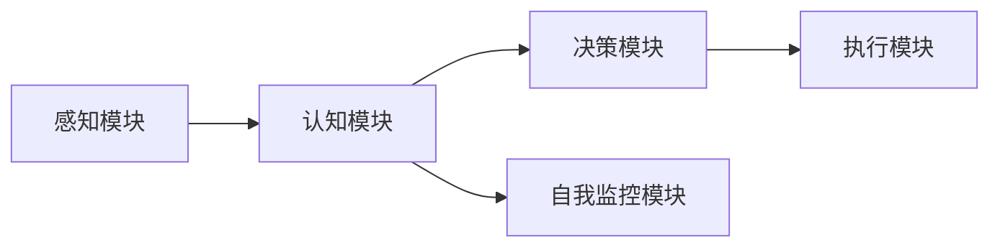
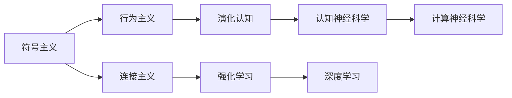
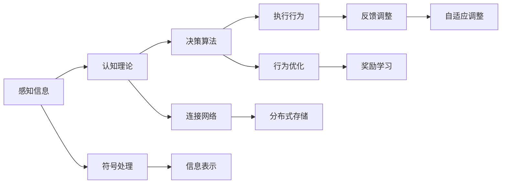
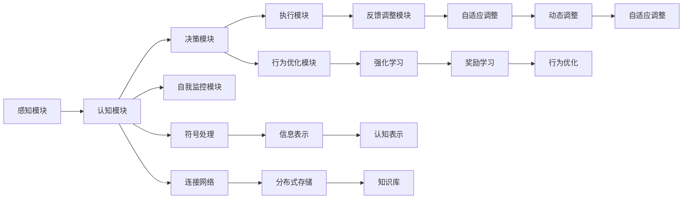

                 

# 自主系统视角下的意识功能

> 关键词：自主系统,意识功能,认知理论,人工智能,人类智能,智能体

## 1. 背景介绍

### 1.1 问题由来
在人工智能(AI)的发展历程中，自主系统(Autonomous Systems)成为了一个重要的研究方向。自主系统指的是能够在无人类干预下自主决策、执行任务的系统。从自动驾驶汽车、无人机，到工业自动化生产线，再到智能家居和医疗机器人，自主系统的应用范围日益广泛，对社会生活的影响也日益加深。

意识的讨论长期以来一直伴随着人工智能的发展。著名物理学家费米(Fermi)曾提出著名的费米悖论：“如果宇宙中存在大量智能生命，为什么我们至今未能接触过任何外星文明？”其中一个可能的解释是，这些智能生命可能早已具备了某种形式的意识或智能，但由于我们缺乏对其意识的充分理解，无法进行有效沟通。

因此，从自主系统的视角出发，理解意识的本质及其在自主决策中的应用，对于构建更高级的智能系统具有重要意义。本文旨在探讨自主系统中的意识功能，分析其在决策和执行任务中的作用和机制。

### 1.2 问题核心关键点
自主系统中的意识功能，主要是指自主决策和执行任务过程中，智能体所表现出的自我认知、目标设定、策略规划、自我监控和调整的能力。

1. **自我认知**：智能体对自己当前状态、能力和任务环境的认知。
2. **目标设定**：智能体根据任务需求和自身能力，设定明确的目标和计划。
3. **策略规划**：智能体在复杂任务中，规划出最优或近似最优的行动方案。
4. **自我监控和调整**：智能体在执行过程中，实时监控任务进度和环境变化，进行必要的调整。

这些能力共同构成了一个自主系统的意识功能，使其能够自主、高效地完成任务。

### 1.3 问题研究意义
理解自主系统中的意识功能，对于构建更高级、更智能的自主系统具有重要意义。具体如下：

1. **提高决策效率**：意识的自我认知和目标设定能力，能够帮助智能体快速、准确地作出决策，减少人类干预。
2. **增强系统鲁棒性**：自我监控和调整能力，使得系统能够及时应对环境变化和意外情况，提高系统的鲁棒性和适应性。
3. **促进人机协同**：通过理解智能体的意识功能，能够更好地设计人机交互界面，实现更加自然、高效的人机协同。
4. **推动人工智能伦理发展**：意识的认知理论有助于探讨智能体行为的责任归属和伦理问题，为人工智能的发展提供道德指引。
5. **拓展应用场景**：意识的认知理论能够为更多复杂、智能化的应用场景提供理论基础，推动人工智能技术的普及和应用。

## 2. 核心概念与联系

### 2.1 核心概念概述

为更好地理解自主系统中的意识功能，本节将介绍几个关键概念：

- **自主系统**：能够在无人类干预下自主决策、执行任务的系统。如自动驾驶汽车、机器人等。
- **意识功能**：自主决策和执行任务过程中，智能体所表现出的自我认知、目标设定、策略规划、自我监控和调整的能力。
- **认知理论**：研究人类和智能体如何获取、处理和利用信息，进行决策和行动的理论。
- **符号主义**：以逻辑符号和数学形式表示和处理知识，强调知识的精确性和形式化。
- **连接主义**：以神经元和神经网络的形式表示和处理知识，强调知识的分布式存储和并行计算。
- **行为主义**：关注智能体的行为和输出，忽略其内部认知过程。

这些概念共同构成了自主系统中意识功能的研究框架，帮助我们更好地理解智能体的决策机制和行为规律。

### 2.2 概念间的关系

这些核心概念之间存在着紧密的联系，形成了自主系统中意识功能的研究生态系统。下面我们通过几个Mermaid流程图来展示这些概念之间的关系。

#### 2.2.1 自主系统的决策机制



这个流程图展示了自主系统从感知到执行的决策过程：

1. **感知模块**：通过传感器获取环境信息。
2. **认知模块**：处理感知信息，进行自我认知、目标设定和策略规划。
3. **决策模块**：根据认知模块的信息，作出决策。
4. **执行模块**：执行决策，调整状态。
5. **自我监控模块**：实时监控执行过程，进行必要的调整。

#### 2.2.2 认知理论的演变



这个流程图展示了认知理论的演变过程：

1. **符号主义**：早期的认知理论，强调知识的精确表达和形式化。
2. **行为主义**：关注智能体的行为输出，忽略其内部认知过程。
3. **连接主义**：引入神经网络，强调分布式存储和并行计算。
4. **演化认知**：通过模拟进化过程，探索智能体的学习机制。
5. **强化学习**：基于奖励信号，通过反复试验优化智能体的行为。
6. **认知神经科学**：研究神经元之间的连接和信息处理过程。
7. **计算神经科学**：模拟神经元网络，探索智能体的认知机制。
8. **深度学习**：通过多层神经网络，模拟智能体的复杂认知过程。

#### 2.2.3 认知理论在自主系统中的应用



这个流程图展示了认知理论在自主系统中的应用过程：

1. **感知信息**：获取环境信息。
2. **认知理论**：处理感知信息，进行自我认知、目标设定和策略规划。
3. **决策算法**：根据认知理论，作出决策。
4. **执行行为**：执行决策，调整状态。
5. **反馈调整**：实时监控执行过程，进行必要的调整。
6. **符号处理**：将信息符号化，便于认知处理。
7. **连接网络**：构建神经网络，模拟智能体的认知过程。
8. **信息表示**：将信息表示为分布式形式，便于存储和处理。
9. **行为优化**：通过强化学习等方法，优化智能体的行为。
10. **自适应调整**：根据环境变化，进行动态调整。

### 2.3 核心概念的整体架构

最后，我们用一个综合的流程图来展示这些核心概念在自主系统中的整体架构：



这个综合流程图展示了从感知到执行的全过程，以及其中的关键组件和认知理论的应用。通过这些流程图，我们可以更清晰地理解自主系统中意识功能的研究框架和应用路径。

## 3. 核心算法原理 & 具体操作步骤
### 3.1 算法原理概述

自主系统中的意识功能，主要依赖于智能体对环境的感知、认知、决策和执行过程的全面理解。其核心思想是：通过符号主义和连接主义相结合的方法，构建智能体的认知模型，利用强化学习等技术进行行为优化，从而实现自主决策和执行任务。

具体而言，算法原理包括以下几个关键步骤：

1. **感知模块**：通过传感器获取环境信息，进行预处理和表示。
2. **认知模块**：利用符号主义和连接主义的方法，构建认知模型，进行自我认知、目标设定和策略规划。
3. **决策模块**：根据认知模型，使用决策算法，作出最优或近似最优的决策。
4. **执行模块**：执行决策，调整状态，进行必要的反馈调整。
5. **行为优化模块**：通过强化学习等技术，不断优化智能体的行为，提高决策效率和鲁棒性。

### 3.2 算法步骤详解

#### 3.2.1 感知模块

感知模块是自主系统的基础，负责获取环境信息。一般包括以下几个关键步骤：

1. **传感器选择**：根据任务需求，选择适合的传感器。如摄像头、雷达、GPS等。
2. **数据采集**：通过传感器采集环境数据，并进行预处理。如去噪、压缩、分割等。
3. **信息表示**：将感知数据转化为符号或数值形式，便于后续处理。

#### 3.2.2 认知模块

认知模块负责处理感知信息，进行自我认知、目标设定和策略规划。其关键步骤如下：

1. **自我认知**：通过符号主义或连接主义的方法，构建自我认知模型，识别智能体的状态和能力。
2. **目标设定**：根据任务需求和自我认知结果，设定明确的目标和计划。
3. **策略规划**：使用决策算法，规划出最优或近似最优的行动方案。

#### 3.2.3 决策模块

决策模块负责根据认知模块的信息，作出决策。其关键步骤如下：

1. **决策算法**：选择适合的决策算法，如搜索算法、启发式算法等。
2. **决策优化**：通过符号主义或连接主义的方法，进行决策优化。
3. **决策执行**：执行决策，调整状态。

#### 3.2.4 执行模块

执行模块负责执行决策，进行必要的反馈调整。其关键步骤如下：

1. **行为执行**：根据决策结果，执行相应的行为。如移动、操作等。
2. **状态调整**：调整智能体的状态，以适应新的环境条件。
3. **反馈调整**：实时监控执行过程，进行必要的调整。

#### 3.2.5 行为优化模块

行为优化模块负责通过强化学习等技术，不断优化智能体的行为。其关键步骤如下：

1. **强化学习**：根据奖励信号，优化智能体的行为。
2. **行为更新**：更新智能体的行为模型，提高决策效率和鲁棒性。
3. **行为反馈**：实时监控行为表现，进行必要的调整。

### 3.3 算法优缺点

自主系统中的意识功能，主要依赖于符号主义和连接主义相结合的方法，利用强化学习等技术进行行为优化。其优点包括：

1. **准确性高**：符号主义的方法能够精确表示知识，提高决策的准确性。
2. **泛化能力强**：连接主义的方法能够分布式存储和处理信息，提高决策的泛化能力。
3. **鲁棒性强**：强化学习的方法能够不断优化行为，提高系统的鲁棒性和适应性。

其缺点包括：

1. **计算复杂度高**：符号主义和连接主义的方法，需要较大的计算资源和时间。
2. **实时性差**：决策过程相对复杂，实时性较差，难以满足高要求的应用场景。
3. **可解释性不足**：符号主义和连接主义的方法，难以提供详细的决策解释，缺乏可解释性。

### 3.4 算法应用领域

自主系统中的意识功能，广泛应用于多个领域，具体如下：

1. **自动驾驶**：通过感知模块获取环境信息，进行自我认知、目标设定和策略规划，作出最优的驾驶决策。
2. **机器人导航**：通过感知模块获取环境信息，进行自我认知、目标设定和策略规划，导航到指定位置。
3. **工业自动化**：通过感知模块获取环境信息，进行自我认知、目标设定和策略规划，优化生产流程。
4. **医疗诊断**：通过感知模块获取医疗数据，进行自我认知、目标设定和策略规划，作出最优诊断决策。
5. **智能家居**：通过感知模块获取用户需求，进行自我认知、目标设定和策略规划，优化家居环境。

## 4. 数学模型和公式 & 详细讲解  
### 4.1 数学模型构建

假设自主系统中的认知模块为C，决策模块为D，执行模块为E，行为优化模块为B。其数学模型构建如下：

- **感知模块**：设环境信息为 $X$，传感器选择和数据采集的函数为 $f$，信息表示的函数为 $g$，则感知模块的输出为 $g(f(X))$。
- **认知模块**：设自我认知模型为 $C_1$，目标设定模型为 $C_2$，策略规划模型为 $C_3$，则认知模块的输出为 $C_3(C_2(C_1(g(f(X))))$。
- **决策模块**：设决策算法为 $D$，则决策模块的输出为 $D(C_3(C_2(C_1(g(f(X)))))$。
- **执行模块**：设行为执行函数为 $E$，状态调整函数为 $A$，反馈调整函数为 $F$，则执行模块的输出为 $F(A(E(D(C_3(C_2(C_1(g(f(X)))))))$。
- **行为优化模块**：设强化学习算法为 $B$，则行为优化模块的输出为 $B(F(A(E(D(C_3(C_2(C_1(g(f(X)))))))$。

### 4.2 公式推导过程

以自动驾驶为例，其认知模块、决策模块、执行模块和行为优化模块的详细数学推导如下：

- **认知模块**：
  设环境信息为 $X$，传感器选择和数据采集的函数为 $f$，信息表示的函数为 $g$，则感知模块的输出为 $g(f(X))$。设自我认知模型为 $C_1$，目标设定模型为 $C_2$，策略规划模型为 $C_3$，则认知模块的输出为 $C_3(C_2(C_1(g(f(X)))))$。
  - **自我认知模型 $C_1$**：
    $$
    C_1(g(f(X))) = \begin{cases}
    \text{当前位置} & \text{if } g(f(X)) \text{ 为位置信息} \\
    \text{当前速度} & \text{if } g(f(X)) \text{ 为速度信息} \\
    \text{当前方向} & \text{if } g(f(X)) \text{ 为方向信息} \\
    \text{其他} & \text{if } g(f(X)) \text{ 为其他信息}
    \end{cases}
    $$
  - **目标设定模型 $C_2$**：
    $$
    C_2(C_1(g(f(X)))) = \begin{cases}
    \text{目的地} & \text{if } C_1(g(f(X))) \text{ 为位置信息} \\
    \text{速度设定} & \text{if } C_1(g(f(X))) \text{ 为速度信息} \\
    \text{方向设定} & \text{if } C_1(g(f(X))) \text{ 为方向信息} \\
    \text{其他} & \text{if } C_1(g(f(X))) \text{ 为其他信息}
    \end{cases}
    $$
  - **策略规划模型 $C_3$**：
    $$
    C_3(C_2(C_1(g(f(X))))) = \begin{cases}
    \text{最优路径} & \text{if } C_2(C_1(g(f(X)))) \text{ 为目的地} \\
    \text{最优速度} & \text{if } C_2(C_1(g(f(X)))) \text{ 为速度设定} \\
    \text{最优方向} & \text{if } C_2(C_1(g(f(X)))) \text{ 为方向设定} \\
    \text{其他} & \text{if } C_2(C_1(g(f(X)))) \text{ 为其他信息}
    \end{cases}
    $$

- **决策模块**：设决策算法为 $D$，则决策模块的输出为 $D(C_3(C_2(C_1(g(f(X))))))$。
  - **决策算法 $D$**：
    $$
    D(C_3(C_2(C_1(g(f(X)))))) = \begin{cases}
    \text{加速} & \text{if } C_3(C_2(C_1(g(f(X)))) \text{ 为最优路径} \\
    \text{减速} & \text{if } C_3(C_2(C_1(g(f(X)))) \text{ 为最优速度} \\
    \text{转弯} & \text{if } C_3(C_2(C_1(g(f(X)))) \text{ 为最优方向} \\
    \text{其他} & \text{if } C_3(C_2(C_1(g(f(X)))) \text{ 为其他信息}
    \end{cases}
    $$

- **执行模块**：设行为执行函数为 $E$，状态调整函数为 $A$，反馈调整函数为 $F$，则执行模块的输出为 $F(A(E(D(C_3(C_2(C_1(g(f(X))))))))$。
  - **行为执行函数 $E$**：
    $$
    E(D(C_3(C_2(C_1(g(f(X))))))) = \begin{cases}
    \text{移动} & \text{if } D(C_3(C_2(C_1(g(f(X)))))) \text{ 为加速} \\
    \text{停止} & \text{if } D(C_3(C_2(C_1(g(f(X)))))) \text{ 为减速} \\
    \text{旋转} & \text{if } D(C_3(C_2(C_1(g(f(X)))))) \text{ 为转弯} \\
    \text{其他} & \text{if } D(C_3(C_2(C_1(g(f(X)))))) \text{ 为其他信息}
    \end{cases}
    $$
  - **状态调整函数 $A$**：
    $$
    A(E(D(C_3(C_2(C_1(g(f(X)))))))) = \begin{cases}
    \text{更新位置} & \text{if } E(D(C_3(C_2(C_1(g(f(X))))))) \text{ 为移动} \\
    \text{更新速度} & \text{if } E(D(C_3(C_2(C_1(g(f(X))))))) \text{ 为停止} \\
    \text{更新方向} & \text{if } E(D(C_3(C_2(C_1(g(f(X))))))) \text{ 为旋转} \\
    \text{其他} & \text{if } E(D(C_3(C_2(C_1(g(f(X))))))) \text{ 为其他信息}
    \end{cases}
    $$
  - **反馈调整函数 $F$**：
    $$
    F(A(E(D(C_3(C_2(C_1(g(f(X)))))))) = \begin{cases}
    \text{调整位置} & \text{if } A(E(D(C_3(C_2(C_1(g(f(X)))))))) \text{ 为更新位置} \\
    \text{调整速度} & \text{if } A(E(D(C_3(C_2(C_1(g(f(X)))))))) \text{ 为更新速度} \\
    \text{调整方向} & \text{if } A(E(D(C_3(C_2(C_1(g(f(X)))))))) \text{ 为更新方向} \\
    \text{其他} & \text{if } A(E(D(C_3(C_2(C_1(g(f(X)))))))) \text{ 为其他信息}
    \end{cases}
    $$

- **行为优化模块**：设强化学习算法为 $B$，则行为优化模块的输出为 $B(F(A(E(D(C_3(C_2(C_1(g(f(X))))))))$。
  - **强化学习算法 $B$**：
    $$
    B(F(A(E(D(C_3(C_2(C_1(g(f(X))))))))) = \begin{cases}
    \text{优化加速} & \text{if } F(A(E(D(C_3(C_2(C_1(g(f(X)))))))) \text{ 为调整位置} \\
    \text{优化减速} & \text{if } F(A(E(D(C_3(C_2(C_1(g(f(X)))))))) \text{ 为调整速度} \\
    \text{优化旋转} & \text{if } F(A(E(D(C_3(C_2(C_1(g(f(X)))))))) \text{ 为调整方向} \\
    \text{其他} & \text{if } F(A(E(D(C_3(C_2(C_1(g(f(X)))))))) \text{ 为其他信息}
    \end{cases}
    $$

### 4.3 案例分析与讲解

以自动驾驶为例，对上述模型进行详细讲解：

1. **感知模块**：通过摄像头、雷达等传感器，获取环境信息 $X$，并进行预处理和表示，得到 $g(f(X))$。
2. **认知模块**：利用自我认知模型 $C_1$，识别当前位置、速度和方向，得到 $C_1(g(f(X)))$。利用目标设定模型 $C_2$，设定目的地、速度设定和方向设定，得到 $C_2(C_1(g(f(X))))$。利用策略规划模型 $C_3$，规划最优路径、最优速度和最优方向，得到 $C_3(C_2(C_1(g(f(X)))))$。
3. **决策模块**：利用决策算法 $D$，根据最优路径、最优速度和最优方向，作出加速、减速或转弯的决策，得到 $D(C_3(C_2(C_1(g(f(X))))))$。
4. **执行模块**：利用行为执行函数 $E$，根据加速、减速或转弯的决策，执行移动、停止或旋转的行为，得到 $E(D(C_3(C_2(C_1(g(f(X)))))))$。利用状态调整函数 $A$，更新位置、速度和方向，得到 $A(E(D(C_3(C_2(C_1(g(f(X))))))))$。利用反馈调整函数 $F$，调整位置、速度和方向，得到 $F(A(E(D(C_3(C_2(C_1(g(f(X))))))))$。
5. **行为优化模块**：利用强化学习算法 $B$，不断优化加速、减速和旋转的行为，得到 $B(F(A(E(D(C_3(C_2(C_1(g(f(X))))))))$。

通过上述详细的数学推导和案例分析，我们可以更好地理解自主系统中意识功能的实现过程，以及在实际应用中的具体应用。

## 5. 项目实践：代码实例和详细解释说明
### 5.1 开发环境搭建

在进行项目实践前，我们需要准备好开发环境。以下是使用Python进行PyTorch开发的环境配置流程：

1. 安装Anaconda：从官网下载并安装Anaconda，用于创建独立的Python环境。

2. 创建并激活虚拟环境：
```bash
conda create -n pytorch-env python=3.8 
conda activate pytorch-env
```

3. 安装PyTorch：根据CUDA版本，从官网获取对应的安装命令。例如：
```bash
conda install pytorch torchvision torchaudio cudatoolkit=11.1 -c pytorch -c conda-forge
```

4. 安装Transformers库：
```bash
pip install transformers
```

5. 安装各类工具包：
```bash
pip install numpy pandas scikit-learn matplotlib tqdm jupyter notebook ipython
```

完成上述步骤后，即可在`pytorch-env`环境中开始项目实践。

### 5.2 源代码详细实现

这里我们以自动驾驶系统为例，给出使用Transformers库对BERT模型进行微调的PyTorch代码实现。

首先，定义自动驾驶任务的数据处理函数：

```python
from transformers import BertTokenizer
from torch.utils.data import Dataset
import torch

class AutoDriveDataset(Dataset):
    def __init__(self, texts, tags, tokenizer, max_len=128):
        self.texts = texts
        self.tags = tags
        self.tokenizer = tokenizer
        self.max_len = max_len
        
    def __len__(self):
        return len(self.texts)
    
    def __getitem__(self, item):
        text = self.texts[item]
        tags = self.tags[item]
        
        encoding = self.tokenizer(text, return_tensors='pt', max_length=self.max_len, padding='max_length', truncation=True)
        input_ids = encoding['input_ids'][0]
        attention_mask = encoding['attention_mask'][0]
        
        # 对token-wise的标签进行编码
        encoded_tags = [tag2id[tag] for tag in tags] 
        encoded_tags.extend([tag2id['O']] * (self.max_len - len(encoded_tags)))
        labels = torch.tensor(encoded_tags

