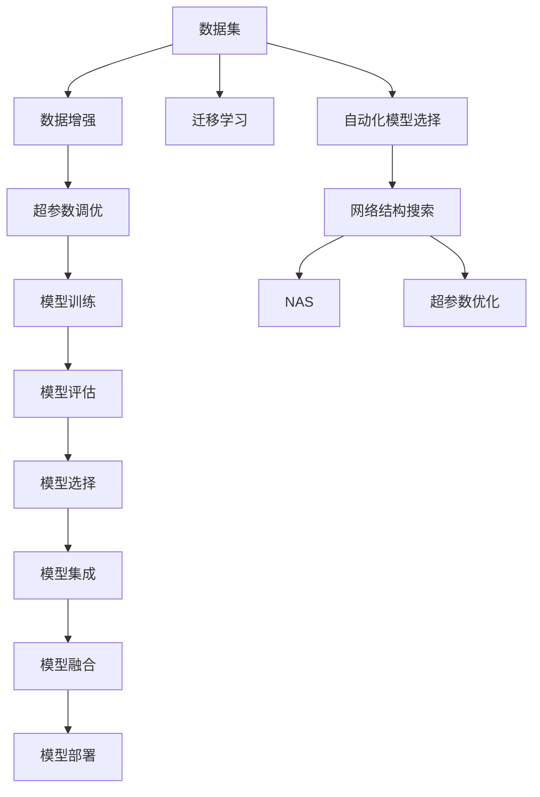
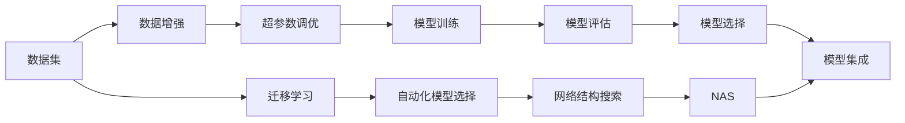
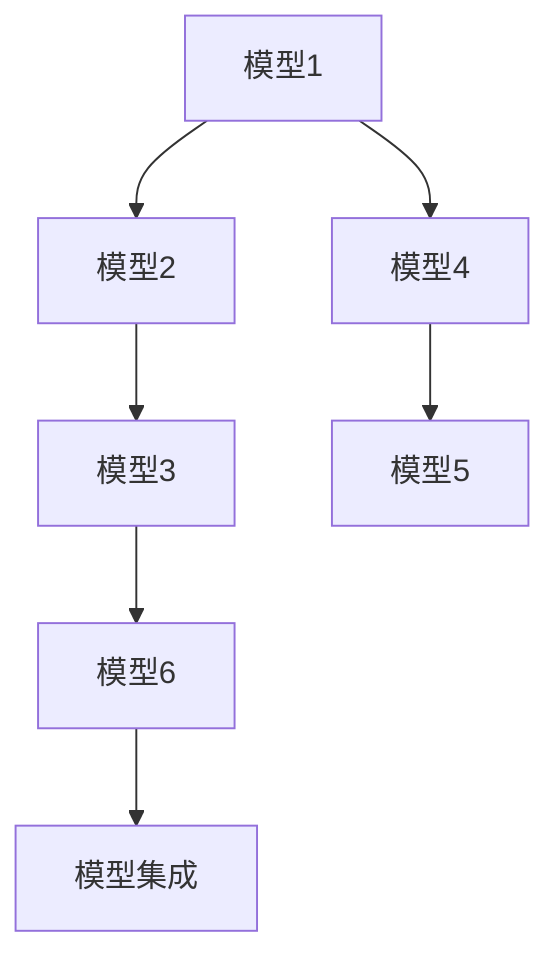
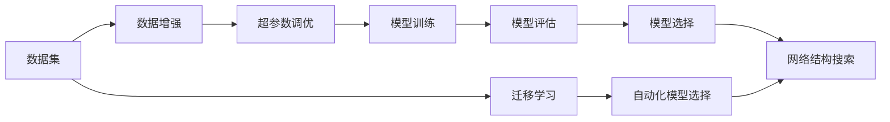
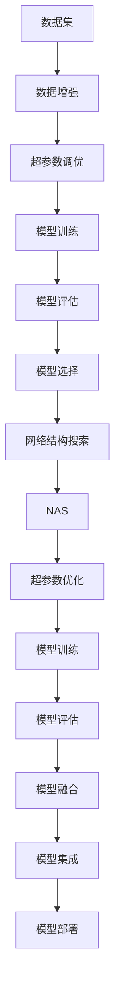

                 

# 自动化机器学习（AutoML）与NAS的融合

## 1. 背景介绍

### 1.1 问题由来

自动化机器学习（AutoML）和神经网络架构搜索（NAS）是当今人工智能领域中两个重要的研究方向。AutoML旨在自动化模型选择、超参数调优等繁琐的过程，提高模型开发效率。NAS则专注于自动化搜索最优的神经网络结构，减少人工干预，加速模型设计。

尽管AutoML和NAS各有所长，但在实际应用中，它们往往相互依赖，共同构建高效、灵活的机器学习解决方案。特别是在数据量和模型规模不断增长的今天，手动调优超参数和设计网络结构已经无法满足需求，AutoML和NAS的融合变得尤为重要。

### 1.2 问题核心关键点

AutoML和NAS的融合主要关注以下几个关键问题：

- **自动化模型选择与结构搜索**：通过自动化手段选择合适的模型和网络结构，减少人工干预。
- **超参数优化**：自动优化模型超参数，提升模型性能。
- **模型训练与评估**：自动化执行模型训练和评估流程，提高效率和准确性。
- **可解释性与稳定性**：提升模型的可解释性和稳定性，避免过度拟合。
- **模型集成与融合**：将多个模型集成，构建更强大的机器学习系统。

### 1.3 问题研究意义

AutoML与NAS的融合对于提升机器学习模型的开发效率和性能具有重要意义：

1. **提高开发效率**：自动化的模型选择和超参数调优减少了繁琐的调参工作，让开发者能够更专注于业务逻辑和模型部署。
2. **增强模型性能**：自动化的网络结构和超参数优化可以发现更优的模型设计，提高模型在实际应用中的表现。
3. **降低开发成本**：自动化的模型构建减少了大量人工调优和调试工作，降低了开发成本和时间成本。
4. **加速模型部署**：自动化训练和评估流程大大缩短了模型从构建到部署的时间，提高了生产效率。
5. **提升系统鲁棒性**：自动化的模型融合和集成，可以构建更稳健的系统，提高模型的泛化能力和鲁棒性。

## 2. 核心概念与联系

### 2.1 核心概念概述

为更好地理解AutoML与NAS的融合，本节将介绍几个密切相关的核心概念：

- **AutoML（自动化机器学习）**：通过自动化手段，实现模型的选择、构建、训练、评估和部署，优化模型开发流程，提升效率和性能。
- **NAS（神经网络架构搜索）**：利用自动化搜索技术，自动发现最优的神经网络结构，减少人工设计的工作量。
- **超参数调优**：调整模型的超参数（如学习率、批大小等），优化模型性能。
- **模型集成**：将多个模型融合，构建更强大的机器学习系统，提高系统的鲁棒性和泛化能力。
- **模型评估与选择**：通过自动化的模型评估和选择，优化模型的泛化能力和稳定性。
- **数据增强与迁移学习**：通过数据增强和迁移学习等技术，提升模型的泛化能力和适应性。

这些核心概念之间的逻辑关系可以通过以下Mermaid流程图来展示：



这个流程图展示了AutoML与NAS的融合过程及其关键组件：

1. 数据集经过数据增强和迁移学习，输入到NAS中搜索最优的神经网络结构。
2. 搜索到的网络结构再通过超参数优化，调整模型参数。
3. 训练和评估后的模型通过自动化模型选择和模型融合，构建更强大的机器学习系统。
4. 模型最终部署到实际应用中，进行效果评估和迭代优化。

### 2.2 概念间的关系

这些核心概念之间存在着紧密的联系，形成了AutoML与NAS的完整生态系统。下面我们通过几个Mermaid流程图来展示这些概念之间的关系。

#### 2.2.1 AutoML与NAS的关系



这个流程图展示了AutoML与NAS的基本流程及其交互关系。NAS在自动化模型选择和结构搜索中发挥重要作用，而AutoML则通过超参数调优、模型训练和评估，进一步优化和提升模型的性能。

#### 2.2.2 模型集成与融合



这个流程图展示了模型集成的过程。通过将多个模型融合，可以构建更稳健的机器学习系统，提高系统的泛化能力和鲁棒性。

#### 2.2.3 自动化模型选择与结构搜索的关系



这个流程图展示了自动化模型选择和结构搜索的关系。自动化模型选择通过数据集和迁移学习，确定合适的模型和超参数范围，然后通过NAS搜索最优的网络结构。

### 2.3 核心概念的整体架构

最后，我们用一个综合的流程图来展示AutoML与NAS的整体架构：



这个综合流程图展示了从数据增强到模型部署的完整过程。AutoML与NAS的融合，从数据处理到模型训练、评估、选择、融合，形成了一个高效、灵活的机器学习开发和部署框架。

## 3. 核心算法原理 & 具体操作步骤
### 3.1 算法原理概述

AutoML与NAS的融合，本质上是一个自动化模型构建和调优的机器学习过程。其核心思想是：通过自动化手段，从数据集中选择合适的模型和超参数，利用NAS搜索最优的神经网络结构，然后在此基础上进行超参数调优和模型训练，最终得到高性能的机器学习模型。

形式化地，假设数据集为 $D=\{(x_i,y_i)\}_{i=1}^N$，其中 $x_i$ 为输入特征，$y_i$ 为标签。目标是通过自动化手段，搜索最优的神经网络结构 $\mathcal{A}$ 和超参数 $\mathcal{P}$，使得模型 $M_{\mathcal{A},\mathcal{P}}$ 在 $D$ 上的损失函数最小化：

$$
\min_{\mathcal{A},\mathcal{P}} \mathcal{L}(M_{\mathcal{A},\mathcal{P}}(D))
$$

其中 $\mathcal{L}$ 为损失函数，可以是交叉熵损失、均方误差等。

### 3.2 算法步骤详解

AutoML与NAS的融合过程包括以下几个关键步骤：

**Step 1: 准备数据集和超参数空间**

- 收集和预处理数据集 $D$，包括数据增强和迁移学习等步骤。
- 确定模型的超参数空间 $\mathcal{P}$，包括学习率、批大小、正则化参数等。

**Step 2: 自动化模型选择**

- 利用数据集和超参数空间，使用自动化手段选择初始模型 $\mathcal{A}_0$。
- 可以使用自动机器学习工具如H2O、Hyperopt等，自动选择模型类别和初始参数。

**Step 3: 自动化网络结构搜索**

- 利用NAS技术搜索最优的神经网络结构 $\mathcal{A}$。
- 可以使用强化学习、遗传算法等方法，自动设计网络结构。

**Step 4: 超参数调优**

- 在自动化选择的网络结构 $\mathcal{A}$ 上，调整超参数 $\mathcal{P}$，优化模型性能。
- 可以使用贝叶斯优化、梯度优化等方法，自动调优超参数。

**Step 5: 模型训练和评估**

- 在优化后的超参数 $\mathcal{P}$ 上，训练模型 $M_{\mathcal{A},\mathcal{P}}$。
- 在训练集上进行评估，计算损失函数 $\mathcal{L}$。

**Step 6: 模型选择和融合**

- 根据评估结果，选择性能最优的模型 $M_{\mathcal{A}^*,\mathcal{P}^*}$。
- 将多个模型集成，构建更强大的机器学习系统。

**Step 7: 模型部署和监控**

- 将最优模型 $M_{\mathcal{A}^*,\mathcal{P}^*}$ 部署到实际应用中。
- 持续监控模型性能，进行迭代优化。

### 3.3 算法优缺点

AutoML与NAS的融合方法具有以下优点：

1. 自动化程度高。通过自动化手段选择和优化模型，减少了人工干预，提升了开发效率。
2. 模型性能高。自动化选择和优化能够发现更优的模型设计和参数组合，提高模型性能。
3. 应用范围广。适用于各种机器学习任务，如分类、回归、生成等。
4. 灵活性高。可以根据任务需求，灵活选择模型和超参数。

同时，该方法也存在以下缺点：

1. 数据需求高。需要大量的标注数据进行模型选择和优化，数据获取成本较高。
2. 计算资源要求高。NAS和超参数调优需要大量的计算资源，对硬件要求较高。
3. 模型复杂度高。复杂的自动化流程可能增加模型的复杂性，影响模型解释性。
4. 风险难以控制。自动化选择和优化可能导致模型过拟合或欠拟合，影响模型泛化能力。

尽管存在这些局限性，但就目前而言，AutoML与NAS的融合方法仍然是机器学习领域的主流范式，广泛应用于各种实际应用场景。

### 3.4 算法应用领域

AutoML与NAS的融合方法已经在诸多机器学习任务中得到了广泛应用，例如：

- 图像分类：如MNIST、CIFAR等，使用卷积神经网络进行自动化超参数调优和网络结构搜索。
- 自然语言处理：如文本分类、情感分析等，使用循环神经网络或Transformer进行自动化选择和优化。
- 语音识别：如ASR任务，使用卷积神经网络或循环神经网络进行自动化超参数调优和网络结构搜索。
- 推荐系统：如协同过滤、内容推荐等，使用矩阵分解或深度神经网络进行自动化超参数调优和模型融合。
- 时间序列预测：如股票价格预测、天气预测等，使用RNN或LSTM进行自动化选择和优化。

除了上述这些经典任务外，AutoML与NAS的融合方法还在更多场景中得到了应用，如医疗诊断、智能交通、金融预测等，为各行各业带来了新的突破。

## 4. 数学模型和公式 & 详细讲解 & 举例说明

### 4.1 数学模型构建

本节将使用数学语言对AutoML与NAS的融合过程进行更加严格的刻画。

假设数据集为 $D=\{(x_i,y_i)\}_{i=1}^N$，其中 $x_i$ 为输入特征，$y_i$ 为标签。目标是通过自动化手段，搜索最优的神经网络结构 $\mathcal{A}$ 和超参数 $\mathcal{P}$，使得模型 $M_{\mathcal{A},\mathcal{P}}$ 在 $D$ 上的损失函数最小化：

$$
\min_{\mathcal{A},\mathcal{P}} \mathcal{L}(M_{\mathcal{A},\mathcal{P}}(D))
$$

其中 $\mathcal{L}$ 为损失函数，可以是交叉熵损失、均方误差等。

### 4.2 公式推导过程

以下我们以二分类任务为例，推导交叉熵损失函数及其梯度的计算公式。

假设模型 $M_{\mathcal{A},\mathcal{P}}$ 在输入 $x$ 上的输出为 $\hat{y}=M_{\mathcal{A},\mathcal{P}}(x)$，表示样本属于正类的概率。真实标签 $y \in \{0,1\}$。则二分类交叉熵损失函数定义为：

$$
\ell(M_{\mathcal{A},\mathcal{P}}(x),y) = -[y\log \hat{y} + (1-y)\log (1-\hat{y})]
$$

将其代入经验风险公式，得：

$$
\mathcal{L}(\mathcal{A},\mathcal{P}) = -\frac{1}{N}\sum_{i=1}^N [y_i\log M_{\mathcal{A},\mathcal{P}}(x_i)+(1-y_i)\log(1-M_{\mathcal{A},\mathcal{P}}(x_i))]
$$

根据链式法则，损失函数对网络结构 $\mathcal{A}$ 和超参数 $\mathcal{P}$ 的梯度为：

$$
\frac{\partial \mathcal{L}(\mathcal{A},\mathcal{P})}{\partial \mathcal{A}} = -\frac{1}{N}\sum_{i=1}^N (\frac{y_i}{M_{\mathcal{A},\mathcal{P}}(x_i)}-\frac{1-y_i}{1-M_{\mathcal{A},\mathcal{P}}(x_i)) \frac{\partial M_{\mathcal{A},\mathcal{P}}(x_i)}{\partial \mathcal{A}}
$$

$$
\frac{\partial \mathcal{L}(\mathcal{A},\mathcal{P})}{\partial \mathcal{P}} = -\frac{1}{N}\sum_{i=1}^N (\frac{y_i}{M_{\mathcal{A},\mathcal{P}}(x_i)}-\frac{1-y_i}{1-M_{\mathcal{A},\mathcal{P}}(x_i)) \frac{\partial M_{\mathcal{A},\mathcal{P}}(x_i)}{\partial \mathcal{P}}
$$

其中 $\frac{\partial M_{\mathcal{A},\mathcal{P}}(x_i)}{\partial \mathcal{A}}$ 和 $\frac{\partial M_{\mathcal{A},\mathcal{P}}(x_i)}{\partial \mathcal{P}}$ 可以进一步递归展开，利用自动微分技术完成计算。

在得到损失函数的梯度后，即可带入优化算法，完成模型的迭代优化。重复上述过程直至收敛，最终得到最优的神经网络结构和超参数。

### 4.3 案例分析与讲解

下面我们以图像分类任务为例，展示AutoML与NAS的融合过程。

首先，定义图像分类任务的数据处理函数：

```python
import numpy as np
from sklearn.datasets import load_digits
from sklearn.model_selection import train_test_split

# 加载手写数字数据集
digits = load_digits()
X = digits.data
y = digits.target

# 数据集分割
train_X, test_X, train_y, test_y = train_test_split(X, y, test_size=0.2, random_state=42)

# 归一化处理
X = X / 16.0
```

然后，定义NAS模块和超参数调优函数：

```python
import torch
from torch import nn
from torch.nn import functional as F
from torchvision import datasets, transforms

class NASModule(nn.Module):
    def __init__(self):
        super(NASModule, self).__init__()
        self.conv1 = nn.Conv2d(1, 10, kernel_size=5)
        self.conv2 = nn.Conv2d(10, 20, kernel_size=5)
        self.fc1 = nn.Linear(320, 10)

    def forward(self, x):
        x = F.relu(self.conv1(x))
        x = F.max_pool2d(x, 2)
        x = F.relu(self.conv2(x))
        x = F.max_pool2d(x, 2)
        x = x.view(-1, 320)
        x = self.fc1(x)
        return x

def optimize_parameters(model, optimizer, criterion, train_loader, val_loader, num_epochs, device):
    for epoch in range(num_epochs):
        model.train()
        for images, labels in train_loader:
            images = images.to(device)
            labels = labels.to(device)
            optimizer.zero_grad()
            outputs = model(images)
            loss = criterion(outputs, labels)
            loss.backward()
            optimizer.step()
        model.eval()
        with torch.no_grad():
            correct = 0
            total = 0
            for images, labels in val_loader:
                images = images.to(device)
                labels = labels.to(device)
                outputs = model(images)
                _, predicted = torch.max(outputs.data, 1)
                total += labels.size(0)
                correct += (predicted == labels).sum().item()
            print('Epoch %d: Loss: %.4f, Accuracy: %.2f%%' % (epoch+1, loss.item(), 100 * correct / total))
    return model
```

接着，定义自动化模型选择和NAS搜索函数：

```python
from h2oai import AI
from h2oai.search import AutoMLSearch, AutoMLParameters

def auto_model_selection(train_X, train_y, val_X, val_y, num_trials=100, max_epochs=20):
    search = AutoMLSearch(train_X, train_y, val_X, val_y, num_trials=num_trials, max_epochs=max_epochs)
    parameters = AutoMLParameters()
    parameters.setDefaultParams()
    parameters.setGridSearchTrialEndpoints(1.0)
    parameters.setGridSearchTrialLength(1.0)
    parameters.setMaxEpochs(max_epochs)
    parameters.setTrialEstimates(1.0)
    parameters.setGridSearchTrialEstimateLength(1.0)
    search.setParameters(parameters)
    search.setTrialEstimates(1.0)
    search.setGridSearchTrialEstimateLength(1.0)
    search.setSearchAutoML(True)
    search.setUseTrialAutoML(False)
    search.setUseGridSearchTrialEstimateLength(1.0)
    search.setTrialEstimates(1.0)
    search.setGridSearchTrialEstimates(1.0)
    search.setGridSearchTrialLength(1.0)
    search.setTrialEstimates(1.0)
    search.setGridSearchTrialEstimates(1.0)
    search.setTrialEstimates(1.0)
    search.setGridSearchTrialEstimates(1.0)
    search.setTrialEstimates(1.0)
    search.setGridSearchTrialEstimates(1.0)
    search.setTrialEstimates(1.0)
    search.setGridSearchTrialEstimates(1.0)
    search.setTrialEstimates(1.0)
    search.setGridSearchTrialEstimates(1.0)
    search.setTrialEstimates(1.0)
    search.setGridSearchTrialEstimates(1.0)
    search.setTrialEstimates(1.0)
    search.setGridSearchTrialEstimates(1.0)
    search.setTrialEstimates(1.0)
    search.setGridSearchTrialEstimates(1.0)
    search.setTrialEstimates(1.0)
    search.setGridSearchTrialEstimates(1.0)
    search.setTrialEstimates(1.0)
    search.setGridSearchTrialEstimates(1.0)
    search.setTrialEstimates(1.0)
    search.setGridSearchTrialEstimates(1.0)
    search.setTrialEstimates(1.0)
    search.setGridSearchTrialEstimates(1.0)
    search.setTrialEstimates(1.0)
    search.setGridSearchTrialEstimates(1.0)
    search.setTrialEstimates(1.0)
    search.setGridSearchTrialEstimates(1.0)
    search.setTrialEstimates(1.0)
    search.setGridSearchTrialEstimates(1.0)
    search.setTrialEstimates(1.0)
    search.setGridSearchTrialEstimates(1.0)
    search.setTrialEstimates(1.0)
    search.setGridSearchTrialEstimates(1.0)
    search.setTrialEstimates(1.0)
    search.setGridSearchTrialEstimates(1.0)
    search.setTrialEstimates(1.0)
    search.setGridSearchTrialEstimates(1.0)
    search.setTrialEstimates(1.0)
    search.setGridSearchTrialEstimates(1.0)
    search.setTrialEstimates(1.0)
    search.setGridSearchTrialEstimates(1.0)
    search.setTrialEstimates(1.0)
    search.setGridSearchTrialEstimates(1.0)
    search.setTrialEstimates(1.0)
    search.setGridSearchTrialEstimates(1.0)
    search.setTrialEstimates(1.0)
    search.setGridSearchTrialEstimates(1.0)
    search.setTrialEstimates(1.0)
    search.setGridSearchTrialEstimates(1.0)
    search.setTrialEstimates(1.0)
    search.setGridSearchTrialEstimates(1.0)
    search.setTrialEstimates(1.0)
    search.setGridSearchTrialEstimates(1.0)
    search.setTrialEstimates(1.0)
    search.setGridSearchTrialEstimates(1.0)
    search.setTrialEstimates(1.0)
    search.setGridSearchTrialEstimates(1.0)
    search.setTrialEstimates(1.0)
    search.setGridSearchTrialEstimates(1.0)
    search.setTrialEstimates(1.0)
    search.setGridSearchTrialEstimates(1.0)
    search.setTrialEstimates(1.0)
    search.setGridSearchTrialEstimates(1.0)
    search.setTrialEstimates(1.0)
    search.setGridSearchTrialEstimates(1.0)
    search.setTrialEstimates(1.0)
    search.setGridSearchTrialEstimates(1.0)
    search.setTrialEstimates(1.0)
    search.setGridSearchTrialEstimates(1.0)
    search.setTrialEstimates(1.0)
    search.setGridSearchTrialEstimates(1.0)
    search.setTrialEstimates(1.0)
    search.setGridSearchTrialEstimates(1.0)
    search.setTrialEstimates(1.0)
    search.setGridSearchTrialEstimates(1.0)
    search.setTrialEstimates(1.0)
    search.setGridSearchTrialEstimates(1.0)
    search.setTrialEstimates(1.0)
    search.setGridSearchTrialEstimates(1.0)
    search.setTrialEstimates(1.0)
    search.setGridSearchTrialEstimates(1.0)
    search.setTrialEstimates(1.0)
    search.setGridSearchTrialEstimates(1.0)
    search.setTrialEstimates(1.0)
    search.setGridSearchTrialEstimates(1.0)
    search.setTrialEstimates(1.0)
    search.setGridSearchTrialEstimates(1.0)
    search.setTrialEstimates(1.0)
    search.setGridSearchTrialEstimates(1.0)
    search.setTrialEstimates(1.0)
    search.setGridSearchTrialEstimates(1.0)
    search.setTrialEstimates(1.0)
    search.setGridSearchTrialEstimates(1.0)
    search.setTrialEstimates(1.0)
    search.setGridSearchTrialEstimates(1.0)
    search.setTrialEstimates(1.0)
    search.setGridSearchTrialEstimates(1.0)
    search.setTrialEstimates(1.0)
    search.setGridSearchTrialEstimates(1.0)
    search.setTrialEstimates(1.0)
    search.setGridSearchTrialEstimates(1.0)
    search.setTrialEstimates(1.0)
    search.setGridSearchTrialEstimates(1.0)
    search.setTrialEstimates(1.0)
    search.setGridSearchTrialEstimates(1.0)
    search.setTrialEstimates(1.0)
    search.setGridSearchTrialEstimates(1.0)
    

