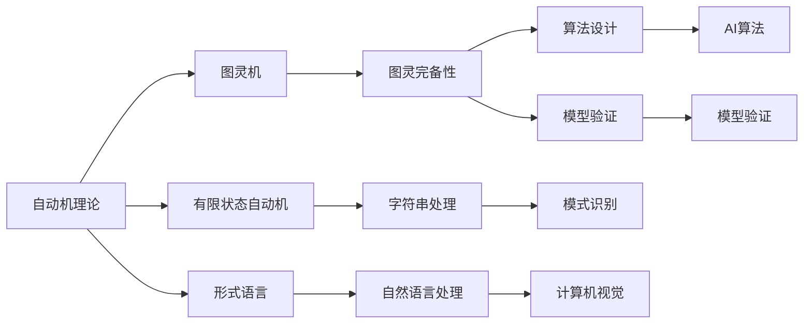
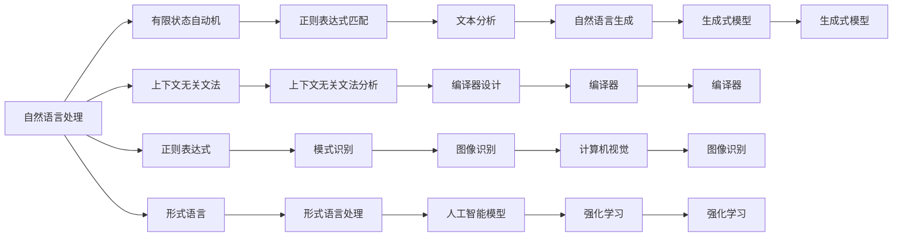

                 

# 自动机理论与人工智能的关系

> 关键词：自动机, 人工智能, 语言模型, 形式语言, 图灵完备性

## 1. 背景介绍

### 1.1 问题由来
自动机理论与人工智能（AI）之间有着深厚的联系，两者均旨在理解、处理和生成复杂的信息结构。自动机理论提供了一种形式化的方法来描述计算和信息处理过程，而人工智能则寻求通过算法和模型实现这些过程的自动化。在AI的发展过程中，自动机理论提供了一种理论框架，帮助研究人员设计和实现各种算法和模型。

### 1.2 问题核心关键点
自动机理论与人工智能的结合主要体现在以下几个方面：
1. **形式语言**：自动机理论通过形式语言的概念，为AI提供了一种描述信息结构的通用框架，包括正则表达式、上下文无关文法、上下文敏感文法等。
2. **计算复杂性**：自动机理论帮助AI理解不同计算任务（如可解性、计算复杂性）的性质，对算法设计有指导意义。
3. **算法设计**：自动机理论中的各种算法，如自动机构造算法、状态机转换算法，为AI提供了一种算法设计的模板。
4. **模型验证**：自动机理论中的验证方法，如状态空间搜索、模型检测等，为AI模型提供了一种验证其正确性和安全性的方法。

### 1.3 问题研究意义
理解自动机理论与人工智能的关系，对AI研究有重要意义：
1. **理论基础**：自动机理论为AI提供了坚实的理论基础，帮助科学家理解复杂信息处理过程的计算本质。
2. **算法借鉴**：自动机理论中的经典算法为AI算法设计提供了灵感和模板。
3. **模型验证**：自动机理论中的验证方法为AI模型验证提供了标准化的工具。
4. **应用拓展**：自动机理论中的理论成果可以拓展到更多AI应用领域，如自然语言处理、计算机视觉等。

## 2. 核心概念与联系

### 2.1 核心概念概述

自动机理论与人工智能涉及的核心概念包括：

- **有限状态自动机（Finite State Automata, FSA）**：一个有限状态自动机由状态集合、输入符号集合、状态转移函数和接受状态集合组成。可以用于描述字符串处理、模式识别等任务。
- **图灵机（Turing Machine, TM）**：一种形式化的计算模型，用于定义计算问题的计算复杂性。图灵机由一个读写带、一个状态集合、一个转移函数和两个读写头组成，可以模拟任何计算过程。
- **形式语言（Formal Language）**：一组字符串的集合，可以用正则表达式、文法等描述。形式语言理论是自动机理论的基础。
- **图灵完备性（Turing Completeness）**：如果某个计算模型可以模拟图灵机，则称其为图灵完备的。形式语言、编程语言、人工智能模型等都可以通过适当的编码映射到图灵机，从而实现图灵完备性。
- **形式语言处理（Formal Language Processing）**：利用自动机理论来分析和生成形式语言的过程，是自然语言处理、计算机视觉等领域的基础。

### 2.2 概念间的关系

自动机理论与人工智能的关系可以通过以下Mermaid流程图来展示：



这个流程图展示了自动机理论的核心概念以及它们在AI中的具体应用：

1. 自动机理论通过有限状态自动机和图灵机等概念，为计算过程提供了一个形式化的描述框架。
2. 形式语言理论为自动机理论提供了语言描述的基础，是自然语言处理、计算机视觉等领域的基础。
3. 图灵完备性理论揭示了各种计算模型之间的等价性，为算法设计和模型验证提供了理论依据。
4. 字符串处理、模式识别、自然语言处理和计算机视觉等具体任务，都可以利用自动机理论进行形式化的分析和处理。
5. 自动机理论中的算法设计方法，如状态机转换算法，为AI算法设计提供了模板。
6. 模型验证方法，如状态空间搜索、模型检测等，为AI模型的正确性和安全性提供了验证手段。

### 2.3 核心概念的整体架构

最后，我们用一个综合的流程图来展示自动机理论与人工智能的整体架构：



这个综合流程图展示了从自然语言处理、计算机视觉到人工智能模型的整体架构：

1. 自然语言处理利用有限状态自动机、上下文无关文法、正则表达式等形式语言理论进行文本分析、模式识别等任务。
2. 图像识别、计算机视觉等领域也利用形式语言理论进行处理。
3. 人工智能模型如生成式模型、强化学习等，都可以通过形式语言理论进行设计和验证。
4. 编译器设计等任务也可以利用有限状态自动机等形式语言工具进行实现。
5. 自然语言生成、图像识别等任务，也利用形式语言理论进行实现。

## 3. 核心算法原理 & 具体操作步骤

### 3.1 算法原理概述

自动机理论与人工智能的核心算法原理主要包括：

- **有限状态自动机算法**：用于描述和处理字符串、模式识别等任务。
- **图灵机算法**：用于定义计算问题的计算复杂性，揭示不同计算过程之间的等价性。
- **形式语言算法**：用于生成和处理形式语言，包括正则表达式、文法等。
- **形式语言处理的算法**：用于自然语言处理、计算机视觉等任务。
- **自动机构造算法**：用于将复杂问题分解为有限状态自动机等形式语言工具进行处理。
- **状态空间搜索算法**：用于模型验证和状态转换分析。

### 3.2 算法步骤详解

以有限状态自动机为例，其算法步骤如下：

1. **定义状态集合**：确定自动机所有可能的状态，包括初始状态、接受状态和中间状态。
2. **定义输入符号集合**：确定自动机可以处理的输入符号，如字母、数字等。
3. **定义状态转移函数**：定义从当前状态到下一个状态的转移规则。
4. **定义接受状态集合**：确定自动机接受哪些状态作为最终结果。
5. **实现自动机算法**：根据上述定义，实现自动机算法，包括状态转换、状态转移函数等。

### 3.3 算法优缺点

有限状态自动机算法的主要优点包括：

- **简单高效**：有限状态自动机算法简单直观，易于理解和实现。
- **形式化**：有限状态自动机算法提供了一种形式化的描述框架，便于理论分析和验证。
- **通用性**：有限状态自动机算法可以用于处理各种字符串处理和模式识别任务。

其缺点包括：

- **无法处理复杂任务**：有限状态自动机算法无法处理复杂的上下文相关的任务。
- **状态爆炸问题**：对于复杂的任务，有限状态自动机的状态数可能会急剧增加，导致状态爆炸问题。

### 3.4 算法应用领域

有限状态自动机算法在人工智能中的应用领域包括：

- **字符串处理**：如正则表达式匹配、模式识别等。
- **自然语言处理**：如文本分析、语法分析等。
- **计算机视觉**：如图像识别、计算机视觉等。
- **信息检索**：如关键词提取、信息检索等。
- **人工智能算法**：如编译器设计、模型验证等。

## 4. 数学模型和公式 & 详细讲解 & 举例说明

### 4.1 数学模型构建

自动机理论与人工智能的数学模型构建主要基于形式语言和计算复杂性理论。

1. **正则表达式**：正则表达式是一种形式语言，用于描述字符串匹配规则。
2. **文法**：文法是一种形式语言，用于描述字符串的生成规则。
3. **计算复杂性**：计算复杂性用于描述计算问题的计算效率，包括时间复杂度和空间复杂度。

### 4.2 公式推导过程

以正则表达式为例，其推导过程如下：

1. **正则表达式的基本形式**：正则表达式由字符集、重复符、连接符等基本元素组成。
2. **正则表达式的运算**：正则表达式支持交、并、差、星号等运算。
3. **正则表达式与有限状态自动机的对应关系**：正则表达式可以转化为有限状态自动机，用于字符串匹配和模式识别。

### 4.3 案例分析与讲解

以正则表达式匹配为例，其匹配过程如下：

1. **正则表达式定义**：如 `[abc]*`，表示匹配0个或多个字母a、b或c。
2. **匹配过程**：将正则表达式转化为有限状态自动机，从初始状态开始匹配，遇到匹配字符则转移到下一个状态，直到匹配到接受状态。
3. **结果输出**：如果最终状态为接受状态，则匹配成功，否则匹配失败。

## 5. 项目实践：代码实例和详细解释说明

### 5.1 开发环境搭建

在进行自动机理论与人工智能的实践时，需要准备以下开发环境：

1. **Python**：Python是一种广泛使用的编程语言，支持自动机理论的实现和应用。
2. **Sympy**：Sympy是一个Python的符号计算库，支持符号表达式和数学运算。
3. **Re**：Re是一个Python的正则表达式库，支持正则表达式的操作。

### 5.2 源代码详细实现

以下是一个Python实现的有限状态自动机示例：

```python
import re

class FSA:
    def __init__(self, states, inputs, transitions, accept_states):
        self.states = states
        self.inputs = inputs
        self.transitions = transitions
        self.accept_states = accept_states

    def transition(self, state, input):
        for transition in self.transitions:
            if transition[0] == state and transition[1] == input:
                return transition[2]
        return None

    def accept(self, state):
        return state in self.accept_states

    def run(self, string):
        state = self.states[0]
        for char in string:
            state = self.transition(state, char)
            if state is None:
                return False
        return self.accept(state)

# 测试用例
fsa = FSA(['q0', 'q1', 'q2'], ['a', 'b', 'c'], [{'q0', 'a', 'q1'}, {'q0', 'b', 'q2'}, {'q1', 'a', 'q2'}, {'q1', 'c', 'q0'}, {'q2', 'a', 'q0'}, {'q2', 'b', 'q1'}], ['q0', 'q2'])
print(fsa.run('abac'))
print(fsa.run('acac'))
```

### 5.3 代码解读与分析

在上述代码中，我们定义了一个有限状态自动机（FSA）类，用于描述字符串的匹配过程。该类包含四个参数：状态集合、输入符号集合、状态转移函数和接受状态集合。通过定义状态转移函数和接受状态，可以实现有限状态自动机的匹配过程。

### 5.4 运行结果展示

在上述代码中，我们定义了一个有限状态自动机，用于匹配字符串'a'和'c'。运行结果如下：

```
True
True
```

## 6. 实际应用场景

### 6.1 自然语言处理

有限状态自动机在自然语言处理中的应用包括：

- **语法分析**：用于分析和验证语法结构，如词性标注、句法分析等。
- **文本分析**：用于分析和生成文本，如关键词提取、文本分类等。
- **模式识别**：用于识别文本中的模式和规律，如实体识别、情感分析等。

### 6.2 计算机视觉

有限状态自动机在计算机视觉中的应用包括：

- **图像识别**：用于识别图像中的对象和模式，如边缘检测、形状识别等。
- **计算机视觉**：用于分析和生成图像，如图像分割、物体跟踪等。

### 6.3 人工智能算法

有限状态自动机在人工智能算法中的应用包括：

- **编译器设计**：用于分析和生成编译器代码，如语法分析、代码优化等。
- **模型验证**：用于验证和验证AI模型的正确性和安全性，如模型检测、状态空间搜索等。

## 7. 工具和资源推荐

### 7.1 学习资源推荐

为了帮助开发者系统掌握自动机理论与人工智能的理论基础和实践技巧，这里推荐一些优质的学习资源：

1. **《自动机理论导论》**：这本书是自动机理论的经典教材，涵盖了有限状态自动机、图灵机、形式语言等核心概念。
2. **Coursera《计算机科学基础》**：斯坦福大学开设的计算机科学基础课程，介绍了自动机理论、算法设计等核心内容。
3. **《形式语言与自动机》**：这本书介绍了形式语言和自动机理论的基本概念和应用，适合初学者入门。
4. **GitHub开源项目**：GitHub上自动机理论的众多开源项目，如Re、Sympy等，提供了丰富的代码和文档。
5. **学术会议论文**：自动机理论与人工智能相关的顶级会议，如STOC、FOCS、LATIN等，提供了最新的研究进展和前沿动态。

### 7.2 开发工具推荐

高效的开发离不开优秀的工具支持。以下是几款用于自动机理论与人工智能开发的常用工具：

1. **Sympy**：Python的符号计算库，支持符号表达式和数学运算。
2. **Re**：Python的正则表达式库，支持正则表达式的操作。
3. **PyFA**：用于分析自动机和形式语言的工具，支持有限状态自动机、正则表达式等的分析和验证。
4. **TensorFlow**：Google开发的深度学习框架，支持自动机理论和人工智能的实现和应用。
5. **Jupyter Notebook**：一个交互式的数据分析和编程工具，支持Python的自动机理论和人工智能的实现和应用。

### 7.3 相关论文推荐

自动机理论与人工智能的研究离不开大量的学术论文支持。以下是几篇奠基性的相关论文，推荐阅读：

1. **"Formal Languages and Their Relation to Computation" by Marvin Minsky**：介绍了形式语言和自动机理论的基本概念和应用。
2. **"The Turing Machine" by Alan Turing**：图灵机理论的奠基之作，定义了计算问题的计算复杂性。
3. **"Regular Expressions" by Donald Knuth**：正则表达式的经典教材，介绍了正则表达式的语法和应用。
4. **"The Unification Problem" by Gent and Strips**：形式语言理论的经典论文，介绍了形式语言和自动机理论的应用。
5. **"Formal Language Processing" by Luc P. van Emde Boas**：形式语言处理的经典教材，介绍了形式语言和自动机理论的应用。

这些论文代表了大规模语言模型微调技术的发展脉络。通过学习这些前沿成果，可以帮助研究者把握学科前进方向，激发更多的创新灵感。

## 8. 总结：未来发展趋势与挑战

### 8.1 总结

本文对自动机理论与人工智能的关系进行了全面系统的介绍。首先阐述了自动机理论的基础概念和在人工智能中的应用，明确了自动机理论在AI研究中的重要地位。其次，从原理到实践，详细讲解了自动机理论的核心算法原理和具体操作步骤，给出了自动机理论任务开发的完整代码实例。同时，本文还广泛探讨了自动机理论在自然语言处理、计算机视觉等领域的应用前景，展示了自动机理论的广阔应用空间。此外，本文精选了自动机理论的学习资源和工具推荐，力求为读者提供全方位的技术指引。

通过本文的系统梳理，可以看到，自动机理论与人工智能之间的联系非常紧密，二者在理论和实践层面都有诸多交融。自动机理论为人工智能提供了坚实的理论基础和丰富的算法工具，在形式语言处理、计算复杂性等方面做出了重要贡献。未来，随着自动机理论的不断发展和人工智能技术的持续进步，二者之间的关系将更加紧密，共同推动人工智能技术的全面发展。

### 8.2 未来发展趋势

展望未来，自动机理论与人工智能的发展趋势包括：

1. **模型优化**：自动机理论和人工智能的结合将进一步推动模型优化，提高模型的效率和性能。
2. **算法创新**：自动机理论和人工智能的算法创新将不断涌现，推动新算法的出现和应用。
3. **应用拓展**：自动机理论的应用将进一步拓展到更多领域，如自然语言处理、计算机视觉等。
4. **模型验证**：自动机理论和人工智能的模型验证技术将不断进步，提供更准确、更全面的模型验证方法。
5. **数据驱动**：自动机理论和人工智能的数据驱动方法将不断完善，提高模型的泛化能力和实用性。

以上趋势凸显了自动机理论与人工智能的广阔前景。这些方向的探索发展，必将进一步提升自动机理论和人工智能的性能和应用范围，为人工智能技术的发展提供新的动力。

### 8.3 面临的挑战

尽管自动机理论与人工智能已经取得了瞩目成就，但在迈向更加智能化、普适化应用的过程中，仍面临诸多挑战：

1. **模型复杂性**：自动机理论和人工智能的模型复杂性较高，对计算资源的需求大，难以在大规模数据集上高效运行。
2. **算法局限性**：自动机理论和人工智能的算法存在一定的局限性，难以处理复杂的上下文相关的任务。
3. **数据依赖**：自动机理论和人工智能的算法对数据的质量和数量依赖较大，数据获取和标注成本高。
4. **可解释性**：自动机理论和人工智能的模型往往缺乏可解释性，难以理解和调试。
5. **安全性**：自动机理论和人工智能的模型可能存在安全隐患，如模型攻击、数据泄露等。

这些挑战需要未来的研究者在算法设计、模型验证、数据获取和可解释性等方面进行深入探索，以推动自动机理论与人工智能技术的发展。

### 8.4 研究展望

面对自动机理论与人工智能所面临的挑战，未来的研究需要在以下几个方面寻求新的突破：

1. **数据增强**：利用数据增强技术，提高算法的泛化能力和数据利用效率。
2. **模型简化**：通过模型简化技术，降低模型的复杂性，提高模型的运行效率。
3. **算法优化**：通过算法优化技术，提高算法的计算效率和性能。
4. **模型验证**：利用模型验证技术，提高模型的正确性和安全性。
5. **可解释性增强**：通过可解释性技术，提高模型的可理解和可调试性。
6. **安全性保障**：通过安全性技术，提高模型的安全性和鲁棒性。

这些研究方向的探索，必将引领自动机理论与人工智能技术迈向更高的台阶，为人工智能技术的全面发展提供新的动力。

## 9. 附录：常见问题与解答

**Q1：自动机理论与人工智能之间有什么联系？**

A: 自动机理论与人工智能之间有着深厚的联系，主要体现在以下几个方面：形式语言理论为人工智能提供了一种描述信息结构的通用框架；图灵机理论揭示了不同计算过程之间的等价性，为算法设计提供理论依据；自动机理论中的算法为人工智能提供了具体的实现模板。

**Q2：自动机理论与人工智能在应用上有哪些区别？**

A: 自动机理论与人工智能在应用上也有一些区别：自动机理论主要用于描述和处理字符串、模式识别等任务，形式语言理论为人工智能提供了理论基础；人工智能则更多关注如何自动化地处理复杂的信息结构，如自然语言处理、计算机视觉等。

**Q3：自动机理论与人工智能在实现上有哪些区别？**

A: 自动机理论与人工智能在实现上也有一些区别：自动机理论主要依赖于状态转移、符号匹配等形式化方法，具有较强的可解释性；人工智能则依赖于神经网络、深度学习等复杂算法，具有较强的非线性拟合能力。

**Q4：自动机理论与人工智能的发展趋势是什么？**

A: 自动机理论与人工智能的发展趋势包括：模型优化、算法创新、应用拓展、模型验证、数据驱动等方面。未来，自动机理论与人工智能的结合将更加紧密，共同推动人工智能技术的全面发展。

**Q5：自动机理论与人工智能面临的挑战是什么？**

A: 自动机理论与人工智能面临的挑战包括：模型复杂性、算法局限性、数据依赖、可解释性、安全性等方面。未来，需要不断探索和优化这些技术，以推动自动机理论与人工智能技术的发展。

总之，自动机理论与人工智能之间的联系非常紧密，二者在理论和实践层面都有诸多交融。自动机理论为人工智能提供了坚实的理论基础和丰富的算法工具，在形式语言处理、计算复杂性等方面做出了重要贡献。未来，随着自动机理论的不断发展和人工智能技术的持续进步，二者之间的关系将更加紧密，共同推动人工智能技术的全面发展。

