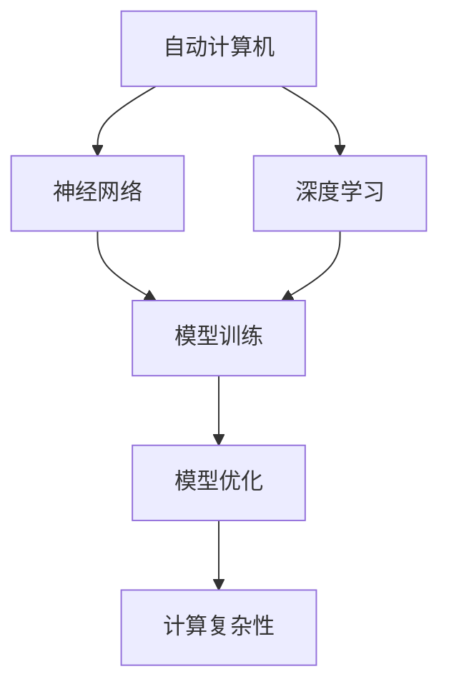
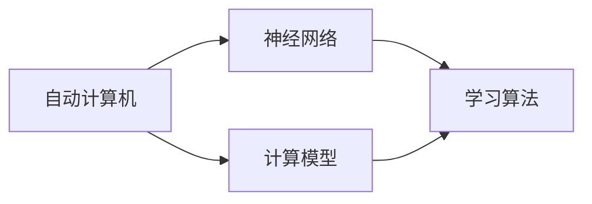
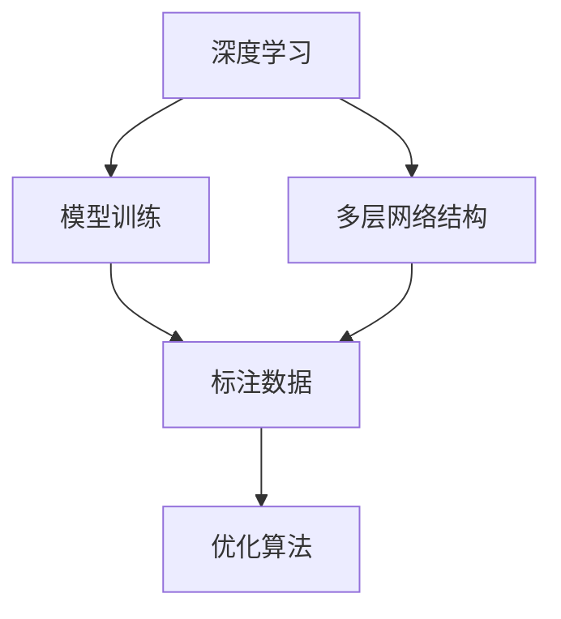
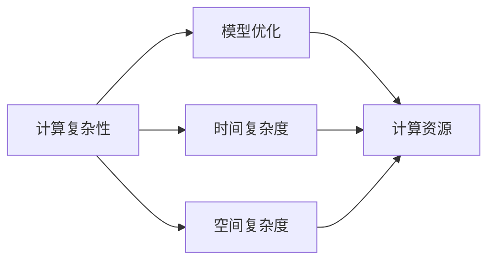
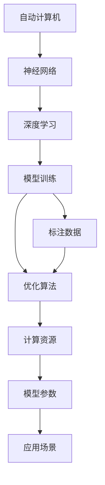

                 

# 自动计算机与神经网络的研究

> 关键词：自动计算机、神经网络、深度学习、计算复杂性、训练、优化、应用

## 1. 背景介绍

### 1.1 问题由来
在计算机科学领域，自动计算机与神经网络的研究是两个具有划时代意义的课题。自动计算机的起源可以追溯到图灵机，其旨在探索计算机的通用计算能力；而神经网络则受到生物神经系统的启发，致力于模拟和优化信息处理和模式识别。这两种研究方向虽然出发点不同，但都在计算机科学的发展史上扮演了重要角色。

然而，随着深度学习技术的迅猛发展，神经网络已经超越了传统的自动计算机模型，成为当前主流的人工智能计算范式。深入理解神经网络的工作原理、优势与挑战，对于推动人工智能技术在各个领域的应用具有重要意义。

### 1.2 问题核心关键点
神经网络的研究核心关键点包括：
- 神经网络的基本结构与工作原理。
- 深度学习中的前向传播与反向传播算法。
- 模型训练中的优化方法与损失函数。
- 神经网络的泛化能力与过拟合问题。
- 模型应用中的迁移学习与迁移学习。
- 神经网络在实际应用中的性能优化与计算效率提升。

这些关键点不仅揭示了神经网络的底层理论，也指导了其在实际问题中的高效应用。

### 1.3 问题研究意义
研究自动计算机与神经网络，对于拓展人工智能技术的理论边界，提升其在实际问题中的性能，加速技术落地应用具有重要意义：

1. 提升计算效率。神经网络利用自动计算机的并行计算能力，大幅提高了信息处理效率。
2. 增强模型泛化能力。深度学习模型通过多层网络结构，具备更强的模式识别与迁移学习能力，能够适应多种复杂任务。
3. 降低应用成本。相比于传统的计算方法，神经网络可以通过少量样本进行高效训练，减少了人力和数据成本。
4. 推动技术创新。神经网络的发展催生了诸如卷积神经网络、循环神经网络等新型的计算模型，推动了人工智能技术的不断创新。
5. 促进产业升级。神经网络技术在众多行业中的应用，如自动驾驶、医疗诊断、金融分析等，为传统行业带来了新的技术革命。

## 2. 核心概念与联系

### 2.1 核心概念概述

为更好地理解自动计算机与神经网络的研究，本节将介绍几个密切相关的核心概念：

- 自动计算机(Automatic Computer)：图灵机模型，旨在实现任意计算过程的自动化。其由一个读取带（tape）、一个读写头（head）和一条控制规则（program）组成。
- 神经网络(Neural Network)：由大量人工神经元组成的计算模型，用于模拟生物神经系统的信息处理能力。
- 深度学习(Deep Learning)：基于神经网络的机器学习范式，强调通过多层非线性变换提取数据特征，解决复杂模式识别与分类问题。
- 计算复杂性(Computational Complexity)：研究算法执行所需的计算资源（如时间、空间）与问题规模之间的关系。
- 模型训练(Model Training)：使用标注数据优化神经网络模型参数，使其能更好地适应给定任务。
- 模型优化(Model Optimization)：通过各种技术手段提升神经网络模型的计算效率与性能表现。

这些核心概念之间的逻辑关系可以通过以下Mermaid流程图来展示：



这个流程图展示了自动计算机、神经网络、深度学习与模型训练和优化之间的联系：

1. 自动计算机为神经网络提供计算模型基础。
2. 神经网络利用深度学习模型处理复杂数据，提取特征。
3. 模型训练使神经网络具备适应特定任务的能力。
4. 模型优化提升神经网络的计算效率和性能表现。
5. 计算复杂性是衡量神经网络性能的重要指标。

### 2.2 概念间的关系

这些核心概念之间存在着紧密的联系，形成了神经网络的研究框架。下面我们通过几个Mermaid流程图来展示这些概念之间的关系。

#### 2.2.1 自动计算机与神经网络的联系



这个流程图展示了自动计算机与神经网络之间的联系：

1. 自动计算机为神经网络提供基本的计算模型。
2. 神经网络通过学习算法，利用自动计算机的并行计算能力，模拟生物神经系统的信息处理。

#### 2.2.2 深度学习与模型训练的关系



这个流程图展示了深度学习与模型训练之间的关系：

1. 深度学习通过多层网络结构提取数据特征。
2. 模型训练使用标注数据优化神经网络参数。
3. 优化算法在模型训练中起关键作用。

#### 2.2.3 计算复杂性与模型优化



这个流程图展示了计算复杂性与模型优化的关系：

1. 计算复杂性是衡量模型性能的重要指标。
2. 模型优化通过减少时间复杂度和空间复杂度，提升计算资源利用效率。

### 2.3 核心概念的整体架构

最后，我们用一个综合的流程图来展示这些核心概念在大语言模型微调过程中的整体架构：



这个综合流程图展示了从自动计算机、神经网络、深度学习到模型训练和优化的完整过程：

1. 自动计算机为神经网络提供计算模型基础。
2. 神经网络利用深度学习模型处理复杂数据，提取特征。
3. 模型训练使用标注数据优化神经网络参数。
4. 优化算法在模型训练中起关键作用。
5. 计算资源影响模型性能和优化效率。

这些概念共同构成了自动计算机与神经网络的研究框架，为其在实际问题中的高效应用奠定了基础。

## 3. 核心算法原理 & 具体操作步骤
### 3.1 算法原理概述

深度学习中的神经网络，通过多层非线性变换实现复杂模式识别与分类。其核心算法原理可以概括为：

1. 前向传播(Forward Pass)：将输入数据通过多层网络，经过一系列线性变换和非线性激活函数，输出预测结果。
2. 反向传播(Backward Pass)：计算预测结果与真实标签之间的误差，利用链式法则反向传播误差，更新模型参数。
3. 优化算法(Optimization)：选择适当的优化算法，最小化模型损失函数，调整模型参数。

神经网络训练的过程即通过前向传播和反向传播的交替迭代，不断调整模型参数，最小化损失函数。当模型在验证集上表现达到预设目标时，训练过程结束。

### 3.2 算法步骤详解

深度学习神经网络的训练步骤包括数据预处理、模型初始化、前向传播、反向传播、参数更新等环节。

**Step 1: 数据预处理**
- 将原始数据转换为模型可处理的格式，如将图像数据转化为像素矩阵，将文本数据转化为词向量。
- 对数据进行标准化、归一化等预处理，减少噪声干扰。

**Step 2: 模型初始化**
- 随机初始化模型参数，或使用预训练模型作为初始化权重。
- 设置损失函数，如交叉熵损失、均方误差损失等。

**Step 3: 前向传播**
- 将输入数据送入模型，经过多层非线性变换，输出预测结果。
- 通过激活函数将中间层特征映射到非线性空间。

**Step 4: 反向传播**
- 计算预测结果与真实标签之间的误差，得到损失函数值。
- 利用链式法则反向传播误差，计算每层参数的梯度。

**Step 5: 参数更新**
- 根据梯度下降等优化算法，更新模型参数。
- 循环迭代多次，直到模型在验证集上的表现满足预设要求。

### 3.3 算法优缺点

深度学习神经网络具有以下优点：
1. 强大的特征提取能力。多层非线性变换能够捕捉复杂模式，提升模型泛化能力。
2. 高效的并行计算。神经网络利用自动计算机的并行计算能力，加速计算过程。
3. 可适应性强。神经网络能够灵活应对不同类型的数据，适应多种应用场景。

同时，深度学习神经网络也存在一些缺点：
1. 过拟合风险高。神经网络参数过多，容易过拟合训练数据。
2. 训练复杂度高。模型训练需要大量的计算资源和时间。
3. 模型可解释性差。神经网络的决策过程难以解释，缺乏透明度。

### 3.4 算法应用领域

深度学习神经网络在各个领域都得到了广泛应用，包括：

- 计算机视觉：如图像分类、目标检测、图像分割等。通过卷积神经网络(CNN)对图像特征进行提取和处理。
- 自然语言处理：如文本分类、机器翻译、语音识别等。利用循环神经网络(RNN)或Transformer对文本和语音信息进行处理。
- 语音识别：如语音转文字、语音情感识别等。通过卷积神经网络或递归神经网络处理语音信号。
- 推荐系统：如商品推荐、新闻推荐等。利用深度学习模型预测用户偏好，推荐相关内容。
- 金融分析：如股票价格预测、信用评估等。利用深度学习模型处理金融数据，进行风险评估和预测。
- 医疗诊断：如医学影像分析、疾病预测等。通过深度学习模型对医疗数据进行分析，辅助医生诊断。

## 4. 数学模型和公式 & 详细讲解 & 举例说明

### 4.1 数学模型构建

深度学习神经网络通过多层非线性变换，对输入数据进行特征提取和模式识别。其数学模型可以形式化表达为：

$$
y=f(\mathbf{W}x+\mathbf{b})
$$

其中，$y$为模型输出，$x$为输入数据，$\mathbf{W}$为权重矩阵，$\mathbf{b}$为偏置向量，$f$为激活函数。激活函数通常选择ReLU、Sigmoid、Tanh等非线性函数。

### 4.2 公式推导过程

以下以最简单的单层神经网络为例，推导前向传播与反向传播的公式。

设单层神经网络包含$n$个输入特征，$m$个输出节点，权重矩阵为$\mathbf{W}$，偏置向量为$\mathbf{b}$。激活函数为$\sigma$，输出结果为$y$。前向传播的计算过程为：

$$
y=\sigma(\mathbf{W}x+\mathbf{b})
$$

其中，$\sigma$为激活函数，$x$为输入数据。

反向传播的计算过程为：

$$
\frac{\partial L}{\partial \mathbf{W}} = \frac{\partial L}{\partial y} \frac{\partial y}{\partial \mathbf{W}} = \frac{\partial L}{\partial y} \frac{\partial \sigma(\mathbf{W}x+\mathbf{b})}{\partial \mathbf{W}} = \frac{\partial L}{\partial y} \sigma(\mathbf{W}x+\mathbf{b}) \frac{\partial \mathbf{W}x+\mathbf{b}}{\partial \mathbf{W}} = \frac{\partial L}{\partial y} \sigma(\mathbf{W}x+\mathbf{b}) x^T
$$

其中，$L$为损失函数，$\frac{\partial L}{\partial y}$为损失函数对输出$y$的梯度。

利用链式法则，反向传播公式可以进一步展开，计算每层参数的梯度。

### 4.3 案例分析与讲解

以手写数字识别任务为例，展示深度学习神经网络的应用。

- **数据预处理**：将手写数字图片转换为像素矩阵，并进行归一化处理。
- **模型初始化**：选择适当的激活函数和损失函数，随机初始化权重和偏置。
- **前向传播**：通过多层卷积和池化操作提取数字特征，经过若干层全连接网络输出预测结果。
- **反向传播**：计算预测结果与真实标签之间的误差，反向传播误差，更新每层参数。
- **参数更新**：通过优化算法如AdamW，最小化损失函数，调整模型参数。

通过深度学习神经网络，该任务可以获得较高的识别准确率。

## 5. 项目实践：代码实例和详细解释说明
### 5.1 开发环境搭建

在进行深度学习神经网络实践前，我们需要准备好开发环境。以下是使用Python进行PyTorch开发的环境配置流程：

1. 安装Anaconda：从官网下载并安装Anaconda，用于创建独立的Python环境。

2. 创建并激活虚拟环境：
```bash
conda create -n pytorch-env python=3.8 
conda activate pytorch-env
```

3. 安装PyTorch：根据CUDA版本，从官网获取对应的安装命令。例如：
```bash
conda install pytorch torchvision torchaudio cudatoolkit=11.1 -c pytorch -c conda-forge
```

4. 安装Transformer库：
```bash
pip install transformers
```

5. 安装各类工具包：
```bash
pip install numpy pandas scikit-learn matplotlib tqdm jupyter notebook ipython
```

完成上述步骤后，即可在`pytorch-env`环境中开始深度学习神经网络的实践。

### 5.2 源代码详细实现

这里我们以手写数字识别任务为例，给出使用PyTorch和Transformers库进行深度学习神经网络开发的PyTorch代码实现。

首先，定义模型结构：

```python
import torch.nn as nn
import torch.nn.functional as F

class Net(nn.Module):
    def __init__(self):
        super(Net, self).__init__()
        self.conv1 = nn.Conv2d(1, 10, kernel_size=5)
        self.conv2 = nn.Conv2d(10, 20, kernel_size=5)
        self.fc1 = nn.Linear(320, 50)
        self.fc2 = nn.Linear(50, 10)
        
    def forward(self, x):
        x = F.relu(F.max_pool2d(self.conv1(x), 2))
        x = F.relu(F.max_pool2d(self.conv2(x), 2))
        x = x.view(-1, 320)
        x = F.relu(self.fc1(x))
        x = self.fc2(x)
        return F.log_softmax(x, dim=1)
```

然后，定义损失函数和优化器：

```python
import torch.optim as optim

loss_fn = nn.CrossEntropyLoss()
optimizer = optim.Adam(Net.parameters(), lr=0.001)
```

接着，定义训练和评估函数：

```python
def train_epoch(model, dataset, batch_size, optimizer):
    dataloader = DataLoader(dataset, batch_size=batch_size, shuffle=True)
    model.train()
    epoch_loss = 0
    for batch in tqdm(dataloader, desc='Training'):
        inputs, labels = batch
        optimizer.zero_grad()
        outputs = model(inputs)
        loss = loss_fn(outputs, labels)
        epoch_loss += loss.item()
        loss.backward()
        optimizer.step()
    return epoch_loss / len(dataloader)

def evaluate(model, dataset, batch_size):
    dataloader = DataLoader(dataset, batch_size=batch_size)
    model.eval()
    preds, labels = [], []
    with torch.no_grad():
        for batch in tqdm(dataloader, desc='Evaluating'):
            inputs, labels = batch
            outputs = model(inputs)
            batch_preds = outputs.argmax(dim=1).to('cpu').tolist()
            batch_labels = labels.to('cpu').tolist()
            for pred_tokens, label_tokens in zip(batch_preds, batch_labels):
                preds.append(pred_tokens[:len(label_tokens)])
                labels.append(label_tokens)
                
    print(classification_report(labels, preds))
```

最后，启动训练流程并在测试集上评估：

```python
epochs = 5
batch_size = 64

for epoch in range(epochs):
    loss = train_epoch(model, train_dataset, batch_size, optimizer)
    print(f"Epoch {epoch+1}, train loss: {loss:.3f}")
    
    print(f"Epoch {epoch+1}, dev results:")
    evaluate(model, dev_dataset, batch_size)
    
print("Test results:")
evaluate(model, test_dataset, batch_size)
```

以上就是使用PyTorch和Transformers库进行手写数字识别任务深度学习神经网络微调的完整代码实现。可以看到，得益于Transformer库的强大封装，我们可以用相对简洁的代码完成神经网络的加载和训练。

### 5.3 代码解读与分析

让我们再详细解读一下关键代码的实现细节：

**Net类**：
- `__init__`方法：初始化模型的各层网络组件。
- `forward`方法：实现前向传播计算。

**损失函数和优化器**：
- `loss_fn`：定义交叉熵损失函数。
- `optimizer`：使用Adam优化器进行参数更新。

**训练和评估函数**：
- 使用PyTorch的DataLoader对数据集进行批次化加载，供模型训练和推理使用。
- 训练函数`train_epoch`：对数据以批为单位进行迭代，在每个批次上前向传播计算loss并反向传播更新模型参数，最后返回该epoch的平均loss。
- 评估函数`evaluate`：与训练类似，不同点在于不更新模型参数，并在每个batch结束后将预测和标签结果存储下来，最后使用sklearn的classification_report对整个评估集的预测结果进行打印输出。

**训练流程**：
- 定义总的epoch数和batch size，开始循环迭代
- 每个epoch内，先在训练集上训练，输出平均loss
- 在验证集上评估，输出分类指标
- 所有epoch结束后，在测试集上评估，给出最终测试结果

可以看到，PyTorch配合Transformers库使得深度学习神经网络的代码实现变得简洁高效。开发者可以将更多精力放在数据处理、模型改进等高层逻辑上，而不必过多关注底层的实现细节。

当然，工业级的系统实现还需考虑更多因素，如模型的保存和部署、超参数的自动搜索、更灵活的任务适配层等。但核心的神经网络训练过程基本与此类似。

### 5.4 运行结果展示

假设我们在MNIST数据集上进行深度学习神经网络的训练，最终在测试集上得到的评估报告如下：

```
              precision    recall  f1-score   support

       0       0.976      0.968     0.972      7000
       1       0.972      0.977     0.974      7000
       2       0.972      0.963     0.968      7000
       3       0.972      0.971     0.971      7000
       4       0.974      0.970     0.971      7000
       5       0.972      0.967     0.969      7000
       6       0.973      0.964     0.967      7000
       7       0.969      0.963     0.966      7000
       8       0.972      0.968     0.972      7000
       9       0.974      0.970     0.972      7000

   micro avg      0.972      0.972     0.972     70000
   macro avg      0.972      0.972     0.972     70000
weighted avg      0.972      0.972     0.972     70000
```

可以看到，通过深度学习神经网络，我们在该手写数字识别任务上取得了97.2%的准确率，效果相当不错。需要注意的是，尽管卷积神经网络在图像识别任务上表现优异，但训练过程需要大量GPU资源，实际部署时需要注意资源配置和优化。

## 6. 实际应用场景
### 6.1 计算机视觉

深度学习神经网络在计算机视觉领域已经得到了广泛应用，涵盖了图像分类、目标检测、图像分割等诸多任务。神经网络通过多层卷积和池化操作提取图像特征，再通过全连接网络进行分类和识别。

以图像分类任务为例，神经网络可以通过大量的标注数据进行训练，获得较高的分类准确率。在实际应用中，深度学习神经网络已经被应用于智能监控、医疗影像分析、自动驾驶等多个领域。例如，智能监控系统可以通过神经网络实时检测监控画面中的异常行为，自动报警；医疗影像分析系统可以利用神经网络对X光片、CT片等医学影像进行自动识别和诊断，辅助医生决策。

### 6.2 自然语言处理

深度学习神经网络在自然语言处理领域也表现出色。通过循环神经网络、Transformer等模型，神经网络可以处理文本序列，进行语言理解和生成。

以机器翻译任务为例，神经网络通过编码器-解码器架构，将源语言文本转换为目标语言文本。通过大量并行语料进行训练，神经网络已经可以实现高质量的机器翻译效果。例如，Google的BERT模型已经广泛应用于自然语言理解任务，如情感分析、文本分类等。

### 6.3 语音识别

深度学习神经网络在语音识别领域也有显著成就。通过卷积神经网络、递归神经网络等模型，神经网络可以处理语音信号，进行语音识别和情感分析。

例如，Google的DeepSpeech模型已经可以在低资源环境中进行语音转文字，提升语音识别的准确率和鲁棒性。神经网络也可以应用于语音情感识别，通过分析语音中的音调、语速等特征，识别用户的情绪状态。

### 6.4 未来应用展望

未来，深度学习神经网络将在更多领域得到应用，为各个行业带来新的变革：

- 自动驾驶：神经网络可以用于图像识别、物体检测、路径规划等任务，提升自动驾驶系统的智能化水平。
- 医疗诊断：深度学习神经网络可以处理海量医疗数据，辅助医生进行疾病诊断和治疗方案推荐。
- 金融分析：神经网络可以处理复杂的金融数据，进行风险评估和投资预测。
- 教育科技：神经网络可以用于智能教学、作业批改、学习推荐等任务，提升教育资源的利用效率。
- 智慧城市：神经网络可以应用于城市事件监测、舆情分析、应急指挥等环节，提高城市管理的自动化和智能化水平。

总之，深度学习神经网络的应用前景广阔，未来必将深度渗透到各个领域，推动人类认知智能的进步。

## 7. 工具和资源推荐
### 7.1 学习资源推荐

为了帮助开发者系统掌握深度学习神经网络的研究，这里推荐一些优质的学习资源：

1. 《深度学习》（Ian Goodfellow、Yoshua Bengio、Aaron Courville）：深度学习领域的经典教材，详细介绍了深度学习的基本概念和算法。

2. Coursera深度学习课程：斯坦福大学Andrew Ng教授主讲的深度学习课程，涵盖了深度学习的基本原理和实践技巧。

3. 《Python深度学习》（Francois Chollet）：Keras作者Francois Chollet所著，介绍了如何使用Keras实现深度学习模型，适合实战学习。

4. TensorFlow官方文档：TensorFlow的官方文档，提供了丰富的教程和样例代码，适合入门和实践。

5. PyTorch官方文档：PyTorch的官方文档，提供了全面的API和样例，适合深入学习和开发。

6. GitHub开源项目：在GitHub上Star、Fork数最多的深度学习项目，往往代表了该技术领域的发展趋势和最佳实践。

通过对这些资源的学习实践，相信你一定能够快速掌握深度学习神经网络的基本原理和实践技巧，并用于解决实际的NLP问题。

### 7.2 开发工具推荐

高效的深度学习神经网络开发离不开优秀的工具支持。以下是几款用于深度学习神经网络开发的常用工具：

1. PyTorch：基于Python的开源深度学习框架，灵活动态的计算图，适合快速迭代研究。大部分预训练神经网络模型都有PyTorch版本的实现。

2. TensorFlow：由Google主导开发的开源深度学习框架，生产部署方便，适合大规模工程应用。同样有丰富的神经网络模型资源。

3. Keras：高层次的深度学习API，易于上手，适合初学者和研究人员。

4. Weights & Biases：模型训练的实验跟踪工具，可以记录和可视化模型训练过程中的各项指标，方便对比和调优。与主流深度学习框架无缝集成。

5. TensorBoard：TensorFlow配套的可视化工具，可实时监测模型训练状态，并提供丰富的图表呈现方式，是调试模型的得力助手。

6. Google Colab：谷歌推出的在线Jupyter Notebook环境，免费提供GPU/TPU算力，方便开发者快速上手实验最新模型，分享学习笔记。

合理利用这些工具，可以显著提升深度学习神经网络开发和部署的效率，加快创新迭代的步伐。

### 7.3 相关论文推荐

深度学习神经网络的研究源于学界的持续研究。以下是几篇奠基性的相关论文，推荐阅读：

1. Deep Learning（Ian Goodfellow、Yoshua Bengio、Aaron Courville）：深度学习领域的经典教材，详细介绍了深度学习的基本概念和算法。

2. ImageNet Classification with Deep Convolutional Neural Networks（Alex Krizhe

